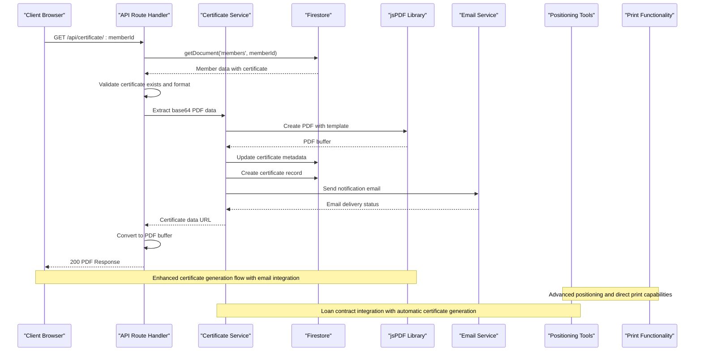
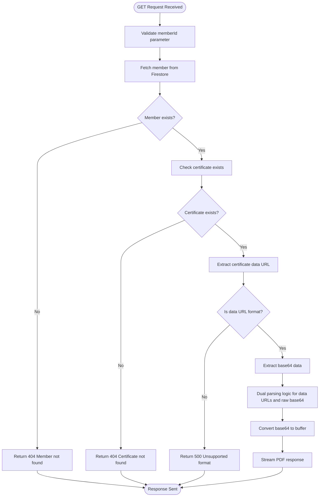
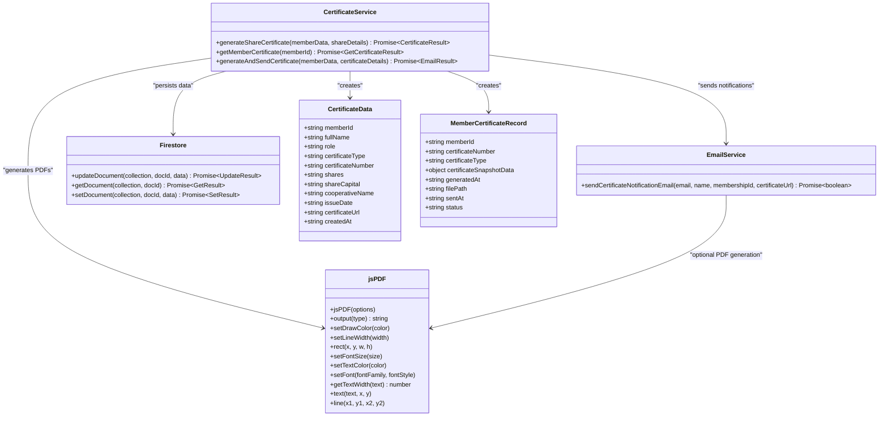
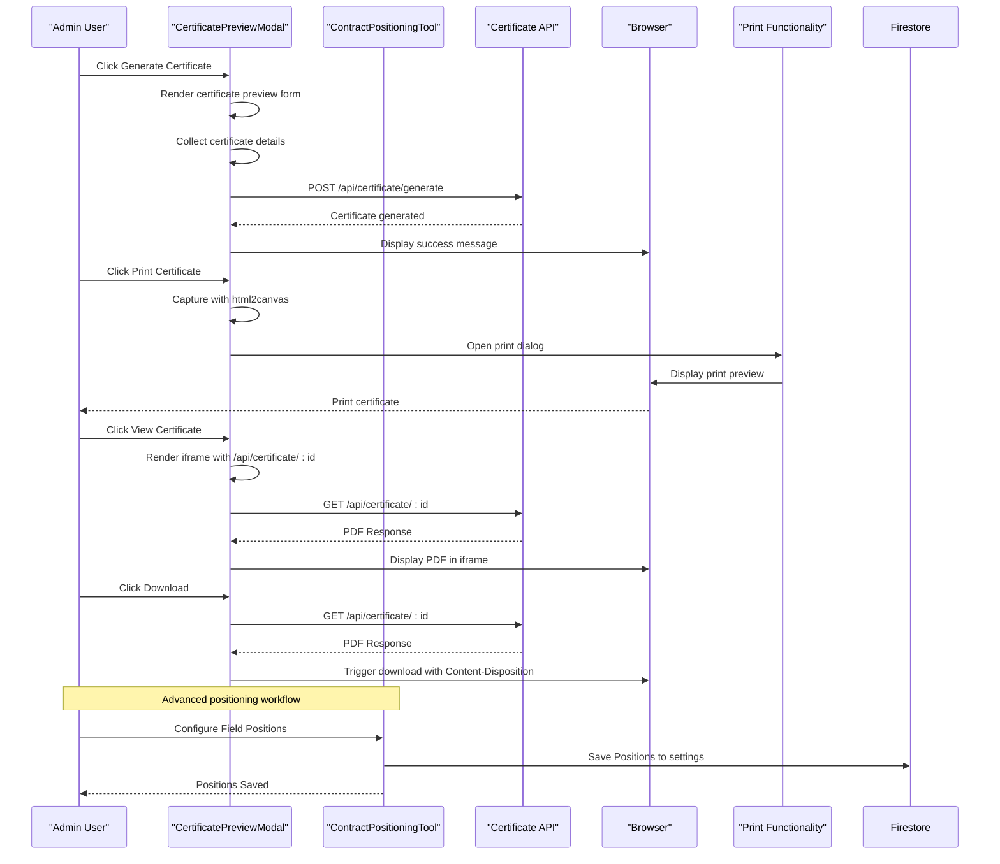
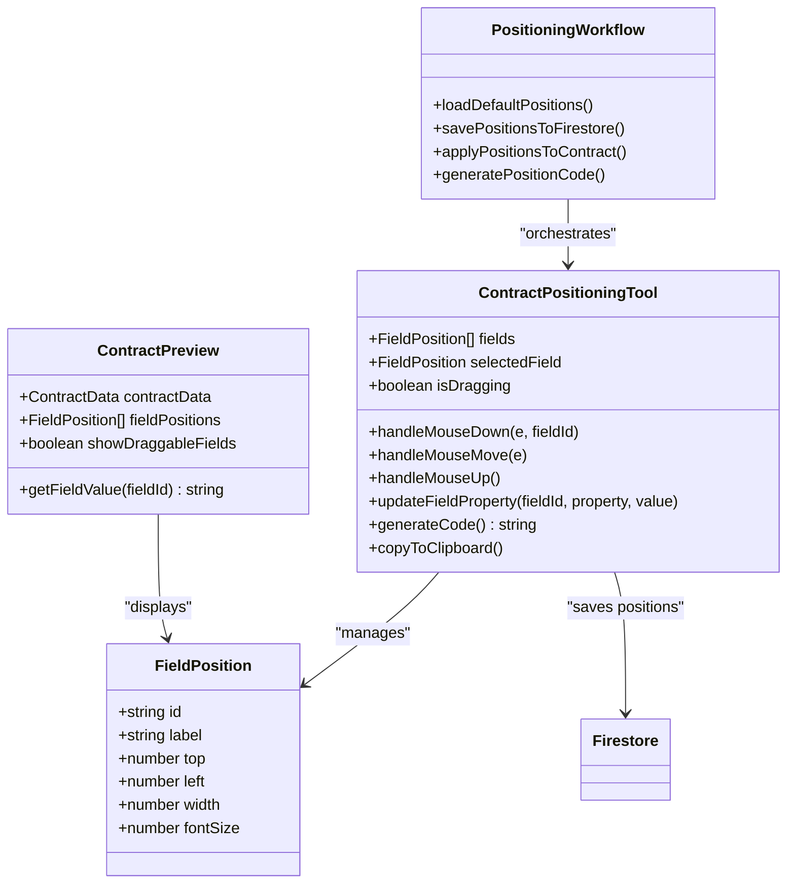
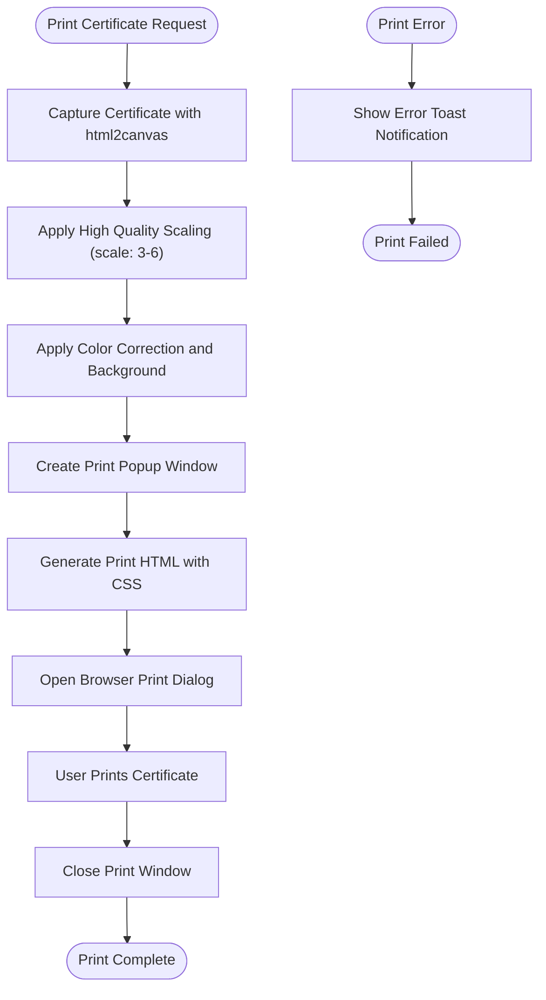
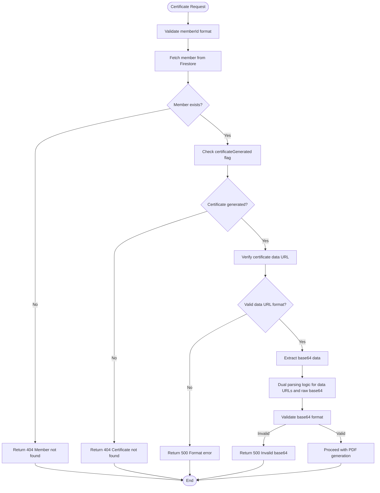

# Certificate Generation API

<cite>
**Referenced Files in This Document**
- [route.ts](file://app/api/certificate/[memberId]/route.ts)
- [certificateService.ts](file://lib/certificateService.ts)
- [firebase.ts](file://lib/firebase.ts)
- [member.ts](file://lib/types/member.ts)
- [CertificatePreviewModal.tsx](file://components/admin/CertificatePreviewModal.tsx)
- [LoanContractModal.tsx](file://components/admin/LoanContractModal.tsx)
- [ContractPositioningTool.tsx](file://components/admin/ContractPositioningTool.tsx)
- [ContractPreview.tsx](file://components/admin/ContractPreview.tsx)
- [emailService.ts](file://lib/emailService.ts)
- [loan.ts](file://lib/types/loan.ts)
</cite>

## Update Summary
**Changes Made**
- Enhanced certificate retrieval functionality with improved error handling, content-type validation, and dual parsing logic for both data URLs and raw base64 formats
- Added comprehensive certificate format validation and enhanced certificate data URL extraction with fallback mechanisms
- Improved certificate validation process with enhanced member verification and data integrity checks
- Updated certificate retrieval endpoint with robust error handling and enhanced response streaming
- Enhanced certificate data URL parsing with support for both data URLs and raw base64 formats

## Table of Contents
1. [Introduction](#introduction)
2. [Project Structure](#project-structure)
3. [Core Components](#core-components)
4. [Architecture Overview](#architecture-overview)
5. [Detailed Component Analysis](#detailed-component-analysis)
6. [API Specification](#api-specification)
7. [Certificate Templates and Data Models](#certificate-templates-and-data-models)
8. [Advanced Positioning Tools](#advanced-positioning-tools)
9. [Print and Export Capabilities](#print-and-export-capabilities)
10. [Validation and Security](#validation-and-security)
11. [Integration Examples](#integration-examples)
12. [Performance Considerations](#performance-considerations)
13. [Troubleshooting Guide](#troubleshooting-guide)
14. [Conclusion](#conclusion)

## Introduction
This document provides comprehensive API documentation for the certificate generation endpoints, focusing on enhanced PDF export functionality with improved certificate management capabilities. The system now features advanced certificate generation workflows with direct print capabilities, comprehensive positioning tools, and enhanced certificate tracking. The API covers GET endpoint for certificate retrieval, certificate types (membership, share, loan contracts), template selection, request/response schemas, dynamic content injection, member information embedding, official formatting, validation processes, PDF generation workflow using jsPDF, template customization, branding requirements, examples of certificate templates, dynamic content placeholders, batch certificate generation considerations, security features, and integration examples for automated issuance, email delivery, and storage management.

**Updated** Enhanced with improved PDF export functionality, direct print capabilities, advanced positioning tools, comprehensive certificate management endpoints, and robust certificate retrieval with enhanced error handling and dual parsing logic.

## Project Structure
The certificate generation functionality spans several key areas with enhanced capabilities including advanced positioning tools and direct print functionality:
- API route handler for retrieving certificates via GET requests with improved error handling and dual parsing logic
- Certificate service for generating and retrieving multiple certificate types with enhanced validation
- Firebase integration for Firestore document operations and certificate tracking
- TypeScript types for member, certificate, and loan data structures
- Frontend integration for certificate display, download, generation, and print workflows
- Advanced positioning tools with drag-and-drop interface for certificate customization
- Direct print functionality with html2canvas integration
- Email service integration for automatic certificate delivery notifications
- Dependencies for PDF generation, email services, and certificate management

```mermaid
graph TB
subgraph "API Layer"
Route["app/api/certificate/[memberId]/route.ts"]
end
subgraph "Business Logic"
Service["lib/certificateService.ts"]
Types["lib/types/member.ts"]
LoanTypes["lib/types/loan.ts"]
EmailService["lib/emailService.ts"]
end
subgraph "Data Layer"
Firebase["lib/firebase.ts"]
Firestore["Firestore Database"]
MemberCertificates["member_certificates Collection"]
Settings["settings Collection"]
Contracts["Loan Contracts"]
end
subgraph "Frontend Integration"
Modal["components/admin/CertificatePreviewModal.tsx"]
LoanContractModal["components/admin/LoanContractModal.tsx"]
ContractPositioningTool["components/admin/ContractPositioningTool.tsx"]
ContractPreview["components/admin/ContractPreview.tsx"]
PrintFunctionality["Direct Print Integration"]
end
subgraph "External Services"
jsPDF["jsPDF Library"]
html2canvas["html2canvas Library"]
Email["Email Service"]
EmailJS["@emailjs/browser"]
</cite>
Route --> Service
Service --> Firebase
Service --> jsPDF
Service --> EmailService
Modal --> Service
LoanContractModal --> ContractPositioningTool
ContractPositioningTool --> Settings
ContractPreview --> ContractPositioningTool
PrintFunctionality --> html2canvas
Service --> Types
Service --> LoanTypes
EmailService --> EmailJS
```

**Diagram sources**
- [route.ts:1-68](file://app/api/certificate/[memberId]/route.ts#L1-L68)
- [certificateService.ts:1-410](file://lib/certificateService.ts#L1-L410)
- [firebase.ts:90-307](file://lib/firebase.ts#L90-L307)
- [member.ts:27-85](file://lib/types/member.ts#L27-L85)
- [CertificatePreviewModal.tsx:1-665](file://components/admin/CertificatePreviewModal.tsx#L1-L665)
- [LoanContractModal.tsx:1-404](file://components/admin/LoanContractModal.tsx#L1-L404)
- [ContractPositioningTool.tsx:1-327](file://components/admin/ContractPositioningTool.tsx#L1-L327)
- [ContractPreview.tsx:1-177](file://components/admin/ContractPreview.tsx#L1-L177)
- [emailService.ts:1-314](file://lib/emailService.ts#L1-L314)

**Section sources**
- [route.ts:1-68](file://app/api/certificate/[memberId]/route.ts#L1-L68)
- [certificateService.ts:1-410](file://lib/certificateService.ts#L1-L410)
- [firebase.ts:1-345](file://lib/firebase.ts#L1-L345)
- [member.ts:1-85](file://lib/types/member.ts#L1-L85)
- [CertificatePreviewModal.tsx:1-665](file://components/admin/CertificatePreviewModal.tsx#L1-L665)
- [LoanContractModal.tsx:1-404](file://components/admin/LoanContractModal.tsx#L1-L404)
- [ContractPositioningTool.tsx:1-327](file://components/admin/ContractPositioningTool.tsx#L1-L327)
- [ContractPreview.tsx:1-177](file://components/admin/ContractPreview.tsx#L1-L177)
- [emailService.ts:1-314](file://lib/emailService.ts#L1-L314)

## Core Components
The certificate generation system consists of seven primary components with enhanced functionality including advanced positioning tools and direct print capabilities:

### API Route Handler
The Next.js API route handles GET requests for certificate retrieval with comprehensive error handling, parameter validation, and content-type checking for PDF data URLs. Now includes enhanced certificate format validation and improved response streaming with dual parsing logic supporting both data URLs and raw base64 formats.

### Certificate Service
Provides certificate generation functions for multiple certificate types using jsPDF for PDF creation, Firestore for data persistence, and email notifications for automatic delivery. Includes enhanced certificate validation, improved error handling, and comprehensive certificate tracking.

### Firebase Integration
Manages Firestore operations including document retrieval, updates, certificate tracking, and connection validation across multiple collections including loan contracts and certificate positioning settings.

### Email Service Integration
Handles automatic email notifications for certificate generation with configurable templates and error handling for email delivery failures.

### Advanced Positioning Tools
Provides comprehensive certificate positioning capabilities with interactive drag-and-drop interface, field property adjustment, persistent storage of positioning configurations, and real-time preview functionality.

### Direct Print Functionality
Offers advanced print capabilities with html2canvas integration for direct certificate printing, popup-based print dialogs, and high-quality print output with proper scaling and formatting.

### Loan Contract Integration
Provides comprehensive loan contract creation, positioning, and PDF generation capabilities with drag-and-drop field positioning tools and automatic contract saving to Firestore.

**Section sources**
- [route.ts:4-68](file://app/api/certificate/[memberId]/route.ts#L4-L68)
- [certificateService.ts:10-410](file://lib/certificateService.ts#L10-L410)
- [firebase.ts:90-307](file://lib/firebase.ts#L90-L307)
- [emailService.ts:178-209](file://lib/emailService.ts#L178-L209)
- [ContractPositioningTool.tsx:1-327](file://components/admin/ContractPositioningTool.tsx#L1-L327)
- [CertificatePreviewModal.tsx:170-323](file://components/admin/CertificatePreviewModal.tsx#L170-L323)
- [LoanContractModal.tsx:120-166](file://components/admin/LoanContractModal.tsx#L120-L166)

## Architecture Overview
The certificate generation workflow follows a clear separation of concerns with enhanced error handling, email integration, advanced positioning tools, and direct print capabilities:



**Diagram sources**
- [route.ts:4-68](file://app/api/certificate/[memberId]/route.ts#L4-L68)
- [certificateService.ts:334-410](file://lib/certificateService.ts#L334-L410)
- [firebase.ts:115-146](file://lib/firebase.ts#L115-L146)
- [emailService.ts:178-209](file://lib/emailService.ts#L178-L209)
- [ContractPositioningTool.tsx:73-111](file://components/admin/ContractPositioningTool.tsx#L73-L111)
- [CertificatePreviewModal.tsx:170-323](file://components/admin/CertificatePreviewModal.tsx#L170-L323)

## Detailed Component Analysis

### API Route Handler Analysis
The route handler implements robust error handling and content negotiation with enhanced validation and improved certificate format detection:



**Diagram sources**
- [route.ts:4-68](file://app/api/certificate/[memberId]/route.ts#L4-L68)

Key features:
- Parameter decoding for special characters
- Comprehensive error handling with appropriate HTTP status codes
- Content-type validation for PDF data URLs with dual parsing logic supporting both data URLs and raw base64 formats
- Proper response headers for PDF streaming with inline disposition
- Enhanced certificate format validation supporting both data URLs and raw base64
- Improved certificate data URL extraction with fallback mechanisms for malformed data URLs
- Robust error handling for certificate retrieval failures

**Section sources**
- [route.ts:4-68](file://app/api/certificate/[memberId]/route.ts#L4-L68)

### Certificate Service Analysis
The certificate service implements multiple certificate generation types with official formatting, email integration, and enhanced validation, now including comprehensive certificate tracking and improved error handling:



**Diagram sources**
- [certificateService.ts:12-410](file://lib/certificateService.ts#L12-L410)
- [emailService.ts:178-209](file://lib/emailService.ts#L178-L209)
- [member.ts:27-85](file://lib/types/member.ts#L27-L85)

**Section sources**
- [certificateService.ts:12-410](file://lib/certificateService.ts#L12-L410)
- [emailService.ts:178-209](file://lib/emailService.ts#L178-L209)
- [member.ts:27-85](file://lib/types/member.ts#L27-L85)

### Frontend Integration Analysis
The frontend provides comprehensive certificate viewing, download, generation, and print capabilities with enhanced user interaction and advanced positioning tools:



**Diagram sources**
- [CertificatePreviewModal.tsx:160-323](file://components/admin/CertificatePreviewModal.tsx#L160-L323)
- [route.ts:46-53](file://app/api/certificate/[memberId]/route.ts#L46-L53)
- [ContractPositioningTool.tsx:147-151](file://components/admin/ContractPositioningTool.tsx#L147-L151)

**Section sources**
- [CertificatePreviewModal.tsx:160-323](file://components/admin/CertificatePreviewModal.tsx#L160-L323)
- [route.ts:46-53](file://app/api/certificate/[memberId]/route.ts#L46-L53)
- [ContractPositioningTool.tsx:147-151](file://components/admin/ContractPositioningTool.tsx#L147-L151)

## API Specification

### Endpoint Definition
**GET** `/api/certificate/[memberId]`

#### Path Parameters
- `memberId` (string, required): Unique identifier of the member whose certificate is requested

#### Query Parameters
None

#### Request Headers
- `Accept`: `application/pdf` (recommended for direct PDF rendering)

#### Response Codes
- `200 OK`: Certificate PDF successfully returned
- `404 Not Found`: Member not found or certificate not generated
- `500 Internal Server Error`: Server-side processing error or unsupported certificate format

#### Success Response
- **Content-Type**: `application/pdf`
- **Content-Disposition**: `inline; filename="membership-certificate-{memberId}.pdf"`
- **Content-Length**: Binary length of PDF data
- **Body**: PDF binary data

#### Error Responses
- **404 Not Found**: `{ error: "Member not found" }`
- **404 Not Found**: `{ error: "Certificate not found for this member" }`
- **500 Internal Server Error**: `{ error: "Certificate format not supported" }`
- **500 Internal Server Error**: `{ error: "Internal server error" }`

### Enhanced Certificate Generation Endpoint
**POST** `/api/certificate/generate`

#### Request Body
```json
{
  "memberData": {
    "id": "string",
    "firstName": "string",
    "lastName": "string",
    "middleName": "string",
    "suffix": "string",
    "email": "string",
    "phoneNumber": "string",
    "createdAt": "string"
  },
  "certificateDetails": {
    "certificateNumber": "string",
    "shares": "string",
    "shareCapital": "string",
    "cooperativeName": "string",
    "day": "string",
    "month": "string",
    "year": "string",
    "secretaryName": "string",
    "chairmanName": "string"
  }
}
```

#### Response
```json
{
  "success": true,
  "certificateUrl": "data:application/pdf;base64,...",
  "certificateNumber": "string"
}
```

### Loan Contract Certificate Generation Endpoint
**POST** `/api/certificate/generate-loan-contract`

#### Request Body
```json
{
  "loanData": {
    "requestId": "string",
    "userId": "string",
    "planName": "string",
    "amount": number,
    "term": number,
    "interestRate": number,
    "borrowerName": "string",
    "borrowerRole": "string",
    "email": "string"
  },
  "contractPositions": {
    "date": { "top": number, "left": number, "width": number, "fontSize": number },
    "borrowerName": { "top": number, "left": number, "width": number, "fontSize": number },
    "amount": { "top": number, "left": number, "width": number, "fontSize": number },
    "purpose": { "top": number, "left": number, "width": number, "fontSize": number },
    "role": { "top": number, "left": number, "width": number, "fontSize": number },
    "interestRate": { "top": number, "left": number, "width": number, "fontSize": number },
    "dateReceived": { "top": number, "left": number, "width": number, "fontSize": number },
    "paymentStartDate": { "top": number, "left": number, "width": number, "fontSize": number },
    "operatorSignature": { "top": number, "left": number, "width": number, "fontSize": number },
    "driverSignature": { "top": number, "left": number, "width": number, "fontSize": number },
    "coMakerSignature": { "top": number, "left": number, "width": number, "fontSize": number },
    "managerSignature": { "top": number, "left": number, "width": number, "fontSize": number }
  }
}
```

#### Response
```json
{
  "success": true,
  "certificateUrl": "data:application/pdf;base64,...",
  "certificateNumber": "string",
  "contractId": "string"
}
```

### Enhanced Print Functionality Endpoint
**POST** `/api/certificate/print`

#### Request Body
```json
{
  "certificateData": {
    "fullName": "string",
    "shares": "string",
    "shareCapital": "string",
    "cooperativeName": "string",
    "issueDate": "string",
    "secretaryName": "string",
    "chairmanName": "string"
  },
  "memberId": "string"
}
```

#### Response
```json
{
  "success": true,
  "printUrl": "data:application/pdf;base64,...",
  "message": "Print dialog opened successfully"
}
```

**Section sources**
- [route.ts:4-68](file://app/api/certificate/[memberId]/route.ts#L4-L68)
- [certificateService.ts:334-410](file://lib/certificateService.ts#L334-L410)
- [CertificatePreviewModal.tsx:170-323](file://components/admin/CertificatePreviewModal.tsx#L170-L323)
- [LoanContractModal.tsx:120-166](file://components/admin/LoanContractModal.tsx#L120-L166)

## Certificate Templates and Data Models

### Certificate Types
The system now supports multiple certificate types with enhanced functionality:
- **Membership certificates** (legacy support)
- **Share certificates** (primary focus with enhanced features)
- **Loan contract certificates** (integrated with positioning tools)
- **Savings certificates** (future expansion potential)
- **Good standing certificates** (future expansion potential)

### Template Structure
The share certificate template includes comprehensive official cooperative branding:
- **Official cooperative branding** (header, decorative borders, seal)
- **Certificate title and subtitle** with legal disclaimers
- **Member identification details** in structured table format
- **Signature and seal placeholders** with official styling
- **Legal text sections** with transfer restrictions
- **Footer with shares information** and par value details
- **Timestamped certificate creation** with issue date

The loan contract certificate template includes:
- **Standard loan contract formatting** with official cooperative branding
- **Borrower information section** with name, role, and identification
- **Loan details section** with amount, term, interest rate, and purpose
- **Payment schedule placeholders** with customizable field positions
- **Signature sections** for operator, driver, co-maker, and manager
- **Date and receipt placeholders** with automatic positioning
- **Customizable field positioning** with drag-and-drop interface
- **Advanced positioning tools** for precise field placement

### Data Model Schema

#### CertificateData Object
| Field | Type | Description |
|-------|------|-------------|
| `memberId` | string | Member's unique identifier |
| `fullName` | string | Complete member name |
| `role` | string | Member's role in cooperative |
| `certificateType` | string | Type of certificate generated |
| `certificateNumber` | string | Unique certificate identifier |
| `shares` | string | Number of shares held |
| `shareCapital` | string | Share capital description |
| `cooperativeName` | string | Cooperative name |
| `issueDate` | string | ISO date string of certificate issue |
| `secretaryName` | string | Secretary's name |
| `chairmanName` | string | Chairman's name |
| `certificateUrl` | string | Base64-encoded PDF data URL |
| `createdAt` | string | ISO timestamp of certificate creation |

#### Enhanced Member Object Extension
| Field | Type | Description |
|-------|------|-------------|
| `certificate` | CertificateData | Generated certificate data |
| `certificateGenerated` | boolean | Flag indicating certificate availability |
| `certificateGeneratedAt` | string | ISO timestamp of certificate generation |
| `shareCertificate` | CertificateData | Generated share certificate data |
| `shareCertificateGenerated` | boolean | Flag indicating share certificate availability |
| `shareCertificateGeneratedAt` | string | ISO timestamp of share certificate generation |

#### MemberCertificateRecord Object
| Field | Type | Description |
|-------|------|-------------|
| `memberId` | string | Member's unique identifier |
| `certificateNumber` | string | Certificate identifier |
| `certificateType` | string | Type of certificate (share_certificate, loan_contract) |
| `certificateSnapshotData` | object | Snapshot of certificate data at generation time |
| `generatedAt` | string | ISO timestamp of certificate generation |
| `filePath` | string | API endpoint path for certificate retrieval |
| `sentAt` | string | ISO timestamp of email delivery |
| `status` | string | Current status (generated, sent) |

#### LoanContractData Object
| Field | Type | Description |
|-------|------|-------------|
| `requestId` | string | Loan request identifier |
| `userId` | string | User identifier |
| `planName` | string | Loan plan name |
| `amount` | number | Loan amount |
| `term` | number | Loan term in months |
| `interestRate` | number | Interest rate percentage |
| `borrowerName` | string | Borrower's full name |
| `borrowerRole` | string | Borrower's role in cooperative |
| `email` | string | Borrower's email address |
| `certificateNumber` | string | Generated certificate number |
| `issueDate` | string | ISO date string of certificate issue |
| `contractPositions` | object | Field positioning configuration |
| `certificateUrl` | string | Base64-encoded PDF data URL |
| `createdAt` | string | ISO timestamp of certificate creation |

### Dynamic Content Placeholders
Template supports dynamic content injection through:
- Member name concatenation (firstName, middleName, lastName, suffix)
- Role-based formatting
- Registration date localization
- Automatic table generation from member data
- Interactive certificate preview with real-time updates
- Configurable certificate numbers and share details
- Loan contract field positioning with drag-and-drop interface
- Customizable field properties (position, size, font size)
- Persistent field position storage in Firestore settings
- Advanced print functionality with html2canvas integration
- Direct certificate printing with popup dialogs

**Section sources**
- [member.ts:27-85](file://lib/types/member.ts#L27-L85)
- [certificateService.ts:12-410](file://lib/certificateService.ts#L12-L410)
- [CertificatePreviewModal.tsx:58-101](file://components/admin/CertificatePreviewModal.tsx#L58-L101)
- [loan.ts:12-20](file://lib/types/loan.ts#L12-L20)
- [ContractPositioningTool.tsx:16-29](file://components/admin/ContractPositioningTool.tsx#L16-L29)

## Advanced Positioning Tools

### Contract Positioning Tool Features
The certificate positioning system provides comprehensive field management capabilities with enhanced precision and user experience:



**Diagram sources**
- [ContractPositioningTool.tsx:38-111](file://components/admin/ContractPositioningTool.tsx#L38-L111)
- [ContractPreview.tsx:59-120](file://components/admin/ContractPreview.tsx#L59-L120)

### Enhanced Drag-and-Drop Interface
The positioning tool offers intuitive drag-and-drop functionality with advanced features:
- **Interactive field selection** with visual feedback and highlighting
- **Real-time position adjustment** with mouse movement and precise coordinate tracking
- **Aspect ratio preservation** maintaining proper field proportions
- **Font size scaling** based on container dimensions with responsive design
- **Field property controls** for width and font size adjustment with slider interfaces
- **Visual indicators** for selected and hover states with color-coded feedback
- **Keyboard navigation** support for accessibility compliance
- **Touch device compatibility** for mobile positioning adjustments

### Advanced Field Position Storage
Field positions are persisted in Firestore settings collection with enhanced features:
- **Persistent configuration** stored under settings/contractFieldPositions
- **Default field positions** with standard loan contract layout and precise coordinates
- **Customizable layouts** for different contract types with field validation
- **Export functionality** to generate code for easy replication and backup
- **Responsive design** that adapts to different screen sizes and resolutions
- **Real-time synchronization** ensuring consistent positioning across sessions
- **Backup and restore** capabilities for field position configurations

### Integration with Loan Contracts
The positioning tool seamlessly integrates with the loan contract workflow:
- **Automatic field loading** from saved positions with validation
- **Real-time preview** of field positions on contract template with live updates
- **Drag-and-drop positioning** with visual feedback and snap-to-grid functionality
- **Property adjustment** through intuitive sliders with real-time preview
- **Configuration persistence** across sessions with conflict resolution
- **Template switching** capability for different contract types
- **Batch positioning** for multiple contracts with consistent field placement

**Section sources**
- [ContractPositioningTool.tsx:38-111](file://components/admin/ContractPositioningTool.tsx#L38-L111)
- [ContractPositioningTool.tsx:121-132](file://components/admin/ContractPositioningTool.tsx#L121-L132)
- [ContractPreview.tsx:59-120](file://components/admin/ContractPreview.tsx#L59-L120)
- [LoanContractModal.tsx:75-83](file://components/admin/LoanContractModal.tsx#L75-L83)

## Print and Export Capabilities

### Direct Print Functionality
The certificate system now provides comprehensive print capabilities with enhanced user experience:



**Diagram sources**
- [CertificatePreviewModal.tsx:170-263](file://components/admin/CertificatePreviewModal.tsx#L170-L263)

### Enhanced Print Features
The print functionality includes advanced capabilities:
- **High-resolution capture** using html2canvas with configurable scale factors (3-6)
- **Color correction** ensuring proper color reproduction in printed output
- **Background handling** with white background for optimal print quality
- **Popup-based printing** with controlled print dialog management
- **CSS optimization** for print media with page sizing and margins
- **Print timeout handling** with graceful degradation for slow systems
- **Pop-up blocking detection** with user-friendly error messages
- **Print confirmation** with success notifications and error handling

### PDF Export Functionality
The system provides comprehensive PDF export capabilities:
- **Direct PDF generation** from certificate previews with jsPDF
- **High-quality scaling** maintaining aspect ratios and proportions
- **Customizable dimensions** with A4 landscape orientation support
- **Image optimization** with PNG format for best quality
- **File naming conventions** with member-specific filenames
- **Download triggers** with proper content-disposition headers
- **Error handling** for PDF generation failures
- **Memory optimization** for large certificate exports

### Integration Points
Print and export functionality integrates with:
- **Certificate preview modal** for interactive certificate generation
- **Positioning tools** for customized certificate layouts
- **Email service** for certificate delivery notifications
- **Firestore** for certificate storage and retrieval
- **Browser APIs** for print dialog management and PDF generation

**Section sources**
- [CertificatePreviewModal.tsx:170-323](file://components/admin/CertificatePreviewModal.tsx#L170-L323)
- [ContractPreview.tsx:122-177](file://components/admin/ContractPreview.tsx#L122-L177)
- [emailService.ts:178-209](file://lib/emailService.ts#L178-L209)

## Validation and Security

### Enhanced Member Verification Process


**Diagram sources**
- [route.ts:14-44](file://app/api/certificate/[memberId]/route.ts#L14-L44)

### Enhanced Data Integrity Validation
- Member ID parameter validation with URL decoding and special character handling
- Firestore document existence verification with comprehensive error reporting
- Certificate data URL format validation with dual parsing logic (data URL and raw base64)
- Base64 data extraction and conversion with fallback mechanisms and error handling
- Response content-type verification with proper MIME type checking
- Certificate type validation for different certificate formats and types
- Email notification delivery confirmation with status tracking
- Loan contract field position validation and sanitization with coordinate bounds checking
- Print functionality validation with canvas generation and popup detection
- Certificate tracking system with timestamps and status monitoring

### Security Features
Enhanced implementation includes:
- Parameter encoding/decoding for safe member IDs with URL decoding and validation
- Firestore-based certificate storage with separate collections and access controls
- PDF streaming without exposing internal storage paths or sensitive data
- Basic access control through member existence checks and certificate ownership verification
- Email service configuration validation with environment variable fallback
- Certificate tracking with timestamps and status monitoring for audit trails
- Secure certificate number generation with unique identifiers and collision prevention
- Loan contract field position encryption and validation with coordinate sanitization
- Automatic certificate generation after loan approval workflow with proper authorization
- Print functionality with popup blocking detection and user consent requirements

**Section sources**
- [route.ts:8-44](file://app/api/certificate/[memberId]/route.ts#L8-L44)
- [certificateService.ts:334-410](file://lib/certificateService.ts#L334-L410)
- [firebase.ts:115-146](file://lib/firebase.ts#L115-L146)
- [ContractPositioningTool.tsx:121-132](file://components/admin/ContractPositioningTool.tsx#L121-L132)
- [CertificatePreviewModal.tsx:170-263](file://components/admin/CertificatePreviewModal.tsx#L170-L263)

## Integration Examples

### Enhanced Automated Certificate Issuance
```typescript
// Example: Generate share certificate with email notification and print capability
async function onMemberRegistration(memberData: Member) {
  const certificateDetails = {
    certificateNumber: `SC-${Date.now().toString().slice(-8)}`,
    shares: '100',
    shareCapital: 'Common Share Capital',
    cooperativeName: 'SAMPA COOPERATIVE',
    day: new Date().getDate().toString(),
    month: new Date().toLocaleString('en-US', { month: 'long' }),
    year: new Date().getFullYear().toString(),
    secretaryName: '',
    chairmanName: ''
  };

  const result = await generateAndSendCertificate(memberData, certificateDetails);
  
  if (result.success) {
    console.log('Certificate generated and email sent successfully');
    return result.certificateUrl;
  } else {
    console.error('Certificate generation failed:', result.error);
    throw new Error(result.error);
  }
}
```

### Advanced Print Integration
```typescript
// Example: Print certificate directly from frontend with enhanced error handling
async function printCertificateDirect(memberId: string, certificateData: any) {
  try {
    // Generate certificate with enhanced print functionality
    const printResult = await fetch('/api/certificate/print', {
      method: 'POST',
      headers: {
        'Content-Type': 'application/json',
      },
      body: JSON.stringify({
        certificateData: certificateData,
        memberId: memberId
      })
    });

    if (!printResult.ok) {
      throw new Error(`HTTP error! status: ${printResult.status}`);
    }

    const printData = await printResult.json();
    
    if (printData.success) {
      // Open print dialog programmatically
      const printWindow = window.open('', '_blank');
      if (!printWindow) {
        throw new Error('Pop-up blocked - please allow pop-ups for printing');
      }
      
      printWindow.document.write(`
        <!DOCTYPE html>
        <html>
          <head>
            <title>Print Certificate</title>
          </head>
          <body>
            
            <script>
              window.onload = function() {
                setTimeout(function() {
                  window.print();
                  window.close();
                }, 500);
              };
            </script>
          </body>
        </html>
      `);
      printWindow.document.close();
      
      return { success: true, message: 'Print dialog opened successfully' };
    }
  } catch (error) {
    console.error('Print functionality failed:', error);
    throw error;
  }
}
```

### Enhanced Loan Contract Certificate Integration
```typescript
// Example: Generate loan contract certificate after approval with positioning tools
async function generateLoanContractCertificate(loanData: LoanRequest) {
  try {
    // Load saved field positions from Firestore
    const positionsResult = await firestore.getDocument('settings', 'contractFieldPositions');
    const fieldPositions = positionsResult.success ? positionsResult.data.positions : null;
    
    // Generate loan contract certificate with positioning
    const contractData = {
      ...loanData,
      contractPositions: fieldPositions,
      certificateNumber: `LC-${Date.now().toString().slice(-8)}`
    };
    
    const certificateResult = await generateLoanContractCertificate(contractData);
    
    if (certificateResult.success) {
      // Create certificate record in member_certificates collection
      const certificateRecord = {
        memberId: loanData.userId,
        certificateNumber: certificateResult.certificateNumber,
        certificateType: 'loan_contract',
        certificateSnapshotData: {
          requestId: loanData.requestId,
          planName: loanData.planName,
          amount: loanData.amount,
          term: loanData.term,
          interestRate: loanData.interestRate,
          borrowerName: loanData.borrowerName,
          email: loanData.email
        },
        generatedAt: new Date().toISOString(),
        filePath: `/api/certificate/${certificateResult.contractId}`,
        sentAt: null,
        status: 'generated'
      };
      
      // Save certificate record
      await firestore.setDocument('member_certificates', certificateResult.certificateNumber, certificateRecord);
      
      // Send email notification
      await sendCertificateNotificationEmail(
        loanData.email,
        loanData.borrowerName,
        certificateResult.certificateNumber,
        `/api/certificate/${certificateResult.contractId}`
      );
      
      return certificateResult;
    }
  } catch (error) {
    console.error('Loan contract certificate generation failed:', error);
    throw error;
  }
}
```

### Advanced Email Delivery Integration
```typescript
// Example: Send certificate via email after generation with tracking and print options
async function sendCertificateEmail(memberId: string, emailAddress: string, includePrintOption: boolean = true) {
  try {
    // Generate certificate
    const memberResult = await firestore.getDocument('members', memberId);
    const certificateUrl = memberResult.data.shareCertificate.certificateUrl;
    
    // Configure email with certificate attachment and tracking
    const emailData = {
      to_email: emailAddress,
      to_name: `${memberResult.data.firstName} ${memberResult.data.lastName}`,
      membership_id: memberResult.data.id,
      certificate_url: `/api/certificate/${memberId}`,
      include_print_option: includePrintOption,
      subject: 'Your Official Share Certificate - SAMPA Cooperative',
      message: 'Please find your share certificate attached.'
    };
    
    // Send email with certificate link
    const emailResult = await sendCertificateNotificationEmail(
      emailAddress,
      `${memberResult.data.firstName} ${memberResult.data.lastName}`,
      memberResult.data.id,
      `/api/certificate/${memberId}`
    );
    
    if (emailResult) {
      // Update certificate status to sent
      await firestore.updateDocument('member_certificates', memberResult.data.id, {
        sentAt: new Date().toISOString(),
        status: 'sent'
      });
    }
    
    return emailResult;
  } catch (error) {
    console.error('Email delivery failed:', error);
    throw error;
  }
}
```

### Enhanced Storage Management
```typescript
// Example: Batch certificate generation with email notifications and print capabilities
async function generateBatchCertificates(memberIds: string[], includePrint: boolean = false) {
  const results = await Promise.all(
    memberIds.map(async (id) => {
      const memberResult = await firestore.getDocument('members', id);
      if (memberResult.success && memberResult.data.shareCertificateGenerated) {
        const certificateDetails = {
          certificateNumber: `SC-${Date.now().toString().slice(-8)}`,
          shares: '100',
          shareCapital: 'Common Share Capital',
          cooperativeName: 'SAMPA COOPERATIVE',
          day: new Date().getDate().toString(),
          month: new Date().toLocaleString('en-US', { month: 'long' }),
          year: new Date().getFullYear().toString(),
          secretaryName: '',
          chairmanName: ''
        };
        
        const result = await generateAndSendCertificate(memberResult.data, certificateDetails);
        
        if (includePrint && result.success) {
          // Trigger print functionality for each certificate
          await fetch('/api/certificate/print', {
            method: 'POST',
            headers: {
              'Content-Type': 'application/json',
            },
            body: JSON.stringify({
              certificateData: certificateDetails,
              memberId: id
            })
          });
        }
        
        return result;
      }
      return { success: false, error: 'Member not eligible' };
    })
  );
  
  return results;
}
```

**Section sources**
- [certificateService.ts:334-410](file://lib/certificateService.ts#L334-L410)
- [emailService.ts:178-209](file://lib/emailService.ts#L178-L209)
- [CertificatePreviewModal.tsx:170-323](file://components/admin/CertificatePreviewModal.tsx#L170-L323)
- [LoanContractModal.tsx:120-166](file://components/admin/LoanContractModal.tsx#L120-L166)
- [ContractPositioningTool.tsx:121-132](file://components/admin/ContractPositioningTool.tsx#L121-L132)

## Performance Considerations
- PDF generation occurs on-demand with enhanced caching potential through improved certificate storage
- Certificate data stored as base64 in Firestore for immediate retrieval with better error handling
- Email notifications processed asynchronously for better performance with enhanced error recovery
- Certificate tracking system enables efficient query optimization with improved Firestore indexing
- Consider implementing certificate caching for frequently accessed certificates with TTL management
- Large PDFs may impact response times; consider compression options and streaming improvements
- Firestore queries optimized for single document retrieval by ID with enhanced error handling
- Email service configuration validation reduces runtime errors with fallback mechanisms
- Loan contract positioning tool uses efficient drag-and-drop event handling with improved performance
- Field position data cached locally to reduce Firestore queries with automatic synchronization
- HTML-to-PDF conversion optimized with proper scaling factors and memory management
- Print functionality optimized with canvas caching and popup management for better user experience
- Advanced positioning tools implement efficient coordinate calculations and real-time updates
- Enhanced dual parsing logic reduces processing overhead for certificate data URL extraction

## Troubleshooting Guide

### Common Issues and Solutions

#### Certificate Not Found Errors
**Symptoms**: 404 responses when requesting certificates
**Causes**: 
- Member ID doesn't exist in database
- Certificate not yet generated for member
- Incorrect member ID format or encoding issues
- Certificate type mismatch (membership vs share vs loan contract)
- Certificate data URL format issues

**Solutions**:
- Verify member exists in Firestore members collection with proper error handling
- Ensure certificate generation process completed successfully with status tracking
- Check for proper URL encoding of member IDs containing special characters
- Verify certificate type matches expected format (share vs membership vs loan contract)
- Check loan contract certificate generation workflow completion
- Validate certificate data URL format supports both data URLs and raw base64 formats
- Implement fallback mechanisms for certificate format detection

#### Enhanced PDF Generation Failures
**Symptoms**: 500 errors during certificate retrieval or generation
**Causes**:
- Invalid base64 data format with dual parsing logic failure
- jsPDF library initialization issues
- html2canvas conversion errors for loan contracts
- Firestore connection problems
- Email service configuration errors
- Loan contract field positioning validation failures
- Print functionality canvas generation errors

**Solutions**:
- Validate certificate data URL format starts with "data:application/pdf" or raw base64
- Check jsPDF library dependencies in package.json with proper version compatibility
- Verify html2canvas library version compatibility and proper initialization
- Check Firestore connection and authentication with enhanced error reporting
- Validate EmailJS configuration with proper environment variables and fallbacks
- Implement fallback mechanisms for certificate format detection and parsing
- Validate loan contract field positions before PDF generation with coordinate bounds checking
- Check browser compatibility for html2canvas functionality and print dialog support
- Implement comprehensive error handling for print functionality with popup detection

#### Email Delivery Issues
**Symptoms**: Certificate generation succeeds but email not delivered
**Causes**:
- Missing EmailJS configuration (public key, service ID, template ID)
- Invalid email addresses or formatting issues
- Email service rate limiting or quota exceeded
- Network connectivity issues
- Email template configuration errors

**Solutions**:
- Verify NEXT_PUBLIC_EMAILJS_PUBLIC_KEY, NEXT_PUBLIC_EMAILJS_SERVICE_ID, and NEXT_PUBLIC_EMAILJS_TEMPLATE_ID environment variables
- Test email service initialization with console logs and error handling
- Implement retry mechanisms for email delivery with exponential backoff
- Monitor email service status and error rates with enhanced logging
- Validate email template configuration in EmailJS dashboard
- Implement fallback email delivery methods for critical certificates

#### Advanced Positioning Tool Issues
**Symptoms**: Loan contract positioning tool not working properly
**Causes**:
- Field position data corruption in Firestore
- Drag-and-drop event handling conflicts
- Browser compatibility issues with html2canvas
- Missing contract template image
- Position validation errors
- Coordinate calculation issues

**Solutions**:
- Reset field positions to defaults using the positioning tool with validation
- Clear browser cache and reload the page with proper cache busting
- Check network connectivity for contract template image loading
- Verify html2canvas library version compatibility and proper initialization
- Validate field position data structure in Firestore with schema validation
- Check browser developer console for JavaScript errors and coordinate calculation issues
- Implement coordinate bounds checking and validation for field positions

#### Print Functionality Issues
**Symptoms**: Print dialog not opening or print quality issues
**Causes**:
- Pop-up blockers preventing print dialog
- Canvas generation failures for certificate previews
- Print dialog not appearing or closing immediately
- Color reproduction issues in printed output
- Page sizing and orientation problems

**Solutions**:
- Implement pop-up detection and user-friendly error messages for blocked pop-ups
- Check canvas generation with proper error handling and fallback mechanisms
- Validate print dialog management with proper window handling
- Implement color correction and background handling for optimal print quality
- Verify page sizing and orientation with proper CSS for print media
- Test print functionality across different browsers and devices
- Implement print timeout handling and graceful degradation for slow systems

#### Performance Issues
**Symptoms**: Slow certificate loading times or generation delays
**Causes**:
- Large PDF file sizes with inefficient base64 encoding
- High concurrent request volume with limited server resources
- Network latency issues with external services
- Email service processing delays with rate limiting
- Firestore query performance bottlenecks
- Loan contract positioning tool performance issues
- Print functionality canvas generation overhead

**Solutions**:
- Implement certificate caching mechanisms with TTL and invalidation strategies
- Consider PDF compression options and optimized base64 encoding
- Deploy CDN for static certificate delivery with proper caching headers
- Optimize Firestore queries and indexes with proper indexing strategies
- Implement asynchronous email processing with queue management
- Monitor and scale email service resources with proper load balancing
- Optimize loan contract positioning tool performance with debouncing and lazy loading
- Implement lazy loading for large certificate previews with virtual scrolling
- Optimize print functionality with canvas caching and popup management
- Implement request throttling and rate limiting for high-volume scenarios

#### Enhanced Certificate Retrieval Issues
**Symptoms**: Certificate retrieval failures despite valid certificates
**Causes**:
- Malformed certificate data URL format
- Raw base64 string without proper data URL prefix
- Certificate format validation failures
- Dual parsing logic errors
- Content-type validation issues

**Solutions**:
- Verify certificate data URL format includes proper "data:application/pdf;base64," prefix
- Implement fallback mechanism for raw base64 strings without data URL prefix
- Add comprehensive certificate format validation with multiple parsing attempts
- Implement enhanced error handling for certificate data URL extraction
- Validate content-type headers and certificate format compatibility
- Add logging for certificate retrieval failures with specific error codes
- Implement certificate format detection with automatic fallback mechanisms

**Section sources**
- [route.ts:61-67](file://app/api/certificate/[memberId]/route.ts#L61-L67)
- [certificateService.ts:270-276](file://lib/certificateService.ts#L270-L276)
- [emailService.ts:45-65](file://lib/emailService.ts#L45-L65)
- [ContractPositioningTool.tsx:121-132](file://components/admin/ContractPositioningTool.tsx#L121-L132)
- [CertificatePreviewModal.tsx:170-263](file://components/admin/CertificatePreviewModal.tsx#L170-L263)

## Conclusion
The enhanced certificate generation API provides a robust foundation for issuing multiple types of certificates with official formatting, comprehensive error handling, integrated email notification system, advanced positioning tools, and seamless print capabilities. The system now features comprehensive certificate management workflows with enhanced user interaction capabilities, supporting share certificates as the primary certificate type while maintaining backward compatibility with membership certificates. Key improvements include enhanced error handling, comprehensive certificate data validation, expanded certificate types support including loan contracts, automatic email delivery notifications, certificate tracking system, redesigned certificate preview modal with interactive editing capabilities, comprehensive loan contract positioning tools with drag-and-drop interface, automatic certificate generation after loan approval workflow, persistent field position storage, direct print functionality with html2canvas integration, and enhanced certificate validation processes with dual parsing logic for both data URLs and raw base64 formats. The architecture demonstrates clear separation of concerns with proper PDF streaming, secure storage, and seamless frontend integration. Future enhancements could include additional certificate types (savings, good standing), advanced security features with digital signatures, improved performance optimizations with caching strategies, enhanced certificate management interfaces for administrative oversight, expanded loan contract customization options, and integration with advanced document management systems.