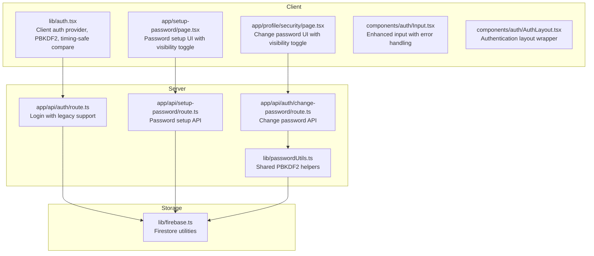
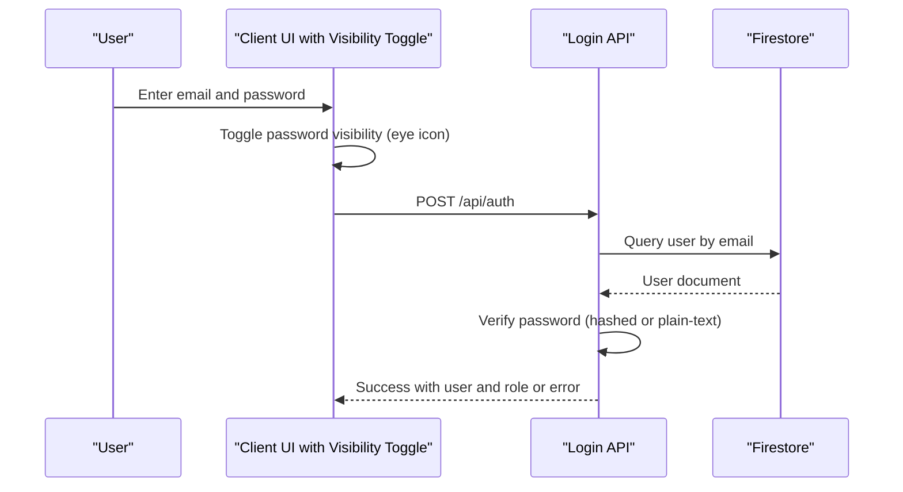
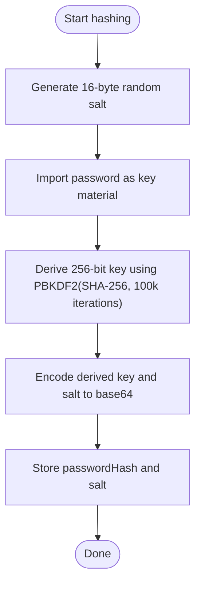
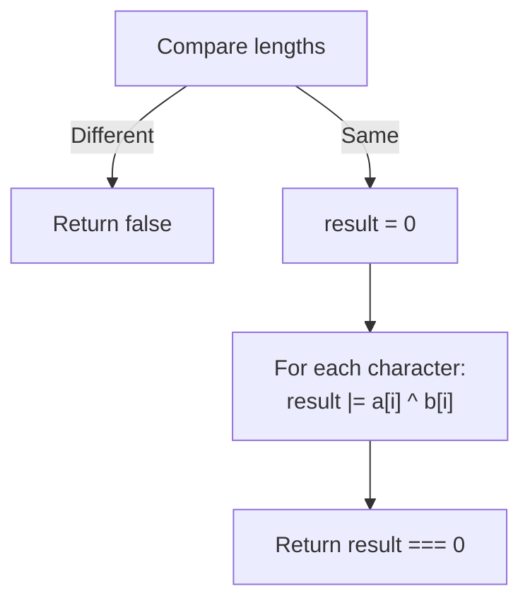
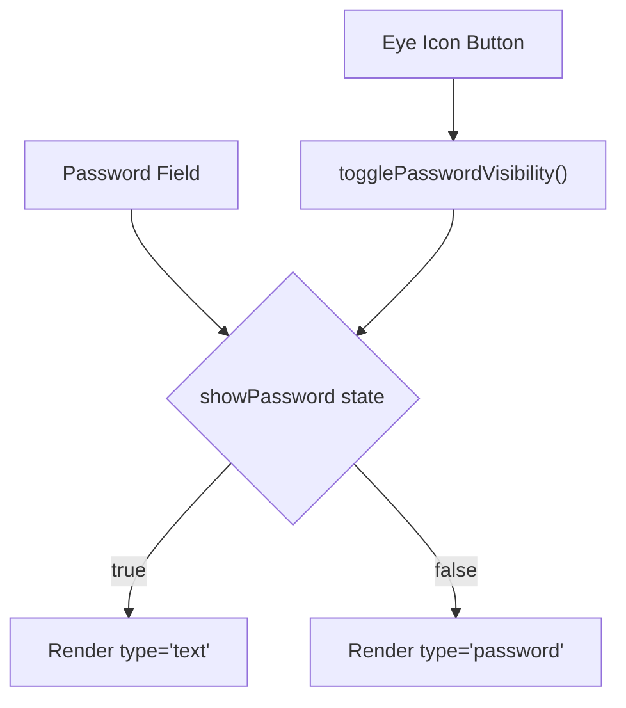
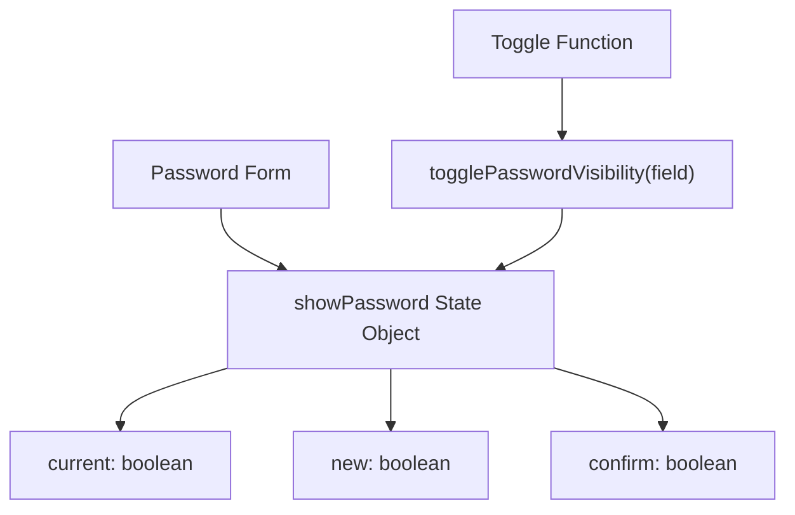
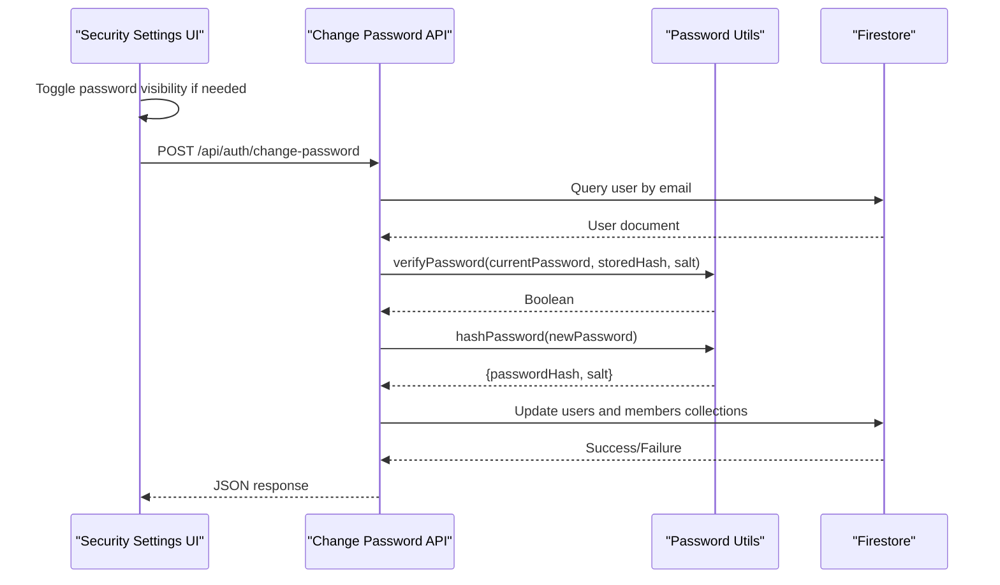
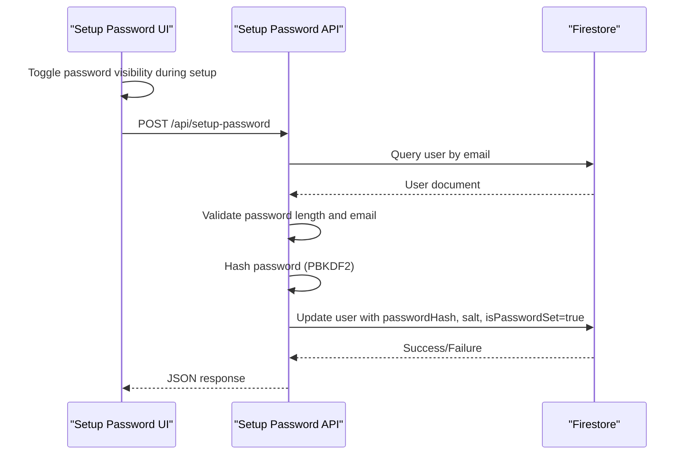
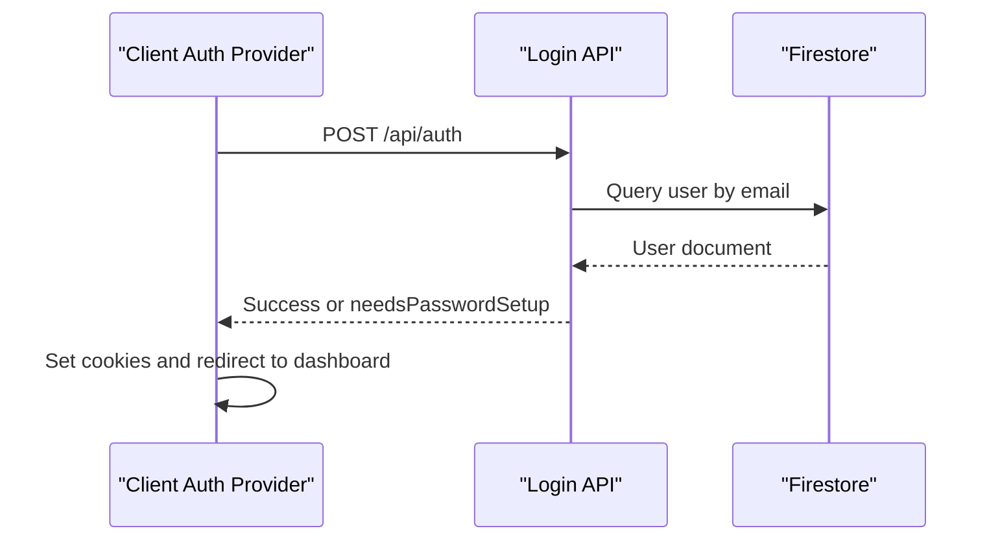
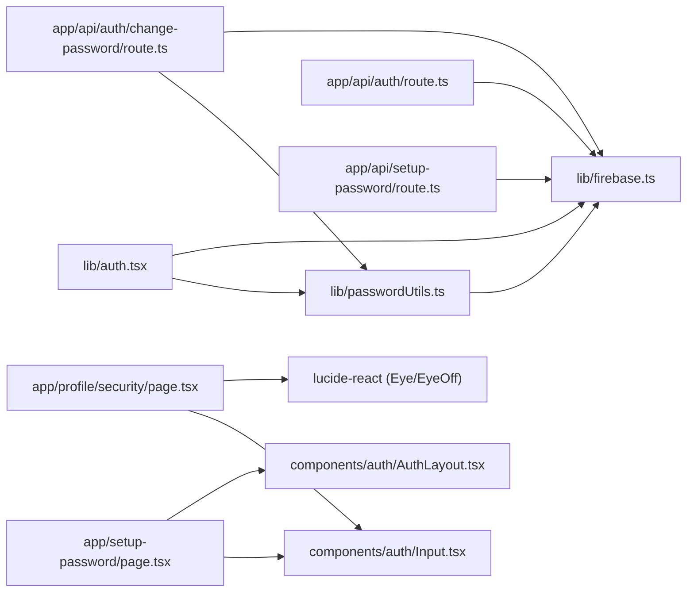

# Password Security & Management

<cite>
**Referenced Files in This Document**
- [lib/auth.tsx](file://lib/auth.tsx)
- [lib/passwordUtils.ts](file://lib/passwordUtils.ts)
- [app/api/auth/route.ts](file://app/api/auth/route.ts)
- [app/api/auth/change-password/route.ts](file://app/api/auth/change-password/route.ts)
- [app/api/setup-password/route.ts](file://app/api/setup-password/route.ts)
- [app/profile/security/page.tsx](file://app/profile/security/page.tsx)
- [app/setup-password/page.tsx](file://app/setup-password/page.tsx)
- [lib/firebase.ts](file://lib/firebase.ts)
- [components/auth/Input.tsx](file://components/auth/Input.tsx)
- [components/auth/AuthLayout.tsx](file://components/auth/AuthLayout.tsx)
</cite>

## Update Summary
**Changes Made**
- Enhanced password setup page with interactive eye icons for password visibility toggle
- Added password visibility functionality for both password and confirm password fields
- Implemented similar visibility toggle in security settings for improved user experience
- Updated user interface components to support temporary password revelation during account setup and password changes

## Table of Contents
1. [Introduction](#introduction)
2. [Project Structure](#project-structure)
3. [Core Components](#core-components)
4. [Architecture Overview](#architecture-overview)
5. [Detailed Component Analysis](#detailed-component-analysis)
6. [Dependency Analysis](#dependency-analysis)
7. [Performance Considerations](#performance-considerations)
8. [Troubleshooting Guide](#troubleshooting-guide)
9. [Conclusion](#conclusion)
10. [Appendices](#appendices)

## Introduction
This document explains the password security implementation and management across the application. It covers PBKDF2-based password hashing using the Web Crypto API, salt generation, key derivation, timing-safe comparison, validation rules, and security best practices. It also documents the password change workflow, legacy password support (plain text and hashed), and the password setup requirement mechanism that forces new users to set a password upon first login. The system now includes enhanced user experience features with password visibility toggles during setup and password management processes.

## Project Structure
The password security system spans client-side and server-side components with enhanced user interface features:
- Client-side authentication and login flow with PBKDF2 hashing, timing-safe comparisons, and password visibility toggles
- Server-side login route supporting both hashed and legacy plain-text passwords
- Password change API with validation and PBKDF2 re-hashing
- Password setup API for enforcing initial password creation with visibility controls
- Shared password utilities for hashing, verification, and timing-safe comparison
- Enhanced UI components with interactive eye icons for password visibility

**Diagram sources**
- [lib/auth.tsx:1-706](file://lib/auth.tsx#L1-L706)
- [app/api/auth/route.ts:1-295](file://app/api/auth/route.ts#L1-L295)
- [app/api/auth/change-password/route.ts:1-98](file://app/api/auth/change-password/route.ts#L1-L98)
- [app/api/setup-password/route.ts:1-177](file://app/api/setup-password/route.ts#L1-L177)
- [lib/passwordUtils.ts:1-146](file://lib/passwordUtils.ts#L1-L146)
- [lib/firebase.ts:1-309](file://lib/firebase.ts#L1-L309)
- [components/auth/Input.tsx:1-27](file://components/auth/Input.tsx#L1-L27)
- [components/auth/AuthLayout.tsx:1-23](file://components/auth/AuthLayout.tsx#L1-L23)

**Section sources**
- [lib/auth.tsx:1-706](file://lib/auth.tsx#L1-L706)
- [app/api/auth/route.ts:1-295](file://app/api/auth/route.ts#L1-L295)
- [app/api/auth/change-password/route.ts:1-98](file://app/api/auth/change-password/route.ts#L1-L98)
- [app/api/setup-password/route.ts:1-177](file://app/api/setup-password/route.ts#L1-L177)
- [lib/passwordUtils.ts:1-146](file://lib/passwordUtils.ts#L1-L146)
- [lib/firebase.ts:1-309](file://lib/firebase.ts#L1-L309)
- [components/auth/Input.tsx:1-27](file://components/auth/Input.tsx#L1-L27)
- [components/auth/AuthLayout.tsx:1-23](file://components/auth/AuthLayout.tsx#L1-L23)

## Core Components
- PBKDF2-based hashing and verification using Web Crypto API on the client and Node.js crypto on the server
- Timing-safe string comparison to prevent timing attacks
- Legacy password support allowing migration from plain text to hashed passwords
- Password setup requirement forcing new users to set a password after account creation
- Password change workflow validating current password and updating hashed credentials
- **Enhanced User Interface**: Interactive password visibility toggles using eye icons for improved user experience during password entry and verification

**Updated** Added password visibility toggle functionality for better user experience during account setup and password management

**Section sources**
- [lib/auth.tsx:63-122](file://lib/auth.tsx#L63-L122)
- [lib/passwordUtils.ts:64-122](file://lib/passwordUtils.ts#L64-L122)
- [app/api/auth/route.ts:142-163](file://app/api/auth/route.ts#L142-L163)
- [app/api/setup-password/route.ts:25-135](file://app/api/setup-password/route.ts#L25-L135)
- [app/api/auth/change-password/route.ts:5-98](file://app/api/auth/change-password/route.ts#L5-L98)
- [app/setup-password/page.tsx:168-227](file://app/setup-password/page.tsx#L168-L227)
- [app/profile/security/page.tsx:298-381](file://app/profile/security/page.tsx#L298-L381)

## Architecture Overview
The system separates concerns between client and server with enhanced user interface features:
- Client-side: PBKDF2 hashing and verification for sign-up and password change flows with password visibility toggles
- Server-side: Login validation supporting both hashed and plain-text passwords, plus password setup and change APIs
- Shared utilities: PBKDF2 hashing, verification, and timing-safe comparison
- Enhanced UI: Interactive eye icons for temporary password visibility during user registration and password management

**Diagram sources**
- [app/api/auth/route.ts:48-264](file://app/api/auth/route.ts#L48-L264)
- [lib/firebase.ts:184-240](file://lib/firebase.ts#L184-L240)
- [app/setup-password/page.tsx:181-188](file://app/setup-password/page.tsx#L181-L188)

**Section sources**
- [app/api/auth/route.ts:48-264](file://app/api/auth/route.ts#L48-L264)
- [lib/firebase.ts:184-240](file://lib/firebase.ts#L184-L240)
- [app/setup-password/page.tsx:181-188](file://app/setup-password/page.tsx#L181-L188)

## Detailed Component Analysis

### PBKDF2-Based Password Hashing (Web Crypto API)
The client-side implementation uses PBKDF2 with SHA-256 and 100,000 iterations. It generates a random 16-byte salt, derives a 256-bit key, and stores both the salt and the base64-encoded hash.

Key characteristics:
- Salt generation via secure random values
- PBKDF2 with SHA-256 and 100,000 iterations
- Base64 encoding for storage
- Timing-safe comparison to prevent timing attacks

**Diagram sources**
- [lib/auth.tsx:70-91](file://lib/auth.tsx#L70-L91)
- [lib/passwordUtils.ts:64-92](file://lib/passwordUtils.ts#L64-L92)

**Section sources**
- [lib/auth.tsx:70-91](file://lib/auth.tsx#L70-L91)
- [lib/passwordUtils.ts:64-92](file://lib/passwordUtils.ts#L64-L92)

### Timing-Safe String Comparison
Both client and server implement a constant-time comparison to mitigate timing attacks. The comparison XORs character codes and checks that the aggregated result equals zero.

**Diagram sources**
- [lib/auth.tsx:98-109](file://lib/auth.tsx#L98-L109)
- [lib/passwordUtils.ts:125-136](file://lib/passwordUtils.ts#L125-L136)
- [app/api/auth/route.ts:5-17](file://app/api/auth/route.ts#L5-L17)

**Section sources**
- [lib/auth.tsx:98-109](file://lib/auth.tsx#L98-L109)
- [lib/passwordUtils.ts:125-136](file://lib/passwordUtils.ts#L125-L136)
- [app/api/auth/route.ts:5-17](file://app/api/auth/route.ts#L5-L17)

### Enhanced Password Visibility Toggle Feature
**New** The system now includes interactive password visibility toggles to improve user experience during password entry and verification processes.

#### Setup Password Page Implementation
The setup password page features:
- Password field with eye icon toggle for temporary visibility
- Confirm password field with separate visibility toggle
- State management using `useState` hooks
- Accessible button implementation with `tabIndex={-1}`

**Diagram sources**
- [app/setup-password/page.tsx:168-188](file://app/setup-password/page.tsx#L168-L188)
- [app/setup-password/page.tsx:202-222](file://app/setup-password/page.tsx#L202-L222)

#### Security Settings Page Implementation
The security settings page provides:
- Current password field with visibility toggle
- New password field with visibility toggle
- Confirm new password field with visibility toggle
- Individual state management for each field
- Consistent styling and accessibility

**Diagram sources**
- [app/profile/security/page.tsx:32-36](file://app/profile/security/page.tsx#L32-L36)
- [app/profile/security/page.tsx:149-154](file://app/profile/security/page.tsx#L149-L154)

**Section sources**
- [app/setup-password/page.tsx:168-227](file://app/setup-password/page.tsx#L168-L227)
- [app/profile/security/page.tsx:298-381](file://app/profile/security/page.tsx#L298-L381)
- [app/setup-password/page.tsx:181-188](file://app/setup-password/page.tsx#L181-L188)
- [app/profile/security/page.tsx:310-315](file://app/profile/security/page.tsx#L310-L315)

### Password Validation Rules and Strength Requirements
Validation rules vary by endpoint:
- Change password API enforces a minimum length of 6 characters for the new password
- Setup password API enforces a minimum length of 8 characters and validates email format
- Security settings page enforces comprehensive password requirements including uppercase, lowercase, numbers, and special characters

These rules help ensure stronger passwords while maintaining usability, with enhanced visibility features to aid users in creating secure passwords.

**Section sources**
- [app/api/auth/change-password/route.ts:23-35](file://app/api/auth/change-password/route.ts#L23-L35)
- [app/api/setup-password/route.ts:53-62](file://app/api/setup-password/route.ts#L53-L62)
- [app/profile/security/page.tsx:118-135](file://app/profile/security/page.tsx#L118-L135)

### Legacy Password Support
The login route supports both hashed and plain-text passwords for backward compatibility:
- If a user has a stored hash and salt, the server verifies using PBKDF2
- If only a plain-text password exists, it compares securely using timing-safe equality
- If the password is not set, the server signals that a password setup is required

This allows gradual migration from plain-text to hashed storage, with enhanced user experience through password visibility toggles during the setup process.

**Section sources**
- [app/api/auth/route.ts:142-163](file://app/api/auth/route.ts#L142-L163)
- [lib/auth.tsx:23-31](file://lib/auth.tsx#L23-L31)

### Password Change Workflow
The change password API performs the following steps:
- Validates input (email, current password, new password)
- Queries the user by email to obtain the user ID
- Calls the shared password utility to verify the current password and update to a new hash
- Updates both users and members collections when applicable

**Diagram sources**
- [app/api/auth/change-password/route.ts:5-98](file://app/api/auth/change-password/route.ts#L5-L98)
- [lib/passwordUtils.ts:4-62](file://lib/passwordUtils.ts#L4-L62)
- [lib/firebase.ts:184-240](file://lib/firebase.ts#L184-L240)
- [app/profile/security/page.tsx:149-154](file://app/profile/security/page.tsx#L149-L154)

**Section sources**
- [app/api/auth/change-password/route.ts:5-98](file://app/api/auth/change-password/route.ts#L5-L98)
- [lib/passwordUtils.ts:4-62](file://lib/passwordUtils.ts#L4-L62)
- [lib/firebase.ts:184-240](file://lib/firebase.ts#L184-L240)
- [app/profile/security/page.tsx:149-154](file://app/profile/security/page.tsx#L149-L154)

### Password Setup Requirement Mechanism
New users are directed to set a password after account creation:
- The setup route enforces password length and email format
- It queries the user by email and checks that the password is not already set
- It hashes the new password and updates the user document, marking the password as set
- **Enhanced UX**: Users can toggle password visibility during setup for better verification

**Diagram sources**
- [app/api/setup-password/route.ts:25-135](file://app/api/setup-password/route.ts#L25-L135)
- [app/setup-password/page.tsx:97-135](file://app/setup-password/page.tsx#L97-L135)
- [lib/firebase.ts:184-240](file://lib/firebase.ts#L184-L240)

**Section sources**
- [app/api/setup-password/route.ts:25-135](file://app/api/setup-password/route.ts#L25-L135)
- [app/setup-password/page.tsx:97-135](file://app/setup-password/page.tsx#L97-L135)
- [lib/firebase.ts:184-240](file://lib/firebase.ts#L184-L240)

### Client-Side Authentication and Login Flow
The client-side auth provider:
- Encodes credentials and posts to the login API
- Handles JSON responses and redirects to password setup when required
- Sets authentication cookies and navigates to the appropriate dashboard based on role

**Diagram sources**
- [lib/auth.tsx:197-348](file://lib/auth.tsx#L197-L348)
- [app/api/auth/route.ts:48-264](file://app/api/auth/route.ts#L48-L264)

**Section sources**
- [lib/auth.tsx:197-348](file://lib/auth.tsx#L197-L348)
- [app/api/auth/route.ts:48-264](file://app/api/auth/route.ts#L48-L264)

## Dependency Analysis
The following diagram shows the primary dependencies among password-related modules, including the new UI components:

**Diagram sources**
- [lib/auth.tsx:1-706](file://lib/auth.tsx#L1-L706)
- [lib/passwordUtils.ts:1-146](file://lib/passwordUtils.ts#L1-L146)
- [app/api/auth/route.ts:1-295](file://app/api/auth/route.ts#L1-L295)
- [app/api/auth/change-password/route.ts:1-98](file://app/api/auth/change-password/route.ts#L1-L98)
- [app/api/setup-password/route.ts:1-177](file://app/api/setup-password/route.ts#L1-L177)
- [lib/firebase.ts:1-309](file://lib/firebase.ts#L1-L309)
- [app/setup-password/page.tsx:1-260](file://app/setup-password/page.tsx#L1-L260)
- [app/profile/security/page.tsx:1-478](file://app/profile/security/page.tsx#L1-L478)
- [components/auth/Input.tsx:1-27](file://components/auth/Input.tsx#L1-L27)
- [components/auth/AuthLayout.tsx:1-23](file://components/auth/AuthLayout.tsx#L1-L23)

**Section sources**
- [lib/auth.tsx:1-706](file://lib/auth.tsx#L1-L706)
- [lib/passwordUtils.ts:1-146](file://lib/passwordUtils.ts#L1-L146)
- [app/api/auth/route.ts:1-295](file://app/api/auth/route.ts#L1-L295)
- [app/api/auth/change-password/route.ts:1-98](file://app/api/auth/change-password/route.ts#L1-L98)
- [app/api/setup-password/route.ts:1-177](file://app/api/setup-password/route.ts#L1-L177)
- [lib/firebase.ts:1-309](file://lib/firebase.ts#L1-L309)
- [app/setup-password/page.tsx:1-260](file://app/setup-password/page.tsx#L1-L260)
- [app/profile/security/page.tsx:1-478](file://app/profile/security/page.tsx#L1-L478)
- [components/auth/Input.tsx:1-27](file://components/auth/Input.tsx#L1-L27)
- [components/auth/AuthLayout.tsx:1-23](file://components/auth/AuthLayout.tsx#L1-L23)

## Performance Considerations
- PBKDF2 iteration count: 100,000 iterations balance security and performance; adjust based on hardware capabilities and latency requirements
- Timing-safe comparison: O(n) operation; negligible overhead compared to PBKDF2 cost
- Client vs server hashing: Client hashing reduces server load; server hashing centralizes security logic and avoids client-side cryptography exposure
- Storage overhead: Base64 encoding increases storage by approximately 33%; acceptable trade-off for portability and simplicity
- **Enhanced UI Performance**: Password visibility toggles use simple state changes and conditional rendering, minimal performance impact on user experience

[No sources needed since this section provides general guidance]

## Troubleshooting Guide
Common issues and resolutions:
- Invalid response format: The client login flow validates content-type and parses raw text for debugging; ensure the API returns JSON
- Password setup required: When a user account exists but lacks a password, the server returns a specific flag; redirect to the setup page accordingly
- Incorrect password: The server returns a generic error to prevent user enumeration; ensure UI provides clear feedback without leaking account existence
- Database query failures: Firestore utility functions return structured errors; check Firestore rules and connectivity
- **Password visibility issues**: Ensure lucide-react icons are properly installed and accessible; verify state management for visibility toggles
- **Eye icon accessibility**: Buttons use `tabIndex={-1}` to prevent tab navigation; ensure proper keyboard navigation for form fields

**Section sources**
- [lib/auth.tsx:226-248](file://lib/auth.tsx#L226-L248)
- [app/api/auth/route.ts:128-163](file://app/api/auth/route.ts#L128-L163)
- [lib/firebase.ts:184-240](file://lib/firebase.ts#L184-L240)
- [app/setup-password/page.tsx:181-188](file://app/setup-password/page.tsx#L181-L188)
- [app/profile/security/page.tsx:310-315](file://app/profile/security/page.tsx#L310-L315)

## Conclusion
The system implements robust password security using PBKDF2 with Web Crypto API on the client and Node.js crypto on the server, combined with timing-safe comparisons and legacy password support. The password setup requirement and change workflow ensure strong, compliant password management. **Enhanced user experience** through password visibility toggles improves usability during account setup and password management processes. Extending the system with features like password expiration and history tracking is straightforward by adding fields to user documents and updating validation logic.

[No sources needed since this section summarizes without analyzing specific files]

## Appendices

### Implementing Additional Password Security Features
- Password expiration: Add a field storing the password creation date and enforce periodic renewal in the login flow
- Password history: Maintain a list of previously used hashes and block reuse during password changes
- Multi-factor authentication: Integrate with an MFA provider and require secondary verification before password changes
- Rate limiting: Apply rate limits to login attempts and password change requests to mitigate brute-force attacks
- **Enhanced UI features**: Consider adding password strength indicators, auto-fill suggestions, and improved accessibility features

[No sources needed since this section provides general guidance]

### Password Visibility Toggle Implementation Details
**New** The password visibility toggle feature was implemented consistently across both setup and security pages:

#### Technical Implementation
- Uses `useState` hooks for visibility state management
- Implements `Eye` and `EyeOff` icons from lucide-react library
- Applies conditional rendering based on state variables
- Maintains accessibility with proper button attributes
- Ensures proper form field behavior during visibility changes

#### User Experience Benefits
- Improved password verification during setup
- Better accessibility for users with visual impairments
- Reduced typos during password entry
- Enhanced security through better user verification

**Section sources**
- [app/setup-password/page.tsx:168-227](file://app/setup-password/page.tsx#L168-L227)
- [app/profile/security/page.tsx:298-381](file://app/profile/security/page.tsx#L298-L381)
- [app/setup-password/page.tsx:181-188](file://app/setup-password/page.tsx#L181-L188)
- [app/profile/security/page.tsx:310-315](file://app/profile/security/page.tsx#L310-L315)