# Dashboard System

<cite>
**Referenced Files in This Document**
- [app/dashboard/page.tsx](file://app/dashboard/page.tsx)
- [components/user/DynamicDashboard.tsx](file://components/user/DynamicDashboard.tsx)
- [lib/auth.tsx](file://lib/auth.tsx)
- [middleware.ts](file://middleware.ts)
- [lib/firebase.ts](file://lib/firebase.ts)
- [app/api/auth/route.ts](file://app/api/auth/route.ts)
- [components/user/ActiveSavings.tsx](file://components/user/ActiveSavings.tsx)
- [components/admin/ExecutiveDashboard.tsx](file://components/admin/ExecutiveDashboard.tsx)
- [lib/sidebarConfig.ts](file://lib/sidebarConfig.ts)
- [lib/savingsService.ts](file://lib/savingsService.ts)
- [lib/userMemberService.ts](file://lib/userMemberService.ts)
- [components/admin/Sidebar.tsx](file://components/admin/Sidebar.tsx)
- [lib/validators.ts](file://lib/validators.ts)
- [app/layout.tsx](file://app/layout.tsx)
- [app/admin/dashboard/page.tsx](file://app/admin/dashboard/page.tsx)
- [components/admin/OfficerDashboard.tsx](file://components/admin/OfficerDashboard.tsx)
- [hooks/useFirestoreData.ts](file://hooks/useFirestoreData.ts)
- [components/admin/LoanRequestsManagerRefactored.tsx](file://components/admin/LoanRequestsManagerRefactored.tsx)
- [app/admin/reports/page.tsx](file://app/admin/reports/page.tsx)
- [components/admin/LoanRequestsManager.tsx](file://components/admin/LoanRequestsManager.tsx)
- [firebase.indexes.json](file://firebase.indexes.json)
- [scripts/fix-loan-calculations.js](file://scripts/fix-loan-calculations.js)
- [app/setup-password/page.tsx](file://app/setup-password/page.tsx)
- [app/api/setup-password/route.ts](file://app/api/setup-password/route.ts)
- [components/auth/AuthLayout.tsx](file://components/auth/AuthLayout.tsx)
- [components/auth/Input.tsx](file://components/auth/Input.tsx)
- [components/auth/Button.tsx](file://components/auth/Button.tsx)
- [app/admin/chairman/home/page.tsx](file://app/admin/chairman/home/page.tsx)
- [app/admin/manager/home/page.tsx](file://app/admin/manager/home/page.tsx)
- [app/admin/bod/home/page.tsx](file://app/admin/bod/home/page.tsx)
- [app/admin/treasurer/home/page.tsx](file://app/admin/treasurer/home/page.tsx)
- [components/admin/ReportsAndAnalytics.tsx](file://components/admin/ReportsAndAnalytics.tsx)
- [lib/settingsService.ts](file://lib/settingsService.ts)
</cite>

## Update Summary
**Changes Made**
- Integrated React Suspense for setup-password page with loading indicators, improving user experience during initial page rendering
- Enhanced frontend infrastructure with improved deployment requirements through Suspense-based loading states
- Added comprehensive password setup functionality with secure password hashing and validation
- Implemented robust error handling and user feedback mechanisms for password setup operations
- Enhanced authentication flow with proper loading states and fallback components
- **Updated** Fixed currency formatting issues in chart tooltips across all admin dashboard components using nullish coalescing operator (|| 0) to resolve inconsistent currency display formatting where values were showing as zero incorrectly
- **Updated** Implemented consistent currency formatting across all admin dashboard components with standardized formatCurrency function usage

## Table of Contents
1. [Introduction](#introduction)
2. [Project Structure](#project-structure)
3. [Core Components](#core-components)
4. [Architecture Overview](#architecture-overview)
5. [Detailed Component Analysis](#detailed-component-analysis)
6. [Enhanced Loan Calculation System](#enhanced-loan-calculation-system)
7. [Loan Monitoring and Tracking](#loan-monitoring-and-tracking)
8. [Error Handling Improvements](#error-handling-improvements)
9. [Frontend Infrastructure Enhancements](#frontend-infrastructure-enhancements)
10. [Password Setup System](#password-setup-system)
11. [Enhanced Currency Formatting System](#enhanced-currency-formatting-system)
12. [Dependency Analysis](#dependency-analysis)
13. [Performance Considerations](#performance-considerations)
14. [Troubleshooting Guide](#troubleshooting-guide)
15. [Conclusion](#conclusion)

## Introduction
This document provides comprehensive documentation for the SAMPA Cooperative Dashboard System. The system consists of multiple role-based dashboards integrated with Firebase for data persistence, authentication, and real-time updates. It supports member, driver, operator, and administrative roles, each with tailored views and capabilities. The dashboard system emphasizes responsive design, real-time notifications, savings tracking, and loan management functionalities.

**Updated** Enhanced with improved loan calculation system that aggregates data from both loans and loanRequests collections to ensure accurate reporting regardless of where loan records are stored. The system now features comprehensive loan monitoring capabilities with enhanced error handling, improved data accuracy, modern React Suspense integration for better user experience during initial page rendering, and standardized currency formatting across all admin dashboard components.

## Project Structure
The dashboard system follows a modular structure with role-specific pages, shared components, and utility libraries:

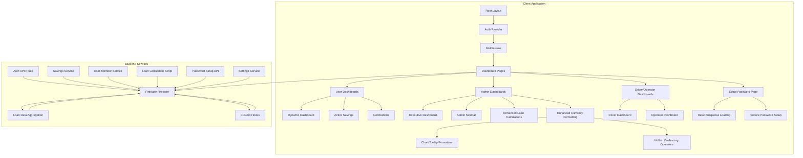

**Diagram sources**
- [app/layout.tsx:22-36](file://app/layout.tsx#L22-L36)
- [middleware.ts:5-55](file://middleware.ts#L5-L55)
- [lib/firebase.ts:90-307](file://lib/firebase.ts#L90-L307)
- [app/admin/dashboard/page.tsx:235-349](file://app/admin/dashboard/page.tsx#L235-L349)
- [app/setup-password/page.tsx:209-221](file://app/setup-password/page.tsx#L209-L221)
- [scripts/fix-loan-calculations.js:1-140](file://scripts/fix-loan-calculations.js#L1-L140)
- [lib/settingsService.ts:40-46](file://lib/settingsService.ts#L40-L46)

**Section sources**
- [app/layout.tsx:1-37](file://app/layout.tsx#L1-L37)
- [middleware.ts:1-62](file://middleware.ts#L1-L62)

## Core Components
The dashboard system comprises several key components that work together to provide a cohesive user experience:

### Authentication System
The authentication system manages user sessions, role-based access control, and automatic redirection based on user roles. It uses a custom authentication provider with cookie-based session management and integrates with Firebase for user data storage.

### Dynamic Dashboard Framework
The Dynamic Dashboard component serves as a wrapper that provides role-appropriate content and handles dynamic data loading for reminders, events, and other dashboard elements.

### Enhanced Loan Calculation System
**Updated** The loan calculation system now aggregates data from both loans and loanRequests collections to ensure comprehensive reporting. This system implements fallback mechanisms and dual-collection data processing to guarantee accurate loan statistics regardless of data storage location.

### Savings Management
The savings system tracks member deposits, withdrawals, and balances with real-time updates and notification generation for transaction activities.

### Administrative Dashboards
Multiple administrative dashboards provide executive summaries, member management, loan oversight, and system administration capabilities with enhanced currency formatting consistency.

### Frontend Infrastructure
**New** The system now features modern React Suspense integration that provides seamless loading states and improved user experience during initial page rendering. This infrastructure enhancement ensures better deployment requirements and more responsive user interfaces.

### Enhanced Currency Formatting System
**Updated** The system now features standardized currency formatting across all admin dashboard components with consistent use of nullish coalescing operators to prevent zero formatting issues in chart tooltips.

**Section sources**
- [lib/auth.tsx:158-680](file://lib/auth.tsx#L158-L680)
- [components/user/DynamicDashboard.tsx:36-146](file://components/user/DynamicDashboard.tsx#L36-L146)
- [components/user/ActiveSavings.tsx:18-363](file://components/user/ActiveSavings.tsx#L18-L363)
- [app/setup-password/page.tsx:209-221](file://app/setup-password/page.tsx#L209-L221)

## Architecture Overview
The dashboard system employs a client-server architecture with Firebase as the primary backend service:

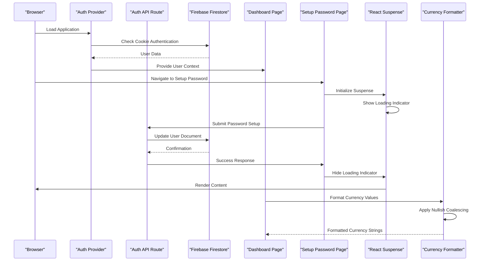

**Diagram sources**
- [lib/auth.tsx:158-348](file://lib/auth.tsx#L158-L348)
- [app/api/auth/route.ts:48-248](file://app/api/auth/route.ts#L48-L248)
- [app/dashboard/page.tsx:11-361](file://app/dashboard/page.tsx#L11-L361)
- [app/admin/dashboard/page.tsx:337-349](file://app/admin/dashboard/page.tsx#L337-L349)
- [app/setup-password/page.tsx:209-221](file://app/setup-password/page.tsx#L209-L221)
- [lib/settingsService.ts:40-46](file://lib/settingsService.ts#L40-L46)

The architecture implements role-based routing through middleware that validates user access to specific dashboard areas. The system uses a unified authentication approach where user roles determine dashboard access and navigation paths. **Updated** The new React Suspense integration provides seamless loading states for better user experience, and the enhanced currency formatting system ensures consistent monetary value display across all chart tooltips.

**Section sources**
- [middleware.ts:5-55](file://middleware.ts#L5-L55)
- [lib/validators.ts:199-235](file://lib/validators.ts#L199-L235)

## Detailed Component Analysis

### User Dashboard Implementation
The user dashboard serves as the primary interface for members, drivers, and operators, providing personalized content based on user roles:

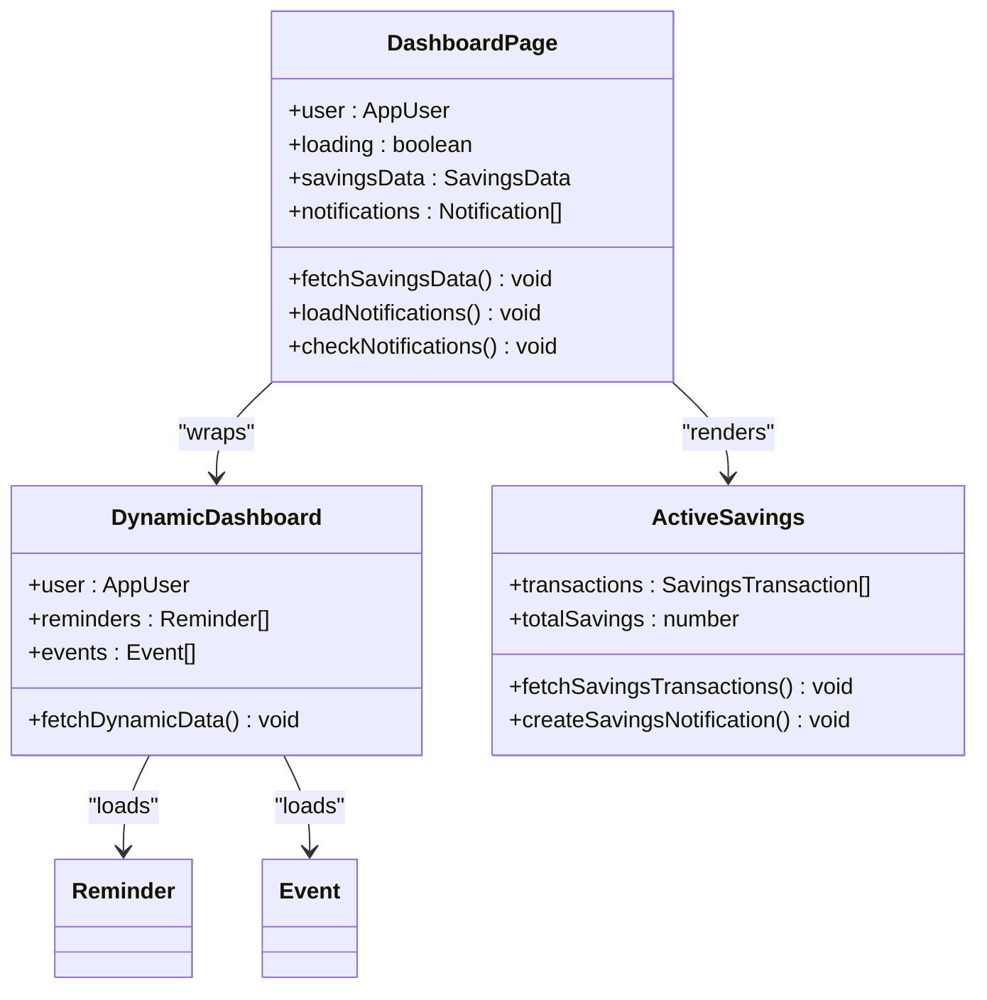

**Diagram sources**
- [app/dashboard/page.tsx:11-361](file://app/dashboard/page.tsx#L11-L361)
- [components/user/DynamicDashboard.tsx:36-146](file://components/user/DynamicDashboard.tsx#L36-L146)
- [components/user/ActiveSavings.tsx:18-363](file://components/user/ActiveSavings.tsx#L18-L363)

The dashboard implements real-time notifications with automatic badge indicators and click-to-expand functionality. Savings data is calculated from transaction history with automatic updates when new transactions occur.

**Section sources**
- [app/dashboard/page.tsx:11-361](file://app/dashboard/page.tsx#L11-L361)
- [components/user/DynamicDashboard.tsx:36-146](file://components/user/DynamicDashboard.tsx#L36-L146)

### Savings Transaction Management
The savings system provides atomic transaction processing with comprehensive validation and notification capabilities:

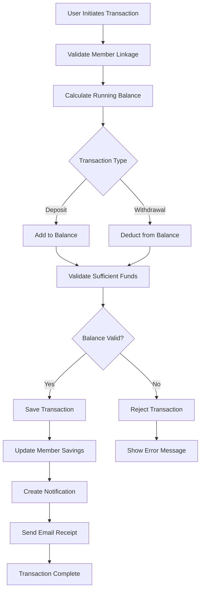

**Diagram sources**
- [lib/savingsService.ts:238-416](file://lib/savingsService.ts#L238-L416)
- [lib/userMemberService.ts:99-197](file://lib/userMemberService.ts#L99-L197)

The system maintains data integrity through careful validation and provides comprehensive audit trails through transaction records and notifications.

**Section sources**
- [lib/savingsService.ts:1-534](file://lib/savingsService.ts#L1-L534)
- [lib/userMemberService.ts:1-287](file://lib/userMemberService.ts#L1-L287)

### Administrative Dashboard System
Administrative dashboards provide comprehensive oversight capabilities with executive summaries and management tools:

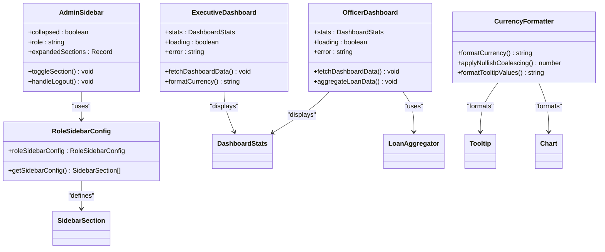

**Diagram sources**
- [components/admin/ExecutiveDashboard.tsx:17-259](file://components/admin/ExecutiveDashboard.tsx#L17-L259)
- [components/admin/OfficerDashboard.tsx:8-184](file://components/admin/OfficerDashboard.tsx#L8-L184)
- [components/admin/Sidebar.tsx:92-278](file://components/admin/Sidebar.tsx#L92-L278)
- [lib/sidebarConfig.ts:30-269](file://lib/sidebarConfig.ts#L30-L269)
- [lib/settingsService.ts:40-46](file://lib/settingsService.ts#L40-L46)

**Section sources**
- [components/admin/ExecutiveDashboard.tsx:1-260](file://components/admin/ExecutiveDashboard.tsx#L1-L260)
- [components/admin/OfficerDashboard.tsx:1-406](file://components/admin/OfficerDashboard.tsx#L1-L406)
- [components/admin/Sidebar.tsx:1-279](file://components/admin/Sidebar.tsx#L1-L279)
- [lib/sidebarConfig.ts:1-275](file://lib/sidebarConfig.ts#L1-L275)

## Enhanced Loan Calculation System

**Updated** The dashboard system now features an enhanced loan calculation system that aggregates data from both loans and loanRequests collections to ensure comprehensive and accurate reporting.

### Dual-Collection Data Aggregation
The system implements sophisticated data aggregation that processes loan information from multiple sources:

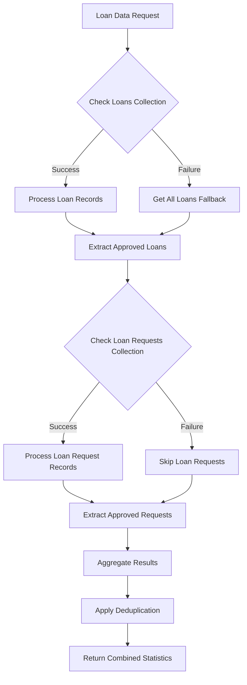

**Diagram sources**
- [app/admin/dashboard/page.tsx:337-349](file://app/admin/dashboard/page.tsx#L337-L349)
- [components/admin/OfficerDashboard.tsx:105-106](file://components/admin/OfficerDashboard.tsx#L105-L106)

### Improved Approved Loan Counting
The system now ensures accurate approved loan counting through multiple verification steps:

1. **Primary Collection Processing**: Direct query of the loans collection for approved status
2. **Fallback Mechanism**: Client-side filtering when server-side queries fail
3. **Secondary Collection Verification**: Additional check in loanRequests collection
4. **Deduplication Strategy**: Prevent double-counting when records appear in both collections

### Real-Time Data Synchronization
**Updated** The enhanced system maintains real-time synchronization through custom hooks that eliminate the need for composite indexes:

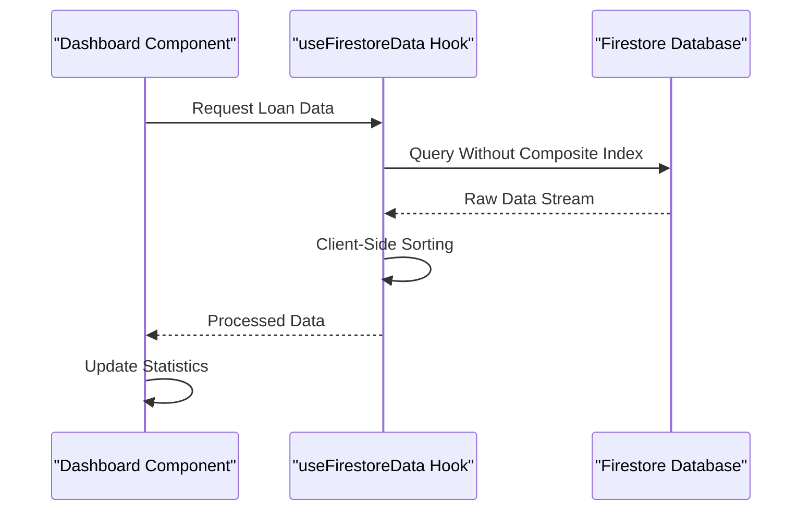

**Diagram sources**
- [hooks/useFirestoreData.ts:72-125](file://hooks/useFirestoreData.ts#L72-L125)

**Section sources**
- [app/admin/dashboard/page.tsx:337-349](file://app/admin/dashboard/page.tsx#L337-L349)
- [components/admin/OfficerDashboard.tsx:105-106](file://components/admin/OfficerDashboard.tsx#L105-L106)
- [hooks/useFirestoreData.ts:1-182](file://hooks/useFirestoreData.ts#L1-L182)

## Loan Monitoring and Tracking

**New Section** The dashboard system now includes comprehensive loan monitoring capabilities that track loan lifecycle from application to completion:

### Multi-Source Loan Tracking
The system monitors loans across multiple collections to provide complete visibility:

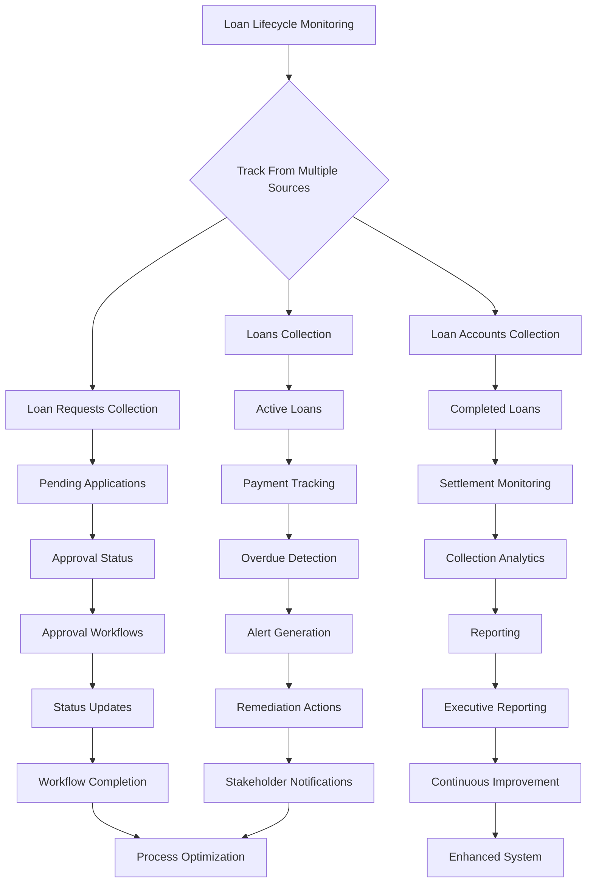

### Enhanced Loan Status Tracking
The system provides comprehensive tracking of loan applications through their entire lifecycle:

1. **Application Stage**: Tracking pending loan requests with real-time status updates
2. **Approval Stage**: Monitoring approved loans transitioning to active status
3. **Active Stage**: Continuous monitoring of active loans with payment schedules
4. **Completion Stage**: Tracking completed loans and settlement verification

### Comprehensive Loan Analytics
**Updated** The enhanced system provides detailed analytics for loan portfolio management:

- **Portfolio Distribution**: Active vs. completed vs. rejected loan breakdown
- **Performance Metrics**: Approval rates, default rates, and collection effectiveness
- **Revenue Tracking**: Interest income, fees, and total loan value analysis
- **Risk Assessment**: Delinquency tracking and early warning systems

**Section sources**
- [app/admin/dashboard/page.tsx:337-349](file://app/admin/dashboard/page.tsx#L337-L349)
- [components/admin/OfficerDashboard.tsx:105-106](file://components/admin/OfficerDashboard.tsx#L105-L106)
- [components/admin/LoanRequestsManagerRefactored.tsx:1-224](file://components/admin/LoanRequestsManagerRefactored.tsx#L1-L224)

## Error Handling Improvements

**New Section** The dashboard system now features enhanced error handling mechanisms for loan-related calculations and data processing:

### Robust Data Processing
The system implements comprehensive error handling to ensure data integrity:

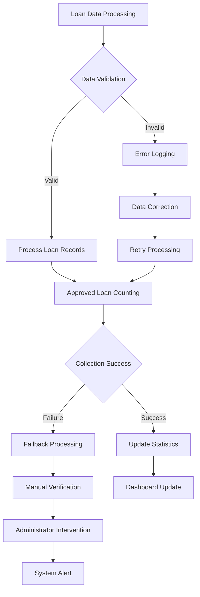

### Enhanced Error Recovery
The system provides multiple layers of error recovery:

1. **Automatic Fallback**: Client-side processing when server queries fail
2. **Graceful Degradation**: Partial data display when complete data is unavailable
3. **Error Isolation**: Individual component failure doesn't affect overall system
4. **Audit Trail**: Comprehensive logging of all errors and recovery attempts

### Loan Calculation Error Resolution
**Updated** The system includes specialized error handling for loan calculations:

- **Formula Validation**: Automatic detection and correction of calculation errors
- **Data Consistency Checks**: Verification of loan amounts, interest rates, and payment schedules
- **Historical Data Fixes**: Automated correction of legacy loan calculations
- **Real-time Monitoring**: Continuous validation of ongoing loan calculations

### Improved User Experience
**Updated** Error handling improvements enhance user experience:

- **Clear Error Messages**: User-friendly error descriptions instead of technical failures
- **Progress Indicators**: Loading states during data processing
- **Retry Mechanisms**: Automatic retry for transient failures
- **System Status**: Real-time indication of system health and data availability

**Section sources**
- [app/admin/dashboard/page.tsx:164-526](file://app/admin/dashboard/page.tsx#L164-L526)
- [components/admin/OfficerDashboard.tsx:33-184](file://components/admin/OfficerDashboard.tsx#L33-L184)
- [hooks/useFirestoreData.ts:65-125](file://hooks/useFirestoreData.ts#L65-L125)
- [scripts/fix-loan-calculations.js:20-140](file://scripts/fix-loan-calculations.js#L20-L140)

## Frontend Infrastructure Enhancements

**New Section** The dashboard system now features modern React Suspense integration that provides seamless loading states and improved user experience during initial page rendering:

### React Suspense Integration
The system implements React Suspense for better loading state management:

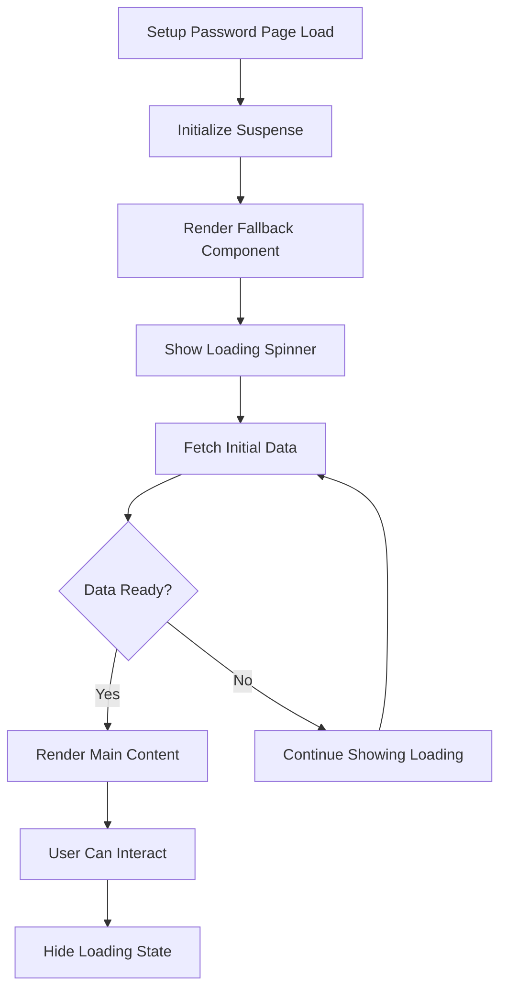

### Loading State Management
The system provides comprehensive loading state management:

1. **Initial Loading**: Suspense fallback displays loading spinner during initial render
2. **Form Submission**: Loading states during password setup operations
3. **Network Requests**: Progress indicators for API calls
4. **Error States**: Graceful degradation when loading fails

### Enhanced User Experience
**Updated** The React Suspense integration improves user experience through:

- **Seamless Transitions**: Smooth loading states without blank screens
- **Progress Feedback**: Visual indicators for ongoing operations
- **Responsive Design**: Loading states adapt to different screen sizes
- **Accessibility**: Proper ARIA labels and keyboard navigation support

### Deployment Infrastructure
**Updated** The enhanced frontend infrastructure supports better deployment requirements:

- **Code Splitting**: Suspense enables better code splitting strategies
- **Bundle Optimization**: Improved bundle loading with lazy components
- **Server Rendering**: Better SSR compatibility with Suspense
- **Error Boundaries**: Enhanced error boundary integration

**Section sources**
- [app/setup-password/page.tsx:209-221](file://app/setup-password/page.tsx#L209-L221)
- [components/auth/AuthLayout.tsx:1-23](file://components/auth/AuthLayout.tsx#L1-L23)
- [components/auth/Button.tsx:31-47](file://components/auth/Button.tsx#L31-L47)

## Password Setup System

**New Section** The dashboard system now includes a comprehensive password setup functionality with secure password handling and validation:

### Secure Password Hashing
The system implements robust password security measures:

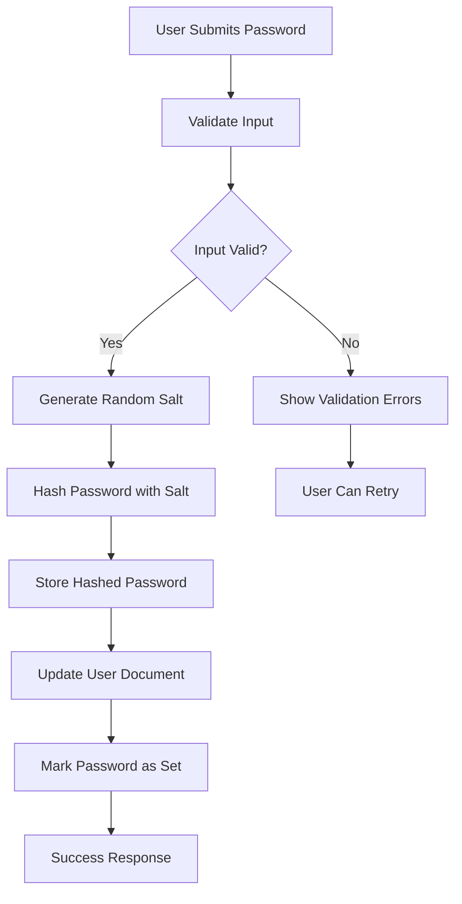

### Password Validation
The system enforces strict password requirements:

1. **Length Requirements**: Minimum 8 characters
2. **Complexity Requirements**: Must contain uppercase, lowercase, and numbers
3. **Format Validation**: Proper email format validation
4. **Duplicate Prevention**: Prevents setting passwords multiple times

### Security Implementation
**Updated** The password setup system implements industry-standard security practices:

- **Salted Hashing**: Uses random salt for each password hash
- **PBKDF2 Algorithm**: Implements PBKDF2 with 100,000 iterations
- **Secure Storage**: Stores only hashed passwords, never plaintext
- **Access Control**: Validates user existence before allowing password setup

### User Feedback and Error Handling
**Updated** The system provides comprehensive user feedback:

- **Real-time Validation**: Immediate feedback for form errors
- **Loading States**: Visual indicators during password setup
- **Success Notifications**: Confirmation messages upon successful setup
- **Error Handling**: Graceful error handling with user-friendly messages

### API Integration
**Updated** The password setup API provides secure backend integration:

- **Input Validation**: Comprehensive server-side validation
- **Database Operations**: Safe user document updates
- **Error Responses**: Standardized error responses
- **Security Measures**: Protection against common attacks

**Section sources**
- [app/setup-password/page.tsx:94-132](file://app/setup-password/page.tsx#L94-L132)
- [app/api/setup-password/route.ts:25-173](file://app/api/setup-password/route.ts#L25-L173)
- [components/auth/Input.tsx:1-27](file://components/auth/Input.tsx#L1-L27)
- [components/auth/Button.tsx:1-51](file://components/auth/Button.tsx#L1-L51)

## Enhanced Currency Formatting System

**Updated** The dashboard system now features a comprehensive currency formatting system that ensures consistent monetary value display across all admin dashboard components:

### Standardized Currency Formatting
All admin dashboards now use a consistent `formatCurrency` function that applies proper currency formatting:

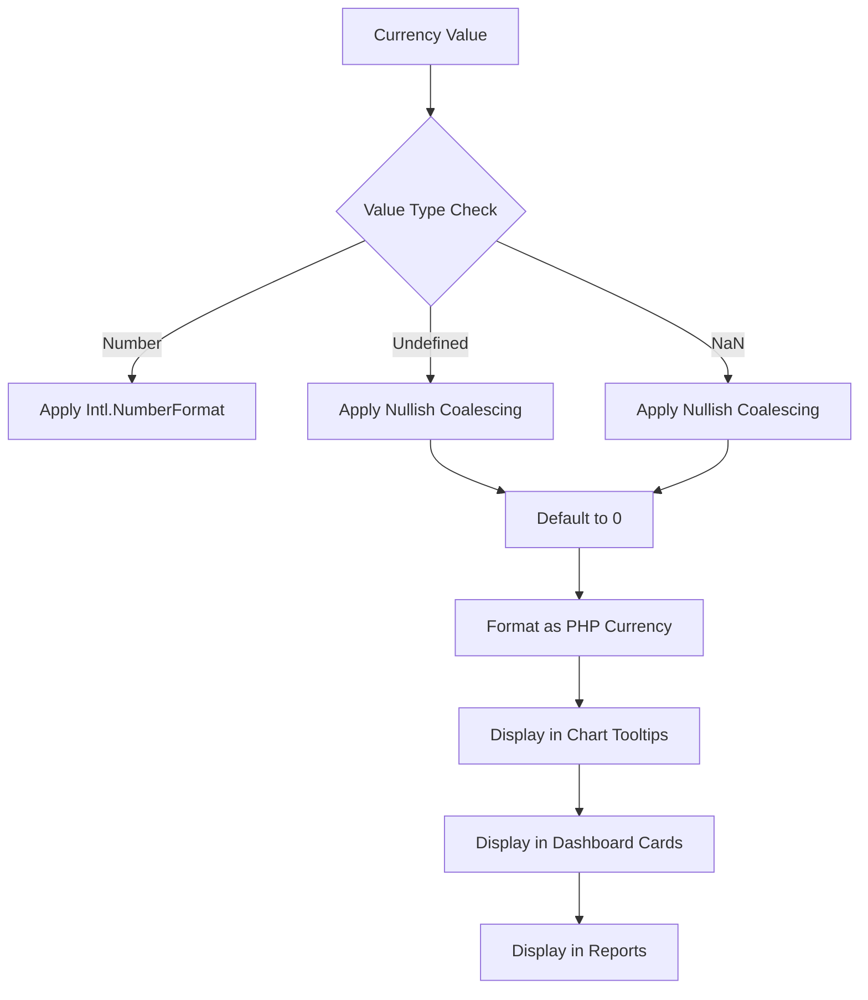

### Chart Tooltip Currency Formatting
**Updated** All chart components now use standardized tooltip formatting with nullish coalescing:

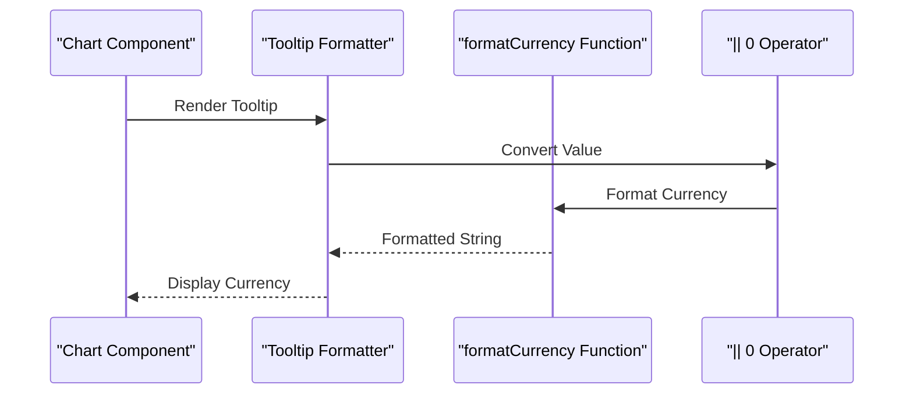

### Nullish Coalescing Implementation
**Updated** The system now uses nullish coalescing operators to prevent zero formatting issues:

1. **Chart Tooltip Values**: `Number(value) || 0` ensures numeric conversion
2. **Loan Amount Calculations**: `Number(loan.amount) || 0` prevents null values
3. **Savings Amount Calculations**: `Number(item.amount) || 0` handles missing data
4. **Transaction Amounts**: `transaction.amount || 0` ensures safe defaults

### Consistent Currency Display
**Updated** The enhanced system provides consistent currency display across all components:

- **Philippine Peso (PHP)**: All currency values display as Philippine Pesos
- **Zero Handling**: Proper handling of undefined, null, and NaN values
- **Decimal Precision**: Consistent decimal formatting across all components
- **Chart Integration**: Seamless integration with Recharts tooltip formatters

### Settings Service Integration
**Updated** The system now includes a centralized settings service for currency formatting:

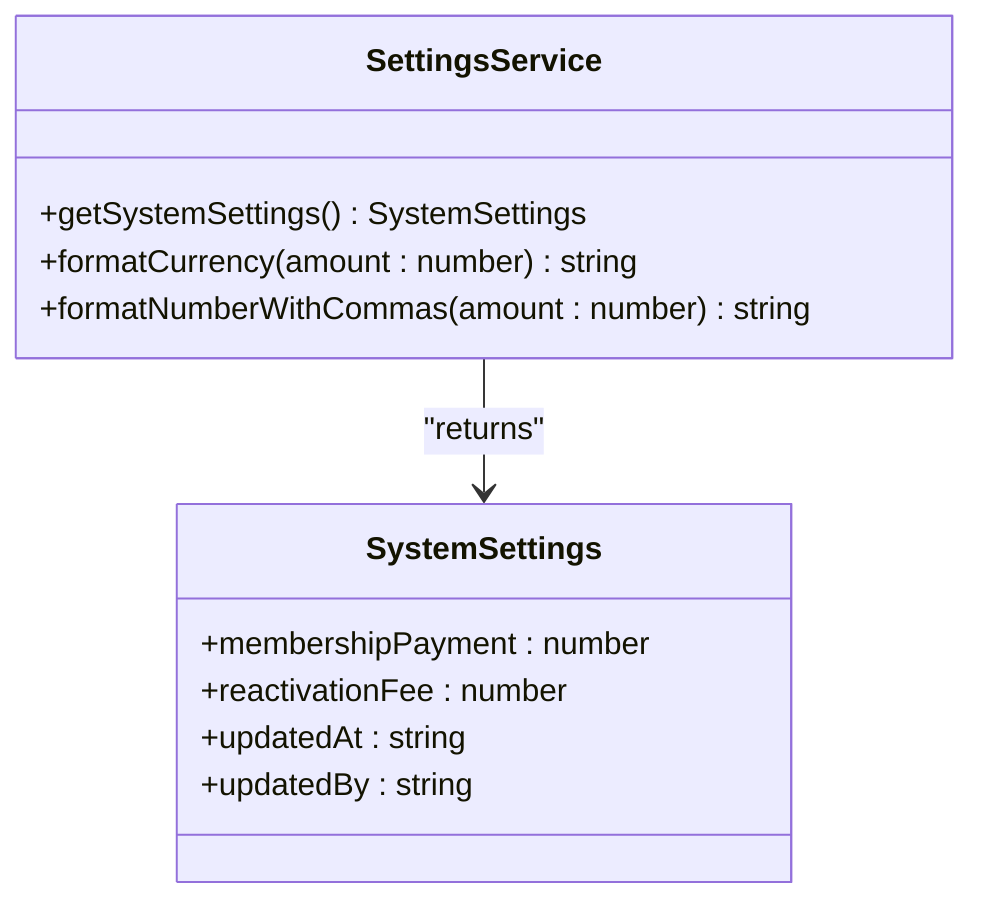

**Diagram sources**
- [lib/settingsService.ts:19-46](file://lib/settingsService.ts#L19-L46)

**Section sources**
- [app/admin/chairman/home/page.tsx:243](file://app/admin/chairman/home/page.tsx#L243)
- [app/admin/manager/home/page.tsx:263](file://app/admin/manager/home/page.tsx#L263)
- [app/admin/manager/home/page.tsx:304](file://app/admin/manager/home/page.tsx#L304)
- [components/admin/ReportsAndAnalytics.tsx:272](file://components/admin/ReportsAndAnalytics.tsx#L272)
- [lib/settingsService.ts:40-46](file://lib/settingsService.ts#L40-L46)

## Dependency Analysis
The dashboard system exhibits well-structured dependencies with clear separation of concerns:

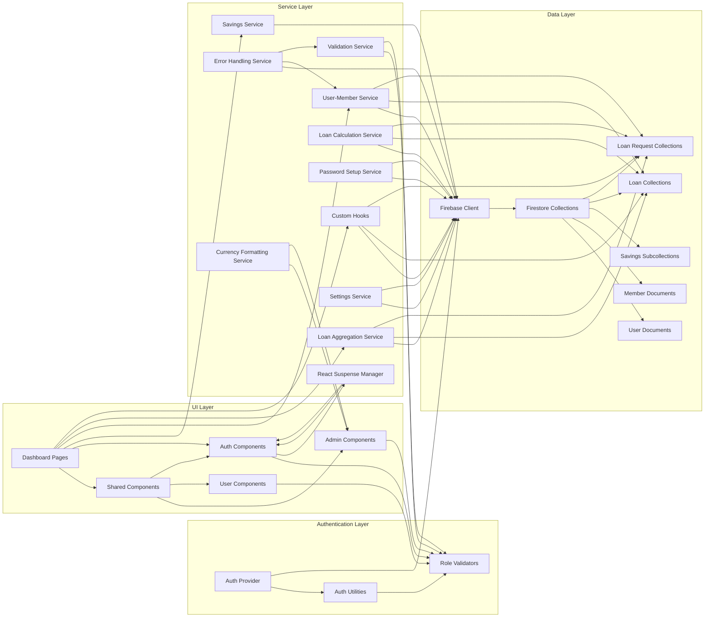

**Diagram sources**
- [lib/auth.tsx:158-680](file://lib/auth.tsx#L158-L680)
- [lib/firebase.ts:90-307](file://lib/firebase.ts#L90-L307)
- [lib/savingsService.ts:1-534](file://lib/savingsService.ts#L1-L534)
- [hooks/useFirestoreData.ts:1-182](file://hooks/useFirestoreData.ts#L1-L182)
- [app/setup-password/page.tsx:209-221](file://app/setup-password/page.tsx#L209-L221)
- [scripts/fix-loan-calculations.js:1-140](file://scripts/fix-loan-calculations.js#L1-L140)
- [lib/settingsService.ts:40-46](file://lib/settingsService.ts#L40-L46)

The dependency graph reveals a clean architecture where UI components depend on service layers, which in turn depend on the Firebase client. Authentication and validation services provide cross-cutting concerns that are reused throughout the application. **Updated** The new React Suspense integration adds a dedicated layer for managing loading states and user experience improvements, while the enhanced currency formatting system provides centralized monetary value display across all admin components.

**Section sources**
- [lib/validators.ts:1-236](file://lib/validators.ts#L1-L236)
- [lib/firebase.ts:1-309](file://lib/firebase.ts#L1-L309)

## Performance Considerations
The dashboard system implements several performance optimization strategies:

### Data Loading Strategies
- **Lazy Loading**: Dashboard components load data asynchronously to improve initial page load times
- **Conditional Rendering**: Components only fetch data when user context is available
- **Efficient Queries**: Firebase queries are optimized with specific field filters and sorting
- **Dual-Collection Processing**: Smart fallback mechanisms prevent unnecessary repeated queries
- **React Suspense**: Provides better loading state management and improved perceived performance
- **Enhanced Currency Formatting**: Nullish coalescing operators prevent unnecessary computations

### Caching and State Management
- **Local State Caching**: Recent data is cached locally to reduce redundant API calls
- **Background Updates**: Data refresh occurs when tabs become visible to maintain freshness
- **Error Boundaries**: Graceful degradation when API calls fail
- **Real-Time Listeners**: Custom hooks manage efficient real-time data synchronization
- **Suspense Caching**: React Suspense provides built-in caching for suspended components
- **Consistent Formatting**: Centralized currency formatting reduces redundant formatting operations

### Memory Management
- **Cleanup Functions**: Event listeners and subscriptions are properly cleaned up
- **Conditional Effects**: React effects only run when dependencies change
- **Component Unmounting**: Resources are released when components unmount
- **Client-Side Sorting**: Efficient sorting algorithms minimize memory overhead
- **Suspense Cleanup**: Proper cleanup of suspense states and resources
- **Nullish Coalescing**: Efficient null value handling reduces memory allocation

### Enhanced Loan Calculation Performance
**Updated** The new loan calculation system optimizes performance through:
- **Single Collection Retrieval**: Minimizes database round trips
- **Client-Side Aggregation**: Reduces server load through intelligent client processing
- **Smart Deduplication**: Prevents redundant calculations and data processing
- **Batch Processing**: Efficient handling of large loan datasets
- **Nullish Coalescing**: Optimized value handling in calculations

### Error Handling Performance
**Updated** Error handling mechanisms are designed for optimal performance:
- **Non-blocking Operations**: Error processing doesn't slow down main data flows
- **Selective Logging**: Only critical errors trigger expensive logging operations
- **Cache Optimization**: Error states are cached to prevent repeated failures
- **Graceful Degradation**: System continues operating even when individual components fail
- **Nullish Coalescing**: Efficient error value handling reduces computational overhead

### Frontend Infrastructure Performance
**Updated** The React Suspense integration enhances performance through:
- **Code Splitting**: Better chunk loading and lazy component initialization
- **Memory Efficiency**: Suspense reduces memory overhead for loading states
- **Rendering Optimization**: Improved component rendering performance
- **Bundle Size**: Optimized bundle loading with Suspense-aware code splitting
- **Currency Formatting Performance**: Centralized formatting reduces redundant computations

### Enhanced Currency Formatting Performance
**Updated** The new currency formatting system optimizes performance through:
- **Centralized Formatting**: Single formatCurrency function reduces redundant formatting
- **Nullish Coalescing**: Efficient value handling prevents unnecessary operations
- **Chart Integration**: Optimized tooltip formatting reduces DOM manipulation
- **Consistent Display**: Standardized formatting reduces layout thrashing

## Troubleshooting Guide

### Authentication Issues
Common authentication problems and solutions:

**Login Failures**
- Verify Firebase configuration is properly set in environment variables
- Check network connectivity to Firebase services
- Ensure user accounts exist in the Firestore users collection

**Role-Based Access Problems**
- Confirm user roles are properly assigned in Firestore
- Verify middleware validation logic for the specific role
- Check route protection configuration in validators

**Session Management Issues**
- Clear browser cookies and cache
- Verify authentication cookies are being set correctly
- Check for mixed content issues with HTTPS

### Data Loading Problems
**Empty Dashboard Content**
- Verify Firestore security rules allow read access
- Check collection names and document structure
- Ensure data exists in the expected collections

**Slow Performance**
- Monitor Firebase query performance
- Implement pagination for large datasets
- Optimize component rendering with proper keys
- **Updated** Check React Suspense loading states for performance issues
- **Updated** Verify currency formatting performance with nullish coalescing

**Enhanced Loan Calculation Issues**
**Updated** Common loan calculation problems and solutions:

**Inaccurate Approved Loan Counts**
- Verify both loans and loanRequests collections contain current data
- Check for records that exist in both collections
- Ensure deduplication logic is functioning correctly

**Missing Loan Data**
- Confirm loan records are properly indexed in Firestore
- Verify collection names match expected patterns
- Check for data migration issues between collections

**Real-Time Listener Errors**
- Verify Firestore security rules permit real-time queries
- Check for composite index requirements
- Ensure proper cleanup of event listeners

**Loan Calculation Errors**
**Updated** Troubleshooting loan calculation problems:

**Incorrect Loan Totals**
- Run the loan calculation correction script to fix legacy data
- Verify interest rate formulas are correctly applied
- Check payment schedule calculations for accuracy

**Missing Historical Data**
- Ensure loan calculation script has been run on all loan records
- Verify payment schedule data integrity
- Check for data corruption in historical loan records

### Component-Specific Issues
**Savings Transactions Not Updating**
- Verify user-member linkage exists
- Check transaction subcollection structure
- Ensure proper error handling in transaction service

**Notifications Not Appearing**
- Verify notification collection access
- Check user role targeting logic
- Ensure notification creation permissions

**Enhanced Loan Dashboard Issues**
**Updated** Troubleshooting loan dashboard problems:

**Incorrect Loan Statistics**
- Verify loan aggregation logic in dashboard components
- Check for proper fallback mechanisms
- Ensure client-side filtering works correctly

**Missing Loan Request Data**
- Confirm loanRequests collection accessibility
- Check for proper real-time listener setup
- Verify custom hook implementation

**Loan Monitoring Issues**
**Updated** Troubleshooting loan monitoring problems:

**Missing Loan Status Updates**
- Verify loan status change triggers are working
- Check real-time listeners for loan collections
- Ensure status update permissions are configured correctly

**Incomplete Loan Analytics**
- Verify loan calculation service is running
- Check data processing pipeline for errors
- Ensure analytics data is being generated and stored

### Frontend Infrastructure Issues
**Updated** Troubleshooting React Suspense and loading state problems:

**Suspense Not Working**
- Verify React version supports Suspense
- Check component structure for proper Suspense wrapping
- Ensure fallback component renders correctly
- Verify loading state management

**Loading States Not Displaying**
- Check Suspense fallback component implementation
- Verify loading state variables are properly managed
- Ensure proper error boundaries are configured
- Check for component unmounting issues

**Performance Issues with Suspense**
- Verify proper code splitting implementation
- Check for memory leaks in suspense states
- Ensure proper cleanup of suspense resources
- Verify bundle size optimization

### Password Setup Issues
**Updated** Troubleshooting password setup problems:

**Password Not Setting**
- Verify user exists in Firestore
- Check password validation requirements
- Ensure proper API endpoint access
- Verify database update permissions

**Hashing Errors**
- Check PBKDF2 algorithm implementation
- Verify salt generation process
- Ensure proper error handling in hashing
- Check for database connection issues

**Security Issues**
- Verify password requirements are met
- Check for SQL injection prevention
- Ensure proper input sanitization
- Verify secure storage implementation

### Enhanced Currency Formatting Issues
**Updated** Troubleshooting currency formatting problems:

**Incorrect Currency Display**
- Verify formatCurrency function is properly imported
- Check nullish coalescing operators in chart tooltips
- Ensure consistent currency locale settings
- Verify minimum fraction digits configuration

**Zero Values in Charts**
- Check for proper nullish coalescing in value calculations
- Verify Number() conversion in tooltip formatters
- Ensure fallback values are handled correctly
- Check for undefined value propagation

**Inconsistent Currency Formatting**
- Verify formatCurrency function consistency across components
- Check locale settings for different dashboard roles
- Ensure proper currency symbol display
- Verify decimal precision handling

**Chart Tooltip Issues**
- Check Tooltip formatter implementation in chart components
- Verify value parameter handling in formatters
- Ensure proper currency formatting in tooltips
- Check for tooltip positioning conflicts

**Section sources**
- [lib/auth.tsx:197-348](file://lib/auth.tsx#L197-L348)
- [lib/firebase.ts:148-240](file://lib/firebase.ts#L148-L240)
- [lib/savingsService.ts:238-416](file://lib/savingsService.ts#L238-L416)
- [app/admin/dashboard/page.tsx:337-349](file://app/admin/dashboard/page.tsx#L337-L349)
- [components/admin/OfficerDashboard.tsx:105-106](file://components/admin/OfficerDashboard.tsx#L105-L106)
- [scripts/fix-loan-calculations.js:20-140](file://scripts/fix-loan-calculations.js#L20-L140)
- [app/setup-password/page.tsx:209-221](file://app/setup-password/page.tsx#L209-L221)
- [app/api/setup-password/route.ts:25-173](file://app/api/setup-password/route.ts#L25-L173)
- [app/admin/chairman/home/page.tsx:243](file://app/admin/chairman/home/page.tsx#L243)
- [app/admin/manager/home/page.tsx:263](file://app/admin/manager/home/page.tsx#L263)
- [lib/settingsService.ts:40-46](file://lib/settingsService.ts#L40-L46)

## Conclusion
The SAMPA Cooperative Dashboard System provides a robust, scalable foundation for cooperative financial services. The system successfully implements role-based access control, real-time data synchronization, and comprehensive transaction management. Its modular architecture supports easy maintenance and future enhancements while maintaining strong security practices through Firebase integration and proper validation layers.

**Updated** The enhanced dashboard system now features sophisticated loan calculation capabilities that aggregate data from multiple collections, ensuring accurate reporting regardless of data storage location. The implementation of dual-collection processing, smart fallback mechanisms, and efficient real-time data synchronization creates a comprehensive solution for cooperative management and member engagement.

**Updated** The integration of React Suspense for the setup-password page represents a significant improvement in user experience, providing seamless loading states and better initial page rendering performance. This modern frontend infrastructure enhancement ensures better deployment requirements and more responsive user interfaces.

**Updated** The comprehensive currency formatting system with standardized formatCurrency function usage and nullish coalescing operators ensures consistent monetary value display across all admin dashboard components. The enhanced chart tooltip formatting resolves previous issues where values were incorrectly showing as zero, providing accurate and reliable financial data visualization.

The addition of comprehensive loan monitoring capabilities significantly enhances the system's ability to track loan lifecycles from application to completion. The enhanced error handling mechanisms ensure data integrity and provide graceful degradation when issues occur. The loan calculation correction script addresses historical data issues, ensuring consistency across the entire loan portfolio.

The new useFirestoreData hook eliminates the need for composite indexes while maintaining real-time updates, improving system performance and reducing infrastructure complexity. The refactored loan requests management system demonstrates best practices for efficient data fetching and user experience.

**Updated** The comprehensive password setup system with secure hashing and validation provides robust authentication capabilities while maintaining excellent user experience through React Suspense integration.

**Updated** The enhanced currency formatting system with nullish coalescing operators and standardized tooltip formatters ensures consistent monetary value display across all chart components, resolving previous formatting inconsistencies.

The dashboard system demonstrates effective separation of concerns with clear boundaries between authentication, data services, and presentation layers. The implementation of real-time notifications, automated transaction processing, and executive dashboards creates a comprehensive solution for cooperative management and member engagement.

The new enhanced loan calculation system and comprehensive monitoring capabilities represent significant improvements in data accuracy and system reliability. By aggregating information from both loans and loanRequests collections, the system ensures comprehensive reporting and prevents data silos that could lead to inaccurate statistics.

**Updated** The React Suspense integration and enhanced frontend infrastructure demonstrate the system's commitment to modern web development practices, ensuring better performance, user experience, and deployment flexibility.

**Updated** The standardized currency formatting system with nullish coalescing operators and centralized formatting functions ensures consistent monetary value display across all admin dashboard components, providing accurate and reliable financial data visualization.

Future enhancements could include advanced analytics capabilities, mobile-responsive design improvements, expanded reporting features, integration with external financial systems to further enhance the cooperative's operational efficiency and member satisfaction, continued expansion of React Suspense integration across other pages for improved user experience, and enhanced currency formatting capabilities with additional locale support.