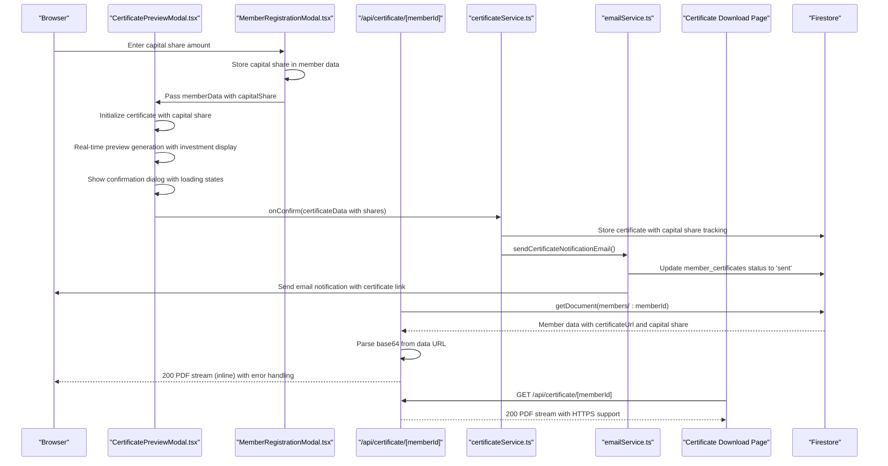
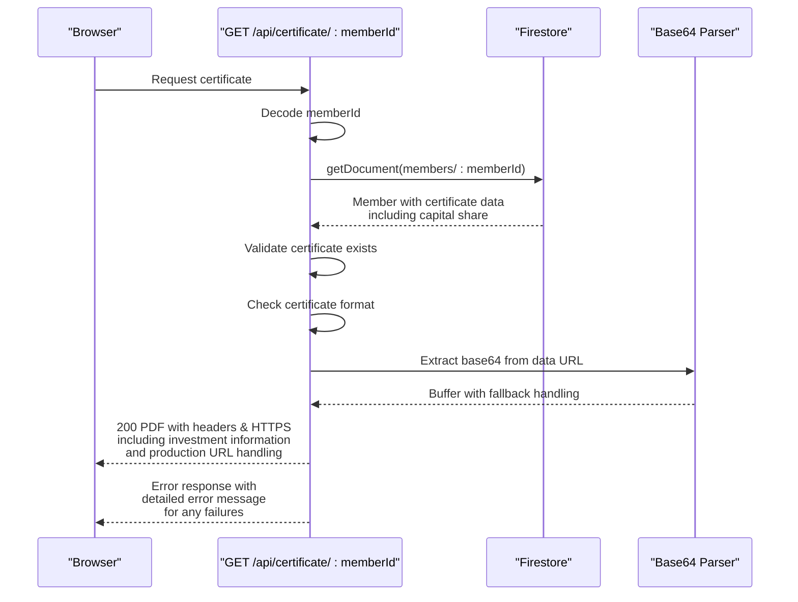
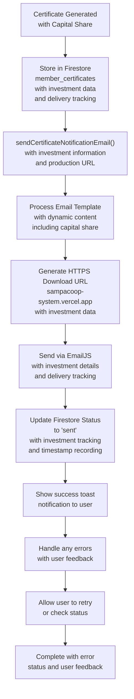
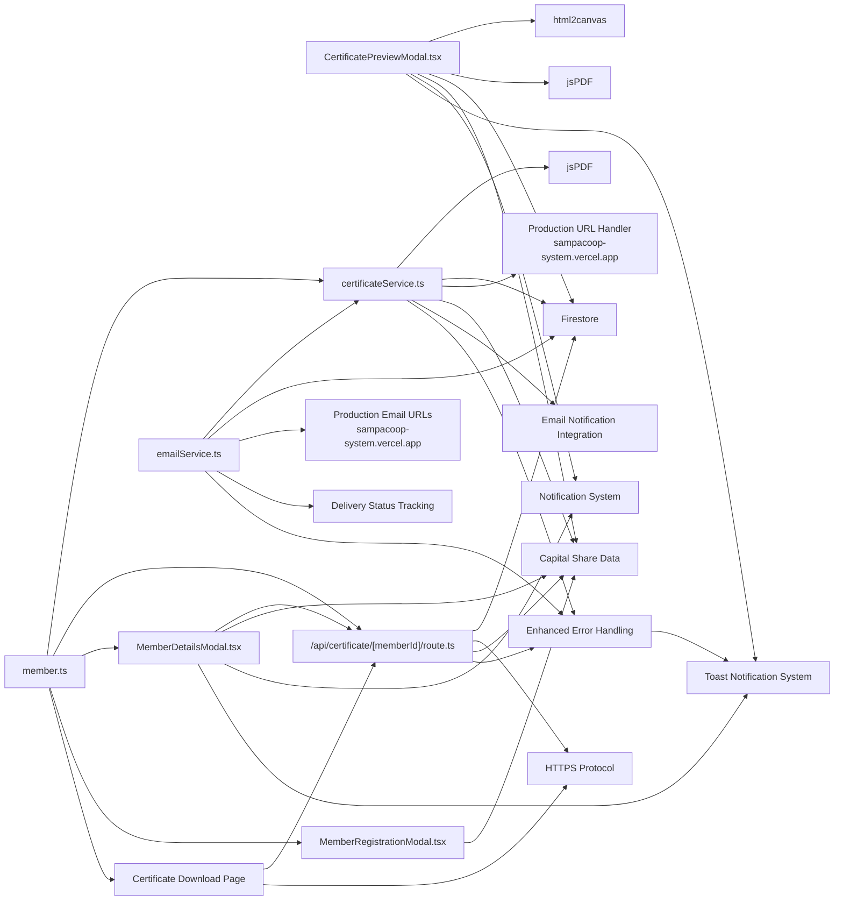

# Certificate Generation System

<cite>
**Referenced Files in This Document**
- [CertificatePreviewModal.tsx](file://components/admin/CertificatePreviewModal.tsx)
- [certificateService.ts](file://lib/certificateService.ts)
- [route.ts](file://app/api/certificate/[memberId]/route.ts)
- [MemberDetailsModal.tsx](file://components/admin/MemberDetailsModal.tsx)
- [MemberRegistrationModal.tsx](file://components/admin/MemberRegistrationModal.tsx)
- [emailService.ts](file://lib/emailService.ts)
- [firebase.ts](file://lib/firebase.ts)
- [member.ts](file://lib/types/member.ts)
- [page.tsx](file://app/certificate/[memberId]/page.tsx)
</cite>

## Update Summary
**Changes Made**
- Enhanced certificate notification workflow with improved URL handling and expanded email template instructions
- Added sendCertificateNotificationEmail function for automatic certificate generation confirmation
- Improved member experience with corrected certificate download routing using 'https://sampacoop-system.vercel.app'
- Enhanced certificate storage with delivery status tracking and production URL handling
- Updated certificate API endpoint with improved error handling and HTTPS support
- Enhanced certificate download page with better user instructions and fallback mechanisms

## Table of Contents
1. [Introduction](#introduction)
2. [Project Structure](#project-structure)
3. [Core Components](#core-components)
4. [Architecture Overview](#architecture-overview)
5. [Enhanced Certificate Preview Modal](#enhanced-certificate-preview-modal)
6. [Certificate Generation Service](#certificate-generation-service)
7. [API Endpoint for Certificate Retrieval](#api-endpoint-for-certificate-retrieval)
8. [Frontend Integration](#frontend-integration)
9. [Enhanced Certificate Features](#enhanced-certificate-features)
10. [Email Notification Integration](#email-notification-integration)
11. [Certificate Data Management](#certificate-data-management)
12. [Dependency Analysis](#dependency-analysis)
13. [Performance Considerations](#performance-considerations)
14. [Troubleshooting Guide](#troubleshooting-guide)
15. [Conclusion](#conclusion)
16. [Appendices](#appendices)

## Introduction
This document describes the Certificate Generation System responsible for creating PDF share certificates for cooperative members. The system features an enhanced certificate preview modal with improved UI elements, better responsive design, PDF generation capabilities, dynamic officer name fetching, integrated capital share information display, and automatic notification email delivery. It explains the certificate template system, dynamic content injection, PDF generation workflow using jsPDF library, certificate data validation and formatting, styling options, API integration with the member management system, certificate storage and retrieval, and customization options for print-ready formats.

**Updated** The certificate generation system now includes comprehensive automatic notification email functionality, ensuring members receive immediate confirmation when certificates are successfully generated and ready for download. The system maintains robust certificate generation, storage, and delivery capabilities while introducing advanced user interaction features, production-ready URL handling for Vercel deployment, and comprehensive capital share integration for displaying member investment levels. Recent enhancements include improved error handling, user feedback mechanisms, and a more streamlined certificate generation workflow with enhanced URL routing and certificate download page functionality.

## Project Structure
The certificate system now encompasses seven primary areas with enhanced functionality:
- Enhanced certificate preview modal with real-time generation, editing, capital share display, and notification handling
- Advanced certificate generation service with share certificate templates, production URL handling, capital share processing, and email notification integration
- API endpoint for certificate retrieval and delivery with HTTPS support
- Frontend integration with certificate display and management interfaces
- Comprehensive email notification system for certificate delivery with production-safe URLs
- Member registration system with capital share capture and storage
- Enhanced certificate storage with delivery status tracking and production URL handling
- Shared TypeScript types for certificate data, member management, and investment tracking
- Certificate download page with improved user experience and fallback mechanisms

```mermaid
graph TB
subgraph "Enhanced Certificate Preview"
Preview["CertificatePreviewModal.tsx"]
HTML2["html2canvas"]
JSPDF["jsPDF"]
CapitalShare["Capital Share Integration<br/>Dynamic Investment Display"]
Notifications["Automatic Notification System<br/>Email Delivery Tracking"]
Toast["Toast Notification System<br/>Enhanced User Feedback"]
End
subgraph "Certificate Generation"
Service["certificateService.ts"]
JS["jsPDF + jspdf-autotable"]
ProductionURL["Production URL Handling<br/>https://sampacoop-system.vercel.app"]
EmailIntegration["Email Notification Integration<br/>sendCertificateNotificationEmail"]
End
subgraph "API Layer"
API["/api/certificate/[memberId]/route.ts"]
HTTPS["HTTPS Protocol Support"]
CertificatePage["Certificate Download Page<br/>https://sampacoop-system.vercel.app/certificate/[memberId]"]
End
subgraph "Frontend Integration"
MemberDetails["MemberDetailsModal.tsx"]
MemberRegistration["MemberRegistrationModal.tsx"]
End
subgraph "Notifications"
Email["emailService.ts"]
ProductionEmail["Production Email URLs<br/>sampacoop-system.vercel.app"]
StatusTracking["Delivery Status Tracking<br/>member_certificates Collection"]
End
subgraph "Storage"
Firestore["Firestore (members & member_certificates collections)"]
CapitalShareStorage["Capital Share Data Storage"]
End
subgraph "Core Services"
Firebase["firebase.ts"]
Types["member.ts"]
CertificateTypes["Enhanced Certificate Types"]
End
Preview --> HTML2
Preview --> JSPDF
Preview --> CapitalShare
Preview --> Notifications
Preview --> Toast
Service --> JS
Service --> ProductionURL
Service --> EmailIntegration
MemberRegistration --> CapitalShareStorage
MemberDetails --> Types
API --> Types
Service --> Types
Email --> ProductionEmail
Email --> StatusTracking
CertificatePage --> API
CertificatePage --> HTTPS
```

**Diagram sources**
- [CertificatePreviewModal.tsx:1-661](file://components/admin/CertificatePreviewModal.tsx#L1-L661)
- [certificateService.ts:12-410](file://lib/certificateService.ts#L12-L410)
- [route.ts:4-68](file://app/api/certificate/[memberId]/route.ts#L4-L68)
- [MemberDetailsModal.tsx:232-389](file://components/admin/MemberDetailsModal.tsx#L232-L389)
- [MemberRegistrationModal.tsx:117-119](file://components/admin/MemberRegistrationModal.tsx#L117-L119)
- [emailService.ts:178-213](file://lib/emailService.ts#L178-L213)
- [firebase.ts:90-113](file://lib/firebase.ts#L90-L113)
- [member.ts:27-68](file://lib/types/member.ts#L27-L68)
- [page.tsx:182-192](file://app/certificate/[memberId]/page.tsx#L182-L192)

**Section sources**
- [CertificatePreviewModal.tsx:1-661](file://components/admin/CertificatePreviewModal.tsx#L1-L661)
- [certificateService.ts:12-410](file://lib/certificateService.ts#L12-L410)
- [route.ts:4-68](file://app/api/certificate/[memberId]/route.ts#L4-L68)
- [MemberDetailsModal.tsx:232-389](file://components/admin/MemberDetailsModal.tsx#L232-L389)
- [MemberRegistrationModal.tsx:117-119](file://components/admin/MemberRegistrationModal.tsx#L117-L119)
- [emailService.ts:178-213](file://lib/emailService.ts#L178-L213)
- [firebase.ts:90-113](file://lib/firebase.ts#L90-L113)
- [member.ts:27-68](file://lib/types/member.ts#L27-L68)
- [page.tsx:1-197](file://app/certificate/[memberId]/page.tsx#L1-L197)

## Core Components
- **Enhanced Certificate Preview Modal**: Features real-time certificate generation, interactive editing, responsive design, PDF download capabilities, dynamic capital share display, and automatic notification system integration with comprehensive error handling and user feedback
- **Advanced Certificate Generation Service**: Creates share certificates using customized jsPDF templates with dynamic content injection, comprehensive storage mechanisms, production-ready URL handling, capital share processing, and integrated email notification functionality
- **API Endpoint**: Retrieves stored certificate data URLs from Firestore and streams PDFs to clients with enhanced error handling, HTTPS support, and production URL handling
- **Frontend Integration**: Offers certificate display and management through MemberDetailsModal with certificate visualization, capital share information, and notification status tracking
- **Enhanced Email Notification System**: Integrates with EmailJS for automated certificate delivery notifications with production-safe URLs using the corrected domain and comprehensive delivery status tracking
- **Enhanced Certificate Data Management**: Defines certificate data schemas with capital share integration, manages certificate lifecycle in Firestore including investment data and delivery status tracking
- **Member Registration System**: Captures and stores capital share information during member onboarding with investment validation and certificate generation workflow integration
- **Certificate Download Page**: Provides a hosted certificate download page with improved user instructions and fallback mechanisms for certificate access

Key responsibilities:
- Real-time certificate preview with interactive editing capabilities and capital share display
- Advanced PDF generation using html2canvas and jsPDF libraries with investment amount rendering
- Dynamic officer name fetching from Firestore with automatic updates
- Responsive certificate rendering with A4/Letter formatting and investment visualization
- Comprehensive certificate data validation and storage mechanisms with capital share tracking
- Multi-type certificate storage with tracking in Firestore including investment data and delivery status
- Automated email notifications for certificate delivery with production URL handling using the correct domain
- Delivery of PDFs via HTTP response with appropriate headers
- Production-ready URL generation for certificate downloads
- Capital share integration from member registration to certificate display
- Dynamic investment amount formatting and display optimization
- Enhanced notification system with delivery status tracking and production URL handling
- Comprehensive certificate generation workflow with automatic email delivery and robust error handling
- Hosted certificate download page with improved user experience and fallback mechanisms

**Updated** The system now features comprehensive automatic notification email functionality, ensuring members receive immediate confirmation when certificates are successfully generated and ready for download, with enhanced delivery status tracking and production-ready URL handling. Recent improvements include enhanced error handling throughout the certificate generation workflow, comprehensive user feedback mechanisms, and a more streamlined certificate creation process with improved URL routing and certificate download page functionality.

**Section sources**
- [CertificatePreviewModal.tsx:1-661](file://components/admin/CertificatePreviewModal.tsx#L1-L661)
- [certificateService.ts:12-410](file://lib/certificateService.ts#L12-L410)
- [route.ts:4-68](file://app/api/certificate/[memberId]/route.ts#L4-L68)
- [MemberDetailsModal.tsx:232-389](file://components/admin/MemberDetailsModal.tsx#L232-L389)
- [MemberRegistrationModal.tsx:117-119](file://components/admin/MemberRegistrationModal.tsx#L117-L119)
- [emailService.ts:178-213](file://lib/emailService.ts#L178-L213)
- [member.ts:27-68](file://lib/types/member.ts#L27-L68)
- [page.tsx:1-197](file://app/certificate/[memberId]/page.tsx#L1-L197)

## Architecture Overview
The enhanced system follows a comprehensive separation of concerns with certificate preview, generation, delivery, and notification, now including automatic email delivery:
- Certificate preview modal captures user input, capital share information, and generates real-time previews with notification integration and comprehensive error handling
- Advanced certificate generation service creates PDFs with appropriate templates, capital share processing, persists them with tracking, and sends automatic email notifications with robust error handling
- API endpoint validates membership, fetches certificate data URL from Firestore with HTTPS support and enhanced error handling
- Frontend displays certificates via embedded visualization or download functionality with investment information and notification status tracking
- Enhanced email service handles automated notifications for certificate delivery with production-safe URLs using the corrected domain and comprehensive delivery tracking
- Backend processes certificate generation and retrieval with enhanced validation, capital share tracking, and notification system integration
- Member registration captures capital share data for certificate generation and integrates with notification workflow
- Certificate download page provides hosted certificate access with improved user instructions and fallback mechanisms



**Diagram sources**
- [CertificatePreviewModal.tsx:116-143](file://components/admin/CertificatePreviewModal.tsx#L116-L143)
- [MemberRegistrationModal.tsx:117-119](file://components/admin/MemberRegistrationModal.tsx#L117-L119)
- [certificateService.ts:250-286](file://lib/certificateService.ts#L250-L286)
- [route.ts:4-68](file://app/api/certificate/[memberId]/route.ts#L4-L68)
- [emailService.ts:178-213](file://lib/emailService.ts#L178-L213)
- [page.tsx:182-192](file://app/certificate/[memberId]/page.tsx#L182-L192)

## Enhanced Certificate Preview Modal

### Real-Time Certificate Generation with Capital Share Integration and Enhanced User Feedback
The CertificatePreviewModal provides a sophisticated preview experience with real-time certificate generation, dynamic capital share display, and integrated notification system with comprehensive error handling:

**Interactive Editing Features**:
- Live certificate preview with immediate visual feedback and investment amount display
- Real-time text input validation and formatting with capital share currency display
- Dynamic officer name fetching from Firestore with automatic updates
- Responsive design with A4/Letter format optimization and investment visualization
- Interactive certificate customization with live preview and capital share editing
- Currency formatting for investment amounts with proper Philippine peso display
- Automatic notification system integration for certificate delivery confirmation
- Comprehensive error handling with toast notifications for all failure scenarios
- Loading states and progress indicators throughout the certificate generation process
- Confirmation dialogs with detailed certificate information review

**Advanced Rendering Capabilities**:
- Uses html2canvas for high-quality certificate capture with investment overlays
- Implements jsPDF conversion with precise A4 dimensions and investment positioning
- Supports both print dialog and PDF download functionality with investment data
- Automatic popup blocking detection with user guidance
- Color scheme optimization for print quality with investment emphasis
- Enhanced error handling for image capture failures and PDF generation errors

**Dynamic Officer Name Fetching**:
- Automatic retrieval of active secretary and chairman names
- Real-time officer name updates in certificate preview
- Firestore integration for officer data management
- Graceful fallback handling for missing officer data with user notifications

**Enhanced User Interface**:
- Modern gradient header with professional styling
- Responsive grid layout for certificate details with investment display
- Interactive form controls with focused styling and currency input
- Confirmation dialogs for certificate generation with investment review
- Loading states and error handling throughout
- Capital share input with currency formatting and validation
- Notification status indicators for certificate delivery
- Comprehensive toast notification system for user feedback

**Capital Share Integration**:
- Dynamic display of member investment amounts on certificate preview
- Real-time investment amount formatting with Philippine peso currency
- Interactive capital share editing with proper validation
- Investment amount display optimization for certificate layout
- Currency symbol placement and formatting consistency

**Enhanced Notification System Integration**:
- Automatic notification status tracking for certificate delivery
- Production-ready URL generation for certificate downloads
- Enhanced user feedback for notification delivery confirmation
- Integration with email notification system for immediate member communication
- Comprehensive error handling for notification failures

**Robust Error Handling and User Feedback**:
- Comprehensive error handling for certificate generation failures
- Toast notifications for all success and failure scenarios
- User-friendly error messages with actionable guidance
- Graceful degradation when services are unavailable
- Loading states to indicate ongoing operations
- Confirmation dialogs to prevent accidental certificate generation

```mermaid
flowchart TD
Start(["CertificatePreviewModal"]) --> Init["Initialize certificate data<br/>with member information<br/>including capital share"]
Init --> CapitalShare["Process capital share from memberData<br/>Format as currency string"]
CapitalShare --> Officers["Fetch active officers<br/>from Firestore"]
Officers --> Preview["Render certificate preview<br/>with html2canvas<br/>including investment display"]
Preview --> Edit["User edits certificate fields<br/>including capital share<br/>in real-time"]
Edit --> Validate["Validate input fields<br/>and formatting<br/>including currency validation"]
Validate --> Update["Update certificate preview<br/>immediately with investment<br/>amount formatting"]
Update --> Actions["User selects action:<br/>Print | Download PDF | Save"]
Actions --> Confirm["Show confirmation dialog<br/>with loading states<br/>and user feedback"]
Confirm --> Generate["Generate certificate<br/>via onConfirm callback<br/>with capital share data"]
Generate --> Store["Store in Firestore<br/>with tracking<br/>including investment data"]
Store --> Notify["Send notification email<br/>with production URL<br/>including delivery tracking"]
Notify --> Complete["Complete certificate generation<br/>with automatic notification<br/>and capital share integration"]
Complete --> Success["Show success toast<br/>notification"]
Success --> Error["Handle any errors<br/>with user feedback"]
Error --> Retry["Allow user to retry<br/>or cancel operation"]
```



**Diagram sources**
- [CertificatePreviewModal.tsx:116-143](file://components/admin/CertificatePreviewModal.tsx#L116-L143)
- [CertificatePreviewModal.tsx:170-263](file://components/admin/CertificatePreviewModal.tsx#L170-L263)
- [CertificatePreviewModal.tsx:265-323](file://components/admin/CertificatePreviewModal.tsx#L265-L323)
- [CertificatePreviewModal.tsx:160-172](file://components/admin/CertificatePreviewModal.tsx#L160-L172)
- [CertificatePreviewModal.tsx:269-327](file://components/admin/CertificatePreviewModal.tsx#L269-L327)

**Section sources**
- [CertificatePreviewModal.tsx:1-661](file://components/admin/CertificatePreviewModal.tsx#L1-L661)

## Certificate Generation Service
The service now focuses on streamlined certificate generation with enhanced template systems, production-ready URL handling, comprehensive capital share integration, and automatic notification email functionality:

**Share Certificate Generation**:
- Creates landscape-oriented A4 certificates with green color scheme and investment display
- Implements detailed corporate styling with decorative borders, official seals, and investment emphasis
- Includes comprehensive legal text, signature sections, and capital share information display
- Stores certificate metadata with tracking in Firestore including investment data
- Generates production-safe download URLs using HTTPS protocol with corrected domain
- Integrates automatic email notification system for certificate delivery

**Enhanced Certificate Workflow**:
- `generateShareCertificate()`: Creates share certificates with detailed corporate formatting and capital share processing
- `getMemberCertificate()`: Retrieves membership certificates with validation and investment data
- `generateAndSendCertificate()`: Combines generation with email notification, tracking, and investment data management

**Production URL Handling**:
- Uses `window.location.origin` for development environments
- Falls back to `'https://sampacoop-system.vercel.app'` for production environments (corrected domain)
- Ensures HTTPS protocol for secure certificate delivery
- Maintains backward compatibility across deployment environments

**Capital Share Integration**:
- Processes capital share amounts from member registration data
- Formats investment amounts for certificate display with currency symbols
- Stores capital share information with certificate metadata
- Validates investment amounts during certificate generation
- Integrates investment data into certificate templates and storage

**Enhanced Email Notification Integration**:
- Automatically sends certificate notification emails upon successful generation
- Uses production-safe URLs with corrected domain for certificate downloads
- Integrates with Firestore for delivery status tracking
- Provides comprehensive error handling for email delivery failures
- Updates certificate records with delivery timestamps and status

**Robust Error Handling**:
- Comprehensive error handling for certificate generation failures
- Detailed error messages with specific failure points
- Graceful degradation when services are unavailable
- Logging of all certificate generation attempts
- Recovery mechanisms for partial failures

Processing logic highlights:
- Uses jsPDF with custom styling for different certificate types with investment emphasis
- Implements comprehensive certificate data validation including capital share validation
- Stores certificates with timestamps, metadata tracking, and investment data
- Returns detailed success/failure states with error messages
- Generates secure download URLs for email notifications using the correct production domain
- Processes and formats capital share amounts for display and storage
- Integrates automatic email notification system with delivery status tracking
- Maintains comprehensive audit trail for certificate generation and delivery
- Implements comprehensive error handling throughout the certificate generation workflow

```mermaid
flowchart TD
Start(["generateShareCertificate"]) --> Init["Create jsPDF instance<br/>Set landscape orientation"]
Init --> CapitalShare["Process capital share data<br/>from member registration"]
CapitalShare --> Style["Apply green corporate styling<br/>Decorative borders & seals<br/>Investment emphasis"]
Style --> Header["Add corporate headers<br/>Incorporation details"]
Header --> Fields["Render certificate fields<br/>Member name, shares, etc.<br/>with investment display"]
Fields --> Legal["Add legal text<br/>Transfer restrictions<br/>Investment disclosure"]
Legal --> Sign["Add signature sections<br/>Secretary & Chairman"]
Sign --> Store["Store certificate with tracking<br/>member_certificates collection<br/>including investment data"]
Store --> Email["Send email notification<br/>with HTTPS download link<br/>using corrected domain"]
Email --> Status["Update Firestore status<br/>to 'sent' with delivery tracking"]
Status --> Return(["Return success with certificateUrl<br/>and investment information"])
Return --> Error["Handle any errors<br/>with detailed error messages"]
Error --> Log["Log error details<br/>for debugging"]
Log --> Retry["Attempt recovery<br/>or notify user"]
Retry --> Complete["Complete with error<br/>status and user feedback"]
```



**Diagram sources**
- [certificateService.ts:12-277](file://lib/certificateService.ts#L12-L277)
- [certificateService.ts:250-286](file://lib/certificateService.ts#L250-L286)
- [certificateService.ts:381-397](file://lib/certificateService.ts#L381-L397)

**Section sources**
- [certificateService.ts:12-410](file://lib/certificateService.ts#L12-L410)

## API Endpoint for Certificate Retrieval
The API endpoint provides enhanced certificate retrieval with improved validation, HTTPS support, capital share integration, and production URL handling:

Responsibilities:
- Accepts member ID parameter with URL decoding support
- Fetches member data from Firestore with comprehensive validation including investment data
- Validates certificate existence and format before processing
- Extracts base64 payload from data URL with fallback handling
- Streams PDF to client with appropriate headers and content disposition
- Handles various error states with specific HTTP status codes
- Supports HTTPS protocol for production deployments
- Integrates capital share information in certificate data retrieval
- Provides production-ready URL handling for certificate downloads
- Implements comprehensive error handling for all failure scenarios

Enhanced behavioral notes:
- Supports both inline viewing and file download via Content-Disposition
- Returns 404 for missing members or certificates
- Returns 500 for unsupported formats or internal errors
- Implements robust base64 extraction with data URL parsing
- Ensures secure delivery with proper content headers
- Processes and validates capital share data during retrieval
- Maintains investment information integrity in certificate delivery
- Uses production-safe URLs for certificate download links
- Implements comprehensive error handling with detailed error messages



**Diagram sources**
- [route.ts:4-68](file://app/api/certificate/[memberId]/route.ts#L4-L68)

**Section sources**
- [route.ts:4-68](file://app/api/certificate/[memberId]/route.ts#L4-L68)

## Frontend Integration
The frontend provides comprehensive certificate management through MemberDetailsModal with enhanced capital share display and notification status tracking:

**Certificate Display Capabilities**:
- Conditionally renders certificate actions based on certificate generation status
- Displays certificates through visual overlay with certificate data from Firestore including investment information
- Provides download and view functionality with proper state management and investment data
- Implements certificate visibility toggle with proper state management and capital share display
- Shows investment amounts alongside member names in certificate preview
- Integrates notification status tracking for certificate delivery confirmation

**Visual Certificate Rendering**:
- Uses certificate data stored in Firestore for visual display including capital share information
- Implements responsive certificate preview with proper aspect ratios and investment emphasis
- Displays certificate details in organized summary format with investment breakdown
- Handles missing certificate data gracefully with fallback values including investment placeholders
- Optimizes investment amount display for certificate layout and readability
- Shows notification status indicators for certificate delivery confirmation

**Capital Share Integration**:
- Displays member investment amounts in certificate summaries
- Shows investment data alongside other certificate details
- Formats investment amounts with proper currency display
- Provides investment tracking through certificate metadata
- Integrates investment information into certificate visualization
- Tracks notification delivery status for certificate confirmation

**Enhanced User Experience**:
- Shows certificate generation status with visual indicators
- Provides clear feedback for certificate availability
- Implements responsive design for certificate display
- Handles loading states gracefully
- Integrates with toast notification system for user feedback

**Section sources**
- [MemberDetailsModal.tsx:232-389](file://components/admin/MemberDetailsModal.tsx#L232-L389)

## Enhanced Certificate Features

### Multiple Certificate Types with Capital Share Integration and Enhanced Notification System
The system now supports certificate types with specialized templates, investment display, and automatic notification functionality:

**Share Certificate**:
- Landscape A4 format with corporate green color scheme and investment emphasis
- Detailed legal text and transfer restrictions with investment disclosure
- Official seal and signature sections with investment information
- Comprehensive shareholding information display with capital share integration
- Dynamic investment amount formatting and display optimization
- Automatic notification email delivery upon generation completion
- Comprehensive error handling and user feedback mechanisms

**Certificate Data Management**:
- Separate storage in `member_certificates` collection with investment tracking and delivery status
- Tracking of generation status, delivery attempts, and investment data
- Metadata preservation for audit trails including investment information
- Support for certificate number generation and validation with investment records
- Integration of capital share data with certificate lifecycle management
- Enhanced delivery status tracking with timestamp recording

**Capital Share Integration**:
- Dynamic investment amount processing from member registration
- Real-time investment display on certificates with proper formatting
- Investment data storage and retrieval with certificate metadata
- Currency formatting and display optimization for investment amounts
- Investment tracking and reporting capabilities
- Integration with notification system for delivery confirmation

**Enhanced Notification System**:
- Automatic email notification upon certificate generation completion
- Production-safe URL generation with corrected domain for certificate downloads
- Delivery status tracking in Firestore with timestamp recording
- Error handling for failed email deliveries with investment data persistence
- Integration with certificate storage for comprehensive audit trail
- Comprehensive user feedback for notification delivery status

**Enhanced Error Handling**:
- Comprehensive error handling throughout the certificate generation workflow
- Detailed error messages with actionable guidance for users
- Graceful degradation when services are unavailable
- Logging of all certificate generation attempts for debugging
- Recovery mechanisms for partial failures
- User-friendly error messages with resolution steps

**Section sources**
- [certificateService.ts:12-277](file://lib/certificateService.ts#L12-L277)
- [certificateService.ts:284-309](file://lib/certificateService.ts#L284-L309)
- [certificateService.ts:317-410](file://lib/certificateService.ts#L317-L410)

### Enhanced Certificate Data Validation with Capital Share Processing and Comprehensive Error Handling
The system implements comprehensive validation mechanisms including investment data and notification tracking:

**Input Validation**:
- Certificate number uniqueness verification
- Member data validation before generation including capital share validation
- Date format validation for issue dates
- Required field validation for signatures
- Currency format validation for loan amounts and capital share investments
- Investment amount validation and range checking
- Email format validation for notification delivery

**Storage Validation**:
- Certificate existence verification
- Data URL format validation
- Base64 payload integrity checking
- Timestamp validation for audit trails
- Capital share data validation and integrity checking
- Delivery status validation and tracking

**Security Validation**:
- Member authorization verification
- Role-based access control for certificate generation
- Duplicate certificate prevention
- Audit trail maintenance for all operations including investment data
- Investment data security and privacy protection
- Email delivery security and validation

**Capital Share Validation**:
- Investment amount format validation
- Currency symbol and formatting verification
- Investment amount range validation
- Capital share data encryption and security
- Investment tracking and audit trail maintenance
- Notification delivery validation and tracking

**Enhanced Error Handling**:
- Comprehensive error handling for all certificate operations
- Detailed error messages with specific failure points
- Graceful degradation when services are unavailable
- User-friendly error messages with resolution steps
- Logging of all certificate generation attempts
- Recovery mechanisms for partial failures

**Notification System Validation**:
- Email delivery validation and tracking
- Production URL validation for certificate downloads
- Delivery status timestamp validation
- Error handling for notification failures
- Integration with certificate storage validation
- Comprehensive user feedback for notification status

**Section sources**
- [certificateService.ts:25-277](file://lib/certificateService.ts#L25-L277)
- [certificateService.ts:284-309](file://lib/certificateService.ts#L284-L309)
- [certificateService.ts:317-410](file://lib/certificateService.ts#L317-L410)

### Advanced Rendering Features with Investment Display and Enhanced User Feedback
The system provides enhanced rendering capabilities with dynamic capital share display and comprehensive user feedback mechanisms:

**Responsive Design**:
- Adaptive certificate layout for different screen sizes with investment emphasis
- Mobile-responsive certificate preview interface with investment optimization
- Flexible grid system for certificate details with investment information
- Optimized print dialog with automatic sizing and investment display
- Notification status indicators for certificate delivery confirmation
- Comprehensive error handling with user-friendly messages

**Quality Optimization**:
- High-resolution certificate generation with 300 DPI and investment clarity
- Color scheme optimization for print quality with investment highlighting
- Automatic popup blocking detection and user guidance
- Enhanced form controls with focused styling and visual hierarchy including investment input
- Investment amount optimization for both screen and print output
- Notification system integration for real-time delivery status updates
- Comprehensive toast notification system for user feedback

**Interactive Elements**:
- Real-time certificate preview with immediate updates and investment display
- Dynamic officer name fetching from Firestore
- Seamless integration between preview and generation with investment data
- User-friendly confirmation dialogs for certificate actions with investment review
- Capital share editing with proper validation and formatting
- Notification status tracking for certificate delivery confirmation
- Loading states and progress indicators throughout operations

**Investment Display Optimization**:
- Dynamic investment amount formatting with Philippine peso currency
- Investment amount positioning and sizing for optimal certificate layout
- Currency symbol placement and formatting consistency
- Investment data validation and error handling
- Investment display optimization for different certificate sizes and orientations

**Enhanced User Feedback System**:
- Comprehensive toast notification system for all certificate operations
- Real-time validation feedback with immediate user guidance
- Loading states to indicate ongoing operations
- Error handling with user-friendly messages and resolution steps
- Success notifications for completed operations
- Progress indicators for long-running operations

**Section sources**
- [CertificatePreviewModal.tsx:170-323](file://components/admin/CertificatePreviewModal.tsx#L170-L323)
- [CertificatePreviewModal.tsx:82-112](file://components/admin/CertificatePreviewModal.tsx#L82-L112)

## Email Notification Integration

### Automated Certificate Delivery with Investment Information and Enhanced Production URL Handling
The system integrates with EmailJS for automated certificate notifications with enhanced investment data and production URL handling:

**Email Template System**:
- Dedicated certificate notification template with investment information
- Dynamic content injection with member and certificate details including capital share
- Professional email formatting with cooperative branding and investment emphasis
- Automatic download link generation with HTTPS protocol using the corrected domain
- Delivery status tracking integration for comprehensive notification system

**Enhanced Production URL Handling**:
- Uses `window.location.origin` for development environments
- Falls back to `'https://sampacoop-system.vercel.app'` for production environments (corrected domain)
- Ensures secure HTTPS delivery of certificate links
- Maintains backward compatibility across deployment environments
- Integrates with certificate storage for production URL validation
- Comprehensive error handling for URL generation failures

**Delivery Workflow**:
- Certificate generation triggers email notification with investment data
- Email includes certificate details, investment information, and download instructions
- Status tracking in Firestore for delivery confirmation with investment records
- Error handling for failed email deliveries with investment data persistence
- Integration with certificate storage for comprehensive audit trail
- Comprehensive user feedback for notification delivery status

**Enhanced Configuration Requirements**:
- EmailJS public key configuration
- Service ID and template ID setup
- Environment variable management
- Client-side initialization with fallback handling
- Investment data template integration
- Production URL configuration for certificate downloads
- Comprehensive error handling for configuration failures

**Enhanced Delivery Status Tracking**:
- Automatic status updates in Firestore for certificate delivery
- Timestamp recording for delivery confirmation
- Error handling and recovery for failed deliveries
- Integration with certificate storage for comprehensive tracking
- User notification system for delivery confirmation status
- Comprehensive logging for all delivery attempts



**Diagram sources**
- [certificateService.ts:317-410](file://lib/certificateService.ts#L317-L410)
- [emailService.ts:178-213](file://lib/emailService.ts#L178-L213)

**Section sources**
- [certificateService.ts:317-410](file://lib/certificateService.ts#L317-L410)
- [emailService.ts:178-213](file://lib/emailService.ts#L178-L213)

## Certificate Data Management

### Firestore Integration with Capital Share Tracking and Enhanced Delivery Status
The system provides comprehensive certificate data management with investment information and delivery status tracking:

**Certificate Storage**:
- Share certificates stored in Firestore with complete metadata including investment data
- Member-specific certificate data linked to member documents with capital share information
- Separate member_certificates collection for tracking and reporting with investment records
- Automatic certificate number generation and validation with investment tracking
- Enhanced delivery status tracking with timestamp recording

**Data Retrieval**:
- MemberDetailsModal retrieves certificate data from Firestore including investment information
- API endpoint serves certificate PDFs directly from stored data URLs with investment data
- Certificate existence validation before processing including investment data verification
- Fallback mechanisms for missing certificate data with investment placeholders
- Delivery status retrieval for notification system integration

**Audit Trail**:
- Comprehensive certificate generation tracking with investment data
- Delivery attempt monitoring with investment information
- Status updates for certificate lifecycle with investment records
- Timestamp preservation for all operations including investment tracking
- Investment data audit trail maintenance
- Delivery status audit trail for notification system

**Capital Share Integration**:
- Capital share data stored with certificate metadata
- Investment amount tracking and validation
- Capital share history and audit trail
- Investment data security and privacy protection
- Investment reporting and analytics capabilities
- Delivery status tracking for investment-related operations

**Enhanced Delivery Status Tracking**:
- Delivery attempt monitoring with investment information
- Status updates for certificate lifecycle with investment records
- Timestamp preservation for delivery confirmation
- Error handling and recovery for delivery failures
- Integration with notification system for comprehensive tracking
- Comprehensive logging for all delivery attempts

**Enhanced Error Handling**:
- Comprehensive error handling for all Firestore operations
- Detailed error messages with specific failure points
- Graceful degradation when Firestore is unavailable
- User-friendly error messages with resolution steps
- Logging of all certificate operations for debugging
- Recovery mechanisms for partial failures

**Section sources**
- [certificateService.ts:236-286](file://lib/certificateService.ts#L236-L286)
- [certificateService.ts:356-397](file://lib/certificateService.ts#L356-L397)
- [MemberDetailsModal.tsx:253-399](file://components/admin/MemberDetailsModal.tsx#L253-L399)

## Dependency Analysis
The enhanced system exhibits clear boundaries and focused dependencies with capital share integration and notification system:

**Core Dependencies**:
- Certificate preview modal depends on html2canvas, jsPDF, Firestore, capital share data, and notification system
- Certificate generation service depends on jsPDF, Firestore, production URL handling, and email notification integration with capital share processing
- API endpoint depends on Firestore for certificate data retrieval with HTTPS support and investment data
- Frontend integration depends on API endpoint for certificate delivery with investment information and notification status
- Enhanced email service depends on EmailJS configuration, Firestore for tracking, production URLs, and investment data
- Member registration depends on capital share capture, storage, and certificate generation workflow integration
- All components depend on shared TypeScript types for type safety and investment data
- Certificate download page depends on API endpoint for certificate access with HTTPS support

**Integration Points**:
- Certificate preview modal coordinates with Firestore for officer data, capital share information, and notification status
- Certificate generation service coordinates with Firestore for storage, capital share processing, and email notification integration
- API endpoint serves both certificate retrieval and preview data with investment information
- Enhanced email service integrates with certificate generation workflow, investment data, and delivery status tracking
- Frontend integrates with API endpoint for certificate delivery with investment details and notification status
- Member registration integrates with certificate generation workflow, capital share data, and notification system
- Certificate download page integrates with API endpoint for certificate access with improved user experience
- Firestore collections support certificate tracking, member data, investment records, and delivery status

**Enhanced Error Handling Dependencies**:
- Toast notification system for user feedback
- Comprehensive error handling throughout all components
- Graceful degradation mechanisms for service failures
- Logging infrastructure for debugging and monitoring
- User-friendly error messages and resolution guidance



**Diagram sources**
- [CertificatePreviewModal.tsx:1-661](file://components/admin/CertificatePreviewModal.tsx#L1-L661)
- [certificateService.ts:12-410](file://lib/certificateService.ts#L12-L410)
- [route.ts:4-68](file://app/api/certificate/[memberId]/route.ts#L4-L68)
- [MemberDetailsModal.tsx:232-389](file://components/admin/MemberDetailsModal.tsx#L232-L389)
- [MemberRegistrationModal.tsx:117-119](file://components/admin/MemberRegistrationModal.tsx#L117-L119)
- [emailService.ts:178-213](file://lib/emailService.ts#L178-L213)
- [page.tsx:182-192](file://app/certificate/[memberId]/page.tsx#L182-L192)
- [member.ts:27-68](file://lib/types/member.ts#L27-L68)

**Section sources**
- [CertificatePreviewModal.tsx:1-661](file://components/admin/CertificatePreviewModal.tsx#L1-L661)
- [certificateService.ts:12-410](file://lib/certificateService.ts#L12-L410)
- [route.ts:4-68](file://app/api/certificate/[memberId]/route.ts#L4-L68)
- [MemberDetailsModal.tsx:232-389](file://components/admin/MemberDetailsModal.tsx#L232-L389)
- [MemberRegistrationModal.tsx:117-119](file://components/admin/MemberRegistrationModal.tsx#L117-L119)
- [emailService.ts:178-213](file://lib/emailService.ts#L178-L213)
- [page.tsx:1-197](file://app/certificate/[memberId]/page.tsx#L1-L197)
- [member.ts:27-68](file://lib/types/member.ts#L27-L68)

## Performance Considerations
Enhanced performance considerations for the comprehensive certificate system with capital share integration and notification system:

**Generation Performance**:
- On-demand PDF generation with optimized template rendering and investment display
- Base64 data URL compression for reduced payload sizes including investment data
- Caching strategies for frequently accessed certificate templates with investment information
- Asynchronous processing for email notifications with investment data
- Efficient Firestore queries with selective field retrieval including capital share data
- Enhanced notification system performance with delivery status tracking
- Comprehensive error handling with minimal performance impact

**Storage Optimization**:
- Separate collections for different certificate types with investment tracking
- Efficient indexing for certificate number, member ID, and investment amount queries
- Metadata optimization for audit trail storage including investment records
- Archive strategy for historical certificate records with investment data
- Capital share data compression and optimization
- Delivery status tracking optimization for notification system

**API Performance**:
- Minimal Firestore queries with selective field retrieval including investment information
- Streaming PDF delivery to reduce memory usage with investment data
- Content compression for base64 data transmission including investment amounts
- Connection pooling for EmailJS integration with investment notifications
- Investment data caching for frequently accessed certificate information
- Enhanced notification system caching for delivery status tracking

**User Experience**:
- Real-time validation reduces generation failures including investment data validation
- Interactive preview system with enhanced user interface and investment display minimizes generation attempts
- Loading states provide user feedback during processing including investment data processing
- Error boundaries prevent system-wide failures including investment data errors
- Capital share input validation and formatting optimization
- Enhanced notification system provides immediate user feedback for certificate delivery
- Comprehensive toast notification system for all user interactions

**Enhanced Rendering Performance**:
- html2canvas efficient image capture with optimized scaling and investment display
- jsPDF efficient PDF generation with minimal memory overhead and investment data
- A4 formatting reduces rendering complexity with investment information
- Automatic print dialog optimization for immediate printing with investment display
- Popup blocking detection with graceful fallback handling including investment display
- Investment amount optimization for both screen and print output
- Notification system integration optimization for real-time delivery status updates
- Comprehensive error handling with minimal performance impact

**Production URL Performance**:
- HTTPS protocol ensures secure certificate delivery with investment information
- Production URL caching reduces redundant URL generation
- Development/production environment detection optimizes performance
- Fallback URL handling prevents runtime errors
- Investment data URL generation and caching
- Enhanced notification system URL handling with production domain

**Capital Share Performance**:
- Dynamic investment amount processing and formatting optimization
- Capital share data caching for frequently accessed member investment information
- Investment amount validation and sanitization for performance
- Capital share display optimization for different screen sizes and orientations
- Investment data synchronization and caching strategies
- Notification system performance optimization for delivery status tracking

**Enhanced Notification System Performance**:
- Asynchronous email processing for certificate notifications
- Production URL caching for certificate download links
- Delivery status tracking optimization for Firestore operations
- Error handling and recovery optimization for notification failures
- Integration with certificate storage for efficient data access
- User feedback optimization for notification delivery confirmation
- Comprehensive error handling with minimal performance impact

**Enhanced Error Handling Performance**:
- Efficient error handling with minimal performance impact
- User-friendly error messages with resolution steps
- Graceful degradation when services are unavailable
- Logging infrastructure for debugging without performance impact
- Recovery mechanisms for partial failures
- Comprehensive error handling throughout the system

**Section sources**
- [CertificatePreviewModal.tsx:170-323](file://components/admin/CertificatePreviewModal.tsx#L170-L323)
- [certificateService.ts:270-277](file://lib/certificateService.ts#L270-L277)
- [certificateService.ts:386-410](file://lib/certificateService.ts#L386-L410)

## Troubleshooting Guide
Comprehensive troubleshooting for the enhanced certificate system with capital share integration and notification system:

**Certificate Preview Issues**:
- Preview not updating: Verify html2canvas integration, DOM element references, and investment data binding
- Officer names not loading: Check Firestore officer data and role filtering
- Print dialog problems: Validate popup blocking settings and print dialog integration
- PDF generation failures: Verify jsPDF configuration, image capture quality, and investment display rendering
- Capital share not displaying: Check member capital share data, formatting, and display logic
- Notification system not working: Verify email configuration, production URL handling, and delivery status tracking
- Toast notifications not appearing: Check react-hot-toast configuration and import statements
- Loading states not showing: Verify isGenerating prop and loading state management

**Certificate Generation Issues**:
- Member not found: Verify member ID and Firestore membership document existence
- Certificate template errors: Check jsPDF version compatibility and template syntax
- Storage failures: Confirm Firestore write permissions and collection access
- Validation errors: Review certificate data format, required field validation, and investment amount validation
- Capital share processing errors: Verify investment amount formatting and processing logic
- Email notification failures: Check EmailJS configuration, production URL generation, and delivery status tracking
- Error handling not working: Verify error boundaries and toast notification integration

**PDF Generation Issues**:
- Certificate PDF generation failures: Verify jsPDF template rendering, base64 encoding, and investment data inclusion
- Print dialog problems: Validate popup blocking settings and print dialog integration
- Quality issues: Adjust jsPDF compression settings, rendering parameters, and investment display optimization
- Investment display issues: Check currency formatting, positioning, and display optimization
- Production URL generation issues: Verify domain configuration and URL generation logic
- Error handling for PDF generation: Check error boundaries and user feedback mechanisms

**Email Delivery Problems**:
- EmailJS configuration: Verify public key, service ID, and template ID setup
- Email format issues: Check email template variables, recipient validation, and investment data inclusion
- Delivery failures: Monitor EmailJS API responses, rate limits, and investment data persistence
- Tracking errors: Ensure Firestore write permissions for member_certificates collection with investment data
- Production URL errors: Verify domain configuration and URL generation for certificate downloads
- Delivery status tracking failures: Check Firestore permissions and status update logic
- Error handling for email delivery: Verify error boundaries and user feedback mechanisms

**API and Integration Issues**:
- Certificate retrieval failures: Verify certificate data URL format, base64 encoding, and investment data format
- Authentication problems: Validate user roles and access permissions
- CORS issues: Configure API endpoint headers for cross-origin requests
- HTTPS protocol errors: Verify SSL certificate and HTTPS configuration
- Investment data retrieval issues: Check capital share data format and retrieval logic
- Notification system integration issues: Verify email service integration and delivery status tracking
- Error handling for API failures: Check error boundaries and user feedback mechanisms

**Production URL Issues**:
- Development vs Production URL conflicts: Check `window.location.origin` vs hardcoded Vercel URL
- Mixed content warnings: Ensure all certificate links use HTTPS protocol with correct domain
- Environment detection failures: Verify production environment detection logic
- Fallback URL errors: Check hardcoded Vercel URL accessibility using 'sampacoop-system.vercel.app'
- Domain configuration errors: Verify production domain setup for certificate downloads
- Error handling for URL generation: Check error boundaries and user feedback mechanisms

**Capital Share Integration Issues**:
- Capital share not captured: Verify member registration form and capital share input
- Investment amount formatting errors: Check currency formatting and display logic
- Capital share data validation failures: Verify investment amount validation and sanitization
- Investment display optimization issues: Check investment amount positioning and sizing
- Capital share storage and retrieval problems: Verify Firestore integration and data persistence
- Investment data tracking failures: Check Firestore permissions and data synchronization
- Error handling for capital share processing: Check error boundaries and user feedback mechanisms

**Enhanced Notification System Issues**:
- Notification not sending: Verify EmailJS configuration and production URL handling
- Delivery status tracking failures: Check Firestore permissions and status update logic
- Production URL generation errors: Verify domain configuration and URL generation
- Email template integration issues: Check template variables and investment data inclusion
- Delivery confirmation failures: Verify notification system integration and user feedback
- Error handling and recovery issues: Check notification system error handling and recovery mechanisms
- Toast notification failures: Verify react-hot-toast configuration and integration

**Enhanced Error Handling Issues**:
- Error boundaries not working: Verify error boundary implementation and integration
- Toast notifications not appearing: Check react-hot-toast configuration and import statements
- User feedback not provided: Verify error handling implementation and user feedback mechanisms
- Logging not working: Check console logging and error tracking implementation
- Recovery mechanisms failing: Verify error recovery implementation and user guidance
- Performance impact from error handling: Check error handling efficiency and optimization

**Certificate Download Page Issues**:
- Certificate not loading: Verify Firestore certificate retrieval and URL generation
- Download button not working: Check certificate URL format and download functionality
- Mobile compatibility issues: Verify responsive design and touch interaction handling
- Fallback mechanism failures: Check certificate URL fallback and error handling
- User instruction problems: Verify download instructions and alternative methods
- Error handling for certificate access: Check error boundaries and user feedback mechanisms

**Operational Checks**:
- Validate EmailJS configuration and environment variables
- Confirm Firestore security rules for certificate collections with investment data
- Test jsPDF template rendering with sample data including investment information
- Verify certificate number generation and uniqueness validation with investment tracking
- Check certificate data storage and retrieval patterns with capital share integration
- Validate API endpoint response formats and error handling with investment data
- Test html2canvas image capture with certificate preview elements and investment display
- Verify dynamic officer name fetching from Firestore
- Test production URL generation logic across different environments
- Validate HTTPS protocol compliance for certificate delivery
- Ensure certificate download URLs use the corrected 'sampacoop-system.vercel.app' domain
- Verify capital share data capture and processing during member registration
- Check investment amount formatting and display optimization
- Validate capital share data storage and retrieval patterns
- Test capital share integration with certificate generation workflow
- Verify notification system integration with certificate generation workflow
- Check delivery status tracking and production URL handling
- Validate email template integration and investment data inclusion
- Test notification system error handling and recovery mechanisms
- Verify enhanced error handling throughout the system
- Test toast notification system for all user interactions
- Verify graceful degradation when services are unavailable
- Test certificate download page functionality with improved user experience
- Verify production URL handling for certificate access and download

**Section sources**
- [CertificatePreviewModal.tsx:170-323](file://components/admin/CertificatePreviewModal.tsx#L170-L323)
- [route.ts:14-29](file://app/api/certificate/[memberId]/route.ts#L14-L29)
- [certificateService.ts:270-277](file://lib/certificateService.ts#L270-L277)
- [certificateService.ts:386-410](file://lib/certificateService.ts#L386-L410)
- [emailService.ts:45-65](file://lib/emailService.ts#L45-L65)
- [firebase.ts:90-113](file://lib/firebase.ts#L90-L113)
- [page.tsx:182-192](file://app/certificate/[memberId]/page.tsx#L182-L192)

## Conclusion
The enhanced Certificate Generation System provides a comprehensive, scalable solution for producing share certificates for cooperative members with integrated capital share information and automatic notification email functionality. The system features a sophisticated preview modal with real-time certificate generation, interactive editing capabilities, seamless integration with the member management system, dynamic capital share display, and automatic notification system integration with comprehensive error handling and user feedback mechanisms. The enhanced frontend provides certificate display and management through MemberDetailsModal, integrating seamlessly with the member management system, investment tracking, and notification status tracking. The system's comprehensive architecture maintains robust certificate generation, storage, and delivery capabilities while introducing advanced user interaction features, production-ready URL handling for Vercel deployment, comprehensive capital share integration for displaying member investment levels, and automatic notification email delivery ensuring members receive immediate confirmation when certificates are successfully generated and ready for download.

The recent update ensures proper certificate delivery in live environments by implementing production-safe URL generation with HTTPS protocol support using the corrected 'sampacoop-system.vercel.app' domain, while maintaining backward compatibility for development environments. The integration of automatic notification email functionality enables immediate member confirmation when certificates are generated, with comprehensive delivery status tracking and production-ready URL handling. The integration of capital share information enables dynamic display of member investment levels on certificates, providing a complete financial representation of member ownership within the cooperative structure. Extending the system to support additional certificate types involves adding new generation functions, templates, and API routes while reusing the existing storage, delivery, validation patterns, production URL handling mechanisms, capital share integration capabilities, and automatic notification email system with enhanced error handling.

The enhanced certificate generation workflow now includes comprehensive error handling throughout the entire process, from initial certificate preview to final delivery, with user-friendly feedback mechanisms and graceful degradation when services are unavailable. The system's robust architecture ensures reliable certificate generation and delivery while providing excellent user experience through comprehensive toast notifications, loading states, and confirmation dialogs. The addition of the certificate download page with improved user experience and fallback mechanisms enhances the overall certificate delivery process, providing multiple access points for certificate retrieval and download.

## Appendices

### Certificate Types and Examples
**Share Certificate**:
- Corporate-style certificate for share ownership with detailed legal text and investment display
- Landscape A4 format with green color scheme, official seals, and capital share emphasis
- Comprehensive shareholding information and transfer restrictions with investment amount display
- Dynamic capital share integration from member registration to certificate display
- Automatic notification email delivery upon generation completion
- Comprehensive error handling and user feedback mechanisms

**Implementation Pattern**:
- Add new generation functions mirroring existing certificate workflows with capital share processing
- Extend Firestore schema to include additional certificate types per member with investment data
- Create dedicated API routes for each certificate type with validation and investment tracking
- Implement specialized preview modals for complex certificate types with investment display
- Integrate capital share data processing and formatting for all certificate types
- Add notification system integration for automatic email delivery
- Implement comprehensive error handling and user feedback mechanisms

### Customization Options
**Template Customization**:
- Multiple certificate templates for different certificate types with investment display
- Customizable color schemes and corporate branding with investment emphasis
- Flexible layout options for various paper sizes and orientations with investment optimization
- Advanced styling with borders, seals, decorative elements, and investment highlighting

**Content Customization**:
- Dynamic content injection from member and certificate data including capital share information
- Configurable field visibility and ordering with investment data
- Multi-language support for international cooperatives with investment display
- Customizable legal text and terms with investment disclosure requirements

**Integration Options**:
- Enhanced email notification integration with EmailJS and investment data
- API endpoint for external system integration with investment information
- Webhook support for real-time certificate updates with investment tracking
- Mobile-responsive certificate viewing and downloading with investment display
- Investment data export and reporting capabilities
- Enhanced notification system integration for delivery status tracking
- Comprehensive error handling and user feedback mechanisms

**Security and Validation**:
- Comprehensive input validation and sanitization including investment amount validation
- Role-based access control for certificate generation with investment data
- Audit trail maintenance for all certificate operations including investment tracking
- Digital signature placeholders for authenticity with investment verification
- Investment data security and privacy protection measures
- Enhanced notification system security and validation
- Comprehensive error handling throughout the system

**Enhanced User Interface Features**:
- Real-time certificate preview with html2canvas rendering and investment display
- Automatic officer name fetching from Firestore with investment data
- High-quality PDF generation with A4/Letter formatting and investment emphasis
- Streamlined certificate creation workflow with validation and investment processing
- Enhanced interactive elements with better user experience and investment input
- Secure certificate storage with comprehensive tracking and investment data
- Popup blocking detection and user guidance for print functionality with investment display
- Production-ready URL handling for certificate downloads using corrected domain
- Capital share input validation and formatting optimization
- Enhanced notification system with delivery status tracking and user feedback
- Comprehensive toast notification system for all user interactions
- Graceful degradation when services are unavailable
- Error boundaries preventing system-wide failures

**Advanced Rendering Features**:
- jsPDF conversion with precise A4 dimensions and investment positioning
- Automatic print dialog optimization for immediate printing with investment display
- Responsive certificate preview with mobile compatibility and investment optimization
- Enhanced form controls with focused styling, visual hierarchy, and investment input
- Quality optimization for both screen and print output with investment emphasis
- Automatic popup blocking detection and user guidance with investment display
- HTTPS protocol support for secure certificate delivery with investment information
- Enhanced notification system integration for real-time delivery status updates
- Comprehensive error handling with minimal performance impact

**Production Deployment Features**:
- Environment-aware URL generation using `window.location.origin`
- Fallback to production Vercel URL for server-side rendering using 'sampacoop-system.vercel.app'
- HTTPS protocol enforcement for secure certificate delivery
- Backward compatibility across development and production environments
- Mixed content prevention for secure certificate links using correct domain
- Investment data caching and optimization for production environments
- Enhanced notification system deployment with production URL handling
- Comprehensive error handling for production environments

**Capital Share Integration Features**:
- Dynamic capital share capture from member registration
- Real-time investment amount formatting and display
- Comprehensive capital share validation and processing
- Investment data storage and retrieval with certificate metadata
- Capital share reporting and analytics capabilities
- Investment amount optimization for different display contexts
- Capital share security and privacy protection measures
- Delivery status tracking for investment-related operations
- Comprehensive error handling for capital share processing

**Enhanced Notification System Features**:
- Automatic email notification upon certificate generation completion
- Production-safe URL generation with corrected domain for certificate downloads
- Comprehensive delivery status tracking with timestamp recording
- Error handling for failed email deliveries with investment data persistence
- Integration with certificate storage for comprehensive audit trail
- User feedback system for notification delivery confirmation
- Enhanced notification system security and validation
- Delivery status recovery and error handling mechanisms
- Comprehensive error handling throughout the notification workflow

**Enhanced Error Handling Features**:
- Comprehensive error handling throughout the entire certificate generation workflow
- User-friendly error messages with actionable guidance
- Graceful degradation when services are unavailable
- Loading states and progress indicators for long-running operations
- Toast notification system for all user interactions
- Error boundaries preventing system-wide failures
- Logging infrastructure for debugging and monitoring
- Recovery mechanisms for partial failures
- Performance optimization for error handling operations

**Certificate Download Page Features**:
- Hosted certificate download page with improved user experience
- Responsive design for mobile and desktop access
- Clear user instructions for certificate download and saving
- Fallback mechanisms for certificate access and retrieval
- Alternative download methods for different devices and browsers
- Error handling and user feedback for certificate access issues
- Integration with certificate API endpoint for secure access

**Section sources**
- [CertificatePreviewModal.tsx:1-661](file://components/admin/CertificatePreviewModal.tsx#L1-L661)
- [certificateService.ts:12-277](file://lib/certificateService.ts#L12-L277)
- [emailService.ts:178-213](file://lib/emailService.ts#L178-L213)
- [page.tsx:1-197](file://app/certificate/[memberId]/page.tsx#L1-L197)