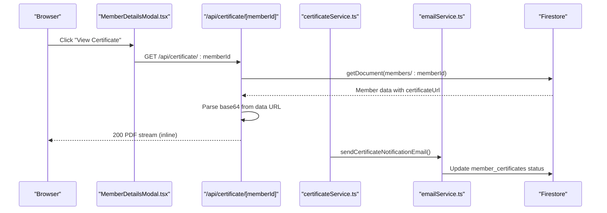
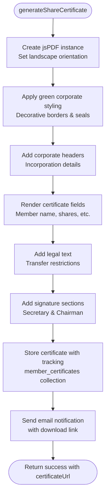
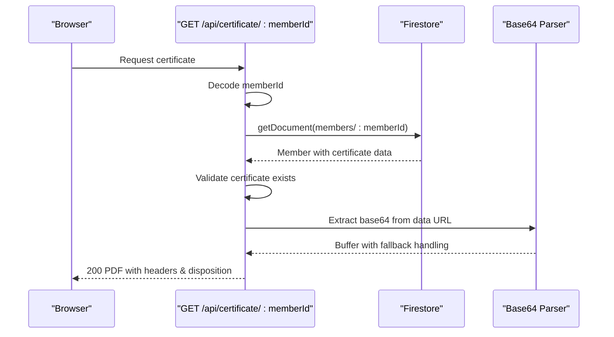
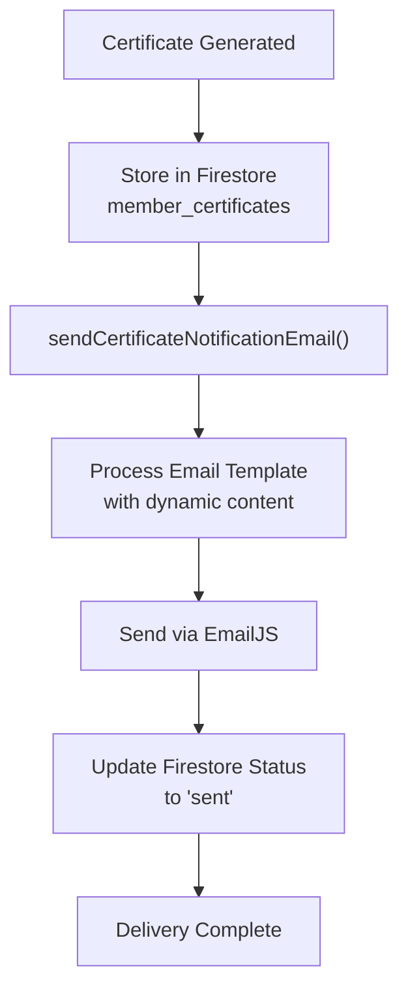
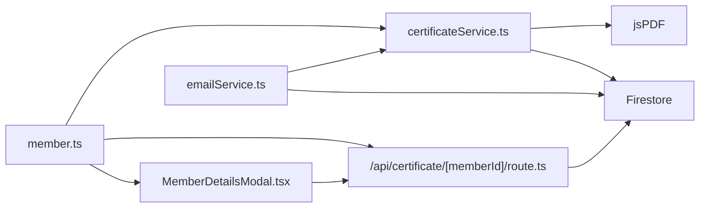

# Certificate Generation System

<cite>
**Referenced Files in This Document**
- [certificateService.ts](file://lib/certificateService.ts)
- [route.ts](file://app/api/certificate/[memberId]/route.ts)
- [MemberDetailsModal.tsx](file://components/admin/MemberDetailsModal.tsx)
- [emailService.ts](file://lib/emailService.ts)
- [firebase.ts](file://lib/firebase.ts)
- [member.ts](file://lib/types/member.ts)
</cite>

## Update Summary
**Changes Made**
- Removed references to CertificatePreviewModal, ContractPositioningTool, ContractPreview, and LoanContractModal components as they were completely removed from the codebase
- Updated documentation to reflect current state focusing on core certificate generation service and API endpoints
- Simplified architecture overview to exclude removed UI components
- Enhanced focus on backend certificate generation workflow and API delivery mechanisms
- Updated troubleshooting guide to remove references to removed components

## Table of Contents
1. [Introduction](#introduction)
2. [Project Structure](#project-structure)
3. [Core Components](#core-components)
4. [Architecture Overview](#architecture-overview)
5. [Certificate Generation Service](#certificate-generation-service)
6. [API Endpoint for Certificate Retrieval](#api-endpoint-for-certificate-retrieval)
7. [Frontend Integration](#frontend-integration)
8. [Enhanced Certificate Features](#enhanced-certificate-features)
9. [Email Notification Integration](#email-notification-integration)
10. [Certificate Data Management](#certificate-data-management)
11. [Dependency Analysis](#dependency-analysis)
12. [Performance Considerations](#performance-considerations)
13. [Troubleshooting Guide](#troubleshooting-guide)
14. [Conclusion](#conclusion)
15. [Appendices](#appendices)

## Introduction
This document describes the Certificate Generation System responsible for creating PDF share certificates for cooperative members. The system focuses on backend certificate generation, API delivery mechanisms, and comprehensive certificate management capabilities. It explains the certificate template system, dynamic content injection, PDF generation workflow using jsPDF library, certificate data validation and formatting, styling options, API integration with the member management system, certificate storage and retrieval, and customization options for print-ready formats.

**Updated** The certificate generation system now operates as a streamlined backend service with enhanced certificate generation capabilities and API-driven delivery mechanisms, without the removed UI components.

## Project Structure
The certificate system currently spans four primary areas:
- Enhanced certificate generation service with share certificate templates
- API endpoint for certificate retrieval and delivery
- Frontend integration with certificate display and management interfaces
- Email notification system for certificate delivery
- Shared TypeScript types for certificate data and member management

```mermaid
graph TB
subgraph "Certificate Generation"
Service["certificateService.ts"]
JS["jsPDF + jspdf-autotable"]
End
subgraph "API Layer"
API["/api/certificate/[memberId]/route.ts"]
End
subgraph "Frontend Integration"
MemberDetails["MemberDetailsModal.tsx"]
End
subgraph "Notifications"
Email["emailService.ts"]
End
subgraph "Storage"
Firestore["Firestore (members & member_certificates collections)"]
End
subgraph "Core Services"
Firebase["firebase.ts"]
Types["member.ts"]
End
Service --> JS
Service --> Firestore
API --> Firestore
MemberDetails --> API
Email --> Service
MemberDetails --> Types
API --> Types
Service --> Types
```

**Diagram sources**
- [certificateService.ts:12-410](file://lib/certificateService.ts#L12-L410)
- [route.ts:4-68](file://app/api/certificate/[memberId]/route.ts#L4-L68)
- [MemberDetailsModal.tsx:232-281](file://components/admin/MemberDetailsModal.tsx#L232-L281)
- [emailService.ts:178-209](file://lib/emailService.ts#L178-L209)
- [firebase.ts:90-113](file://lib/firebase.ts#L90-L113)
- [member.ts:27-68](file://lib/types/member.ts#L27-L68)

**Section sources**
- [certificateService.ts:12-410](file://lib/certificateService.ts#L12-L410)
- [route.ts:4-68](file://app/api/certificate/[memberId]/route.ts#L4-L68)
- [MemberDetailsModal.tsx:232-281](file://components/admin/MemberDetailsModal.tsx#L232-L281)
- [emailService.ts:178-209](file://lib/emailService.ts#L178-L209)
- [firebase.ts:90-113](file://lib/firebase.ts#L90-L113)
- [member.ts:27-68](file://lib/types/member.ts#L27-L68)

## Core Components
- **Enhanced Certificate Generation Service**: Creates share certificates using customized jsPDF templates with dynamic content injection and comprehensive storage mechanisms
- **API Endpoint**: Retrieves stored certificate data URLs from Firestore and streams PDFs to clients with enhanced error handling
- **Frontend Integration**: Offers certificate display and management through MemberDetailsModal with certificate visualization
- **Email Notification System**: Integrates with EmailJS for automated certificate delivery notifications
- **Enhanced Certificate Data Management**: Defines certificate data schemas and manages certificate lifecycle in Firestore

Key responsibilities:
- Share certificate generation with detailed corporate formatting
- Dynamic content injection from member and certificate data
- Advanced validation and error handling during generation and retrieval
- Multi-type certificate storage with tracking in Firestore
- Automated email notifications for certificate delivery
- Delivery of PDFs via HTTP response with appropriate headers
- Comprehensive certificate data validation and storage mechanisms

**Updated** The system now operates as a streamlined backend service without the removed UI components, focusing on certificate generation and API delivery.

**Section sources**
- [certificateService.ts:12-410](file://lib/certificateService.ts#L12-L410)
- [route.ts:4-68](file://app/api/certificate/[memberId]/route.ts#L4-L68)
- [MemberDetailsModal.tsx:232-281](file://components/admin/MemberDetailsModal.tsx#L232-L281)
- [emailService.ts:178-209](file://lib/emailService.ts#L178-L209)
- [member.ts:27-68](file://lib/types/member.ts#L27-L68)

## Architecture Overview
The streamlined system follows a focused separation of concerns with certificate generation and API delivery:
- Certificate generation service creates PDFs with appropriate templates and persists them with tracking
- API endpoint validates membership and fetches certificate data URL from Firestore
- Frontend displays certificates via embedded visualization or download functionality
- Email service handles automated notifications for certificate delivery
- Backend processes certificate generation and retrieval with enhanced validation



**Diagram sources**
- [MemberDetailsModal.tsx:232-281](file://components/admin/MemberDetailsModal.tsx#L232-L281)
- [route.ts:4-68](file://app/api/certificate/[memberId]/route.ts#L4-L68)
- [certificateService.ts:334-410](file://lib/certificateService.ts#L334-L410)
- [emailService.ts:178-209](file://lib/emailService.ts#L178-L209)

## Certificate Generation Service
The service now focuses on streamlined certificate generation with enhanced template systems:

**Share Certificate Generation**:
- Creates landscape-oriented A4 certificates with green color scheme
- Implements detailed corporate styling with decorative borders and official seals
- Includes comprehensive legal text and signature sections
- Stores certificate metadata with tracking in Firestore

**Enhanced Certificate Workflow**:
- `generateShareCertificate()`: Creates share certificates with detailed corporate formatting
- `getMemberCertificate()`: Retrieves membership certificates with validation
- `generateAndSendCertificate()`: Combines generation with email notification and tracking

Processing logic highlights:
- Uses jsPDF with custom styling for different certificate types
- Implements comprehensive certificate data validation
- Stores certificates with timestamps and metadata tracking
- Returns detailed success/failure states with error messages



**Diagram sources**
- [certificateService.ts:12-277](file://lib/certificateService.ts#L12-L277)

**Section sources**
- [certificateService.ts:12-410](file://lib/certificateService.ts#L12-L410)

## API Endpoint for Certificate Retrieval
The API endpoint provides enhanced certificate retrieval with improved validation:

Responsibilities:
- Accepts member ID parameter with URL decoding support
- Fetches member data from Firestore with comprehensive validation
- Validates certificate existence and format before processing
- Extracts base64 payload from data URL with fallback handling
- Streams PDF to client with appropriate headers and content disposition
- Handles various error states with specific HTTP status codes

Enhanced behavioral notes:
- Supports both inline viewing and file download via Content-Disposition
- Returns 404 for missing members or certificates
- Returns 500 for unsupported formats or internal errors
- Implements robust base64 extraction with data URL parsing



**Diagram sources**
- [route.ts:4-68](file://app/api/certificate/[memberId]/route.ts#L4-L68)

**Section sources**
- [route.ts:4-68](file://app/api/certificate/[memberId]/route.ts#L4-L68)

## Frontend Integration
The frontend provides comprehensive certificate management through MemberDetailsModal:

**Certificate Display Capabilities**:
- Conditionally renders certificate actions based on certificate generation status
- Displays certificates through visual overlay with certificate data from Firestore
- Provides download and view functionality with proper state management
- Implements certificate visibility toggle with proper state management

**Visual Certificate Rendering**:
- Uses certificate data stored in Firestore for visual display
- Implements responsive certificate preview with proper aspect ratios
- Displays certificate details in organized summary format
- Handles missing certificate data gracefully with fallback values

**Section sources**
- [MemberDetailsModal.tsx:232-281](file://components/admin/MemberDetailsModal.tsx#L232-L281)

## Enhanced Certificate Features

### Multiple Certificate Types
The system now supports certificate types with specialized templates:

**Share Certificate**:
- Landscape A4 format with corporate green color scheme
- Detailed legal text and transfer restrictions
- Official seal and signature sections
- Comprehensive shareholding information display

**Certificate Data Management**:
- Separate storage in `member_certificates` collection
- Tracking of generation status and delivery attempts
- Metadata preservation for audit trails
- Support for certificate number generation and validation

**Section sources**
- [certificateService.ts:12-277](file://lib/certificateService.ts#L12-L277)
- [certificateService.ts:284-309](file://lib/certificateService.ts#L284-L309)
- [certificateService.ts:317-410](file://lib/certificateService.ts#L317-L410)

### Enhanced Certificate Data Validation
The system implements comprehensive validation mechanisms:

**Input Validation**:
- Certificate number uniqueness verification
- Member data validation before generation
- Date format validation for issue dates
- Required field validation for signatures
- Currency format validation for loan amounts

**Storage Validation**:
- Certificate existence verification
- Data URL format validation
- Base64 payload integrity checking
- Timestamp validation for audit trails

**Security Validation**:
- Member authorization verification
- Role-based access control for certificate generation
- Duplicate certificate prevention
- Audit trail maintenance for all operations

**Section sources**
- [certificateService.ts:25-277](file://lib/certificateService.ts#L25-L277)
- [certificateService.ts:284-309](file://lib/certificateService.ts#L284-L309)
- [certificateService.ts:317-410](file://lib/certificateService.ts#L317-L410)

## Email Notification Integration

### Automated Certificate Delivery
The system integrates with EmailJS for automated certificate notifications:

**Email Template System**:
- Dedicated certificate notification template
- Dynamic content injection with member and certificate details
- Professional email formatting with cooperative branding
- Automatic download link generation

**Delivery Workflow**:
- Certificate generation triggers email notification
- Email includes certificate details and download instructions
- Status tracking in Firestore for delivery confirmation
- Error handling for failed email deliveries

**Configuration Requirements**:
- EmailJS public key configuration
- Service ID and template ID setup
- Environment variable management
- Client-side initialization with fallback handling



**Diagram sources**
- [certificateService.ts:317-410](file://lib/certificateService.ts#L317-L410)
- [emailService.ts:178-209](file://lib/emailService.ts#L178-L209)

**Section sources**
- [certificateService.ts:317-410](file://lib/certificateService.ts#L317-L410)
- [emailService.ts:178-209](file://lib/emailService.ts#L178-L209)

## Certificate Data Management

### Firestore Integration
The system provides comprehensive certificate data management:

**Certificate Storage**:
- Share certificates stored in Firestore with complete metadata
- Member-specific certificate data linked to member documents
- Separate member_certificates collection for tracking and reporting
- Automatic certificate number generation and validation

**Data Retrieval**:
- MemberDetailsModal retrieves certificate data from Firestore
- API endpoint serves certificate PDFs directly from stored data URLs
- Certificate existence validation before processing
- Fallback mechanisms for missing certificate data

**Audit Trail**:
- Comprehensive certificate generation tracking
- Delivery attempt monitoring
- Status updates for certificate lifecycle
- Timestamp preservation for all operations

**Section sources**
- [certificateService.ts:236-286](file://lib/certificateService.ts#L236-L286)
- [certificateService.ts:356-397](file://lib/certificateService.ts#L356-L397)
- [MemberDetailsModal.tsx:253-399](file://components/admin/MemberDetailsModal.tsx#L253-L399)

## Dependency Analysis
The streamlined system exhibits clear boundaries and focused dependencies:

**Core Dependencies**:
- Certificate generation service depends on jsPDF and Firestore
- API endpoint depends on Firestore for certificate data retrieval
- Frontend integration depends on API endpoint for certificate delivery
- Email service depends on EmailJS configuration and Firestore for tracking
- All components depend on shared TypeScript types for type safety

**Integration Points**:
- Certificate generation service coordinates with Firestore for storage
- API endpoint serves both certificate retrieval and preview data
- Email service integrates with certificate generation workflow
- Frontend integrates with API endpoint for certificate delivery
- Firestore collections support certificate tracking and member data



**Diagram sources**
- [certificateService.ts:12-410](file://lib/certificateService.ts#L12-L410)
- [route.ts:4-68](file://app/api/certificate/[memberId]/route.ts#L4-L68)
- [MemberDetailsModal.tsx:232-281](file://components/admin/MemberDetailsModal.tsx#L232-L281)
- [emailService.ts:178-209](file://lib/emailService.ts#L178-L209)
- [member.ts:27-68](file://lib/types/member.ts#L27-L68)

**Section sources**
- [certificateService.ts:12-410](file://lib/certificateService.ts#L12-L410)
- [route.ts:4-68](file://app/api/certificate/[memberId]/route.ts#L4-L68)
- [MemberDetailsModal.tsx:232-281](file://components/admin/MemberDetailsModal.tsx#L232-L281)
- [emailService.ts:178-209](file://lib/emailService.ts#L178-L209)
- [member.ts:27-68](file://lib/types/member.ts#L27-L68)

## Performance Considerations
Streamlined performance considerations for the focused certificate system:

**Generation Performance**:
- On-demand PDF generation with optimized template rendering
- Base64 data URL compression for reduced payload sizes
- Caching strategies for frequently accessed certificate templates
- Asynchronous processing for email notifications
- Efficient Firestore queries with selective field retrieval

**Storage Optimization**:
- Separate collections for different certificate types
- Efficient indexing for certificate number and member ID queries
- Metadata optimization for audit trail storage
- Archive strategy for historical certificate records

**API Performance**:
- Minimal Firestore queries with selective field retrieval
- Streaming PDF delivery to reduce memory usage
- Content compression for base64 data transmission
- Connection pooling for EmailJS integration

**User Experience**:
- Real-time validation reduces generation failures
- Preview system with enhanced user interface minimizes generation attempts
- Loading states provide user feedback during processing
- Error boundaries prevent system-wide failures

**Enhanced Rendering Performance**:
- jsPDF efficient PDF generation with minimal memory overhead
- A4 formatting reduces rendering complexity
- Automatic print dialog optimization for immediate printing
- Popup blocking detection with graceful fallback handling

## Troubleshooting Guide
Streamlined troubleshooting for the focused certificate system:

**Certificate Generation Issues**:
- Member not found: Verify member ID and Firestore membership document existence
- Certificate template errors: Check jsPDF version compatibility and template syntax
- Storage failures: Confirm Firestore write permissions and collection access
- Validation errors: Review certificate data format and required field validation

**PDF Generation Issues**:
- Certificate PDF generation failures: Verify jsPDF template rendering and base64 encoding
- Print dialog problems: Validate popup blocking settings and print dialog integration
- Quality issues: Adjust jsPDF compression settings and rendering parameters

**Email Delivery Problems**:
- EmailJS configuration: Verify public key, service ID, and template ID setup
- Email format issues: Check email template variables and recipient validation
- Delivery failures: Monitor EmailJS API responses and rate limits
- Tracking errors: Ensure Firestore write permissions for member_certificates collection

**API and Integration Issues**:
- Certificate retrieval failures: Verify certificate data URL format and base64 encoding
- Authentication problems: Validate user roles and access permissions
- CORS issues: Configure API endpoint headers for cross-origin requests

**Operational Checks**:
- Validate EmailJS configuration and environment variables
- Confirm Firestore security rules for certificate collections
- Test jsPDF template rendering with sample data
- Verify certificate number generation and uniqueness validation
- Check certificate data storage and retrieval patterns
- Validate API endpoint response formats and error handling

**Section sources**
- [route.ts:14-29](file://app/api/certificate/[memberId]/route.ts#L14-L29)
- [certificateService.ts:270-277](file://lib/certificateService.ts#L270-L277)
- [certificateService.ts:386-410](file://lib/certificateService.ts#L386-L410)
- [emailService.ts:45-65](file://lib/emailService.ts#L45-L65)
- [firebase.ts:90-113](file://lib/firebase.ts#L90-L113)

## Conclusion
The streamlined Certificate Generation System provides a focused, scalable solution for producing share certificates for cooperative members. The system leverages jsPDF for advanced templating and dynamic content injection, integrates EmailJS for automated certificate delivery, stores certificates with comprehensive tracking in Firestore, and exposes intuitive APIs for secure delivery. The enhanced frontend provides certificate display and management through MemberDetailsModal, integrating seamlessly with the member management system. The system's simplified architecture removes the removed UI components while maintaining robust certificate generation, storage, and delivery capabilities. Extending the system to support additional certificate types involves adding new generation functions, templates, and API routes while reusing the existing storage, delivery, and validation patterns. The integration with member management system provides a seamless workflow from member registration to certificate generation and delivery.

## Appendices

### Certificate Types and Examples
**Share Certificate**:
- Corporate-style certificate for share ownership with detailed legal text
- Landscape A4 format with green color scheme and official seals
- Comprehensive shareholding information and transfer restrictions

**Implementation Pattern**:
- Add new generation functions mirroring existing certificate workflows
- Extend Firestore schema to include additional certificate types per member
- Create dedicated API routes for each certificate type with validation
- Implement specialized preview modals for complex certificate types

### Customization Options
**Template Customization**:
- Multiple certificate templates for different certificate types
- Customizable color schemes and corporate branding
- Flexible layout options for various paper sizes and orientations
- Advanced styling with borders, seals, and decorative elements

**Content Customization**:
- Dynamic content injection from member and certificate data
- Configurable field visibility and ordering
- Multi-language support for international cooperatives
- Customizable legal text and terms

**Integration Options**:
- Email notification integration with EmailJS
- API endpoint for external system integration
- Webhook support for real-time certificate updates
- Mobile-responsive certificate viewing and downloading

**Security and Validation**:
- Comprehensive input validation and sanitization
- Role-based access control for certificate generation
- Audit trail maintenance for all certificate operations
- Digital signature placeholders for authenticity

**Enhanced User Interface Features**:
- Real-time certificate preview with html2canvas rendering
- Automatic officer name fetching from Firestore
- High-quality PDF generation with A4/Letter formatting
- Streamlined certificate creation workflow with validation
- Enhanced interactive elements with better user experience
- Secure certificate storage with comprehensive tracking
- Popup blocking detection and user guidance for print functionality

**Advanced Rendering Features**:
- jsPDF conversion with precise A4 dimensions
- Automatic print dialog optimization for immediate printing
- Responsive certificate preview with mobile compatibility
- Enhanced form controls with focused styling and visual hierarchy
- Quality optimization for both screen and print output
- Automatic popup blocking detection and user guidance

**Section sources**
- [certificateService.ts:12-277](file://lib/certificateService.ts#L12-L277)
- [emailService.ts:178-209](file://lib/emailService.ts#L178-L209)