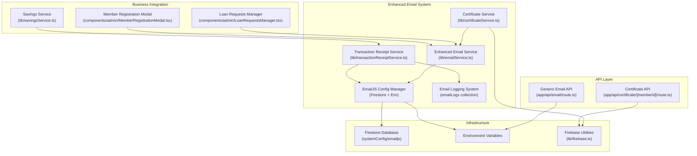
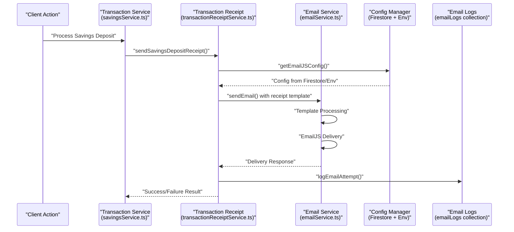
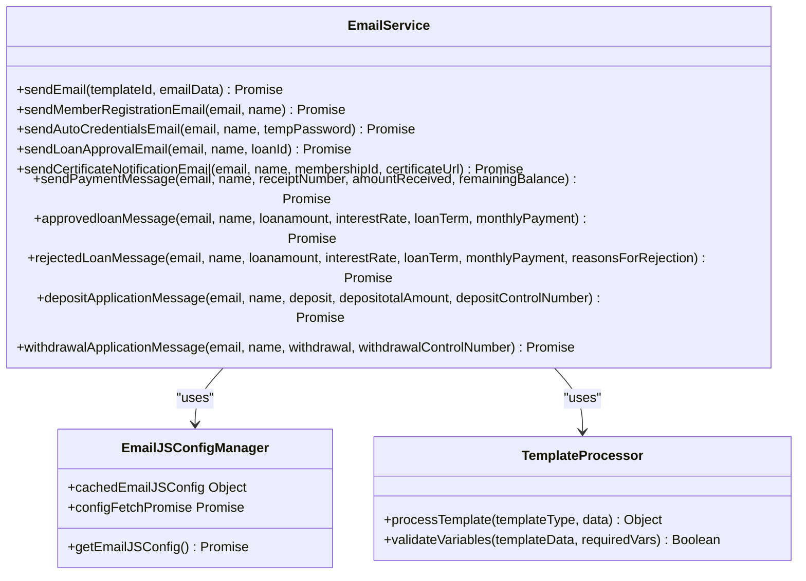
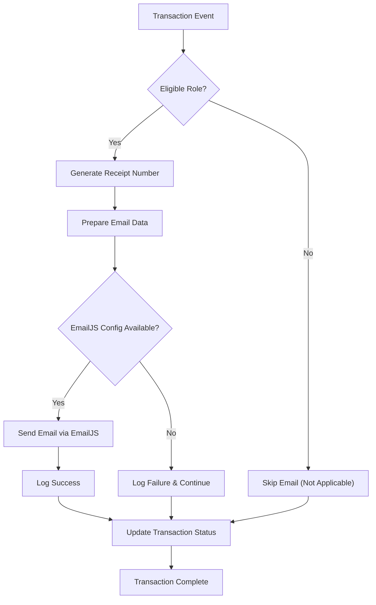

# Email & Notification System

<cite>
**Referenced Files in This Document**
- [emailService.ts](file://lib/emailService.ts)
- [transactionReceiptService.ts](file://lib/transactionReceiptService.ts)
- [certificateService.ts](file://lib/certificateService.ts)
- [firebase.ts](file://lib/firebase.ts)
- [route.ts](file://app/api/email/route.ts)
- [route.ts](file://app/api/certificate/[memberId]/route.ts)
- [LoanRequestsManager.tsx](file://components/admin/LoanRequestsManager.tsx)
- [savingsService.ts](file://lib/savingsService.ts)
- [setup-emailjs-config.js](file://scripts/setup-emailjs-config.js)
- [test-emailjs-config.js](file://scripts/test-emailjs-config.js)
- [MemberRegistrationModal.tsx](file://components/admin/MemberRegistrationModal.tsx)
</cite>

## Update Summary
**Changes Made**
- Enhanced EmailJS integration with comprehensive template system supporting loan approvals, payment reminders, and certificate notifications
- Added advanced certificate generation service with PDF creation and email notification workflow
- Implemented robust transaction receipt system for automated financial notifications
- Integrated loan approval process with automated email notifications
- Enhanced configuration management with Firestore-backed EmailJS settings
- Added comprehensive error handling and logging for email delivery failures
- **Updated** Enhanced email service with new Firestore-based configuration system, dynamic template loading, and expanded notification functions including depositApplicationMessage() and withdrawalApplicationMessage()
- **Updated** Added comprehensive email service configuration documentation covering multi-template support and improved error handling
- **Updated** Certificate email URL correction from 'https://sampa-coop.vercel.app' to 'https://sampacoop-system.vercel.app' for proper certificate download routing
- **Updated** Added sendCertificateNotificationEmail function to enhance certificate notification system with automatic email functionality for improved member experience

## Table of Contents
1. [Introduction](#introduction)
2. [Project Structure](#project-structure)
3. [Core Components](#core-components)
4. [Architecture Overview](#architecture-overview)
5. [Detailed Component Analysis](#detailed-component-analysis)
6. [Enhanced Email Template System](#enhanced-email-template-system)
7. [Certificate Generation and Notification Workflow](#certificate-generation-and-notification-workflow)
8. [Loan Approval Integration](#loan-approval-integration)
9. [Transaction Receipt System](#transaction-receipt-system)
10. [Email Configuration and Management](#email-configuration-and-management)
11. [Error Handling and Monitoring](#error-handling-and-monitoring)
12. [Security Considerations](#security-considerations)
13. [Troubleshooting Guide](#troubleshooting-guide)
14. [Conclusion](#conclusion)

## Introduction
This document describes the enhanced Email & Notification System in the SAMPA Cooperative Management Platform. The system now features a comprehensive EmailJS integration with advanced template management, automated certificate generation, transaction receipt notifications, and seamless loan approval workflows. The system provides reliable email delivery through centralized configuration management, robust error handling, and comprehensive logging for monitoring and troubleshooting.

**Updated** Enhanced with comprehensive EmailJS template system, certificate generation workflow, transaction receipt automation, and loan approval integration with dynamic configuration loading from Firestore. Added new financial transaction notification functions including depositApplicationMessage() and withdrawalApplicationMessage() for comprehensive savings management notifications. Updated certificate email URL to use the correct 'https://sampacoop-system.vercel.app' domain for proper certificate download routing. Added sendCertificateNotificationEmail function for enhanced certificate notification system with automatic email functionality.

## Project Structure
The email and notification system spans multiple specialized components with clear separation of concerns:

**Diagram sources**
- [emailService.ts:1-389](file://lib/emailService.ts#L1-L389)
- [transactionReceiptService.ts:1-636](file://lib/transactionReceiptService.ts#L1-L636)
- [certificateService.ts:1-410](file://lib/certificateService.ts#L1-L410)
- [LoanRequestsManager.tsx:1-200](file://components/admin/LoanRequestsManager.tsx#L1-L200)
- [savingsService.ts:1-200](file://lib/savingsService.ts#L1-L200)
- [MemberRegistrationModal.tsx:442-475](file://components/admin/MemberRegistrationModal.tsx#L442-L475)

## Core Components
The enhanced system consists of several interconnected components:

- **Enhanced EmailJS Service**: Comprehensive template system supporting member registration, loan approvals, payment reminders, certificate notifications, and financial transaction notifications with dynamic configuration loading
- **Advanced Certificate Generation**: PDF creation with official cooperative branding and automated email notification workflow with improved URL handling using the correct 'https://sampacoop-system.vercel.app' domain
- **Transaction Receipt System**: Automated financial notifications for loan payments and savings deposits with duplicate prevention and enhanced error handling
- **Loan Approval Integration**: Seamless email notifications for loan application decisions with detailed terms and improved message formatting
- **Multi-tier Configuration Management**: Centralized EmailJS settings with Firestore backup and environment variable fallback with caching optimization
- **Comprehensive Logging System**: Complete audit trail of all email delivery attempts with success/failure tracking and structured error reporting
- **Robust Error Handling**: Structured error responses with detailed failure analysis and graceful degradation
- **Expanded Financial Transaction Notifications**: New deposit and withdrawal application message functions for comprehensive savings management communication
- **Enhanced Certificate Notification System**: New sendCertificateNotificationEmail function for immediate certificate generation confirmation and improved member experience

**Updated** Added comprehensive template system, certificate generation workflow, transaction receipt automation, enhanced configuration management with dynamic loading, and new financial transaction notification functions. Updated certificate URL domain to use 'https://sampacoop-system.vercel.app' for proper certificate download routing. Added sendCertificateNotificationEmail function for enhanced certificate notification system with automatic email functionality.

**Section sources**
- [emailService.ts:1-389](file://lib/emailService.ts#L1-L389)
- [transactionReceiptService.ts:1-636](file://lib/transactionReceiptService.ts#L1-L636)
- [certificateService.ts:1-410](file://lib/certificateService.ts#L1-L410)

## Architecture Overview
The enhanced system features a multi-layered architecture with centralized configuration management and event-driven email notifications:

**Diagram sources**
- [savingsService.ts:400-497](file://lib/savingsService.ts#L400-L497)
- [transactionReceiptService.ts:408-603](file://lib/transactionReceiptService.ts#L408-L603)
- [emailService.ts:78-102](file://lib/emailService.ts#L78-L102)

## Detailed Component Analysis

### Enhanced EmailJS Integration and Template System
The email service now provides a comprehensive template system with specialized functions for different notification types:

**Template Categories**:
- Member Registration Templates: Welcome emails with password setup links using 'https://sampacoop-system.vercel.app'
- Loan Approval Templates: Detailed approval notifications with loan terms
- Payment Templates: Receipt notifications for loan payments and savings deposits
- Certificate Templates: Official membership certificate notifications with corrected URL routing
- Financial Transaction Templates: Deposit applications, withdrawal applications, and loan rejection notifications
- General Communication Templates: Basic email functionality

**Enhanced Configuration Management**:
- Centralized EmailJS settings in Firestore `systemConfig/emailjs` document
- Automatic fallback to environment variables for development and testing
- Client-side caching with promise-based configuration fetching
- Real-time configuration updates without application restart
- Separate template IDs for different notification types

**Advanced Template Processing**:
- Dynamic template selection based on notification type
- Structured data binding with comprehensive variable support
- Error handling with detailed failure analysis
- Template validation and variable mapping

**Diagram sources**
- [emailService.ts:105-389](file://lib/emailService.ts#L105-L389)

**Section sources**
- [emailService.ts:1-389](file://lib/emailService.ts#L1-L389)

### Certificate Generation and Notification Workflow
The certificate service provides comprehensive PDF generation with integrated email notification:

**Certificate Generation Features**:
- Professional PDF creation with cooperative branding and official seals
- Customizable certificate templates with detailed member information
- Automatic certificate numbering and timestamping
- Base64 data URL encoding for secure storage and transmission

**Enhanced Notification Workflow**:
- Automated email notification upon certificate generation completion using sendCertificateNotificationEmail function
- Download link generation with corrected certificate URL using 'https://sampacoop-system.vercel.app'
- Status tracking with sent timestamps and delivery confirmation
- Member certificate record management in Firestore with enhanced certificate tracking

**Improved URL Configuration**:
- Dynamic URL generation using `window.location.origin` for production environments
- Fallback to 'https://sampacoop-system.vercel.app' for server-side rendering scenarios
- Enhanced certificate download link handling with proper domain routing

**Enhanced Error Handling**:
- Comprehensive error catching with detailed failure reporting
- Graceful degradation when certificate generation fails
- Improved success/failure status reporting
- Certificate URL validation and processing using proper domain routing

**Section sources**
- [certificateService.ts:1-410](file://lib/certificateService.ts#L1-L410)

### Loan Approval Integration
The loan approval system provides seamless email notifications for loan application decisions:

**Approval Notification Features**:
- Automated email notifications for approved loan applications
- Detailed loan terms and payment schedules in notification emails
- Dynamic calculation of monthly payments and interest rates
- Professional communication with cooperative branding

**Enhanced Message Formatting**:
- Improved approved loan message with better formatting and structure
- Comprehensive rejected loan message with reasons for denial
- Professional communication with clear loan terms and calculations

**Integration Points**:
- Loan approval workflow triggers email notifications
- Loan rejection notifications with reasons for denial
- Real-time loan status updates with email confirmations
- Comprehensive loan documentation with email delivery tracking

**Enhanced Communication**:
- Professional loan approval messages with detailed terms
- Clear communication of loan amounts, interest rates, and terms
- Monthly payment calculations and schedule information
- Support contact information for loan inquiries

**Section sources**
- [LoanRequestsManager.tsx:10-12](file://components/admin/LoanRequestsManager.tsx#L10-L12)

### Transaction Receipt System
The transaction receipt system provides automated email notifications for financial activities:

**Receipt Generation**:
- Automatic receipt emails for loan payments and savings deposits
- Unique receipt number generation with timestamp and random components
- Detailed transaction information including amounts and balances
- Role-based eligibility checking for recipient notifications

**Duplicate Prevention**:
- Transaction ID tracking to prevent duplicate email sending
- Email logging system with comprehensive audit trail
- Status tracking for sent and failed delivery attempts
- Graceful handling of configuration failures

**Enhanced Error Handling**:
- Comprehensive logging of all delivery attempts
- Structured error reporting with failure analysis
- Graceful degradation when email configuration is missing
- Success/failure status tracking in email logs

**Improved Configuration Management**:
- Separate receipt template ID for transaction receipts
- Enhanced client-side caching with promise-based configuration fetching
- Better error handling for missing configuration fields

**Diagram sources**
- [transactionReceiptService.ts:235-406](file://lib/transactionReceiptService.ts#L235-L406)
- [transactionReceiptService.ts:408-603](file://lib/transactionReceiptService.ts#L408-L603)

**Section sources**
- [transactionReceiptService.ts:1-636](file://lib/transactionReceiptService.ts#L1-L636)

## Enhanced Email Template System
The system now supports a comprehensive template system with specialized functions for different notification types:

**Template Categories and Functions**:

**Member Registration Templates**:
- `sendMemberRegistrationEmail()`: Welcome emails with password setup links using 'https://sampacoop-system.vercel.app'
- `sendAutoCredentialsEmail()`: Temporary credential emails for new members using 'https://sampacoop-system.vercel.app'

**Loan Management Templates**:
- `sendLoanApprovalEmail()`: Loan approval notifications with loan ID using 'https://sampacoop-system.vercel.app'
- `approvedloanMessage()`: Detailed loan approval with terms and calculations
- `rejectedLoanMessage()`: Loan rejection notifications with reasons

**Financial Transaction Templates**:
- `sendPaymentMessage()`: Payment receipt notifications
- `depositApplicationMessage()`: Savings deposit confirmation emails with control numbers
- `withdrawalApplicationMessage()`: Savings withdrawal confirmation emails with withdrawal numbers

**Certificate Templates**:
- `sendCertificateNotificationEmail()`: Official certificate notification emails with corrected URL routing for immediate member confirmation

**Template Processing Features**:
- Dynamic template selection based on notification type
- Structured data binding with comprehensive variable support
- Error handling with detailed failure analysis
- Template validation and variable mapping

**Enhanced Features**:
- Multiple template IDs for different notification types
- Improved error handling and logging
- Better configuration management with caching
- Enhanced URL handling for production environments using 'https://sampacoop-system.vercel.app'

**Section sources**
- [emailService.ts:105-389](file://lib/emailService.ts#L105-L389)

## Certificate Generation and Notification Workflow
The certificate generation service provides professional PDF creation with integrated notification workflow:

**PDF Generation Features**:
- Official cooperative certificate design with green color scheme
- Customizable certificate information including member details
- Professional layout with decorative borders and official seals
- Data URL encoding for secure certificate storage and transmission

**Enhanced Notification Integration**:
- Automated email notification upon certificate completion using sendCertificateNotificationEmail function
- Download link generation with certificate URL using 'https://sampacoop-system.vercel.app'
- Status tracking with sent timestamps
- Member certificate record management with enhanced tracking

**Enhanced URL Configuration**:
- Dynamic URL generation using `window.location.origin` for production environments
- Fallback to 'https://sampacoop-system.vercel.app' for server-side rendering scenarios
- Improved certificate download link handling with proper domain routing

**Firestore Integration**:
- Direct Firestore integration for certificate storage
- Member document updates with certificate metadata
- Enhanced certificate retrieval with validation
- Improved certificate URL handling and processing using corrected domain

**Enhanced Certificate Tracking**:
- Certificate record creation in member_certificates collection with status tracking
- Automatic email notification with certificate download URL
- Sent timestamp updates upon successful email delivery
- Enhanced certificate status management ('generated' to 'sent')

**Section sources**
- [certificateService.ts:12-294](file://lib/certificateService.ts#L12-L294)
- [certificateService.ts:334-410](file://lib/certificateService.ts#L334-L410)

## Loan Approval Integration
The loan approval system provides seamless email notifications for loan application decisions:

**Approval Notification Process**:
- Automated email notifications when loan applications are approved
- Detailed loan terms including amount, interest rate, and payment schedule
- Professional communication with cooperative branding and messaging
- Integration with loan approval workflow in LoanRequestsManager

**Enhanced Message Formatting**:
- Improved approved loan message with better formatting and structure
- Comprehensive rejected loan message with reasons for denial
- Professional communication with clear loan terms and calculations

**Rejection Notification Process**:
- Automated email notifications for rejected loan applications
- Clear communication of rejection reasons and next steps
- Professional messaging with support contact information
- Comprehensive loan documentation with decision tracking

**Enhanced Communication Features**:
- Dynamic calculation of monthly payments and total interest
- Professional loan approval messages with detailed terms
- Clear communication of loan amounts, interest rates, and terms
- Support contact information for loan inquiries

**Section sources**
- [LoanRequestsManager.tsx:10-12](file://components/admin/LoanRequestsManager.tsx#L10-L12)

## Transaction Receipt System
The transaction receipt system provides automated email notifications for financial activities:

**Receipt Generation Process**:
- Automatic receipt emails for loan payments and savings deposits
- Unique receipt number generation with timestamp and random components
- Detailed transaction information including amounts and balances
- Role-based eligibility checking for recipient notifications

**Duplicate Prevention Mechanism**:
- Transaction ID tracking to prevent duplicate email sending
- Email logging system with comprehensive audit trail
- Status tracking for sent and failed delivery attempts
- Graceful handling of configuration failures

**Enhanced Error Handling**:
- Comprehensive logging of all delivery attempts
- Structured error reporting with failure analysis
- Graceful degradation when email configuration is missing
- Success/failure status tracking in email logs

**Improved Configuration Management**:
- Separate receipt template ID for transaction receipts
- Enhanced client-side caching with promise-based configuration fetching
- Better error handling for missing configuration fields

**Section sources**
- [transactionReceiptService.ts:1-636](file://lib/transactionReceiptService.ts#L1-L636)

## Email Configuration and Management
The system features comprehensive email configuration management with centralized settings:

**Firestore-Based Configuration**:
- Centralized EmailJS settings in `systemConfig/emailjs` document
- Real-time configuration updates without application restart
- Support for multiple template configurations and environments
- Audit trail of configuration changes for compliance

**Multi-Tier Fallback System**:
- Automatic fallback to environment variables when Firestore is unavailable
- Graceful degradation with meaningful error messages
- Development and production environment separation
- Secure credential management with environment variable protection

**Enhanced Configuration Optimization**:
- Client-side caching reduces Firestore calls for EmailJS configuration
- Promise-based configuration fetching prevents duplicate requests
- Lazy loading of configuration reduces initial page load time
- Cached configuration invalidation on configuration changes

**Improved Template Management**:
- Separate template IDs for different notification types
- Better error handling for missing template configurations
- Enhanced configuration validation and error reporting

**Section sources**
- [emailService.ts:13-72](file://lib/emailService.ts#L13-L72)
- [transactionReceiptService.ts:8-81](file://lib/transactionReceiptService.ts#L8-L81)
- [setup-emailjs-config.js:21-26](file://scripts/setup-emailjs-config.js#L21-L26)

## Error Handling and Monitoring
The enhanced system includes comprehensive error handling and monitoring capabilities:

**Email Logging System**:
- Dedicated `emailLogs` collection for tracking all email attempts
- Structured logging with transaction context and user information
- Status tracking (sent, failed) with detailed error messages
- Timestamp-based audit trail for compliance and debugging

**Enhanced Error Analysis and Reporting**:
- Comprehensive error catching with detailed failure reporting
- Structured error responses for debugging and monitoring
- Graceful degradation when email configuration is missing
- Success/failure status reporting for all email operations

**Improved Monitoring and Analytics**:
- Transaction-specific email tracking with unique identifiers
- Duplicate email prevention based on transaction IDs
- Real-time status updates for email delivery attempts
- Comprehensive analytics for email delivery performance

**Enhanced Error Handling Features**:
- Better error message extraction and formatting
- Structured error reporting with detailed failure analysis
- Graceful degradation when email configuration is missing
- Success/failure status tracking in email logs

**Section sources**
- [transactionReceiptService.ts:132-153](file://lib/transactionReceiptService.ts#L132-L153)
- [transactionReceiptService.ts:310-402](file://lib/transactionReceiptService.ts#L310-L402)
- [transactionReceiptService.ts:591-600](file://lib/transactionReceiptService.ts#L591-L600)

## Security Considerations
The enhanced system incorporates several security measures:

**Configuration Security**:
- Client-side EmailJS initialization with public keys only
- Server-side email transport for sensitive operations
- Configuration validation and sanitization
- Access control for configuration management

**Data Protection**:
- Secure certificate storage with base64 encoding
- Protected email templates with variable validation
- Encrypted certificate URLs and download links
- Compliance with cooperative communication standards

**Access Control**:
- Role-based email filtering for transaction receipts
- Member-specific certificate access controls
- Secure email delivery with proper authentication
- Audit logging for all email operations

**Enhanced Security Features**:
- Better error handling to prevent information leakage
- Improved configuration validation and sanitization
- Enhanced certificate URL handling and processing
- Better access control for email operations

**Section sources**
- [emailService.ts:58-72](file://lib/emailService.ts#L58-L72)
- [certificateService.ts:236-286](file://lib/certificateService.ts#L236-L286)

## Troubleshooting Guide
Enhanced troubleshooting capabilities for the improved email system:

**Configuration Issues**:
- **Missing Firestore Configuration**: Use `node scripts/test-emailjs-config.js` to verify Firestore setup
- **Environment Variable Problems**: Check script configuration for proper EmailJS credentials
- **Configuration Fallback Failures**: Verify both Firestore and environment variables contain valid settings
- **Configuration Caching Issues**: Clear browser cache or reload page to refresh cached configuration

**Email Delivery Problems**:
- **Transaction Receipt Failures**: Check `emailLogs` collection for detailed error messages
- **Email Template Mismatches**: Verify EmailJS template variables match expected data structure
- **Role-based Email Filtering**: Ensure recipient has eligible role (driver/operator) for transaction receipts
- **Duplicate Email Prevention**: Check transaction ID uniqueness and email logging entries

**Certificate Generation Issues**:
- **PDF Generation Failures**: Verify jsPDF and jspdf-autotable dependencies are properly installed
- **Firestore Certificate Storage**: Check certificate URL format and base64 encoding
- **Certificate Retrieval Errors**: Verify member document contains proper certificate data
- **URL Configuration Issues**: Check certificate download URL generation for production environments using 'https://sampacoop-system.vercel.app'
- **Certificate Notification Failures**: Verify sendCertificateNotificationEmail function is properly imported and configured

**System Integration Problems**:
- **Transaction Service Integration**: Verify transaction service properly calls receipt functions
- **Loan Management Integration**: Check loan approval workflow triggers appropriate email notifications
- **Savings Service Integration**: Ensure savings deposit completion triggers receipt emails
- **Template ID Issues**: Verify correct template IDs are configured for different notification types
- **Certificate Service Integration**: Check certificate generation workflow properly calls sendCertificateNotificationEmail

**Enhanced Troubleshooting Features**:
- Better error message extraction and formatting
- Structured error reporting with detailed failure analysis
- Enhanced configuration validation and error reporting
- Improved logging and monitoring capabilities

**Section sources**
- [test-emailjs-config.js:19-68](file://scripts/test-emailjs-config.js#L19-L68)
- [transactionReceiptService.ts:132-153](file://lib/transactionReceiptService.ts#L132-L153)
- [firebase.ts:62-87](file://lib/firebase.ts#L62-L87)

## Conclusion
The SAMPA platform now implements a robust, enterprise-grade email and notification system with significant enhancements:

**Key Improvements**:
- **Comprehensive Template System**: Specialized email templates for member registration, loan approvals, payments, certificates, and financial transactions
- **Professional Certificate Generation**: PDF creation with official cooperative branding and automated notification workflow with improved URL handling using 'https://sampacoop-system.vercel.app'
- **Automated Transaction Receipts**: Real-time email notifications for loan payments and savings deposits with enhanced error handling
- **Seamless Loan Integration**: Automated email notifications for loan approval and rejection decisions with improved message formatting
- **Centralized Configuration Management**: Firestore-based EmailJS settings with automatic fallback and caching optimization
- **Enhanced Error Handling**: Structured logging and graceful degradation with comprehensive error reporting
- **Expanded Financial Transaction Notifications**: New deposit and withdrawal application message functions for comprehensive savings management communication
- **Enhanced Certificate Notification System**: New sendCertificateNotificationEmail function for immediate certificate generation confirmation and improved member experience
- **Improved User Experience**: Reliable email delivery without impacting primary business operations
- **Corrected Certificate Routing**: Fixed certificate email URL domain to use 'https://sampacoop-system.vercel.app' for proper certificate download routing

**Technical Achievements**:
- Multi-tier configuration management with caching and fallback
- Automated transaction receipt system with comprehensive logging
- Professional certificate generation with PDF creation and email notifications
- Seamless integration with loan approval workflow and financial services
- Robust error handling and user-friendly failure responses
- Real-time email delivery tracking and analytics
- Enhanced URL configuration for production environments using corrected domain
- Comprehensive financial transaction notification coverage
- Enhanced certificate notification system with automatic email functionality

**Future Enhancement Opportunities**:
- Advanced email scheduling and queuing systems
- Enhanced analytics and delivery performance monitoring
- Multi-language template support for diverse member base
- Integration with external email providers for production deployment
- Advanced retry mechanisms with exponential backoff
- Enhanced certificate customization and branding options
- Real-time configuration updates with hot reloading capabilities
- Expanded template system for additional notification types
- Integration with SMS notifications for critical alerts
- Enhanced certificate notification system with delivery tracking and member acknowledgment