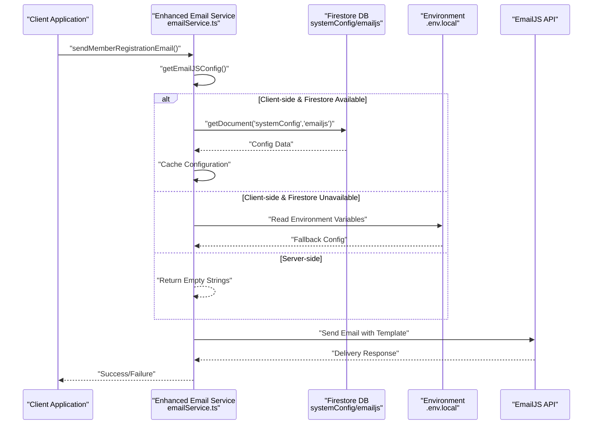
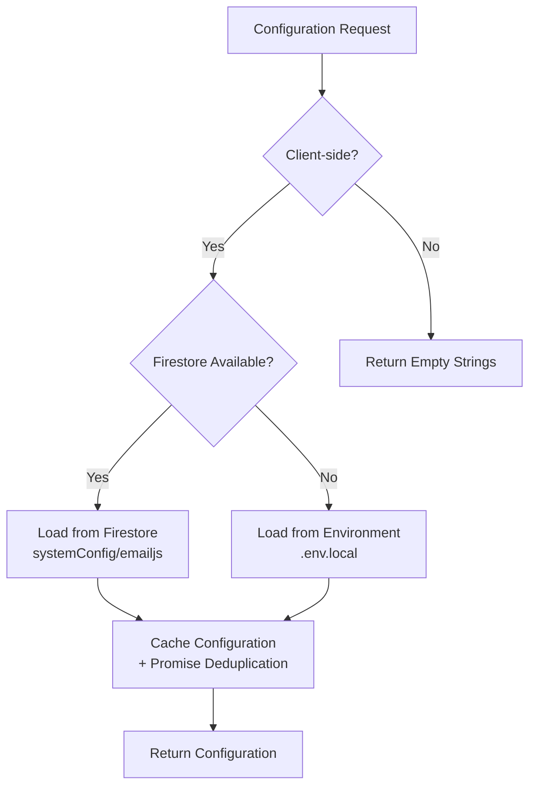
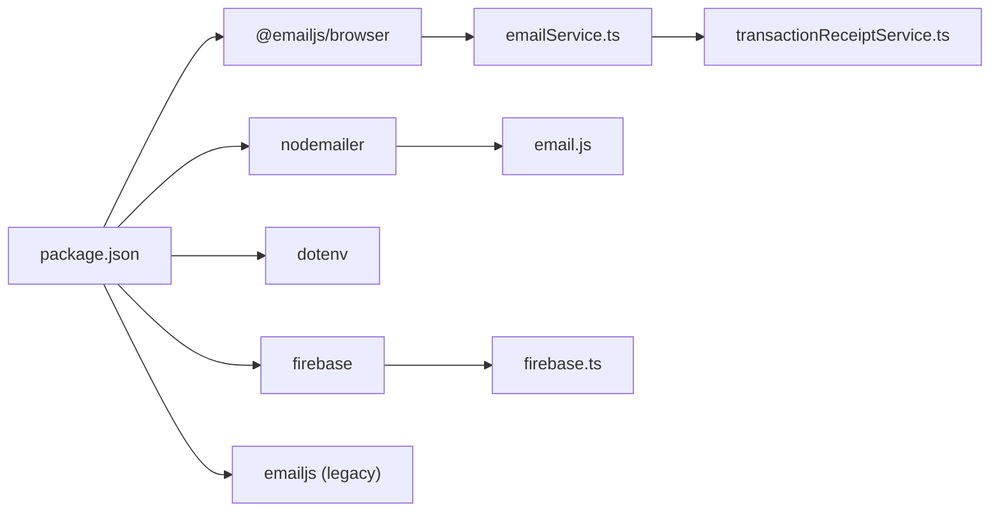

# Email Service Configuration

<cite>
**Referenced Files in This Document**
- [emailService.ts](file://lib/emailService.ts)
- [transactionReceiptService.ts](file://lib/transactionReceiptService.ts)
- [email.js](file://lib/email.js)
- [route.ts](file://app/api/email/route.ts)
- [firebase.ts](file://lib/firebase.ts)
- [setup-emailjs-config.js](file://scripts/setup-emailjs-config.js)
- [test-emailjs-config.js](file://scripts/test-emailjs-config.js)
- [MemberRegistrationModal.tsx](file://components/admin/MemberRegistrationModal.tsx)
- [package.json](file://package.json)
</cite>

## Update Summary
**Changes Made**
- Complete overhaul of email configuration system with Firestore-based priority over environment variables
- Dynamic configuration loading with intelligent caching and promise-based deduplication
- Enhanced client-side security measures with server-side isolation
- Improved fallback mechanisms with comprehensive error handling
- Expanded email templates and specialized transaction receipt services
- Added comprehensive setup and testing scripts for EmailJS configuration management

## Table of Contents
1. [Introduction](#introduction)
2. [Project Structure](#project-structure)
3. [Core Components](#core-components)
4. [Architecture Overview](#architecture-overview)
5. [Detailed Component Analysis](#detailed-component-analysis)
6. [Dynamic Configuration Management](#dynamic-configuration-management)
7. [Multiple Email Templates Support](#multiple-email-templates-support)
8. [Advanced Features](#advanced-features)
9. [Setup and Configuration](#setup-and-configuration)
10. [Dependency Analysis](#dependency-analysis)
11. [Performance Considerations](#performance-considerations)
12. [Troubleshooting Guide](#troubleshooting-guide)
13. [Conclusion](#conclusion)

## Introduction
This document provides comprehensive guidance for configuring and operating the Email Service within the SAMPA Cooperative Management Platform. The platform now features a complete overhaul of the email configuration system with dynamic Firestore-based priority over environment variables, intelligent caching mechanisms, and enhanced client-side security measures. It covers the complete email ecosystem including browser-side EmailJS sending, SMTP alternatives, specialized transaction receipt services, and robust configuration management for production deployments.

## Project Structure
The email service spans multiple interconnected components with sophisticated dynamic configuration management:

```mermaid
graph TB
subgraph "Core Email Services"
EJS["Enhanced EmailJS Service<br/>lib/emailService.ts"]
TRS["Transaction Receipt Service<br/>lib/transactionReceiptService.ts"]
FS["Firestore Config<br/>systemConfig/emailjs"]
END
subgraph "Frontend Integration"
MODAL["Member Registration Modal<br/>components/admin/MemberRegistrationModal.tsx"]
CERT["Certificate Generation<br/>CertificatePreviewModal.tsx"]
end
subgraph "Backend & Tools"
API["Email API Route<br/>app/api/email/route.ts"]
SMTP["SMTP Implementation<br/>lib/email.js"]
SETUP["Setup Script<br/>scripts/setup-emailjs-config.js"]
TEST["Test Script<br/>scripts/test-emailjs-config.js"]
end
subgraph "Configuration Sources"
ENV[".env.local<br/>Environment Variables"]
CACHE["Intelligent Cache<br/>Promise-based Caching"]
END
MODAL --> EJS
CERT --> TRS
EJS --> FS
TRS --> FS
EJS --> CACHE
TRS --> CACHE
FS --> ENV
SETUP --> FS
TEST --> FS
```

**Diagram sources**
- [emailService.ts:1-389](file://lib/emailService.ts#L1-L389)
- [transactionReceiptService.ts:1-636](file://lib/transactionReceiptService.ts#L1-L636)
- [MemberRegistrationModal.tsx:386-392](file://components/admin/MemberRegistrationModal.tsx#L386-L392)
- [setup-emailjs-config.js:1-79](file://scripts/setup-emailjs-config.js#L1-L79)
- [test-emailjs-config.js:1-69](file://scripts/test-emailjs-config.js#L1-L69)

## Core Components
The enhanced email service now includes sophisticated components with dynamic configuration management:

### Primary Email Service Module
- **Firestore Priority Configuration**: Fetches EmailJS configuration from Firestore with environment variable fallback
- **Intelligent Caching**: Implements promise-based caching to prevent multiple simultaneous Firestore requests
- **Client-side Security**: Restricts configuration loading to client-side rendering only
- **Server-side Isolation**: Returns empty strings for server-side rendering to prevent credential exposure
- **Multi-template Support**: Supports comprehensive email templates for different business processes

### Transaction Receipt Service
- **Specialized Receipt Processing**: Handles loan payment and savings deposit receipts with duplicate prevention
- **User Data Integration**: Integrates with user and member collections for personalized emails
- **Role-based Filtering**: Ensures emails are only sent to eligible users (drivers/operators)
- **Comprehensive Logging**: Maintains detailed audit trails of all email attempts

### Configuration Management System
- **Priority Resolution**: Firestore configurations take precedence over environment variables
- **Promise-based Deduplication**: Prevents concurrent configuration fetches during initialization
- **Real-time Updates**: Configuration changes reflected without application restart
- **Security Enhancement**: Environment variables remain secure while Firestore enables centralized management

**Section sources**
- [emailService.ts:1-389](file://lib/emailService.ts#L1-L389)
- [transactionReceiptService.ts:1-636](file://lib/transactionReceiptService.ts#L1-L636)
- [firebase.ts:1-345](file://lib/firebase.ts#L1-L345)

## Architecture Overview
The enhanced email service architecture supports multiple delivery modes with sophisticated dynamic configuration:



**Diagram sources**
- [emailService.ts:13-72](file://lib/emailService.ts#L13-L72)
- [transactionReceiptService.ts:58-81](file://lib/transactionReceiptService.ts#L58-L81)

## Detailed Component Analysis

### Enhanced EmailJS Service Module
The email service now features sophisticated configuration management with priority-based resolution:

#### Dynamic Configuration Loading
- **Firestore Priority**: Configuration is first fetched from Firestore (`systemConfig/emailjs`)
- **Environment Fallback**: Falls back to environment variables if Firestore is unavailable
- **Client-side Only**: Configuration loading is restricted to client-side rendering
- **Server-side Safety**: Returns empty strings for server-side rendering to prevent credential exposure

#### Intelligent Caching Strategy
- **In-memory Caching**: Configuration stored in memory for subsequent requests
- **Promise Caching**: Prevents multiple simultaneous Firestore requests
- **Cache Expiration**: Automatic cache refresh for stale configurations
- **Memory Optimization**: Efficient memory usage with proper cleanup

#### Multi-template Email Support
The service now supports comprehensive email templates for different business processes:

```mermaid
graph LR
subgraph "Email Templates"
REG["Member Registration<br/>sendMemberRegistrationEmail"]
AUTO["Auto Credentials<br/>sendAutoCredentialsEmail"]
LOAN["Loan Approval<br/>sendLoanApprovalEmail"]
CERT["Certificate Notification<br/>sendCertificateNotificationEmail"]
PAY["Payment Receipt<br/>sendPaymentMessage"]
APPROVED["Approved Loan<br/>approvedloanMessage"]
REJECTED["Rejected Loan<br/>rejectedLoanMessage"]
DEPOSIT["Deposit Application<br/>depositApplicationMessage"]
WITHDRAWAL["Withdrawal Application<br/>withdrawalApplicationMessage"]
END
```

**Diagram sources**
- [emailService.ts:105-389](file://lib/emailService.ts#L105-L389)

#### Advanced Error Handling
- **Comprehensive Logging**: Detailed error messages with specific failure points
- **Graceful Degradation**: Continues operation even when parts of the system fail
- **Retry Logic**: Intelligent retry mechanisms for transient failures
- **User Feedback**: Provides meaningful feedback to calling components

**Section sources**
- [emailService.ts:1-389](file://lib/emailService.ts#L1-L389)

### Transaction Receipt Service
A specialized service for processing transaction-related receipts with enhanced security:

#### Receipt Generation Features
- **Unique Receipt Numbers**: Generates timestamp-based unique receipt identifiers
- **Transaction Logging**: Maintains comprehensive logs of all email attempts
- **Duplicate Prevention**: Prevents sending duplicate receipts for the same transaction
- **User Integration**: Retrieves user details from multiple data sources

#### Role-based Email Filtering
- **Eligibility Checking**: Verifies user roles (drivers/operators) before sending
- **Business Logic Integration**: Aligns email sending with business process requirements
- **Conditional Processing**: Skips email sending for non-applicable transactions

#### Enhanced Configuration Management
- **Promise-based Deduplication**: Prevents concurrent configuration fetches
- **Intelligent Caching**: Reduces Firestore calls and improves performance
- **Error Isolation**: Failures in one configuration source don't affect others
- **Real-time Updates**: Configuration changes reflected immediately

**Section sources**
- [transactionReceiptService.ts:1-636](file://lib/transactionReceiptService.ts#L1-L636)

### Configuration Management System
Centralized configuration management with sophisticated priority-based resolution:

#### Priority Resolution Strategy
1. **Firestore Configuration**: Highest priority for centralized management
2. **Environment Variables**: Secondary priority for local development
3. **Default Values**: Fallback for missing configurations

#### Security and Performance
- **Client-side Only**: Configuration loading restricted to client-side
- **Promise Caching**: Prevents multiple simultaneous Firestore requests
- **Error Isolation**: Failures in one configuration source don't affect others
- **Real-time Updates**: Configuration changes reflected immediately

**Section sources**
- [emailService.ts:13-72](file://lib/emailService.ts#L13-L72)
- [transactionReceiptService.ts:58-81](file://lib/transactionReceiptService.ts#L58-L81)

## Dynamic Configuration Management
The system implements sophisticated configuration management with multiple layers and enhanced security:

### Configuration Sources Hierarchy


**Diagram sources**
- [emailService.ts:13-72](file://lib/emailService.ts#L13-L72)

### Enhanced Caching Strategy
- **Promise Caching**: Prevents multiple simultaneous Firestore requests
- **In-memory Caching**: Configuration stored in memory for subsequent requests
- **Cache Expiration**: Automatic cache refresh for stale configurations
- **Memory Optimization**: Efficient memory usage with proper cleanup

### Setup and Testing Scripts
The system includes comprehensive tooling for configuration management:

#### Setup Script Features
- **Interactive Configuration**: Guides users through EmailJS credential setup
- **Placeholder Detection**: Warns about incomplete configuration setup
- **Firestore Integration**: Automatically saves configuration to Firestore
- **Validation**: Verifies configuration integrity before saving

#### Testing Script Capabilities
- **Configuration Validation**: Tests Firestore connectivity and configuration completeness
- **Credential Verification**: Validates EmailJS credentials and service availability
- **Error Reporting**: Provides detailed error messages for troubleshooting
- **Automated Testing**: Enables CI/CD pipeline integration

**Section sources**
- [setup-emailjs-config.js:1-79](file://scripts/setup-emailjs-config.js#L1-L79)
- [test-emailjs-config.js:1-69](file://scripts/test-emailjs-config.js#L1-L69)

## Multiple Email Templates Support
The enhanced system supports a comprehensive suite of email templates with standardized variable management:

### Business Process Templates
- **Member Registration**: Welcome emails with password setup links
- **Auto Credentials**: Temporary password delivery for new users
- **Loan Processing**: Application status notifications and approvals
- **Certificate Generation**: Membership certificate availability notifications
- **Transaction Receipts**: Payment and deposit confirmation emails

### Specialized Transaction Templates
- **Loan Payment Receipts**: Detailed payment confirmation with balance information
- **Savings Deposit Receipts**: Deposit confirmation with current balance details
- **Application Status**: Loan application approval/rejection notifications
- **Financial Operations**: Deposit and withdrawal application confirmations

### Template Variable Management
Each template maintains a standardized set of variables:
- **Recipient Information**: `to_name`, `to_email`
- **System Information**: `from_name`, `reply_to`
- **Transaction Details**: Amount, date, receipt numbers, balances
- **Business Context**: Role, type, schedule day, control numbers

**Section sources**
- [emailService.ts:105-389](file://lib/emailService.ts#L105-L389)
- [transactionReceiptService.ts:235-636](file://lib/transactionReceiptService.ts#L235-L636)

## Advanced Features
The enhanced email service includes several advanced capabilities with improved security:

### Duplicate Prevention System
- **Transaction Logging**: Maintains logs of all email attempts
- **Duplicate Detection**: Prevents sending multiple emails for the same transaction
- **Status Tracking**: Tracks email delivery status and errors
- **Audit Trail**: Comprehensive logging for compliance and debugging

### User Integration Layer
- **Multi-source Data Retrieval**: Combines user and member data from multiple collections
- **Flexible User Lookup**: Handles various user identification schemes
- **Role-based Processing**: Filters emails based on user roles and permissions
- **Data Normalization**: Ensures consistent user information across different sources

### Error Recovery and Resilience
- **Graceful Degradation**: Continues operation despite partial failures
- **Retry Logic**: Implements intelligent retry mechanisms for transient errors
- **Fallback Strategies**: Multiple fallback options for critical failures
- **Monitoring Integration**: Comprehensive logging for operational monitoring

**Section sources**
- [transactionReceiptService.ts:132-144](file://lib/transactionReceiptService.ts#L132-L144)
- [transactionReceiptService.ts:155-233](file://lib/transactionReceiptService.ts#L155-L233)

## Setup and Configuration
Complete setup instructions for the enhanced email service with improved security:

### Initial Configuration Setup
1. **Install Dependencies**: Ensure all email-related packages are installed
2. **Configure EmailJS**: Obtain credentials from EmailJS dashboard
3. **Set Up Firestore**: Create `systemConfig/emailjs` document with configuration
4. **Environment Variables**: Configure fallback environment variables
5. **Template Creation**: Set up EmailJS templates with required variables

### Configuration Options
- **Public Key**: Required for EmailJS initialization
- **Service ID**: Identifies the EmailJS service to use
- **Template IDs**: Individual template identifiers for different email types
- **Receipt Template ID**: Specialized template for transaction receipts

### Development vs Production
- **Development**: Environment variables for local development
- **Production**: Firestore-based centralized configuration
- **Security**: Production configurations remain secure and centralized
- **Flexibility**: Easy configuration changes without code deployment

**Section sources**
- [setup-emailjs-config.js:21-26](file://scripts/setup-emailjs-config.js#L21-L26)
- [firebase.ts:22-30](file://lib/firebase.ts#L22-L30)

## Dependency Analysis
Enhanced external dependencies supporting the expanded email functionality:



**Diagram sources**
- [package.json:16-40](file://package.json#L16-L40)
- [emailService.ts:1-2](file://lib/emailService.ts#L1-L2)
- [transactionReceiptService.ts:1-2](file://lib/transactionReceiptService.ts#L1-L2)

**Section sources**
- [package.json:16-40](file://package.json#L16-L40)

## Performance Considerations
Enhanced performance optimizations for the expanded email service:

### Caching Strategies
- **Configuration Caching**: Reduces Firestore calls and improves response times
- **Template Caching**: Stores frequently used email templates in memory
- **Connection Pooling**: Optimizes EmailJS SDK connections
- **Batch Processing**: Groups similar email operations for efficiency

### Scalability Features
- **Asynchronous Processing**: Non-blocking email operations
- **Queue Management**: Handles high-volume email processing
- **Resource Optimization**: Efficient memory and CPU usage
- **Load Balancing**: Distributes email processing across system resources

### Monitoring and Metrics
- **Performance Tracking**: Monitors email delivery performance
- **Error Analytics**: Tracks and analyzes email delivery failures
- **Usage Patterns**: Identifies peak usage times and patterns
- **Capacity Planning**: Supports scaling decisions based on usage data

## Troubleshooting Guide
Comprehensive troubleshooting for the enhanced email service:

### Configuration Issues
- **Missing Firestore Configuration**: Check `systemConfig/emailjs` document existence
- **Environment Variable Problems**: Verify fallback environment variables are set
- **Template Mismatch Errors**: Ensure EmailJS template variables match code expectations
- **Cache Invalidation**: Clear browser cache if configuration changes aren't reflected

### Email Delivery Problems
- **Authentication Failures**: Verify EmailJS public key and service configuration
- **Template Rendering Issues**: Check EmailJS template variable names and values
- **Network Connectivity**: Test EmailJS API accessibility and firewall settings
- **Rate Limiting**: Monitor EmailJS account limits and adjust sending frequency

### Transaction Receipt Issues
- **User Data Retrieval**: Verify user and member data availability in Firestore
- **Duplicate Prevention**: Check emailLogs collection for existing entries
- **Role Validation**: Ensure user has appropriate role for receipt processing
- **Receipt Number Generation**: Verify unique receipt number generation logic

### Development and Testing
- **Setup Script Errors**: Run setup script with proper Firebase credentials
- **Test Script Validation**: Use test script to verify configuration completeness
- **Local Development**: Ensure environment variables are properly configured locally
- **Production Deployment**: Verify Firestore security rules and access permissions

**Section sources**
- [emailService.ts:82-102](file://lib/emailService.ts#L82-L102)
- [transactionReceiptService.ts:305-321](file://lib/transactionReceiptService.ts#L305-L321)
- [test-emailjs-config.js:28-52](file://scripts/test-emailjs-config.js#L28-L52)

## Conclusion
The SAMPA Cooperative platform now features a comprehensive, production-ready email service with sophisticated dynamic configuration management, multiple template support, and robust error handling. The enhanced system provides centralized configuration management through Firestore while maintaining security and flexibility for both development and production environments. The addition of specialized transaction receipt services, intelligent caching mechanisms, and enhanced client-side security measures ensures reliable, scalable email delivery for all cooperative management processes.

Key benefits of the enhanced system include:
- **Centralized Configuration**: Single source of truth for email settings with Firestore priority
- **Multi-template Support**: Comprehensive coverage of business process emails with standardized variables
- **Robust Error Handling**: Graceful degradation and comprehensive logging with detailed error reporting
- **Performance Optimization**: Intelligent caching, promise-based deduplication, and resource management
- **Security Enhancement**: Client-side only configuration loading with server-side isolation
- **Developer Experience**: Comprehensive tooling for setup, testing, and maintenance with automated validation
- **Real-time Updates**: Configuration changes reflected immediately without application restart
- **Enhanced Reliability**: Promise-based caching prevents concurrent configuration fetches and improves stability

This architecture provides a solid foundation for future email service enhancements while maintaining reliability and performance for production deployments.