# Loan Application Workflow

<cite>
**Referenced Files in This Document**
- [LoanApplicationModal.tsx](file://components/user/LoanApplicationModal.tsx)
- [LoanRequestForm.tsx](file://components/user/LoanRequestForm.tsx)
- [LoanActions.tsx](file://components/user/actions/LoanActions.tsx)
- [LoanRequestsManager.tsx](file://components/admin/LoanRequestsManager.tsx)
- [AddLoanPlanModal.tsx](file://components/admin/AddLoanPlanModal.tsx)
- [route.ts](file://app/api/loans/route.ts)
- [loan.ts](file://lib/types/loan.ts)
- [firebase.ts](file://lib/firebase.ts)
- [page.tsx](file://app/loan/page.tsx)
- [ActiveLoans.tsx](file://components/user/ActiveLoans.tsx)
- [useCapitalShare.ts](file://hooks/useCapitalShare.ts)
</cite>

## Update Summary
**Changes Made**
- Updated to reflect the simplified loan application workflow focusing on capital share completion requirements
- Removed references to complex multi-layered system and sophisticated application state management
- Added emphasis on basic active/pending loan checks and capital share restrictions
- Updated architecture diagrams to show streamlined workflow
- Revised troubleshooting guide to focus on capital share and eligibility requirements

## Table of Contents
1. [Introduction](#introduction)
2. [Project Structure](#project-structure)
3. [Core Components](#core-components)
4. [Architecture Overview](#architecture-overview)
5. [Detailed Component Analysis](#detailed-component-analysis)
6. [Dependency Analysis](#dependency-analysis)
7. [Performance Considerations](#performance-considerations)
8. [Troubleshooting Guide](#troubleshooting-guide)
9. [Conclusion](#conclusion)

## Introduction
This document describes the simplified loan application workflow in the SAMPA Cooperative Management System. The workflow has been streamlined to focus primarily on capital share completion requirements and basic active/pending loan checks, removing sophisticated application state management features. It covers the end-to-end process from user initiation through submission, including form validation, required documentation, eligibility checks, and administrative approval processes.

## Project Structure
The loan application workflow spans several client-side components and server-side API routes with a focus on simplicity:
- User-facing components for initiating and submitting loan applications with capital share validation
- Administrative components for reviewing and approving loan requests
- API routes for backend loan operations
- Shared types and Firebase utilities with streamlined functionality

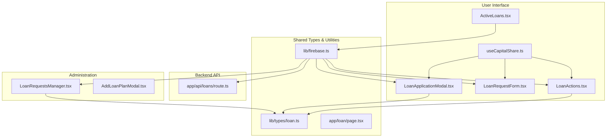

**Diagram sources**
- [LoanApplicationModal.tsx:1-252](file://components/user/LoanApplicationModal.tsx#L1-L252)
- [LoanRequestForm.tsx:1-235](file://components/user/LoanRequestForm.tsx#L1-L235)
- [LoanActions.tsx:1-665](file://components/user/actions/LoanActions.tsx#L1-L665)
- [ActiveLoans.tsx:1-998](file://components/user/ActiveLoans.tsx#L1-L998)
- [useCapitalShare.ts:1-143](file://hooks/useCapitalShare.ts#L1-L143)
- [LoanRequestsManager.tsx:1-1100](file://components/admin/LoanRequestsManager.tsx#L1-L1100)
- [AddLoanPlanModal.tsx:1-244](file://components/admin/AddLoanPlanModal.tsx#L1-L244)
- [route.ts:1-133](file://app/api/loans/route.ts#L1-L133)
- [loan.ts:1-20](file://lib/types/loan.ts#L1-L20)
- [firebase.ts:1-309](file://lib/firebase.ts#L1-L309)
- [page.tsx:1-1078](file://app/loan/page.tsx#L1-L1078)

**Section sources**
- [LoanApplicationModal.tsx:1-252](file://components/user/LoanApplicationModal.tsx#L1-L252)
- [LoanRequestForm.tsx:1-235](file://components/user/LoanRequestForm.tsx#L1-L235)
- [LoanActions.tsx:1-665](file://components/user/actions/LoanActions.tsx#L1-L665)
- [ActiveLoans.tsx:1-998](file://components/user/ActiveLoans.tsx#L1-L998)
- [useCapitalShare.ts:1-143](file://hooks/useCapitalShare.ts#L1-L143)
- [LoanRequestsManager.tsx:1-1100](file://components/admin/LoanRequestsManager.tsx#L1-L1100)
- [AddLoanPlanModal.tsx:1-244](file://components/admin/AddLoanPlanModal.tsx#L1-L244)
- [route.ts:1-133](file://app/api/loans/route.ts#L1-L133)
- [loan.ts:1-20](file://lib/types/loan.ts#L1-L20)
- [firebase.ts:1-309](file://lib/firebase.ts#L1-L309)
- [page.tsx:1-1078](file://app/loan/page.tsx#L1-L1078)

## Core Components
- **LoanApplicationModal**: Streamlined modal for quick loan applications with plan-specific validation and submission, integrated with capital share checks.
- **LoanRequestForm**: General-purpose form for submitting loan requests with member information enrichment and capital share validation.
- **LoanActions**: Centralized component for selecting loan plans, validating inputs, and submitting applications with real-time eligibility checks.
- **ActiveLoans**: Component for managing and tracking active loans with payment schedules and completion status.
- **useCapitalShare**: Hook for checking and managing capital share requirements with real-time validation.
- **LoanRequestsManager**: Administrative interface for reviewing, approving, and rejecting loan requests with simplified workflow.
- **AddLoanPlanModal**: Administrative tool for creating and updating loan plans with term options and interest rates.
- **API Loans Route**: Server-side endpoint for creating loans with validation and error handling.
- **Types**: Shared TypeScript interfaces for loan plans and requests.
- **Firebase Utilities**: Firestore helpers for CRUD operations and document retrieval.

**Section sources**
- [LoanApplicationModal.tsx:1-252](file://components/user/LoanApplicationModal.tsx#L1-L252)
- [LoanRequestForm.tsx:1-235](file://components/user/LoanRequestForm.tsx#L1-L235)
- [LoanActions.tsx:1-665](file://components/user/actions/LoanActions.tsx#L1-L665)
- [ActiveLoans.tsx:1-998](file://components/user/ActiveLoans.tsx#L1-L998)
- [useCapitalShare.ts:1-143](file://hooks/useCapitalShare.ts#L1-L143)
- [LoanRequestsManager.tsx:1-1100](file://components/admin/LoanRequestsManager.tsx#L1-L1100)
- [AddLoanPlanModal.tsx:1-244](file://components/admin/AddLoanPlanModal.tsx#L1-L244)
- [route.ts:1-133](file://app/api/loans/route.ts#L1-L133)
- [loan.ts:1-20](file://lib/types/loan.ts#L1-L20)
- [firebase.ts:1-309](file://lib/firebase.ts#L1-L309)

## Architecture Overview
The loan application workflow follows a simplified client-server architecture with emphasis on capital share validation:
- Users interact with React components to apply for loans, with real-time capital share checks.
- Components validate inputs and persist loan requests to Firestore collections.
- Administrators review and approve requests, generating payment schedules and moving data to the loans collection.
- A dedicated API route supports backend loan creation with strict validation.
- Real-time listeners monitor active and pending loan states for user eligibility.

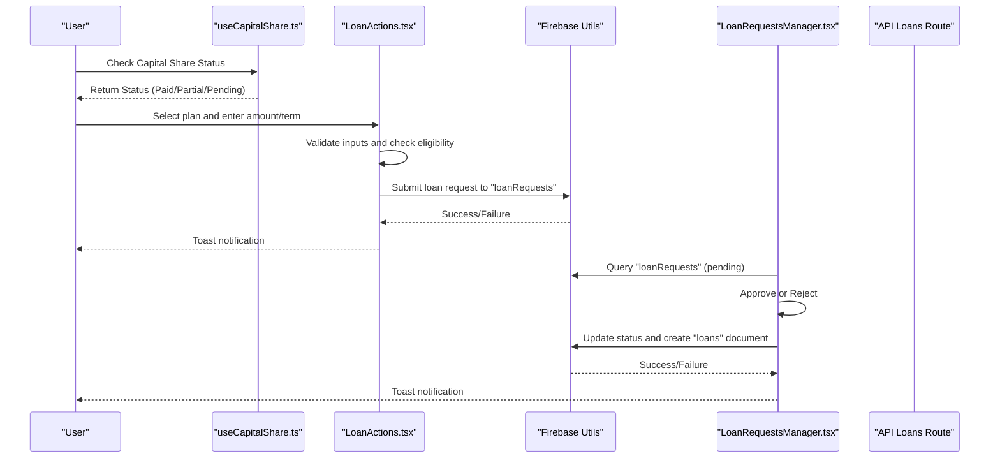

**Diagram sources**
- [useCapitalShare.ts:1-143](file://hooks/useCapitalShare.ts#L1-L143)
- [LoanActions.tsx:1-665](file://components/user/actions/LoanActions.tsx#L1-L665)
- [LoanRequestsManager.tsx:1-1100](file://components/admin/LoanRequestsManager.tsx#L1-L1100)
- [firebase.ts:1-309](file://lib/firebase.ts#L1-L309)
- [route.ts:1-133](file://app/api/loans/route.ts#L1-L133)

## Detailed Component Analysis

### LoanApplicationModal Component
The LoanApplicationModal provides a streamlined application experience for a selected loan plan with integrated capital share validation:
- Pre-populates amount and term from the selected plan.
- Validates amount against plan maximum and term against plan options.
- Integrates with capital share validation to ensure user eligibility.
- Enriches the submission with user/member information.
- Persists the loan request to the "loanRequests" collection and notifies the user.

Key behaviors:
- Input validation for amount and term.
- Member information fallback if member record is not found.
- Submission via Firestore utility with error handling and success feedback.
- Real-time eligibility checks based on capital share status.

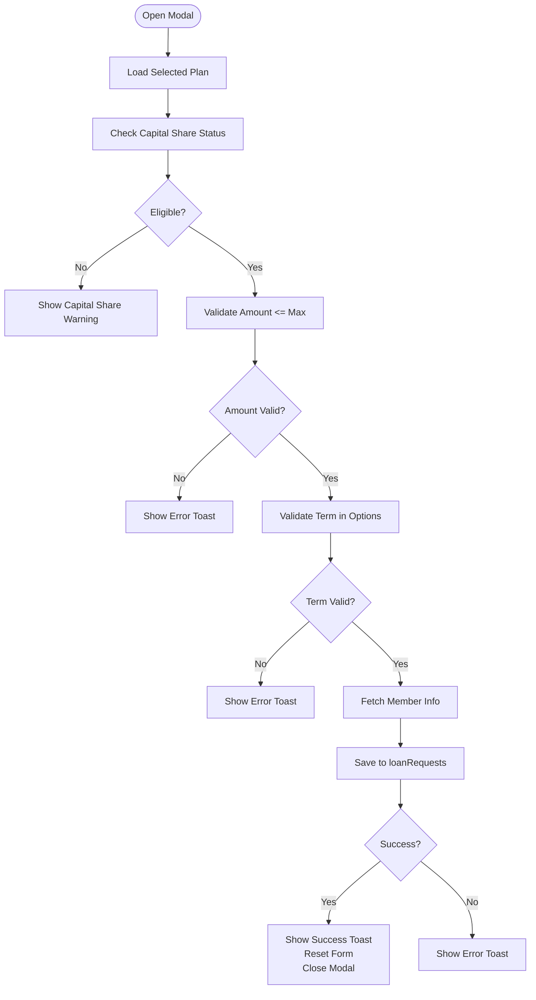

**Diagram sources**
- [LoanApplicationModal.tsx:33-124](file://components/user/LoanApplicationModal.tsx#L33-L124)
- [useCapitalShare.ts:1-143](file://hooks/useCapitalShare.ts#L1-L143)
- [firebase.ts:1-309](file://lib/firebase.ts#L1-L309)

**Section sources**
- [LoanApplicationModal.tsx:1-252](file://components/user/LoanApplicationModal.tsx#L1-L252)
- [useCapitalShare.ts:1-143](file://hooks/useCapitalShare.ts#L1-L143)
- [firebase.ts:1-309](file://lib/firebase.ts#L1-L309)

### LoanRequestForm Component
The LoanRequestForm offers a general-purpose application form with integrated eligibility checks:
- Collects amount, term, and optional description.
- Validates numeric inputs for amount and term.
- Integrates with capital share validation to ensure user eligibility.
- Attempts to enrich the submission with member information from the "members" collection, falling back to user data if unavailable.
- Submits the loan request to "loanRequests".

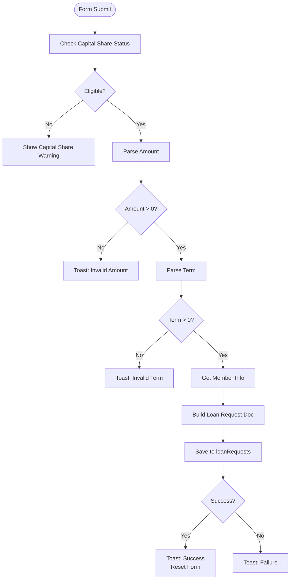

**Diagram sources**
- [LoanRequestForm.tsx:19-154](file://components/user/LoanRequestForm.tsx#L19-L154)
- [useCapitalShare.ts:1-143](file://hooks/useCapitalShare.ts#L1-L143)
- [firebase.ts:1-309](file://lib/firebase.ts#L1-L309)

**Section sources**
- [LoanRequestForm.tsx:1-235](file://components/user/LoanRequestForm.tsx#L1-L235)
- [useCapitalShare.ts:1-143](file://hooks/useCapitalShare.ts#L1-L143)
- [firebase.ts:1-309](file://lib/firebase.ts#L1-L309)

### LoanActions Component
LoanActions centralizes the entire application flow with real-time eligibility monitoring:
- Displays available loan plans filtered by capital share status.
- Handles plan selection, amount/term validation, and real-time eligibility checks.
- Integrates with capital share validation to prevent applications when requirements aren't met.
- Presents a streamlined verification process with payment schedule summary.
- Submits the application to "loanRequests" with enriched member information.

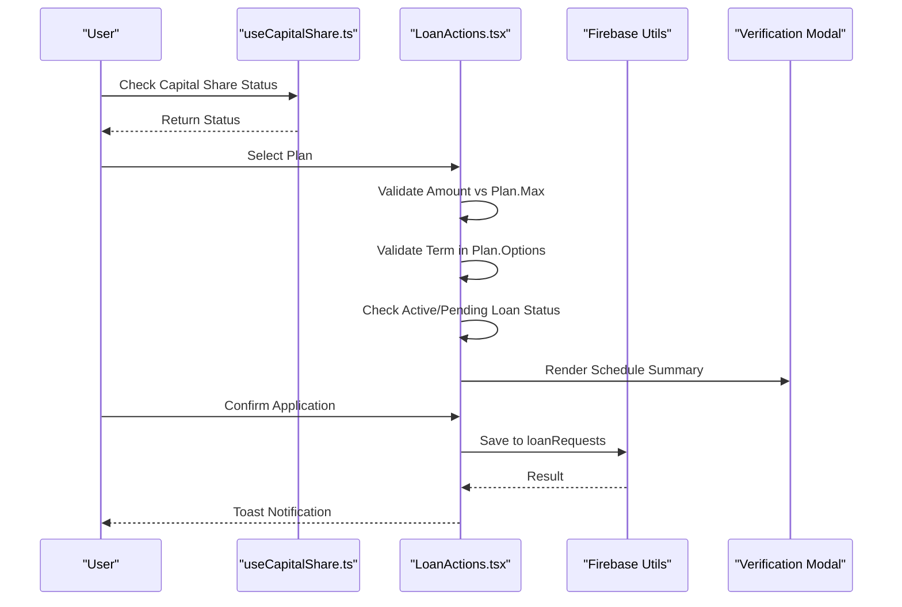

**Diagram sources**
- [useCapitalShare.ts:1-143](file://hooks/useCapitalShare.ts#L1-L143)
- [LoanActions.tsx:1-665](file://components/user/actions/LoanActions.tsx#L1-L665)
- [firebase.ts:1-309](file://lib/firebase.ts#L1-L309)

**Section sources**
- [LoanActions.tsx:1-665](file://components/user/actions/LoanActions.tsx#L1-L665)
- [useCapitalShare.ts:1-143](file://hooks/useCapitalShare.ts#L1-L143)
- [firebase.ts:1-309](file://lib/firebase.ts#L1-L309)

### ActiveLoans Component
ActiveLoans manages and tracks active loans with payment schedules and completion status:
- Real-time listeners for approved/active loans with automatic updates.
- Payment schedule calculation with daily amortization.
- Payment processing with auto-marking logic.
- Completed loans tracking with historical data.
- Integration with loan payment transactions collection.

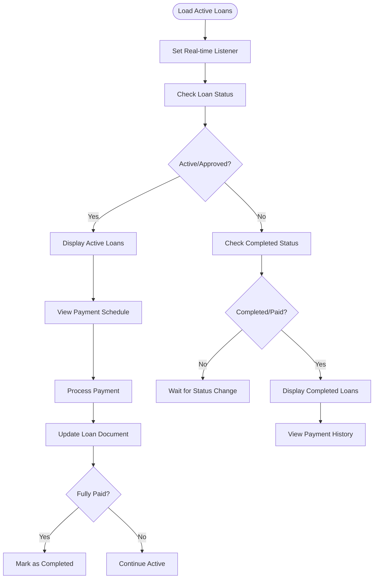

**Diagram sources**
- [ActiveLoans.tsx:79-134](file://components/user/ActiveLoans.tsx#L79-L134)
- [ActiveLoans.tsx:136-204](file://components/user/ActiveLoans.tsx#L136-L204)
- [ActiveLoans.tsx:327-437](file://components/user/ActiveLoans.tsx#L327-L437)

**Section sources**
- [ActiveLoans.tsx:1-998](file://components/user/ActiveLoans.tsx#L1-L998)

### useCapitalShare Hook
The useCapitalShare hook provides comprehensive capital share validation and tracking:
- Calculates required amount (PHP 10,000) and paid amount from multiple data sources.
- Tracks remaining balance and determines payment status (Paid/Partial/Pending).
- Integrates with member data and capital share transactions for accurate calculations.
- Provides real-time updates and refresh capabilities.

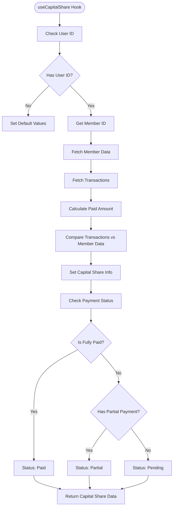

**Diagram sources**
- [useCapitalShare.ts:35-128](file://hooks/useCapitalShare.ts#L35-L128)

**Section sources**
- [useCapitalShare.ts:1-143](file://hooks/useCapitalShare.ts#L1-L143)

### LoanRequestsManager Component
Administrative component for managing loan requests with simplified workflow:
- Queries pending, approved, and rejected requests with real-time updates.
- Approves requests by updating status, retrieving member information, calculating daily amortization schedule, and creating a document in the "loans" collection.
- Rejects requests with a required reason and updates metadata.
- Simplified approval process without complex state management.

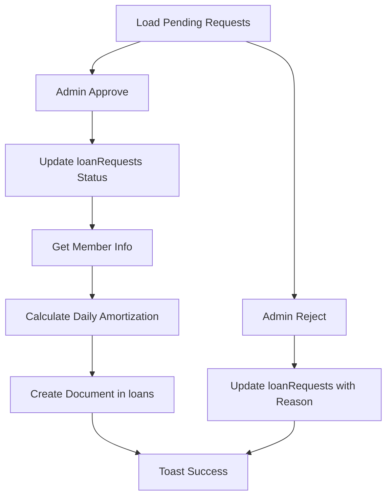

**Diagram sources**
- [LoanRequestsManager.tsx:125-183](file://components/admin/LoanRequestsManager.tsx#L125-L183)

**Section sources**
- [LoanRequestsManager.tsx:1-1100](file://components/admin/LoanRequestsManager.tsx#L1-L1100)

### AddLoanPlanModal Component
Administrative tool for managing loan plans with streamlined functionality:
- Adds or edits loan plans with name, description, maximum amount, interest rate, and comma-separated term options.
- Parses term options into integers and validates presence.
- Creates or updates documents in the "loanPlans" collection.

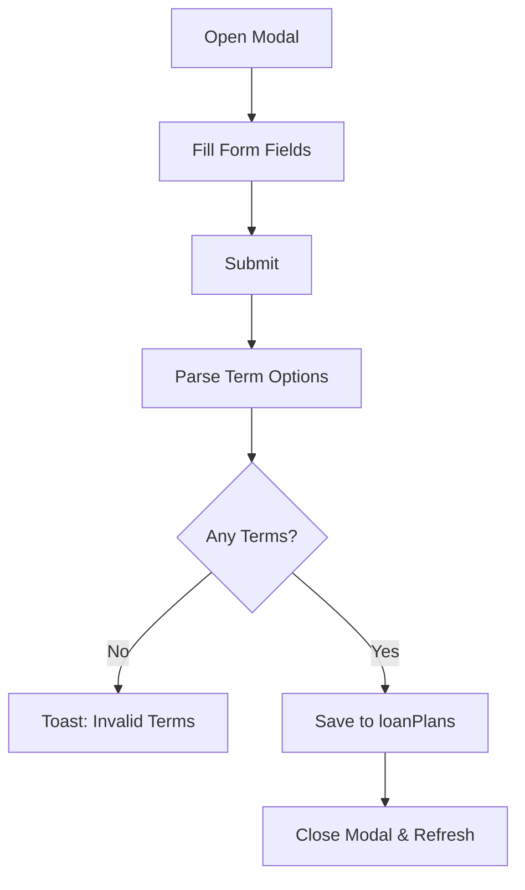

**Diagram sources**
- [AddLoanPlanModal.tsx:54-117](file://components/admin/AddLoanPlanModal.tsx#L54-L117)

**Section sources**
- [AddLoanPlanModal.tsx:1-244](file://components/admin/AddLoanPlanModal.tsx#L1-L244)

### API Endpoint for Loan Creation
The API route supports backend loan creation with streamlined validation:
- Validates presence and numeric types for required fields.
- Sanitizes numeric inputs and creates a unique loan identifier.
- Returns structured success/error responses with appropriate HTTP status codes.

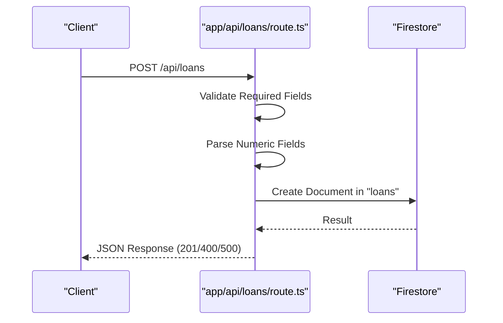

**Diagram sources**
- [route.ts:42-112](file://app/api/loans/route.ts#L42-L112)

**Section sources**
- [route.ts:1-133](file://app/api/loans/route.ts#L1-L133)

## Dependency Analysis
Loan components depend on shared types and Firebase utilities with streamlined integration:
- Types define the shape of loan plans and requests.
- Firebase utilities encapsulate Firestore operations and error handling.
- Administrative components rely on plan data to compute interest and schedule payments.
- Capital share validation integrates with member data and transaction history.
- Real-time listeners provide automatic updates for loan status and eligibility.

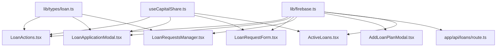

**Diagram sources**
- [loan.ts:1-20](file://lib/types/loan.ts#L1-L20)
- [firebase.ts:1-309](file://lib/firebase.ts#L1-L309)
- [LoanActions.tsx:1-665](file://components/user/actions/LoanActions.tsx#L1-L665)
- [LoanApplicationModal.tsx:1-252](file://components/user/LoanApplicationModal.tsx#L1-L252)
- [LoanRequestForm.tsx:1-235](file://components/user/LoanRequestForm.tsx#L1-L235)
- [LoanRequestsManager.tsx:1-1100](file://components/admin/LoanRequestsManager.tsx#L1-L1100)
- [AddLoanPlanModal.tsx:1-244](file://components/admin/AddLoanPlanModal.tsx#L1-L244)
- [route.ts:1-133](file://app/api/loans/route.ts#L1-L133)
- [ActiveLoans.tsx:1-998](file://components/user/ActiveLoans.tsx#L1-L998)
- [useCapitalShare.ts:1-143](file://hooks/useCapitalShare.ts#L1-L143)

**Section sources**
- [loan.ts:1-20](file://lib/types/loan.ts#L1-L20)
- [firebase.ts:1-309](file://lib/firebase.ts#L1-L309)
- [LoanActions.tsx:1-665](file://components/user/actions/LoanActions.tsx#L1-L665)
- [LoanApplicationModal.tsx:1-252](file://components/user/LoanApplicationModal.tsx#L1-L252)
- [LoanRequestForm.tsx:1-235](file://components/user/LoanRequestForm.tsx#L1-L235)
- [LoanRequestsManager.tsx:1-1100](file://components/admin/LoanRequestsManager.tsx#L1-L1100)
- [AddLoanPlanModal.tsx:1-244](file://components/admin/AddLoanPlanModal.tsx#L1-L244)
- [route.ts:1-133](file://app/api/loans/route.ts#L1-L133)
- [ActiveLoans.tsx:1-998](file://components/user/ActiveLoans.tsx#L1-L998)
- [useCapitalShare.ts:1-143](file://hooks/useCapitalShare.ts#L1-L143)

## Performance Considerations
- Real-time listeners in administrative components provide automatic updates without requiring composite indexes.
- Daily amortization calculations for long terms can be computationally intensive; consider limiting visible schedule length and using pagination.
- Client-side sorting and filtering reduce server load but may impact responsiveness with large datasets; optimize queries and consider server-side filtering.
- Capital share validation uses efficient caching and real-time updates to minimize database queries.
- Streamlined loan application process reduces complexity and improves user experience.

## Troubleshooting Guide
Common issues and resolutions:
- **Missing Firestore indexes**: Administrative components may show failed-precondition errors; however, the refactored approach eliminates composite index requirements.
- **Member record not found**: Components fall back to user data; ensure user records exist and are linked to members.
- **Capital Share Incomplete**: Users cannot apply for loans until they complete their PHP 10,000 capital share requirement.
- **Active/Pending Loan Restrictions**: Users cannot apply for new loans while they have active or pending applications.
- **Validation errors**: Inputs must be positive numbers; amounts must not exceed plan maximum; terms must match plan options.
- **API errors**: Verify required fields and numeric types; check HTTP status codes for detailed error messages.

**Section sources**
- [LoanRequestsManager.tsx:16-33](file://components/admin/LoanRequestsManager.tsx#L16-L33)
- [LoanActions.tsx:1-665](file://components/user/actions/LoanActions.tsx#L1-L665)
- [LoanApplicationModal.tsx:1-252](file://components/user/LoanApplicationModal.tsx#L1-L252)
- [LoanRequestForm.tsx:1-235](file://components/user/LoanRequestForm.tsx#L1-L235)
- [route.ts:42-112](file://app/api/loans/route.ts#L42-L112)
- [useCapitalShare.ts:1-143](file://hooks/useCapitalShare.ts#L1-L143)

## Conclusion
The SAMPA Cooperative Management System provides a streamlined, user-friendly loan application workflow with strong validation, clear user feedback, and administrative oversight. The simplified architecture focuses on capital share completion requirements and basic active/pending loan checks, removing sophisticated application state management features. The modular design ensures maintainability and scalability, while the API and Firestore utilities support reliable data operations. Proper capital share validation and real-time eligibility checks are essential for optimal performance and user experience.