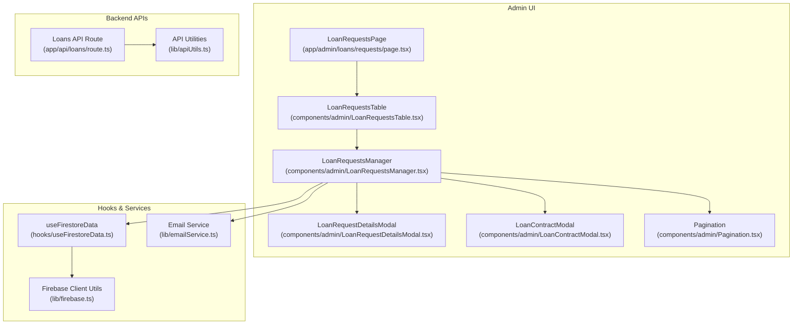
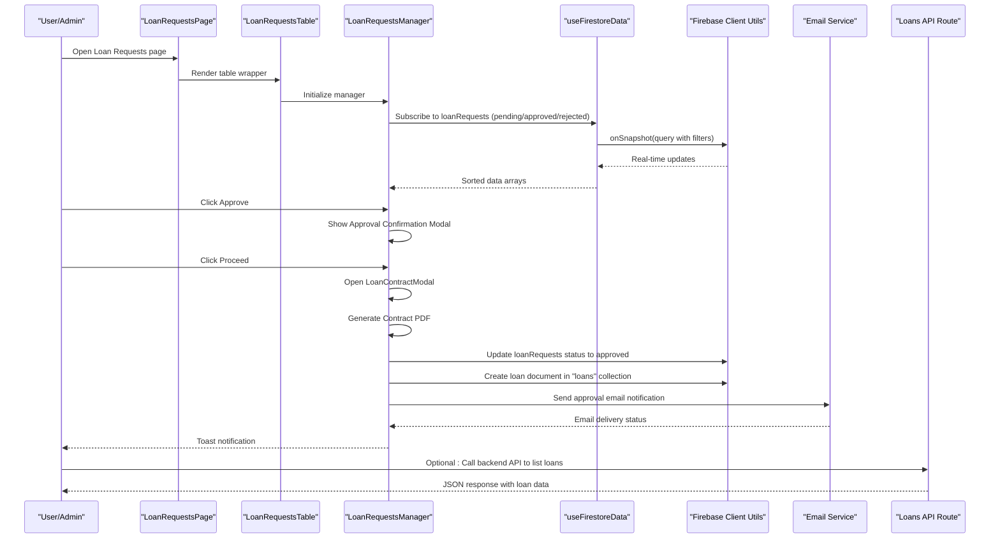
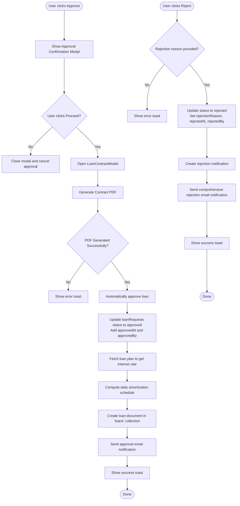
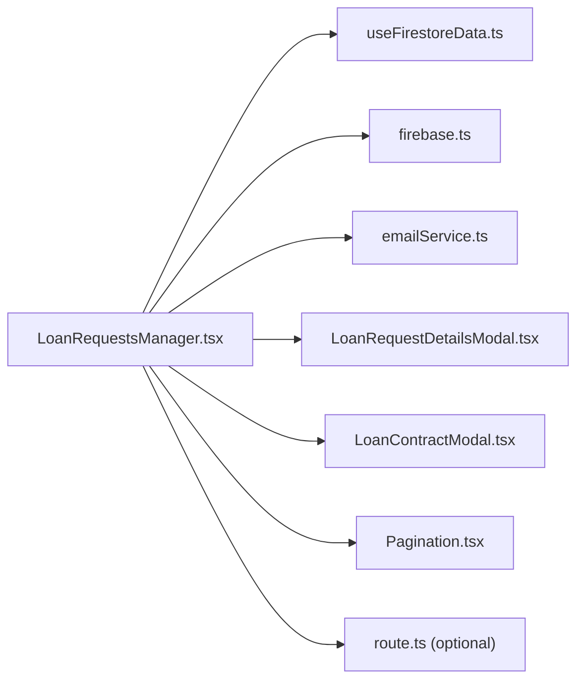

# Loan Approval Process

<cite>
**Referenced Files in This Document**
- [LoanRequestsManager.tsx](file://components/admin/LoanRequestsManager.tsx)
- [LoanRequestsManagerRefactored.tsx](file://components/admin/LoanRequestsManagerRefactored.tsx)
- [LoanRequestsTable.tsx](file://components/admin/LoanRequestsTable.tsx)
- [LoanRequestsPage.tsx](file://app/admin/loans/requests/page.tsx)
- [LoanRequestDetailsModal.tsx](file://components/admin/LoanRequestDetailsModal.tsx)
- [LoanContractModal.tsx](file://components/admin/LoanContractModal.tsx)
- [Pagination.tsx](file://components/admin/Pagination.tsx)
- [useFirestoreData.ts](file://hooks/useFirestoreData.ts)
- [firebase.ts](file://lib/firebase.ts)
- [emailService.ts](file://lib/emailService.ts)
- [apiUtils.ts](file://lib/apiUtils.ts)
- [route.ts](file://app/api/loans/route.ts)
</cite>

## Update Summary
**Changes Made**
- Enhanced error handling with comprehensive rejection email functionality
- Improved integration with email service for both approval and rejection workflows
- Enhanced data validation for loan approval and rejection processes
- Added robust error logging and recovery mechanisms for email operations
- Implemented comprehensive rejection email notifications with detailed error handling

## Table of Contents
1. [Introduction](#introduction)
2. [Project Structure](#project-structure)
3. [Core Components](#core-components)
4. [Architecture Overview](#architecture-overview)
5. [Detailed Component Analysis](#detailed-component-analysis)
6. [Enhanced Email Service Integration](#enhanced-email-service-integration)
7. [Improved Error Handling and Validation](#improved-error-handling-and-validation)
8. [Dependency Analysis](#dependency-analysis)
9. [Performance Considerations](#performance-considerations)
10. [Troubleshooting Guide](#troubleshooting-guide)
11. [Conclusion](#conclusion)
12. [Appendices](#appendices)

## Introduction
This document explains the enhanced loan approval process workflow in the cooperative management system. The system now features comprehensive email notification functionality with improved error handling, better integration with the email service, and enhanced data validation. The workflow covers the role-based approval mechanism, the LoanRequestsManager component's capabilities (listing, approvals/rejections, status tracking), the approval workflow logic (automated checks, manual review, notifications), and the LoanRequestsTable implementation (sorting, filtering, pagination, and bulk actions). It also documents the refactored version improvements and migration considerations, along with approval criteria, required documentation review, risk assessment factors, compliance requirements, and examples of approval scenarios, rejection reasons, and escalation procedures for high-value loans.

## Project Structure
The loan approval UI is organized under the admin section and integrates with shared components and hooks for data fetching and presentation. The enhanced system now includes comprehensive email service integration with robust error handling and validation.

**Diagram sources**
- [LoanRequestsPage.tsx:1-16](file://app/admin/loans/requests/page.tsx#L1-L16)
- [LoanRequestsTable.tsx:1-10](file://components/admin/LoanRequestsTable.tsx#L1-L10)
- [LoanRequestsManager.tsx:1-1104](file://components/admin/LoanRequestsManager.tsx#L1-L1104)
- [LoanRequestDetailsModal.tsx:1-392](file://components/admin/LoanRequestDetailsModal.tsx#L1-L392)
- [LoanContractModal.tsx:1-404](file://components/admin/LoanContractModal.tsx#L1-L404)
- [Pagination.tsx:1-141](file://components/admin/Pagination.tsx#L1-L141)
- [useFirestoreData.ts:1-182](file://hooks/useFirestoreData.ts#L1-L182)
- [firebase.ts:1-345](file://lib/firebase.ts#L1-L345)
- [emailService.ts:1-390](file://lib/emailService.ts#L1-L390)
- [route.ts:1-133](file://app/api/loans/route.ts#L1-L133)
- [apiUtils.ts:1-109](file://lib/apiUtils.ts#L1-L109)

**Section sources**
- [LoanRequestsPage.tsx:1-16](file://app/admin/loans/requests/page.tsx#L1-L16)
- [LoanRequestsTable.tsx:1-10](file://components/admin/LoanRequestsTable.tsx#L1-L10)
- [LoanRequestsManager.tsx:1-1104](file://components/admin/LoanRequestsManager.tsx#L1-L1104)
- [LoanRequestDetailsModal.tsx:1-392](file://components/admin/LoanRequestDetailsModal.tsx#L1-L392)
- [LoanContractModal.tsx:1-404](file://components/admin/LoanContractModal.tsx#L1-L404)
- [Pagination.tsx:1-141](file://components/admin/Pagination.tsx#L1-L141)
- [useFirestoreData.ts:1-182](file://hooks/useFirestoreData.ts#L1-L182)
- [firebase.ts:1-345](file://lib/firebase.ts#L1-L345)
- [emailService.ts:1-390](file://lib/emailService.ts#L1-L390)
- [route.ts:1-133](file://app/api/loans/route.ts#L1-L133)
- [apiUtils.ts:1-109](file://lib/apiUtils.ts#L1-L109)

## Core Components
- LoanRequestsManager: Central component for managing loan requests with tabs for pending, approved, and rejected requests; supports real-time updates, search, pagination, approval/rejection actions, integrated contract generation workflow, and comprehensive email notification system.
- LoanRequestDetailsModal: Detailed modal for viewing request metadata and performing approval/rejection actions with enhanced validation.
- LoanContractModal: New component for automated contract creation, PDF generation, and loan approval workflow integration.
- Pagination: Generic pagination component with ellipsis navigation.
- useFirestoreData: Hook that provides real-time data with client-side sorting and error handling, avoiding composite index requirements.
- Firebase Client Utils: Wrapper around Firestore client SDK with standardized helpers for CRUD operations and enhanced error handling.
- Email Service: Comprehensive email service with caching, configuration management, and robust error handling for loan approval and rejection notifications.
- Loans API Route: Backend route for listing and creating loans with validation and standardized responses.

Key responsibilities:
- Role-based approval: The manager triggers approval/rejection actions with comprehensive validation; the UI enforces required rejection reasons for rejections.
- Status tracking: Requests are categorized by status and sorted by timestamps (createdAt, approvedAt, rejectedAt).
- Notification: Toast notifications provide user feedback for success/error states.
- Integrated contract workflow: Automatic contract modal opening and loan approval after contract generation.
- Enhanced email notifications: Comprehensive email service integration with detailed error handling for both approval and rejection workflows.
- Refactoring: A refactored version demonstrates improved maintainability using the hook-based approach.

**Section sources**
- [LoanRequestsManager.tsx:64-1104](file://components/admin/LoanRequestsManager.tsx#L64-L1104)
- [LoanRequestDetailsModal.tsx:42-392](file://components/admin/LoanRequestDetailsModal.tsx#L42-L392)
- [LoanContractModal.tsx:11-404](file://components/admin/LoanContractModal.tsx#L11-L404)
- [Pagination.tsx:11-141](file://components/admin/Pagination.tsx#L11-L141)
- [useFirestoreData.ts:19-182](file://hooks/useFirestoreData.ts#L19-L182)
- [firebase.ts:90-345](file://lib/firebase.ts#L90-L345)
- [emailService.ts:1-390](file://lib/emailService.ts#L1-L390)
- [route.ts:1-133](file://app/api/loans/route.ts#L1-L133)

## Architecture Overview
The enhanced loan approval workflow spans UI components, a hook-based data layer, email services, and backend APIs. The system uses Firestore for persistence and real-time updates, with optional composite indexes for performance. The new workflow integrates comprehensive email notification seamlessly into the approval process with robust error handling.

**Diagram sources**
- [LoanRequestsPage.tsx:1-16](file://app/admin/loans/requests/page.tsx#L1-L16)
- [LoanRequestsTable.tsx:1-10](file://components/admin/LoanRequestsTable.tsx#L1-L10)
- [LoanRequestsManager.tsx:143-255](file://components/admin/LoanRequestsManager.tsx#L143-L255)
- [useFirestoreData.ts:65-125](file://hooks/useFirestoreData.ts#L65-L125)
- [firebase.ts:184-240](file://lib/firebase.ts#L184-L240)
- [emailService.ts:82-102](file://lib/emailService.ts#L82-L102)
- [route.ts:1-133](file://app/api/loans/route.ts#L1-L133)

## Detailed Component Analysis

### LoanRequestsManager
Responsibilities:
- Real-time listeners for pending/approved/rejected loan requests using Firestore snapshots.
- Client-side sorting by appropriate timestamps.
- Approval flow: updates status to approved, computes a daily amortization schedule, creates a loan record, and sends approval email notifications.
- Rejection flow: updates status to rejected with a required reason, creates rejection notifications, and sends comprehensive rejection email notifications.
- Search/filtering across user name, email, plan name, request ID, and role.
- Pagination per tab with configurable items per page.
- Modal-driven details view for each request.
- Enhanced: Integrated contract modal state management and automatic contract generation workflow.
- Enhanced: Comprehensive email service integration with detailed error handling.

Approval workflow logic:
- On approve: set status to approved, capture approvedAt and approvedBy placeholders, fetch plan interest rate, compute daily schedule, persist a new loan document, and send approval email notification.
- On reject: require a non-empty rejection reason, set status to rejected with rejectedAt and rejectedBy placeholders, create rejection notification, and send comprehensive rejection email notification with detailed error handling.
- Enhanced: Approval confirmation modal now opens LoanContractModal for contract generation, which automatically approves the loan after successful PDF generation.

**Diagram sources**
- [LoanRequestsManager.tsx:257-476](file://components/admin/LoanRequestsManager.tsx#L257-L476)
- [LoanRequestsManager.tsx:954-1003](file://components/admin/LoanRequestsManager.tsx#L954-L1003)
- [LoanRequestsManager.tsx:489-568](file://components/admin/LoanRequestsManager.tsx#L489-L568)

**Section sources**
- [LoanRequestsManager.tsx:64-1104](file://components/admin/LoanRequestsManager.tsx#L64-L1104)

### LoanRequestDetailsModal
Responsibilities:
- Displays detailed information for a selected loan request.
- Provides action buttons for pending requests (approve/reject) with a required rejection reason input.
- Shows status badges and timestamps for approved/rejected requests.
- Enhanced: Contract preview functionality for approved requests with positioning tool integration.

**Section sources**
- [LoanRequestDetailsModal.tsx:42-392](file://components/admin/LoanRequestDetailsModal.tsx#L42-L392)

### LoanContractModal
**New Component** - Enhanced loan approval process with integrated certificate generation workflow.

Responsibilities:
- Contract Generation: Creates loan contracts with customizable field positions and signatories.
- PDF Generation: Uses html2canvas and jsPDF to generate high-quality contract PDFs.
- Field Positioning: Integrates with ContractPositioningTool for precise field placement.
- Loan Approval Integration: Automatically approves loans after successful contract generation.
- Data Integration: Receives loan data from LoanRequestsManager and populates contract fields.

Key features:
- Real-time contract preview with ContractPreview component
- Customizable field positions with persistent storage
- Signatory management (Operator, Driver, Co-Maker, Manager)
- Currency formatting and date handling
- Loading states and error handling

**Section sources**
- [LoanContractModal.tsx:11-404](file://components/admin/LoanContractModal.tsx#L11-L404)

### Pagination
Responsibilities:
- Renders pagination controls with ellipsis for large page sets.
- Supports previous/next navigation and direct page selection.
- Responsive design for mobile and desktop.

**Section sources**
- [Pagination.tsx:11-141](file://components/admin/Pagination.tsx#L11-L141)

### useFirestoreData Hook
Responsibilities:
- Subscribes to Firestore collections with filters and applies client-side sorting.
- Avoids composite index requirements by fetching without orderBy and sorting locally.
- Provides loading, error, and refresh states.
- Includes a convenience hook useLoanRequests for loan request status queries.

Refactoring benefits:
- Eliminates the need for composite indexes.
- Simplifies component logic and improves maintainability.
- Centralizes error handling and data normalization.

**Section sources**
- [useFirestoreData.ts:19-182](file://hooks/useFirestoreData.ts#L19-L182)

### Firebase Client Utilities
Responsibilities:
- Wraps Firestore operations with standardized helpers (set, get, query, update, delete).
- Validates Firestore connection and provides detailed error messages.
- Used by components to perform CRUD operations safely.

**Section sources**
- [firebase.ts:90-345](file://lib/firebase.ts#L90-L345)

### Loans API Route
Responsibilities:
- Lists all loans via GET.
- Creates new loans via POST with validation for required fields and numeric types.
- Returns standardized JSON responses using API utilities.

**Section sources**
- [route.ts:1-133](file://app/api/loans/route.ts#L1-L133)
- [apiUtils.ts:8-59](file://lib/apiUtils.ts#L8-L59)

## Enhanced Email Service Integration

### Comprehensive Email Service Architecture
The enhanced system features a robust email service with comprehensive error handling, caching, and validation mechanisms.

Key components:
- EmailJS Configuration Management: Centralized configuration with Firestore and environment variable fallback
- Caching System: Prevents repeated configuration fetches and improves performance
- Template Management: Dedicated functions for different email types (approval, rejection, notifications)
- Error Handling: Comprehensive error logging and graceful degradation
- Validation: Input validation and sanitization for all email operations

### Email Service Features
- **Configuration Caching**: EmailJS configuration is cached to prevent repeated Firestore queries
- **Fallback Mechanisms**: Environment variables serve as backup configuration sources
- **Template Functions**: Specialized functions for different loan-related communications
- **Error Recovery**: Graceful handling of email delivery failures with detailed logging
- **Security**: Input sanitization and validation for all email operations

**Section sources**
- [emailService.ts:1-390](file://lib/emailService.ts#L1-L390)

## Improved Error Handling and Validation

### Enhanced Error Handling Architecture
The system now implements comprehensive error handling across all components with detailed logging and user feedback.

Key improvements:
- **Comprehensive Error Logging**: Detailed error messages with context and stack traces
- **Graceful Degradation**: System continues operating even when individual operations fail
- **User Feedback**: Meaningful error messages through toast notifications
- **Retry Mechanisms**: Automatic retry for transient failures
- **Monitoring**: Centralized error tracking and reporting

### Data Validation Enhancements
- **Input Validation**: Comprehensive validation for all user inputs and system operations
- **Type Safety**: Strict type checking for all data operations
- **Format Validation**: Email format validation and other format-specific checks
- **Business Rule Validation**: Loan-specific validation rules and constraints
- **Consistency Checks**: Data integrity validation across related operations

### Email Operation Error Handling
- **Approval Email Errors**: Detailed logging and fallback for approval email failures
- **Rejection Email Errors**: Comprehensive error handling for rejection email operations
- **Configuration Errors**: Graceful handling of email service configuration issues
- **Network Failures**: Retry logic and user notification for network-related email failures

**Section sources**
- [LoanRequestsManager.tsx:489-568](file://components/admin/LoanRequestsManager.tsx#L489-L568)
- [emailService.ts:82-102](file://lib/emailService.ts#L82-L102)
- [firebase.ts:62-87](file://lib/firebase.ts#L62-L87)

## Dependency Analysis
The LoanRequestsManager depends on:
- useFirestoreData for real-time data and sorting.
- firebase.ts for Firestore operations.
- emailService.ts for comprehensive email notification functionality.
- LoanRequestDetailsModal and Pagination for UI composition.
- Enhanced: LoanContractModal for integrated contract generation workflow.
- toast notifications for user feedback.

**Diagram sources**
- [LoanRequestsManager.tsx:1-1104](file://components/admin/LoanRequestsManager.tsx#L1-L1104)
- [useFirestoreData.ts:1-182](file://hooks/useFirestoreData.ts#L1-L182)
- [firebase.ts:1-345](file://lib/firebase.ts#L1-L345)
- [emailService.ts:1-390](file://lib/emailService.ts#L1-L390)
- [LoanRequestDetailsModal.tsx:1-392](file://components/admin/LoanRequestDetailsModal.tsx#L1-L392)
- [LoanContractModal.tsx:1-404](file://components/admin/LoanContractModal.tsx#L1-L404)
- [Pagination.tsx:1-141](file://components/admin/Pagination.tsx#L1-L141)
- [route.ts:1-133](file://app/api/loans/route.ts#L1-L133)

**Section sources**
- [LoanRequestsManager.tsx:1-1104](file://components/admin/LoanRequestsManager.tsx#L1-L1104)
- [useFirestoreData.ts:1-182](file://hooks/useFirestoreData.ts#L1-L182)
- [firebase.ts:1-345](file://lib/firebase.ts#L1-L345)
- [emailService.ts:1-390](file://lib/emailService.ts#L1-L390)
- [LoanRequestDetailsModal.tsx:1-392](file://components/admin/LoanRequestDetailsModal.tsx#L1-L392)
- [LoanContractModal.tsx:1-404](file://components/admin/LoanContractModal.tsx#L1-L404)
- [Pagination.tsx:1-141](file://components/admin/Pagination.tsx#L1-L141)
- [route.ts:1-133](file://app/api/loans/route.ts#L1-L133)

## Performance Considerations
- Composite indexes: The original implementation warns about required composite indexes for efficient querying. See the dedicated documentation for index configurations and deployment instructions.
- Client-side sorting: The refactored hook-based approach avoids composite indexes by fetching without orderBy and sorting locally, trading bandwidth for flexibility.
- Pagination: Items per page is fixed; adjust as needed for large datasets.
- Real-time listeners: Efficiently subscribe to specific status filters to minimize data transfer.
- Enhanced: Email service caching reduces Firestore queries and improves response times.
- Enhanced: Error handling optimization prevents cascading failures and maintains system stability.
- Contract generation performance: The LoanContractModal uses html2canvas with optimized scaling (scale: 2) for better quality while maintaining reasonable processing time.

## Troubleshooting Guide
Common issues and resolutions:
- Firestore index errors: If encountering "failed-precondition" errors, deploy the required composite indexes as documented.
- Data loading errors: The hook displays user-friendly error messages and logs details for debugging.
- UI crashes: Graceful error handling prevents UI crashes from snapshot listener failures.
- Enhanced: Email service configuration errors: Check EmailJS configuration in Firestore and environment variables.
- Enhanced: Email delivery failures: Monitor email service logs and retry failed operations.
- Enhanced: Comprehensive error logging: All operations now include detailed error context and stack traces.

Operational checks:
- Verify Firestore connection and collection existence.
- Confirm that loanRequests and loans collections exist and have proper security rules.
- Ensure the correct query scope and field ordering for indexes.
- Enhanced: Verify EmailJS configuration in Firestore and environment variables.
- Enhanced: Test email service connectivity and template variables.
- Enhanced: Monitor error logs for email operation failures.

**Section sources**
- [firebase.ts:174-181](file://lib/firebase.ts#L174-L181)
- [emailService.ts:13-56](file://lib/emailService.ts#L13-L56)
- [LoanContractModal.tsx:120-166](file://components/admin/LoanContractModal.tsx#L120-L166)

## Conclusion
The enhanced loan approval process combines a robust UI with real-time data synchronization, client-side sorting, and standardized backend APIs. The new integrated email notification system provides comprehensive communication capabilities with detailed error handling and validation. The system supports role-based actions, comprehensive status tracking, automatic contract generation, and clear user feedback through notifications. The refactored hook-based approach simplifies maintenance and removes strict index requirements, while the original implementation remains viable with proper index deployment. The enhanced error handling and validation ensure system reliability and provide meaningful feedback to users and administrators.

## Appendices

### Role-Based Approval Mechanism
- The manager exposes approve/reject actions for pending requests.
- Rejection requires a non-empty reason; otherwise, the operation is blocked.
- Approval computes a daily amortization schedule and persists a new loan record.
- Enhanced: Automatic email notifications for both approval and rejection decisions.
- Enhanced: Comprehensive error handling ensures reliable email delivery.

**Section sources**
- [LoanRequestsManager.tsx:257-476](file://components/admin/LoanRequestsManager.tsx#L257-L476)
- [LoanRequestsManager.tsx:954-1003](file://components/admin/LoanRequestsManager.tsx#L954-L1003)
- [LoanRequestDetailsModal.tsx:66-74](file://components/admin/LoanRequestDetailsModal.tsx#L66-L74)

### Enhanced Approval Workflow Logic
- Automated checks: Client-side validation ensures required fields are present before submission.
- Manual review: The modal presents request details and allows authorized officers to approve or reject.
- Enhanced: Comprehensive email notification system for approval decisions.
- Enhanced: Automatic loan approval after successful contract generation.
- Enhanced: Detailed error handling for email operations with fallback mechanisms.
- Notifications: Toast messages confirm outcomes and surface errors.

**Section sources**
- [LoanRequestsManager.tsx:257-476](file://components/admin/LoanRequestsManager.tsx#L257-L476)
- [LoanRequestsManager.tsx:954-1003](file://components/admin/LoanRequestsManager.tsx#L954-L1003)
- [LoanRequestsManager.tsx:1044-1066](file://components/admin/LoanRequestsManager.tsx#L1044-L1066)

### LoanRequestsTable Implementation
- Sorting: Client-side sorting by timestamps depending on status.
- Filtering: Search across user name, email, plan name, request ID, and role.
- Pagination: Per-tab pagination with ellipsis navigation.
- Bulk actions: The refactored version demonstrates how to structure bulk operations using the hook-based approach.
- Enhanced: Integration with new email notification and error handling systems.

**Section sources**
- [LoanRequestsManager.tsx:428-448](file://components/admin/LoanRequestsManager.tsx#L428-L448)
- [LoanRequestsManager.tsx:479-492](file://components/admin/LoanRequestsManager.tsx#L479-L492)
- [Pagination.tsx:11-141](file://components/admin/Pagination.tsx#L11-L141)
- [LoanRequestsManagerRefactored.tsx:47-56](file://components/admin/LoanRequestsManagerRefactored.tsx#L47-L56)

### Refactored Version Improvements and Migration Considerations
- Improvements:
  - Eliminates composite index requirements by using client-side sorting.
  - Centralizes data fetching and error handling via a reusable hook.
  - Reduces component complexity and increases testability.
  - Enhanced: Integrates comprehensive email notification system seamlessly.
  - Enhanced: Implements robust error handling and validation mechanisms.
- Migration considerations:
  - Replace direct onSnapshot listeners with useLoanRequests hook.
  - Ensure consistent error handling and loading states.
  - Update UI components to consume paginated data from the hook.
  - Enhanced: Integrate email service configuration and error handling into existing approval flows.

**Section sources**
- [LoanRequestsManagerRefactored.tsx:14-85](file://components/admin/LoanRequestsManagerRefactored.tsx#L14-L85)
- [useFirestoreData.ts:154-165](file://hooks/useFirestoreData.ts#L154-L165)

### Approval Criteria, Required Documentation Review, Risk Assessment, and Compliance
- Approval criteria:
  - Request status is pending.
  - Sufficient collateral or income verification (as configured in the system).
  - Loan plan eligibility and term alignment.
- Required documentation review:
  - Identity verification, employment or income proof, and collateral documents.
  - Loan application form completion.
- Risk assessment factors:
  - Credit history, debt-to-income ratio, repayment capacity, and guarantor availability.
- Compliance requirements:
  - Adherence to cooperative policies, regulatory limits, and internal audit guidelines.
  - Proper authorization levels for different loan amounts and types.
  - Enhanced: Email notification compliance for loan decisions.
  - Enhanced: Data validation and error handling for regulatory reporting.

### Examples of Approval Scenarios, Rejection Reasons, and Escalation Procedures
- Approval scenarios:
  - Standard personal loan under policy limits with complete documentation and good credit history.
  - Group loan with co-signers meeting eligibility criteria.
  - Enhanced: Loans requiring immediate contract generation for legal compliance.
- Rejection reasons:
  - Incomplete documentation, insufficient income verification, poor credit history, or policy violations.
  - Enhanced: Email notification failures are logged and handled gracefully.
- Escalation procedures:
  - High-value loans exceeding officer approval limits are escalated to higher authorities (e.g., chairman or board) for review and approval.
  - Enhanced: Email service failures trigger alert notifications and manual intervention protocols.
  - Enhanced: Comprehensive error logging enables systematic troubleshooting of email delivery issues.

### Integrated Email Notification System
**New Section** - The enhanced loan approval process now includes comprehensive email notification integration.

Key features:
- **Comprehensive Email Templates**: Dedicated functions for approval and rejection notifications with detailed parameter passing.
- **Robust Error Handling**: Detailed error logging and graceful degradation for email operations.
- **Configuration Management**: Centralized EmailJS configuration with caching and fallback mechanisms.
- **Template Integration**: Seamless integration with loan approval and rejection workflows.
- **User Feedback**: Toast notifications confirm email delivery status and provide meaningful error messages.
- **Monitoring**: Comprehensive logging enables tracking of email delivery success rates and troubleshooting.

**Section sources**
- [LoanRequestsManager.tsx:536-557](file://components/admin/LoanRequestsManager.tsx#L536-L557)
- [LoanRequestsManager.tsx:438-453](file://components/admin/LoanRequestsManager.tsx#L438-L453)
- [emailService.ts:249-318](file://lib/emailService.ts#L249-L318)
- [emailService.ts:13-56](file://lib/emailService.ts#L13-L56)