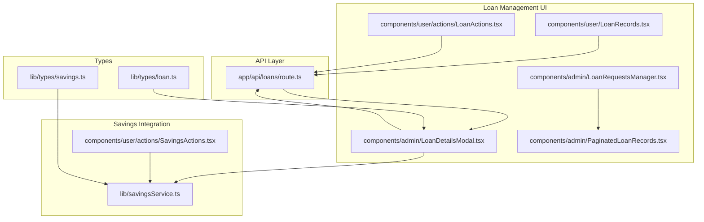
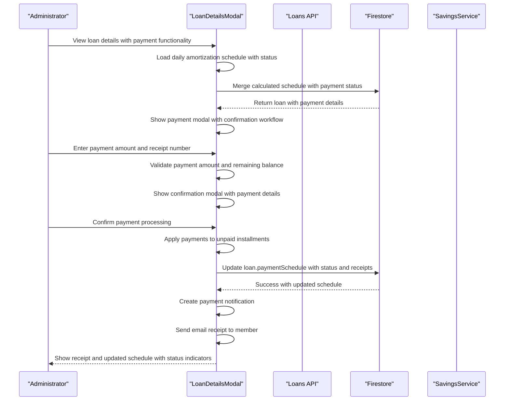
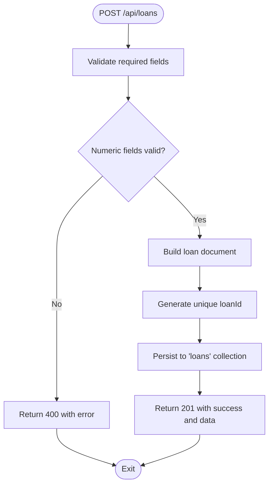
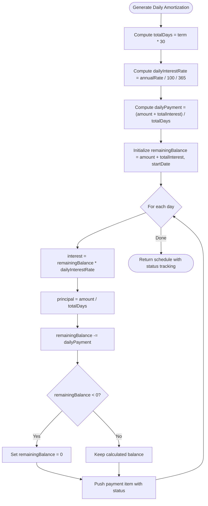
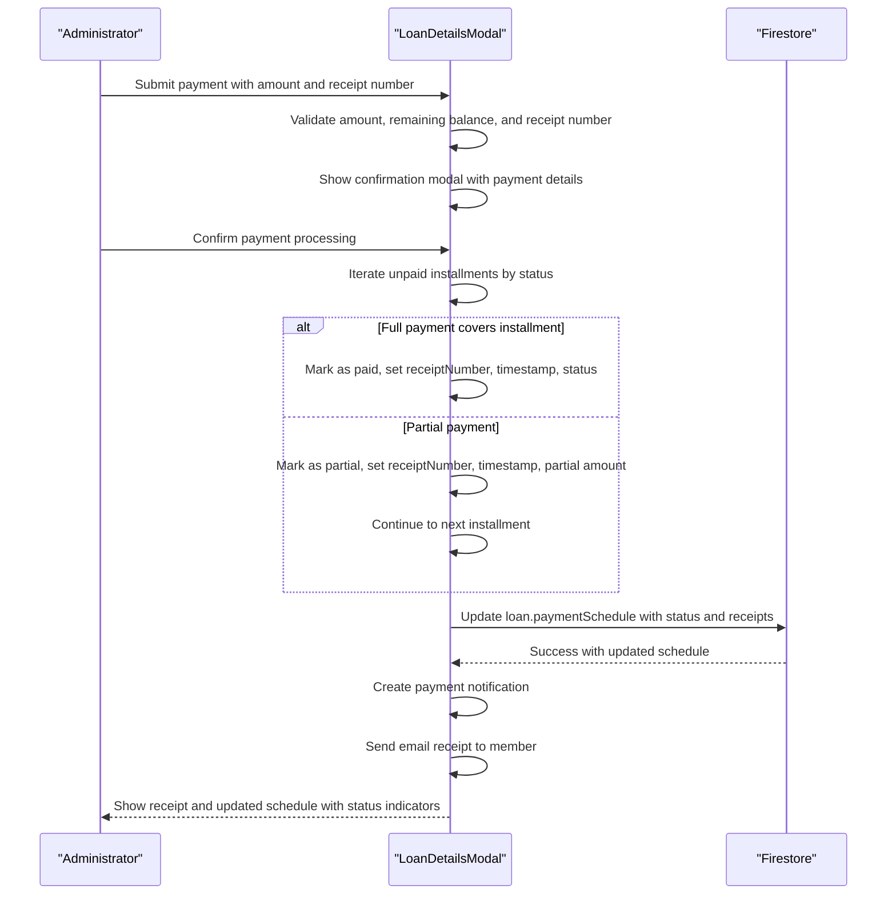
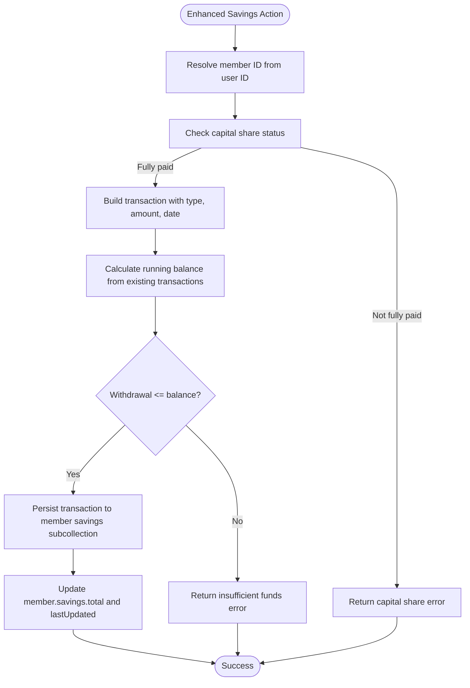
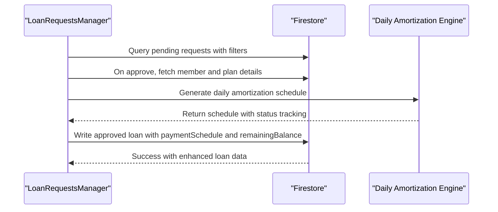
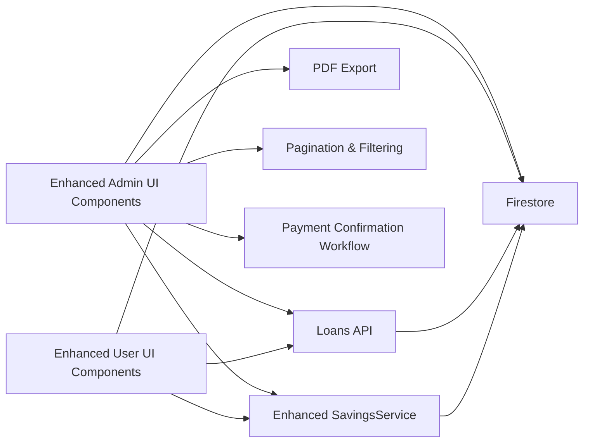

# Loan Repayment System

<cite>
**Referenced Files in This Document**
- [app/api/loans/route.ts](file://app/api/loans/route.ts)
- [components/admin/LoanDetailsModal.tsx](file://components/admin/LoanDetailsModal.tsx)
- [components/admin/PaginatedLoanRecords.tsx](file://components/admin/PaginatedLoanRecords.tsx)
- [components/admin/LoanRequestsManager.tsx](file://components/admin/LoanRequestsManager.tsx)
- [components/user/LoanRecords.tsx](file://components/user/LoanRecords.tsx)
- [components/user/actions/LoanActions.tsx](file://components/user/actions/LoanActions.tsx)
- [components/user/actions/SavingsActions.tsx](file://components/user/actions/SavingsActions.tsx)
- [lib/savingsService.ts](file://lib/savingsService.ts)
- [lib/types/loan.ts](file://lib/types/loan.ts)
- [lib/types/savings.ts](file://lib/types/savings.ts)
- [app/dashboard/page.tsx](file://app/dashboard/page.tsx)
- [app/driver/dashboard/page.tsx](file://app/driver/dashboard/page.tsx)
- [app/admin/dashboard/page.tsx](file://app/admin/dashboard/page.tsx)
- [app/admin/loans/records/page.tsx](file://app/admin/loans/records/page.tsx)
</cite>

## Update Summary
**Changes Made**
- Updated to reflect complete transformation from frontend payment processing to comprehensive admin-only payment system
- Enhanced UI with comprehensive payment confirmation workflows and administrative functionality
- Removed outdated statement about payment processing being handled separately
- Added detailed payment modal with confirmation workflow and administrative controls
- Implemented enhanced loan records with comprehensive filtering and search functionality
- Integrated payment processing directly into admin LoanDetailsModal with validation and status tracking

## Table of Contents
1. [Introduction](#introduction)
2. [Project Structure](#project-structure)
3. [Core Components](#core-components)
4. [Architecture Overview](#architecture-overview)
5. [Detailed Component Analysis](#detailed-component-analysis)
6. [Dependency Analysis](#dependency-analysis)
7. [Performance Considerations](#performance-considerations)
8. [Troubleshooting Guide](#troubleshooting-guide)
9. [Conclusion](#conclusion)

## Introduction
This document describes the loan repayment system within the SAMPA Cooperative Management System. The system has undergone a complete transformation to support daily amortization calculations, comprehensive payment tracking with status indicators, and enhanced administrative payment processing capabilities. The system now features a centralized admin-only payment system with comprehensive payment confirmation workflows, detailed status tracking for both admin and user interfaces, and enhanced user experiences with pagination and PDF export capabilities.

## Project Structure
The loan repayment system spans API routes, administrative and user-facing components, and supporting services:
- API layer: loan creation and retrieval endpoints with basic validation
- Business logic: daily amortization schedule generation and payment application
- Data types: loan and savings interfaces with enhanced status tracking
- Integrations: savings service for member balances and transactions
- UI surfaces: loan details with PDF export, paginated loan records, and comprehensive payment workflows

**Diagram sources**
- [app/api/loans/route.ts:1-133](file://app/api/loans/route.ts#L1-L133)
- [components/admin/LoanDetailsModal.tsx:46-359](file://components/admin/LoanDetailsModal.tsx#L46-L359)
- [components/admin/LoanRequestsManager.tsx:64-200](file://components/admin/LoanRequestsManager.tsx#L64-L200)
- [components/admin/PaginatedLoanRecords.tsx:29-454](file://components/admin/PaginatedLoanRecords.tsx#L29-L454)
- [components/user/LoanRecords.tsx:30-441](file://components/user/LoanRecords.tsx#L30-L441)
- [components/user/actions/LoanActions.tsx:39-73](file://components/user/actions/LoanActions.tsx#L39-L73)
- [components/user/actions/SavingsActions.tsx:1-45](file://components/user/actions/SavingsActions.tsx#L1-L45)
- [lib/savingsService.ts:237-342](file://lib/savingsService.ts#L237-L342)
- [lib/types/loan.ts:1-20](file://lib/types/loan.ts#L1-L20)
- [lib/types/savings.ts:1-22](file://lib/types/savings.ts#L1-L22)

**Section sources**
- [app/api/loans/route.ts:1-133](file://app/api/loans/route.ts#L1-L133)
- [components/admin/LoanDetailsModal.tsx:46-359](file://components/admin/LoanDetailsModal.tsx#L46-L359)
- [components/admin/PaginatedLoanRecords.tsx:29-454](file://components/admin/PaginatedLoanRecords.tsx#L29-L454)
- [components/admin/LoanRequestsManager.tsx:64-200](file://components/admin/LoanRequestsManager.tsx#L64-L200)
- [components/user/LoanRecords.tsx:30-441](file://components/user/LoanRecords.tsx#L30-L441)
- [components/user/actions/LoanActions.tsx:39-73](file://components/user/actions/LoanActions.tsx#L39-L73)
- [components/user/actions/SavingsActions.tsx:1-45](file://components/user/actions/SavingsActions.tsx#L1-L45)
- [lib/savingsService.ts:237-342](file://lib/savingsService.ts#L237-L342)
- [lib/types/loan.ts:1-20](file://lib/types/loan.ts#L1-L20)
- [lib/types/savings.ts:1-22](file://lib/types/savings.ts#L1-L22)

## Core Components
- **Loan API**: Creates and retrieves loan records with basic validation and minimal CRUD operations
- **Daily Amortization Engine**: Generates comprehensive daily schedules with detailed payment tracking
- **Enhanced Payment Application**: Admin-only payment processing with comprehensive confirmation workflows and status indicators
- **Savings Integration**: Validates member identity, calculates balances, and persists transactions atomically
- **Advanced UI Surfaces**: Loan details with PDF export, paginated loan records with filtering, and comprehensive payment workflows

**Updated** The system now features complete daily amortization calculations with comprehensive status tracking, enhanced UI with pagination controls, and PDF export capabilities for loan schedules. Payment processing is now exclusively handled by administrators through a comprehensive payment confirmation workflow with validation and receipt management.

Key capabilities:
- Principal and interest distribution per daily payment with detailed tracking
- Remaining balance enforcement and payoff detection
- Comprehensive receipt numbering and payment notifications
- Savings-backed payment deduction workflow with enhanced validation
- Advanced filtering and search capabilities for loan records
- PDF export functionality for loan schedules
- Administrative payment confirmation with validation and status updates

**Section sources**
- [app/api/loans/route.ts:41-112](file://app/api/loans/route.ts#L41-L112)
- [components/admin/LoanDetailsModal.tsx:96-138](file://components/admin/LoanDetailsModal.tsx#L96-L138)
- [components/admin/PaginatedLoanRecords.tsx:159-243](file://components/admin/PaginatedLoanRecords.tsx#L159-L243)
- [components/user/LoanRecords.tsx:91-142](file://components/user/LoanRecords.tsx#L91-L142)
- [lib/savingsService.ts:285-342](file://lib/savingsService.ts#L285-L342)

## Architecture Overview
The repayment system follows a layered architecture with enhanced administrative capabilities:
- **Presentation layer**: React components for admin and user views with pagination and PDF export
- **Application layer**: LoanDetailsModal orchestrates payment application and schedule updates with comprehensive status tracking and administrative controls
- **Domain layer**: Daily amortization calculation and payment allocation logic with comprehensive validation
- **Persistence layer**: Firestore collections for loans, loanRequests, members, and savings subcollections
- **Integration layer**: Savings service coordinates member identification and transaction persistence

**Diagram sources**
- [components/admin/LoanDetailsModal.tsx:58-94](file://components/admin/LoanDetailsModal.tsx#L58-L94)
- [components/admin/LoanDetailsModal.tsx:156-202](file://components/admin/LoanDetailsModal.tsx#L156-L202)
- [components/admin/LoanDetailsModal.tsx:354-519](file://components/admin/LoanDetailsModal.tsx#L354-L519)
- [app/api/loans/route.ts:41-112](file://app/api/loans/route.ts#L41-L112)
- [lib/savingsService.ts:285-342](file://lib/savingsService.ts#L285-L342)

## Detailed Component Analysis

### Loan API
- **Purpose**: Create and list loans with minimal validation and basic CRUD operations
- **Validation**: Requires memberId, amount, interestRate, term, startDate; numeric checks enforced
- **Output**: Unique loanId and created loan data on successful creation

**Diagram sources**
- [app/api/loans/route.ts:41-112](file://app/api/loans/route.ts#L41-L112)

**Section sources**
- [app/api/loans/route.ts:41-112](file://app/api/loans/route.ts#L41-L112)

### Enhanced Daily Amortization Engine
- **Daily schedule generation**: Converts term to days (30-day months), computes daily interest and principal components
- **Principal and interest split**: Interest computed on remaining balance; principal equals fixed daily payment until payoff
- **Remaining balance enforcement**: Caps at zero to prevent negative balances
- **Status tracking**: Comprehensive payment status indicators (paid, partial, pending)
- **Receipt integration**: Merges payment status with receipt numbers and processed timestamps

**Updated** The system now uses daily calculation formulas with enhanced status tracking and comprehensive payment indicators. Payment processing is now exclusively handled by administrators through a comprehensive workflow with validation and confirmation.

**Diagram sources**
- [components/admin/LoanDetailsModal.tsx:96-138](file://components/admin/LoanDetailsModal.tsx#L96-L138)
- [components/user/LoanRecords.tsx:91-142](file://components/user/LoanRecords.tsx#L91-L142)

**Section sources**
- [components/admin/LoanDetailsModal.tsx:96-138](file://components/admin/LoanDetailsModal.tsx#L96-L138)
- [components/user/LoanRecords.tsx:91-142](file://components/user/LoanRecords.tsx#L91-L142)

### Enhanced Payment Application Workflow
- **Administrative validation**: Ensures payment amount is a positive number with comprehensive error handling and remaining balance validation
- **Allocation**: Applies payments to unpaid installments in order until amount exhausted or partial payment occurs
- **Status updates**: Marks installments as paid, partial, or pending with receipt number and processed timestamp
- **Persistence**: Updates loan document with modified schedule and recalculated remaining balance
- **Status tracking**: Comprehensive payment status indicators with detailed tracking
- **Confirmation workflow**: Multi-step payment process with validation, confirmation, and processing stages

**Updated** Payment processing is now exclusively handled by administrators through a comprehensive payment confirmation workflow with validation, receipt management, and status tracking. The frontend user interface no longer processes payments directly.

**Diagram sources**
- [components/admin/LoanDetailsModal.tsx:354-519](file://components/admin/LoanDetailsModal.tsx#L354-L519)

**Section sources**
- [components/admin/LoanDetailsModal.tsx:354-519](file://components/admin/LoanDetailsModal.tsx#L354-L519)

### Enhanced Savings Integration for Automatic Deductions
- **Member identification**: Resolves user ID to member ID via multiple strategies (userId field, email, name)
- **Transaction processing**: Adds savings transactions with running balance calculation and validation against insufficient funds
- **Aggregate updates**: Maintains member savings totals and last updated timestamps
- **UI integration**: SavingsActions component enables deposits and withdrawals; dashboard displays current balance
- **Enhanced validation**: Comprehensive capital share status checking before processing transactions

**Updated** Savings integration now includes enhanced capital share validation and improved transaction processing with better error handling. Payment processing through savings accounts is now integrated with the administrative payment workflow.

**Diagram sources**
- [lib/savingsService.ts:285-342](file://lib/savingsService.ts#L285-L342)
- [lib/savingsService.ts:240-280](file://lib/savingsService.ts#L240-L280)

**Section sources**
- [lib/savingsService.ts:285-342](file://lib/savingsService.ts#L285-L342)
- [lib/savingsService.ts:240-280](file://lib/savingsService.ts#L240-L280)

### Enhanced Loan Requests and Approval to Disbursement
- **Request management**: Real-time listeners for pending/approved/rejected loan requests with comprehensive pagination support
- **Approval path**: On approval, generates daily amortization schedule and writes approved loan document with member details
- **Disbursement linkage**: While not explicitly shown in code, the approval workflow constructs the loan with paymentSchedule and remainingBalance for immediate repayment processing
- **Enhanced filtering**: Comprehensive column filtering for loan records with search functionality

**Updated** Loan request management now includes enhanced filtering capabilities and comprehensive pagination for better user experience. Payment processing is now integrated into the administrative workflow with comprehensive status tracking.

**Diagram sources**
- [components/admin/LoanRequestsManager.tsx:64-200](file://components/admin/LoanRequestsManager.tsx#L64-L200)
- [components/admin/PaginatedLoanRecords.tsx:159-243](file://components/admin/PaginatedLoanRecords.tsx#L159-L243)

**Section sources**
- [components/admin/LoanRequestsManager.tsx:64-200](file://components/admin/LoanRequestsManager.tsx#L64-L200)
- [components/admin/PaginatedLoanRecords.tsx:159-243](file://components/admin/PaginatedLoanRecords.tsx#L159-L243)

### Enhanced Data Types and Contracts
- **LoanPlan**: Defines loan product terms including interest rate and term options with enhanced validation
- **LoanRequest**: Captures application metadata and status with comprehensive tracking
- **SavingsTransaction**: Standardized savings record with type, amount, balance, and remarks
- **MemberSavings**: Aggregated savings summary for reporting with enhanced status tracking
- **Enhanced AmortizationSchedule**: Comprehensive payment tracking with status indicators and receipt management

**Updated** Data types now include enhanced status tracking and comprehensive payment indicators for better loan management. Payment-related fields are now integrated with the administrative workflow.

**Section sources**
- [lib/types/loan.ts:1-20](file://lib/types/loan.ts#L1-L20)
- [lib/types/savings.ts:1-22](file://lib/types/savings.ts#L1-L22)

## Dependency Analysis
- **UI components**: Depend on Firestore for real-time updates and manual persistence of payment changes with enhanced pagination
- **Amortization logic**: Shared across admin and user components with consistent daily calculation formulas
- **SavingsService**: Standalone module with enhanced validation and comprehensive transaction processing
- **Loan API**: Provides minimal CRUD for loans; repayment updates handled by admin components with status tracking
- **Enhanced UI**: Comprehensive pagination, filtering, and PDF export capabilities with administrative payment workflows

**Updated** Dependencies now include enhanced UI components with pagination, filtering, and PDF export capabilities. Payment processing is now centralized in administrative components with comprehensive validation and confirmation workflows.

**Diagram sources**
- [components/admin/LoanDetailsModal.tsx:46-359](file://components/admin/LoanDetailsModal.tsx#L46-L359)
- [components/admin/PaginatedLoanRecords.tsx:29-454](file://components/admin/PaginatedLoanRecords.tsx#L29-L454)
- [components/user/LoanRecords.tsx:30-441](file://components/user/LoanRecords.tsx#L30-L441)
- [lib/savingsService.ts:285-342](file://lib/savingsService.ts#L285-L342)
- [app/api/loans/route.ts:1-133](file://app/api/loans/route.ts#L1-L133)

**Section sources**
- [components/admin/LoanDetailsModal.tsx:46-359](file://components/admin/LoanDetailsModal.tsx#L46-L359)
- [components/admin/PaginatedLoanRecords.tsx:29-454](file://components/admin/PaginatedLoanRecords.tsx#L29-L454)
- [components/user/LoanRecords.tsx:30-441](file://components/user/LoanRecords.tsx#L30-L441)
- [lib/savingsService.ts:285-342](file://lib/savingsService.ts#L285-L342)
- [app/api/loans/route.ts:1-133](file://app/api/loans/route.ts#L1-L133)

## Performance Considerations
- **Amortization computation**: Linear in totalDays; acceptable for typical loan terms with enhanced daily calculation formulas
- **Real-time listeners**: Use pagination and efficient queries to minimize index overhead with comprehensive filtering
- **Batch updates**: Prefer single document updates for paymentSchedule and remainingBalance to reduce write conflicts
- **Savings transactions**: Atomic balance calculation prevents race conditions; enhanced validation ensures data integrity
- **PDF export**: Efficient jspdf implementation with autoTable for large datasets
- **Pagination**: Optimized rendering for large loan datasets with filtering capabilities
- **Payment validation**: Client-side validation reduces server load and improves user experience

**Updated** Performance considerations now include PDF export optimization, enhanced pagination, comprehensive filtering for better user experience, and client-side payment validation to improve performance and user experience.

## Troubleshooting Guide
Common issues and resolutions:
- **Payment amount validation failures**: Ensure amounts are positive numbers before submission with enhanced error handling
- **Insufficient funds in savings**: SavingsService returns insufficient funds errors with comprehensive validation; display user-friendly messages
- **Missing member records**: Member resolution attempts multiple strategies with enhanced fallback mechanisms; verify user.userId linkage and email/name fields
- **Firestore index errors**: Pending/Approved/Rejected queries require composite indexes; follow deployment instructions
- **PDF export failures**: Enhanced error handling for PDF generation; check browser compatibility and permissions
- **Pagination issues**: Comprehensive pagination state management; verify page size and filtering configurations
- **Payment confirmation failures**: Enhanced validation ensures payment amounts don't exceed remaining balance; check receipt number requirements
- **Admin payment processing errors**: Comprehensive error handling in payment confirmation workflow; verify payment amount and receipt number validity

**Updated** Troubleshooting guide now includes solutions for payment confirmation issues, administrative payment processing errors, and enhanced validation failures. The guide addresses the new admin-only payment system with comprehensive validation and confirmation workflows.

Operational tips:
- Use receipt numbers for audit trails; they are generated during payment confirmation with comprehensive tracking
- Monitor remainingBalance updates after payment application to detect payoff conditions with enhanced status indicators
- For overdue handling, implement periodic checks against paymentSchedule dates and status to trigger reminders or recovery workflows
- Utilize enhanced filtering and search capabilities for efficient loan record management
- Leverage PDF export functionality for comprehensive loan schedule documentation
- Admins should verify payment amounts against remaining balance before processing payments
- Use the payment confirmation workflow to ensure proper validation and receipt management

**Section sources**
- [components/admin/LoanDetailsModal.tsx:156-202](file://components/admin/LoanDetailsModal.tsx#L156-L202)
- [components/admin/PaginatedLoanRecords.tsx:159-243](file://components/admin/PaginatedLoanRecords.tsx#L159-L243)
- [lib/savingsService.ts:291-294](file://lib/savingsService.ts#L291-L294)
- [components/admin/LoanRequestsManager.tsx:10-27](file://components/admin/LoanRequestsManager.tsx#L10-L27)

## Conclusion
The SAMPA Cooperative Management System's loan repayment system has undergone a complete transformation to provide robust daily amortization, comprehensive payment tracking with status indicators, and seamless administrative payment processing. The modular design now includes enhanced UI components with pagination, filtering, and PDF export capabilities. The system supports centralized repayment scheduling with comprehensive admin functionality and maintains separation of concerns while providing detailed payment tracking and comprehensive loan management workflows.

The new admin-only payment system provides enhanced security and control over payment processing, with comprehensive validation, confirmation workflows, and detailed audit trails. The system maintains the previous data integrity and user experience guarantees while adding administrative controls and enhanced payment processing capabilities.

Future enhancements could include automated scheduled payments, advanced analytics for defaults and recoveries, integration with external payment processors, and enhanced mobile payment processing capabilities while maintaining the current enhanced data integrity and administrative oversight guarantees.