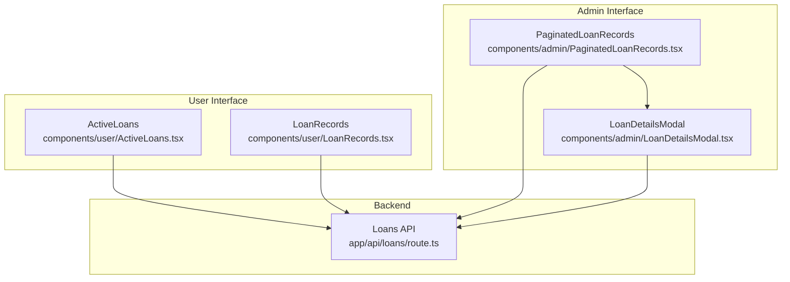
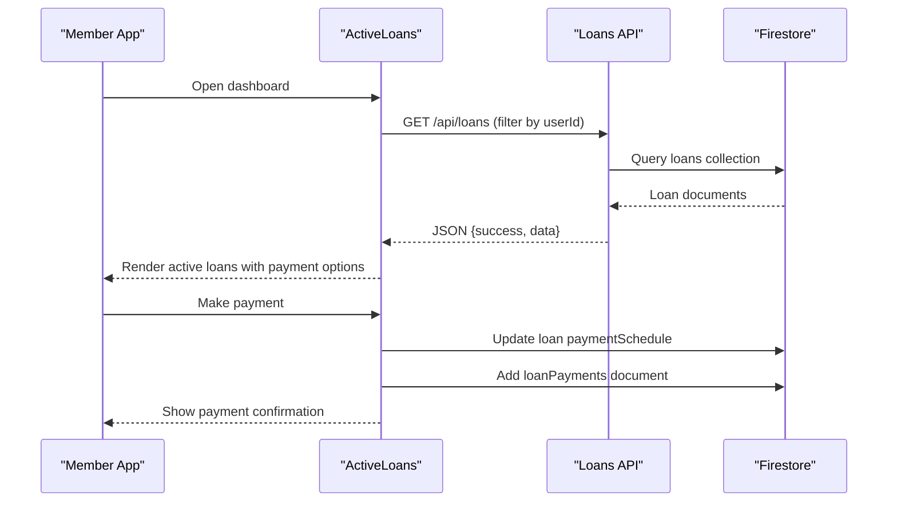
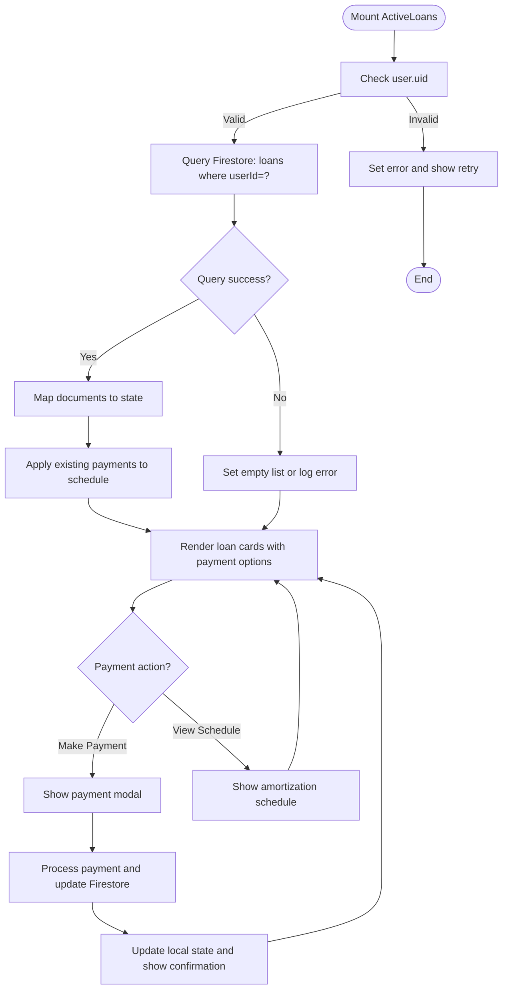
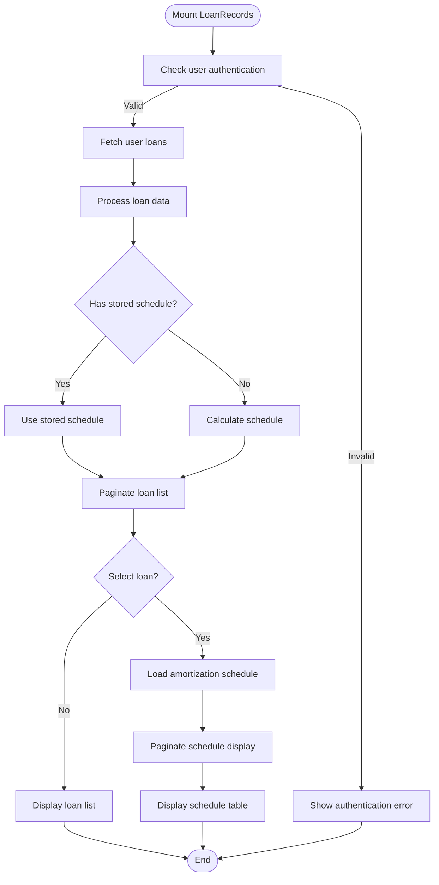
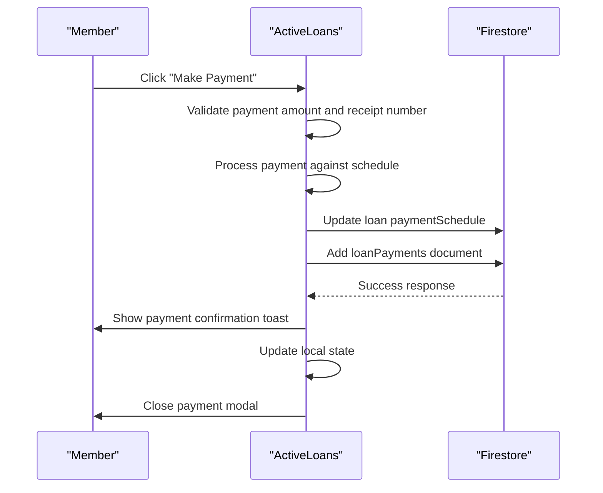
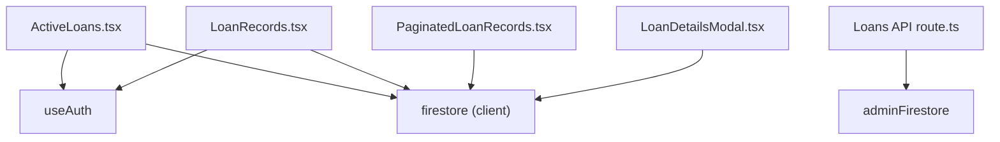

# Loan Tracking and Monitoring

<cite>
**Referenced Files in This Document**
- [ActiveLoans.tsx](file://components/user/ActiveLoans.tsx)
- [LoanRecords.tsx](file://components/user/LoanRecords.tsx)
- [LoanDetailsModal.tsx](file://components/admin/LoanDetailsModal.tsx)
- [PaginatedLoanRecords.tsx](file://components/admin/PaginatedLoanRecords.tsx)
- [route.ts](file://app/api/loans/route.ts)
</cite>

## Update Summary
**Changes Made**
- Updated ActiveLoans component documentation to reflect simplified payment processing with integrated payment modal
- Revised LoanRecords component to focus on essential amortization schedule presentation
- Removed detailed payment history and comprehensive member information sections
- Updated administrative components to reflect streamlined loan management interface
- Simplified architecture overview to emphasize core loan tracking functionality

## Table of Contents
1. [Introduction](#introduction)
2. [Project Structure](#project-structure)
3. [Core Components](#core-components)
4. [Architecture Overview](#architecture-overview)
5. [Detailed Component Analysis](#detailed-component-analysis)
6. [Dependency Analysis](#dependency-analysis)
7. [Performance Considerations](#performance-considerations)
8. [Troubleshooting Guide](#troubleshooting-guide)
9. [Conclusion](#conclusion)

## Introduction
This document provides comprehensive documentation for the loan tracking and monitoring systems within the SAMPA Cooperative Management Platform. The system has been simplified to focus on essential loan information and amortization schedule presentation, removing detailed payment history, comprehensive member information, and advanced administrative features.

The current implementation emphasizes three primary areas:
- ActiveLoans: displays current loan status, payment due dates, outstanding balances, and repayment progress with integrated payment processing for individual members.
- LoanRecords: maintains historical loan data and presents amortization schedules for personal records.
- LoanDetailsModal: provides administrative view of loan details with amortization schedule visualization and export capabilities.

**Updated** The system now focuses on streamlined loan tracking with essential payment processing capabilities and simplified administrative interfaces.

## Project Structure
The loan tracking and monitoring functionality spans user-facing components and administrative dashboards:
- User components:
  - ActiveLoans: member view of active loans with integrated payment processing and amortization schedules.
  - LoanRecords: member view of historical loan records with amortization schedule presentation.
- Administrative components:
  - PaginatedLoanRecords: admin view of all loans with basic filtering and drill-down details.
  - LoanDetailsModal: detailed loan view with amortization schedule visualization and export capabilities.

**Diagram sources**
- [ActiveLoans.tsx:1-998](file://components/user/ActiveLoans.tsx#L1-L998)
- [LoanRecords.tsx:1-441](file://components/user/LoanRecords.tsx#L1-L441)
- [PaginatedLoanRecords.tsx:1-454](file://components/admin/PaginatedLoanRecords.tsx#L1-L454)
- [LoanDetailsModal.tsx:1-561](file://components/admin/LoanDetailsModal.tsx#L1-L561)
- [route.ts:1-133](file://app/api/loans/route.ts#L1-L133)

**Section sources**
- [ActiveLoans.tsx:1-998](file://components/user/ActiveLoans.tsx#L1-L998)
- [LoanRecords.tsx:1-441](file://components/user/LoanRecords.tsx#L1-L441)
- [PaginatedLoanRecords.tsx:1-454](file://components/admin/PaginatedLoanRecords.tsx#L1-L454)
- [LoanDetailsModal.tsx:1-561](file://components/admin/LoanDetailsModal.tsx#L1-L561)
- [route.ts:1-133](file://app/api/loans/route.ts#L1-L133)

## Core Components
This section outlines the responsibilities and key features of each component involved in loan tracking and monitoring.

- ActiveLoans
  - Purpose: Display current active loans for the logged-in member, including loan details, monthly payment amounts, next payment date, and remaining payments with integrated payment processing.
  - Data source: Queries Firestore for loans linked to the authenticated user with active status.
  - Key features: Real-time loan monitoring, integrated payment modal, amortization schedule calculation, payment status tracking.
  - UI highlights: Currency and date formatting, loading states, error handling, payment processing workflow.

- LoanRecords
  - Purpose: Provide a historical view of all loans for the member with amortization schedule presentation.
  - Data source: Retrieves all loans associated with the user and calculates amortization schedules.
  - Key features: Dynamic amortization schedule calculation, pagination for schedule display, loan selection interface.
  - UI highlights: Interactive loan selection, schedule pagination, formatted currency display.

- PaginatedLoanRecords
  - Purpose: Admin dashboard for viewing all loans with basic filtering capabilities and drill-down to LoanDetailsModal.
  - Data source: Fetches all loans and enriches with user metadata for display.
  - Key features: Basic column filtering (amount, term, interest, status), search functionality, pagination.
  - UI highlights: Simple table interface, basic filtering controls, user information display.

- LoanDetailsModal
  - Purpose: Detailed view of a single loan with amortization schedule visualization and export capabilities.
  - Data source: Uses calculated amortization schedule with payment status merging from Firestore.
  - Key features: Complete schedule display, PDF export functionality, print capabilities, payment status tracking.
  - UI highlights: Comprehensive schedule table, export controls, payment information display.

- Loans API
  - Purpose: Backend endpoint to retrieve all loans and create new loan records.
  - Data source: Admin-initialized Firestore access.
  - Features: Validation of required fields, numeric checks, creation of unique loan identifiers, standardized JSON responses.

**Section sources**
- [ActiveLoans.tsx:1-998](file://components/user/ActiveLoans.tsx#L1-L998)
- [LoanRecords.tsx:1-441](file://components/user/LoanRecords.tsx#L1-L441)
- [PaginatedLoanRecords.tsx:1-454](file://components/admin/PaginatedLoanRecords.tsx#L1-L454)
- [LoanDetailsModal.tsx:1-561](file://components/admin/LoanDetailsModal.tsx#L1-L561)
- [route.ts:1-133](file://app/api/loans/route.ts#L1-L133)

## Architecture Overview
The loan tracking system follows a streamlined architecture focused on essential loan monitoring and payment processing:
- Frontend components consume Firestore via a unified data access layer abstraction.
- Integrated payment processing allows members to make payments directly from their active loan view.
- Administrative views provide loan details with export capabilities for documentation purposes.

**Diagram sources**
- [ActiveLoans.tsx:80-134](file://components/user/ActiveLoans.tsx#L80-L134)
- [route.ts:4-39](file://app/api/loans/route.ts#L4-L39)

**Section sources**
- [ActiveLoans.tsx:1-998](file://components/user/ActiveLoans.tsx#L1-L998)
- [route.ts:1-133](file://app/api/loans/route.ts#L1-L133)

## Detailed Component Analysis

### ActiveLoans Component
ActiveLoans retrieves and renders the current active loans for the authenticated user with integrated payment processing capabilities. The component now includes comprehensive payment functionality within the same interface.

Key behaviors:
- Authentication and Firestore initialization checks.
- Query for loans where userId matches the current user with active or approved status.
- Integrated payment modal for processing payments directly from the loan view.
- Amortization schedule calculation and payment status merging.
- Real-time loan status updates and payment confirmation.

**Diagram sources**
- [ActiveLoans.tsx:80-134](file://components/user/ActiveLoans.tsx#L80-L134)
- [ActiveLoans.tsx:327-437](file://components/user/ActiveLoans.tsx#L327-L437)

**Section sources**
- [ActiveLoans.tsx:1-998](file://components/user/ActiveLoans.tsx#L1-L998)

### LoanRecords Component
LoanRecords provides a historical view of all loans for the member with essential amortization schedule presentation. The component focuses on displaying loan information and schedule details without advanced administrative features.

Key behaviors:
- Retrieve all loans for the user with proper authentication validation.
- Calculate amortization schedule if not present in the document.
- Present loan information in a paginated table format.
- Display amortization schedule with pagination for better user experience.

**Diagram sources**
- [LoanRecords.tsx:46-89](file://components/user/LoanRecords.tsx#L46-L89)
- [LoanRecords.tsx:144-174](file://components/user/LoanRecords.tsx#L144-L174)

**Section sources**
- [LoanRecords.tsx:1-441](file://components/user/LoanRecords.tsx#L1-L441)

### Payment Processing Integration
The ActiveLoans component now includes comprehensive payment processing capabilities, allowing members to make payments directly from their loan view. This represents a significant enhancement over previous versions.

Key payment processing features:
- Integrated payment modal within loan details view.
- Automatic payment application to amortization schedule.
- Real-time payment status updates and confirmation.
- Transaction logging in separate loanPayments collection.
- Support for partial payments and automatic status updates.

**Diagram sources**
- [ActiveLoans.tsx:327-437](file://components/user/ActiveLoans.tsx#L327-L437)

**Section sources**
- [ActiveLoans.tsx:327-437](file://components/user/ActiveLoans.tsx#L327-L437)

### Administrative Loan Details
The LoanDetailsModal provides comprehensive loan information for administrative purposes with export capabilities. The component focuses on presenting loan details and amortization schedules without advanced payment processing features.

Key administrative features:
- Complete loan information display with user details.
- Comprehensive amortization schedule visualization.
- PDF export functionality for documentation purposes.
- Print capabilities for physical documentation.
- Payment status tracking and remaining balance calculation.

**Section sources**
- [LoanDetailsModal.tsx:1-561](file://components/admin/LoanDetailsModal.tsx#L1-L561)

### Loan Status Indicators
Loan status indicators are rendered as colored badges with simplified status representation:
- Active: green badge for active loans.
- Approved: blue badge for approved loans awaiting disbursement.
- Completed: blue badge for fully paid loans.
- Default: gray badge for other statuses.

**Section sources**
- [ActiveLoans.tsx:275-286](file://components/user/ActiveLoans.tsx#L275-L286)
- [LoanRecords.tsx:298-307](file://components/user/LoanRecords.tsx#L298-L307)

## Dependency Analysis
The components depend on shared infrastructure and data access abstractions with streamlined dependencies:
- Authentication: useAuth hook supplies the current user context.
- Firestore: centralized data access via a Firestore abstraction layer.
- UI libraries: react-hot-toast for notifications, jspdf/jspdf-autotable for PDF generation.

**Diagram sources**
- [ActiveLoans.tsx:3-7](file://components/user/ActiveLoans.tsx#L3-L7)
- [LoanRecords.tsx:3-6](file://components/user/LoanRecords.tsx#L3-L6)
- [PaginatedLoanRecords.tsx:3-7](file://components/admin/PaginatedLoanRecords.tsx#L3-L7)
- [LoanDetailsModal.tsx:3-8](file://components/admin/LoanDetailsModal.tsx#L3-L8)
- [route.ts](file://app/api/loans/route.ts#L1)

**Section sources**
- [ActiveLoans.tsx:1-998](file://components/user/ActiveLoans.tsx#L1-L998)
- [LoanRecords.tsx:1-441](file://components/user/LoanRecords.tsx#L1-L441)
- [PaginatedLoanRecords.tsx:1-454](file://components/admin/PaginatedLoanRecords.tsx#L1-L454)
- [LoanDetailsModal.tsx:1-561](file://components/admin/LoanDetailsModal.tsx#L1-L561)
- [route.ts:1-133](file://app/api/loans/route.ts#L1-L133)

## Performance Considerations
- Query optimization: Ensure Firestore indexes exist for frequent queries (e.g., loans by userId).
- Pagination: Use server-side pagination for large datasets to reduce payload sizes.
- Client-side caching: Cache amortization schedules locally to avoid repeated calculations.
- Batch operations: Group Firestore writes for payment updates to minimize network overhead.
- Lazy loading: Load amortization schedules only when a loan is selected to improve initial render performance.
- Payment processing: Implement optimistic updates for payment processing to improve user experience.

## Troubleshooting Guide
Common issues and resolutions:
- Authentication errors: Verify that the user is authenticated and has a valid uid before querying loans.
- Firestore initialization failures: Confirm that the Firestore client is initialized before performing queries.
- Empty or missing data: Handle cases where no loans are found gracefully and provide retry mechanisms.
- Payment processing errors: Validate payment amounts, ensure sufficient unpaid installments, and handle partial payments correctly.
- Schedule calculation errors: Verify loan data integrity and recalculate schedules when necessary.
- PDF export failures: Check that a schedule exists and that required libraries are loaded.

**Section sources**
- [ActiveLoans.tsx:80-134](file://components/user/ActiveLoans.tsx#L80-L134)
- [LoanRecords.tsx:52-89](file://components/user/LoanRecords.tsx#L52-L89)
- [ActiveLoans.tsx:327-437](file://components/user/ActiveLoans.tsx#L327-L437)

## Conclusion
The SAMPA Cooperative Management Platform includes streamlined user-facing components for active loan monitoring and historical records, along with administrative interfaces for loan details and documentation. The system has been simplified to focus on essential loan tracking functionality with integrated payment processing capabilities.

The current architecture provides:
- Real-time loan monitoring with integrated payment processing
- Comprehensive amortization schedule presentation
- Administrative loan details with export capabilities
- Streamlined data access patterns and UI components

While advanced features like detailed payment history, comprehensive member information, and automated reminders are not implemented, the existing architecture provides clear pathways for future enhancements while maintaining simplicity and performance focus.