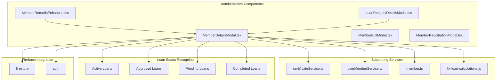
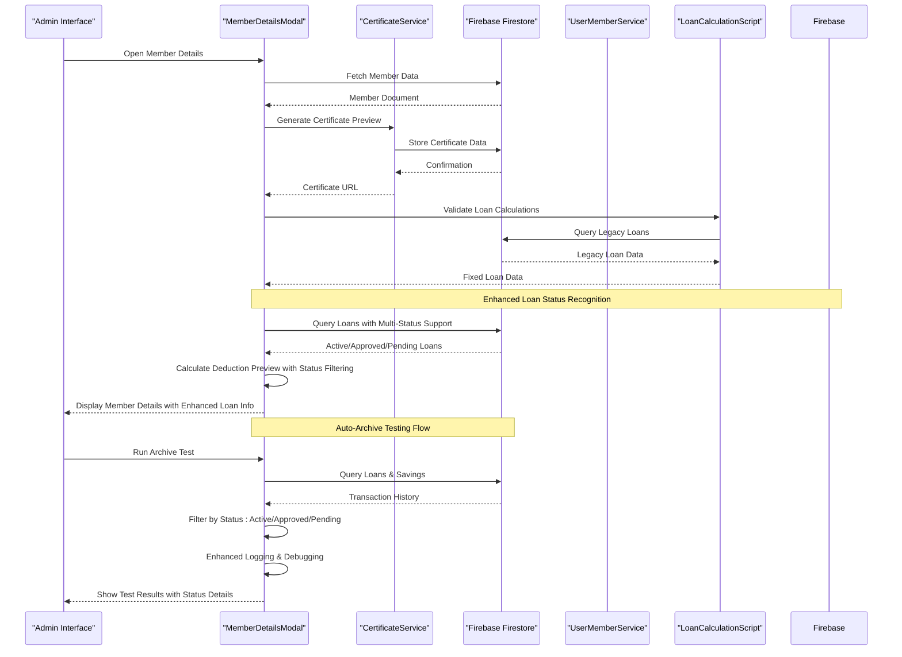
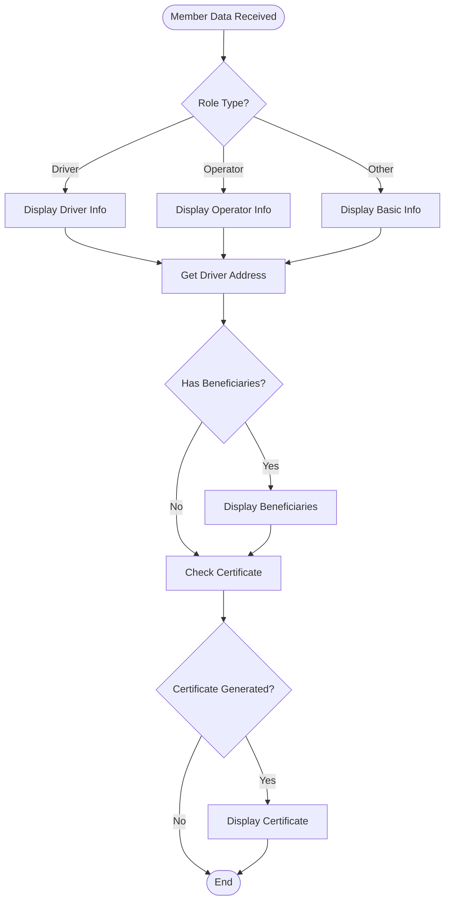
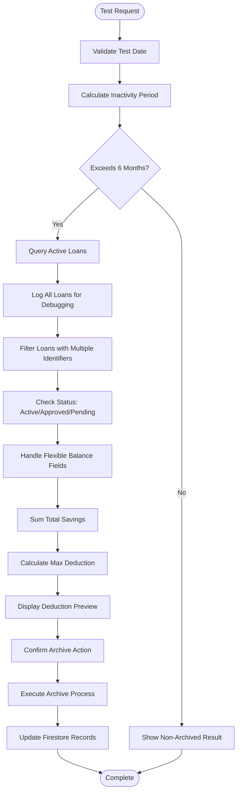
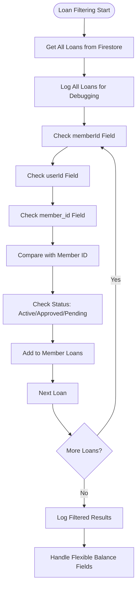
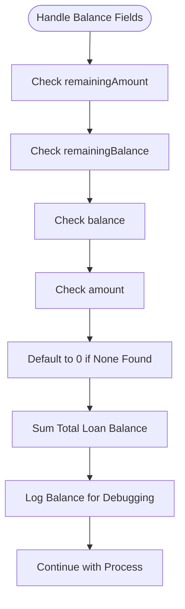
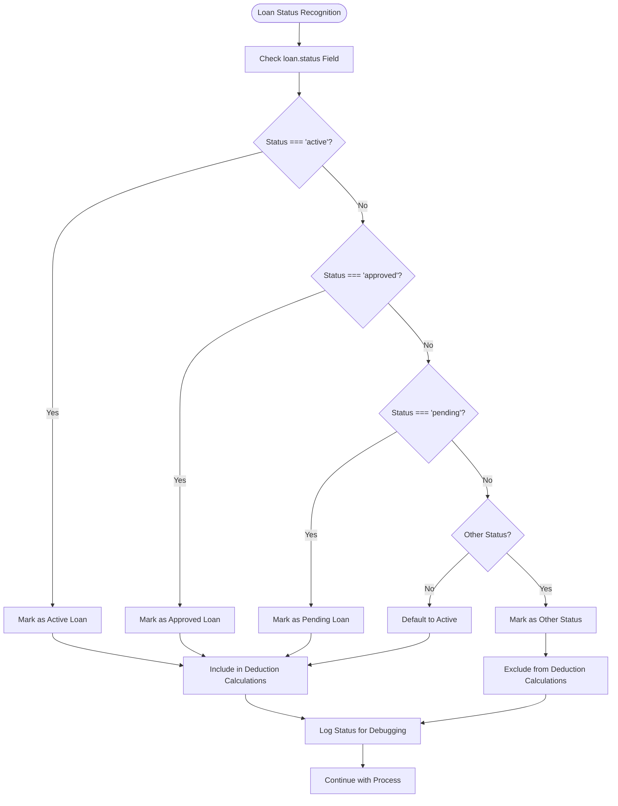
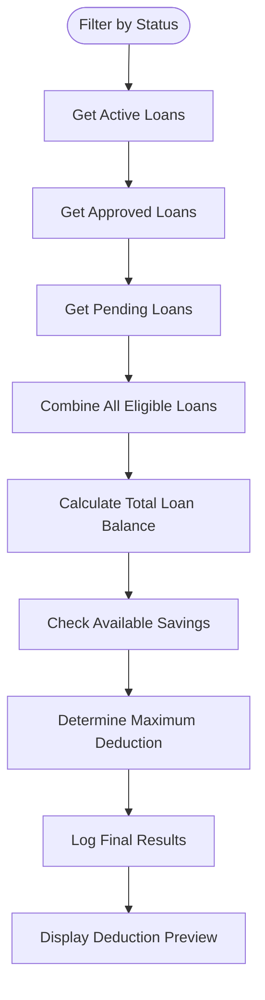

# Member Details Modal

<cite>
**Referenced Files in This Document**
- [MemberDetailsModal.tsx](file://components/admin/MemberDetailsModal.tsx)
- [MemberRecordsEnhanced.tsx](file://components/admin/MemberRecordsEnhanced.tsx)
- [member.ts](file://lib/types/member.ts)
- [certificateService.ts](file://lib/certificateService.ts)
- [userMemberService.ts](file://lib/userMemberService.ts)
- [index.ts](file://components/admin/index.ts)
- [fix-loan-calculations.js](file://scripts/fix-loan-calculations.js)
- [bod/home/page.tsx](file://app/admin/bod/home/page.tsx)
- [loan/page.tsx](file://app/loan/page.tsx)
- [LoanRequestDetailsModal.tsx](file://components/admin/LoanRequestDetailsModal.tsx)
</cite>

## Update Summary
**Changes Made**
- Enhanced loan status recognition system now includes 'approved' and 'pending' loan statuses in addition to 'active'
- Improved loan identification logic with multiple fallback fields (memberId, userId, member_id)
- Enhanced debugging capabilities for loan calculation processes
- Updated loan filtering logic to recognize multiple status types for archival decisions
- Improved loan deduction preview system with comprehensive status handling

## Table of Contents
1. [Introduction](#introduction)
2. [Project Structure](#project-structure)
3. [Core Components](#core-components)
4. [Architecture Overview](#architecture-overview)
5. [Detailed Component Analysis](#detailed-component-analysis)
6. [Enhanced Loan Management System](#enhanced-loan-management-system)
7. [Loan Status Recognition Enhancement](#loan-status-recognition-enhancement)
8. [Dependency Analysis](#dependency-analysis)
9. [Performance Considerations](#performance-considerations)
10. [Troubleshooting Guide](#troubleshooting-guide)
11. [Conclusion](#conclusion)

## Introduction

The Member Details Modal is a comprehensive administrative component designed to display detailed information about cooperative members in the SAMPA Transport Service Cooperative system. This modal serves as a centralized interface for viewing member profiles, managing share certificates, and performing automated account archival procedures.

The component integrates with Firebase Firestore for real-time data synchronization and provides advanced features including auto-archive testing, loan deduction previews, and certificate generation capabilities. It operates as part of the administrative dashboard ecosystem, providing essential member management functionality for cooperative staff.

**Updated** Enhanced with improved loan status recognition system that now includes 'approved' and 'pending' loan statuses, comprehensive debugging capabilities, and flexible identifier field support for robust member management operations.

## Project Structure

The Member Details Modal is organized within the administrative components structure, alongside related member management tools:



**Diagram sources**
- [MemberDetailsModal.tsx:1-800](file://components/admin/MemberDetailsModal.tsx#L1-L800)
- [MemberRecordsEnhanced.tsx:1-1042](file://components/admin/MemberRecordsEnhanced.tsx#L1-L1042)
- [LoanRequestDetailsModal.tsx:1-393](file://components/admin/LoanRequestDetailsModal.tsx#L1-L393)
- [fix-loan-calculations.js:1-140](file://scripts/fix-loan-calculations.js#L1-L140)

**Section sources**
- [MemberDetailsModal.tsx:1-800](file://components/admin/MemberDetailsModal.tsx#L1-L800)
- [index.ts:1-16](file://components/admin/index.ts#L1-L16)

## Core Components

The Member Details Modal consists of several interconnected components that work together to provide comprehensive member management functionality:

### Primary Modal Component
The main modal component handles the display and interaction logic for member details, including:
- Personal and contact information display
- Role-specific data presentation
- Beneficiary information management
- Share certificate visualization
- Auto-archive testing functionality with enhanced debugging

### Enhanced Loan Management System
The component now features sophisticated loan management capabilities:
- Flexible loan filtering with multiple identifier field support
- Comprehensive balance field handling across different loan data structures
- Enhanced debugging and logging for loan calculation processes
- Auto-deduction preview with detailed loan breakdown
- Multi-status loan recognition (active, approved, pending)

### Supporting Services
The component integrates with several backend services:
- **Certificate Service**: Handles PDF certificate generation and storage
- **User-Member Service**: Manages user-account and member-profile synchronization
- **Firebase Integration**: Provides real-time database connectivity and authentication
- **Loan Calculation Script**: Legacy loan data correction and validation

### Data Types and Interfaces
The component utilizes strongly-typed interfaces for data consistency:
- Member interface with comprehensive property definitions
- Driver and Operator information structures
- Certificate data schemas
- Archival and restoration metadata
- Enhanced loan data structures with flexible field support

**Section sources**
- [MemberDetailsModal.tsx:8-16](file://components/admin/MemberDetailsModal.tsx#L8-L16)
- [member.ts:36-68](file://lib/types/member.ts#L36-L68)

## Architecture Overview

The Member Details Modal follows a modular architecture pattern with clear separation of concerns:



**Diagram sources**
- [MemberDetailsModal.tsx:454-775](file://components/admin/MemberDetailsModal.tsx#L454-L775)
- [certificateService.ts:12-294](file://lib/certificateService.ts#L12-L294)
- [fix-loan-calculations.js:20-140](file://scripts/fix-loan-calculations.js#L20-L140)

The architecture emphasizes:
- **Enhanced Debugging**: Comprehensive logging throughout loan calculation and filtering processes
- **Flexible Data Handling**: Support for multiple identifier and balance field variations
- **Multi-Status Loan Recognition**: Recognition of active, approved, and pending loan statuses
- **Legacy Data Integration**: Seamless integration with corrected loan calculation data
- **Real-time Integration**: Direct Firebase Firestore connectivity for live data updates
- **Modular Design**: Independent services that can be tested and maintained separately
- **Type Safety**: Strong typing throughout the component hierarchy

## Detailed Component Analysis

### MemberDetailsModal Component

The primary modal component implements a comprehensive member information display system with advanced administrative features:

#### State Management
The component maintains extensive state for various operational modes:
- **Basic Display State**: Controls modal visibility and client-side rendering
- **Certificate Management**: Handles certificate preview and generation toggles
- **Auto-Archive Testing**: Manages test scenarios and simulation results with enhanced debugging
- **Deduction Processing**: Tracks loan deduction amounts and validation with flexible balance field support

#### Enhanced Data Presentation Logic
The component implements sophisticated data formatting and display logic with comprehensive debugging:



**Diagram sources**
- [MemberDetailsModal.tsx:91-109](file://components/admin/MemberDetailsModal.tsx#L91-L109)
- [MemberDetailsModal.tsx:224-284](file://components/admin/MemberDetailsModal.tsx#L224-L284)

#### Enhanced Currency and Number Formatting
The component includes robust formatting utilities for financial data:
- **Currency Input Validation**: Real-time formatting with decimal precision control
- **Number Display Formatting**: Comma-separated thousands with locale-aware formatting
- **Loan Amount Calculation**: Automatic deduction preview based on flexible balance field handling

#### Enhanced Auto-Archive Testing System
The modal implements a sophisticated testing framework for account archival with comprehensive debugging:



**Diagram sources**
- [MemberDetailsModal.tsx:494-587](file://components/admin/MemberDetailsModal.tsx#L494-L587)
- [MemberDetailsModal.tsx:692-757](file://components/admin/MemberDetailsModal.tsx#L692-L757)

**Section sources**
- [MemberDetailsModal.tsx:17-84](file://components/admin/MemberDetailsModal.tsx#L17-L84)
- [MemberDetailsModal.tsx:287-452](file://components/admin/MemberDetailsModal.tsx#L287-L452)

### Enhanced Certificate Management System

The modal integrates with the certificate generation service to provide comprehensive share certificate functionality:

#### Certificate Display
The component renders share certificates with:
- **Visual Layout**: Professional certificate template with cooperative branding
- **Dynamic Content**: Member-specific information overlay
- **Metadata Display**: Certificate details summary panel

#### Certificate Generation Integration
The modal coordinates with the certificate service for:
- **Data Validation**: Ensures all required certificate fields are present
- **PDF Generation**: Creates professional share certificate documents
- **Storage Management**: Stores certificate data in Firestore with metadata

**Section sources**
- [MemberDetailsModal.tsx:287-452](file://components/admin/MemberDetailsModal.tsx#L287-L452)
- [certificateService.ts:12-294](file://lib/certificateService.ts#L12-L294)

### Enhanced User-Member Service Integration

The modal leverages the user-member service for:
- **Data Consistency**: Ensures user and member records remain synchronized
- **Cross-collection Operations**: Enables seamless data operations across collections
- **Validation Logic**: Maintains data integrity through service-layer validation

**Section sources**
- [userMemberService.ts:23-94](file://lib/userMemberService.ts#L23-L94)
- [MemberDetailsModal.tsx:86-89](file://components/admin/MemberDetailsModal.tsx#L86-L89)

## Enhanced Loan Management System

### Flexible Identifier Field Support

The enhanced loan filtering system now supports multiple identifier fields to ensure compatibility with different data structures:



**Diagram sources**
- [MemberDetailsModal.tsx:523-542](file://components/admin/MemberDetailsModal.tsx#L523-L542)

### Comprehensive Balance Field Handling

The system now implements flexible balance field handling to accommodate different loan data structures:



**Diagram sources**
- [MemberDetailsModal.tsx:547-553](file://components/admin/MemberDetailsModal.tsx#L547-L553)

### Enhanced Debugging and Logging

The system includes comprehensive logging statements throughout the loan calculation process:

- **Loan Query Logging**: Detailed logging of all loan data retrieval operations
- **Identifier Field Logging**: Specific logging of which identifier fields are found and used
- **Status Field Logging**: Comprehensive logging of loan status recognition (active, approved, pending)
- **Balance Field Logging**: Comprehensive logging of balance field detection and handling
- **Calculation Logging**: Step-by-step logging of loan deduction calculations

**Section sources**
- [MemberDetailsModal.tsx:524-552](file://components/admin/MemberDetailsModal.tsx#L524-L552)
- [fix-loan-calculations.js:80-124](file://scripts/fix-loan-calculations.js#L80-L124)

## Loan Status Recognition Enhancement

### Multi-Status Loan Recognition System

The enhanced loan status recognition system now comprehensively handles multiple loan statuses beyond just 'active':



**Diagram sources**
- [MemberDetailsModal.tsx:536-542](file://components/admin/MemberDetailsModal.tsx#L536-L542)
- [bod/home/page.tsx:95-98](file://app/admin/bod/home/page.tsx#L95-L98)
- [bod/home/page.tsx:173](file://app/admin/bod/home/page.tsx#L173)
- [loan/page.tsx:743-749](file://app/loan/page.tsx#L743-L749)

### Enhanced Loan Deduction Logic

The loan deduction system now properly recognizes and processes loans with different statuses:

- **Active Loans**: Fully recognized for deduction calculations
- **Approved Loans**: Recognized as eligible for deduction (treated similarly to active)
- **Pending Loans**: Recognized as potentially eligible for deduction (treated cautiously)
- **Completed/Rejected Loans**: Excluded from deduction calculations

### Status-Based Loan Filtering

The system implements sophisticated filtering logic based on loan status:



**Diagram sources**
- [MemberDetailsModal.tsx:522-580](file://components/admin/MemberDetailsModal.tsx#L522-L580)

**Section sources**
- [MemberDetailsModal.tsx:536-542](file://components/admin/MemberDetailsModal.tsx#L536-L542)
- [bod/home/page.tsx:95-98](file://app/admin/bod/home/page.tsx#L95-L98)
- [bod/home/page.tsx:173](file://app/admin/bod/home/page.tsx#L173)
- [loan/page.tsx:743-749](file://app/loan/page.tsx#L743-L749)

## Dependency Analysis

The Member Details Modal has several key dependencies that impact its functionality and performance:

```mermaid
graph LR
subgraph "External Dependencies"
REACT[React 18+]
FIREBASE[Firebase SDK]
JSPDF[jsPDF]
TOAST[React Hot Toast]
NODE[Node.js Runtime]
END
subgraph "Internal Dependencies"
TYPES[Member Types]
SERVICE[Certificate Service]
UTILS[Utility Functions]
SCRIPTS[Loan Calculation Scripts]
STATUS[Loan Status Recognition]
end
subgraph "Component Dependencies"
MODAL[MemberDetailsModal]
RECORDS[MemberRecordsEnhanced]
EDIT[MemberEditModal]
REQUEST[LoanRequestDetailsModal]
SCRIPT[fix-loan-calculations.js]
end
MODAL --> TYPES
MODAL --> SERVICE
MODAL --> FIREBASE
MODAL --> TOAST
MODAL --> SCRIPTS
MODAL --> STATUS
RECORDS --> MODAL
EDIT --> TYPES
REQUEST --> MODAL
SCRIPT --> FIREBASE
```

**Diagram sources**
- [MemberDetailsModal.tsx:3-6](file://components/admin/MemberDetailsModal.tsx#L3-L6)
- [certificateService.ts:1-4](file://lib/certificateService.ts#L1-L4)
- [fix-loan-calculations.js:9-18](file://scripts/fix-loan-calculations.js#L9-L18)

### Component Coupling Analysis

The modal demonstrates appropriate separation of concerns:
- **Low Coupling**: Minimal direct dependencies on other components
- **High Cohesion**: All member-related functionality concentrated in single component
- **Service Layer Integration**: Clean separation between UI and business logic
- **Multi-Status Loan Integration**: Seamless integration with enhanced loan status recognition
- **Legacy Data Integration**: Seamless integration with corrected loan calculation data

### Performance Implications

The component's dependencies impact performance in several ways:
- **Bundle Size**: External libraries like jsPDF increase bundle size
- **Render Performance**: Complex DOM structure with multiple conditional displays
- **Network Requests**: Multiple Firestore queries for comprehensive member data
- **Debugging Overhead**: Additional logging statements may impact performance in production
- **Status Processing**: Additional computational overhead for multi-status loan recognition

**Section sources**
- [MemberDetailsModal.tsx:1-800](file://components/admin/MemberDetailsModal.tsx#L1-L800)
- [MemberRecordsEnhanced.tsx:1-1042](file://components/admin/MemberRecordsEnhanced.tsx#L1-L1042)

## Performance Considerations

The Member Details Modal implements several performance optimization strategies:

### Rendering Optimizations
- **Conditional Rendering**: Only renders sections relevant to the member's role
- **Memoization Patterns**: Uses React hooks for efficient state management
- **Lazy Loading**: Certificate content loads only when requested

### Enhanced Data Management
- **Efficient Queries**: Minimizes Firestore operations through batch processing
- **State Management**: Reduces unnecessary re-renders through proper state updates
- **Memory Management**: Proper cleanup of event listeners and subscriptions
- **Debugging Optimization**: Conditional logging statements for development vs production
- **Status Filtering Optimization**: Efficient multi-status loan recognition algorithms

### User Experience
- **Loading States**: Provides feedback during data fetching operations
- **Error Handling**: Graceful degradation when services are unavailable
- **Accessibility**: Keyboard navigation and screen reader support

## Troubleshooting Guide

Common issues and their solutions when working with the Member Details Modal:

### Enhanced Loan Calculation Issues
**Problem**: Loan deduction preview shows incorrect amounts
**Solution**: Verify loan data structure and check which balance fields are available in the loan documents. Ensure loan status recognition is working correctly for active, approved, and pending statuses.

### Certificate Generation Issues
**Problem**: Certificate fails to generate or display
**Solution**: Verify certificate service configuration and ensure all required fields are populated

### Data Synchronization Problems
**Problem**: Member details appear outdated or inconsistent
**Solution**: Check Firebase connection status and verify user-member service synchronization

### Auto-Archive Test Failures
**Problem**: Archive test produces unexpected results
**Solution**: Validate loan and savings data consistency, check date calculations, review debugging logs, verify multi-status loan recognition is functioning correctly

### Performance Issues
**Problem**: Modal loads slowly or becomes unresponsive
**Solution**: Optimize Firestore queries, implement proper loading states, reduce unnecessary re-renders, disable debugging logs in production, optimize multi-status loan recognition algorithms

### Legacy Data Compatibility
**Problem**: Some loan data appears incorrect or inconsistent
**Solution**: Run the loan calculation fix script to correct legacy loan data structures

### Status Recognition Issues
**Problem**: Loans with 'approved' or 'pending' status are not being recognized
**Solution**: Check loan status field values in Firestore, verify multi-status recognition logic, review debugging logs for status filtering issues

**Section sources**
- [MemberDetailsModal.tsx:494-599](file://components/admin/MemberDetailsModal.tsx#L494-L599)
- [certificateService.ts:287-293](file://lib/certificateService.ts#L287-L293)
- [fix-loan-calculations.js:127-131](file://scripts/fix-loan-calculations.js#L127-L131)

## Conclusion

The Member Details Modal represents a sophisticated administrative tool that effectively combines comprehensive member information display with advanced automation capabilities. The component demonstrates excellent architectural principles through its modular design, strong typing, and service-oriented approach.

**Updated** Key strengths of the enhanced implementation include:
- **Comprehensive Functionality**: Addresses all major member management needs in a single interface
- **Robust Architecture**: Clear separation of concerns with proper service integration
- **Enhanced Debugging**: Comprehensive logging and debugging capabilities for loan calculation processes
- **Multi-Status Loan Recognition**: Support for active, approved, and pending loan statuses
- **Flexible Data Handling**: Support for multiple identifier and balance field variations
- **Legacy Data Integration**: Seamless integration with corrected loan calculation data
- **User Experience**: Thoughtful design with appropriate feedback and error handling
- **Scalability**: Modular structure that supports future enhancements
- **Status-Aware Processing**: Sophisticated loan status recognition system for accurate archival decisions

The component successfully integrates with the broader cooperative management system while maintaining independence and reliability. Its enhanced implementation with improved loan management capabilities and multi-status recognition system serves as a model for complex administrative interfaces in cooperative management applications.