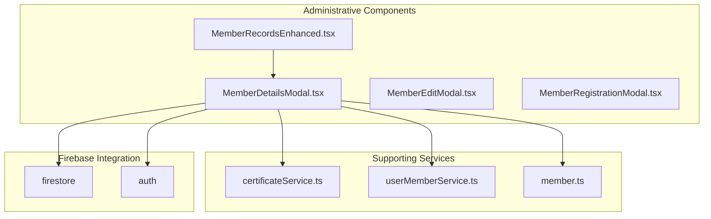
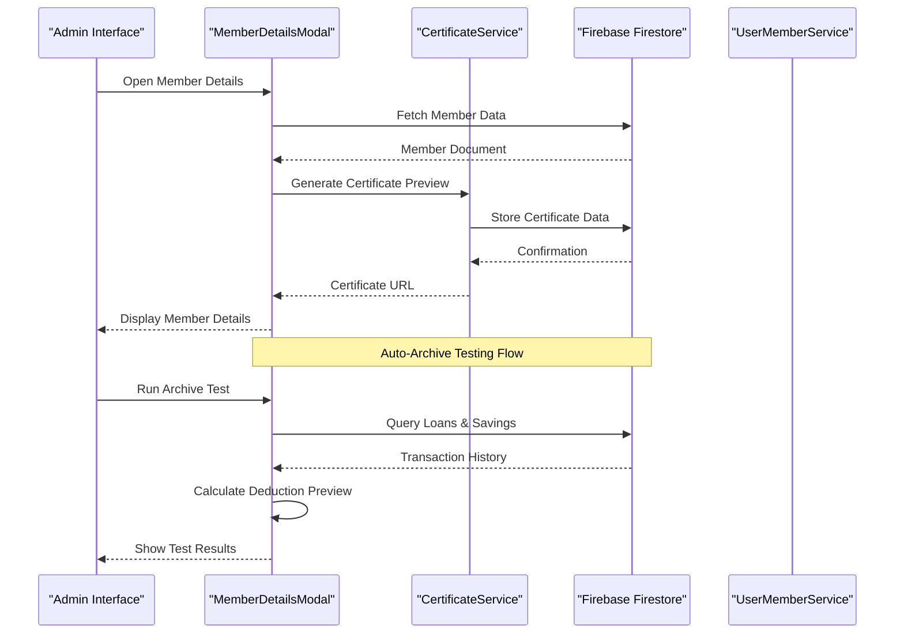
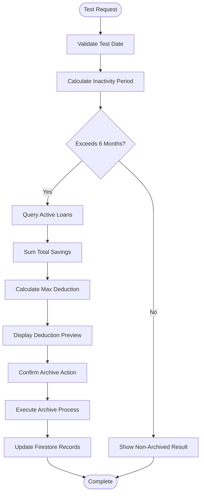
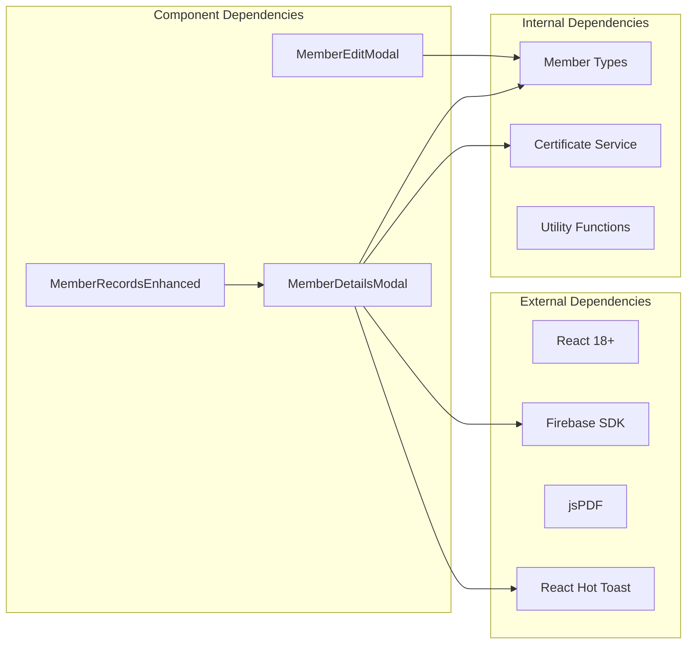

# Member Details Modal

<cite>
**Referenced Files in This Document**
- [MemberDetailsModal.tsx](file://components/admin/MemberDetailsModal.tsx)
- [MemberRecordsEnhanced.tsx](file://components/admin/MemberRecordsEnhanced.tsx)
- [member.ts](file://lib/types/member.ts)
- [certificateService.ts](file://lib/certificateService.ts)
- [userMemberService.ts](file://lib/userMemberService.ts)
- [index.ts](file://components/admin/index.ts)
</cite>

## Table of Contents
1. [Introduction](#introduction)
2. [Project Structure](#project-structure)
3. [Core Components](#core-components)
4. [Architecture Overview](#architecture-overview)
5. [Detailed Component Analysis](#detailed-component-analysis)
6. [Dependency Analysis](#dependency-analysis)
7. [Performance Considerations](#performance-considerations)
8. [Troubleshooting Guide](#troubleshooting-guide)
9. [Conclusion](#conclusion)

## Introduction

The Member Details Modal is a comprehensive administrative component designed to display detailed information about cooperative members in the SAMPA Transport Service Cooperative system. This modal serves as a centralized interface for viewing member profiles, managing share certificates, and performing automated account archival procedures.

The component integrates with Firebase Firestore for real-time data synchronization and provides advanced features including auto-archive testing, loan deduction previews, and certificate generation capabilities. It operates as part of the administrative dashboard ecosystem, providing essential member management functionality for cooperative staff.

## Project Structure

The Member Details Modal is organized within the administrative components structure, alongside related member management tools:

**Diagram sources**
- [MemberDetailsModal.tsx:1-781](file://components/admin/MemberDetailsModal.tsx#L1-L781)
- [MemberRecordsEnhanced.tsx:1-1042](file://components/admin/MemberRecordsEnhanced.tsx#L1-L1042)

**Section sources**
- [MemberDetailsModal.tsx:1-781](file://components/admin/MemberDetailsModal.tsx#L1-L781)
- [index.ts:1-16](file://components/admin/index.ts#L1-L16)

## Core Components

The Member Details Modal consists of several interconnected components that work together to provide comprehensive member management functionality:

### Primary Modal Component
The main modal component handles the display and interaction logic for member details, including:
- Personal and contact information display
- Role-specific data presentation
- Beneficiary information management
- Share certificate visualization
- Auto-archive testing functionality

### Supporting Services
The component integrates with several backend services:
- **Certificate Service**: Handles PDF certificate generation and storage
- **User-Member Service**: Manages user-account and member-profile synchronization
- **Firebase Integration**: Provides real-time database connectivity and authentication

### Data Types and Interfaces
The component utilizes strongly-typed interfaces for data consistency:
- Member interface with comprehensive property definitions
- Driver and Operator information structures
- Certificate data schemas
- Archival and restoration metadata

**Section sources**
- [MemberDetailsModal.tsx:8-16](file://components/admin/MemberDetailsModal.tsx#L8-L16)
- [member.ts:36-68](file://lib/types/member.ts#L36-L68)

## Architecture Overview

The Member Details Modal follows a modular architecture pattern with clear separation of concerns:

**Diagram sources**
- [MemberDetailsModal.tsx:454-775](file://components/admin/MemberDetailsModal.tsx#L454-L775)
- [certificateService.ts:12-294](file://lib/certificateService.ts#L12-L294)

The architecture emphasizes:
- **Separation of Concerns**: Clear distinction between UI, data management, and business logic
- **Real-time Integration**: Direct Firebase Firestore connectivity for live data updates
- **Modular Design**: Independent services that can be tested and maintained separately
- **Type Safety**: Strong typing throughout the component hierarchy

## Detailed Component Analysis

### MemberDetailsModal Component

The primary modal component implements a comprehensive member information display system with advanced administrative features:

#### State Management
The component maintains extensive state for various operational modes:
- **Basic Display State**: Controls modal visibility and client-side rendering
- **Certificate Management**: Handles certificate preview and generation toggles
- **Auto-Archive Testing**: Manages test scenarios and simulation results
- **Deduction Processing**: Tracks loan deduction amounts and validation

#### Data Presentation Logic
The component implements sophisticated data formatting and display logic:

**Diagram sources**
- [MemberDetailsModal.tsx:91-109](file://components/admin/MemberDetailsModal.tsx#L91-L109)
- [MemberDetailsModal.tsx:224-284](file://components/admin/MemberDetailsModal.tsx#L224-L284)

#### Currency and Number Formatting
The component includes robust formatting utilities for financial data:
- **Currency Input Validation**: Real-time formatting with decimal precision control
- **Number Display Formatting**: Comma-separated thousands with locale-aware formatting
- **Loan Amount Calculation**: Automatic deduction preview based on outstanding balances

#### Auto-Archive Testing System
The modal implements a sophisticated testing framework for account archival:

**Diagram sources**
- [MemberDetailsModal.tsx:494-587](file://components/admin/MemberDetailsModal.tsx#L494-L587)
- [MemberDetailsModal.tsx:692-757](file://components/admin/MemberDetailsModal.tsx#L692-L757)

**Section sources**
- [MemberDetailsModal.tsx:17-84](file://components/admin/MemberDetailsModal.tsx#L17-L84)
- [MemberDetailsModal.tsx:287-452](file://components/admin/MemberDetailsModal.tsx#L287-L452)

### Certificate Management System

The modal integrates with the certificate generation service to provide comprehensive share certificate functionality:

#### Certificate Display
The component renders share certificates with:
- **Visual Layout**: Professional certificate template with cooperative branding
- **Dynamic Content**: Member-specific information overlay
- **Metadata Display**: Certificate details summary panel

#### Certificate Generation Integration
The modal coordinates with the certificate service for:
- **Data Validation**: Ensures all required certificate fields are present
- **PDF Generation**: Creates professional share certificate documents
- **Storage Management**: Stores certificate data in Firestore with metadata

**Section sources**
- [MemberDetailsModal.tsx:287-452](file://components/admin/MemberDetailsModal.tsx#L287-L452)
- [certificateService.ts:12-294](file://lib/certificateService.ts#L12-L294)

### User-Member Service Integration

The modal leverages the user-member service for:
- **Data Consistency**: Ensures user and member records remain synchronized
- **Cross-collection Operations**: Enables seamless data operations across collections
- **Validation Logic**: Maintains data integrity through service-layer validation

**Section sources**
- [userMemberService.ts:23-94](file://lib/userMemberService.ts#L23-L94)
- [MemberDetailsModal.tsx:86-89](file://components/admin/MemberDetailsModal.tsx#L86-L89)

## Dependency Analysis

The Member Details Modal has several key dependencies that impact its functionality and performance:

**Diagram sources**
- [MemberDetailsModal.tsx:3-6](file://components/admin/MemberDetailsModal.tsx#L3-L6)
- [certificateService.ts:1-4](file://lib/certificateService.ts#L1-L4)

### Component Coupling Analysis

The modal demonstrates appropriate separation of concerns:
- **Low Coupling**: Minimal direct dependencies on other components
- **High Cohesion**: All member-related functionality concentrated in single component
- **Service Layer Integration**: Clean separation between UI and business logic

### Performance Implications

The component's dependencies impact performance in several ways:
- **Bundle Size**: External libraries like jsPDF increase bundle size
- **Render Performance**: Complex DOM structure with multiple conditional displays
- **Network Requests**: Multiple Firestore queries for comprehensive member data

**Section sources**
- [MemberDetailsModal.tsx:1-781](file://components/admin/MemberDetailsModal.tsx#L1-L781)
- [MemberRecordsEnhanced.tsx:1-1042](file://components/admin/MemberRecordsEnhanced.tsx#L1-L1042)

## Performance Considerations

The Member Details Modal implements several performance optimization strategies:

### Rendering Optimizations
- **Conditional Rendering**: Only renders sections relevant to the member's role
- **Memoization Patterns**: Uses React hooks for efficient state management
- **Lazy Loading**: Certificate content loads only when requested

### Data Management
- **Efficient Queries**: Minimizes Firestore operations through batch processing
- **State Management**: Reduces unnecessary re-renders through proper state updates
- **Memory Management**: Proper cleanup of event listeners and subscriptions

### User Experience
- **Loading States**: Provides feedback during data fetching operations
- **Error Handling**: Graceful degradation when services are unavailable
- **Accessibility**: Keyboard navigation and screen reader support

## Troubleshooting Guide

Common issues and their solutions when working with the Member Details Modal:

### Certificate Generation Issues
**Problem**: Certificate fails to generate or display
**Solution**: Verify certificate service configuration and ensure all required fields are populated

### Data Synchronization Problems
**Problem**: Member details appear outdated or inconsistent
**Solution**: Check Firebase connection status and verify user-member service synchronization

### Auto-Archive Test Failures
**Problem**: Archive test produces unexpected results
**Solution**: Validate loan and savings data consistency, check date calculations

### Performance Issues
**Problem**: Modal loads slowly or becomes unresponsive
**Solution**: Optimize Firestore queries, implement proper loading states, reduce unnecessary re-renders

**Section sources**
- [MemberDetailsModal.tsx:494-599](file://components/admin/MemberDetailsModal.tsx#L494-L599)
- [certificateService.ts:287-293](file://lib/certificateService.ts#L287-L293)

## Conclusion

The Member Details Modal represents a sophisticated administrative tool that effectively combines comprehensive member information display with advanced automation capabilities. The component demonstrates excellent architectural principles through its modular design, strong typing, and service-oriented approach.

Key strengths of the implementation include:
- **Comprehensive Functionality**: Addresses all major member management needs in a single interface
- **Robust Architecture**: Clear separation of concerns with proper service integration
- **User Experience**: Thoughtful design with appropriate feedback and error handling
- **Scalability**: Modular structure that supports future enhancements

The component successfully integrates with the broader cooperative management system while maintaining independence and reliability. Its implementation serves as a model for complex administrative interfaces in cooperative management applications.