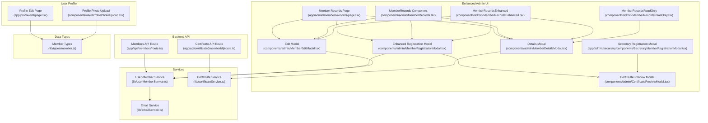
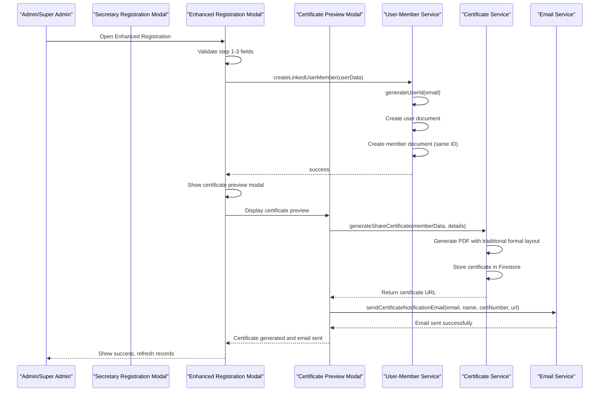
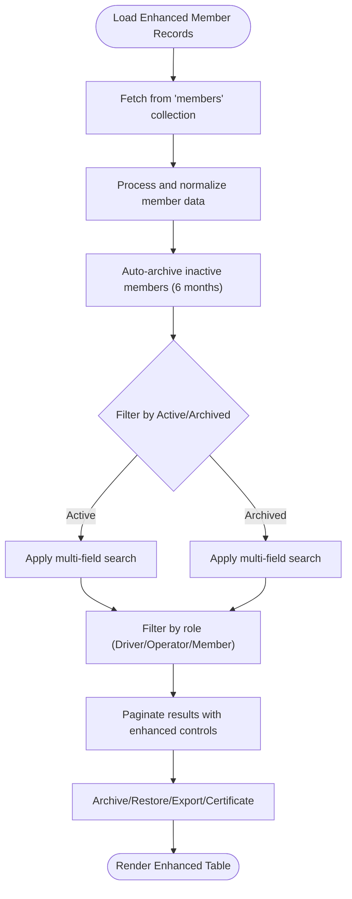
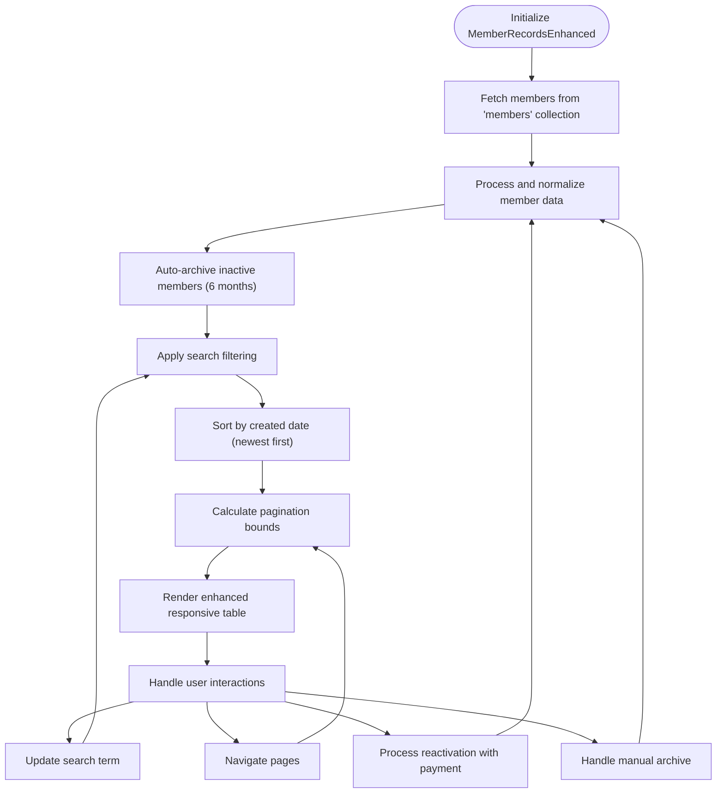
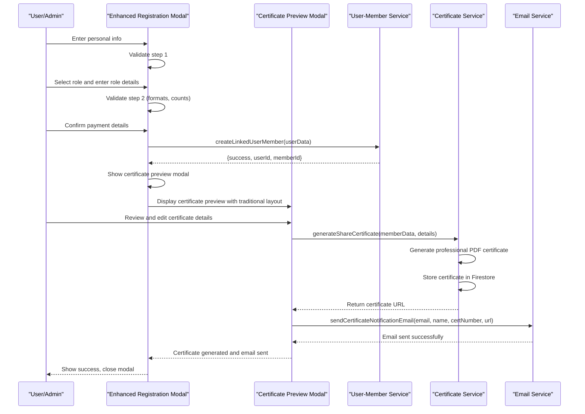
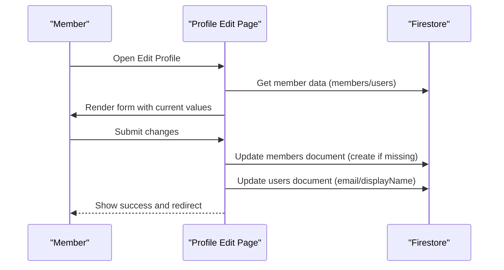
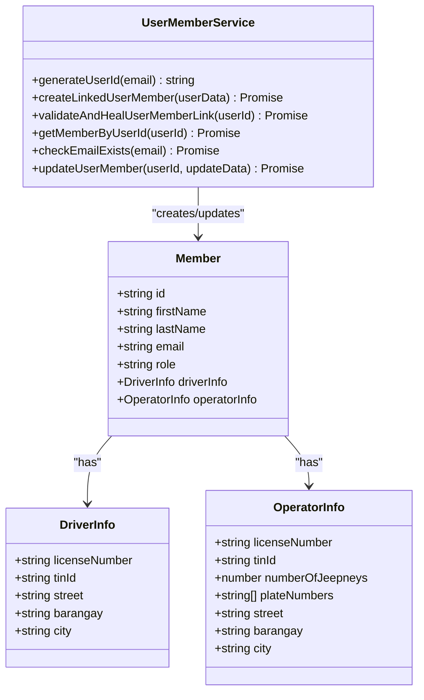
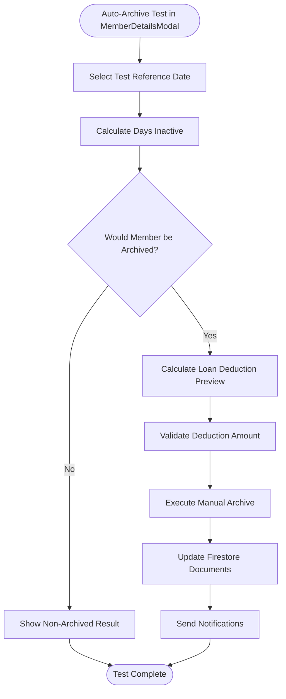
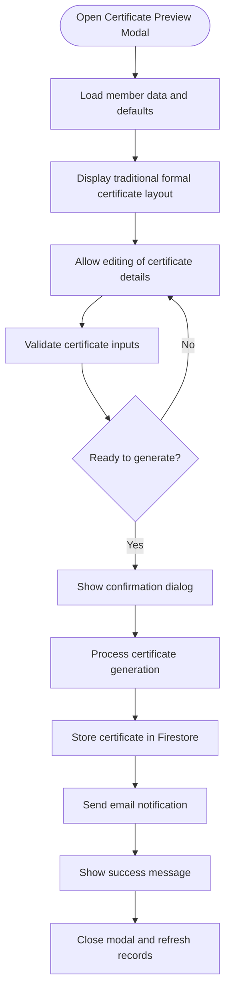
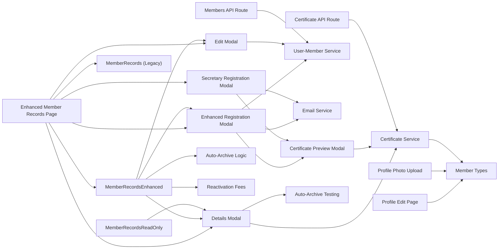

# Member Management System

<cite>
**Referenced Files in This Document**
- [app/admin/members/records/page.tsx](file://app/admin/members/records/page.tsx)
- [app/admin/members/page.tsx](file://app/admin/members/page.tsx)
- [app/admin/chairman/members/page.tsx](file://app/admin/chairman/members/page.tsx)
- [app/admin/secretary/components/SecretaryMemberRegistrationModal.tsx](file://app/admin/secretary/components/SecretaryMemberRegistrationModal.tsx)
- [components/admin/MemberRecords.tsx](file://components/admin/MemberRecords.tsx)
- [components/admin/MemberRecordsEnhanced.tsx](file://components/admin/MemberRecordsEnhanced.tsx)
- [components/admin/MemberRecordsReadOnly.tsx](file://components/admin/MemberRecordsReadOnly.tsx)
- [components/admin/MemberRegistrationModal.tsx](file://components/admin/MemberRegistrationModal.tsx)
- [components/admin/MemberEditModal.tsx](file://components/admin/MemberEditModal.tsx)
- [components/admin/MemberDetailsModal.tsx](file://components/admin/MemberDetailsModal.tsx)
- [components/admin/CertificatePreviewModal.tsx](file://components/admin/CertificatePreviewModal.tsx)
- [lib/userMemberService.ts](file://lib/userMemberService.ts)
- [lib/emailService.ts](file://lib/emailService.ts)
- [lib/certificateService.ts](file://lib/certificateService.ts)
- [lib/types/member.ts](file://lib/types/member.ts)
- [app/api/members/route.ts](file://app/api/members/route.ts)
- [app/api/certificate/[memberId]/route.ts](file://app/api/certificate/[memberId]/route.ts)
- [app/profile/edit/page.tsx](file://app/profile/edit/page.tsx)
- [components/user/ProfilePhotoUpload.tsx](file://components/user/ProfilePhotoUpload.tsx)
</cite>

## Update Summary
**Changes Made**
- Updated MemberDetailsModal documentation to reflect comprehensive auto-archive testing infrastructure
- Clarified that MemberDetailsModal now contains consolidated testing functionality previously split between components
- Updated MemberRecordsEnhanced documentation to reflect simplified auto-archive operation without verbose logging
- Revised auto-archive workflow to reflect testing consolidation in MemberDetailsModal
- Updated status management documentation to reflect current testing capabilities

## Table of Contents
1. [Introduction](#introduction)
2. [Project Structure](#project-structure)
3. [Core Components](#core-components)
4. [Architecture Overview](#architecture-overview)
5. [Detailed Component Analysis](#detailed-component-analysis)
6. [Enhanced Certificate Generation Workflow](#enhanced-certificate-generation-workflow)
7. [Dependency Analysis](#dependency-analysis)
8. [Performance Considerations](#performance-considerations)
9. [Troubleshooting Guide](#troubleshooting-guide)
10. [Conclusion](#conclusion)

## Introduction
This document describes the Member Management System within the SAMPA Cooperative Management Platform. It covers the complete lifecycle of member onboarding, profile management, records administration, search and filtering, pagination, bulk operations, user-account-to-member-profile integration, status management, and compliance features. The system now includes enhanced member records management with sophisticated components featuring auto-archiving, comprehensive testing infrastructure, detailed member information display, and role-based access control, providing both comprehensive administrative capabilities and simplified read-only views. The enhanced certificate generation workflow provides a seamless, professional experience for creating and managing member share certificates.

**Updated** Member management interface now focuses on comprehensive testing capabilities through the MemberDetailsModal component, with simplified auto-archive operations in MemberRecordsEnhanced without verbose logging.

## Project Structure
The Member Management System spans UI components, backend APIs, and shared services with enhanced component architecture:
- Enhanced Member Records Page with comprehensive filtering and pagination
- MemberRecordsEnhanced component providing advanced member management with simplified auto-archiving and testing consolidation
- MemberRecordsReadOnly component offering simplified read-only member viewing for non-admin roles
- Standalone MemberRecords component for legacy support
- Enhanced Member Registration Modal with step-by-step workflow and certificate preview
- Secretary Member Registration Modal with streamlined certificate generation process
- Administrative modals for member registration, editing, and details viewing
- Certificate Preview Modal with redesigned traditional formal layout
- Services for user-member linking, email notifications, and certificate generation
- Types for member data structures
- Backend API routes for member CRUD operations and certificate retrieval
- Profile editing and photo upload components

**Diagram sources**
- [app/admin/members/records/page.tsx:1-655](file://app/admin/members/records/page.tsx#L1-L655)
- [app/admin/members/page.tsx:1-522](file://app/admin/members/page.tsx#L1-L522)
- [app/admin/chairman/members/page.tsx:1-39](file://app/admin/chairman/members/page.tsx#L1-L39)
- [app/admin/secretary/components/SecretaryMemberRegistrationModal.tsx:1-1043](file://app/admin/secretary/components/SecretaryMemberRegistrationModal.tsx#L1-L1043)
- [components/admin/MemberRecords.tsx:1-748](file://components/admin/MemberRecords.tsx#L1-L748)
- [components/admin/MemberRecordsEnhanced.tsx:1-1042](file://components/admin/MemberRecordsEnhanced.tsx#L1-L1042)
- [components/admin/MemberRecordsReadOnly.tsx:1-278](file://components/admin/MemberRecordsReadOnly.tsx#L1-L278)
- [components/admin/MemberRegistrationModal.tsx:1-1404](file://components/admin/MemberRegistrationModal.tsx#L1-L1404)
- [components/admin/MemberEditModal.tsx:1-820](file://components/admin/MemberEditModal.tsx#L1-L820)
- [components/admin/MemberDetailsModal.tsx:1-781](file://components/admin/MemberDetailsModal.tsx#L1-L781)
- [components/admin/CertificatePreviewModal.tsx:1-532](file://components/admin/CertificatePreviewModal.tsx#L1-L532)
- [lib/userMemberService.ts:1-287](file://lib/userMemberService.ts#L1-L287)
- [lib/emailService.ts:1-281](file://lib/emailService.ts#L1-L281)
- [lib/certificateService.ts:1-393](file://lib/certificateService.ts#L1-L393)
- [app/api/members/route.ts:1-179](file://app/api/members/route.ts#L1-L179)
- [app/api/certificate/[memberId]/route.ts](file://app/api/certificate/[memberId]/route.ts#L1-L200)
- [lib/types/member.ts:1-56](file://lib/types/member.ts#L1-L56)
- [app/profile/edit/page.tsx:1-498](file://app/profile/edit/page.tsx#L1-L498)
- [components/user/ProfilePhotoUpload.tsx:1-166](file://components/user/ProfilePhotoUpload.tsx#L1-L166)

**Section sources**
- [app/admin/members/records/page.tsx:1-655](file://app/admin/members/records/page.tsx#L1-L655)
- [app/admin/members/page.tsx:1-522](file://app/admin/members/page.tsx#L1-L522)
- [app/admin/chairman/members/page.tsx:1-39](file://app/admin/chairman/members/page.tsx#L1-L39)
- [app/admin/secretary/components/SecretaryMemberRegistrationModal.tsx:1-1043](file://app/admin/secretary/components/SecretaryMemberRegistrationModal.tsx#L1-L1043)
- [components/admin/MemberRecords.tsx:1-748](file://components/admin/MemberRecords.tsx#L1-L748)
- [components/admin/MemberRecordsEnhanced.tsx:1-1042](file://components/admin/MemberRecordsEnhanced.tsx#L1-L1042)
- [components/admin/MemberRecordsReadOnly.tsx:1-278](file://components/admin/MemberRecordsReadOnly.tsx#L1-L278)
- [components/admin/MemberRegistrationModal.tsx:1-1404](file://components/admin/MemberRegistrationModal.tsx#L1-L1404)
- [components/admin/MemberEditModal.tsx:1-820](file://components/admin/MemberEditModal.tsx#L1-L820)
- [components/admin/MemberDetailsModal.tsx:1-781](file://components/admin/MemberDetailsModal.tsx#L1-L781)
- [components/admin/CertificatePreviewModal.tsx:1-532](file://components/admin/CertificatePreviewModal.tsx#L1-L532)
- [lib/userMemberService.ts:1-287](file://lib/userMemberService.ts#L1-L287)
- [lib/emailService.ts:1-281](file://lib/emailService.ts#L1-L281)
- [lib/certificateService.ts:1-393](file://lib/certificateService.ts#L1-L393)
- [app/api/members/route.ts:1-179](file://app/api/members/route.ts#L1-L179)
- [app/api/certificate/[memberId]/route.ts](file://app/api/certificate/[memberId]/route.ts#L1-L200)
- [lib/types/member.ts:1-56](file://lib/types/member.ts#L1-L56)
- [app/profile/edit/page.tsx:1-498](file://app/profile/edit/page.tsx#L1-L498)
- [components/user/ProfilePhotoUpload.tsx:1-166](file://components/user/ProfilePhotoUpload.tsx#L1-L166)

## Core Components
- Enhanced Member Records Page: Comprehensive member management with advanced filtering, pagination, status management, and bulk operations
- MemberRecordsEnhanced Component: Advanced standalone component providing sophisticated member management capabilities with simplified auto-archiving, detailed member information display, search functionality, and responsive pagination
- MemberRecordsReadOnly Component: Simplified read-only component designed for non-admin roles with basic member viewing capabilities and essential filtering
- MemberRecords Component: Legacy basic component providing fundamental member management functionality (still maintained for backward compatibility)
- Enhanced Member Registration Modal: Multi-step form for new member onboarding with real-time validation, role-specific fields, payment summary, and integrated certificate preview workflow
- Secretary Member Registration Modal: Streamlined registration process specifically designed for Secretary role with certificate generation workflow
- Certificate Preview Modal: Redesigned traditional formal layout for certificate review and generation with editable fields and professional styling
- Edit Modal: Multi-step form for updating member details with role-aware fields and dynamic plate numbers for operators
- Details Modal: Comprehensive member information display with personal details, address information, role-specific data, certificate management, and extensive auto-archive testing capabilities
- User-Member Service: Ensures consistent IDs across users and members collections, validates and heals links, and synchronizes updates
- Email Service: Sends welcome emails, certificate notifications, and other notifications using EmailJS
- Certificate Service: Generates professional share certificates in PDF format with cooperative branding and member details, including email notification workflow
- Member Types: Defines the Member, DriverInfo, OperatorInfo, and related interfaces
- Profile Edit Page: Allows authenticated members to update personal info, contact details, and role-specific data
- Profile Photo Upload: Handles image selection, validation, and updates to user documents

**Section sources**
- [app/admin/members/records/page.tsx:1-655](file://app/admin/members/records/page.tsx#L1-L655)
- [app/admin/members/page.tsx:1-522](file://app/admin/members/page.tsx#L1-L522)
- [app/admin/chairman/members/page.tsx:1-39](file://app/admin/chairman/members/page.tsx#L1-L39)
- [app/admin/secretary/components/SecretaryMemberRegistrationModal.tsx:1-1043](file://app/admin/secretary/components/SecretaryMemberRegistrationModal.tsx#L1-L1043)
- [components/admin/MemberRecords.tsx:1-748](file://components/admin/MemberRecords.tsx#L1-L748)
- [components/admin/MemberRecordsEnhanced.tsx:1-1042](file://components/admin/MemberRecordsEnhanced.tsx#L1-L1042)
- [components/admin/MemberRecordsReadOnly.tsx:1-278](file://components/admin/MemberRecordsReadOnly.tsx#L1-L278)
- [components/admin/MemberRegistrationModal.tsx:1-1404](file://components/admin/MemberRegistrationModal.tsx#L1-L1404)
- [components/admin/MemberEditModal.tsx:1-820](file://components/admin/MemberEditModal.tsx#L1-L820)
- [components/admin/MemberDetailsModal.tsx:1-781](file://components/admin/MemberDetailsModal.tsx#L1-L781)
- [components/admin/CertificatePreviewModal.tsx:1-532](file://components/admin/CertificatePreviewModal.tsx#L1-L532)
- [lib/userMemberService.ts:1-287](file://lib/userMemberService.ts#L1-L287)
- [lib/emailService.ts:1-281](file://lib/emailService.ts#L1-L281)
- [lib/certificateService.ts:1-393](file://lib/certificateService.ts#L1-L393)
- [lib/types/member.ts:1-56](file://lib/types/member.ts#L1-L56)
- [app/profile/edit/page.tsx:1-498](file://app/profile/edit/page.tsx#L1-L498)
- [components/user/ProfilePhotoUpload.tsx:1-166](file://components/user/ProfilePhotoUpload.tsx#L1-L166)

## Architecture Overview
The system integrates administrative and user-facing flows with backend APIs and shared services. The enhanced member management architecture now includes multiple specialized components with role-based access control, providing both comprehensive administrative capabilities and simplified read-only views for different user roles. The enhanced certificate generation workflow provides a seamless experience from member registration to certificate issuance with professional PDF generation and email notifications.

**Updated** Member management interface now focuses on comprehensive testing capabilities through the MemberDetailsModal component, with simplified auto-archive operations in MemberRecordsEnhanced without verbose logging.

**Diagram sources**
- [components/admin/MemberRegistrationModal.tsx:354-404](file://components/admin/MemberRegistrationModal.tsx#L354-L404)
- [components/admin/CertificatePreviewModal.tsx:107-119](file://components/admin/CertificatePreviewModal.tsx#L107-L119)
- [lib/certificateService.ts:12-277](file://lib/certificateService.ts#L12-L277)
- [lib/emailService.ts:146-176](file://lib/emailService.ts#L146-L176)

**Section sources**
- [app/admin/members/page.tsx:1-522](file://app/admin/members/page.tsx#L1-L522)
- [app/admin/chairman/members/page.tsx:1-39](file://app/admin/chairman/members/page.tsx#L1-L39)
- [components/admin/MemberRecordsEnhanced.tsx:1-1042](file://components/admin/MemberRecordsEnhanced.tsx#L1-L1042)
- [components/admin/MemberRecordsReadOnly.tsx:1-278](file://components/admin/MemberRecordsReadOnly.tsx#L1-L278)
- [components/admin/MemberRegistrationModal.tsx:1-1404](file://components/admin/MemberRegistrationModal.tsx#L1-L1404)
- [components/admin/CertificatePreviewModal.tsx:1-532](file://components/admin/CertificatePreviewModal.tsx#L1-L532)
- [lib/userMemberService.ts:1-287](file://lib/userMemberService.ts#L1-L287)
- [lib/emailService.ts:1-281](file://lib/emailService.ts#L1-L281)
- [lib/certificateService.ts:1-393](file://lib/certificateService.ts#L1-L393)

## Detailed Component Analysis

### Enhanced Member Records Administration
The Member Records Page now provides comprehensive member management capabilities through the enhanced component:
- Advanced data sourcing from members collection with comprehensive member processing
- Simplified auto-archiving functionality for inactive members (6-month inactivity threshold) without verbose logging
- Reactivation fee processing with payment validation and transaction logging
- Multi-field filtering by active/archived status, name, email, and ID
- Sophisticated pagination with configurable items per page and responsive controls
- Status-based filtering with color-coded indicators (Active, Inactive, Pending, Archived)
- Archive/restore actions with confirmation dialogs and payment validation
- CSV export functionality with comprehensive member data
- Integration with modals for viewing, editing, and adding members
- Certificate generation and display capabilities

**Updated** Member management interface now focuses on simplified auto-archive operations without verbose logging, while comprehensive testing capabilities are consolidated in the MemberDetailsModal component.

**Diagram sources**
- [app/admin/members/page.tsx:218-220](file://app/admin/members/page.tsx#L218-L220)
- [components/admin/MemberRecordsEnhanced.tsx:393-489](file://components/admin/MemberRecordsEnhanced.tsx#L393-L489)
- [components/admin/MemberRecordsEnhanced.tsx:430-432](file://components/admin/MemberRecordsEnhanced.tsx#L430-L432)
- [components/admin/MemberRecordsEnhanced.tsx:372-391](file://components/admin/MemberRecordsEnhanced.tsx#L372-L391)

**Section sources**
- [app/admin/members/page.tsx:1-522](file://app/admin/members/page.tsx#L1-L522)
- [components/admin/MemberRecordsEnhanced.tsx:1-1042](file://components/admin/MemberRecordsEnhanced.tsx#L1-L1042)

### MemberRecordsEnhanced Component
The new MemberRecordsEnhanced component provides sophisticated member management capabilities with 1042 lines of comprehensive functionality:
- Advanced member listing with simplified auto-archiving, reactivation fees, and detailed member information
- Auto-archiving logic for members inactive for 6+ months with minimal logging
- Reactivation fee processing with payment validation and receipt number tracking
- Enhanced search functionality across names, emails, phone numbers, and IDs
- Sophisticated pagination with previous/next controls and page number indicators
- Color-coded status indicators with hover effects and proper accessibility
- Responsive table design with member avatars and loading states
- Detailed member information display with archive reasons and reactivation details
- Loading states with skeleton animations and error handling with retry functionality
- Client-side filtering with real-time search across multiple fields
- Automatic sorting by creation date with newest members first
- Advanced modal dialogs for restore confirmation with payment validation

**Updated** Added comprehensive enhanced member management component with 1042 lines of advanced functionality, simplified auto-archive operations without verbose logging

**Diagram sources**
- [components/admin/MemberRecordsEnhanced.tsx:367-369](file://components/admin/MemberRecordsEnhanced.tsx#L367-L369)
- [components/admin/MemberRecordsEnhanced.tsx:372-391](file://components/admin/MemberRecordsEnhanced.tsx#L372-L391)
- [components/admin/MemberRecordsEnhanced.tsx:491-501](file://components/admin/MemberRecordsEnhanced.tsx#L491-L501)

**Section sources**
- [components/admin/MemberRecordsEnhanced.tsx:1-1042](file://components/admin/MemberRecordsEnhanced.tsx#L1-L1042)

### MemberRecordsReadOnly Component
The new MemberRecordsReadOnly component provides simplified read-only member viewing capabilities with 278 lines of streamlined functionality:
- Basic member listing without modification capabilities for non-admin roles
- Essential filtering by active/archived status and search functionality
- Simple pagination with previous/next controls and page number indicators
- Clean, accessible interface focused solely on member information display
- Responsive design optimized for quick member lookup and verification
- Loading states and error handling for reliable user experience
- Basic status indicators with color coding for member status
- Minimal interaction model suitable for role-based access control

**Updated** Added simplified read-only member management component for non-admin roles

**Section sources**
- [components/admin/MemberRecordsReadOnly.tsx:1-278](file://components/admin/MemberRecordsReadOnly.tsx#L1-L278)

### Enhanced Member Registration Workflow
The Registration Modal implements a three-step wizard with enhanced certificate generation:
- Step 1: Personal info, role selection, and address fields
- Step 2: Role-specific fields (license/TIN) and operator plate numbers
- Step 3: Payment summary and confirmation

**Updated** Enhanced registration workflow with integrated certificate preview and generation process

Validation includes:
- Real-time field validation with user-friendly messages
- Age calculation from birthdate
- License/TIN format enforcement with auto-formatting
- Dynamic plate number fields based on number of jeepneys
- Email uniqueness check against the users collection
- Integrated certificate preview modal with traditional formal design
- Professional PDF certificate generation with editable fields
- Email notification workflow for certificate delivery

**Diagram sources**
- [components/admin/MemberRegistrationModal.tsx:103-144](file://components/admin/MemberRegistrationModal.tsx#L103-L144)
- [components/admin/MemberRegistrationModal.tsx:354-404](file://components/admin/MemberRegistrationModal.tsx#L354-L404)
- [components/admin/CertificatePreviewModal.tsx:107-119](file://components/admin/CertificatePreviewModal.tsx#L107-L119)
- [lib/userMemberService.ts:23-92](file://lib/userMemberService.ts#L23-L92)
- [lib/certificateService.ts:12-277](file://lib/certificateService.ts#L12-L277)
- [lib/emailService.ts:146-176](file://lib/emailService.ts#L146-L176)

**Section sources**
- [components/admin/MemberRegistrationModal.tsx:1-1404](file://components/admin/MemberRegistrationModal.tsx#L1-L1404)
- [components/admin/CertificatePreviewModal.tsx:1-532](file://components/admin/CertificatePreviewModal.tsx#L1-L532)
- [lib/userMemberService.ts:1-287](file://lib/userMemberService.ts#L1-L287)
- [lib/emailService.ts:1-281](file://lib/emailService.ts#L1-L281)
- [lib/certificateService.ts:1-393](file://lib/certificateService.ts#L1-L393)

### Secretary Member Registration Workflow
The Secretary Registration Modal provides a streamlined registration process specifically designed for Secretary role:
- Three-step workflow: Personal Info → Role Selection → Certificate Generation
- Direct certificate generation without intermediate steps
- Pre-filled payment information for streamlined process
- Certificate preview modal with traditional formal design
- Professional PDF generation with editable fields
- Email notification workflow for certificate delivery

**Updated** Added Secretary-specific registration workflow with streamlined certificate generation

**Section sources**
- [app/admin/secretary/components/SecretaryMemberRegistrationModal.tsx:1-1043](file://app/admin/secretary/components/SecretaryMemberRegistrationModal.tsx#L1-L1043)

### Member Profile Management
Authenticated members can update:
- Personal information (names, email, phone, birthdate)
- Role-specific details (license/TIN) and address fields
- Profile photo via base64 storage in the users collection

The Profile Edit Page:
- Loads member data from members or users collections with fallback
- Applies role-aware field rendering
- Updates both members and users collections when needed
- Syncs auth context display name and email when changed

**Diagram sources**
- [app/profile/edit/page.tsx:40-194](file://app/profile/edit/page.tsx#L40-L194)
- [app/profile/edit/page.tsx:204-311](file://app/profile/edit/page.tsx#L204-L311)

**Section sources**
- [app/profile/edit/page.tsx:1-498](file://app/profile/edit/page.tsx#L1-L498)
- [components/user/ProfilePhotoUpload.tsx:1-166](file://components/user/ProfilePhotoUpload.tsx#L1-L166)

### Enhanced Member Search and Filtering
The Member Records Page supports:
- Tabbed navigation between Active and Archived members
- Multi-field search across first/last/middle/suffix, email, and ID
- Case-insensitive substring matching with automatic reset to first page
- Role-based filtering with dropdown selectors
- Status-based filtering with color-coded indicators
- Real-time search with debouncing for performance

**Updated** Enhanced search functionality with multi-field matching and role filtering

**Section sources**
- [app/admin/members/records/page.tsx:149-194](file://app/admin/members/records/page.tsx#L149-L194)
- [app/admin/members/records/page.tsx:156-194](file://app/admin/members/records/page.tsx#L156-L194)

### Advanced Pagination Implementation
Enhanced pagination logic:
- Items per page: 10 with responsive design
- Current page state managed locally with URL persistence
- Responsive pagination controls with previous/next and numbered pages
- Shows item range and total count with page size indicators
- Smart page number calculation with ellipsis for large datasets
- Disabled states for boundary conditions

**Updated** Enhanced pagination with smart page number calculation and responsive design

**Section sources**
- [app/admin/members/records/page.tsx:307-316](file://app/admin/members/records/page.tsx#L307-L316)
- [app/admin/members/records/page.tsx:535-627](file://app/admin/members/records/page.tsx#L535-L627)
- [app/admin/members/records/page.tsx:576-611](file://app/admin/members/records/page.tsx#L576-L611)

### Bulk Operations
Enhanced bulk-like operations supported:
- Export filtered records to CSV with comprehensive member data
- Archive/restore individual members with confirmation dialogs
- Administrative actions triggered from the records table
- Certificate generation and download capabilities
- Status-based filtering for efficient member management

**Updated** Added certificate generation and enhanced bulk operations

**Section sources**
- [app/admin/members/records/page.tsx:252-283](file://app/admin/members/records/page.tsx#L252-L283)
- [app/admin/members/records/page.tsx:204-250](file://app/admin/members/records/page.tsx#L204-L250)
- [app/admin/members/records/page.tsx:252-283](file://app/admin/members/records/page.tsx#L252-L283)

### User Account and Member Profile Integration
The User-Member Service:
- Generates consistent IDs from email addresses
- Creates linked user and member documents with identical IDs
- Validates and heals linkage on login or retrieval
- Updates both collections in parallel where appropriate
- Provides helpers to check email existence and update records consistently

**Diagram sources**
- [lib/userMemberService.ts:14-92](file://lib/userMemberService.ts#L14-L92)
- [lib/types/member.ts:1-56](file://lib/types/member.ts#L1-L56)

**Section sources**
- [lib/userMemberService.ts:1-287](file://lib/userMemberService.ts#L1-L287)
- [lib/types/member.ts:1-56](file://lib/types/member.ts#L1-L56)

### Enhanced Member Status Management and Compliance
- Status fields: Active by default; archived flag maintained for historical records
- Enhanced status indicators with color coding (green for Active, gray for Archived, yellow for Pending)
- Auto-archiving functionality for members inactive for 6+ months with minimal logging
- Reactivation fee processing with payment validation and receipt number tracking
- Compliance: Email verification workflow via welcome email with password setup link
- Data retention: Archived members excluded from active listings; export includes archived status
- Certificate management: Automated certificate generation and PDF download capabilities
- Audit trail: Comprehensive logging of member status changes and administrative actions

**Updated** Enhanced status management with simplified auto-archive operations and comprehensive testing capabilities

**Section sources**
- [components/admin/MemberRecordsEnhanced.tsx:96-146](file://components/admin/MemberRecordsEnhanced.tsx#L96-L146)
- [components/admin/MemberRecordsEnhanced.tsx:148-165](file://components/admin/MemberRecordsEnhanced.tsx#L148-L165)
- [components/admin/MemberRecordsEnhanced.tsx:167-237](file://components/admin/MemberRecordsEnhanced.tsx#L167-L237)
- [lib/emailService.ts:68-95](file://lib/emailService.ts#L68-L95)
- [app/admin/members/records/page.tsx:204-250](file://app/admin/members/records/page.tsx#L204-L250)
- [components/admin/MemberDetailsModal.tsx:202-257](file://components/admin/MemberDetailsModal.tsx#L202-L257)

### Role-Based Access Control
The system now implements role-based access control for member records:
- **Administrative Roles** (Admin, Chairman, Manager, Treasurer, Secretary, Vice-Chairman): Full access to MemberRecordsEnhanced with advanced features
- **Chairman and Vice-Chairman**: Access to MemberRecordsReadOnly for simplified member viewing
- **Other Users**: Restricted access based on role validation and routing

**Updated** Added role-based access control with specialized components for different user roles

**Section sources**
- [app/admin/members/page.tsx:1-522](file://app/admin/members/page.tsx#L1-L522)
- [app/admin/chairman/members/page.tsx:1-39](file://app/admin/chairman/members/page.tsx#L1-L39)

### Comprehensive Auto-Archive Testing Infrastructure
The MemberDetailsModal component provides extensive auto-archive testing capabilities:
- **Test Date Configuration**: Manual date selection for testing auto-archive scenarios
- **Inactivity Calculation**: Calculates days since last transaction or creation date
- **Loan Deduction Preview**: Shows total loan balance, savings balance, and potential deductions
- **Manual Archive Execution**: Allows administrators to archive members with loan deductions
- **Deduction Amount Validation**: Prevents over-deduction beyond loan or savings balances
- **Comprehensive Test Results**: Displays detailed analysis of member status, days inactive, and archive reason
- **Debug Logging**: Extensive console logging for development and troubleshooting

**Updated** Added comprehensive auto-archive testing infrastructure with detailed loan deduction previews and manual execution capabilities

**Diagram sources**
- [components/admin/MemberDetailsModal.tsx:461-694](file://components/admin/MemberDetailsModal.tsx#L461-L694)
- [components/admin/MemberDetailsModal.tsx:694-781](file://components/admin/MemberDetailsModal.tsx#L694-L781)

**Section sources**
- [components/admin/MemberDetailsModal.tsx:1-781](file://components/admin/MemberDetailsModal.tsx#L1-L781)

### Practical Examples
- Onboarding a new Driver with certificate generation:
  - Open Enhanced Registration Modal, select Driver role, fill personal and address info, enter license/TIN, confirm payment, submit.
  - System creates linked user and member records, sends welcome email, displays certificate preview modal with traditional formal design.
  - Review and edit certificate details, generate professional PDF certificate, send email notification with download link.
- Updating a member's contact details:
  - Navigate to Profile Edit, update phone/email/birthdate,address, submit; system syncs both collections.
- Admin archiving a member:
  - From Member Records, click Archive; member moves to Archived tab and is excluded from active listings.
- Generating member certificates:
  - Access Member Details Modal, click View Certificate, then Download Certificate or Open in New Tab.
- Managing member records with enhanced features:
  - Use MemberRecordsEnhanced component for comprehensive member management, simplified auto-archiving, and detailed member information.
- Testing auto-archive scenarios:
  - Open Member Details Modal, navigate to Auto-Archive Test section, select test date, run test to see if member would be archived.
- Executing manual archive with loan deductions:
  - In Auto-Archive Test section, configure deduction amount, confirm archive execution, system archives member and deducts from savings.
- Viewing member records in read-only mode:
  - Use MemberRecordsReadOnly component for simplified member viewing without modification capabilities.
- Using legacy MemberRecords component:
  - Import and embed the MemberRecords component for basic member listing functionality with fundamental features.
- Secretary streamlined registration:
  - Use Secretary Registration Modal for simplified member onboarding with direct certificate generation workflow.

**Updated** Added comprehensive auto-archive testing examples, manual archive execution, and enhanced member management workflows

**Section sources**
- [components/admin/MemberRegistrationModal.tsx:1-1404](file://components/admin/MemberRegistrationModal.tsx#L1-L1404)
- [app/admin/secretary/components/SecretaryMemberRegistrationModal.tsx:1-1043](file://app/admin/secretary/components/SecretaryMemberRegistrationModal.tsx#L1-L1043)
- [app/profile/edit/page.tsx:1-498](file://app/profile/edit/page.tsx#L1-L498)
- [app/admin/members/records/page.tsx:196-250](file://app/admin/members/records/page.tsx#L196-L250)
- [components/admin/MemberDetailsModal.tsx:202-257](file://components/admin/MemberDetailsModal.tsx#L202-L257)
- [components/admin/MemberRecordsEnhanced.tsx:1-1042](file://components/admin/MemberRecordsEnhanced.tsx#L1-L1042)
- [components/admin/MemberRecordsReadOnly.tsx:1-278](file://components/admin/MemberRecordsReadOnly.tsx#L1-L278)
- [components/admin/MemberRecords.tsx:1-748](file://components/admin/MemberRecords.tsx#L1-L748)

## Enhanced Certificate Generation Workflow

### Certificate Preview Modal with Traditional Formal Layout
The Certificate Preview Modal provides a redesigned traditional formal layout for professional certificate generation:
- **Traditional Formal Design**: Green border styling with decorative corners and official seal
- **Editable Fields**: Certificate number, shares, cooperative name, secretary/chairman names, issue date
- **Professional Typography**: Serif fonts for certificate text with proper spacing and alignment
- **Interactive Elements**: Editable inputs for all certificate details with real-time validation
- **Confirmation Workflow**: Modal dialog for certificate generation confirmation with summary details
- **Responsive Layout**: Optimized for both desktop and mobile viewing with proper aspect ratio

**Updated** Added comprehensive certificate preview modal with redesigned traditional formal layout

**Diagram sources**
- [components/admin/CertificatePreviewModal.tsx:145-354](file://components/admin/CertificatePreviewModal.tsx#L145-L354)
- [components/admin/CertificatePreviewModal.tsx:479-528](file://components/admin/CertificatePreviewModal.tsx#L479-L528)

**Section sources**
- [components/admin/CertificatePreviewModal.tsx:1-532](file://components/admin/CertificatePreviewModal.tsx#L1-L532)

### Professional Certificate Generation Process
The enhanced certificate generation process provides professional PDF certificates with comprehensive workflow:
- **Traditional Certificate Design**: Incorporation details, authorized capital, certificate number, shares
- **Official Sealing**: Green starburst seal with "OFFICIAL SEAL" text
- **Legal Text**: Transfer restrictions and endorsement requirements
- **Witness Clause**: Proper legal language for certificate issuance
- **Signature Areas**: Dedicated spaces for Secretary and Chairman signatures
- **Footer Details**: Shares and each share value information
- **Digital Storage**: Base64 encoded PDF stored in Firestore with metadata
- **Email Notification**: Automated email with download link and certificate details

**Updated** Enhanced certificate generation with professional PDF styling and comprehensive workflow

**Section sources**
- [lib/certificateService.ts:12-277](file://lib/certificateService.ts#L12-L277)
- [lib/certificateService.ts:317-393](file://lib/certificateService.ts#L317-L393)

### Integrated Registration and Certificate Workflow
The enhanced registration workflow seamlessly integrates certificate generation:
- **Step 3 Integration**: Certificate generation step appears after successful member registration
- **Pre-filled Data**: Member information automatically populated in certificate preview
- **Professional Design**: Immediate access to traditional formal certificate layout
- **Real-time Editing**: Ability to modify certificate details before final generation
- **Automated Email**: Certificate notification sent immediately after generation
- **Data Persistence**: Certificate stored in both member document and dedicated collection

**Updated** Added integrated registration and certificate workflow with seamless user experience

**Section sources**
- [components/admin/MemberRegistrationModal.tsx:425-464](file://components/admin/MemberRegistrationModal.tsx#L425-L464)
- [app/admin/secretary/components/SecretaryMemberRegistrationModal.tsx:202-237](file://app/admin/secretary/components/SecretaryMemberRegistrationModal.tsx#L202-L237)

## Dependency Analysis
Key dependencies and relationships:
- Enhanced Member Records Page depends on Firestore for data and on modals/components for actions
- MemberRecordsEnhanced provides advanced functionality with simplified auto-archiving and minimal logging
- MemberRecordsReadOnly provides simplified functionality for non-admin roles
- MemberRecords component provides legacy support with basic member management
- Enhanced Registration Modal depends on User-Member Service for linking and on Email Service for notifications
- Certificate Preview Modal integrates with Certificate Service for PDF generation and Email Service for notifications
- Secretary Registration Modal provides streamlined access to certificate workflow
- Certificate Service depends on jsPDF and Firestore for PDF generation and storage
- Profile Edit Page depends on auth context and Firestore for updates
- Backend API routes provide CRUD endpoints for members and certificate retrieval
- Certificate API route serves generated certificates to authenticated users
- MemberDetailsModal provides comprehensive testing infrastructure for auto-archive operations

**Updated** Member management interface now focuses on comprehensive testing capabilities through the MemberDetailsModal component, with simplified auto-archive operations in MemberRecordsEnhanced without verbose logging.

**Diagram sources**
- [app/admin/members/records/page.tsx:1-655](file://app/admin/members/records/page.tsx#L1-L655)
- [app/admin/members/page.tsx:1-522](file://app/admin/members/page.tsx#L1-L522)
- [app/admin/chairman/members/page.tsx:1-39](file://app/admin/chairman/members/page.tsx#L1-L39)
- [app/admin/secretary/components/SecretaryMemberRegistrationModal.tsx:1-1043](file://app/admin/secretary/components/SecretaryMemberRegistrationModal.tsx#L1-L1043)
- [components/admin/MemberRecords.tsx:1-748](file://components/admin/MemberRecords.tsx#L1-L748)
- [components/admin/MemberRecordsEnhanced.tsx:1-1042](file://components/admin/MemberRecordsEnhanced.tsx#L1-L1042)
- [components/admin/MemberRecordsReadOnly.tsx:1-278](file://components/admin/MemberRecordsReadOnly.tsx#L1-L278)
- [components/admin/MemberRegistrationModal.tsx:1-1404](file://components/admin/MemberRegistrationModal.tsx#L1-L1404)
- [components/admin/MemberEditModal.tsx:1-820](file://components/admin/MemberEditModal.tsx#L1-L820)
- [components/admin/MemberDetailsModal.tsx:1-781](file://components/admin/MemberDetailsModal.tsx#L1-L781)
- [components/admin/CertificatePreviewModal.tsx:1-532](file://components/admin/CertificatePreviewModal.tsx#L1-L532)
- [lib/userMemberService.ts:1-287](file://lib/userMemberService.ts#L1-L287)
- [lib/emailService.ts:1-281](file://lib/emailService.ts#L1-L281)
- [lib/certificateService.ts:1-393](file://lib/certificateService.ts#L1-L393)
- [app/api/members/route.ts:1-179](file://app/api/members/route.ts#L1-L179)
- [app/api/certificate/[memberId]/route.ts](file://app/api/certificate/[memberId]/route.ts#L1-L200)
- [lib/types/member.ts:1-56](file://lib/types/member.ts#L1-L56)
- [app/profile/edit/page.tsx:1-498](file://app/profile/edit/page.tsx#L1-L498)
- [components/user/ProfilePhotoUpload.tsx:1-166](file://components/user/ProfilePhotoUpload.tsx#L1-L166)

**Section sources**
- [app/admin/members/records/page.tsx:1-655](file://app/admin/members/records/page.tsx#L1-L655)
- [app/admin/members/page.tsx:1-522](file://app/admin/members/page.tsx#L1-L522)
- [app/admin/chairman/members/page.tsx:1-39](file://app/admin/chairman/members/page.tsx#L1-L39)
- [app/admin/secretary/components/SecretaryMemberRegistrationModal.tsx:1-1043](file://app/admin/secretary/components/SecretaryMemberRegistrationModal.tsx#L1-L1043)
- [components/admin/MemberRecords.tsx:1-748](file://components/admin/MemberRecords.tsx#L1-L748)
- [components/admin/MemberRecordsEnhanced.tsx:1-1042](file://components/admin/MemberRecordsEnhanced.tsx#L1-L1042)
- [components/admin/MemberRecordsReadOnly.tsx:1-278](file://components/admin/MemberRecordsReadOnly.tsx#L1-L278)
- [components/admin/MemberRegistrationModal.tsx:1-1404](file://components/admin/MemberRegistrationModal.tsx#L1-L1404)
- [components/admin/MemberEditModal.tsx:1-820](file://components/admin/MemberEditModal.tsx#L1-L820)
- [components/admin/MemberDetailsModal.tsx:1-781](file://components/admin/MemberDetailsModal.tsx#L1-L781)
- [components/admin/CertificatePreviewModal.tsx:1-532](file://components/admin/CertificatePreviewModal.tsx#L1-L532)
- [lib/userMemberService.ts:1-287](file://lib/userMemberService.ts#L1-L287)
- [lib/emailService.ts:1-281](file://lib/emailService.ts#L1-L281)
- [lib/certificateService.ts:1-393](file://lib/certificateService.ts#L1-L393)
- [app/api/members/route.ts:1-179](file://app/api/members/route.ts#L1-L179)
- [app/api/certificate/[memberId]/route.ts](file://app/api/certificate/[memberId]/route.ts#L1-L200)
- [lib/types/member.ts:1-56](file://lib/types/member.ts#L1-L56)
- [app/profile/edit/page.tsx:1-498](file://app/profile/edit/page.tsx#L1-L498)
- [components/user/ProfilePhotoUpload.tsx:1-166](file://components/user/ProfilePhotoUpload.tsx#L1-L166)

## Performance Considerations
- Enhanced pagination reduces DOM load and improves responsiveness for large datasets with smart page number calculation
- Auto-archiving functionality processes members efficiently with minimal logging and batch operations
- Reactivation fee processing includes payment validation to prevent invalid operations
- Client-side filtering with debouncing is efficient for moderate record sizes; consider server-side filtering for very large datasets
- Parallel updates in User-Member Service minimize round trips when updating both collections
- Image upload currently stores base64 in Firestore; for production, migrate to Firebase Storage for better performance and cost efficiency
- MemberRecordsEnhanced component provides focused functionality with optimized rendering and responsive design
- MemberRecordsReadOnly component offers streamlined performance for read-only operations
- Certificate generation uses lazy loading to improve initial page load performance
- PDF generation occurs client-side with jsPDF for immediate certificate availability
- Email notifications are processed asynchronously to prevent blocking the user interface
- Certificate storage uses base64 encoding for immediate access but may need optimization for large-scale deployment
- MemberDetailsModal provides comprehensive testing infrastructure with extensive logging for development and troubleshooting

**Updated** Enhanced performance considerations for new MemberRecordsEnhanced, MemberRecordsReadOnly, comprehensive testing infrastructure, and certificate generation components

## Troubleshooting Guide
Common issues and resolutions:
- Member not found in members collection:
  - The system falls back to users collection and normalizes fields; verify role and optional fields.
- Email already exists:
  - Registration prevents duplicate emails; prompt user to use another email or recover existing account.
- Linkage inconsistencies:
  - Use validateAndHealUserMemberLink to detect and repair mismatched IDs or missing member documents.
- Update failures:
  - Check Firestore permissions and network connectivity; review returned error messages for specific causes.
- Email delivery issues:
  - Verify EmailJS configuration and template IDs; ensure environment variables are set.
- Certificate generation failures:
  - Check certificate service availability and PDF generation permissions; verify jsPDF library loading.
- Certificate preview modal issues:
  - Ensure proper modal mounting and unmounting; verify certificate data loading and validation.
- Pagination issues:
  - Verify Firestore query limits and pagination calculations for large datasets.
- Auto-archiving failures:
  - Check member activity timestamps and ensure proper date formatting in Firestore.
- Reactivation fee processing errors:
  - Verify receipt number validation and payment processing logic.
- Role-based access issues:
  - Ensure proper authentication and role validation for component access.
- Certificate workflow interruptions:
  - Verify certificate generation completion and email notification delivery.
- Auto-archive testing failures:
  - Check test date configuration and loan deduction calculations in MemberDetailsModal.
- Manual archive execution errors:
  - Verify deduction amount validation and Firestore update permissions.
- Debug logging issues:
  - Check browser console for extensive logging from MemberDetailsModal testing infrastructure.

**Updated** Added troubleshooting guidance for auto-archiving, reactivation fees, role-based access, certificate workflow, comprehensive testing infrastructure, and new component features

**Section sources**
- [app/admin/members/records/page.tsx:44-88](file://app/admin/members/records/page.tsx#L44-L88)
- [components/admin/MemberRecordsEnhanced.tsx:240-271](file://components/admin/MemberRecordsEnhanced.tsx#L240-L271)
- [components/admin/MemberRecordsEnhanced.tsx:167-237](file://components/admin/MemberRecordsEnhanced.tsx#L167-L237)
- [lib/userMemberService.ts:99-198](file://lib/userMemberService.ts#L99-L198)
- [lib/emailService.ts:19-38](file://lib/emailService.ts#L19-L38)
- [components/admin/CertificatePreviewModal.tsx:1-532](file://components/admin/CertificatePreviewModal.tsx#L1-L532)
- [components/admin/MemberDetailsModal.tsx:202-257](file://components/admin/MemberDetailsModal.tsx#L202-L257)
- [components/admin/MemberRecords.tsx:1-748](file://components/admin/MemberRecords.tsx#L1-L748)

## Conclusion
The Member Management System provides a robust, integrated solution for managing cooperative members with significantly enhanced capabilities. The system now includes sophisticated member records management through the new MemberRecordsEnhanced component with simplified auto-archiving and comprehensive administrative features, while the MemberRecordsReadOnly component provides simplified access for non-admin roles. The enhanced certificate generation workflow delivers a seamless, professional experience from member registration to certificate issuance with traditional formal design and automated email notifications. The enhanced system offers advanced filtering, detailed member information display, improved administrative capabilities, and role-based access control. The modular architecture supports scalability and maintainability with enhanced certificate management, status tracking, responsive design features, and comprehensive audit trails. The new components provide excellent foundations for future enhancements and specialized member management scenarios, ensuring strong user-account-to-member-profile linkage, comprehensive validation, and smooth onboarding experiences for all user roles. The integrated certificate workflow and comprehensive auto-archive testing infrastructure represent significant improvements in user experience and professional standards for cooperative member management.

**Updated** Member management interface now focuses on comprehensive testing capabilities through the MemberDetailsModal component, with simplified auto-archive operations in MemberRecordsEnhanced without verbose logging, reflecting the consolidated testing infrastructure and streamlined user experience.