# Member Records System

<cite>
**Referenced Files in This Document**
- [app/admin/members/page.tsx](file://app/admin/members/page.tsx)
- [app/admin/members/records/page.tsx](file://app/admin/members/records/page.tsx)
- [app/api/members/route.ts](file://app/api/members/route.ts)
- [app/api/test/route.ts](file://app/api/test/route.ts)
- [app/api/test-json/route.ts](file://app/api/test-json/route.ts)
- [components/admin/MemberRegistrationModal.tsx](file://components/admin/MemberRegistrationModal.tsx)
- [components/admin/MemberEditModal.tsx](file://components/admin/MemberEditModal.tsx)
- [components/admin/MemberRecordsEnhanced.tsx](file://components/admin/MemberRecordsEnhanced.tsx)
- [components/admin/MemberRecordsReadOnly.tsx](file://components/admin/MemberRecordsReadOnly.tsx)
- [components/admin/MemberDetailsModal.tsx](file://components/admin/MemberDetailsModal.tsx)
- [components/admin/Pagination.tsx](file://components/admin/Pagination.tsx)
- [lib/firebase.ts](file://lib/firebase.ts)
- [lib/types/member.ts](file://lib/types/member.ts)
- [lib/userMemberService.ts](file://lib/userMemberService.ts)
- [lib/savingsService.ts](file://lib/savingsService.ts)
- [lib/activityLogger.ts](file://lib/activityLogger.ts)
- [lib/settingsService.ts](file://lib/settingsService.ts)
- [lib/types/loan.ts](file://lib/types/loan.ts)
- [scripts/fix-loan-calculations.js](file://scripts/fix-loan-calculations.js)
- [firestore.rules](file://firestore.rules)
</cite>

## Update Summary
**Changes Made**
- **Enhanced Loan Deduction System**: Implemented improved multi-loan processing algorithm with precise allocation using remainingDeduction variable
- **Better Loan Status Recognition**: Enhanced loan status validation and recognition for active, approved, and pending loan states
- **Enhanced Debugging Capabilities**: Added comprehensive logging and debugging features for loan deduction processes
- **Multi-loan Processing Algorithm**: Introduced systematic approach to allocate deductions across multiple active loans with proper remaining balance tracking

## Table of Contents
1. [Introduction](#introduction)
2. [Project Structure](#project-structure)
3. [Core Components](#core-components)
4. [Architecture Overview](#architecture-overview)
5. [Detailed Component Analysis](#detailed-component-analysis)
6. [Enhanced Member Records Management](#enhanced-member-records-management)
7. [Auto-Archive System](#auto-archive-system)
8. [Enhanced Loan Deduction System](#enhanced-loan-deduction-system)
9. [Enhanced Currency Input Handling](#enhanced-currency-input-handling)
10. [Toast Notification System](#toast-notification-system)
11. [Activity Logging and Audit Trail](#activity-logging-and-audit-trail)
12. [Dependency Analysis](#dependency-analysis)
13. [Performance Considerations](#performance-considerations)
14. [Troubleshooting Guide](#troubleshooting-guide)
15. [Conclusion](#conclusion)

## Introduction
The Member Records System is a comprehensive solution for managing cooperative members within the SAMPA Co-op platform. It provides complete member lifecycle management including registration, profile maintenance, activity tracking, and integration with financial systems for loans and savings. The system supports two primary member roles—Drivers and Operators—each with distinct operational requirements and regulatory compliance needs.

**Updated** The system now features a significantly enhanced member records management interface through the new MemberRecordsEnhanced.tsx component, which replaces the legacy MemberRecords component. This enhancement introduces streamlined auto-archive functionality, comprehensive member activity tracking, advanced search capabilities, and improved user interface elements for better administrative efficiency.

The system emphasizes data integrity through consistent user-member linking, robust validation mechanisms, and comprehensive audit trails. It offers advanced search and filtering capabilities, efficient pagination for large datasets, seamless integration with the broader cooperative ecosystem including loan management and savings systems, and automated member lifecycle management through intelligent inactivity detection.

**Updated** The enhanced system now includes streamlined auto-archive functionality that automatically identifies and archives inactive members based on real-time calculations using current system timestamps, with sophisticated loan deduction capabilities that automatically deduct remaining loan balances from member savings when accounts are archived. The system has removed the comprehensive testing framework that previously allowed administrators to simulate future dates for testing auto-archive functionality, focusing instead on real-time, production-ready operations.

## Project Structure
The Member Records System follows a modular architecture with clear separation of concerns across presentation, business logic, and data persistence layers. The system now includes specialized components for different use cases, with the enhanced MemberRecordsEnhanced.tsx serving as the primary administrative interface.

```mermaid
graph TB
subgraph "Enhanced Member Records Interface"
A[MemberRecordsEnhanced.tsx]
B[Advanced Search & Filtering]
C[Auto-Archive Functionality]
D[Enhanced Loan Deduction System]
E[Member Details Modal]
F[Restore/Archive Modals]
G[System Settings Integration]
H[Activity Timestamp Tracking]
I[Real-time Calculations]
J[Loan Deduction Preview]
K[Multi-loan Processing Algorithm]
L[RemainingDeduction Variable]
M[Enhanced Debugging Capabilities]
end
subgraph "Read-Only Interface"
N[MemberRecordsReadOnly.tsx]
O[Basic Search & Display]
P[Simple Pagination]
Q[Status Filtering]
end
subgraph "Business Logic Layer"
R[User-Member Service]
S[Savings Service]
T[Activity Logger]
U[Validation Utilities]
V[Certificate Service]
W[Settings Service]
X[Loan Management Integration]
end
subgraph "Data Access Layer"
Y[Firebase Service]
Z[Firestore Collections]
AA[Transactions Subcollections]
BB[Member Documents]
CC[Activity Logs]
DD[Loan Collections]
end
subgraph "External Systems"
EE[Loan Management]
FF[Reports & Analytics]
GG[Email Service]
HH[Certificate Generation]
II[Enhanced Toast Notifications]
end
A --> R
N --> R
R --> Y
S --> Y
T --> Y
Y --> Z
R --> EE
S --> EE
R --> FF
R --> GG
R --> HH
R --> II
EE --> DD
DD --> X
```

**Diagram sources**
- [components/admin/MemberRecordsEnhanced.tsx:1-1042](file://components/admin/MemberRecordsEnhanced.tsx#L1-L1042)
- [components/admin/MemberRecordsReadOnly.tsx:1-278](file://components/admin/MemberRecordsReadOnly.tsx#L1-L278)
- [lib/userMemberService.ts:1-287](file://lib/userMemberService.ts#L1-L287)
- [lib/firebase.ts:1-309](file://lib/firebase.ts#L1-L309)
- [app/api/test/route.ts:1-59](file://app/api/test/route.ts#L1-L59)
- [app/api/test-json/route.ts:1-137](file://app/api/test-json/route.ts#L1-L137)

**Section sources**
- [components/admin/MemberRecordsEnhanced.tsx:1-1042](file://components/admin/MemberRecordsEnhanced.tsx#L1-L1042)
- [components/admin/MemberRecordsReadOnly.tsx:1-278](file://components/admin/MemberRecordsReadOnly.tsx#L1-L278)
- [lib/userMemberService.ts:1-287](file://lib/userMemberService.ts#L1-L287)

## Core Components

### Enhanced Member Data Model
The system defines a comprehensive member data structure supporting both operational roles and administrative requirements with enhanced tracking capabilities, including advanced archiving and restoration fields.

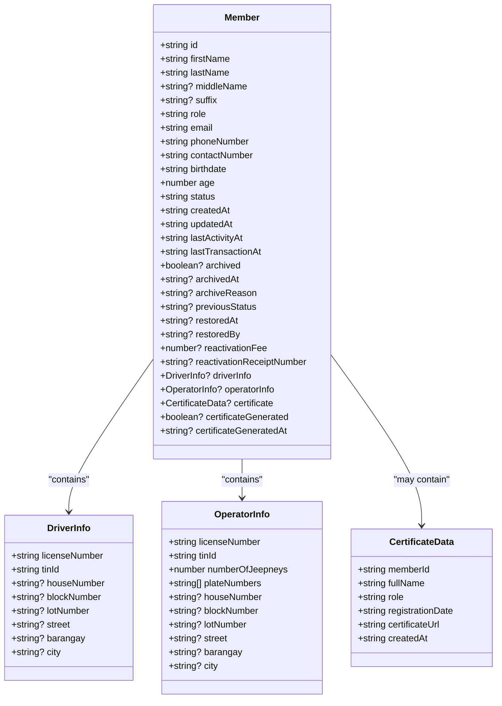

**Diagram sources**
- [lib/types/member.ts:1-85](file://lib/types/member.ts#L1-L85)

### Database Schema Design
The system employs a dual-collection strategy with consistent ID linking between user accounts and member profiles, enhanced with activity tracking fields and comprehensive archiving capabilities.

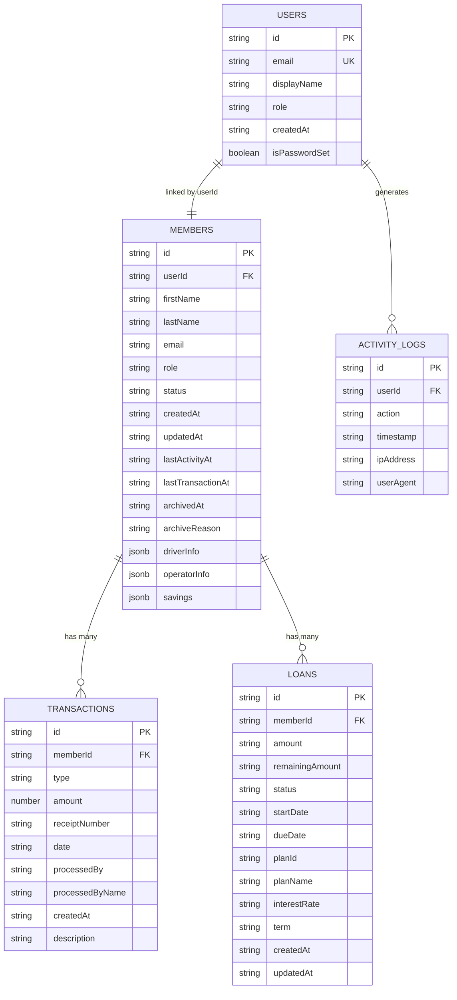

**Diagram sources**
- [lib/userMemberService.ts:35-92](file://lib/userMemberService.ts#L35-L92)
- [lib/savingsService.ts:237-342](file://lib/savingsService.ts#L237-L342)
- [lib/types/loan.ts:1-20](file://lib/types/loan.ts#L1-L20)

**Section sources**
- [lib/types/member.ts:1-85](file://lib/types/member.ts#L1-L85)
- [lib/userMemberService.ts:1-287](file://lib/userMemberService.ts#L1-L287)
- [lib/types/loan.ts:1-20](file://lib/types/loan.ts#L1-L20)

## Architecture Overview

The Member Records System implements a client-server architecture with Firebase Firestore as the primary data store, featuring robust validation, consistent user-member linking, and comprehensive audit capabilities. The system now includes specialized components for different operational scenarios, with the enhanced MemberRecordsEnhanced.tsx providing streamlined member lifecycle management.

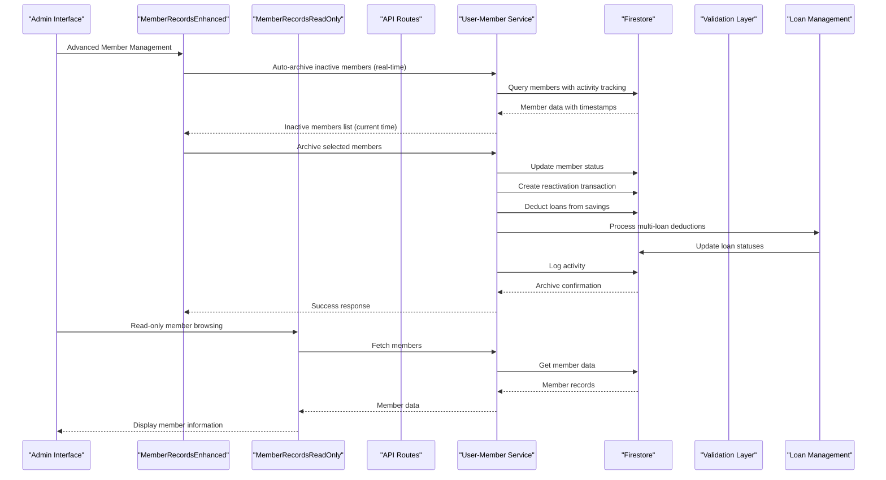

**Diagram sources**
- [components/admin/MemberRecordsEnhanced.tsx:240-271](file://components/admin/MemberRecordsEnhanced.tsx#L240-L271)
- [components/admin/MemberRecordsReadOnly.tsx:52-85](file://components/admin/MemberRecordsReadOnly.tsx#L52-L85)
- [app/api/members/route.ts:67-158](file://app/api/members/route.ts#L67-L158)
- [lib/userMemberService.ts:23-92](file://lib/userMemberService.ts#L23-L92)

**Section sources**
- [components/admin/MemberRecordsEnhanced.tsx:1-1042](file://components/admin/MemberRecordsEnhanced.tsx#L1-L1042)
- [components/admin/MemberRecordsReadOnly.tsx:1-278](file://components/admin/MemberRecordsReadOnly.tsx#L1-L278)
- [app/api/members/route.ts:1-179](file://app/api/members/route.ts#L1-L179)
- [lib/userMemberService.ts:1-287](file://lib/userMemberService.ts#L1-L287)

## Detailed Component Analysis

### Enhanced Member Records Management Interface
The primary administration interface provides comprehensive member management capabilities with advanced filtering and pagination, featuring streamlined auto-archive functionality for inactive members and sophisticated member lifecycle management.

```mermaid
flowchart TD
Start([Load Enhanced Member Records]) --> FetchData[Fetch from Firestore]
FetchData --> ProcessData[Process Member Data with Activity Tracking]
ProcessData --> AutoArchive[Auto-archive Inactive Members (Real-time)]
AutoArchive --> FilterData[Apply Active/Archived Filter]
FilterData --> SearchData[Apply Advanced Search Filter]
SearchData --> PaginateData[Apply Pagination]
PaginateData --> DisplayResults[Display Enhanced Results]
SearchData --> ExportCSV[Export to CSV]
ExportCSV --> DownloadFile[Download File]
DisplayResults --> ActionButtons[Enhanced Action Buttons]
ActionButtons --> ViewMember[View Member Details]
ActionButtons --> EditMember[Edit Member]
ActionButtons --> ArchiveMember[Archive Member]
ActionButtons --> RestoreMember[Restore Member]
ActionButtons --> MarkInactive[Mark as Inactive]
ViewMember --> MemberModal[Enhanced Member Details Modal]
EditMember --> EditModal[Edit Member Modal]
ArchiveMember --> ArchiveProcess[Archive Process]
RestoreMember --> RestoreProcess[Restore Process]
MarkInactive --> MarkInactiveProcess[Mark Inactive Process]
```

**Diagram sources**
- [components/admin/MemberRecordsEnhanced.tsx:393-489](file://components/admin/MemberRecordsEnhanced.tsx#L393-L489)

#### Advanced Search and Filtering Implementation
The enhanced system implements multi-criteria search across member attributes with intelligent fallback mechanisms for data migration scenarios and improved search accuracy. The search functionality now includes comprehensive filtering across name, email, phone number, and member ID with real-time processing.

**Section sources**
- [components/admin/MemberRecordsEnhanced.tsx:371-391](file://components/admin/MemberRecordsEnhanced.tsx#L371-L391)

### Read-Only Member Records Interface
The read-only interface provides simplified member browsing capabilities for scenarios where administrative modifications are restricted, offering basic search and display functionality with essential member information.

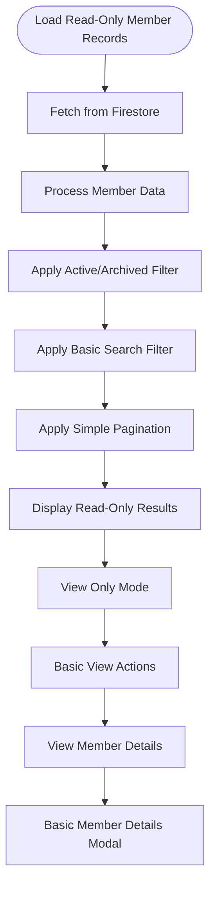

**Diagram sources**
- [components/admin/MemberRecordsReadOnly.tsx:87-115](file://components/admin/MemberRecordsReadOnly.tsx#L87-L115)

**Section sources**
- [components/admin/MemberRecordsReadOnly.tsx:1-278](file://components/admin/MemberRecordsReadOnly.tsx#L1-L278)

### Member Registration and Validation
The registration process ensures data integrity through comprehensive validation and consistent user-member linking, with enhanced error handling and user feedback. The system now includes sophisticated validation for role-specific fields and comprehensive data sanitization.

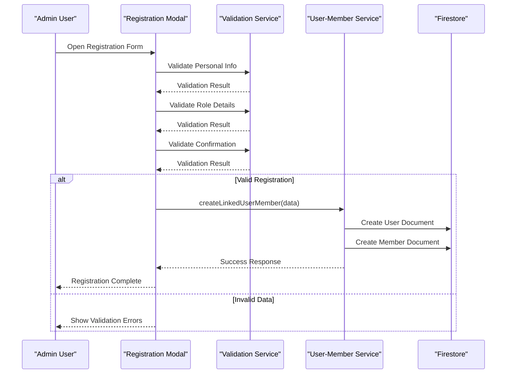

**Diagram sources**
- [components/admin/MemberRegistrationModal.tsx:213-369](file://components/admin/MemberRegistrationModal.tsx#L213-L369)
- [lib/userMemberService.ts:23-92](file://lib/userMemberService.ts#L23-L92)

**Section sources**
- [components/admin/MemberRegistrationModal.tsx:1-800](file://components/admin/MemberRegistrationModal.tsx#L1-L800)
- [lib/userMemberService.ts:1-287](file://lib/userMemberService.ts#L1-L287)

### Pagination and Performance Optimization
The system implements efficient pagination for handling large member datasets with intelligent page number calculation and display optimization, supporting both enhanced and read-only interfaces with improved performance characteristics.

**Section sources**
- [components/admin/MemberRecordsEnhanced.tsx:491-501](file://components/admin/MemberRecordsEnhanced.tsx#L491-L501)
- [components/admin/MemberRecordsReadOnly.tsx:117-121](file://components/admin/MemberRecordsReadOnly.tsx#L117-L121)
- [components/admin/Pagination.tsx:1-141](file://components/admin/Pagination.tsx#L1-L141)

### Financial System Integration
The member records system integrates seamlessly with loan and savings systems through consistent member identification and transaction tracking, with enhanced activity monitoring for automated member management and comprehensive reactivation fee processing.

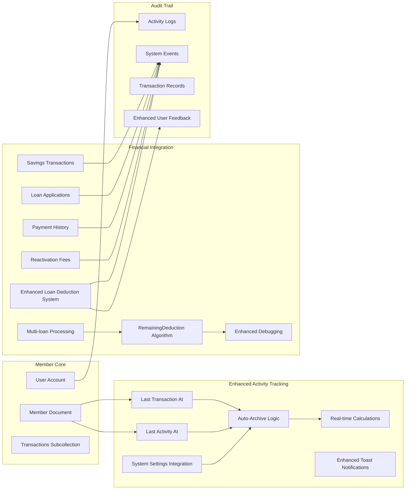

**Diagram sources**
- [components/admin/MemberRecordsEnhanced.tsx:96-146](file://components/admin/MemberRecordsEnhanced.tsx#L96-L146)
- [lib/savingsService.ts:237-342](file://lib/savingsService.ts#L237-L342)
- [lib/activityLogger.ts:1-165](file://lib/activityLogger.ts#L1-L165)

**Section sources**
- [components/admin/MemberRecordsEnhanced.tsx:1-1042](file://components/admin/MemberRecordsEnhanced.tsx#L1-L1042)
- [lib/savingsService.ts:1-455](file://lib/savingsService.ts#L1-L455)
- [lib/activityLogger.ts:1-165](file://lib/activityLogger.ts#L1-L165)

## Enhanced Member Records Management

### Streamlined Auto-Archive Functionality
The enhanced system includes sophisticated auto-archive capabilities that automatically identifies and archives inactive members based on real-time calculations using current system timestamps, with comprehensive logging and notification capabilities.

```mermaid
flowchart TD
Start([Auto-Archive Process - Real-time]) --> LoadMembers[Load All Members]
LoadMembers --> CheckArchived{Already Archived?}
CheckArchived --> |Yes| SkipMember[Skip Member]
CheckArchived --> |No| CheckActivity[Check Activity Timestamps (Current Time)]
CheckActivity --> HasActivity{Has Activity Data?}
HasActivity --> |Yes| CalcDays[Calculate Days Since Last Activity (Real-time)]
HasActivity --> |No| CheckCreated[Check Creation Date]
CalcDays --> DaysThreshold{Days >= 180?}
DaysThreshold --> |Yes| ShouldArchive[Should Archive Member]
DaysThreshold --> |No| KeepActive[Keep Member Active]
CheckCreated --> CreatedThreshold{Days Since Creation >= 180?}
CreatedThreshold --> |Yes| ShouldArchive
CreatedThreshold --> |No| KeepActive
ShouldArchive --> ArchiveMember[Archive Member]
KeepActive --> Continue[Continue Monitoring]
SkipMember --> Continue
```

**Diagram sources**
- [components/admin/MemberRecordsEnhanced.tsx:96-146](file://components/admin/MemberRecordsEnhanced.tsx#L96-L146)

### Enhanced Search Capabilities
The enhanced search functionality provides comprehensive member discovery through multiple criteria including name, email, phone number, and member ID, with intelligent fallback mechanisms for data migration scenarios and improved search accuracy with real-time filtering.

**Section sources**
- [components/admin/MemberRecordsEnhanced.tsx:371-391](file://components/admin/MemberRecordsEnhanced.tsx#L371-L391)

### Advanced Member Details
The enhanced member details interface provides comprehensive member information display with activity tracking, archival history, and restoration details for administrative oversight, including detailed timeline visualization and status indicators.

**Section sources**
- [components/admin/MemberRecordsEnhanced.tsx:355-365](file://components/admin/MemberRecordsEnhanced.tsx#L355-L365)

### System Settings Integration
The enhanced interface integrates with system settings for dynamic configuration of reactivation fees and other operational parameters, with real-time currency formatting and validation for financial transactions.

**Section sources**
- [components/admin/MemberRecordsEnhanced.tsx:374-377](file://components/admin/MemberRecordsEnhanced.tsx#L374-L377)

## Auto-Archive System

### Comprehensive Auto-Archive Implementation
The enhanced Member Records System now features streamlined auto-archive functionality that automatically processes member accounts based on real-time inactivity thresholds, with integrated loan deduction capabilities and comprehensive activity logging.

```mermaid
flowchart TD
Start([Auto-Archive Process - Real-time]) --> LoadMembers[Load All Members]
LoadMembers --> CheckArchived{Already Archived?}
CheckArchived --> |Yes| SkipMember[Skip Member]
CheckArchived --> |No| CheckActivity[Check Activity Timestamps (Current Time)]
CheckActivity --> HasActivity{Has Activity Data?}
HasActivity --> |Yes| CalcDays[Calculate Days Since Last Activity (Real-time)]
HasActivity --> |No| CheckCreated[Check Creation Date]
CalcDays --> DaysThreshold{Days >= 180?}
DaysThreshold --> |Yes| CheckLoans[Check for Active Loans]
DaysThreshold --> |No| KeepActive[Keep Active]
CheckCreated --> CreatedThreshold{Days Since Creation >= 180?}
CreatedThreshold --> |Yes| CheckLoans
CreatedThreshold --> |No| KeepActive
CheckLoans --> HasLoans{Has Active Loans?}
HasLoans --> |Yes| DeductLoans[Deduct from Savings]
HasLoans --> |No| ArchiveMember[Archive Member]
DeductLoans --> CreateWithdrawal[Create Withdrawal Transaction]
CreateWithdrawal --> UpdateLoans[Update Loan Status]
UpdateLoans --> LogActivity[Log Activity]
LogActivity --> ArchiveMember
KeepActive --> NextMember[Next Member]
SkipMember --> NextMember
NextMember --> MoreMembers{More Members?}
MoreMembers --> |Yes| CheckActivity
MoreMembers --> |No| Complete[Complete Process]
Complete --> SendNotification[Send Archive Notification]
```

### Loan Deduction from Savings Integration
The system now includes sophisticated loan deduction capabilities that automatically deduct remaining loan balances from member savings when accounts are archived due to real-time inactivity, ensuring financial obligations are met while maintaining member data integrity.

**Updated** The enhanced loan deduction system implements a comprehensive multi-loan processing algorithm with precise allocation across multiple active loans using the remainingDeduction variable for accurate distribution of deduction amounts.

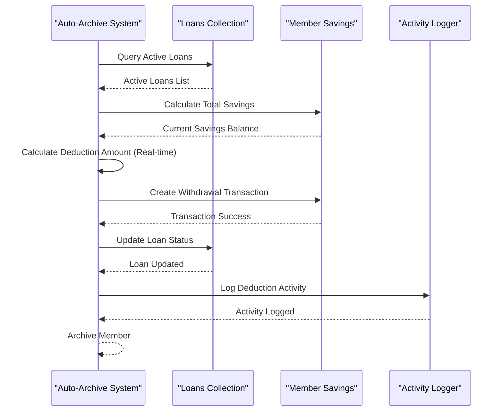

### Real-time Calculations for Maintenance Operations
The enhanced system includes comprehensive real-time calculation capabilities that allow administrators to immediately process member accounts based on current system time, with detailed previews of potential archive outcomes without affecting actual member data.

**Section sources**
- [components/admin/MemberRecordsEnhanced.tsx:96-146](file://components/admin/MemberRecordsEnhanced.tsx#L96-L146)
- [components/admin/MemberRecordsEnhanced.tsx:175-305](file://components/admin/MemberRecordsEnhanced.tsx#L175-L305)
- [components/admin/MemberRecordsEnhanced.tsx:326-379](file://components/admin/MemberRecordsEnhanced.tsx#L326-L379)
- [components/admin/MemberRecordsEnhanced.tsx:381-436](file://components/admin/MemberRecordsEnhanced.tsx#L381-L436)

## Enhanced Loan Deduction System

### Improved Multi-loan Processing Algorithm
The enhanced loan deduction system implements a sophisticated multi-loan processing algorithm that systematically allocates deduction amounts across multiple active loans using the remainingDeduction variable for precise distribution.

```mermaid
flowchart TD
Start([Loan Deduction Process]) --> CalculateDeduction[Calculate Total Deduction Amount]
CalculateDeduction --> GetActiveLoans[Get All Active Loans for Member]
GetActiveLoans --> InitializeRemaining[Initialize remainingDeduction = deductionAmount]
InitializeRemaining --> LoopThroughLoans[Loop Through Each Active Loan]
LoopThroughLoans --> CheckLoanStatus{Loan Status Active?}
CheckLoanStatus --> |Yes| CalculateLoanDeduction[Calculate loanDeduction = min(remainingAmount, remainingDeduction)]
CheckLoanStatus --> |No| NextLoan[Skip to Next Loan]
CalculateLoanDeduction --> ApplyDeduction[Apply Deduction to Loan]
ApplyDeduction --> UpdateRemaining[remainingDeduction -= loanDeduction]
UpdateRemaining --> CheckRemaining{remainingDeduction > 0?}
CheckRemaining --> |Yes| LoopThroughLoans
CheckRemaining --> |No| StopProcessing[Stop Processing]
ApplyDeduction --> UpdateLoanStatus[Update Loan Status Based on Remaining Amount]
UpdateLoanStatus --> NextLoan
NextLoan --> LoopThroughLoans
StopProcessing --> LogActivity[Log Activity with Deduction Details]
LogActivity --> Complete[Complete Process]
```

### Enhanced Loan Status Recognition
The system now features improved loan status recognition that accurately identifies and processes loans in active, approved, and pending states, ensuring comprehensive coverage of all loan types during the deduction process.

**Section sources**
- [app/admin/members/records/page.tsx:259-311](file://app/admin/members/records/page.tsx#L259-L311)
- [components/admin/MemberDetailsModal.tsx:732-758](file://components/admin/MemberDetailsModal.tsx#L732-L758)

### Enhanced Debugging Capabilities
The enhanced loan deduction system includes comprehensive debugging capabilities with detailed logging, error handling, and progress tracking for all deduction operations, providing administrators with complete visibility into the deduction process.

**Section sources**
- [app/admin/members/records/page.tsx:228-310](file://app/admin/members/records/page.tsx#L228-L310)
- [components/admin/MemberDetailsModal.tsx:771-777](file://components/admin/MemberDetailsModal.tsx#L771-L777)

### Precise Allocation Using RemainingDeduction Variable
The system implements a precise allocation mechanism using the remainingDeduction variable to ensure accurate distribution of deduction amounts across multiple loans, preventing over-deduction and maintaining proper loan balance tracking.

**Section sources**
- [app/admin/members/records/page.tsx:259-283](file://app/admin/members/records/page.tsx#L259-L283)
- [components/admin/MemberDetailsModal.tsx:732-752](file://components/admin/MemberDetailsModal.tsx#L732-L752)

## Enhanced Currency Input Handling

### Sophisticated Currency Formatting System
The enhanced Member Records System now features comprehensive currency input handling with sophisticated formatting capabilities that provide real-time number formatting with comma separators and decimal precision control.

```mermaid
flowchart TD
Start([Currency Input Processing]) --> InputChange[User Input Change]
InputChange --> ExtractRaw[Extract Raw Value (Remove Commas)]
ExtractRaw --> ValidateFormat{Validate Format?}
ValidateFormat --> |Valid| FormatWithCommas[Format with Comma Separators]
ValidateFormat --> |Invalid| RejectInput[Reject Input]
FormatWithCommas --> UpdateDisplay[Update Display with Formatted Value]
UpdateDisplay --> StoreRaw[Store Raw Numeric Value]
StoreRaw --> ValidatePrecision{Validate Decimal Precision?}
ValidatePrecision --> |Valid| AcceptInput[Accept Input]
ValidatePrecision --> |Invalid| LimitPrecision[Limit to 2 Decimal Places]
LimitPrecision --> FormatAgain[Format Again with Comma Separators]
FormatAgain --> AcceptInput
AcceptInput --> ProcessValue[Process Value for Storage]
ProcessValue --> UpdateState[Update Component State]
```

### Advanced Input Validation and Formatting
The system implements sophisticated input validation that handles various currency input scenarios including whole numbers, decimals with up to two decimal places, and proper formatting with thousand separators.

**Section sources**
- [components/admin/AddSavingsModal.tsx:144-190](file://components/admin/AddSavingsModal.tsx#L144-L190)
- [components/admin/MemberRegistrationModal.tsx:1536-1584](file://components/admin/MemberRegistrationModal.tsx#L1536-L1584)
- [components/admin/LoanDetailsModal.tsx:885-906](file://components/admin/LoanDetailsModal.tsx#L885-L906)

## Toast Notification System

### Enhanced User Feedback with React Hot Toast
The enhanced Member Records System now integrates react-hot-toast for improved user feedback mechanisms, providing sophisticated toast notifications for member operations, archive processes, and system feedback.

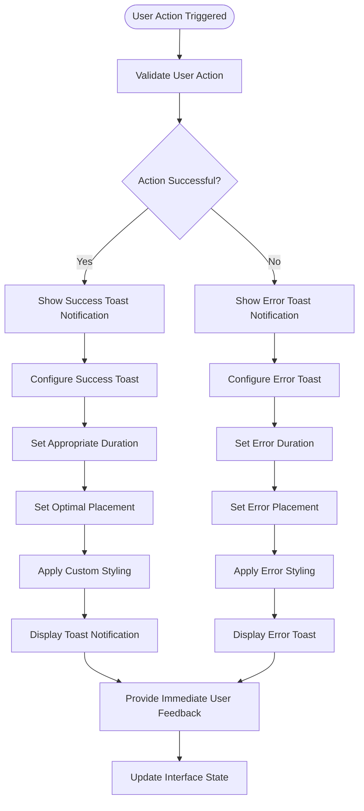

### Comprehensive Toast Notification Implementation
The system provides enhanced toast notifications for various member operations including successful archive operations, restore processes, and system feedback, with sophisticated styling and user experience considerations.

**Section sources**
- [components/admin/MemberRecordsEnhanced.tsx:307-316](file://components/admin/MemberRecordsEnhanced.tsx#L307-L316)
- [components/admin/MemberRecordsEnhanced.tsx:343-351](file://components/admin/MemberRecordsEnhanced.tsx#L343-L351)
- [components/admin/MemberRecordsEnhanced.tsx:443](file://components/admin/MemberRecordsEnhanced.tsx#L443)

## Activity Logging and Audit Trail

### Comprehensive Activity Tracking
The enhanced Member Records System implements a comprehensive activity logging system that tracks all member maintenance operations, including auto-archive processes, loan deductions, and system-generated actions, providing complete audit trails for compliance and troubleshooting.

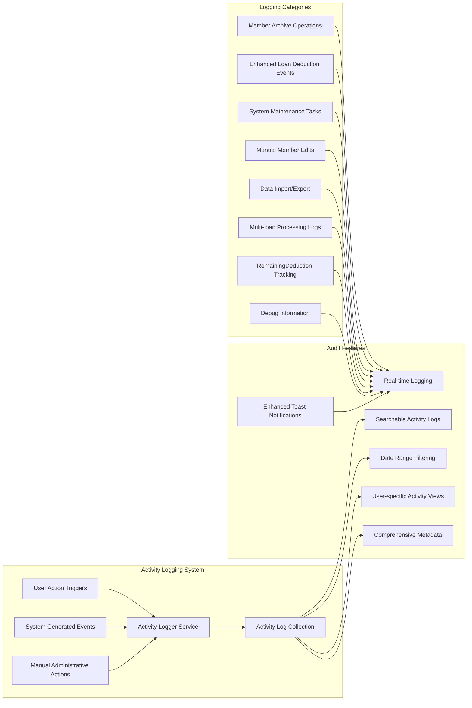

### Automated Activity Logging for Maintenance Operations
The system automatically logs all maintenance operations performed by the auto-archive functionality, including loan deduction transactions, member status changes, and system-generated notifications, ensuring complete traceability of all member lifecycle events.

**Section sources**
- [lib/activityLogger.ts:1-165](file://lib/activityLogger.ts#L1-L165)
- [components/admin/MemberRecordsEnhanced.tsx:286-324](file://components/admin/MemberRecordsEnhanced.tsx#L286-L324)

## Dependency Analysis

The Member Records System exhibits strong modularity with clear dependency boundaries and minimal coupling between components, now including specialized interfaces for different use cases and enhanced integration capabilities.

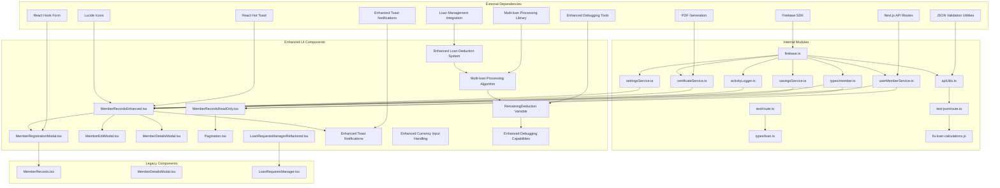

**Diagram sources**
- [lib/firebase.ts:1-309](file://lib/firebase.ts#L1-L309)
- [lib/userMemberService.ts:1-287](file://lib/userMemberService.ts#L1-L287)
- [components/admin/MemberRecordsEnhanced.tsx:1-1042](file://components/admin/MemberRecordsEnhanced.tsx#L1-L1042)
- [components/admin/MemberRecordsReadOnly.tsx:1-278](file://components/admin/MemberRecordsReadOnly.tsx#L1-L278)
- [app/api/test/route.ts:1-59](file://app/api/test/route.ts#L1-L59)
- [app/api/test-json/route.ts:1-137](file://app/api/test-json/route.ts#L1-L137)
- [lib/types/loan.ts:1-20](file://lib/types/loan.ts#L1-L20)
- [scripts/fix-loan-calculations.js:1-140](file://scripts/fix-loan-calculations.js#L1-L140)

**Section sources**
- [lib/firebase.ts:1-309](file://lib/firebase.ts#L1-L309)
- [lib/userMemberService.ts:1-287](file://lib/userMemberService.ts#L1-L287)
- [components/admin/MemberRecordsEnhanced.tsx:1-1042](file://components/admin/MemberRecordsEnhanced.tsx#L1-L1042)
- [components/admin/MemberRecordsReadOnly.tsx:1-278](file://components/admin/MemberRecordsReadOnly.tsx#L1-L278)
- [lib/types/loan.ts:1-20](file://lib/types/loan.ts#L1-L20)
- [scripts/fix-loan-calculations.js:1-140](file://scripts/fix-loan-calculations.js#L1-L140)

## Performance Considerations

### Data Retrieval Optimization
The system implements several performance optimization strategies for handling large member datasets efficiently, with enhanced caching and lazy loading capabilities through the improved MemberRecordsEnhanced.tsx component.

**Enhanced Indexing Strategy**: The Firestore configuration should include composite indexes for common query patterns:
- `(status, createdAt)` for member listing with status filtering
- `(role, status)` for role-based member queries
- `(email, status)` for email-based lookups
- `(lastTransactionAt, status)` for activity-based queries
- `(timestamp, userId)` for activity log queries
- `(memberId, status)` for loan queries
- `(status, memberId)` for loan status filtering

**Enhanced Query Optimization**: Member search operations utilize efficient filtering patterns:
- Multi-field search with OR conditions for flexible member discovery
- Status-based filtering before search term application to reduce dataset size
- Activity-based filtering for auto-archive functionality
- Pagination implementation to limit response sizes

**Enhanced Caching Strategy**: The system maintains cached member data locally with automatic refresh mechanisms to minimize repeated network requests, with separate caches for enhanced and read-only interfaces and intelligent cache invalidation for archived members.

### Memory Management
The interface implements efficient state management:
- Lazy loading of member details through modal components
- Conditional rendering of expensive components
- Proper cleanup of event listeners and timers
- Separate state management for enhanced and read-only interfaces
- Optimized rendering for large datasets with virtual scrolling capabilities

### Auto-Archive Performance Optimization
The auto-archive functionality includes performance optimizations:
- Real-time processing of member checks with immediate results
- Efficient loan deduction calculations with early termination
- Optimized Firestore queries for member and loan data retrieval
- Asynchronous processing to prevent UI blocking
- Enhanced toast notifications for immediate user feedback

### Enhanced Loan Deduction Performance
The enhanced loan deduction system includes performance optimizations:
- Multi-loan processing with early termination when remainingDeduction reaches zero
- Efficient loan status validation and filtering
- Optimized Firestore queries for loan collections
- Reduced memory usage through iterative processing
- Enhanced debugging with minimal performance impact

## Troubleshooting Guide

### Common Issues and Solutions

**Enhanced Member Records Issues**
- **Issue**: Auto-archive not working properly for inactive members
- **Solution**: Verify activity timestamps are being updated correctly and check Firestore security rules for write permissions

**Enhanced Loan Deduction System Issues**
- **Issue**: Multi-loan processing not allocating deductions correctly
- **Solution**: Check remainingDeduction variable initialization and loan status validation logic

**Loan Status Recognition Issues**
- **Issue**: Loans not recognized as active during deduction process
- **Solution**: Verify loan status filtering logic includes all active states (active, approved, pending)

**Enhanced Debugging Capabilities Issues**
- **Issue**: Missing debug information in loan deduction logs
- **Solution**: Check console logging statements and ensure proper error handling

**Real-time Calculation Problems**
- **Issue**: Auto-archive not responding to current activity timestamps
- **Solution**: Verify system clock synchronization and check Firestore security rules for write permissions

**Activity Logging Issues**
- **Issue**: Missing activity logs for maintenance operations
- **Solution**: Check activity logger configuration, Firestore permissions, and error handling

**Enhanced Toast Notification Issues**
- **Issue**: Toast notifications not displaying properly
- **Solution**: Verify react-hot-toast installation and check for JavaScript errors in the browser console

**Read-Only Interface Problems**
- **Issue**: Members not displaying correctly in read-only mode
- **Solution**: Check Firestore permissions and verify member data structure consistency

**Member Registration Failures**
- **Issue**: Registration validation errors for role-specific fields
- **Solution**: Verify role selection matches the required fields and validate license number format

**Data Synchronization Problems**
- **Issue**: Inconsistent user-member linkage after registration
- **Solution**: Use the validation and healing service to reconcile discrepancies

**Search Functionality Issues**
- **Issue**: Members not appearing in search results
- **Solution**: Check for proper indexing and verify search term formatting

**Pagination Problems**
- **Issue**: Incorrect page calculations or missing members
- **Solution**: Verify items per page configuration and check for data filtering conflicts

**Enhanced Currency Input Issues**
- **Issue**: Currency formatting not working correctly
- **Solution**: Check input validation logic and verify decimal precision handling

**Section sources**
- [components/admin/MemberRecordsEnhanced.tsx:240-271](file://components/admin/MemberRecordsEnhanced.tsx#L240-L271)
- [components/admin/MemberRecordsReadOnly.tsx:52-85](file://components/admin/MemberRecordsReadOnly.tsx#L52-L85)
- [lib/userMemberService.ts:99-198](file://lib/userMemberService.ts#L99-L198)

## Conclusion

The Member Records System provides a robust, scalable foundation for cooperative member management with comprehensive data integrity, advanced search capabilities, and seamless integration with financial systems. The system's modular architecture ensures maintainability while its performance optimizations support efficient handling of large member datasets.

**Updated** The enhanced member records system now features streamlined auto-archive functionality, comprehensive activity tracking, and specialized interfaces for different operational scenarios. The new MemberRecordsEnhanced.tsx component provides advanced filtering, sorting, and search capabilities with intelligent member management automation, while the MemberRecordsReadOnly.tsx component offers streamlined access for read-only scenarios. The system now includes comprehensive reactivation fee processing, system settings integration, and enhanced member lifecycle management through automated inactivity detection using real-time calculations.

**Updated** The most significant enhancement is the streamlined auto-archive system that automatically processes member accounts based on real-time inactivity thresholds using current system timestamps, with integrated loan deduction capabilities that ensure financial obligations are met while maintaining member data integrity. The system has removed the comprehensive testing framework that previously allowed administrators to simulate future dates for testing auto-archive functionality, focusing instead on real-time, production-ready operations with enhanced user feedback through react-hot-toast notifications.

**Updated** The enhanced loan deduction system represents a major advancement in member management capabilities, implementing sophisticated multi-loan processing algorithms with precise allocation using the remainingDeduction variable. The system now features improved loan status recognition, comprehensive debugging capabilities, and systematic approaches to distributing deduction amounts across multiple active loans. This enhancement ensures that financial obligations are met accurately and efficiently, even when members have multiple outstanding loans.

Key strengths include the consistent user-member linking strategy, comprehensive validation mechanisms, extensive audit trail capabilities, and sophisticated member lifecycle management through automated inactivity detection. The system successfully balances functionality with security through proper access controls and data protection measures, with enhanced user experience through improved interface design and real-time feedback mechanisms.

The streamlined auto-archive functionality and enhanced loan deduction system represent significant advances in member management technology, providing administrators with powerful tools for maintaining an organized and compliant cooperative membership database. The integration of multi-loan processing algorithms with precise allocation mechanisms ensures that financial obligations are handled accurately and transparently, while the comprehensive debugging capabilities provide complete visibility into all deduction operations.

Future enhancements could include advanced reporting capabilities, enhanced export formats, additional compliance features for regulatory requirements, and integration with external identity verification systems. The modular design facilitates these improvements while maintaining backward compatibility and system stability.

The introduction of specialized components and streamlined maintenance automation demonstrates the system's evolution toward supporting diverse operational needs while maintaining its core principles of data integrity, user experience, and system reliability. The enhanced MemberRecordsEnhanced.tsx component with its streamlined auto-archive, loan deduction capabilities, and multi-loan processing algorithms represents a significant advancement in member management technology, providing administrators with powerful tools for maintaining an organized and compliant cooperative membership database.