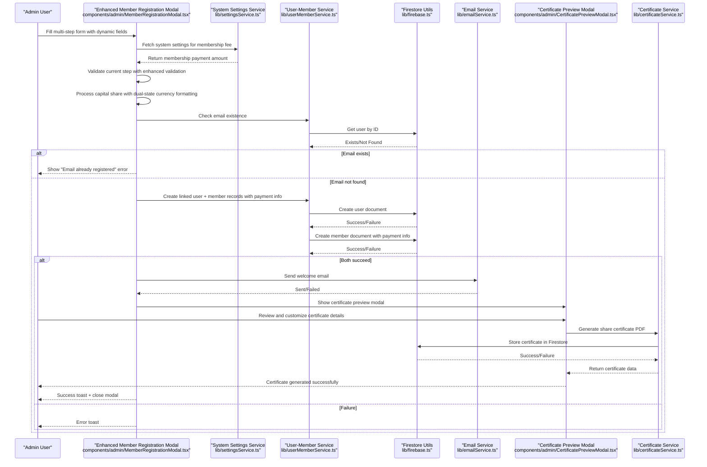
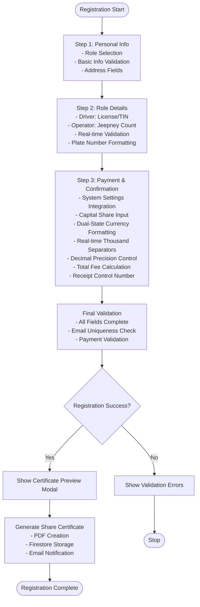
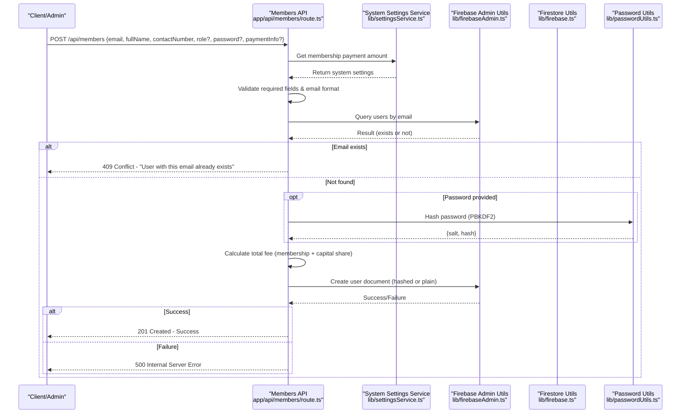
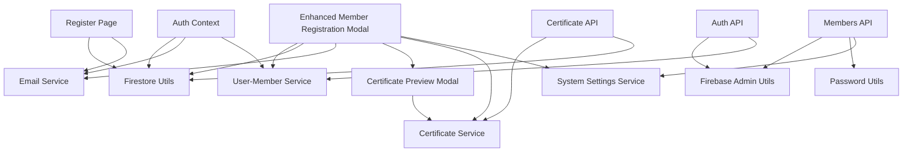

# Member Registration Workflow

<cite>
**Referenced Files in This Document**
- [page.tsx](file://app/register/page.tsx)
- [route.ts](file://app/api/members/route.ts)
- [firebase.ts](file://lib/firebase.ts)
- [passwordUtils.ts](file://lib/passwordUtils.ts)
- [userMemberService.ts](file://lib/userMemberService.ts)
- [emailService.ts](file://lib/emailService.ts)
- [auth.tsx](file://lib/auth.tsx)
- [Input.tsx](file://components/auth/Input.tsx)
- [Button.tsx](file://components/auth/Button.tsx)
- [MemberRegistrationModal.tsx](file://components/admin/MemberRegistrationModal.tsx)
- [CertificatePreviewModal.tsx](file://components/admin/CertificatePreviewModal.tsx)
- [certificateService.ts](file://lib/certificateService.ts)
- [route.ts](file://app/api/certificate/[memberId]/route.ts)
- [page.tsx](file://app/setup-password/page.tsx)
- [route.ts](file://app/api/setup-password/route.ts)
- [route.ts](file://app/api/auth/route.ts)
- [firebaseAdmin.ts](file://lib/firebaseAdmin.ts)
- [settingsService.ts](file://lib/settingsService.ts)
</cite>

## Update Summary
**Changes Made**
- Enhanced capital share input functionality with sophisticated dual-state currency formatting
- Implemented real-time thousand separators and decimal precision control
- Added multi-state display formatting (focused/blurred/initial states)
- Integrated sophisticated payment calculation system with system settings
- Enhanced real-time validation and user feedback mechanisms

## Table of Contents
1. [Introduction](#introduction)
2. [Project Structure](#project-structure)
3. [Core Components](#core-components)
4. [Architecture Overview](#architecture-overview)
5. [Detailed Component Analysis](#detailed-component-analysis)
6. [Dependency Analysis](#dependency-analysis)
7. [Performance Considerations](#performance-considerations)
8. [Troubleshooting Guide](#troubleshooting-guide)
9. [Conclusion](#conclusion)

## Introduction
This document explains the complete Member Registration Workflow within the SAMPA Cooperative Management System. It covers the end-to-end process from initial form submission through account activation, including API endpoints, front-end validation, automatic account creation, role assignment defaults, and integration with Firebase Authentication and Firestore. The workflow now includes enhanced multi-step validation, dynamic role-specific fields, integrated certificate preview functionality, and a comprehensive capital share payment system with sophisticated dual-state currency formatting, real-time thousand separators, decimal precision control, and multi-state display formatting.

## Project Structure
The registration workflow spans client-side pages, server-side API routes, and shared libraries for authentication, Firestore utilities, and email services. Key areas include:
- Front-end registration page with form validation and submission
- Enhanced Member Registration Modal with multi-step validation, dynamic fields, and sophisticated payment processing
- Certificate Preview Modal for interactive certificate generation
- API route for member creation with input validation and payment calculation
- Firestore utilities for database operations
- User-member linking service to maintain consistent IDs across collections
- Email service for sending welcome and password setup notifications
- Authentication context for login and role-based routing
- Certificate service for PDF generation and storage
- System settings service for dynamic fee configuration

```mermaid
graph TB
subgraph "Client-Side"
RP["Register Page<br/>app/register/page.tsx"]
MRM["Enhanced Member Registration Modal<br/>components/admin/MemberRegistrationModal.tsx"]
CPM["Certificate Preview Modal<br/>components/admin/CertificatePreviewModal.tsx"]
AUTHCTX["Auth Context<br/>lib/auth.tsx"]
INPUT["Input Component<br/>components/auth/Input.tsx"]
BTN["Button Component<br/>components/auth/Button.tsx"]
SETTINGS["System Settings Service<br/>lib/settingsService.ts"]
END
subgraph "Server-Side"
API_MEM["Members API Route<br/>app/api/members/route.ts"]
API_CERT["Certificate API Route<br/>app/api/certificate/[memberId]/route.ts"]
API_AUTH["Auth API Route<br/>app/api/auth/route.ts"]
API_SETUP["Setup Password API<br/>app/api/setup-password/route.ts"]
FB_ADMIN["Firebase Admin Utils<br/>lib/firebaseAdmin.ts"]
END
subgraph "Shared Services"
FIRESTORE["Firestore Utilities<br/>lib/firebase.ts"]
UMS["User-Member Service<br/>lib/userMemberService.ts"]
EMAIL["Email Service<br/>lib/emailService.ts"]
PWUTILS["Password Utils<br/>lib/passwordUtils.ts"]
CERTSERVICE["Certificate Service<br/>lib/certificateService.ts"]
END
RP --> INPUT
RP --> BTN
RP --> FIRESTORE
RP --> EMAIL
RP --> API_MEM
RP --> AUTHCTX
MRM --> FIRESTORE
MRM --> UMS
MRM --> EMAIL
MRM --> CPM
MRM --> CERTSERVICE
MRM --> SETTINGS
CPM --> CERTSERVICE
API_MEM --> FB_ADMIN
API_MEM --> FIRESTORE
API_MEM --> PWUTILS
API_CERT --> CERTSERVICE
API_CERT --> FIRESTORE
API_AUTH --> FB_ADMIN
API_AUTH --> UMS
API_SETUP --> FB_ADMIN
API_SETUP --> PWUTILS
AUTHCTX --> FIRESTORE
AUTHCTX --> EMAIL
```

**Diagram sources**
- [page.tsx:1-323](file://app/register/page.tsx#L1-L323)
- [route.ts:1-179](file://app/api/members/route.ts#L1-L179)
- [firebase.ts:1-309](file://lib/firebase.ts#L1-L309)
- [userMemberService.ts:1-287](file://lib/userMemberService.ts#L1-L287)
- [emailService.ts:1-113](file://lib/emailService.ts#L1-L113)
- [auth.tsx:1-682](file://lib/auth.tsx#L1-L682)
- [MemberRegistrationModal.tsx:1-1508](file://components/admin/MemberRegistrationModal.tsx#L1-L1508)
- [CertificatePreviewModal.tsx:1-532](file://components/admin/CertificatePreviewModal.tsx#L1-L532)
- [certificateService.ts:1-410](file://lib/certificateService.ts#L1-L410)
- [route.ts:1-68](file://app/api/certificate/[memberId]/route.ts#L1-L68)
- [route.ts:1-295](file://app/api/auth/route.ts#L1-L295)
- [route.ts:1-177](file://app/api/setup-password/route.ts#L1-L177)
- [firebaseAdmin.ts:1-277](file://lib/firebaseAdmin.ts#L1-L277)
- [settingsService.ts:1-54](file://lib/settingsService.ts#L1-L54)

**Section sources**
- [page.tsx:1-323](file://app/register/page.tsx#L1-L323)
- [route.ts:1-179](file://app/api/members/route.ts#L1-L179)
- [firebase.ts:1-309](file://lib/firebase.ts#L1-L309)
- [userMemberService.ts:1-287](file://lib/userMemberService.ts#L1-L287)
- [emailService.ts:1-113](file://lib/emailService.ts#L1-L113)
- [auth.tsx:1-682](file://lib/auth.tsx#L1-L682)
- [MemberRegistrationModal.tsx:1-1508](file://components/admin/MemberRegistrationModal.tsx#L1-L1508)
- [CertificatePreviewModal.tsx:1-532](file://components/admin/CertificatePreviewModal.tsx#L1-L532)
- [certificateService.ts:1-410](file://lib/certificateService.ts#L1-L410)
- [route.ts:1-68](file://app/api/certificate/[memberId]/route.ts#L1-L68)
- [route.ts:1-295](file://app/api/auth/route.ts#L1-L295)
- [route.ts:1-177](file://app/api/setup-password/route.ts#L1-L177)
- [firebaseAdmin.ts:1-277](file://lib/firebaseAdmin.ts#L1-L277)
- [settingsService.ts:1-54](file://lib/settingsService.ts#L1-L54)

## Core Components
- **Enhanced Member Registration Modal**: Multi-step form with dynamic fields for Driver/Operator roles, advanced validation, real-time license number formatting, integrated certificate preview functionality, and comprehensive payment processing with sophisticated capital share input system featuring dual-state currency formatting.
- **Certificate Preview Modal**: Interactive modal for reviewing and customizing share certificates before generation, featuring real-time preview with editable fields and formal certificate design.
- **Advanced Certificate Service**: Comprehensive PDF generation service with official cooperative styling, automatic data extraction, and Firestore integration for certificate storage.
- **Dynamic Validation System**: Enhanced form validation with step-by-step validation, role-specific field requirements, real-time license number validation, dynamic plate number field management, and strict input formatting.
- **System Settings Integration**: Dynamic membership fee calculation based on system configuration, ensuring consistent fee amounts across the application.
- **Sophisticated Capital Share Payment System**: Enhanced payment processing feature with dual-state currency formatting, real-time thousand separators, decimal precision control, and multi-state display formatting (focused/blurred/initial states).
- **Strict Jeepney Plate Number Validation**: Enhanced validation system for jeepney plate numbers with automatic uppercase conversion, hyphen insertion, and format enforcement (ABC-1234 pattern).
- **Register Page**: Client-side form with validation, email uniqueness check, and password hashing prior to Firestore write.
- **Members API Route**: Server-side endpoint for creating members with robust input validation, email format checks, duplicate detection, and PBKDF2-based password hashing.
- **Firestore Utilities**: Unified client-side Firestore helpers for set/get/query/update/delete operations with error handling.
- **User-Member Service**: Ensures consistent user ID across users and members collections, email existence checks, and automatic linkage validation/repair.
- **Email Service**: Sends welcome and password setup emails via EmailJS with configurable templates.
- **Authentication Context**: Manages user state, role-based routing, and login flow with timing-safe comparisons and secure password verification.
- **Setup Password API**: Handles password setup for accounts that were created without an initial password, enforcing PBKDF2 hashing and preventing duplicate setups.

**Section sources**
- [MemberRegistrationModal.tsx:1-1508](file://components/admin/MemberRegistrationModal.tsx#L1-L1508)
- [CertificatePreviewModal.tsx:1-532](file://components/admin/CertificatePreviewModal.tsx#L1-L532)
- [certificateService.ts:1-410](file://lib/certificateService.ts#L1-L410)
- [page.tsx:1-323](file://app/register/page.tsx#L1-L323)
- [route.ts:1-179](file://app/api/members/route.ts#L1-L179)
- [firebase.ts:89-309](file://lib/firebase.ts#L89-L309)
- [userMemberService.ts:1-287](file://lib/userMemberService.ts#L1-L287)
- [emailService.ts:1-113](file://lib/emailService.ts#L1-L113)
- [auth.tsx:1-682](file://lib/auth.tsx#L1-L682)
- [route.ts:1-177](file://app/api/setup-password/route.ts#L1-L177)
- [settingsService.ts:1-54](file://lib/settingsService.ts#L1-L54)

## Architecture Overview
The registration workflow integrates client-side forms, server-side APIs, and Firestore. Two complementary flows exist with enhanced certificate integration and comprehensive payment processing:
- Direct registration via the Register Page (client-side hashing and Firestore write)
- Admin-driven registration via the Enhanced Member Registration Modal (server-side hashing, user-member linking, integrated certificate generation, and sophisticated payment processing)



**Diagram sources**
- [MemberRegistrationModal.tsx:237-415](file://components/admin/MemberRegistrationModal.tsx#L237-L415)
- [settingsService.ts:19-35](file://lib/settingsService.ts#L19-L35)
- [userMemberService.ts:23-92](file://lib/userMemberService.ts#L23-L92)
- [firebase.ts:90-113](file://lib/firebase.ts#L90-L113)
- [emailService.ts:41-67](file://lib/emailService.ts#L41-L67)
- [CertificatePreviewModal.tsx:107-119](file://components/admin/CertificatePreviewModal.tsx#L107-L119)
- [certificateService.ts:12-277](file://lib/certificateService.ts#L12-L277)

## Detailed Component Analysis

### Enhanced Member Registration Modal (Admin-Driven)
**Updated** Enhanced with improved multi-step form validation, dynamic role-specific fields, integrated certificate preview functionality, and sophisticated payment processing system featuring dual-state currency formatting.

- **Multi-step Validation System**: Implements `validateCurrentStep()` function for step-by-step validation with dynamic field requirements based on selected role.
- **Dynamic Role Fields**: Role-specific fields appear based on Driver/Operator selection with conditional validation for address, license numbers, and jeepney information.
- **Real-time License Validation**: Advanced license number validation with auto-formatting for both Driver and Operator licenses (format: A12-34-567890 for Drivers, XXX-XXX-XXX-XXXXX for Operators).
- **Dynamic Plate Number Management**: Automatic generation of plate number input fields based on jeepney count with individual validation for each plate number using strict format validation (ABC-1234 pattern).
- **System Settings Integration**: Dynamic membership fee calculation from system configuration with formatted currency display and automatic total fee computation.
- **Sophisticated Capital Share Payment System**: Enhanced payment processing feature with dual-state currency formatting, real-time thousand separators, decimal precision control, and multi-state display formatting (focused/blurred/initial states).
- **Strict Input Formatting**: Enhanced input formatting with automatic uppercase conversion and hyphen insertion for license numbers, TIN IDs, and jeepney plate numbers.
- **Certificate Preview Integration**: Seamless integration with Certificate Preview Modal for immediate certificate generation after registration.
- **Progress Tracking**: Visual progress indicators showing current step completion status.



**Diagram sources**
- [MemberRegistrationModal.tsx:127-168](file://components/admin/MemberRegistrationModal.tsx#L127-L168)
- [MemberRegistrationModal.tsx:237-276](file://components/admin/MemberRegistrationModal.tsx#L237-L276)
- [MemberRegistrationModal.tsx:424-464](file://components/admin/MemberRegistrationModal.tsx#L424-L464)
- [MemberRegistrationModal.tsx:1356-1444](file://components/admin/MemberRegistrationModal.tsx#L1356-L1444)

**Section sources**
- [MemberRegistrationModal.tsx:1-1508](file://components/admin/MemberRegistrationModal.tsx#L1-L1508)
- [settingsService.ts:19-54](file://lib/settingsService.ts#L19-L54)
- [userMemberService.ts:23-92](file://lib/userMemberService.ts#L23-L92)
- [emailService.ts:41-67](file://lib/emailService.ts#L41-L67)

### Sophisticated Capital Share Input System
**New** Enhanced capital share input functionality with sophisticated dual-state currency formatting, real-time thousand separators, decimal precision control, and multi-state display formatting.

- **Dual-State Currency Formatting**: The capital share input features sophisticated dual-state formatting that displays simplified numbers during editing and precise two-decimal formatting when blurred.
- **Real-time Thousand Separators**: Automatically inserts thousand separators (commas) as users type, improving readability of large amounts.
- **Decimal Precision Control**: Limits input to two decimal places while allowing flexible editing during focus state.
- **Multi-State Display Formatting**: 
  - **Focused State**: Shows simplified format (e.g., "1,234.56") for easy editing
  - **Blurred State**: Shows standardized format with trailing zeros (e.g., "1,234.56")
  - **Initial State**: Empty placeholder until user interaction begins
- **Advanced Input Processing**: 
  - Removes non-numeric characters except decimal points
  - Handles multiple decimal points by keeping only the first occurrence
  - Parses values to numbers for storage while maintaining formatted display
- **Real-time Total Calculation**: Automatically updates total fee calculation as users type capital share amounts.
- **Currency Symbol Integration**: Includes Philippine Peso symbol (₱) with proper positioning and styling.

**Section sources**
- [MemberRegistrationModal.tsx:109-111](file://components/admin/MemberRegistrationModal.tsx#L109-L111)
- [MemberRegistrationModal.tsx:1361-1444](file://components/admin/MemberRegistrationModal.tsx#L1361-L1444)

### Certificate Preview Modal
**New** Interactive modal for reviewing and customizing share certificates before generation.

- **Interactive Preview**: Real-time preview of share certificate with editable fields for customization.
- **Formal Certificate Design**: Professional green-themed design with official cooperative styling and legal text.
- **Editable Fields**: All certificate details are editable including certificate number, shares, cooperative name, and officer signatures.
- **Validation Integration**: Ensures all required fields (secretary and chairman names) are completed before certificate generation.
- **Confirmation Dialog**: Secure confirmation dialog with certificate details review before final generation.
- **Loading States**: Proper loading states during certificate generation with visual feedback.

**Section sources**
- [CertificatePreviewModal.tsx:1-532](file://components/admin/CertificatePreviewModal.tsx#L1-L532)

### Certificate Service
**Updated** Enhanced with comprehensive PDF generation and storage capabilities.

- **Professional PDF Generation**: Uses jsPDF library to create official share certificates with proper formatting and styling.
- **Automatic Data Processing**: Extracts member data and generates certificate details automatically.
- **Firestore Integration**: Stores certificate data in Firestore with proper indexing and retrieval capabilities.
- **Email Notification**: Integrates with email service to notify members of certificate availability.
- **Format Flexibility**: Supports various certificate types with consistent styling and professional appearance.

**Section sources**
- [certificateService.ts:1-410](file://lib/certificateService.ts#L1-L410)

### Register Page (Direct Registration)
- Purpose: Allows users to self-register with client-side validation and password hashing.
- Validation:
  - Full name required
  - Contact number numeric only
  - Email format validation
  - Role selection required
  - Password minimum length and character requirements
  - Password confirmation matching
- Uniqueness Check: Queries Firestore for existing user by email before submission.
- Password Hashing: Uses PBKDF2 with 100k iterations and SHA-256, storing base64-encoded hash and salt.
- Submission: Writes user document to Firestore with role, timestamps, and hashed credentials.
- Feedback: Toast notifications for success/error; redirects to login on success.


**Diagram sources**
- [page.tsx:72-210](file://app/register/page.tsx#L72-L210)
- [firebase.ts:184-240](file://lib/firebase.ts#L184-L240)
- [emailService.ts:41-67](file://lib/emailService.ts#L41-L67)

**Section sources**
- [page.tsx:1-323](file://app/register/page.tsx#L1-L323)
- [Input.tsx:1-27](file://components/auth/Input.tsx#L1-L27)
- [Button.tsx:1-51](file://components/auth/Button.tsx#L1-L51)

### Members API Route (Admin/Server Registration)
- Purpose: Server-side endpoint to create members with strong validation and PBKDF2 hashing.
- Validation:
  - Required fields: email, full name, contact number
  - Email format regex
  - Duplicate email detection via Firestore query
- Payment Processing:
  - Accepts payment information including membership fee, capital share, and total fee
  - Validates payment method and status
  - Calculates total fee from system settings and capital share
- Password Handling:
  - Accepts optional password; if provided, hashes using PBKDF2 with 100k iterations and SHA-256
  - Stores base64-encoded salt and hash
- Role Assignment: Normalizes role to lowercase; default is applied if omitted.
- Response: JSON success with created user data or error with appropriate HTTP status.



**Diagram sources**
- [route.ts:67-158](file://app/api/members/route.ts#L67-L158)
- [settingsService.ts:19-35](file://lib/settingsService.ts#L19-L35)
- [firebaseAdmin.ts:150-194](file://lib/firebaseAdmin.ts#L150-L194)
- [passwordUtils.ts:64-92](file://lib/passwordUtils.ts#L64-L92)

**Section sources**
- [route.ts:1-179](file://app/api/members/route.ts#L1-L179)
- [settingsService.ts:19-54](file://lib/settingsService.ts#L19-L54)
- [passwordUtils.ts:1-146](file://lib/passwordUtils.ts#L1-L146)

### System Settings Service
**New** Dynamic configuration service for managing system-wide settings including membership fees.

- **Dynamic Configuration**: Fetches system settings from Firestore with default fallback values.
- **Membership Fee Management**: Provides dynamic membership payment amounts that can be adjusted system-wide.
- **Currency Formatting**: Formats amounts as Philippine Peso currency with proper localization.
- **Default Values**: Ensures consistent behavior even when settings are not configured.

**Section sources**
- [settingsService.ts:1-54](file://lib/settingsService.ts#L1-L54)

### Firestore Utilities
- Provides unified helpers for set, get, query, update, delete operations with validation and error handling.
- Client-side helpers ensure Firestore is initialized and accessible before operations.
- Server-side admin helpers wrap Firebase Admin SDK with consistent return shapes.

**Section sources**
- [firebase.ts:89-309](file://lib/firebase.ts#L89-L309)
- [firebaseAdmin.ts:110-277](file://lib/firebaseAdmin.ts#L110-L277)

### User-Member Service
- Enforces a single source of truth for user identification by generating consistent IDs from normalized emails.
- Creates linked user and member records atomically; on failure, rolls back user creation.
- Validates and repairs user-member linkage on login, ensuring both collections remain synchronized.
- Provides email existence checks and batched updates across both collections.
- **Updated** Now includes payment information in member documents for comprehensive registration processing.

**Section sources**
- [userMemberService.ts:1-287](file://lib/userMemberService.ts#L1-L287)

### Email Service
- Sends templated emails via EmailJS with configurable keys and templates.
- Includes welcome email for new members and password setup notifications.
- Returns boolean success/failure for downstream handling.

**Section sources**
- [emailService.ts:1-113](file://lib/emailService.ts#L1-L113)

### Authentication Context and Login Flow
- Provides sign-in/sign-up/createUser/customLogin functions with role-based routing.
- Uses timing-safe comparisons to prevent timing attacks during password verification.
- Supports password setup requirement signaling to redirect users to setup-password page.
- Maintains user state and sets cookies for session persistence.

**Section sources**
- [auth.tsx:1-682](file://lib/auth.tsx#L1-L682)
- [route.ts:1-295](file://app/api/auth/route.ts#L1-L295)

### Setup Password API
- Handles password setup for accounts that were created without an initial password.
- Validates email format and ensures account exists and password is not already set.
- Hashes the provided password using PBKDF2 and updates the user document with salt, hash, and flags.

**Section sources**
- [page.tsx:1-207](file://app/setup-password/page.tsx#L1-L207)
- [route.ts:1-177](file://app/api/setup-password/route.ts#L1-L177)
- [passwordUtils.ts:64-92](file://lib/passwordUtils.ts#L64-L92)

## Dependency Analysis
The registration workflow exhibits clear separation of concerns with enhanced certificate integration and comprehensive payment processing:
- Client-side registration depends on Firestore utilities and email service.
- Enhanced server-side registration depends on Firebase Admin utilities, password utilities, certificate service, and system settings service.
- Both flows rely on user-member service for consistent identity management.
- Authentication context coordinates login and role-based routing.
- Certificate service provides PDF generation and storage capabilities.
- Certificate preview modal integrates with certificate service for interactive certificate management.
- System settings service provides dynamic configuration for membership fees.
- **Updated** Sophisticated capital share input system integrates with dual-state currency formatting and real-time validation.



**Diagram sources**
- [page.tsx:1-323](file://app/register/page.tsx#L1-L323)
- [route.ts:1-179](file://app/api/members/route.ts#L1-L179)
- [firebase.ts:1-309](file://lib/firebase.ts#L1-L309)
- [userMemberService.ts:1-287](file://lib/userMemberService.ts#L1-L287)
- [emailService.ts:1-113](file://lib/emailService.ts#L1-L113)
- [auth.tsx:1-682](file://lib/auth.tsx#L1-L682)
- [MemberRegistrationModal.tsx:1-1508](file://components/admin/MemberRegistrationModal.tsx#L1-L1508)
- [CertificatePreviewModal.tsx:1-532](file://components/admin/CertificatePreviewModal.tsx#L1-L532)
- [certificateService.ts:1-410](file://lib/certificateService.ts#L1-L410)
- [route.ts:1-68](file://app/api/certificate/[memberId]/route.ts#L1-L68)
- [route.ts:1-295](file://app/api/auth/route.ts#L1-L295)
- [firebaseAdmin.ts:1-277](file://lib/firebaseAdmin.ts#L1-L277)
- [passwordUtils.ts:1-146](file://lib/passwordUtils.ts#L1-L146)
- [settingsService.ts:1-54](file://lib/settingsService.ts#L1-L54)

**Section sources**
- [page.tsx:1-323](file://app/register/page.tsx#L1-L323)
- [route.ts:1-179](file://app/api/members/route.ts#L1-L179)
- [firebase.ts:1-309](file://lib/firebase.ts#L1-L309)
- [userMemberService.ts:1-287](file://lib/userMemberService.ts#L1-L287)
- [emailService.ts:1-113](file://lib/emailService.ts#L1-L113)
- [auth.tsx:1-682](file://lib/auth.tsx#L1-L682)
- [MemberRegistrationModal.tsx:1-1508](file://components/admin/MemberRegistrationModal.tsx#L1-L1508)
- [CertificatePreviewModal.tsx:1-532](file://components/admin/CertificatePreviewModal.tsx#L1-L532)
- [certificateService.ts:1-410](file://lib/certificateService.ts#L1-L410)
- [route.ts:1-68](file://app/api/certificate/[memberId]/route.ts#L1-L68)
- [route.ts:1-295](file://app/api/auth/route.ts#L1-L295)
- [firebaseAdmin.ts:1-277](file://lib/firebaseAdmin.ts#L1-L277)
- [passwordUtils.ts:1-146](file://lib/passwordUtils.ts#L1-L146)
- [settingsService.ts:1-54](file://lib/settingsService.ts#L1-L54)

## Performance Considerations
- Client-side hashing reduces server load but increases client CPU usage; acceptable for modern browsers.
- PBKDF2 iteration count balances security and performance; ensure consistent hashing across client and server.
- Firestore queries for email uniqueness should be indexed appropriately to minimize latency.
- Email sending is asynchronous; consider queueing for high-volume scenarios.
- Parallelize user-member writes only when safe; rollback on failure to maintain consistency.
- **Updated** Sophisticated capital share input system uses efficient real-time formatting with minimal DOM manipulation overhead.
- **Updated** Dual-state currency formatting optimizes user experience while maintaining performance through careful state management.
- **Updated** Real-time validation provides immediate feedback without excessive server requests.
- **Updated** Dynamic field generation optimizes form rendering based on role selection.
- **Updated** System settings caching reduces repeated Firestore queries for membership fees.
- **Updated** Payment calculation occurs client-side for immediate feedback, with server-side validation for security.

## Troubleshooting Guide
Common validation errors and resolutions:
- Email already exists:
  - Client-side: Occurs when Firestore query finds a user with the same email.
  - Server-side: Returned as conflict (409) when duplicate detected.
  - Resolution: Prompt user to use another email or initiate password reset flow.
- Invalid email format:
  - Client-side: Regex validation fails.
  - Server-side: Regex validation fails.
  - Resolution: Ensure proper email formatting before submission.
- Password requirements not met:
  - Client-side: Minimum length and character class checks.
  - Server-side: PBKDF2 hashing requires minimum length; ensure client enforces the same rules.
  - Resolution: Align client and server validation rules.
- Password confirmation mismatch:
  - Client-side: Confirmation field must match password.
  - Resolution: Clear error on input change and re-validate on submit.
- **Updated** Capital share input validation failures:
  - Dual-state formatting issues: Ensure proper state transitions between focused and blurred states.
  - Real-time thousand separator problems: Verify regex patterns for non-numeric character removal.
  - Decimal precision errors: Check that input is limited to two decimal places during editing.
  - Multi-state display inconsistencies: Ensure proper handling of empty states and zero values.
  - Resolution: Test each state transition and verify formatting consistency across all states.
- **Updated** License number validation failures:
  - Real-time validation prevents invalid formats; ensure proper format (A12-34-567890 for Drivers, XXX-XXX-XXX-XXXXX for Operators).
  - Resolution: Use auto-formatting feature or manually enter correct format.
- **Updated** Dynamic field validation errors:
  - Plate numbers require individual validation; ensure all plate numbers meet strict ABC-1234 format requirements.
  - Membership fee validation uses system settings; verify system configuration.
  - Capital share input requires numeric values with minimum increments of 100.
  - Resolution: Check system settings and ensure all dynamic fields are properly filled.
- **Updated** Payment processing failures:
  - Total fee calculation requires both membership payment and capital share inputs.
  - Receipt control number is mandatory for payment confirmation.
  - Resolution: Verify payment details and ensure receipt control number is entered.
- **Updated** Certificate generation failures:
  - PDF generation requires all certificate fields to be completed.
  - Firestore storage errors can occur if certificate data is malformed.
  - Resolution: Verify certificate details and check Firestore connectivity.
- **Updated** System settings errors:
  - Membership payment amounts must be numeric and positive.
  - Default values are used if settings are unavailable.
  - Resolution: Check system settings configuration and Firestore connectivity.
- Firestore connectivity issues:
  - Client-side: Initialization or permission errors.
  - Server-side: Admin SDK initialization errors or missing credentials.
  - Resolution: Verify environment variables and Firebase configuration; check Firestore rules.
- Authentication failures:
  - Incorrect password or unverified account.
  - Resolution: Ensure password is set; use setup-password flow if needed.

Security considerations:
- Password hashing: PBKDF2 with 100k iterations and SHA-256; store salt and hash separately.
- Timing-safe comparisons: Prevent timing attacks during password verification.
- Role validation: Enforce allowed roles server-side to prevent privilege escalation.
- Email verification: Implement email verification flow to confirm ownership.
- Data privacy: Comply with applicable regulations; minimize stored PII; encrypt sensitive fields if required.
- **Updated** Capital share security: Sophisticated input processing prevents injection attacks while maintaining usability.
- **Updated** Real-time validation: Client-side validation prevents invalid data entry before server processing.
- **Updated** Payment security: Total fee calculation is performed client-side for immediate feedback but validated server-side for security.

**Section sources**
- [page.tsx:72-133](file://app/register/page.tsx#L72-L133)
- [route.ts:72-93](file://app/api/members/route.ts#L72-L93)
- [firebase.ts:62-87](file://lib/firebase.ts#L62-L87)
- [firebaseAdmin.ts:13-108](file://lib/firebaseAdmin.ts#L13-L108)
- [auth.tsx:97-109](file://lib/auth.tsx#L97-L109)
- [route.ts:128-140](file://app/api/auth/route.ts#L128-L140)
- [MemberRegistrationModal.tsx:1020-1072](file://components/admin/MemberRegistrationModal.tsx#L1020-L1072)
- [MemberRegistrationModal.tsx:1183-1227](file://components/admin/MemberRegistrationModal.tsx#L1183-L1227)
- [MemberRegistrationModal.tsx:1356-1444](file://components/admin/MemberRegistrationModal.tsx#L1356-L1444)
- [CertificatePreviewModal.tsx:455-473](file://components/admin/CertificatePreviewModal.tsx#L455-L473)
- [settingsService.ts:19-35](file://lib/settingsService.ts#L19-L35)

## Conclusion
The SAMPA Cooperative Management System implements a robust and secure member registration workflow supporting both self-registration and admin-driven registration. The enhanced Member Registration Modal provides a comprehensive multi-step validation system with dynamic role-specific fields, real-time license number validation, integrated certificate preview functionality, and a sophisticated capital share payment system with dual-state currency formatting, real-time thousand separators, decimal precision control, and multi-state display formatting. The workflow seamlessly integrates certificate generation with professional PDF creation, ensuring members receive official share certificates immediately after registration. Client-side and server-side flows share consistent validation, hashing, and error handling patterns, while user-member linking ensures data integrity across collections. The integration with Firestore, EmailJS, certificate service, and system settings provides a reliable foundation for user onboarding, complemented by strong security practices, comprehensive troubleshooting guidance, and dynamic payment processing capabilities. The addition of sophisticated capital share input functionality significantly enhances the system's ability to manage cooperative membership fees with improved user experience and data quality standards.