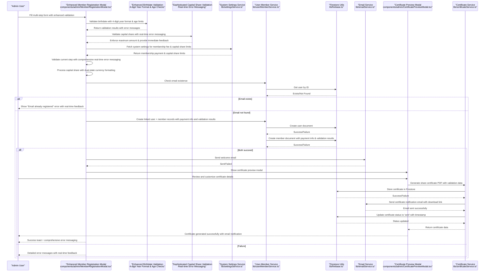
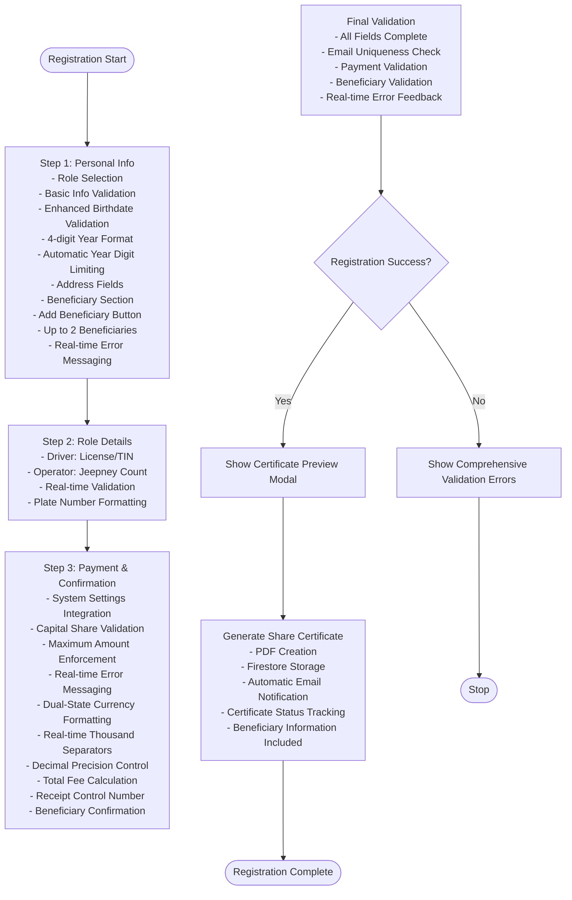
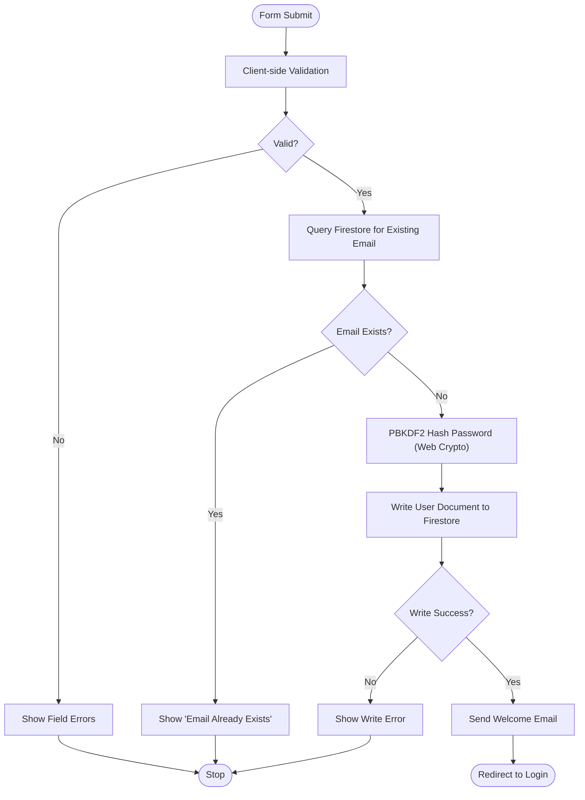
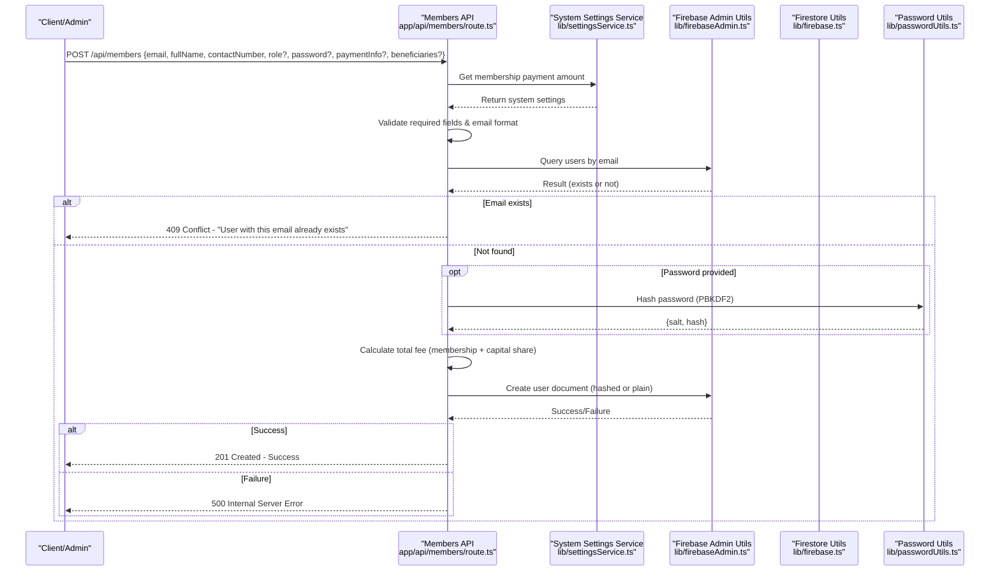
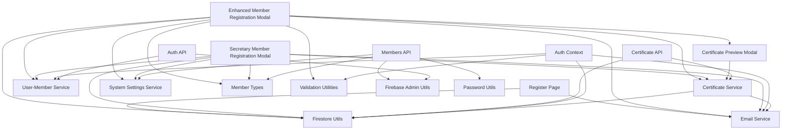

# Member Registration Workflow

<cite>
**Referenced Files in This Document**
- [page.tsx](file://app/register/page.tsx)
- [route.ts](file://app/api/members/route.ts)
- [firebase.ts](file://lib/firebase.ts)
- [passwordUtils.ts](file://lib/passwordUtils.ts)
- [userMemberService.ts](file://lib/userMemberService.ts)
- [emailService.ts](file://lib/emailService.ts)
- [auth.tsx](file://lib/auth.tsx)
- [Input.tsx](file://components/auth/Input.tsx)
- [Button.tsx](file://components/auth/Button.tsx)
- [MemberRegistrationModal.tsx](file://components/admin/MemberRegistrationModal.tsx)
- [SecretaryMemberRegistrationModal.tsx](file://app/admin/secretary/components/SecretaryMemberRegistrationModal.tsx)
- [CertificatePreviewModal.tsx](file://components/admin/CertificatePreviewModal.tsx)
- [certificateService.ts](file://lib/certificateService.ts)
- [route.ts](file://app/api/certificate/[memberId]/route.ts)
- [page.tsx](file://app/setup-password/page.tsx)
- [route.ts](file://app/api/setup-password/route.ts)
- [route.ts](file://app/api/auth/route.ts)
- [firebaseAdmin.ts](file://lib/firebaseAdmin.ts)
- [settingsService.ts](file://lib/settingsService.ts)
- [member.ts](file://lib/types/member.ts)
- [validators.ts](file://lib/validators.ts)
- [MemberDetailsModal.tsx](file://components/admin/MemberDetailsModal.tsx)
</cite>

## Update Summary
**Changes Made**
- Enhanced certificate generation workflow with automatic email notification system
- Added comprehensive certificate notification email functionality with download link
- Integrated certificate status tracking with Firestore member_certificates collection
- Improved certificate generation process with automatic email confirmation
- Enhanced certificate preview modal with automatic email notification capability
- Added certificate status management with generated/sent states

## Table of Contents
1. [Introduction](#introduction)
2. [Project Structure](#project-structure)
3. [Core Components](#core-components)
4. [Architecture Overview](#architecture-overview)
5. [Detailed Component Analysis](#detailed-component-analysis)
6. [Dependency Analysis](#dependency-analysis)
7. [Performance Considerations](#performance-considerations)
8. [Troubleshooting Guide](#troubleshooting-guide)
9. [Conclusion](#conclusion)

## Introduction
This document explains the complete Member Registration Workflow within the SAMPA Cooperative Management System. It covers the end-to-end process from initial form submission through account activation, including API endpoints, front-end validation, automatic account creation, role assignment defaults, integration with Firebase Authentication and Firestore, and the enhanced certificate notification system. The workflow now includes sophisticated certificate generation with automatic email notifications, comprehensive status tracking, and seamless integration between certificate creation and member onboarding.

## Project Structure
The registration workflow spans client-side pages, server-side API routes, and shared libraries for authentication, Firestore utilities, and email services. Key areas include:
- Front-end registration page with form validation and submission
- Enhanced Member Registration Modal with multi-step validation, dynamic fields, beneficiary management, sophisticated payment processing, improved birthdate validation, comprehensive real-time error messaging, and integrated certificate notification system
- Certificate Preview Modal for interactive certificate generation with automatic email notification
- API route for member creation with input validation and payment calculation
- Firestore utilities for database operations including certificate status tracking
- User-member linking service to maintain consistent IDs across collections
- Email service for sending welcome and certificate notification emails
- Authentication context for login and role-based routing
- Certificate service for PDF generation, storage, and automatic email notification
- System settings service for dynamic fee configuration
- Beneficiary management system for cooperative member designation
- Comprehensive validation utilities for route protection and access control

```mermaid
graph TB
subgraph "Client-Side"
RP["Register Page<br/>app/register/page.tsx"]
MRM["Enhanced Member Registration Modal<br/>components/admin/MemberRegistrationModal.tsx"]
SMRM["Secretary Member Registration Modal<br/>app/admin/secretary/components/SecretaryMemberRegistrationModal.tsx"]
CPM["Certificate Preview Modal<br/>components/admin/CertificatePreviewModal.tsx"]
AUTHCTX["Auth Context<br/>lib/auth.tsx"]
INPUT["Input Component<br/>components/auth/Input.tsx"]
BTN["Button Component<br/>components/auth/Button.tsx"]
SETTINGS["System Settings Service<br/>lib/settingsService.ts"]
MEMBERTYPES["Member Types<br/>lib/types/member.ts"]
VALIDATORS["Validation Utilities<br/>lib/validators.ts"]
END
subgraph "Server-Side"
API_MEM["Members API Route<br/>app/api/members/route.ts"]
API_CERT["Certificate API Route<br/>app/api/certificate/[memberId]/route.ts"]
API_AUTH["Auth API Route<br/>app/api/auth/route.ts"]
API_SETUP["Setup Password API<br/>app/api/setup-password/route.ts"]
FB_ADMIN["Firebase Admin Utils<br/>lib/firebaseAdmin.ts"]
END
subgraph "Shared Services"
FIRESTORE["Firestore Utilities<br/>lib/firebase.ts"]
UMS["User-Member Service<br/>lib/userMemberService.ts"]
EMAIL["Email Service<br/>lib/emailService.ts"]
PWUTILS["Password Utils<br/>lib/passwordUtils.ts"]
CERTSERVICE["Certificate Service<br/>lib/certificateService.ts"]
END
RP --> INPUT
RP --> BTN
RP --> FIRESTORE
RP --> EMAIL
RP --> API_MEM
RP --> AUTHCTX
MRM --> FIRESTORE
MRM --> UMS
MRM --> EMAIL
MRM --> CPM
MRM --> CERTSERVICE
MRM --> SETTINGS
MRM --> MEMBERTYPES
MRM --> VALIDATORS
SMRM --> FIRESTORE
SMRM --> UMS
SMRM --> EMAIL
SMRM --> CERTSERVICE
SMRM --> SETTINGS
SMRM --> MEMBERTYPES
CPM --> CERTSERVICE
API_MEM --> FB_ADMIN
API_MEM --> FIRESTORE
API_MEM --> PWUTILS
API_CERT --> CERTSERVICE
API_CERT --> FIRESTORE
API_AUTH --> FB_ADMIN
API_AUTH --> UMS
API_SETUP --> FB_ADMIN
API_SETUP --> PWUTILS
AUTHCTX --> FIRESTORE
AUTHCTX --> EMAIL
```

**Diagram sources**
- [page.tsx:1-323](file://app/register/page.tsx#L1-L323)
- [route.ts:1-179](file://app/api/members/route.ts#L1-L179)
- [firebase.ts:1-309](file://lib/firebase.ts#L1-L309)
- [userMemberService.ts:1-289](file://lib/userMemberService.ts#L1-L289)
- [emailService.ts:1-113](file://lib/emailService.ts#L1-L113)
- [auth.tsx:1-682](file://lib/auth.tsx#L1-L682)
- [MemberRegistrationModal.tsx:1-1734](file://components/admin/MemberRegistrationModal.tsx#L1-L1734)
- [SecretaryMemberRegistrationModal.tsx:496-525](file://app/admin/secretary/components/SecretaryMemberRegistrationModal.tsx#L496-L525)
- [CertificatePreviewModal.tsx:1-532](file://components/admin/CertificatePreviewModal.tsx#L1-L532)
- [certificateService.ts:1-410](file://lib/certificateService.ts#L1-L410)
- [route.ts:1-68](file://app/api/certificate/[memberId]/route.ts#L1-L68)
- [route.ts:1-295](file://app/api/auth/route.ts#L1-L295)
- [route.ts:1-177](file://app/api/setup-password/route.ts#L1-L177)
- [firebaseAdmin.ts:1-277](file://lib/firebaseAdmin.ts#L1-L277)
- [settingsService.ts:1-56](file://lib/settingsService.ts#L1-L56)
- [member.ts:1-85](file://lib/types/member.ts#L1-L85)
- [validators.ts:1-236](file://lib/validators.ts#L1-L236)

**Section sources**
- [page.tsx:1-323](file://app/register/page.tsx#L1-L323)
- [route.ts:1-179](file://app/api/members/route.ts#L1-L179)
- [firebase.ts:1-309](file://lib/firebase.ts#L1-L309)
- [userMemberService.ts:1-289](file://lib/userMemberService.ts#L1-L289)
- [emailService.ts:1-113](file://lib/emailService.ts#L1-L113)
- [auth.tsx:1-682](file://lib/auth.tsx#L1-L682)
- [MemberRegistrationModal.tsx:1-1734](file://components/admin/MemberRegistrationModal.tsx#L1-L1734)
- [SecretaryMemberRegistrationModal.tsx:496-525](file://app/admin/secretary/components/SecretaryMemberRegistrationModal.tsx#L496-L525)
- [CertificatePreviewModal.tsx:1-532](file://components/admin/CertificatePreviewModal.tsx#L1-L532)
- [certificateService.ts:1-410](file://lib/certificateService.ts#L1-L410)
- [route.ts:1-68](file://app/api/certificate/[memberId]/route.ts#L1-L68)
- [route.ts:1-295](file://app/api/auth/route.ts#L1-L295)
- [route.ts:1-177](file://app/api/setup-password/route.ts#L1-L177)
- [firebaseAdmin.ts:1-277](file://lib/firebaseAdmin.ts#L1-L277)
- [settingsService.ts:1-56](file://lib/settingsService.ts#L1-L56)
- [member.ts:1-85](file://lib/types/member.ts#L1-L85)
- [validators.ts:1-236](file://lib/validators.ts#L1-L236)

## Core Components
- **Enhanced Member Registration Modal**: Multi-step form with dynamic fields for Driver/Operator roles, advanced validation, real-time license number formatting, integrated certificate preview functionality with automatic email notification, comprehensive payment processing, improved birthdate validation with 4-digit year enforcement, automatic year digit limiting, sophisticated capital share validation with real-time error messaging, and comprehensive beneficiary management system supporting up to two beneficiaries per member registration.
- **Secretary Member Registration Modal**: Simplified version of the registration modal with streamlined birthdate validation and basic form fields for secretary-level access, including integrated certificate notification system.
- **Certificate Preview Modal**: Interactive modal for reviewing and customizing share certificates before generation, featuring real-time preview with editable fields, formal certificate design, and automatic email notification capability.
- **Advanced Certificate Service**: Comprehensive PDF generation service with official cooperative styling, automatic data extraction, Firestore integration for certificate storage, and automatic email notification system.
- **Enhanced Certificate Notification System**: Sophisticated email notification system that automatically sends certificate generation completion notifications to members with download links and status tracking.
- **Dynamic Validation System**: Enhanced form validation with step-by-step validation, role-specific field requirements, real-time license number validation, dynamic plate number field management, strict input formatting, and comprehensive real-time error messaging.
- **System Settings Integration**: Dynamic membership fee calculation and capital share limit enforcement based on system configuration, ensuring consistent fee amounts and maximum limits across the application.
- **Sophisticated Capital Share Payment System**: Enhanced payment processing feature with dual-state currency formatting, real-time thousand separators, decimal precision control, multi-state display formatting (focused/blurred/initial states), maximum amount enforcement, and comprehensive validation feedback.
- **Enhanced Birthdate Validation**: Improved birthdate validation system with 4-digit year format enforcement, automatic year digit limiting, age calculation with minimum/maximum age limits, and comprehensive date validation including future date prevention.
- **Strict Jeepney Plate Number Validation**: Enhanced validation system for jeepney plate numbers with automatic uppercase conversion, hyphen insertion, and format enforcement (ABC-1234 pattern).
- **Comprehensive Beneficiary Management System**: NEW multi-step beneficiary information management supporting up to two beneficiaries per member, including dynamic form fields, real-time validation, and backend integration.
- **Register Page**: Client-side form with validation, email uniqueness check, and password hashing prior to Firestore write.
- **Members API Route**: Server-side endpoint for creating members with robust input validation, email format checks, duplicate detection, PBKDF2-based password hashing, and comprehensive payment processing.
- **Firestore Utilities**: Unified client-side Firestore helpers for set/get/query/update/delete operations with error handling and certificate status tracking.
- **User-Member Service**: Ensures consistent user ID across users and members collections, email existence checks, automatic linkage validation/repair, and comprehensive beneficiary data integration.
- **Email Service**: Sends welcome and certificate notification emails via EmailJS with configurable templates and automatic download link generation.
- **Authentication Context**: Manages user state, role-based routing, and login flow with timing-safe comparisons and secure password verification.
- **Setup Password API**: Handles password setup for accounts that were created without an initial password, enforcing PBKDF2 hashing and preventing duplicate setups.
- **Validation Utilities**: Comprehensive route protection and access control utilities for admin and user dashboards.

**Section sources**
- [MemberRegistrationModal.tsx:1-1734](file://components/admin/MemberRegistrationModal.tsx#L1-L1734)
- [SecretaryMemberRegistrationModal.tsx:496-525](file://app/admin/secretary/components/SecretaryMemberRegistrationModal.tsx#L496-L525)
- [CertificatePreviewModal.tsx:1-532](file://components/admin/CertificatePreviewModal.tsx#L1-L532)
- [certificateService.ts:1-410](file://lib/certificateService.ts#L1-L410)
- [page.tsx:1-323](file://app/register/page.tsx#L1-L323)
- [route.ts:1-179](file://app/api/members/route.ts#L1-L179)
- [firebase.ts:89-309](file://lib/firebase.ts#L89-L309)
- [userMemberService.ts:1-289](file://lib/userMemberService.ts#L1-L289)
- [emailService.ts:1-113](file://lib/emailService.ts#L1-L113)
- [auth.tsx:1-682](file://lib/auth.tsx#L1-L682)
- [route.ts:1-177](file://app/api/setup-password/route.ts#L1-L177)
- [settingsService.ts:1-56](file://lib/settingsService.ts#L1-L56)
- [member.ts:1-85](file://lib/types/member.ts#L1-L85)
- [validators.ts:1-236](file://lib/validators.ts#L1-L236)

## Architecture Overview
The registration workflow integrates client-side forms, server-side APIs, and Firestore. Three complementary flows exist with enhanced certificate integration, comprehensive payment processing, improved birthdate validation, sophisticated capital share validation, comprehensive real-time error messaging, and automatic certificate notification system:
- Direct registration via the Register Page (client-side hashing and Firestore write)
- Admin-driven registration via the Enhanced Member Registration Modal (server-side hashing, user-member linking, integrated certificate generation with automatic email notification, sophisticated payment processing, improved birthdate validation, and comprehensive real-time error messaging)
- Secretary-driven registration via the Secretary Member Registration Modal (streamlined validation with basic birthdate checks and integrated certificate notification)
- Comprehensive validation system with route protection and access control



**Diagram sources**
- [MemberRegistrationModal.tsx:737-790](file://components/admin/MemberRegistrationModal.tsx#L737-L790)
- [MemberRegistrationModal.tsx:1580-1658](file://components/admin/MemberRegistrationModal.tsx#L1580-L1658)
- [MemberRegistrationModal.tsx:127-137](file://components/admin/MemberRegistrationModal.tsx#L127-L137)
- [MemberRegistrationModal.tsx:290-297](file://components/admin/MemberRegistrationModal.tsx#L290-L297)
- [settingsService.ts:21-36](file://lib/settingsService.ts#L21-L36)
- [userMemberService.ts:23-92](file://lib/userMemberService.ts#L23-L92)
- [firebase.ts:90-113](file://lib/firebase.ts#L90-L113)
- [emailService.ts:41-67](file://lib/emailService.ts#L41-L67)
- [CertificatePreviewModal.tsx:107-119](file://components/admin/CertificatePreviewModal.tsx#L107-L119)
- [certificateService.ts:12-277](file://lib/certificateService.ts#L12-L277)

## Detailed Component Analysis

### Enhanced Member Registration Modal (Admin-Driven)
**Updated** Enhanced with improved multi-step form validation, dynamic role-specific fields, integrated certificate preview functionality with automatic email notification, sophisticated payment processing, improved birthdate validation with 4-digit year enforcement, automatic year digit limiting, comprehensive real-time error messaging, and comprehensive beneficiary management system supporting up to two beneficiaries per member registration.

- **Multi-step Validation System**: Implements `validateCurrentStep()` function for step-by-step validation with dynamic field requirements based on selected role.
- **Enhanced Birthdate Validation**: Advanced birthdate validation with 4-digit year format enforcement, automatic year digit limiting, comprehensive age calculation (minimum 18, maximum 100), and future date prevention.
- **Sophisticated Capital Share Validation**: Real-time capital share validation with maximum amount enforcement, comprehensive error messaging, dual-state currency formatting, and immediate user feedback.
- **Dynamic Role Fields**: Role-specific fields appear based on Driver/Operator selection with conditional validation for address, license numbers, and jeepney information.
- **Real-time License Validation**: Advanced license number validation with auto-formatting for both Driver and Operator licenses (format: A12-34-567890 for Drivers, XXX-XXX-XXX-XXXXX for Operators).
- **Dynamic Plate Number Management**: Automatic generation of plate number input fields based on jeepney count with individual validation for each plate number using strict format validation (ABC-1234 pattern).
- **System Settings Integration**: Dynamic membership fee calculation and capital share limit enforcement from system configuration with formatted currency display and automatic total fee computation.
- **Sophisticated Capital Share Payment System**: Enhanced payment processing feature with dual-state currency formatting, real-time thousand separators, decimal precision control, multi-state display formatting (focused/blurred/initial states), and comprehensive validation feedback.
- **Strict Input Formatting**: Enhanced input formatting with automatic uppercase conversion and hyphen insertion for license numbers, TIN IDs, and jeepney plate numbers.
- **Certificate Preview Integration**: Seamless integration with Certificate Preview Modal for immediate certificate generation after registration, including automatic email notification.
- **Progress Tracking**: Visual progress indicators showing current step completion status.
- **Comprehensive Real-time Error Messaging**: Immediate validation feedback with detailed error messages for all form fields, including birthdate, capital share, and system limit violations.
- **Beneficiary Management System**: Comprehensive beneficiary information management supporting up to two beneficiaries per member registration with dynamic form fields, real-time validation, and confirmation section integration.
- **Enhanced Certificate Notification**: Automatic email notification system that sends certificate generation completion notifications to members with download links and status tracking.



**Diagram sources**
- [MemberRegistrationModal.tsx:127-168](file://components/admin/MemberRegistrationModal.tsx#L127-L168)
- [MemberRegistrationModal.tsx:737-790](file://components/admin/MemberRegistrationModal.tsx#L737-L790)
- [MemberRegistrationModal.tsx:1580-1658](file://components/admin/MemberRegistrationModal.tsx#L1580-L1658)
- [MemberRegistrationModal.tsx:237-276](file://components/admin/MemberRegistrationModal.tsx#L237-L276)
- [MemberRegistrationModal.tsx:424-464](file://components/admin/MemberRegistrationModal.tsx#L424-L464)
- [MemberRegistrationModal.tsx:127-137](file://components/admin/MemberRegistrationModal.tsx#L127-L137)
- [MemberRegistrationModal.tsx:290-297](file://components/admin/MemberRegistrationModal.tsx#L290-L297)
- [MemberRegistrationModal.tsx:1356-1444](file://components/admin/MemberRegistrationModal.tsx#L1356-L1444)
- [MemberRegistrationModal.tsx:1482-1500](file://components/admin/MemberRegistrationModal.tsx#L1482-L1500)

**Section sources**
- [MemberRegistrationModal.tsx:1-1734](file://components/admin/MemberRegistrationModal.tsx#L1-L1734)
- [settingsService.ts:21-56](file://lib/settingsService.ts#L21-L56)
- [userMemberService.ts:23-92](file://lib/userMemberService.ts#L23-L92)
- [emailService.ts:41-67](file://lib/emailService.ts#L41-L67)

### Enhanced Certificate Notification System
**New** Comprehensive certificate notification system that automatically sends email notifications to members upon certificate generation completion.

- **Automatic Email Generation**: Upon successful certificate generation, the system automatically sends an email notification to the member with a download link.
- **Certificate Download Link**: Generates a secure download link pointing to the certificate API endpoint for direct PDF access.
- **Status Tracking**: Updates certificate status in Firestore from 'generated' to 'sent' with timestamp recording.
- **Template Customization**: Uses dedicated email template with personalized greeting, membership ID, and download instructions.
- **Error Handling**: Robust error handling for email delivery failures with console logging and graceful degradation.
- **Member Information Integration**: Automatically extracts member name and email from certificate data for personalized notifications.
- **Certificate Data Preservation**: Maintains certificate snapshot data in Firestore for audit trails and future reference.
- **Integration Points**: Seamlessly integrates with both generateShareCertificate and generateAndSendCertificate functions.

**Section sources**
- [certificateService.ts:381-397](file://lib/certificateService.ts#L381-L397)
- [emailService.ts:182-213](file://lib/emailService.ts#L182-L213)

### Enhanced Certificate Service
**Updated** Enhanced with comprehensive PDF generation, storage capabilities, and automatic email notification system.

- **Professional PDF Generation**: Uses jsPDF library to create official share certificates with proper formatting and styling.
- **Automatic Data Processing**: Extracts member data and generates certificate details automatically.
- **Firestore Integration**: Stores certificate data in Firestore with proper indexing and retrieval capabilities, including member_certificates collection for status tracking.
- **Email Notification Integration**: Automatically sends certificate notification emails with download links upon successful generation.
- **Format Flexibility**: Supports various certificate types with consistent styling and professional appearance.
- **Beneficiary Integration**: Includes beneficiary information in certificate generation for comprehensive member documentation.
- **Status Management**: Tracks certificate generation status with 'generated' and 'sent' states and timestamps.
- **Error Recovery**: Comprehensive error handling with detailed logging and graceful failure modes.

**Section sources**
- [certificateService.ts:1-410](file://lib/certificateService.ts#L1-L410)

### Certificate Preview Modal
**New** Interactive modal for reviewing and customizing share certificates before generation with automatic email notification capability.

- **Interactive Preview**: Real-time preview of share certificate with editable fields for customization.
- **Formal Certificate Design**: Professional green-themed design with official cooperative styling and legal text.
- **Editable Fields**: All certificate details are editable including certificate number, shares, cooperative name, and officer signatures.
- **Validation Integration**: Ensures all required fields (secretary and chairman names) are completed before certificate generation.
- **Confirmation Dialog**: Secure confirmation dialog with certificate details review before final generation.
- **Loading States**: Proper loading states during certificate generation with visual feedback.
- **Automatic Email Notification**: Integrates with certificate service to trigger email notifications upon successful generation.

**Section sources**
- [CertificatePreviewModal.tsx:1-532](file://components/admin/CertificatePreviewModal.tsx#L1-L532)

### Enhanced Member Details Modal
**Updated** Enhanced with improved certificate display and status tracking capabilities.

- **Certificate Visibility Control**: Toggle button to show/hide certificate preview with proper disabled/enabled states based on generation status.
- **Visual Certificate Display**: Professional certificate preview with overlay text for full name, shares, issue date, and officer signatures.
- **Status-Based Access**: Button becomes active only when certificate has been generated, preventing access to ungenerated certificates.
- **Certificate Details Summary**: Comprehensive summary of certificate details including number, shares, issue date, and officer names.
- **Responsive Design**: Adapts certificate display to different screen sizes with proper aspect ratio maintenance.
- **Integration with Certificate Service**: Pulls certificate data directly from Firestore member documents for real-time updates.

**Section sources**
- [MemberDetailsModal.tsx:290-451](file://components/admin/MemberDetailsModal.tsx#L290-L451)

### Enhanced Birthdate Validation System
**Updated** Comprehensive birthdate validation with 4-digit year format enforcement, automatic year digit limiting, age calculation with minimum/maximum age limits, and future date prevention.

- **4-Digit Year Format Enforcement**: Validates that birthdate years follow exactly 4-digit format (YYYY) using regex pattern matching.
- **Automatic Year Digit Limiting**: Automatically truncates years exceeding 4 digits to prevent invalid entries and ensures proper date formatting.
- **Comprehensive Age Validation**: Calculates member age from birthdate with minimum age (18 years) and maximum age (100 years) constraints.
- **Future Date Prevention**: Prevents birthdates set in the future by comparing with current date.
- **Date Validity Checking**: Validates that entered dates are legitimate calendar dates using JavaScript Date object validation.
- **Real-time Error Messaging**: Provides immediate feedback with specific error messages for different validation failures including year format, age limits, and future date violations.
- **Integration with Age Calculation**: Automatically calculates and displays member age based on validated birthdate input.

**Section sources**
- [MemberRegistrationModal.tsx:737-790](file://components/admin/MemberRegistrationModal.tsx#L737-L790)

### Sophisticated Capital Share Validation System
**Updated** Enhanced capital share validation with real-time error messaging, maximum amount enforcement, and comprehensive user feedback.

- **Maximum Amount Enforcement**: Validates capital share against system-configured maximum limits from system settings, preventing amounts exceeding allowed maximum.
- **Real-time Error Messaging**: Provides immediate validation feedback with specific error messages when capital share exceeds maximum allowed amount.
- **Dual-State Currency Formatting**: Features sophisticated dual-state formatting that displays simplified numbers during editing and precise two-decimal formatting when blurred.
- **Real-time Thousand Separators**: Automatically inserts thousand separators (commas) as users type, improving readability of large amounts.
- **Decimal Precision Control**: Limits input to two decimal places while allowing flexible editing during focus state.
- **Multi-State Display Formatting**: 
  - **Focused State**: Shows simplified format (e.g., "1,234.56") for easy editing
  - **Blurred State**: Shows standardized format with trailing zeros (e.g., "1,234.56")
  - **Initial State**: Empty placeholder until user interaction begins
- **Advanced Input Processing**: 
  - Removes non-numeric characters except decimal points
  - Handles multiple decimal points by keeping only the first occurrence
  - Parses values to numbers for storage while maintaining formatted display
- **Real-time Total Calculation**: Automatically updates total fee calculation as users type capital share amounts.
- **Currency Symbol Integration**: Includes Philippine Peso symbol (₱) with proper positioning and styling.
- **System Settings Integration**: Enforces maximum capital share limits based on dynamic system configuration.

**Section sources**
- [MemberRegistrationModal.tsx:1580-1658](file://components/admin/MemberRegistrationModal.tsx#L1580-L1658)
- [settingsService.ts:21-36](file://lib/settingsService.ts#L21-L36)

### Secretary Member Registration Modal (Streamlined Access)
**Updated** Simplified registration modal with streamlined validation for secretary-level access and integrated certificate notification system.

- **Basic Birthdate Validation**: Streamlined birthdate validation with age checks (minimum 18, maximum 100) and future date prevention.
- **Reduced Form Complexity**: Simplified form fields focusing on essential member information for secretary access level.
- **Consistent Validation Patterns**: Maintains consistent validation patterns with the main modal while reducing complexity for streamlined access.
- **Integrated Certificate Notification**: Includes automatic certificate notification system for streamlined certificate generation and email delivery.

**Section sources**
- [SecretaryMemberRegistrationModal.tsx:496-525](file://app/admin/secretary/components/SecretaryMemberRegistrationModal.tsx#L496-L525)

### Comprehensive Real-time Error Messaging System
**Updated** Comprehensive real-time error messaging system providing immediate feedback for all form validation failures and certificate generation status.

- **Immediate Validation Feedback**: Provides instant validation feedback as users interact with form fields, preventing submission of invalid data.
- **Detailed Error Messages**: Offers specific, actionable error messages for different types of validation failures including format violations, range limits, and business rule constraints.
- **Field-specific Error Display**: Displays error messages directly below affected form fields with clear visual indicators.
- **Comprehensive Coverage**: Covers all form validation scenarios including birthdate validation, capital share limits, system settings constraints, and beneficiary validation.
- **User Experience Enhancement**: Improves user experience by providing clear guidance on correction steps rather than generic error messages.
- **Certificate Status Feedback**: Provides real-time feedback on certificate generation status and email notification delivery.

**Section sources**
- [MemberRegistrationModal.tsx:797-808](file://components/admin/MemberRegistrationModal.tsx#L797-L808)
- [MemberRegistrationModal.tsx:1654-1658](file://components/admin/MemberRegistrationModal.tsx#L1654-L1658)

### Comprehensive Beneficiary Management System
**New** Multi-step beneficiary information management system supporting up to two beneficiaries per member registration with dynamic form fields, real-time validation, and backend integration.

- **Dynamic Beneficiary Form Fields**: Beneficiary information section appears in Step 1 with "Add Beneficiary" button for adding up to two beneficiaries dynamically.
- **Beneficiary Data Structure**: Uses `BeneficiaryInfo` interface with firstName, middleName, lastName, and relationship fields for structured data handling.
- **Real-time Validation**: Individual beneficiary fields validate input with automatic filtering for letters and spaces, ensuring data integrity.
- **Dynamic Field Management**: Beneficiary arrays are managed with add/remove functionality, with automatic field generation and cleanup.
- **Relationship Validation**: Specialized validation for relationship fields allowing letters, spaces, and hyphens for proper relationship descriptions.
- **Confirmation Integration**: Beneficiary information is displayed in the confirmation section with proper formatting and validation.
- **Backend Integration**: Beneficiary data is passed to userMemberService for storage in Firestore member documents alongside other member information.
- **Limit Management**: Automatic enforcement of maximum two beneficiaries with conditional "Add Beneficiary" button visibility.

**Section sources**
- [MemberRegistrationModal.tsx:59-64](file://components/admin/MemberRegistrationModal.tsx#L59-L64)
- [MemberRegistrationModal.tsx:994-1117](file://components/admin/MemberRegistrationModal.tsx#L994-L1117)
- [MemberRegistrationModal.tsx:1482-1500](file://components/admin/MemberRegistrationModal.tsx#L1482-L1500)
- [userMemberService.ts:34-70](file://lib/userMemberService.ts#L34-L70)

### Register Page (Direct Registration)
- Purpose: Allows users to self-register with client-side validation and password hashing.
- Validation:
  - Full name required
  - Contact number numeric only
  - Email format validation
  - Role selection required
  - Password minimum length and character requirements
  - Password confirmation matching
- Uniqueness Check: Queries Firestore for existing user by email before submission.
- Password Hashing: Uses PBKDF2 with 100k iterations and SHA-256, storing base64-encoded hash and salt.
- Submission: Writes user document to Firestore with role, timestamps, and hashed credentials.
- Feedback: Toast notifications for success/error; redirects to login on success.



**Diagram sources**
- [page.tsx:72-210](file://app/register/page.tsx#L72-L210)
- [firebase.ts:184-240](file://lib/firebase.ts#L184-L240)
- [emailService.ts:41-67](file://lib/emailService.ts#L41-L67)

**Section sources**
- [page.tsx:1-323](file://app/register/page.tsx#L1-L323)
- [Input.tsx:1-27](file://components/auth/Input.tsx#L1-L27)
- [Button.tsx:1-51](file://components/auth/Button.tsx#L1-L51)

### Members API Route (Admin/Server Registration)
- Purpose: Server-side endpoint to create members with strong validation and PBKDF2 hashing.
- Validation:
  - Required fields: email, full name, contact number
  - Email format regex
  - Duplicate email detection via Firestore query
- Payment Processing:
  - Accepts payment information including membership fee, capital share, and total fee
  - Validates payment method and status
  - Calculates total fee from system settings and capital share
- Password Handling:
  - Accepts optional password; if provided, hashes using PBKDF2 with 100k iterations and SHA-256
  - Stores base64-encoded salt and hash
- Role Assignment: Normalizes role to lowercase; default is applied if omitted.
- Response: JSON success with created user data or error with appropriate HTTP status.



**Diagram sources**
- [route.ts:67-158](file://app/api/members/route.ts#L67-L158)
- [settingsService.ts:21-36](file://lib/settingsService.ts#L21-L36)
- [firebaseAdmin.ts:150-194](file://lib/firebaseAdmin.ts#L150-L194)
- [passwordUtils.ts:64-92](file://lib/passwordUtils.ts#L64-L92)

**Section sources**
- [route.ts:1-179](file://app/api/members/route.ts#L1-L179)
- [settingsService.ts:21-56](file://lib/settingsService.ts#L21-L56)
- [passwordUtils.ts:1-146](file://lib/passwordUtils.ts#L1-L146)

### System Settings Service
**New** Dynamic configuration service for managing system-wide settings including membership fees and capital share limits.

- **Dynamic Configuration**: Fetches system settings from Firestore with default fallback values.
- **Membership Fee Management**: Provides dynamic membership payment amounts that can be adjusted system-wide.
- **Capital Share Limit Management**: Provides dynamic capital share maximum limits for member registration validation.
- **Currency Formatting**: Formats amounts as Philippine Peso currency with proper localization.
- **Default Values**: Ensures consistent behavior even when settings are not configured.

**Section sources**
- [settingsService.ts:1-56](file://lib/settingsService.ts#L1-L56)

### Firestore Utilities
- Provides unified helpers for set, get, query, update, delete operations with validation and error handling.
- Client-side helpers ensure Firestore is initialized and accessible before operations.
- Server-side admin helpers wrap Firebase Admin SDK with consistent return shapes.

**Section sources**
- [firebase.ts:89-309](file://lib/firebase.ts#L89-L309)
- [firebaseAdmin.ts:110-277](file://lib/firebaseAdmin.ts#L110-L277)

### User-Member Service
- Enforces a single source of truth for user identification by generating consistent IDs from normalized emails.
- Creates linked user and member records atomically; on failure, rolls back user creation.
- Validates and repairs user-member linkage on login, ensuring both collections remain synchronized.
- Provides email existence checks and batched updates across both collections.
- **Updated** Now includes payment information and comprehensive beneficiary data in member documents for complete registration processing.

**Section sources**
- [userMemberService.ts:1-289](file://lib/userMemberService.ts#L1-L289)

### Email Service
- Sends templated emails via EmailJS with configurable keys and templates.
- Includes welcome email for new members and certificate notification emails with download links.
- Returns boolean success/failure for downstream handling.
- **Updated** Enhanced with dedicated certificate notification template and download link generation.

**Section sources**
- [emailService.ts:1-113](file://lib/emailService.ts#L1-L113)

### Authentication Context and Login Flow
- Provides sign-in/sign-up/createUser/customLogin functions with role-based routing.
- Uses timing-safe comparisons to prevent timing attacks during password verification.
- Supports password setup requirement signaling to redirect users to setup-password page.
- Maintains user state and sets cookies for session persistence.

**Section sources**
- [auth.tsx:1-682](file://lib/auth.tsx#L1-L682)
- [route.ts:1-295](file://app/api/auth/route.ts#L1-L295)

### Setup Password API
- Handles password setup for accounts that were created without an initial password.
- Validates email format and ensures account exists and password is not already set.
- Hashes the provided password using PBKDF2 and updates the user document with salt, hash, and flags.

**Section sources**
- [page.tsx:1-207](file://app/setup-password/page.tsx#L1-L207)
- [route.ts:1-177](file://app/api/setup-password/route.ts#L1-L177)
- [passwordUtils.ts:64-92](file://lib/passwordUtils.ts#L64-L92)

### Member Types Definition
**New** Comprehensive type definitions for member data structures including enhanced beneficiary support.

- **DriverInfo Interface**: Defines driver-specific information including license number, TIN ID, and address details.
- **OperatorInfo Interface**: Defines operator-specific information including license number, TIN ID, jeepney count, plate numbers, and address details.
- **CertificateData Interface**: Defines certificate information structure for share certificates.
- **Member Interface**: Main member interface with comprehensive fields including driverInfo, operatorInfo, and certificate data.
- **ArchivedMember Interface**: Extends Member interface for archived member records.
- **ReactivationTransaction Interface**: Defines reactivation transaction structure for member restoration.

**Section sources**
- [member.ts:1-85](file://lib/types/member.ts#L1-L85)

### Validation Utilities
**New** Comprehensive route protection and access control utilities for admin and user dashboards.

- **Admin Route Validation**: Validates access to admin-specific routes based on user roles and permissions.
- **Role-specific Dashboard Access**: Controls access to role-specific dashboards and administrative functions.
- **User Route Validation**: Validates access to user-specific routes including member, driver, and operator dashboards.
- **Authentication Route Access**: Ensures login and registration routes are accessible to all users.
- **Route Conflict Prevention**: Prevents conflicting route access attempts between admin and user dashboards.
- **Dashboard Path Resolution**: Resolves appropriate dashboard paths based on user roles and permissions.

**Section sources**
- [validators.ts:1-236](file://lib/validators.ts#L1-L236)

## Dependency Analysis
The registration workflow exhibits clear separation of concerns with enhanced certificate integration, comprehensive payment processing, improved birthdate validation, sophisticated capital share validation, comprehensive real-time error messaging, and automatic certificate notification system:
- Client-side registration depends on Firestore utilities and email service.
- Enhanced server-side registration depends on Firebase Admin utilities, password utilities, certificate service, and system settings service.
- Both flows rely on user-member service for consistent identity management and comprehensive beneficiary data handling.
- Authentication context coordinates login and role-based routing with comprehensive validation utilities.
- Certificate service provides PDF generation, storage, and automatic email notification capabilities.
- Certificate preview modal integrates with certificate service for interactive certificate management.
- System settings service provides dynamic configuration for membership fees and capital share limits.
- Enhanced birthdate validation system integrates with comprehensive age calculation and validation logic.
- Sophisticated capital share input system integrates with dual-state currency formatting, real-time validation, and maximum amount enforcement.
- Comprehensive real-time error messaging system provides immediate feedback across all form validation scenarios.
- Dynamic field generation optimizes form rendering based on role selection.
- System settings caching reduces repeated Firestore queries for membership fees and capital share limits.
- Payment calculation occurs client-side for immediate feedback, with server-side validation for security.
- Beneficiary management system uses efficient state management with minimal re-rendering for dynamic form fields.
- Backend integration for beneficiary data maintains optimal Firestore query performance with proper indexing.
- Validation utilities provide comprehensive route protection and access control across the entire application.
- Enhanced certificate notification system integrates with email service and Firestore for comprehensive status tracking.
- Member details modal integrates with Firestore for real-time certificate status display and access control.



**Diagram sources**
- [page.tsx:1-323](file://app/register/page.tsx#L1-L323)
- [route.ts:1-179](file://app/api/members/route.ts#L1-L179)
- [firebase.ts:1-309](file://lib/firebase.ts#L1-L309)
- [userMemberService.ts:1-289](file://lib/userMemberService.ts#L1-L289)
- [emailService.ts:1-113](file://lib/emailService.ts#L1-L113)
- [auth.tsx:1-682](file://lib/auth.tsx#L1-L682)
- [MemberRegistrationModal.tsx:1-1734](file://components/admin/MemberRegistrationModal.tsx#L1-L1734)
- [SecretaryMemberRegistrationModal.tsx:496-525](file://app/admin/secretary/components/SecretaryMemberRegistrationModal.tsx#L496-L525)
- [CertificatePreviewModal.tsx:1-532](file://components/admin/CertificatePreviewModal.tsx#L1-L532)
- [certificateService.ts:1-410](file://lib/certificateService.ts#L1-L410)
- [route.ts:1-68](file://app/api/certificate/[memberId]/route.ts#L1-L68)
- [route.ts:1-295](file://app/api/auth/route.ts#L1-L295)
- [firebaseAdmin.ts:1-277](file://lib/firebaseAdmin.ts#L1-L277)
- [passwordUtils.ts:1-146](file://lib/passwordUtils.ts#L1-L146)
- [settingsService.ts:1-56](file://lib/settingsService.ts#L1-L56)
- [member.ts:1-85](file://lib/types/member.ts#L1-L85)
- [validators.ts:1-236](file://lib/validators.ts#L1-L236)

**Section sources**
- [page.tsx:1-323](file://app/register/page.tsx#L1-L323)
- [route.ts:1-179](file://app/api/members/route.ts#L1-L179)
- [firebase.ts:1-309](file://lib/firebase.ts#L1-L309)
- [userMemberService.ts:1-289](file://lib/userMemberService.ts#L1-L289)
- [emailService.ts:1-113](file://lib/emailService.ts#L1-L113)
- [auth.tsx:1-682](file://lib/auth.tsx#L1-L682)
- [MemberRegistrationModal.tsx:1-1734](file://components/admin/MemberRegistrationModal.tsx#L1-L1734)
- [SecretaryMemberRegistrationModal.tsx:496-525](file://app/admin/secretary/components/SecretaryMemberRegistrationModal.tsx#L496-L525)
- [CertificatePreviewModal.tsx:1-532](file://components/admin/CertificatePreviewModal.tsx#L1-L532)
- [certificateService.ts:1-410](file://lib/certificateService.ts#L1-L410)
- [route.ts:1-68](file://app/api/certificate/[memberId]/route.ts#L1-L68)
- [route.ts:1-295](file://app/api/auth/route.ts#L1-L295)
- [firebaseAdmin.ts:1-277](file://lib/firebaseAdmin.ts#L1-L277)
- [passwordUtils.ts:1-146](file://lib/passwordUtils.ts#L1-L146)
- [settingsService.ts:1-56](file://lib/settingsService.ts#L1-L56)
- [member.ts:1-85](file://lib/types/member.ts#L1-L85)
- [validators.ts:1-236](file://lib/validators.ts#L1-L236)

## Performance Considerations
- Client-side hashing reduces server load but increases client CPU usage; acceptable for modern browsers.
- PBKDF2 iteration count balances security and performance; ensure consistent hashing across client and server.
- Firestore queries for email uniqueness should be indexed appropriately to minimize latency.
- Email sending is asynchronous; consider queueing for high-volume scenarios.
- Parallelize user-member writes only when safe; rollback on failure to maintain consistency.
- Enhanced birthdate validation system performs efficient client-side calculations with minimal DOM manipulation overhead.
- Sophisticated capital share input system uses efficient real-time formatting with minimal DOM manipulation overhead.
- Dual-state currency formatting optimizes user experience while maintaining performance through careful state management.
- Real-time validation provides immediate feedback without excessive server requests.
- Dynamic field generation optimizes form rendering based on role selection.
- System settings caching reduces repeated Firestore queries for membership fees and capital share limits.
- Payment calculation occurs client-side for immediate feedback, with server-side validation for security.
- Comprehensive real-time error messaging system minimizes user frustration through immediate validation feedback.
- Beneficiary management system uses efficient state management with minimal re-rendering for dynamic form fields.
- Backend integration for beneficiary data maintains optimal Firestore query performance with proper indexing.
- Validation utilities provide efficient route protection without impacting application performance.
- Enhanced birthdate validation leverages browser-native Date objects for optimal performance.
- Capital share validation uses efficient regex patterns and mathematical operations for fast validation.
- Certificate notification system uses efficient email delivery with automatic download link generation.
- Firestore certificate status tracking provides real-time status updates with minimal query overhead.
- Member details modal efficiently renders certificate previews with responsive design optimization.

## Troubleshooting Guide
Common validation errors and resolutions:
- Email already exists:
  - Client-side: Occurs when Firestore query finds a user with the same email.
  - Server-side: Returned as conflict (409) when duplicate detected.
  - Resolution: Prompt user to use another email or initiate password reset flow.
- Invalid email format:
  - Client-side: Regex validation fails.
  - Server-side: Regex validation fails.
  - Resolution: Ensure proper email formatting before submission.
- Password requirements not met:
  - Client-side: Minimum length and character class checks.
  - Server-side: PBKDF2 hashing requires minimum length; ensure client enforces the same rules.
  - Resolution: Align client and server validation rules.
- Password confirmation mismatch:
  - Client-side: Confirmation field must match password.
  - Resolution: Clear error on input change and re-validate on submit.
- Enhanced birthdate validation failures:
  - 4-digit year format errors: Ensure year follows YYYY format using regex validation.
  - Automatic year digit limiting: System automatically truncates years exceeding 4 digits.
  - Age validation errors: Member must be between 18 and 100 years old.
  - Future date prevention: Birthdate cannot be set in the future.
  - Resolution: Use proper date format and ensure realistic birthdate values.
- Capital share validation failures:
  - Maximum amount enforcement: Capital share cannot exceed system-configured maximum.
  - Real-time error messaging: Immediate feedback when amount exceeds limits.
  - Dual-state formatting issues: Ensure proper state transitions between focused and blurred states.
  - Real-time thousand separator problems: Verify regex patterns for non-numeric character removal.
  - Decimal precision errors: Check that input is limited to two decimal places during editing.
  - Multi-state display inconsistencies: Ensure proper handling of empty states and zero values.
  - Resolution: Test each state transition and verify formatting consistency across all states.
- License number validation failures:
  - Real-time validation prevents invalid formats; ensure proper format (A12-34-567890 for Drivers, XXX-XXX-XXX-XXXXX for Operators).
  - Resolution: Use auto-formatting feature or manually enter correct format.
- Dynamic field validation errors:
  - Plate numbers require individual validation; ensure all plate numbers meet strict ABC-1234 format requirements.
  - Membership fee validation uses system settings; verify system configuration.
  - Capital share input requires numeric values with minimum increments of 100.
  - Resolution: Check system settings and ensure all dynamic fields are properly filled.
- Payment processing failures:
  - Total fee calculation requires both membership payment and capital share inputs.
  - Receipt control number is mandatory for payment confirmation.
  - Resolution: Verify payment details and ensure receipt control number is entered.
- Certificate generation failures:
  - PDF generation requires all certificate fields to be completed.
  - Firestore storage errors can occur if certificate data is malformed.
  - Email notification failures: Check email service configuration and template settings.
  - Certificate status tracking errors: Verify Firestore permissions and collection access.
  - Resolution: Verify certificate details, check Firestore connectivity, and validate email service configuration.
- System settings errors:
  - Membership payment amounts must be numeric and positive.
  - Capital share limits must be numeric and within reasonable ranges.
  - Default values are used if settings are unavailable.
  - Resolution: Check system settings configuration and Firestore connectivity.
- Beneficiary management errors:
  - Beneficiary form validation filters invalid characters; ensure only letters and spaces are entered.
  - Maximum two beneficiaries limit enforced; remove excess beneficiaries before submission.
  - Beneficiary relationship validation requires proper relationship descriptions.
  - Beneficiary confirmation section displays validation errors; resolve before final submission.
  - Resolution: Use provided validation messages and ensure all beneficiary fields are properly formatted.
- Beneficiary data storage errors:
  - Beneficiary data integration with userMemberService requires proper data structure.
  - Firestore storage of beneficiary arrays requires array validation.
  - Certificate generation includes beneficiary information; ensure data integrity.
  - Resolution: Verify beneficiary data structure and check Firestore connectivity.
- Real-time error messaging failures:
  - Error messages not displaying: Check form validation configuration and error state management.
  - Inconsistent error messages: Ensure validation functions return appropriate error objects.
  - Missing validation feedback: Verify form state tracking and error propagation.
  - Resolution: Debug validation functions and ensure proper error state updates.
- Validation utilities failures:
  - Route access denied: Check user role permissions and validation utility configuration.
  - Dashboard redirection issues: Verify route conflict prevention and dashboard path resolution.
  - Access control bypass attempts: Ensure validation utilities are properly integrated throughout the application.
  - Resolution: Review validation utility implementations and ensure comprehensive coverage.
- Firestore connectivity issues:
  - Client-side: Initialization or permission errors.
  - Server-side: Admin SDK initialization errors or missing credentials.
  - Certificate status tracking: Verify member_certificates collection permissions.
  - Resolution: Verify environment variables and Firebase configuration; check Firestore rules.
- Authentication failures:
  - Incorrect password or unverified account.
  - Resolution: Ensure password is set; use setup-password flow if needed.
- Certificate notification failures:
  - Email delivery failures: Check EmailJS configuration and template settings.
  - Download link generation errors: Verify certificate API endpoint accessibility.
  - Status tracking inconsistencies: Check Firestore certificate status updates.
  - Resolution: Validate email service configuration, verify API endpoint, and check Firestore permissions.

Security considerations:
- Password hashing: PBKDF2 with 100k iterations and SHA-256; store salt and hash separately.
- Timing-safe comparisons: Prevent timing attacks during password verification.
- Role validation: Enforce allowed roles server-side to prevent privilege escalation.
- Email verification: Implement email verification flow to confirm ownership.
- Data privacy: Comply with applicable regulations; minimize stored PII; encrypt sensitive fields if required.
- Enhanced birthdate security: 4-digit year format enforcement prevents injection attacks while maintaining usability.
- Real-time validation: Client-side validation prevents invalid data entry before server processing.
- Payment security: Total fee calculation is performed client-side for immediate feedback but validated server-side for security.
- Capital share security: Maximum amount enforcement prevents data manipulation and ensures compliance with cooperative policies.
- Real-time error messaging: Comprehensive validation feedback prevents data entry errors while maintaining security.
- Beneficiary data security: Real-time input filtering prevents injection attacks in beneficiary forms.
- Beneficiary validation: Strict character filtering ensures data integrity and prevents malicious input.
- Beneficiary storage security: Backend integration with userMemberService ensures secure data storage and retrieval.
- Validation utilities security: Comprehensive route protection prevents unauthorized access attempts.
- Enhanced birthdate validation security: Age calculation prevents underage membership while maintaining data integrity.
- Capital share validation security: System settings integration ensures consistent policy enforcement across all registration channels.
- Certificate notification security: Automatic download links use secure API endpoints with proper authentication.
- Certificate status tracking security: Firestore status updates prevent unauthorized modifications to certificate state.
- Email service security: Template-based email delivery prevents injection attacks and ensures proper formatting.

**Section sources**
- [page.tsx:72-133](file://app/register/page.tsx#L72-L133)
- [route.ts:72-93](file://app/api/members/route.ts#L72-L93)
- [firebase.ts:62-87](file://lib/firebase.ts#L62-L87)
- [firebaseAdmin.ts:13-108](file://lib/firebaseAdmin.ts#L13-L108)
- [auth.tsx:97-109](file://lib/auth.tsx#L97-L109)
- [route.ts:128-140](file://app/api/auth/route.ts#L128-L140)
- [MemberRegistrationModal.tsx:737-790](file://components/admin/MemberRegistrationModal.tsx#L737-L790)
- [MemberRegistrationModal.tsx:1580-1658](file://components/admin/MemberRegistrationModal.tsx#L1580-L1658)
- [MemberRegistrationModal.tsx:1183-1227](file://components/admin/MemberRegistrationModal.tsx#L1183-L1227)
- [MemberRegistrationModal.tsx:1356-1444](file://components/admin/MemberRegistrationModal.tsx#L1356-L1444)
- [MemberRegistrationModal.tsx:994-1117](file://components/admin/MemberRegistrationModal.tsx#L994-L1117)
- [MemberRegistrationModal.tsx:1482-1500](file://components/admin/MemberRegistrationModal.tsx#L1482-L1500)
- [CertificatePreviewModal.tsx:455-473](file://components/admin/CertificatePreviewModal.tsx#L455-L473)
- [settingsService.ts:21-36](file://lib/settingsService.ts#L21-L36)
- [userMemberService.ts:34-70](file://lib/userMemberService.ts#L34-L70)
- [validators.ts:199-235](file://lib/validators.ts#L199-L235)

## Conclusion
The SAMPA Cooperative Management System implements a robust and secure member registration workflow supporting both self-registration and admin-driven registration. The enhanced Member Registration Modal provides a comprehensive multi-step validation system with dynamic role-specific fields, sophisticated birthdate validation with 4-digit year enforcement and automatic year digit limiting, integrated certificate preview functionality with automatic email notification, sophisticated capital share payment system with dual-state currency formatting, real-time thousand separators, decimal precision control, multi-state display formatting, comprehensive real-time error messaging, and comprehensive beneficiary management system supporting up to two beneficiaries per member registration.

The workflow seamlessly integrates certificate generation with professional PDF creation and automatic email notifications, ensuring members receive official share certificates immediately after registration along with automated email confirmations. Client-side and server-side flows share consistent validation, hashing, and error handling patterns, while user-member linking ensures data integrity across collections. The integration with Firestore, EmailJS, certificate service, and system settings provides a reliable foundation for user onboarding, complemented by strong security practices, comprehensive troubleshooting guidance, dynamic payment processing capabilities, comprehensive beneficiary management functionality, and sophisticated certificate notification system.

The addition of sophisticated capital share validation significantly enhances the system's ability to manage cooperative membership fees with improved user experience and data quality standards. The enhanced birthdate validation system ensures proper age verification and prevents data entry errors through 4-digit year format enforcement and automatic year digit limiting. The comprehensive real-time error messaging system improves user experience by providing immediate feedback and clear guidance for correction. The comprehensive beneficiary management system provides comprehensive support for cooperative member designation, ensuring proper documentation and future-proofing for cooperative governance requirements. The enhanced Member Registration Modal now serves as a complete solution for cooperative member onboarding, combining security, usability, comprehensive validation, comprehensive data management capabilities, and sophisticated certificate notification system essential for modern cooperative operations.

The enhanced certificate notification system represents a significant improvement in user experience, providing automatic email confirmations with download links and comprehensive status tracking. This system ensures members are promptly notified of certificate generation completion and can easily access their official membership certificates through secure download links, streamlining the entire member onboarding process and improving overall satisfaction with the cooperative management system.