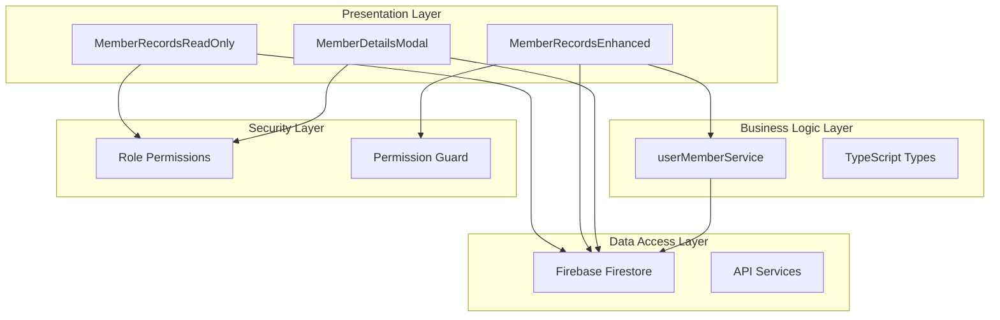
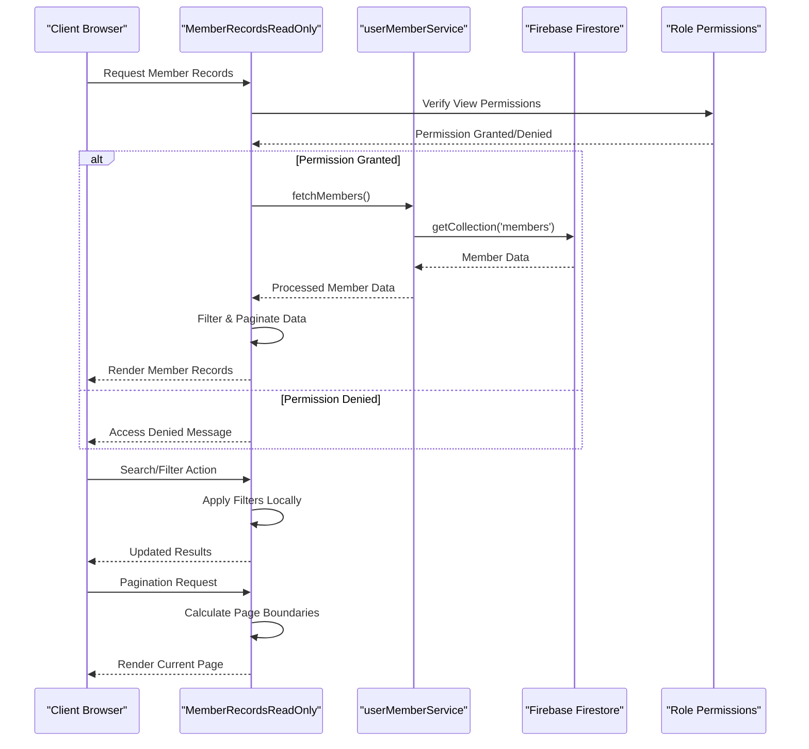
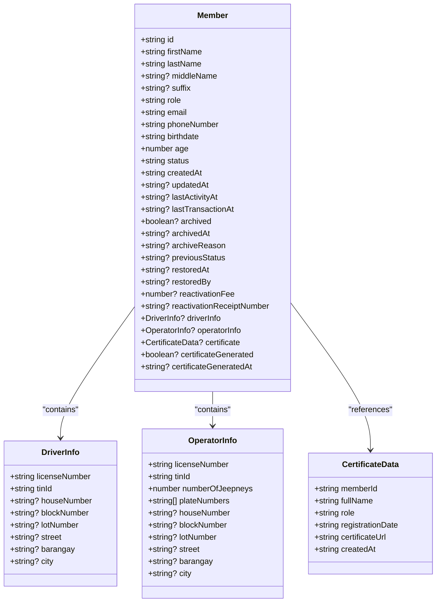
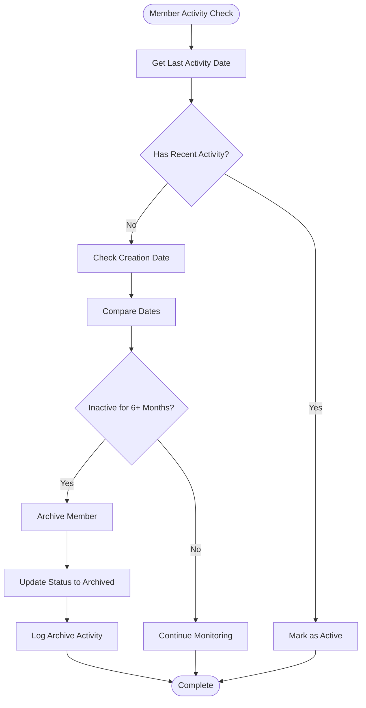
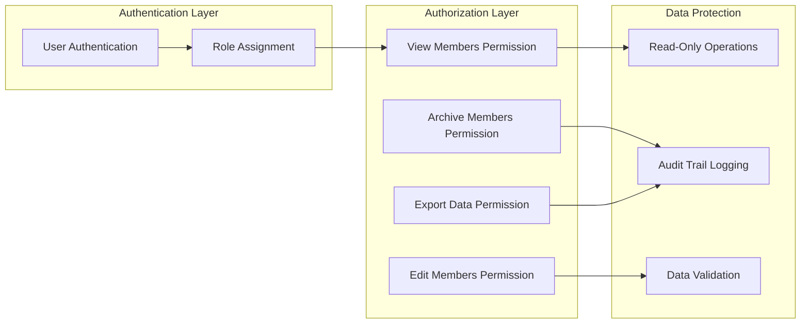
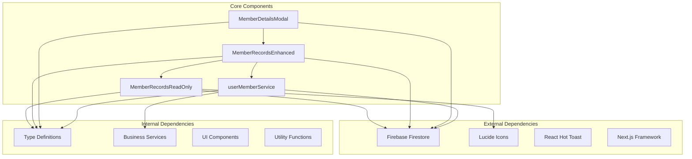

# Member Records Read Only

<cite>
**Referenced Files in This Document**
- [MemberRecordsReadOnly.tsx](file://components/admin/MemberRecordsReadOnly.tsx)
- [MemberRecordsEnhanced.tsx](file://components/admin/MemberRecordsEnhanced.tsx)
- [page.tsx](file://app/admin/members/records/page.tsx)
- [page.tsx](file://app/admin/members/page.tsx)
- [MemberDetailsModal.tsx](file://components/admin/MemberDetailsModal.tsx)
- [member.ts](file://lib/types/member.ts)
- [userMemberService.ts](file://lib/userMemberService.ts)
</cite>

## Table of Contents
1. [Introduction](#introduction)
2. [Project Structure](#project-structure)
3. [Core Components](#core-components)
4. [Architecture Overview](#architecture-overview)
5. [Detailed Component Analysis](#detailed-component-analysis)
6. [Dependency Analysis](#dependency-analysis)
7. [Performance Considerations](#performance-considerations)
8. [Troubleshooting Guide](#troubleshooting-guide)
9. [Conclusion](#conclusion)

## Introduction

The Member Records Read Only feature is a comprehensive system designed to provide secure, read-only access to cooperative member information within the SAMPA Transport Service Cooperative management platform. This system ensures that authorized users can view member details, status, and related information without the ability to modify or alter any data, maintaining data integrity and security standards.

The feature implements strict access controls, automated member archiving based on inactivity thresholds, and comprehensive member lifecycle management while preventing unauthorized modifications to sensitive member data.

## Project Structure

The Member Records Read Only functionality is organized across several key architectural layers:

**Diagram sources**
- [MemberRecordsReadOnly.tsx:1-302](file://components/admin/MemberRecordsReadOnly.tsx#L1-L302)
- [MemberRecordsEnhanced.tsx:1-800](file://components/admin/MemberRecordsEnhanced.tsx#L1-L800)
- [userMemberService.ts:1-289](file://lib/userMemberService.ts#L1-L289)

**Section sources**
- [MemberRecordsReadOnly.tsx:1-302](file://components/admin/MemberRecordsReadOnly.tsx#L1-L302)
- [MemberRecordsEnhanced.tsx:1-800](file://components/admin/MemberRecordsEnhanced.tsx#L1-L800)
- [userMemberService.ts:1-289](file://lib/userMemberService.ts#L1-L289)

## Core Components

### MemberRecordsReadOnly Component

The MemberRecordsReadOnly component serves as the primary read-only interface for displaying member information. It provides a clean, focused view of member data with essential filtering and pagination capabilities.

Key features include:
- **Tabbed Interface**: Separate views for Active and Archived members
- **Search Functionality**: Real-time filtering by name, email, role, and other attributes
- **Pagination System**: Efficient handling of large member datasets
- **Status Indicators**: Color-coded status displays for quick visual assessment
- **Beneficiary Information**: Comprehensive display of designated beneficiaries

### MemberRecordsEnhanced Component

The MemberRecordsEnhanced component extends the basic read-only functionality with advanced administrative features while maintaining read-only constraints for data modification.

Advanced features include:
- **Auto-Archiving System**: Automated member archiving after 6-month inactivity periods
- **Member Restoration**: Secure restoration process with payment validation
- **Activity Tracking**: Comprehensive audit trail of member activities
- **Loan Integration**: Automatic loan deduction calculations during archiving
- **Certificate Management**: Share certificate generation and display capabilities

### MemberDetailsModal Component

The MemberDetailsModal provides comprehensive member information display with specialized testing capabilities for administrative purposes.

Specialized features:
- **Test Archive Functionality**: Simulate archive scenarios with detailed previews
- **Loan Deduction Testing**: Calculate potential loan deductions from savings
- **Certificate Preview**: Visual display of share certificates
- **Beneficiary Management**: Detailed beneficiary information display

**Section sources**
- [MemberRecordsReadOnly.tsx:28-302](file://components/admin/MemberRecordsReadOnly.tsx#L28-L302)
- [MemberRecordsEnhanced.tsx:36-800](file://components/admin/MemberRecordsEnhanced.tsx#L36-L800)
- [MemberDetailsModal.tsx:8-781](file://components/admin/MemberDetailsModal.tsx#L8-L781)

## Architecture Overview

The Member Records Read Only system follows a layered architecture pattern with clear separation of concerns:

**Diagram sources**
- [MemberRecordsReadOnly.tsx:59-98](file://components/admin/MemberRecordsReadOnly.tsx#L59-L98)
- [userMemberService.ts:207-223](file://lib/userMemberService.ts#L207-L223)

The architecture ensures that all data modifications are prevented while maintaining full read functionality, with comprehensive error handling and user feedback mechanisms.

**Section sources**
- [MemberRecordsReadOnly.tsx:59-98](file://components/admin/MemberRecordsReadOnly.tsx#L59-L98)
- [MemberRecordsEnhanced.tsx:401-497](file://components/admin/MemberRecordsEnhanced.tsx#L401-L497)
- [userMemberService.ts:207-223](file://lib/userMemberService.ts#L207-L223)

## Detailed Component Analysis

### Data Model Architecture

The system utilizes a comprehensive data model that separates member information into distinct categories while maintaining referential integrity:

**Diagram sources**
- [member.ts:36-85](file://lib/types/member.ts#L36-L85)

### Auto-Archiving System

The system implements an intelligent auto-archiving mechanism that maintains member engagement while preserving historical data:

**Diagram sources**
- [MemberRecordsEnhanced.tsx:97-147](file://components/admin/MemberRecordsEnhanced.tsx#L97-L147)

### Security and Access Control

The system implements multi-layered security measures to ensure data integrity:

**Diagram sources**
- [MemberRecordsEnhanced.tsx:48-53](file://components/admin/MemberRecordsEnhanced.tsx#L48-L53)
- [page.tsx:48-66](file://app/admin/members/records/page.tsx#L48-L66)

**Section sources**
- [member.ts:1-85](file://lib/types/member.ts#L1-L85)
- [MemberRecordsEnhanced.tsx:97-147](file://components/admin/MemberRecordsEnhanced.tsx#L97-L147)
- [page.tsx:48-66](file://app/admin/members/records/page.tsx#L48-L66)

## Dependency Analysis

The Member Records Read Only system has well-defined dependencies that support its core functionality:

**Diagram sources**
- [MemberRecordsReadOnly.tsx:1-6](file://components/admin/MemberRecordsReadOnly.tsx#L1-L6)
- [MemberRecordsEnhanced.tsx:1-9](file://components/admin/MemberRecordsEnhanced.tsx#L1-L9)
- [userMemberService.ts:1-8](file://lib/userMemberService.ts#L1-L8)

The dependency structure ensures modularity and maintainability while supporting the system's comprehensive functionality.

**Section sources**
- [MemberRecordsReadOnly.tsx:1-6](file://components/admin/MemberRecordsReadOnly.tsx#L1-L6)
- [MemberRecordsEnhanced.tsx:1-9](file://components/admin/MemberRecordsEnhanced.tsx#L1-L9)
- [userMemberService.ts:1-8](file://lib/userMemberService.ts#L1-L8)

## Performance Considerations

The Member Records Read Only system implements several performance optimization strategies:

### Data Loading Optimization
- **Lazy Loading**: Member data is loaded on-demand rather than pre-loading all records
- **Pagination**: Built-in pagination prevents memory overload with large datasets
- **Local Filtering**: Search and filtering operations are performed client-side after initial data load

### Caching Strategies
- **Component State Management**: Member data is cached in component state to avoid redundant API calls
- **Timestamp Parsing**: Efficient date parsing reduces computational overhead
- **Conditional Rendering**: Complex modals and detailed views are rendered only when needed

### Memory Management
- **Cleanup Functions**: Proper cleanup of event listeners and timers
- **Efficient State Updates**: Minimal state updates to reduce re-render cycles
- **Resource Cleanup**: Proper cleanup of modal components and overlays

## Troubleshooting Guide

### Common Issues and Solutions

**Permission Denied Errors**
- **Symptom**: Users receive access denied messages when trying to view member records
- **Solution**: Verify user roles and permissions in the system settings
- **Prevention**: Implement proper role assignment during user onboarding

**Data Loading Failures**
- **Symptom**: Member records fail to load with error messages
- **Solution**: Check Firebase Firestore connectivity and security rules
- **Debugging**: Review console logs for specific error messages

**Search Function Not Working**
- **Symptom**: Search functionality returns no results despite existing data
- **Solution**: Verify search field mappings and data types
- **Validation**: Ensure searchable fields are properly indexed in Firestore

**Performance Issues**
- **Symptom**: Slow loading times with large member datasets
- **Solution**: Implement pagination and lazy loading
- **Optimization**: Consider implementing server-side filtering for large datasets

**Section sources**
- [MemberRecordsReadOnly.tsx:155-162](file://components/admin/MemberRecordsReadOnly.tsx#L155-L162)
- [MemberRecordsEnhanced.tsx:490-496](file://components/admin/MemberRecordsEnhanced.tsx#L490-L496)

## Conclusion

The Member Records Read Only system provides a robust, secure, and efficient solution for managing cooperative member information. The system successfully balances accessibility with security through comprehensive role-based permissions, automated data management, and user-friendly interfaces.

Key strengths of the implementation include:
- **Security Focus**: Strict read-only operations prevent unauthorized data modification
- **Automation**: Intelligent auto-archiving maintains data quality without manual intervention
- **Scalability**: Efficient data handling supports growing member populations
- **User Experience**: Intuitive interfaces with comprehensive filtering and search capabilities
- **Auditability**: Complete activity logging supports compliance and accountability requirements

The system's modular architecture ensures maintainability and extensibility, allowing for future enhancements while preserving core security and functionality. The comprehensive testing capabilities, particularly in the MemberDetailsModal, provide administrators with powerful tools for managing member accounts while maintaining data integrity.