# Administrative Features

<cite>
**Referenced Files in This Document**
- [app/admin/layout.tsx](file://app/admin/layout.tsx)
- [components/admin/Sidebar.tsx](file://components/admin/Sidebar.tsx)
- [components/admin/Card.tsx](file://components/admin/Card.tsx)
- [components/admin/Footer.tsx](file://components/admin/Footer.tsx)
- [components/admin/OfficerDashboard.tsx](file://components/admin/OfficerDashboard.tsx)
- [app/admin/settings/officers/page.tsx](file://app/admin/settings/officers/page.tsx)
- [app/admin/settings/permissions/page.tsx](file://app/admin/settings/permissions/page.tsx)
- [app/admin/settings/system/page.tsx](file://app/admin/settings/system/page.tsx)
- [app/admin/profile/activity/page.tsx](file://app/admin/profile/activity/page.tsx)
- [app/admin/backup/page.tsx](file://app/admin/backup/page.tsx)
- [app/api/backup/export/route.ts](file://app/api/backup/export/route.ts)
- [app/api/backup/download/route.ts](file://app/api/backup/download/route.ts)
- [app/api/backup/manual-upload/route.ts](file://app/api/backup/manual-upload/route.ts)
- [lib/backblazeB2.ts](file://lib/backblazeB2.ts)
- [lib/sidebarConfig.ts](file://lib/sidebarConfig.ts)
- [lib/auth.tsx](file://lib/auth.tsx)
- [lib/rolePermissions.tsx](file://lib/rolePermissions.tsx)
- [lib/validators.ts](file://lib/validators.ts)
- [lib/firebase.ts](file://lib/firebase.ts)
- [middleware.ts](file://middleware.ts)
- [app/admin/dashboard/page.tsx](file://app/admin/dashboard/page.tsx)
- [app/admin/reports/page.tsx](file://app/admin/reports/page.tsx)
- [app/admin/capital-shares/page.tsx](file://app/admin/capital-shares/page.tsx)
- [app/api/users/route.ts](file://app/api/users/route.ts)
- [app/api/dashboard/initialize/route.ts](file://app/api/dashboard/initialize/route.ts)
- [lib/userActionTracker.ts](file://lib/userActionTracker.ts)
- [lib/activityLogger.ts](file://lib/activityLogger.ts)
- [.github/workflows/automated-backup.yml](file://.github/workflows/automated-backup.yml)
- [docs/BACKUP_SETUP.md](file://docs/BACKUP_SETUP.md)
</cite>

## Update Summary
**Changes Made**
- Enhanced backup system with comprehensive automated backup capabilities using GitHub Actions
- Added Backblaze B2 cloud storage integration for off-site redundancy
- Implemented incremental backup logic with timestamp-based data filtering
- Added backup monitoring dashboard with real-time status tracking and download functionality
- Enhanced backup management interface with filtering, pagination, and automated status display
- Added comprehensive backup API endpoints for export, download, and manual upload operations
- Integrated backup logging system with Firestore for audit trail and monitoring
- Updated sidebar configuration to include backup management under Admin Settings section

## Table of Contents
1. [Introduction](#introduction)
2. [Project Structure](#project-structure)
3. [Core Components](#core-components)
4. [Architecture Overview](#architecture-overview)
5. [Detailed Component Analysis](#detailed-component-analysis)
6. [Administrative Settings System](#administrative-settings-system)
7. [Enhanced Backup Management System](#enhanced-backup-management-system)
8. [Capital Shares Management](#capital-shares-management)
9. [Dependency Analysis](#dependency-analysis)
10. [Performance Considerations](#performance-considerations)
11. [Troubleshooting Guide](#troubleshooting-guide)
12. [Conclusion](#conclusion)

## Introduction
This document describes the administrative features and dashboard functionality of the SAMPA Cooperative Management System. It focuses on the role-specific officer dashboards, the administrative sidebar navigation, administrative cards for metrics and activities, the administrative footer, report generation capabilities, user management features, workflows, customization options, and security measures including audit logging and compliance reporting. The system now includes a comprehensive administrative settings system for managing cooperative officers, role-based permissions, and system configuration, with centralized access through the new 'Admin Settings' section and enhanced member management capabilities including capital shares tracking, backup management functionality, and automated backup system with cloud storage integration.

**Updated**: The administrative system has been significantly enhanced with expanded navigation capabilities, improved role-based access control, comprehensive settings management, backup operations with automated cloud storage integration, and new capital shares management functionality that provides centralized administration across all user roles including Admin, Chairman, Vice Chairman, Secretary, Treasurer, and Manager positions.

## Project Structure
The administrative domain is organized around:
- Role-based dashboards and navigation under app/admin
- Shared administrative UI components under components/admin
- Role-based sidebar configuration and validation utilities under lib
- Middleware enforcing route access and redirects
- API routes for administrative tasks such as user creation and dashboard data initialization
- Enhanced backup system with cloud storage integration under app/api/backup
- Audit logging and action tracking utilities
- **New**: Comprehensive backup management system with automated cloud storage integration via Backblaze B2
- **New**: Automated backup system using GitHub Actions with incremental backup logic
- **New**: Backup monitoring dashboard with real-time status tracking and filtering capabilities
- **New**: Enhanced role-based access control with comprehensive permission management across all administrative roles

```mermaid
graph TB
subgraph "Admin UI"
L["Admin Layout<br/>app/admin/layout.tsx"]
S["Admin Sidebar<br/>components/admin/Sidebar.tsx"]
C["Admin Card<br/>components/admin/Card.tsx"]
F["Admin Footer<br/>components/admin/Footer.tsx"]
OD["Officer Dashboard<br/>components/admin/OfficerDashboard.tsx"]
AD["Admin Dashboard<br/>app/admin/dashboard/page.tsx"]
RPT["Reports Page<br/>app/admin/reports/page.tsx"]
CS["Capital Shares<br/>app/admin/capital-shares/page.tsx"]
BK["Backup Management<br/>app/admin/backup/page.tsx"]
DDI["Dashboard Data Init<br/>app/api/dashboard/initialize/route.ts"]
OS["Officer Management<br/>app/admin/settings/officers/page.tsx"]
RP["Role Permissions<br/>app/admin/settings/permissions/page.tsx"]
SS["System Settings<br/>app/admin/settings/system/page.tsx"]
AL["Audit Logs<br/>app/admin/profile/activity/page.tsx"]
end
subgraph "Backup System"
BAPI["Backup API<br/>app/api/backup/export/route.ts"]
BDOWN["Backup Download<br/>app/api/backup/download/route.ts"]
BMAN["Manual Upload<br/>app/api/backup/manual-upload/route.ts"]
BB2["Backblaze B2<br/>lib/backblazeB2.ts"]
GHA["GitHub Actions<br/>.github/workflows/automated-backup.yml"]
BSET["Backup Setup<br/>docs/BACKUP_SETUP.md"]
end
subgraph "Lib Utilities"
SC["Sidebar Config<br/>lib/sidebarConfig.ts"]
AUTH["Auth Provider<br/>lib/auth.tsx"]
VAL["Validators<br/>lib/validators.ts"]
RPV["Role Permissions<br/>lib/rolePermissions.tsx"]
FB["Firebase Service<br/>lib/firebase.ts"]
ACT["Activity Logger<br/>lib/activityLogger.ts"]
UAT["User Action Tracker<br/>lib/userActionTracker.ts"]
end
subgraph "Middleware"
MW["Middleware<br/>middleware.ts"]
end
subgraph "API Routes"
API_USERS["Users API<br/>app/api/users/route.ts"]
API_INIT["Dashboard Init API<br/>app/api/dashboard/initialize/route.ts"]
end
L --> S
L --> AD
L --> RPT
L --> CS
L --> BK
L --> DDI
L --> OS
L --> RP
L --> SS
L --> AL
S --> SC
AD --> AUTH
OD --> AUTH
RPT --> AUTH
CS --> AUTH
BK --> AUTH
DDI --> AUTH
OS --> FB
RP --> RPV
SS --> FB
AUTH --> VAL
MW --> VAL
AUTH --> ACT
UAT --> ACT
API_USERS --> AUTH
API_INIT --> DDI
BAPI --> BB2
BDOWN --> BB2
BMAN --> BB2
GHA --> BAPI
```

**Diagram sources**
- [app/admin/layout.tsx:1-69](file://app/admin/layout.tsx#L1-L69)
- [components/admin/Sidebar.tsx:1-310](file://components/admin/Sidebar.tsx#L1-L310)
- [components/admin/Card.tsx:1-35](file://components/admin/Card.tsx#L1-L35)
- [components/admin/Footer.tsx:1-23](file://components/admin/Footer.tsx#L1-L23)
- [components/admin/OfficerDashboard.tsx:1-198](file://components/admin/OfficerDashboard.tsx#L1-L198)
- [app/admin/dashboard/page.tsx:1-799](file://app/admin/dashboard/page.tsx#L1-L799)
- [app/admin/reports/page.tsx:1-737](file://app/admin/reports/page.tsx#L1-L737)
- [app/admin/capital-shares/page.tsx:1-313](file://app/admin/capital-shares/page.tsx#L1-L313)
- [app/admin/backup/page.tsx:1-639](file://app/admin/backup/page.tsx#L1-L639)
- [app/admin/settings/officers/page.tsx:1-702](file://app/admin/settings/officers/page.tsx#L1-L702)
- [app/admin/settings/permissions/page.tsx:1-486](file://app/admin/settings/permissions/page.tsx#L1-L486)
- [app/admin/settings/system/page.tsx:1-843](file://app/admin/settings/system/page.tsx#L1-L843)
- [app/admin/profile/activity/page.tsx:1-352](file://app/admin/profile/activity/page.tsx#L1-L352)
- [app/api/backup/export/route.ts:1-294](file://app/api/backup/export/route.ts#L1-L294)
- [app/api/backup/download/route.ts:1-50](file://app/api/backup/download/route.ts#L1-L50)
- [app/api/backup/manual-upload/route.ts:1-45](file://app/api/backup/manual-upload/route.ts#L1-L45)
- [lib/backblazeB2.ts:1-169](file://lib/backblazeB2.ts#L1-L169)
- [lib/sidebarConfig.ts:1-473](file://lib/sidebarConfig.ts#L1-L473)
- [lib/auth.tsx:1-682](file://lib/auth.tsx#L1-L682)
- [lib/validators.ts:1-236](file://lib/validators.ts#L1-L236)
- [lib/rolePermissions.tsx:1-226](file://lib/rolePermissions.tsx#L1-L226)
- [lib/firebase.ts:1-345](file://lib/firebase.ts#L1-L345)
- [middleware.ts:1-62](file://middleware.ts#L1-L62)
- [app/api/users/route.ts:1-126](file://app/api/users/route.ts#L1-L126)
- [app/api/dashboard/initialize/route.ts:1-186](file://app/api/dashboard/initialize/route.ts#L1-L186)
- [lib/activityLogger.ts:1-165](file://lib/activityLogger.ts#L1-L165)
- [lib/userActionTracker.ts:1-118](file://lib/userActionTracker.ts#L1-L118)
- [.github/workflows/automated-backup.yml:1-202](file://.github/workflows/automated-backup.yml#L1-L202)
- [docs/BACKUP_SETUP.md:1-285](file://docs/BACKUP_SETUP.md#L1-L285)

**Section sources**
- [app/admin/layout.tsx:1-69](file://app/admin/layout.tsx#L1-L69)
- [lib/sidebarConfig.ts:1-473](file://lib/sidebarConfig.ts#L1-L473)
- [lib/auth.tsx:1-682](file://lib/auth.tsx#L1-L682)
- [lib/validators.ts:1-236](file://lib/validators.ts#L1-L236)
- [middleware.ts:1-62](file://middleware.ts#L1-L62)

## Core Components
- Admin Layout: Enforces authentication and role checks for admin routes, conditionally renders the sidebar, and handles redirects for unauthenticated or unauthorized users.
- Admin Sidebar: Role-aware navigation with collapsible sections, dropdowns, active route highlighting, and a logout handler. Now includes new settings pages under the centralized 'Admin Settings' section, the new Capital Shares section under Members category, and the new Backup section under Admin Settings.
- Admin Card: Reusable card container for dashboard metrics and content.
- Admin Footer: Fixed footer with copyright and version information.
- Officer Dashboard: Role-specific dashboard rendering with metrics, recent activities, and quick actions.
- Admin Dashboard: Comprehensive analytics dashboard for administrators with charts, leaderboards, and filters.
- Reports Page: Financial and operational reports with filtering and print functionality.
- Dashboard Data Initialization: Event and reminder generator for system setup.
- **New**: Officer Management: Comprehensive CRUD operations for managing cooperative officers with role hierarchy and validation.
- **New**: Role Permissions: Granular permission management system with role-based access control.
- **New**: System Settings: Configuration management for membership fees, loan plans, and system policies.
- **New**: Audit Logs: Centralized activity tracking and compliance monitoring through comprehensive logging infrastructure.
- **New**: Enhanced Backup Management: Complete system backup and restore functionality with Excel file processing, ZIP packaging, and cloud storage integration.
- **New**: Automated Backup System: GitHub Actions-based backup automation with incremental backup logic and cloud storage upload.
- **New**: Backup Monitoring Dashboard: Real-time backup status tracking with filtering, pagination, and download capabilities.
- **New**: Capital Shares Management: Comprehensive member capital share tracking with payment status monitoring, search functionality, and filtering capabilities.
- Authentication and Validation: Centralized auth provider, route validators, and middleware enforcement.
- Audit Logging and Action Tracking: Utilities to log user actions and maintain compliance.
- **Updated**: Enhanced role-based access control: All administrative roles now have access to the unified Admin Settings section, Backup management, and Capital Shares management with appropriate permission controls.

**Section sources**
- [app/admin/layout.tsx:1-69](file://app/admin/layout.tsx#L1-L69)
- [components/admin/Sidebar.tsx:1-310](file://components/admin/Sidebar.tsx#L1-L310)
- [components/admin/Card.tsx:1-35](file://components/admin/Card.tsx#L1-L35)
- [components/admin/Footer.tsx:1-23](file://components/admin/Footer.tsx#L1-L23)
- [components/admin/OfficerDashboard.tsx:1-198](file://components/admin/OfficerDashboard.tsx#L1-L198)
- [app/admin/dashboard/page.tsx:1-799](file://app/admin/dashboard/page.tsx#L1-L799)
- [app/admin/reports/page.tsx:1-737](file://app/admin/reports/page.tsx#L1-L737)
- [app/admin/capital-shares/page.tsx:1-313](file://app/admin/capital-shares/page.tsx#L1-L313)
- [app/admin/backup/page.tsx:1-639](file://app/admin/backup/page.tsx#L1-L639)
- [app/admin/settings/officers/page.tsx:1-702](file://app/admin/settings/officers/page.tsx#L1-L702)
- [app/admin/settings/permissions/page.tsx:1-486](file://app/admin/settings/permissions/page.tsx#L1-L486)
- [app/admin/settings/system/page.tsx:1-843](file://app/admin/settings/system/page.tsx#L1-L843)
- [app/admin/profile/activity/page.tsx:1-352](file://app/admin/profile/activity/page.tsx#L1-L352)
- [lib/sidebarConfig.ts:1-473](file://lib/sidebarConfig.ts#L1-L473)
- [lib/auth.tsx:1-682](file://lib/auth.tsx#L1-L682)
- [lib/rolePermissions.tsx:1-226](file://lib/rolePermissions.tsx#L1-L226)
- [lib/validators.ts:1-236](file://lib/validators.ts#L1-L236)
- [middleware.ts:1-62](file://middleware.ts#L1-L62)
- [lib/userActionTracker.ts:1-118](file://lib/userActionTracker.ts#L1-L118)
- [lib/activityLogger.ts:1-165](file://lib/activityLogger.ts#L1-L165)

## Architecture Overview
The administrative system enforces role-based access control at both the UI and routing layers. The Admin Layout validates user roles and renders the Sidebar accordingly. Middleware intercepts requests to enforce route access and redirect unauthorized users. The Auth Provider centralizes authentication state and exposes helpers for role-based routing and dashboard selection. Reports and dashboard data pages rely on Firestore queries and provide filtering and printing capabilities. Audit logging captures user actions for compliance. **The new enhanced backup system integrates seamlessly with the existing architecture, using GitHub Actions for automated scheduling, Backblaze B2 for cloud storage, and Firestore for backup logging. The centralized 'Admin Settings' section provides unified access to all critical system configuration options across all administrative roles. The new Capital Shares management system provides comprehensive member capital share tracking with real-time status updates and filtering capabilities. The enhanced Backup Management system provides secure data export and import functionality with comprehensive Excel processing, validation, and cloud storage integration.**

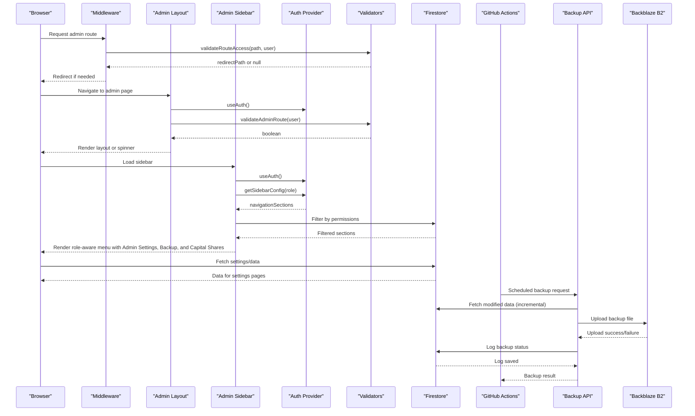

**Diagram sources**
- [middleware.ts:1-62](file://middleware.ts#L1-L62)
- [app/admin/layout.tsx:1-69](file://app/admin/layout.tsx#L1-L69)
- [components/admin/Sidebar.tsx:1-310](file://components/admin/Sidebar.tsx#L1-L310)
- [lib/auth.tsx:1-682](file://lib/auth.tsx#L1-L682)
- [lib/validators.ts:1-236](file://lib/validators.ts#L1-L236)
- [.github/workflows/automated-backup.yml:1-202](file://.github/workflows/automated-backup.yml#L1-L202)
- [app/api/backup/export/route.ts:1-294](file://app/api/backup/export/route.ts#L1-L294)
- [lib/backblazeB2.ts:1-169](file://lib/backblazeB2.ts#L1-L169)

## Detailed Component Analysis

### Admin Layout and Role-Based Access Control
- Validates admin routes and redirects unauthenticated or unauthorized users to the admin login page.
- Conditionally renders the sidebar except on login/register pages.
- Integrates with the Auth Provider and validators to ensure only admin roles can access admin routes.

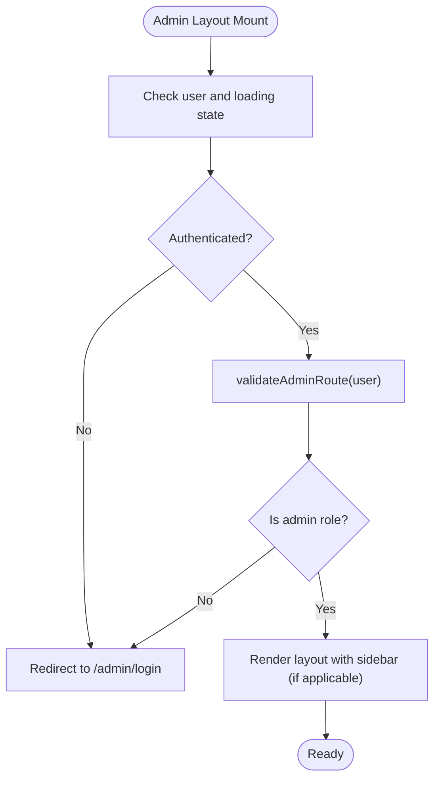

**Diagram sources**
- [app/admin/layout.tsx:1-69](file://app/admin/layout.tsx#L1-L69)
- [lib/validators.ts:1-236](file://lib/validators.ts#L1-L236)

**Section sources**
- [app/admin/layout.tsx:1-69](file://app/admin/layout.tsx#L1-L69)
- [lib/validators.ts:1-236](file://lib/validators.ts#L1-L236)

### Administrative Sidebar Navigation
- Role-aware navigation built from a centralized configuration.
- Supports collapsible sections, dropdowns, and active route highlighting.
- Provides a logout handler integrated with the Auth Provider.
- **Updated**: Now includes new settings pages under the centralized 'Admin Settings' section with six distinct management options: Role Permissions, Officer Management, Audit Logs, System Settings, Profile Management, and Backup.
- **Updated**: Now includes new Capital Shares section under Members category with direct access to capital shares management functionality.
- **Updated**: Now includes new Backup section under Admin Settings with Database icon and 'manageSettings' permission requirement.

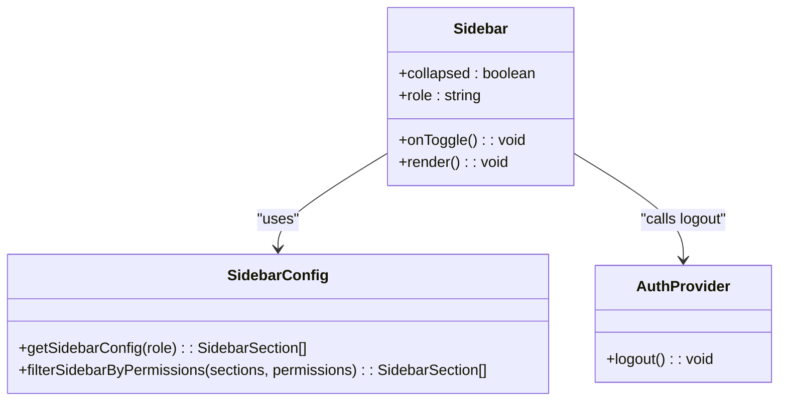

**Diagram sources**
- [components/admin/Sidebar.tsx:1-310](file://components/admin/Sidebar.tsx#L1-L310)
- [lib/sidebarConfig.ts:1-473](file://lib/sidebarConfig.ts#L1-L473)
- [lib/auth.tsx:1-682](file://lib/auth.tsx#L1-L682)

**Section sources**
- [components/admin/Sidebar.tsx:1-310](file://components/admin/Sidebar.tsx#L1-L310)
- [lib/sidebarConfig.ts:1-473](file://lib/sidebarConfig.ts#L1-L473)
- [lib/auth.tsx:1-682](file://lib/auth.tsx#L1-L682)

### Administrative Cards and Dashboard Components
- Admin Card: A reusable card component for consistent styling and responsive layout.
- Officer Dashboard: Displays role-specific metrics, recent activities, and quick actions.
- Admin Dashboard: Comprehensive analytics with charts, savings leaderboard, and filters.

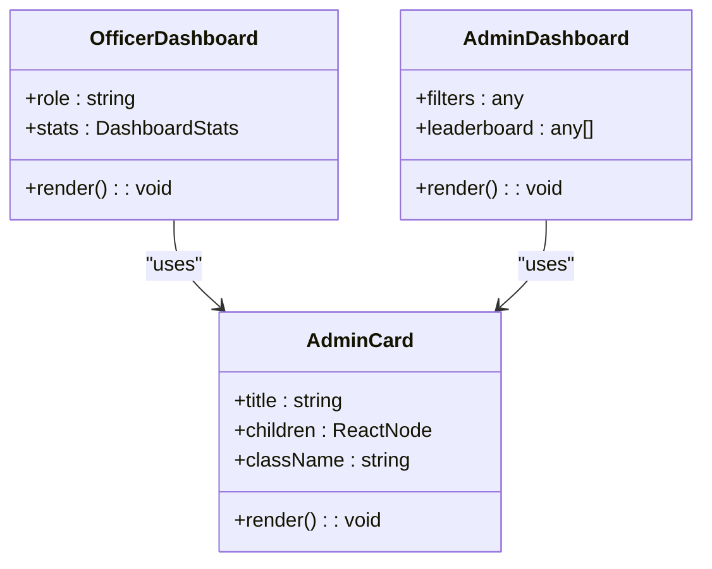

**Diagram sources**
- [components/admin/Card.tsx:1-35](file://components/admin/Card.tsx#L1-L35)
- [components/admin/OfficerDashboard.tsx:1-198](file://components/admin/OfficerDashboard.tsx#L1-L198)
- [app/admin/dashboard/page.tsx:1-799](file://app/admin/dashboard/page.tsx#L1-L799)

**Section sources**
- [components/admin/Card.tsx:1-35](file://components/admin/Card.tsx#L1-L35)
- [components/admin/OfficerDashboard.tsx:1-198](file://components/admin/OfficerDashboard.tsx#L1-L198)
- [app/admin/dashboard/page.tsx:1-799](file://app/admin/dashboard/page.tsx#L1-L799)

### Administrative Footer
- Fixed footer displaying copyright and version information.

**Section sources**
- [components/admin/Footer.tsx:1-23](file://components/admin/Footer.tsx#L1-L23)

### Administrative Report Generation
- Reports page aggregates member, savings, and loan data with filtering by date range and role.
- Provides print functionality to generate PDF-like printable reports.

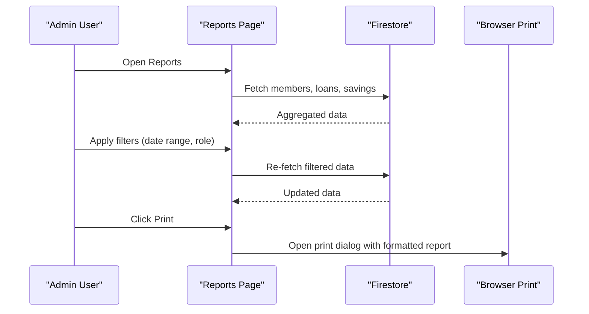

**Diagram sources**
- [app/admin/reports/page.tsx:1-737](file://app/admin/reports/page.tsx#L1-L737)

**Section sources**
- [app/admin/reports/page.tsx:1-737](file://app/admin/reports/page.tsx#L1-L737)

### Administrative User Management
- Users API supports fetching all users and creating new users with validation.
- Admins can create users programmatically via the API.

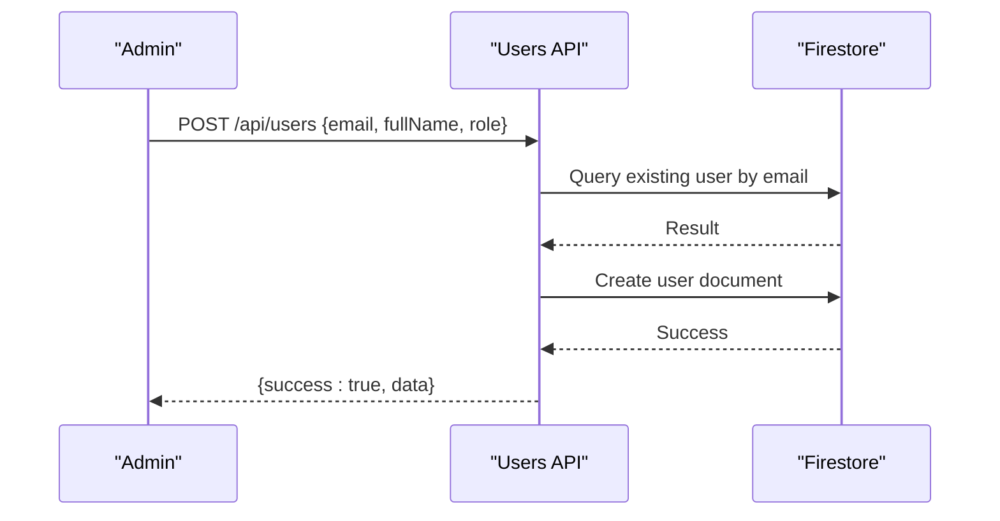

**Diagram sources**
- [app/api/users/route.ts:1-126](file://app/api/users/route.ts#L1-L126)

**Section sources**
- [app/api/users/route.ts:1-126](file://app/api/users/route.ts#L1-L126)

### Administrative Dashboard Data Initialization
- Dashboard Data Init page initializes reminders and events collections and allows adding new reminders and events.

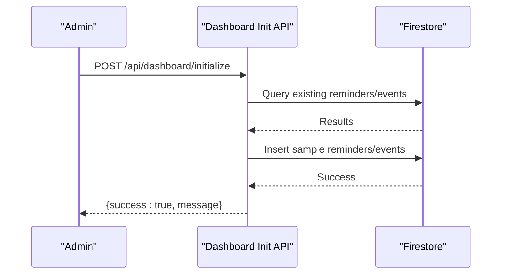

**Diagram sources**
- [app/admin/dashboard/page.tsx:1-799](file://app/admin/dashboard/page.tsx#L1-L799)
- [app/api/dashboard/initialize/route.ts:1-186](file://app/api/dashboard/initialize/route.ts#L1-L186)

**Section sources**
- [app/admin/dashboard/page.tsx:1-799](file://app/admin/dashboard/page.tsx#L1-L799)
- [app/api/dashboard/initialize/route.ts:1-186](file://app/api/dashboard/initialize/route.ts#L1-L186)

### Administrative Workflows and Customization
- Role-specific dashboards: Admins see the comprehensive Admin Dashboard; other roles see role-specific dashboards.
- Sidebar customization: Menu items are driven by roleSidebarConfig and rendered dynamically.
- Filters and quick actions: Reports and Admin Dashboard support filtering and interactive navigation.
- **Updated**: Centralized settings management: All administrative configuration is now accessible through the unified 'Admin Settings' section across all roles with appropriate permission controls.
- **Updated**: Capital Shares management: Members can now track and manage capital share payments through the unified sidebar navigation.
- **Updated**: Enhanced Backup management: System administrators can now export and import complete system data through the unified sidebar navigation with automated cloud storage integration.

**Section sources**
- [lib/sidebarConfig.ts:1-473](file://lib/sidebarConfig.ts#L1-L473)
- [app/admin/dashboard/page.tsx:1-799](file://app/admin/dashboard/page.tsx#L1-L799)
- [app/admin/reports/page.tsx:1-737](file://app/admin/reports/page.tsx#L1-L737)

### Security Measures, Audit Logging, and Compliance Reporting
- Middleware enforces route access and redirects unauthorized users.
- Validators ensure only authorized roles access specific routes.
- Auth Provider tracks login/logout/profile updates and wraps actions with automatic logging.
- Activity logger stores logs in Firestore with timestamps and contextual metadata.
- Compliance-ready audit trails enable date-range queries and user-scoped logs.
- **New**: Comprehensive audit logging infrastructure with centralized logging system.
- **Updated**: Enhanced security with role-based access control across all administrative roles.

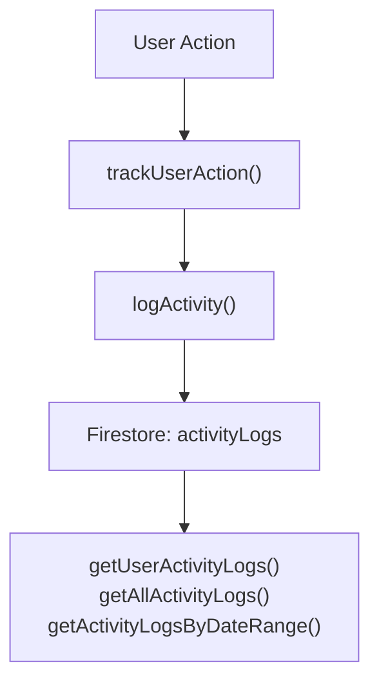

**Diagram sources**
- [lib/userActionTracker.ts:1-118](file://lib/userActionTracker.ts#L1-L118)
- [lib/activityLogger.ts:1-165](file://lib/activityLogger.ts#L1-L165)

**Section sources**
- [middleware.ts:1-62](file://middleware.ts#L1-L62)
- [lib/validators.ts:1-236](file://lib/validators.ts#L1-L236)
- [lib/userActionTracker.ts:1-118](file://lib/userActionTracker.ts#L1-L118)
- [lib/activityLogger.ts:1-165](file://lib/activityLogger.ts#L1-L165)

## Administrative Settings System

### Centralized Admin Settings Navigation
The new 'Admin Settings' section provides centralized access to all critical system configuration through a unified navigation interface:

- **Unified Access Point**: All administrative configuration is accessible from a single, well-organized section across all administrative roles
- **Six Distinct Management Areas**: Role Permissions, Officer Management, Audit Logs, System Settings, Profile Management, and Backup
- **Permission-Based Visibility**: Each subsection requires the 'manageSettings' permission for access
- **Consistent Design Patterns**: All settings pages follow the same design and interaction patterns
- **Cross-Role Compatibility**: The Admin Settings section is available to all administrative roles with appropriate permission controls

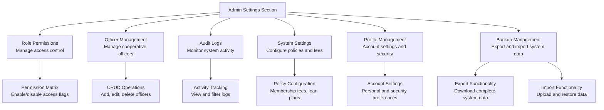

**Diagram sources**
- [lib/sidebarConfig.ts:81-89](file://lib/sidebarConfig.ts#L81-L89)
- [lib/sidebarConfig.ts:138-146](file://lib/sidebarConfig.ts#L138-L146)
- [lib/sidebarConfig.ts:194-202](file://lib/sidebarConfig.ts#L194-L202)
- [lib/sidebarConfig.ts:250-258](file://lib/sidebarConfig.ts#L250-L258)
- [lib/sidebarConfig.ts:310-318](file://lib/sidebarConfig.ts#L310-L318)
- [lib/sidebarConfig.ts:81-87](file://lib/sidebarConfig.ts#L81-L87)

**Section sources**
- [lib/sidebarConfig.ts:81-89](file://lib/sidebarConfig.ts#L81-L89)
- [lib/sidebarConfig.ts:138-146](file://lib/sidebarConfig.ts#L138-L146)
- [lib/sidebarConfig.ts:194-202](file://lib/sidebarConfig.ts#L194-L202)
- [lib/sidebarConfig.ts:250-258](file://lib/sidebarConfig.ts#L250-L258)
- [lib/sidebarConfig.ts:310-318](file://lib/sidebarConfig.ts#L310-L318)
- [lib/sidebarConfig.ts:81-87](file://lib/sidebarConfig.ts#L81-L87)

### Officer Management
The Officer Management system provides comprehensive CRUD operations for managing cooperative officers with role hierarchy and validation:

- **Role Hierarchy**: Officers are managed in a hierarchical order (Chairman → Vice Chairman → Secretary → Treasurer → Manager → Board of Directors)
- **Validation**: Email uniqueness validation, phone number format validation (11 digits starting with "09"), and password requirements (minimum 8 characters)
- **CRUD Operations**: Full create, read, update, and delete functionality with modal-based forms
- **Search and Filtering**: Real-time search across names, emails, and roles with role-based sorting
- **Status Management**: Active/inactive status tracking with visual indicators
- **Cross-Role Access**: Available to all administrative roles with appropriate permission controls

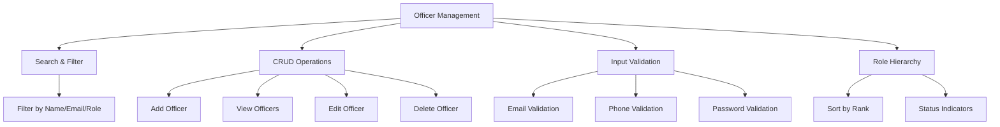

**Diagram sources**
- [app/admin/settings/officers/page.tsx:1-702](file://app/admin/settings/officers/page.tsx#L1-L702)

**Section sources**
- [app/admin/settings/officers/page.tsx:1-702](file://app/admin/settings/officers/page.tsx#L1-L702)

### Role Permissions Management
The Role Permissions system provides granular access control with default configurations and custom overrides:

- **Permission Categories**: View Members, Add Members, Edit Members, Archive/Restore Members, View Loans, Approve Loans, Reject Loans, View Savings, Manage Savings, View Reports, Export Data, Manage Settings
- **Default Configurations**: Predefined permission sets for each role with logical access patterns
- **Real-time Editing**: Toggle-based interface for immediate permission changes
- **Backup Storage**: LocalStorage backup for permission configurations
- **Reset Functionality**: One-click reset to default permission sets
- **Cross-Role Implementation**: Integrated with rolePermissions hook for seamless permission checking across all administrative roles

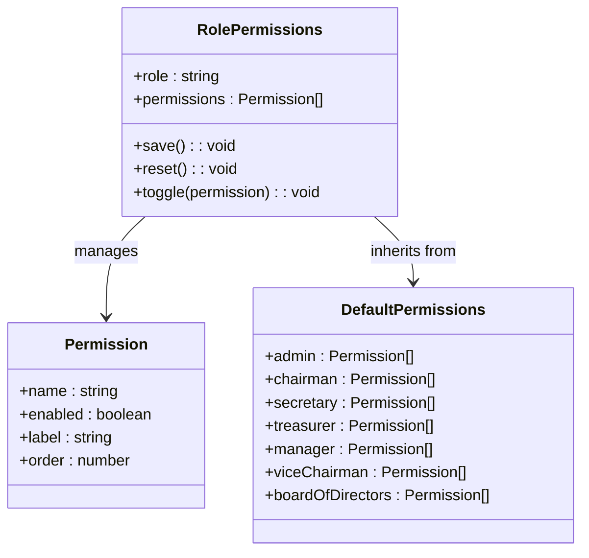

**Diagram sources**
- [app/admin/settings/permissions/page.tsx:1-486](file://app/admin/settings/permissions/page.tsx#L1-L486)
- [lib/rolePermissions.tsx:1-226](file://lib/rolePermissions.tsx#L1-L226)

**Section sources**
- [app/admin/settings/permissions/page.tsx:1-486](file://app/admin/settings/permissions/page.tsx#L1-L486)
- [lib/rolePermissions.tsx:1-226](file://lib/rolePermissions.tsx#L1-L226)

### System Settings Configuration
The System Settings module manages cooperative policies and financial configurations:

- **Membership Settings**: Configure membership payment amounts and reactivation fees with currency formatting
- **Loan Plans Management**: Create, edit, and delete loan plans with maximum amounts, interest rates, and term options
- **Financial Configuration**: Real-time currency formatting and number formatting for Philippine Peso
- **Audit Trail**: Track who made changes and when with timestamped updates
- **Default Values**: Pre-configured default settings with easy reset functionality
- **Cross-Role Access**: Available to all administrative roles with appropriate permission controls

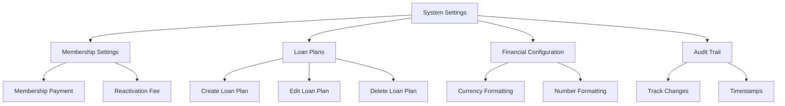

**Diagram sources**
- [app/admin/settings/system/page.tsx:1-843](file://app/admin/settings/system/page.tsx#L1-L843)

**Section sources**
- [app/admin/settings/system/page.tsx:1-843](file://app/admin/settings/system/page.tsx#L1-L843)

### Audit Logs and Compliance Monitoring
The audit logging system provides comprehensive activity tracking and compliance monitoring:

- **Activity Tracking**: Automatic logging of user actions with timestamps and contextual metadata
- **User Scoping**: Filter logs by individual users or all system activity
- **Date Range Queries**: Search and filter logs within specific time periods
- **Compliance Ready**: Structured logging enables regulatory compliance and internal audits
- **Real-time Monitoring**: Immediate visibility into system activity and user actions
- **Cross-Role Access**: Available to all administrative roles with appropriate permission controls

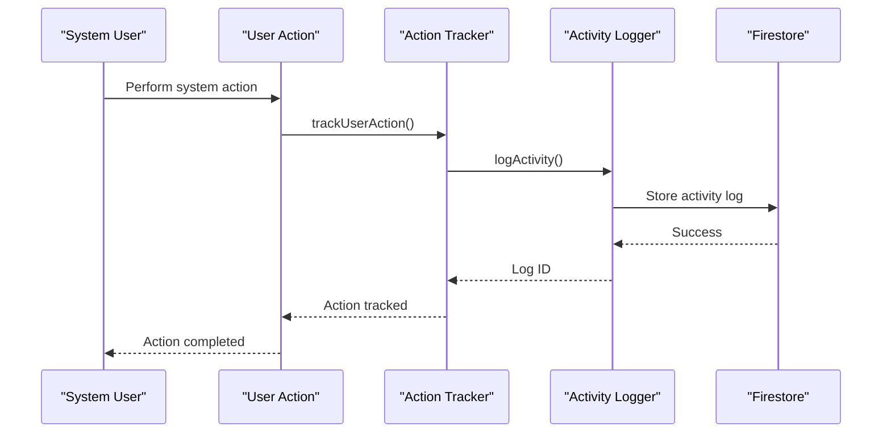

**Diagram sources**
- [lib/userActionTracker.ts:1-118](file://lib/userActionTracker.ts#L1-L118)
- [lib/activityLogger.ts:1-165](file://lib/activityLogger.ts#L1-L165)

**Section sources**
- [lib/userActionTracker.ts:1-118](file://lib/userActionTracker.ts#L1-L118)
- [lib/activityLogger.ts:1-165](file://lib/activityLogger.ts#L1-L165)

### Settings Integration with Sidebar
The new settings pages are fully integrated into the administrative navigation system:

- **Admin Settings Section**: Dedicated section in the sidebar for all administrative settings across all roles
- **Permission-based Visibility**: Only administrators can access settings pages with manageSettings permission
- **Consistent Navigation**: Settings pages follow the same design patterns as other admin pages
- **Role-based Access**: Each settings page enforces appropriate role restrictions
- **Centralized Management**: All administrative configuration accessible from unified navigation
- **Cross-Role Compatibility**: Available to all administrative roles with appropriate permission controls

**Section sources**
- [lib/sidebarConfig.ts:81-89](file://lib/sidebarConfig.ts#L81-L89)
- [lib/sidebarConfig.ts:138-146](file://lib/sidebarConfig.ts#L138-L146)
- [lib/sidebarConfig.ts:194-202](file://lib/sidebarConfig.ts#L194-L202)
- [lib/sidebarConfig.ts:250-258](file://lib/sidebarConfig.ts#L250-L258)
- [lib/sidebarConfig.ts:310-318](file://lib/sidebarConfig.ts#L310-L318)

## Enhanced Backup Management System

### Comprehensive Backup and Restore Functionality
The enhanced Backup Management system provides complete system data export and import capabilities with advanced Excel processing, validation, and cloud storage integration:

- **Complete Data Export**: Export all system data including members, loans, loan requests, savings, and users in Excel format
- **ZIP Packaging**: Bundle all Excel files into a single downloadable ZIP archive
- **Excel Processing**: Utilize SheetJS library for robust Excel file generation and parsing
- **Data Validation**: Comprehensive validation of backup files with record count verification
- **Confirmation Dialogs**: User confirmation for destructive restore operations
- **Permission Control**: Requires 'manageSettings' permission for access to backup functionality
- **Cloud Storage Integration**: Backblaze B2 cloud storage upload with secure authentication
- **Incremental Backup Logic**: Intelligent timestamp-based data filtering for efficient incremental backups
- **Backup Monitoring**: Real-time backup status tracking with filtering, pagination, and download capabilities
- **Cross-Role Compatibility**: Available to all administrative roles with appropriate permission controls

```mermaid
flowchart TD
BackupSystem["Enhanced Backup Management System"] --> Export["Export Backup"]
BackupSystem --> Import["Import Backup"]
BackupSystem --> Monitor["Backup Monitoring"]
Export --> FetchData["Fetch All Collections"]
Export --> ProcessData["Process Data for Excel"]
Export --> CreateExcel["Create Excel Files"]
Export --> PackageZIP["Package as ZIP"]
Export --> UploadB2["Upload to Backblaze B2"]
Import --> ValidateFile["Validate Backup File"]
Import --> ParseExcel["Parse Excel Files"]
Import --> ConfirmRestore["Confirm Restore Operation"]
Import --> RestoreData["Restore Data to Firestore"]
Monitor --> RealtimeLogs["Real-time Backup Logs"]
Monitor --> FilterControls["Filter & Pagination"]
Monitor --> DownloadFiles["Download Backup Files"]
FetchData --> Members["Members Collection"]
FetchData --> Loans["Loans Collection"]
FetchData --> LoanRequests["Loan Requests Collection"]
FetchData --> Savings["Savings Collection"]
FetchData --> Users["Users Collection"]
ProcessData --> TruncateLongValues["Truncate Long Values"]
ProcessData --> JSONProcessing["JSON Processing"]
CreateExcel --> SheetGeneration["Sheet Generation"]
UploadB2 --> Authenticate["Authenticate with B2"]
UploadB2 --> GetUploadURL["Get Upload URL"]
UploadB2 --> UploadFile["Upload ZIP File"]
Authenticate --> AuthSuccess["Authentication Success"]
GetUploadURL --> UploadSuccess["Upload URL Retrieved"]
UploadFile --> B2Success["File Uploaded Successfully"]
```

**Diagram sources**
- [app/admin/backup/page.tsx:77-136](file://app/admin/backup/page.tsx#L77-L136)
- [app/admin/backup/page.tsx:145-303](file://app/admin/backup/page.tsx#L145-L303)
- [app/api/backup/export/route.ts:98-277](file://app/api/backup/export/route.ts#L98-L277)
- [lib/backblazeB2.ts:20-131](file://lib/backblazeB2.ts#L20-L131)

**Section sources**
- [app/admin/backup/page.tsx:1-639](file://app/admin/backup/page.tsx#L1-L639)
- [app/api/backup/export/route.ts:1-294](file://app/api/backup/export/route.ts#L1-L294)
- [app/api/backup/download/route.ts:1-50](file://app/api/backup/download/route.ts#L1-L50)
- [app/api/backup/manual-upload/route.ts:1-45](file://app/api/backup/manual-upload/route.ts#L1-L45)
- [lib/backblazeB2.ts:1-169](file://lib/backblazeB2.ts#L1-L169)
- [lib/sidebarConfig.ts:81-87](file://lib/sidebarConfig.ts#L81-L87)

### Backup Export Functionality
The export functionality provides comprehensive system data backup with advanced processing capabilities and cloud storage integration:

- **Multi-Collection Fetching**: Concurrently fetch data from all system collections (members, loans, loan requests, savings, users)
- **Excel Generation**: Convert fetched data to Excel format with SheetJS library
- **Long Value Truncation**: Automatic truncation of values exceeding Excel cell limits (32,767 characters)
- **ZIP Packaging**: Bundle all Excel files into a single downloadable ZIP archive
- **Cloud Upload**: Secure upload to Backblaze B2 cloud storage with authentication
- **Backup Logging**: Comprehensive logging of backup operations with status tracking
- **Loading States**: Comprehensive loading states with toast notifications for user feedback
- **Error Handling**: Robust error handling with user-friendly error messages

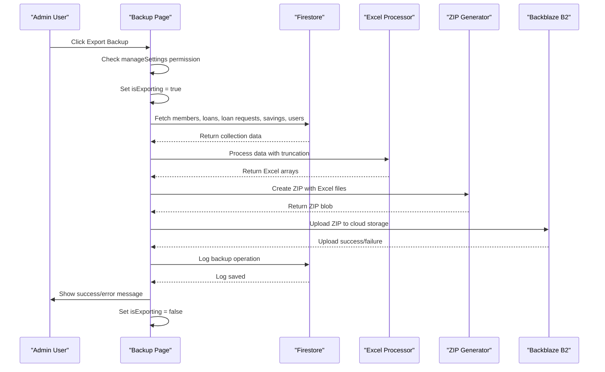

**Diagram sources**
- [app/admin/backup/page.tsx:77-136](file://app/admin/backup/page.tsx#L77-L136)
- [app/api/backup/export/route.ts:98-277](file://app/api/backup/export/route.ts#L98-L277)

**Section sources**
- [app/admin/backup/page.tsx:77-136](file://app/admin/backup/page.tsx#L77-L136)
- [app/api/backup/export/route.ts:98-277](file://app/api/backup/export/route.ts#L98-L277)

### Backup Import/Restore Functionality
The import functionality provides secure data restoration with validation, confirmation, and cloud storage integration:

- **File Upload**: Support for .zip backup files with validation
- **ZIP Processing**: Extract Excel files from uploaded ZIP archives
- **Excel Parsing**: Parse Excel files using SheetJS library
- **Data Validation**: Verify backup file integrity and record counts
- **Confirmation Dialog**: Warning dialog with detailed restore information
- **Bulk Operations**: Efficient bulk write operations to Firestore
- **Error Recovery**: Comprehensive error handling and recovery mechanisms
- **Manual Upload**: Direct upload capability for local backup files

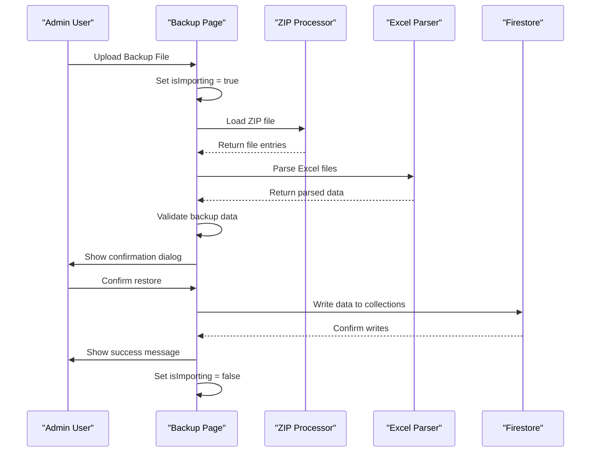

**Diagram sources**
- [app/admin/backup/page.tsx:145-303](file://app/admin/backup/page.tsx#L145-L303)

**Section sources**
- [app/admin/backup/page.tsx:145-303](file://app/admin/backup/page.tsx#L145-L303)

### Automated Backup System with GitHub Actions
The automated backup system provides scheduled backup automation with intelligent incremental logic and cloud storage integration:

- **GitHub Actions Integration**: Scheduled backup jobs using cron expressions
- **Incremental Backup Logic**: Timestamp-based data filtering for efficient incremental backups
- **Daily Incremental Backups**: Only new/modified data since last backup
- **Monthly Full Backups**: Complete system backup on first day of each month
- **Manual Trigger Support**: Workflow dispatch for on-demand backups
- **Backup Status Tracking**: Real-time monitoring and status reporting
- **Cloud Storage Upload**: Secure upload to Backblaze B2 with authentication
- **Notification System**: Automated notifications for backup success/failure/skip

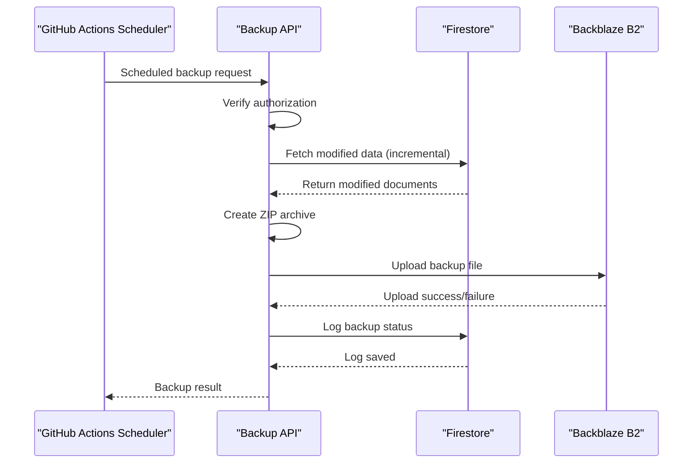

**Diagram sources**
- [.github/workflows/automated-backup.yml:27-155](file://.github/workflows/automated-backup.yml#L27-L155)
- [app/api/backup/export/route.ts:98-277](file://app/api/backup/export/route.ts#L98-L277)

**Section sources**
- [.github/workflows/automated-backup.yml:1-202](file://.github/workflows/automated-backup.yml#L1-L202)
- [app/api/backup/export/route.ts:1-294](file://app/api/backup/export/route.ts#L1-L294)

### Backup Monitoring Dashboard
The backup monitoring dashboard provides comprehensive real-time status tracking and management capabilities:

- **Real-time Backup Logs**: Live snapshot of backup operations with Firestore integration
- **Filtering & Pagination**: Advanced filtering by backup type, date, and time with pagination controls
- **Status Indicators**: Color-coded status display (success, skipped) with detailed information
- **Download Functionality**: Direct download of backup files from cloud storage
- **Backup Type Classification**: Daily, monthly, and manual backup categorization
- **Record Count Tracking**: Display of total records backed up in each operation
- **Timestamp Management**: Precise date and time tracking for backup operations
- **Responsive Design**: Mobile-friendly interface with intuitive controls

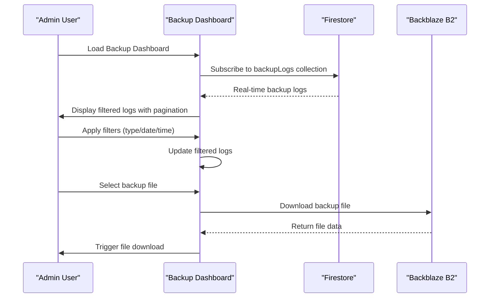

**Diagram sources**
- [app/admin/backup/page.tsx:49-79](file://app/admin/backup/page.tsx#L49-L79)
- [app/admin/backup/page.tsx:80-99](file://app/admin/backup/page.tsx#L80-L99)

**Section sources**
- [app/admin/backup/page.tsx:49-79](file://app/admin/backup/page.tsx#L49-L79)
- [app/admin/backup/page.tsx:80-99](file://app/admin/backup/page.tsx#L80-L99)

### Backup Management Integration with Sidebar
The Backup Management section is seamlessly integrated into the administrative sidebar navigation:

- **Admin Settings Category**: Backup is placed under the Admin Settings category alongside other settings pages
- **Permission Requirement**: Requires 'manageSettings' permission for access, ensuring appropriate security controls
- **Database Icon**: Uses the Database icon to visually represent backup and restore functionality
- **Direct Access**: Provides direct navigation to the Backup Management page from the sidebar
- **Role-based Visibility**: Visible to all administrative roles that have the required permission level

**Section sources**
- [lib/sidebarConfig.ts:81-87](file://lib/sidebarConfig.ts#L81-L87)
- [components/admin/Sidebar.tsx:81-87](file://components/admin/Sidebar.tsx#L81-L87)

### Backblaze B2 Cloud Storage Integration
The enhanced backup system integrates with Backblaze B2 for secure cloud storage:

- **Authentication**: Secure authentication using B2 account credentials and application keys
- **Upload URL Retrieval**: Dynamic upload URL generation for secure file uploads
- **File Upload**: Direct file upload to Backblaze B2 with SHA1 hash verification
- **Download Management**: Secure download functionality with authentication tokens
- **File Listing**: Comprehensive file listing with timestamp-based sorting
- **Latest Backup Detection**: Automatic detection of latest backup timestamp for incremental logic
- **Error Handling**: Robust error handling for authentication and upload failures
- **Environment Configuration**: Secure environment variable management for credentials

**Section sources**
- [lib/backblazeB2.ts:1-169](file://lib/backblazeB2.ts#L1-L169)
- [app/api/backup/download/route.ts:1-50](file://app/api/backup/download/route.ts#L1-L50)
- [app/api/backup/manual-upload/route.ts:1-45](file://app/api/backup/manual-upload/route.ts#L1-L45)

## Capital Shares Management

### Enhanced Member Management with Capital Shares Tracking
The new Capital Shares management system provides comprehensive tracking and management of member capital share payments:

- **Real-time Tracking**: Monitor capital share payments with live status updates (Paid, Pending, Partial)
- **Search and Filter**: Search by member name or ID, filter by payment status
- **Summary Statistics**: View total capital shares, paid capital shares, and pending capital shares
- **Payment Status Monitoring**: Visual indicators for different payment statuses with color-coded badges
- **Member Information**: Display member roles, capital share amounts, and payment dates
- **Permission-based Access**: Requires 'viewMembers' permission for access to capital shares data
- **Cross-Role Compatibility**: Available to all administrative roles with appropriate permission controls

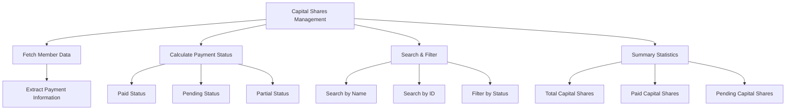

**Diagram sources**
- [app/admin/capital-shares/page.tsx:34-102](file://app/admin/capital-shares/page.tsx#L34-L102)
- [app/admin/capital-shares/page.tsx:105-110](file://app/admin/capital-shares/page.tsx#L105-L110)
- [app/admin/capital-shares/page.tsx:150-199](file://app/admin/capital-shares/page.tsx#L150-L199)

**Section sources**
- [app/admin/capital-shares/page.tsx:1-313](file://app/admin/capital-shares/page.tsx#L1-L313)
- [lib/sidebarConfig.ts:52-56](file://lib/sidebarConfig.ts#L52-L56)

### Capital Shares Dashboard Features
The Capital Shares dashboard provides a comprehensive interface for managing member capital share payments:

- **Header Section**: Clear title and description indicating the purpose of the dashboard
- **Summary Cards**: Three key metrics cards showing total capital shares, paid capital shares, and pending capital shares
- **Search and Filter Controls**: Text input for searching by member name or ID, dropdown for filtering by payment status
- **Data Table**: Comprehensive table displaying member information, roles, capital share amounts, payment status, and payment dates
- **Results Count**: Display of the number of records shown based on current filters
- **Permission Handling**: Automatic access control with user-friendly error messages when permissions are insufficient

```mermaid
sequenceDiagram
participant User as "Admin User"
participant CS as "Capital Shares Page"
participant FS as "Firestore"
User->>CS : Load Capital Shares Page
CS->>FS : Fetch members collection
FS-->>CS : Member data with payment info
CS->>CS : Process data and calculate totals
CS->>User : Render dashboard with summary cards
User->>CS : Enter search term
CS->>CS : Filter data by search term
CS->>User : Update table with filtered results
User->>CS : Select status filter
CS->>CS : Filter data by status
CS->>User : Update table with filtered results
```

**Diagram sources**
- [app/admin/capital-shares/page.tsx:34-102](file://app/admin/capital-shares/page.tsx#L34-L102)
- [app/admin/capital-shares/page.tsx:105-110](file://app/admin/capital-shares/page.tsx#L105-L110)

**Section sources**
- [app/admin/capital-shares/page.tsx:140-313](file://app/admin/capital-shares/page.tsx#L140-L313)

### Sidebar Integration for Capital Shares
The Capital Shares section is seamlessly integrated into the administrative sidebar navigation:

- **Members Category**: Capital Shares is placed under the Members category alongside other member-related sections
- **Permission Requirement**: Requires 'viewMembers' permission for access, ensuring appropriate security controls
- **Icon Representation**: Uses the PiggyBank icon to visually represent capital share management
- **Direct Access**: Provides direct navigation to the Capital Shares management page from the sidebar
- **Role-based Visibility**: Visible to all administrative roles that have the required permission level

**Section sources**
- [lib/sidebarConfig.ts:45-56](file://lib/sidebarConfig.ts#L45-L56)
- [components/admin/Sidebar.tsx:63-70](file://components/admin/Sidebar.tsx#L63-L70)

## Dependency Analysis
The administrative system exhibits clear separation of concerns with enhanced integration for the new settings system, Backup Management, Capital Shares management, and automated backup system:
- UI components depend on shared Admin Card and Sidebar components.
- Sidebar depends on roleSidebarConfig for dynamic navigation including new settings pages, Backup section, and Capital Shares section.
- Auth Provider integrates with validators and middleware for access control.
- Reports and dashboard pages depend on Firestore for data retrieval.
- **New**: Settings pages integrate with Firestore for persistent storage and rolePermissions for access control.
- **New**: Enhanced Backup Management integrates with Firestore for data export and import operations with Excel processing libraries and Backblaze B2 cloud storage.
- **New**: Automated Backup System integrates with GitHub Actions for scheduled backup automation and incremental backup logic.
- **New**: Backup Monitoring Dashboard provides real-time status tracking with Firestore integration and filtering capabilities.
- **New**: Capital Shares management integrates with Firestore for member data retrieval and payment status tracking.
- **New**: Audit logging system provides centralized activity tracking with comprehensive querying capabilities.
- Audit logging is decoupled and used by action tracking utilities.
- **Updated**: Enhanced role-based access control with comprehensive permission management across all administrative roles.

```mermaid
graph TB
AUTH["Auth Provider<br/>lib/auth.tsx"] --> VAL["Validators<br/>lib/validators.ts"]
AUTH --> ACT["Activity Logger<br/>lib/activityLogger.ts"]
AUTH --> UAT["User Action Tracker<br/>lib/userActionTracker.ts"]
AUTH --> RPV["Role Permissions<br/>lib/rolePermissions.tsx"]
MW["Middleware<br/>middleware.ts"] --> VAL
AL["Admin Layout<br/>app/admin/layout.tsx"] --> AUTH
AL --> SB["Admin Sidebar<br/>components/admin/Sidebar.tsx"]
SB --> SC["Sidebar Config<br/>lib/sidebarConfig.ts"]
AD["Admin Dashboard<br/>app/admin/dashboard/page.tsx"] --> AUTH
RPT["Reports Page<br/>app/admin/reports/page.tsx"] --> AUTH
CS["Capital Shares<br/>app/admin/capital-shares/page.tsx"] --> AUTH
BK["Backup Management<br/>app/admin/backup/page.tsx"] --> AUTH
DDI["Dashboard Data Init<br/>app/api/dashboard/initialize/route.ts"] --> AUTH
OS["Officer Management<br/>app/admin/settings/officers/page.tsx"] --> FB["Firebase Service<br/>lib/firebase.ts"]
RP["Role Permissions<br/>app/admin/settings/permissions/page.tsx"] --> RPV
SS["System Settings<br/>app/admin/settings/system/page.tsx"] --> FB
API_USERS["Users API<br/>app/api/users/route.ts"] --> AUTH
API_INIT["Dashboard Init API<br/>app/api/dashboard/initialize/route.ts"] --> DDI
UAT --> ACT
ACT --> ACTLOGS["Activity Logs Collection"]
BAPI["Backup API<br/>app/api/backup/export/route.ts"] --> B2["Backblaze B2<br/>lib/backblazeB2.ts"]
BDOWN["Backup Download<br/>app/api/backup/download/route.ts"] --> B2
BMAN["Manual Upload<br/>app/api/backup/manual-upload/route.ts"] --> B2
GHA["GitHub Actions<br/>.github/workflows/automated-backup.yml"] --> BAPI
```

**Diagram sources**
- [lib/auth.tsx:1-682](file://lib/auth.tsx#L1-L682)
- [lib/validators.ts:1-236](file://lib/validators.ts#L1-L236)
- [lib/activityLogger.ts:1-165](file://lib/activityLogger.ts#L1-L165)
- [lib/userActionTracker.ts:1-118](file://lib/userActionTracker.ts#L1-L118)
- [lib/rolePermissions.tsx:1-226](file://lib/rolePermissions.tsx#L1-L226)
- [lib/firebase.ts:1-345](file://lib/firebase.ts#L1-L345)
- [middleware.ts:1-62](file://middleware.ts#L1-L62)
- [app/admin/layout.tsx:1-69](file://app/admin/layout.tsx#L1-L69)
- [components/admin/Sidebar.tsx:1-310](file://components/admin/Sidebar.tsx#L1-L310)
- [lib/sidebarConfig.ts:1-473](file://lib/sidebarConfig.ts#L1-L473)
- [app/admin/dashboard/page.tsx:1-799](file://app/admin/dashboard/page.tsx#L1-L799)
- [app/admin/reports/page.tsx:1-737](file://app/admin/reports/page.tsx#L1-L737)
- [app/admin/capital-shares/page.tsx:1-313](file://app/admin/capital-shares/page.tsx#L1-L313)
- [app/admin/backup/page.tsx:1-639](file://app/admin/backup/page.tsx#L1-L639)
- [app/admin/settings/officers/page.tsx:1-702](file://app/admin/settings/officers/page.tsx#L1-L702)
- [app/admin/settings/permissions/page.tsx:1-486](file://app/admin/settings/permissions/page.tsx#L1-L486)
- [app/admin/settings/system/page.tsx:1-843](file://app/admin/settings/system/page.tsx#L1-L843)
- [app/api/users/route.ts:1-126](file://app/api/users/route.ts#L1-L126)
- [app/api/dashboard/initialize/route.ts:1-186](file://app/api/dashboard/initialize/route.ts#L1-L186)
- [app/api/backup/export/route.ts:1-294](file://app/api/backup/export/route.ts#L1-L294)
- [app/api/backup/download/route.ts:1-50](file://app/api/backup/download/route.ts#L1-L50)
- [app/api/backup/manual-upload/route.ts:1-45](file://app/api/backup/manual-upload/route.ts#L1-L45)
- [lib/backblazeB2.ts:1-169](file://lib/backblazeB2.ts#L1-L169)
- [.github/workflows/automated-backup.yml:1-202](file://.github/workflows/automated-backup.yml#L1-L202)

**Section sources**
- [lib/sidebarConfig.ts:1-473](file://lib/sidebarConfig.ts#L1-L473)
- [lib/auth.tsx:1-682](file://lib/auth.tsx#L1-L682)
- [lib/validators.ts:1-236](file://lib/validators.ts#L1-L236)
- [middleware.ts:1-62](file://middleware.ts#L1-L62)
- [app/admin/layout.tsx:1-69](file://app/admin/layout.tsx#L1-L69)
- [components/admin/Sidebar.tsx:1-310](file://components/admin/Sidebar.tsx#L1-L310)
- [app/admin/dashboard/page.tsx:1-799](file://app/admin/dashboard/page.tsx#L1-L799)
- [app/admin/reports/page.tsx:1-737](file://app/admin/reports/page.tsx#L1-L737)
- [app/admin/capital-shares/page.tsx:1-313](file://app/admin/capital-shares/page.tsx#L1-L313)
- [app/admin/backup/page.tsx:1-639](file://app/admin/backup/page.tsx#L1-L639)
- [app/admin/settings/officers/page.tsx:1-702](file://app/admin/settings/officers/page.tsx#L1-L702)
- [app/admin/settings/permissions/page.tsx:1-486](file://app/admin/settings/permissions/page.tsx#L1-L486)
- [app/admin/settings/system/page.tsx:1-843](file://app/admin/settings/system/page.tsx#L1-L843)
- [app/api/users/route.ts:1-126](file://app/api/users/route.ts#L1-L126)
- [app/api/dashboard/initialize/route.ts:1-186](file://app/api/dashboard/initialize/route.ts#L1-L186)
- [lib/userActionTracker.ts:1-118](file://lib/userActionTracker.ts#L1-L118)
- [lib/activityLogger.ts:1-165](file://lib/activityLogger.ts#L1-L165)
- [app/api/backup/export/route.ts:1-294](file://app/api/backup/export/route.ts#L1-L294)
- [lib/backblazeB2.ts:1-169](file://lib/backblazeB2.ts#L1-L169)

## Performance Considerations
- Parallel data fetching: Admin Dashboard uses Promise.all to fetch members, loan requests, loans, and savings concurrently.
- Client-side fallbacks: Dashboard gracefully falls back to client-side filtering if Firestore queries fail.
- Efficient leaderboard computation: Savings leaderboard aggregates transactions per member and sorts efficiently.
- Memoization opportunities: Consider caching frequently accessed configuration and computed metrics.
- **New**: Settings pages implement efficient Firestore queries with proper error handling and loading states.
- **New**: Role permissions are cached locally to reduce Firestore calls and improve performance.
- **New**: Capital Shares management implements efficient data processing with real-time filtering and search capabilities.
- **New**: Enhanced Backup Management system optimizes data export with concurrent collection fetching, efficient Excel processing, and cloud storage upload operations.
- **New**: Automated Backup System uses incremental backup logic to minimize data transfer and storage costs.
- **New**: Backup Monitoring Dashboard implements efficient real-time data synchronization with Firestore snapshots.
- **New**: Audit logging system optimized for real-time performance with batch operations and efficient querying.
- **Updated**: Enhanced performance with role-based access control optimizations across all administrative roles.

## Troubleshooting Guide
- Authentication failures: Verify cookies and user role are set; ensure Auth Provider state is initialized and validated by middleware.
- Unauthorized access: Confirm validateRouteAccess and validateAdminRoute return expected values for the current user role.
- Missing sidebar items: Check roleSidebarConfig for the user's role and ensure getSidebarConfig returns the correct sections.
- Audit logging issues: Ensure logActivity succeeds and that activityLogs collection exists; verify getUserActivityLogs and date-range queries work as expected.
- Report generation errors: Validate Firestore collections and document structures; confirm date range filters and role filters are applied correctly.
- **New**: Settings page issues: Verify Firestore collections exist (rolePermissions, systemSettings, loanPlans); check network connectivity for Firestore operations.
- **New**: Officer management errors: Validate email uniqueness, phone number format, and password requirements; check Firestore security rules.
- **New**: Permission system errors: Ensure rolePermissions collection exists; verify default permissions are properly loaded from Firestore.
- **New**: Audit log access issues: Verify user has appropriate permissions to view activity logs; check Firestore security rules for activityLogs collection.
- **New**: Admin Settings navigation problems: Ensure 'manageSettings' permission is granted to users accessing the Admin Settings section.
- **New**: Capital Shares management issues: Verify 'viewMembers' permission is granted; check Firestore collections for member data; ensure paymentInfo fields exist.
- **New**: Capital Shares data loading errors: Validate Firestore security rules allow read access to members collection; check for proper paymentInfo structure.
- **New**: Enhanced Backup Management issues: Verify 'manageSettings' permission is granted; check browser support for File APIs; ensure sufficient memory for large exports.
- **New**: Backup export errors: Validate Firestore security rules allow read access to all collections; check browser JavaScript heap size limits; verify Backblaze B2 credentials.
- **New**: Backup import errors: Verify backup file integrity; check Excel file format compatibility; ensure sufficient memory for large imports.
- **New**: Automated Backup System issues: Verify GitHub Actions workflow configuration; check BACKUP_API_KEY and B2 credentials; ensure proper cron scheduling.
- **New**: Backup Monitoring Dashboard problems: Verify Firestore security rules allow read access to backupLogs collection; check real-time subscription functionality.
- **New**: Backblaze B2 integration errors: Verify B2 account credentials and bucket permissions; check network connectivity to B2 API endpoints.
- **Updated**: Role-based access control issues: Verify permission checks are working correctly across all administrative roles; ensure rolePermissions hook is functioning properly.

**Section sources**
- [lib/auth.tsx:1-682](file://lib/auth.tsx#L1-L682)
- [lib/validators.ts:1-236](file://lib/validators.ts#L1-L236)
- [lib/sidebarConfig.ts:1-473](file://lib/sidebarConfig.ts#L1-L473)
- [lib/activityLogger.ts:1-165](file://lib/activityLogger.ts#L1-L165)
- [app/admin/reports/page.tsx:1-737](file://app/admin/reports/page.tsx#L1-L737)
- [lib/rolePermissions.tsx:1-226](file://lib/rolePermissions.tsx#L1-L226)
- [lib/firebase.ts:1-345](file://lib/firebase.ts#L1-L345)
- [app/admin/capital-shares/page.tsx:1-313](file://app/admin/capital-shares/page.tsx#L1-L313)
- [app/admin/backup/page.tsx:1-639](file://app/admin/backup/page.tsx#L1-L639)
- [app/api/backup/export/route.ts:1-294](file://app/api/backup/export/route.ts#L1-L294)
- [lib/backblazeB2.ts:1-169](file://lib/backblazeB2.ts#L1-L169)

## Conclusion
The SAMPA Cooperative Management System's administrative features provide a robust, role-aware interface with comprehensive dashboards, navigation, reporting, and auditing capabilities. The modular design, centralized configuration, and strict access control ensure maintainability and scalability. **The enhanced administrative system significantly improves upon the previous version by providing comprehensive officer management, granular role permissions, flexible system configuration, centralized audit logging, and complete backup management through the unified 'Admin Settings' section. The new Capital Shares management system adds powerful member capital share tracking capabilities with real-time status monitoring, search functionality, and comprehensive reporting features. The enhanced Backup Management system provides secure data export and import functionality with comprehensive Excel processing, validation, cloud storage integration via Backblaze B2, automated backup scheduling with GitHub Actions, and real-time monitoring capabilities.** Administrators benefit from powerful analytics, customizable dashboards, compliance-ready audit logs, and a complete administrative toolkit for managing cooperative operations. The middleware and validators protect against unauthorized access, while the enhanced settings system, Capital Shares management, and comprehensive Backup Management ensure proper governance and operational control across all cooperative functions. The centralized navigation approach improves usability and reduces cognitive load for administrators managing complex cooperative operations. The addition of automated backup system with cloud storage integration provides enterprise-grade data protection and disaster recovery capabilities.

**Updated**: The enhanced administrative system now provides comprehensive role-based access control across all administrative roles including Admin, Chairman, Vice Chairman, Secretary, Treasurer, and Manager positions, with centralized settings management, Capital Shares tracking, enhanced Backup Management with cloud storage integration, automated backup system with GitHub Actions, backup monitoring dashboard, and improved security measures ensuring proper governance and operational control across all cooperative functions.