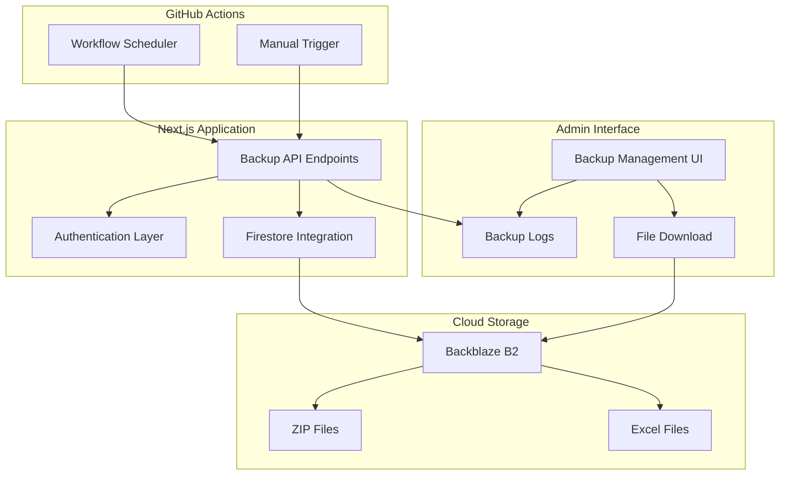
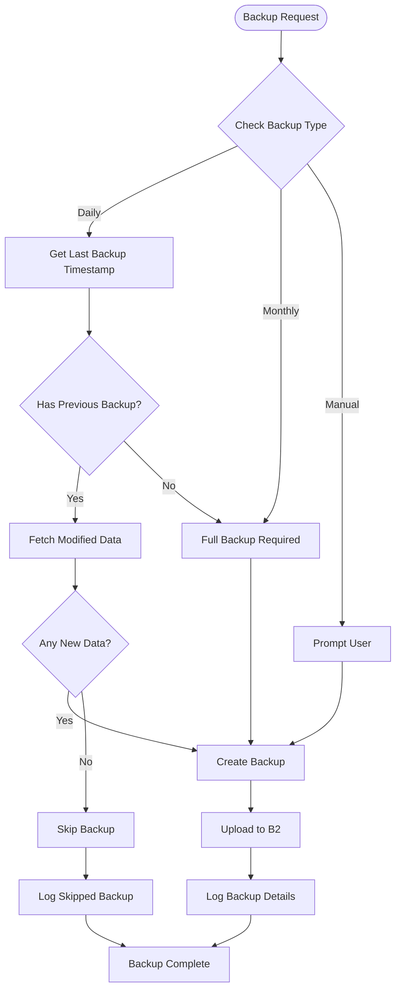
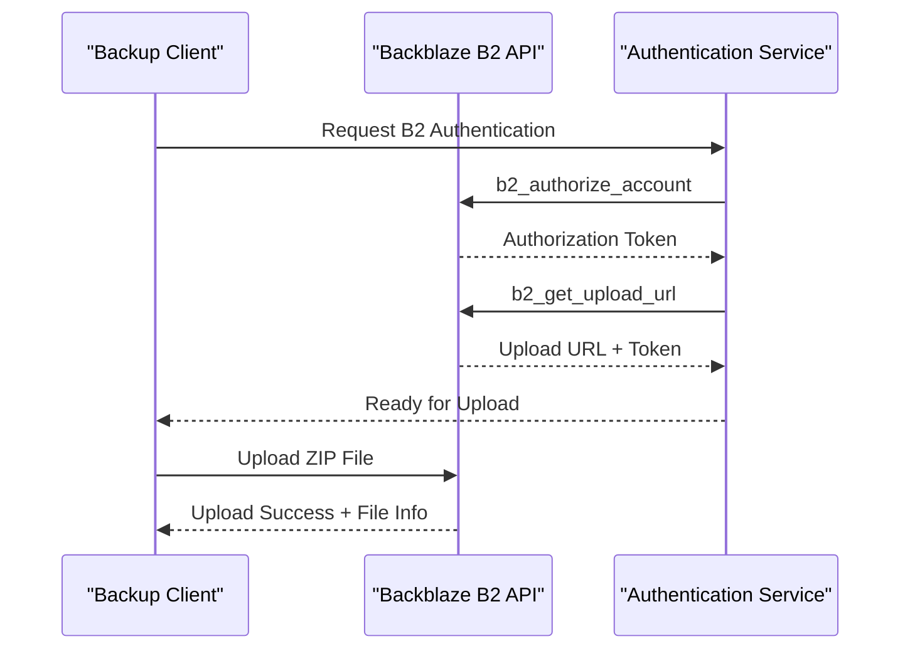
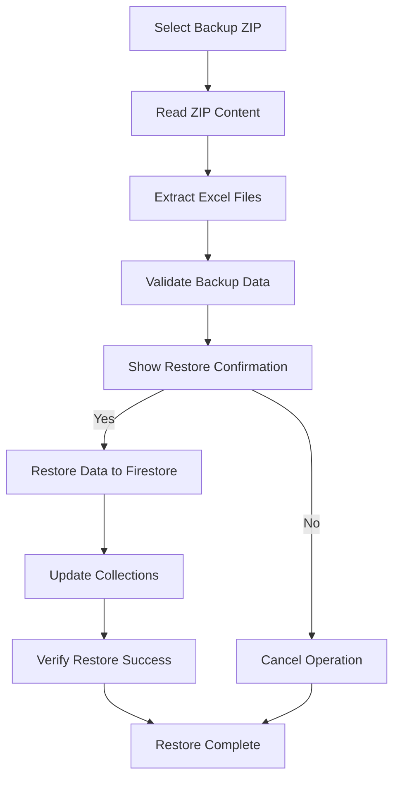

# Automated Backup System

<cite>
**Referenced Files in This Document**
- [automated-backup.yml](file://.github/workflows/automated-backup.yml)
- [export/route.ts](file://app/api/backup/export/route.ts)
- [download/route.ts](file://app/api/backup/download/route.ts)
- [manual-upload/route.ts](file://app/api/backup/manual-upload/route.ts)
- [backblazeB2.ts](file://lib/backblazeB2.ts)
- [BACKUP_SETUP.md](file://docs/BACKUP_SETUP.md)
- [admin-backup-page.tsx](file://app/admin/backup/page.tsx)
- [firebaseAdmin.ts](file://lib/firebaseAdmin.ts)
- [firebase.ts](file://lib/firebase.ts)
- [package.json](file://package.json)
</cite>

## Table of Contents
1. [Introduction](#introduction)
2. [System Architecture](#system-architecture)
3. [Backup Components](#backup-components)
4. [GitHub Actions Workflow](#github-actions-workflow)
5. [Backup API Endpoints](#backup-api-endpoints)
6. [Backblaze B2 Integration](#backblaze-b2-integration)
7. [Admin Interface](#admin-interface)
8. [Data Processing Pipeline](#data-processing-pipeline)
9. [Security Implementation](#security-implementation)
10. [Monitoring and Logging](#monitoring-and-logging)
11. [Setup and Configuration](#setup-and-configuration)
12. [Troubleshooting Guide](#troubleshooting-guide)
13. [Conclusion](#conclusion)

## Introduction

The Automated Backup System is a comprehensive data protection solution for the SAMPA Coop Next.js application. This system provides automated, scheduled backups of Firestore database collections to cloud storage with support for incremental backups, manual restoration capabilities, and comprehensive monitoring.

The system ensures business continuity by automatically backing up critical member, loan, savings, and user data on a daily and monthly basis, while providing administrators with tools to manually trigger backups and restore data when needed.

## System Architecture

The backup system follows a distributed architecture with clear separation of concerns across multiple components:



**Diagram sources**
- [automated-backup.yml:1-202](file://.github/workflows/automated-backup.yml#L1-L202)
- [export/route.ts:98-277](file://app/api/backup/export/route.ts#L98-L277)
- [backblazeB2.ts:87-131](file://lib/backblazeB2.ts#L87-L131)

## Backup Components

### Core Backup Engine

The backup system consists of several interconnected components working together to provide comprehensive data protection:

**Backup Types Supported:**
- **Daily Incremental Backups**: Only new or modified data since last backup
- **Monthly Full Backups**: Complete dataset backup
- **Manual Backups**: Administrator-triggered backups
- **Full System Backups**: Complete system restoration

**Data Collections Backed Up:**
- Members data
- Loan records
- Loan requests
- Savings transactions
- User accounts

**Backup File Format:**
Each backup creates a ZIP archive containing:
- Individual Excel worksheets for each collection
- JSON metadata with backup details
- Timestamp information and record counts

**Section sources**
- [export/route.ts:17-26](file://app/api/backup/export/route.ts#L17-L26)
- [export/route.ts:131-140](file://app/api/backup/export/route.ts#L131-L140)
- [BACKUP_SETUP.md:175-206](file://docs/BACKUP_SETUP.md#L175-L206)

### Incremental Backup Logic

The system implements intelligent incremental backup functionality:



**Diagram sources**
- [export/route.ts:118-126](file://app/api/backup/export/route.ts#L118-L126)
- [export/route.ts:152-173](file://app/api/backup/export/route.ts#L152-L173)
- [backblazeB2.ts:163-168](file://lib/backblazeB2.ts#L163-L168)

**Section sources**
- [export/route.ts:76-96](file://app/api/backup/export/route.ts#L76-L96)
- [export/route.ts:118-126](file://app/api/backup/export/route.ts#L118-L126)
- [BACKUP_SETUP.md:208-216](file://docs/BACKUP_SETUP.md#L208-L216)

## GitHub Actions Workflow

The GitHub Actions workflow provides automated scheduling and execution of backup tasks:

### Scheduled Backups

The workflow supports multiple backup schedules:

| Backup Type | Schedule | Description |
|-------------|----------|-------------|
| **Daily** | `59 23 * * *` (UTC) | Incremental backup of new/modified data |
| **Monthly** | `0 0 1 * *` (UTC) | Full backup of complete dataset |

### Manual Trigger Capabilities

Administrators can manually trigger backups through the GitHub Actions interface with options for:
- Backup type selection (daily, monthly, full)
- Incremental backup toggle
- Collection filtering

**Section sources**
- [automated-backup.yml:3-25](file://.github/workflows/automated-backup.yml#L3-L25)
- [automated-backup.yml:28-95](file://.github/workflows/automated-backup.yml#L28-L95)
- [automated-backup.yml:96-155](file://.github/workflows/automated-backup.yml#L96-L155)

## Backup API Endpoints

The system provides multiple API endpoints for comprehensive backup management:

### Export Endpoint (`/api/backup/export`)

Primary endpoint for automated and manual backup creation:

**Request Parameters:**
- `type`: Backup type (daily, monthly, full)
- `incremental`: Boolean for incremental vs full backup
- `collections`: Array of collections to include

**Response Format:**
```json
{
  "success": true,
  "message": "backup completed successfully",
  "fileName": "backups/sampa-backup-daily-2024-01-01_12-00-00.zip",
  "fileId": "b2-file-id",
  "downloadUrl": "https://download-url",
  "records": 1500,
  "incremental": true,
  "since": "2024-01-01T12:00:00Z",
  "timestamp": "2024-01-02T12:00:00Z"
}
```

### Download Endpoint (`/api/backup/download`)

Direct file download from Backblaze B2 storage:

**Query Parameters:**
- `file`: Filename to download

**Response:** Binary ZIP file with proper headers

### Manual Upload Endpoint (`/api/backup/manual-upload`)

Endpoint for uploading manually created backups:

**Request Body (FormData):**
- `file`: ZIP file content
- `fileName`: Target filename
- `type`: Backup type
- `records`: Record count

**Section sources**
- [export/route.ts:98-277](file://app/api/backup/export/route.ts#L98-L277)
- [download/route.ts:1-50](file://app/api/backup/download/route.ts#L1-L50)
- [manual-upload/route.ts:1-45](file://app/api/backup/manual-upload/route.ts#L1-L45)

## Backblaze B2 Integration

The system integrates with Backblaze B2 cloud storage for reliable off-site backup storage:

### Authentication Flow



**Diagram sources**
- [backblazeB2.ts:20-52](file://lib/backblazeB2.ts#L20-L52)
- [backblazeB2.ts:54-85](file://lib/backblazeB2.ts#L54-L85)
- [backblazeB2.ts:87-131](file://lib/backblazeB2.ts#L87-L131)

### Upload Process

The upload process includes comprehensive error handling and validation:

**Upload Steps:**
1. **Authentication**: Retrieve authorization token
2. **Upload URL**: Get pre-signed upload URL
3. **File Hash**: Generate SHA1 hash for integrity verification
4. **Upload**: Send file with metadata
5. **Validation**: Verify upload completion
6. **Cleanup**: Store download URL for later retrieval

**Section sources**
- [backblazeB2.ts:87-131](file://lib/backblazeB2.ts#L87-L131)
- [backblazeB2.ts:133-161](file://lib/backblazeB2.ts#L133-L161)

## Admin Interface

The administrative interface provides comprehensive backup management capabilities:

### Backup Management Dashboard

The admin interface offers:

**Real-time Backup Monitoring:**
- Live backup status updates
- Filter by backup type (daily, monthly, manual)
- Date and time range filtering
- Pagination for large datasets

**Backup Operations:**
- Manual backup generation
- Backup file download
- Backup restoration from ZIP files
- Backup log viewing and filtering

**Visual Indicators:**
- Color-coded backup types
- Status indicators for success/skipped states
- Record count displays
- Download progress tracking

### Backup Restoration Process



**Diagram sources**
- [admin-backup-page.tsx:236-394](file://app/admin/backup/page.tsx#L236-L394)
- [admin-backup-page.tsx:320-383](file://app/admin/backup/page.tsx#L320-L383)

**Section sources**
- [admin-backup-page.tsx:34-639](file://app/admin/backup/page.tsx#L34-L639)

## Data Processing Pipeline

The backup system implements a sophisticated data processing pipeline:

### Data Extraction and Transformation

**Excel Generation Process:**
1. **Data Fetching**: Retrieve documents from Firestore collections
2. **Data Truncation**: Prevent Excel cell limit violations (32,767 character limit)
3. **Excel Conversion**: Transform JSON data to Excel worksheets
4. **ZIP Creation**: Package all files into compressed archive

**Data Validation:**
- Record count verification
- File format validation
- Integrity checks before upload

### Memory Management

The system handles large datasets efficiently:

**Streaming Approach:**
- Processes data in chunks
- Manages memory usage during ZIP creation
- Implements timeout handling for large operations

**Error Recovery:**
- Graceful degradation on failures
- Partial backup capability
- Comprehensive logging for debugging

**Section sources**
- [export/route.ts:28-56](file://app/api/backup/export/route.ts#L28-L56)
- [export/route.ts:175-220](file://app/api/backup/export/route.ts#L175-L220)
- [admin-backup-page.tsx:121-150](file://app/admin/backup/page.tsx#L121-L150)

## Security Implementation

The backup system implements multiple layers of security:

### Authentication and Authorization

**API Key Management:**
- Bearer token authentication
- Environment variable storage
- Secret rotation support

**Access Control:**
- Role-based permissions for backup access
- Administrative privilege verification
- Secure credential handling

### Data Protection

**Encryption:**
- HTTPS transport encryption
- Cloud storage encryption at rest
- Secure file transfer protocols

**Integrity Verification:**
- SHA1 hash validation
- File integrity checks
- Duplicate detection

### Audit Trail

**Comprehensive Logging:**
- Backup operation logs
- Access audit trails
- Error reporting
- Performance metrics

**Section sources**
- [export/route.ts:58-74](file://app/api/backup/export/route.ts#L58-L74)
- [admin-backup-page.tsx:101-119](file://app/admin/backup/page.tsx#L101-L119)
- [BACKUP_SETUP.md:239-244](file://docs/BACKUP_SETUP.md#L239-L244)

## Monitoring and Logging

The system provides comprehensive monitoring and logging capabilities:

### Backup Status Tracking

**Real-time Monitoring:**
- Live backup progress updates
- Automatic status notifications
- Error detection and alerting
- Performance metrics collection

**Historical Tracking:**
- Backup history logs
- Success/failure statistics
- Trend analysis
- Compliance reporting

### Alerting and Notifications

**Multi-channel Alerts:**
- GitHub Actions email notifications
- Slack/Discord integration possibilities
- Email notifications for failures
- SMS alerts for critical issues

**Health Checks:**
- System uptime monitoring
- Storage capacity alerts
- Performance degradation warnings
- Backup completion confirmations

**Section sources**
- [automated-backup.yml:79-95](file://.github/workflows/automated-backup.yml#L79-L95)
- [automated-backup.yml:139-154](file://.github/workflows/automated-backup.yml#L139-L154)
- [export/route.ts:240-253](file://app/api/backup/export/route.ts#L240-L253)

## Setup and Configuration

### Initial Setup Process

The system requires minimal configuration for deployment:

**Required Environment Variables:**
- `BACKUP_API_KEY`: Secret key for API authentication
- `B2_ACCOUNT_ID`: Backblaze B2 account identifier
- `B2_APPLICATION_KEY`: Backblaze B2 application key
- `B2_BUCKET_ID`: Target backup bucket identifier
- `B2_BUCKET_NAME`: Backup bucket name

**Firebase Configuration:**
- Service account credentials
- Firestore database connection
- Collection access permissions

### Deployment Requirements

**Infrastructure Dependencies:**
- Next.js application hosting
- Backblaze B2 storage account
- GitHub Actions workflow execution
- Firebase Firestore database

**Network Requirements:**
- Outbound HTTPS access to Backblaze B2
- Firebase Admin SDK connectivity
- GitHub Actions network access

**Section sources**
- [BACKUP_SETUP.md:50-116](file://docs/BACKUP_SETUP.md#L50-L116)
- [firebaseAdmin.ts:13-108](file://lib/firebaseAdmin.ts#L13-L108)
- [package.json:16-44](file://package.json#L16-L44)

## Troubleshooting Guide

### Common Issues and Solutions

**Authentication Problems:**
- Verify BACKUP_API_KEY configuration
- Check B2 credential validity
- Confirm environment variable setup
- Test API endpoint access

**Backup Failures:**
- Monitor GitHub Actions logs
- Check Firestore query permissions
- Verify B2 storage capacity
- Review network connectivity

**Data Integrity Issues:**
- Validate Excel file generation
- Check ZIP archive integrity
- Verify backup file completeness
- Test restore process

### Diagnostic Tools

**Built-in Diagnostics:**
- Health check endpoints
- Connection validation
- Performance monitoring
- Error reporting mechanisms

**External Tools:**
- Backblaze B2 console monitoring
- Firebase Firestore viewer
- Network connectivity testing
- SSL certificate validation

**Section sources**
- [BACKUP_SETUP.md:232-237](file://docs/BACKUP_SETUP.md#L232-L237)
- [export/route.ts:267-276](file://app/api/backup/export/route.ts#L267-L276)

## Conclusion

The Automated Backup System provides a robust, scalable solution for protecting critical data in the SAMPA Coop application. The system's architecture ensures reliability, security, and ease of maintenance while providing comprehensive backup and restore capabilities.

**Key Benefits:**
- **Automated Scheduling**: Reduces manual intervention requirements
- **Incremental Backups**: Minimizes storage and bandwidth usage
- **Multiple Backup Types**: Supports various recovery scenarios
- **Comprehensive Monitoring**: Provides visibility into backup operations
- **Secure Architecture**: Implements industry-standard security practices
- **Flexible Restoration**: Enables granular and complete data recovery

The system is designed for production environments with enterprise-grade reliability, comprehensive error handling, and extensive monitoring capabilities. Administrators can confidently rely on this system for business continuity and disaster recovery needs.

Future enhancements could include support for additional cloud providers, enhanced compression algorithms, and advanced analytics for backup optimization. The modular architecture supports these extensions while maintaining backward compatibility with existing backup configurations.