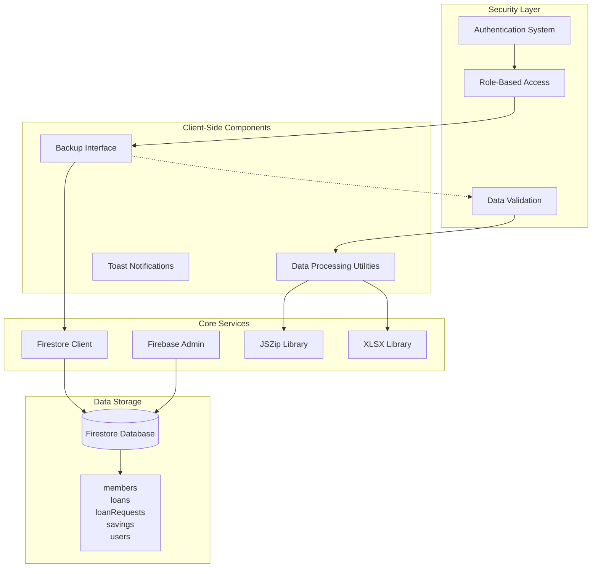
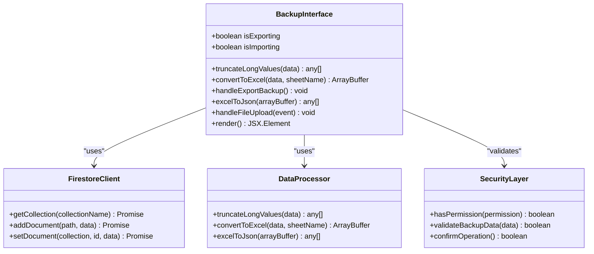
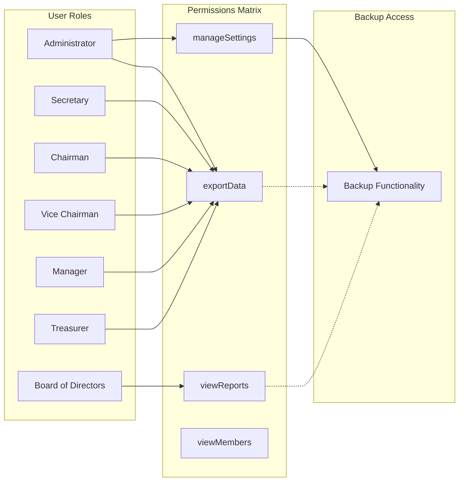
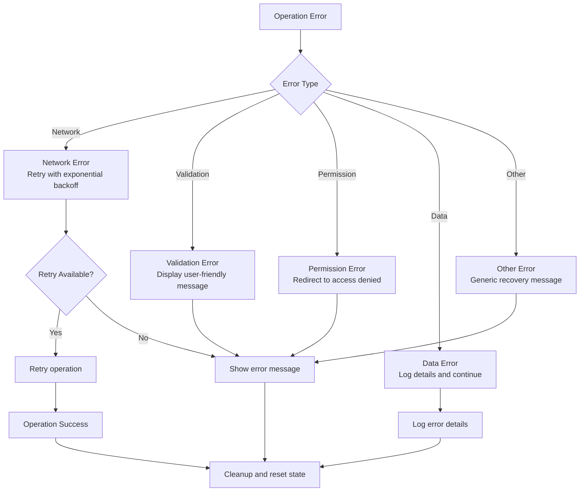

# Backup and Restore System

<cite>
**Referenced Files in This Document**
- [page.tsx](file://app/admin/backup/page.tsx)
- [firebase.ts](file://lib/firebase.ts)
- [firebaseAdmin.ts](file://lib/firebaseAdmin.ts)
- [rolePermissions.tsx](file://lib/rolePermissions.tsx)
- [auth.tsx](file://lib/auth.tsx)
- [package.json](file://package.json)
</cite>

## Table of Contents
1. [Introduction](#introduction)
2. [System Architecture](#system-architecture)
3. [Core Components](#core-components)
4. [Backup Process](#backup-process)
5. [Restore Process](#restore-process)
6. [Data Validation and Safety](#data-validation-and-safety)
7. [Security Implementation](#security-implementation)
8. [Error Handling and Recovery](#error-handling-and-recovery)
9. [Performance Considerations](#performance-considerations)
10. [Troubleshooting Guide](#troubleshooting-guide)
11. [Conclusion](#conclusion)

## Introduction

The Backup and Restore System is a comprehensive data management solution built for the SAMPA Cooperative application. This system provides automated backup and restoration capabilities for all core application data including members, loans, loan requests, savings transactions, and user accounts. The system leverages Firebase Firestore as the primary data storage mechanism and implements robust safety measures to ensure data integrity during backup and restore operations.

The system is designed with security, reliability, and user experience in mind, featuring role-based access controls, data validation, and comprehensive error handling. It supports both manual and automated backup processes while maintaining full compatibility with the application's existing data structures and business logic.

## System Architecture

The backup and restore system follows a client-server architecture pattern with clear separation of concerns:



**Diagram sources**
- [page.tsx:1-434](file://app/admin/backup/page.tsx#L1-L434)
- [firebase.ts:90-382](file://lib/firebase.ts#L90-L382)
- [firebaseAdmin.ts:110-266](file://lib/firebaseAdmin.ts#L110-L266)

The architecture ensures that backup operations are performed client-side for user convenience, while restore operations leverage server-side Firebase Admin for enhanced security and reliability. This hybrid approach optimizes user experience while maintaining data integrity.

**Section sources**
- [page.tsx:1-434](file://app/admin/backup/page.tsx#L1-L434)
- [firebase.ts:1-61](file://lib/firebase.ts#L1-L61)
- [firebaseAdmin.ts:1-108](file://lib/firebaseAdmin.ts#L1-L108)

## Core Components

### Backup Interface Component

The main backup interface is implemented as a React component that provides intuitive controls for backup and restore operations. The component manages state for both export and import operations, handles user interactions, and coordinates with backend services.



**Diagram sources**
- [page.tsx:21-303](file://app/admin/backup/page.tsx#L21-L303)

### Data Processing Engine

The system includes sophisticated data processing capabilities that handle Excel file generation, ZIP archive creation, and data validation. The processing engine ensures data integrity and prevents Excel cell limit violations.

**Section sources**
- [page.tsx:46-136](file://app/admin/backup/page.tsx#L46-L136)
- [page.tsx:138-198](file://app/admin/backup/page.tsx#L138-L198)

## Backup Process

The backup process is designed to be comprehensive and efficient, capturing all relevant data from the Firestore database and packaging it into a structured format for easy restoration.

```mermaid
sequenceDiagram
participant User as User Interface
participant Backup as Backup Component
participant FS as Firestore Client
participant Processor as Data Processor
participant Zipper as ZIP Generator
participant Excel as Excel Converter
participant Toast as Notification System
User->>Backup : Click Export Backup
Backup->>Toast : Show loading message
Backup->>Backup : Set isExporting = true
par Parallel Data Fetch
Backup->>FS : getCollection('members')
Backup->>FS : getCollection('loans')
Backup->>FS : getCollection('loanRequests')
Backup->>FS : getCollection('savings')
Backup->>FS : getCollection('users')
and
FS-->>Backup : Collection data
FS-->>Backup : Collection data
FS-->>Backup : Collection data
FS-->>Backup : Collection data
FS-->>Backup : Collection data
end
Backup->>Processor : truncateLongValues(data)
Processor-->>Backup : Processed data
par Excel Generation
Backup->>Excel : convertToExcel(members, 'Members')
Backup->>Excel : convertToExcel(loans, 'Loans')
Backup->>Excel : convertToExcel(loanRequests, 'LoanRequests')
Backup->>Excel : convertToExcel(savings, 'Savings')
Backup->>Excel : convertToExcel(users, 'Users')
and
Excel-->>Backup : Excel buffers
Backup->>Zipper : Create ZIP archive
Zipper-->>Backup : ZIP blob
Backup->>User : Trigger download
Backup->>Toast : Show success message
Backup->>Backup : Set isExporting = false
```

**Diagram sources**
- [page.tsx:78-136](file://app/admin/backup/page.tsx#L78-L136)
- [page.tsx:84-90](file://app/admin/backup/page.tsx#L84-L90)

### Data Extraction Strategy

The backup process employs a strategic approach to data extraction, utilizing parallel processing to minimize wait times and improve user experience. The system fetches data from all five core collections simultaneously, ensuring comprehensive coverage of the application's data.

**Section sources**
- [page.tsx:83-96](file://app/admin/backup/page.tsx#L83-L96)

## Restore Process

The restore process provides a comprehensive data recovery mechanism with built-in safety checks and user confirmation dialogs. The system validates backup files, presents restoration summaries, and executes data restoration with error handling.

```mermaid
sequenceDiagram
participant User as User Interface
participant Restore as Restore Component
participant File as File Handler
participant Zipper as ZIP Reader
participant Excel as Excel Parser
participant FS as Firestore Client
participant Toast as Notification System
User->>Restore : Upload ZIP file
Restore->>Toast : Show loading message
Restore->>Restore : Set isImporting = true
Restore->>File : Read uploaded file
File->>Zipper : Load ZIP archive
Zipper-->>Restore : ZIP entries
par Parallel File Processing
Restore->>Zipper : Read Members.xlsx
Restore->>Zipper : Read Loans.xlsx
Restore->>Zipper : Read LoanRequests.xlsx
Restore->>Zipper : Read Savings.xlsx
Restore->>Zipper : Read Users.xlsx
and
Zipper-->>Restore : Excel buffers
Restore->>Excel : Parse Excel files
Excel-->>Restore : JSON data arrays
Restore->>Restore : Validate backup data
Restore->>User : Show confirmation dialog
alt User confirms
User->>Restore : Confirm restore
par Parallel Restore Operations
Restore->>FS : setDocument/members
Restore->>FS : setDocument/loans
Restore->>FS : setDocument/loanRequests
Restore->>FS : setDocument/savings
Restore->>FS : setDocument/users
and
FS-->>Restore : Operation results
Restore->>Toast : Show success message
else User cancels
User->>Restore : Cancel operation
Restore->>Toast : Show cancellation message
end
Restore->>Restore : Set isImporting = false
Restore->>Restore : Reset file input
```

**Diagram sources**
- [page.tsx:145-303](file://app/admin/backup/page.tsx#L145-L303)
- [page.tsx:209-225](file://app/admin/backup/page.tsx#L209-L225)

### Safety Mechanisms

The restore process implements multiple safety mechanisms to prevent accidental data loss:

1. **User Confirmation**: Explicit confirmation dialog with detailed impact information
2. **Data Validation**: Comprehensive validation of backup file contents
3. **Progress Tracking**: Real-time progress indication during restore operations
4. **Error Isolation**: Individual operation failure handling without affecting others

**Section sources**
- [page.tsx:209-225](file://app/admin/backup/page.tsx#L209-L225)
- [page.tsx:295-302](file://app/admin/backup/page.tsx#L295-L302)

## Data Validation and Safety

The system implements comprehensive data validation and safety measures to ensure reliable backup and restore operations.

### Excel Cell Limit Compliance

The system includes automatic truncation of excessively long data to prevent Excel cell limit violations (32,767 character limit):


**Diagram sources**
- [page.tsx:47-66](file://app/admin/backup/page.tsx#L47-L66)

### Backup File Integrity

The system validates backup files before attempting restoration, checking for:

- **File Format**: Ensures ZIP archive with valid Excel files
- **Collection Coverage**: Verifies presence of all expected data collections
- **Record Count**: Confirms non-zero record counts for all collections
- **Data Structure**: Validates JSON structure consistency

**Section sources**
- [page.tsx:200-207](file://app/admin/backup/page.tsx#L200-L207)

## Security Implementation

The backup and restore system implements robust security measures to protect sensitive data and maintain system integrity.

### Role-Based Access Control

Access to backup functionality is restricted through comprehensive role-based permissions:



**Diagram sources**
- [rolePermissions.tsx:24-130](file://lib/rolePermissions.tsx#L24-L130)

### Authentication Integration

The system integrates with the application's authentication framework to ensure only authorized users can access backup operations:

- **Session Validation**: Requires active user session
- **Role Verification**: Confirms user has appropriate permissions
- **Real-time Updates**: Dynamically updates permission status
- **Fallback Handling**: Graceful degradation with default permissions

**Section sources**
- [rolePermissions.tsx:155-206](file://lib/rolePermissions.tsx#L155-L206)
- [auth.tsx:162-199](file://lib/auth.tsx#L162-L199)

## Error Handling and Recovery

The system implements comprehensive error handling strategies to ensure reliable operation and graceful recovery from failures.

### Error Classification and Handling



### Recovery Strategies

The system implements multiple recovery strategies:

1. **Automatic Retry**: Network failures trigger automatic retry attempts
2. **Partial Recovery**: Individual operation failures don't halt entire processes
3. **State Restoration**: System state is restored after error conditions
4. **User Feedback**: Clear error messages guide users through recovery steps

**Section sources**
- [page.tsx:130-135](file://app/admin/backup/page.tsx#L130-L135)
- [page.tsx:295-302](file://app/admin/backup/page.tsx#L295-L302)

## Performance Considerations

The backup and restore system is optimized for performance while maintaining reliability and data integrity.

### Parallel Processing Architecture

The system utilizes parallel processing to maximize efficiency:

- **Concurrent Data Fetch**: Multiple Firestore queries execute simultaneously
- **Parallel File Processing**: Excel file conversion occurs in parallel
- **Asynchronous Operations**: Non-blocking operations improve user experience
- **Memory Management**: Efficient memory usage prevents performance degradation

### Data Size Optimization

The system implements several optimization strategies:

- **Lazy Loading**: Data is processed incrementally to reduce memory footprint
- **Compression**: ZIP archives reduce file sizes for backup storage
- **Efficient Serialization**: Optimized JSON serialization minimizes overhead
- **Batch Operations**: Multiple documents processed in batches during restore

**Section sources**
- [page.tsx:84-90](file://app/admin/backup/page.tsx#L84-L90)
- [page.tsx:168-196](file://app/admin/backup/page.tsx#L168-L196)

## Troubleshooting Guide

Common issues and their solutions for the backup and restore system:

### Backup Issues

**Problem**: Backup fails with "Collection not found" error
**Solution**: Verify Firestore collections exist and have proper indexing

**Problem**: Large datasets cause timeout errors
**Solution**: Split data into smaller chunks or increase timeout limits

**Problem**: Excel files exceed cell limits
**Solution**: System automatically truncates data exceeding 32,767 characters

### Restore Issues

**Problem**: Restore operation shows "No valid data found"
**Solution**: Verify backup file integrity and contains all required Excel files

**Problem**: Permission denied during restore
**Solution**: Ensure user has appropriate role-based permissions

**Problem**: Data conflicts during restore
**Solution**: Review existing data and resolve conflicts manually

### Performance Issues

**Problem**: Slow backup/restore operations
**Solution**: Optimize network connection and consider batch processing

**Problem**: Memory exhaustion with large datasets
**Solution**: Implement streaming processing and memory cleanup

**Section sources**
- [page.tsx:205-207](file://app/admin/backup/page.tsx#L205-L207)
- [page.tsx:210-219](file://app/admin/backup/page.tsx#L210-L219)

## Conclusion

The Backup and Restore System provides a comprehensive, secure, and user-friendly solution for data management in the SAMPA Cooperative application. The system successfully balances functionality, security, and performance while maintaining ease of use for administrators and authorized users.

Key strengths of the system include:

- **Comprehensive Coverage**: Backs up all core application data
- **Robust Security**: Role-based access control and validation
- **User Experience**: Intuitive interface with progress tracking
- **Reliability**: Comprehensive error handling and recovery mechanisms
- **Performance**: Optimized for speed and efficiency

The system is well-positioned to support the cooperative's data management needs while providing a foundation for future enhancements and scalability improvements.