# Backup and Restore System

<cite>
**Referenced Files in This Document**
- [page.tsx](file://app/admin/backup/page.tsx)
- [route.ts](file://app/api/backup/export/route.ts)
- [manual-upload/route.ts](file://app/api/backup/manual-upload/route.ts)
- [download/route.ts](file://app/api/backup/download/route.ts)
- [automated-backup.yml](file://.github/workflows/automated-backup.yml)
- [backblazeB2.ts](file://lib/backblazeB2.ts)
- [BACKUP_SETUP.md](file://docs/BACKUP_SETUP.md)
- [firebase.ts](file://lib/firebase.ts)
- [firebaseAdmin.ts](file://lib/firebaseAdmin.ts)
- [rolePermissions.tsx](file://lib/rolePermissions.tsx)
- [auth.tsx](file://lib/auth.tsx)
- [package.json](file://package.json)
</cite>

## Update Summary
**Changes Made**
- Enhanced backup system with real-time monitoring capabilities using Firebase Firestore snapshots
- Added comprehensive backup log management interface with filtering, pagination, and status tracking
- Implemented new API endpoints for manual uploads and downloads with backup log integration
- Integrated Backblaze B2 cloud storage with improved upload/download functionality
- Added automated backup status monitoring with real-time updates
- Enhanced backup log management with filtering by type, date, and time
- Implemented pagination for backup log display with configurable row limits

## Table of Contents
1. [Introduction](#introduction)
2. [System Architecture](#system-architecture)
3. [Core Components](#core-components)
4. [Backup Process](#backup-process)
5. [Restore Process](#restore-process)
6. [Automated Backup System](#automated-backup-system)
7. [Cloud Storage Integration](#cloud-storage-integration)
8. [Incremental Backup Logic](#incremental-backup-logic)
9. [Backup Log Management](#backup-log-management)
10. [Real-time Monitoring](#real-time-monitoring)
11. [Data Validation and Safety](#data-validation-and-safety)
12. [Security Implementation](#security-implementation)
13. [Error Handling and Recovery](#error-handling-and-recovery)
14. [Performance Considerations](#performance-considerations)
15. [Setup and Configuration](#setup-and-configuration)
16. [Monitoring and Troubleshooting](#monitoring-and-troubleshooting)
17. [Conclusion](#conclusion)

## Introduction

The Backup and Restore System is a comprehensive data management solution built for the SAMPA Cooperative application. This system provides both manual and automated backup and restoration capabilities for all core application data including members, loans, loan requests, savings transactions, and user accounts. The system leverages Firebase Firestore as the primary data storage mechanism and implements robust safety measures to ensure data integrity during backup and restore operations.

**Updated** The system now features a comprehensive automated backup system with GitHub Actions integration, Backblaze B2 cloud storage, incremental backup logic, complete setup documentation, real-time monitoring capabilities, and advanced backup log management with filtering and pagination. The new system extends the existing manual backup functionality with automated scheduling, cloud storage, enhanced backup types (daily, monthly, full), real-time monitoring, and comprehensive backup log management interface.

The system is designed with security, reliability, and user experience in mind, featuring role-based access controls, data validation, comprehensive error handling, and real-time backup status monitoring. It supports both manual and automated backup processes while maintaining full compatibility with the application's existing data structures and business logic.

## System Architecture

The backup and restore system follows a hybrid client-server architecture pattern with clear separation of concerns, automated cloud integration, and real-time monitoring capabilities:

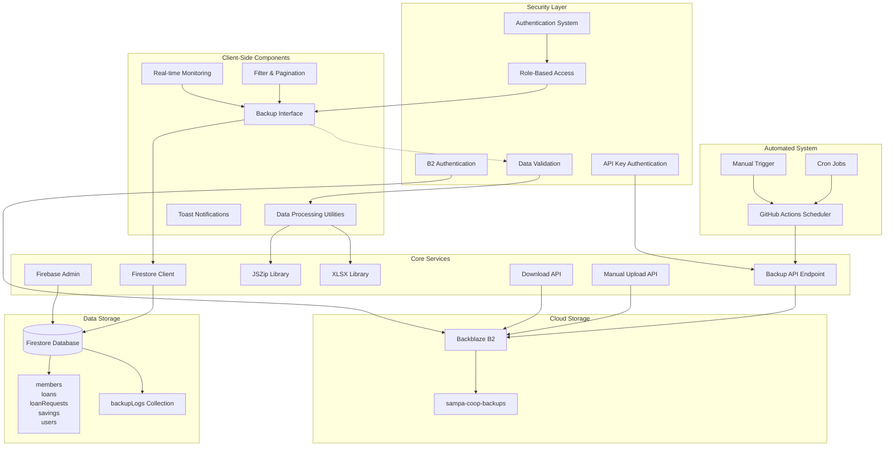

**Diagram sources**
- [page.tsx:1-639](file://app/admin/backup/page.tsx#L1-L639)
- [route.ts:1-294](file://app/api/backup/export/route.ts#L1-L294)
- [manual-upload/route.ts:1-45](file://app/api/backup/manual-upload/route.ts#L1-L45)
- [download/route.ts:1-50](file://app/api/backup/download/route.ts#L1-L50)
- [automated-backup.yml:1-202](file://.github/workflows/automated-backup.yml#L1-L202)
- [backblazeB2.ts:1-169](file://lib/backblazeB2.ts#L1-L169)

The architecture ensures that backup operations are performed client-side for user convenience, while automated backup processes leverage server-side APIs with cloud storage integration. Real-time monitoring capabilities provide instant feedback on backup operations through Firebase Firestore snapshots, while the backup log management interface offers comprehensive filtering, pagination, and status tracking capabilities.

**Section sources**
- [page.tsx:1-639](file://app/admin/backup/page.tsx#L1-L639)
- [route.ts:1-294](file://app/api/backup/export/route.ts#L1-L294)
- [automated-backup.yml:1-202](file://.github/workflows/automated-backup.yml#L1-L202)
- [backblazeB2.ts:1-169](file://lib/backblazeB2.ts#L1-L169)

## Core Components

### Enhanced Backup Interface Component

The main backup interface is implemented as a React component that provides intuitive controls for backup and restore operations with advanced filtering, pagination, and real-time monitoring capabilities. The component manages state for both export and import operations, handles user interactions, coordinates with backend services, and provides comprehensive backup log management.

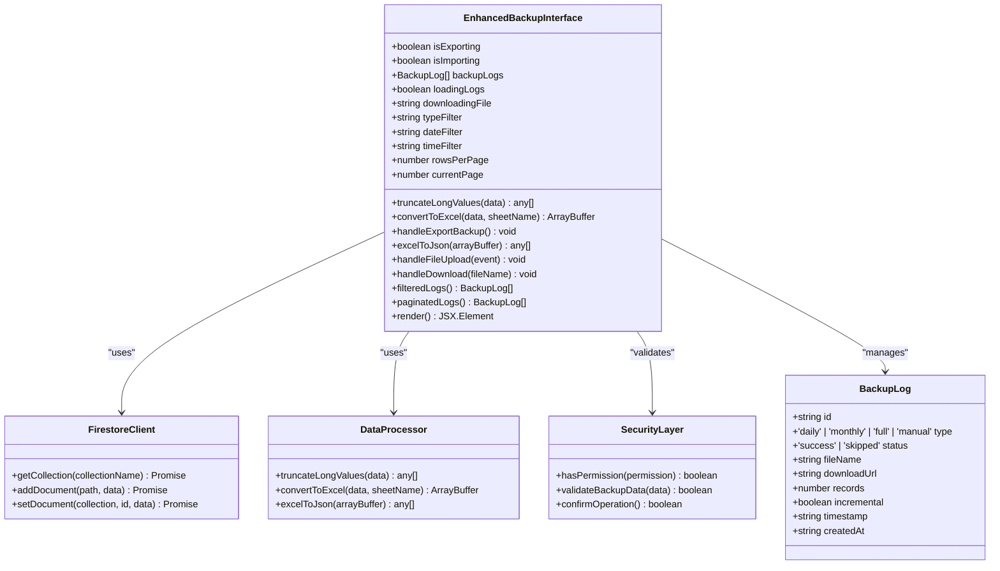

**Diagram sources**
- [page.tsx:12-639](file://app/admin/backup/page.tsx#L12-L639)

### Enhanced Automated Backup API

The system includes a dedicated API endpoint for automated backups that handles authentication, data processing, cloud storage integration, and comprehensive backup log management with real-time updates.

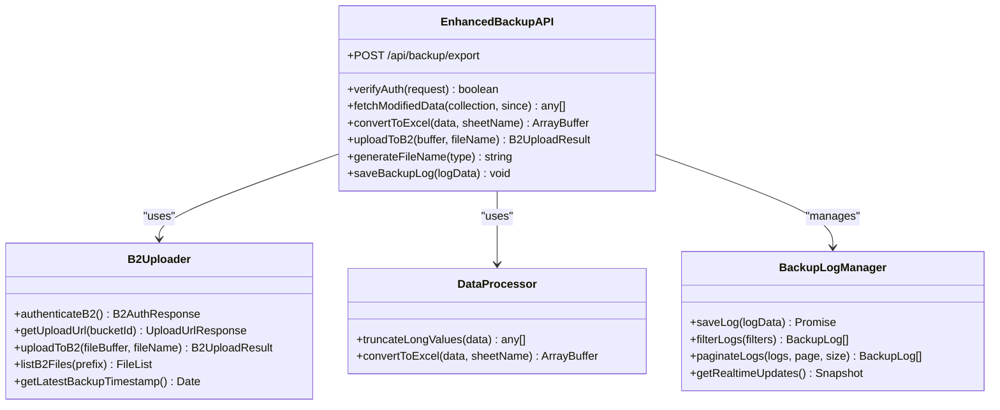

**Diagram sources**
- [route.ts:98-294](file://app/api/backup/export/route.ts#L98-L294)
- [backblazeB2.ts:96-169](file://lib/backblazeB2.ts#L96-L169)

### New Manual Upload API

The system includes a new API endpoint specifically designed for manual backup uploads from the client interface, providing seamless integration with the backup management interface.

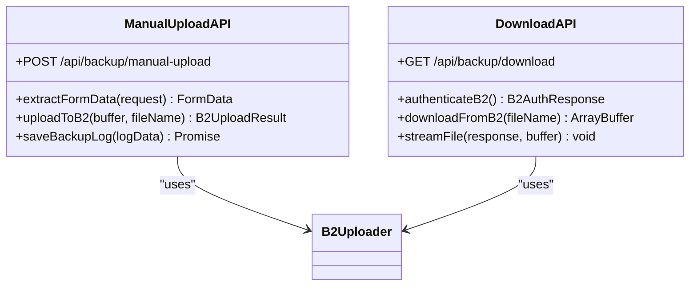

**Diagram sources**
- [manual-upload/route.ts:1-45](file://app/api/backup/manual-upload/route.ts#L1-L45)
- [download/route.ts:1-50](file://app/api/backup/download/route.ts#L1-L50)

### GitHub Actions Workflow

The system includes a comprehensive GitHub Actions workflow that automates backup scheduling and execution with enhanced monitoring and reporting capabilities.

```mermaid
flowchart TD
Start([Workflow Trigger]) --> CheckType{Trigger Type}
CheckType --> |Schedule| ScheduleCheck{Cron Schedule}
CheckType --> |Manual| ManualTrigger[Manual Trigger]
ScheduleCheck --> |Daily| DailyJob[Daily Backup Job]
ScheduleCheck --> |Monthly| MonthlyJob[Monthly Backup Job]
DailyJob --> DailyBackup[Daily Incremental Backup]
MonthlyJob --> MonthlyBackup[Monthly Full Backup]
ManualTrigger --> FullBackup[Full Backup (Manual)]
DailyBackup --> APICall[Call Backup API]
MonthlyBackup --> APICall
FullBackup --> APICall
APICall --> UploadB2[Upload to Backblaze B2]
UploadB2 --> SaveLog[Save Backup Log]
SaveLog --> Success[Success Notification]
UploadB2 --> Failure[Failure Notification]
Failure --> SaveFailedLog[Save Failed Log]
```

**Diagram sources**
- [automated-backup.yml:27-202](file://.github/workflows/automated-backup.yml#L27-L202)

**Section sources**
- [page.tsx:34-639](file://app/admin/backup/page.tsx#L34-L639)
- [route.ts:98-294](file://app/api/backup/export/route.ts#L98-L294)
- [manual-upload/route.ts:1-45](file://app/api/backup/manual-upload/route.ts#L1-L45)
- [download/route.ts:1-50](file://app/api/backup/download/route.ts#L1-L50)
- [automated-backup.yml:27-202](file://.github/workflows/automated-backup.yml#L27-L202)

## Backup Process

The backup process is designed to be comprehensive and efficient, capturing all relevant data from the Firestore database and packaging it into a structured format for easy restoration. The enhanced system now includes real-time monitoring, backup log management, and improved error handling.

```mermaid
sequenceDiagram
participant User as User Interface
participant Backup as Enhanced Backup Component
participant FS as Firestore Client
participant Processor as Data Processor
participant Zipper as ZIP Generator
participant Excel as Excel Converter
participant ManualUpload as Manual Upload API
participant Toast as Notification System
User->>Backup : Click Export Backup
Backup->>Toast : Show loading message
Backup->>Backup : Set isExporting = true
par Parallel Data Fetch
Backup->>FS : getCollection('members')
Backup->>FS : getCollection('loans')
Backup->>FS : getCollection('loanRequests')
Backup->>FS : getCollection('savings')
Backup->>FS : getCollection('users')
and
FS-->>Backup : Collection data
FS-->>Backup : Collection data
FS-->>Backup : Collection data
FS-->>Backup : Collection data
FS-->>Backup : Collection data
end
Backup->>Processor : truncateLongValues(data)
Processor-->>Backup : Processed data
par Excel Generation
Backup->>Excel : convertToExcel(members, 'Members')
Backup->>Excel : convertToExcel(loans, 'Loans')
Backup->>Excel : convertToExcel(loanRequests, 'LoanRequests')
Backup->>Excel : convertToExcel(savings, 'Savings')
Backup->>Excel : convertToExcel(users, 'Users')
and
Excel-->>Backup : Excel buffers
Backup->>Zipper : Create ZIP archive
Zipper-->>Backup : ZIP blob
Backup->>User : Trigger download
Backup->>ManualUpload : Upload to B2 + Save Log
ManualUpload-->>Backup : Upload success/failure
Backup->>Toast : Show success message
Backup->>Backup : Set isExporting = false
```

**Diagram sources**
- [page.tsx:153-227](file://app/admin/backup/page.tsx#L153-L227)
- [page.tsx:207-218](file://app/admin/backup/page.tsx#L207-L218)

### Data Extraction Strategy

The backup process employs a strategic approach to data extraction, utilizing parallel processing to minimize wait times and improve user experience. The system fetches data from all five core collections simultaneously, ensuring comprehensive coverage of the application's data. The enhanced system now includes comprehensive error handling and validation at each step.

**Section sources**
- [page.tsx:158-171](file://app/admin/backup/page.tsx#L158-L171)

## Restore Process

The restore process provides a comprehensive data recovery mechanism with built-in safety checks, user confirmation dialogs, and enhanced error handling. The system validates backup files, presents restoration summaries, and executes data restoration with comprehensive error handling and real-time progress indication.

```mermaid
sequenceDiagram
participant User as User Interface
participant Restore as Restore Component
participant File as File Handler
participant Zipper as ZIP Reader
participant Excel as Excel Parser
participant FS as Firestore Client
participant Toast as Notification System
User->>Restore : Upload ZIP file
Restore->>Toast : Show loading message
Restore->>Restore : Set isImporting = true
Restore->>File : Read uploaded file
File->>Zipper : Load ZIP archive
Zipper-->>Restore : ZIP entries
par Parallel File Processing
Restore->>Zipper : Read Members.xlsx
Restore->>Zipper : Read Loans.xlsx
Restore->>Zipper : Read LoanRequests.xlsx
Restore->>Zipper : Read Savings.xlsx
Restore->>Zipper : Read Users.xlsx
and
Zipper-->>Restore : Excel buffers
Restore->>Excel : Parse Excel files
Excel-->>Restore : JSON data arrays
Restore->>Restore : Validate backup data
Restore->>User : Show confirmation dialog
alt User confirms
User->>Restore : Confirm restore
par Parallel Restore Operations
Restore->>FS : setDocument/members
Restore->>FS : setDocument/loans
Restore->>FS : setDocument/loanRequests
Restore->>FS : setDocument/savings
Restore->>FS : setDocument/users
and
FS-->>Restore : Operation results
Restore->>Toast : Show success message
else User cancels
User->>Restore : Cancel operation
Restore->>Toast : Show cancellation message
end
Restore->>Restore : Set isImporting = false
Restore->>Restore : Reset file input
```

**Diagram sources**
- [page.tsx:237-394](file://app/admin/backup/page.tsx#L237-L394)
- [page.tsx:300-316](file://app/admin/backup/page.tsx#L300-L316)

### Safety Mechanisms

The restore process implements multiple safety mechanisms to prevent accidental data loss:

1. **User Confirmation**: Explicit confirmation dialog with detailed impact information
2. **Data Validation**: Comprehensive validation of backup file contents
3. **Progress Tracking**: Real-time progress indication during restore operations
4. **Error Isolation**: Individual operation failure handling without affecting others
5. **Comprehensive Error Handling**: Detailed error messages and recovery guidance

**Section sources**
- [page.tsx:300-316](file://app/admin/backup/page.tsx#L300-L316)
- [page.tsx:386-394](file://app/admin/backup/page.tsx#L386-L394)

## Automated Backup System

The system now includes a comprehensive automated backup system powered by GitHub Actions that provides scheduled backup execution without manual intervention, with enhanced monitoring, logging, and status tracking capabilities.

### GitHub Actions Workflow

The automated backup system is orchestrated through a GitHub Actions workflow that triggers backup jobs based on configurable schedules and manual triggers, with comprehensive error handling and notification capabilities.

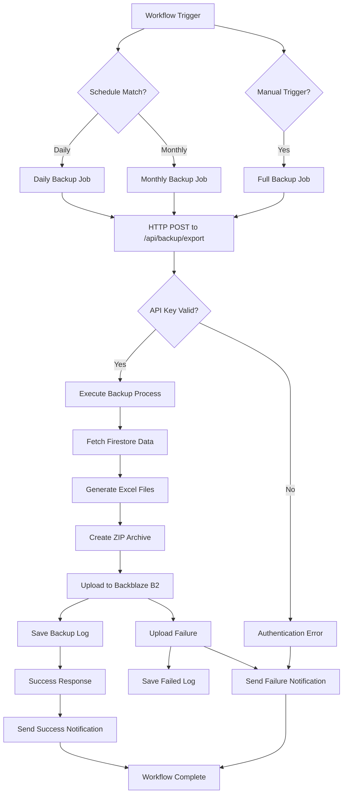

**Diagram sources**
- [automated-backup.yml:27-202](file://.github/workflows/automated-backup.yml#L27-L202)

### Backup Types and Scheduling

The system supports three distinct backup types with different scheduling patterns and enhanced monitoring capabilities:

| Backup Type | Schedule | Frequency | Purpose | Monitoring |
|-------------|----------|-----------|---------|------------|
| **Daily** | `59 23 * * *` (UTC) | Every day at 11:59 PM | Incremental backup of new/modified data | Real-time status updates |
| **Monthly** | `0 0 1 * *` (UTC) | 1st of every month at 12:00 AM | Full backup of all data | Monthly report generation |
| **Full** | Manual Trigger | On-demand | Complete system backup | Immediate notification |

**Section sources**
- [automated-backup.yml:3-26](file://.github/workflows/automated-backup.yml#L3-L26)
- [automated-backup.yml:27-202](file://.github/workflows/automated-backup.yml#L27-L202)

## Cloud Storage Integration

The system integrates with Backblaze B2 cloud storage to provide off-site redundancy and automated backup archival with enhanced upload/download functionality and comprehensive error handling.

### Backblaze B2 Integration

The cloud storage integration is handled through a dedicated utility module that manages authentication, upload operations, file listing, and comprehensive error handling.

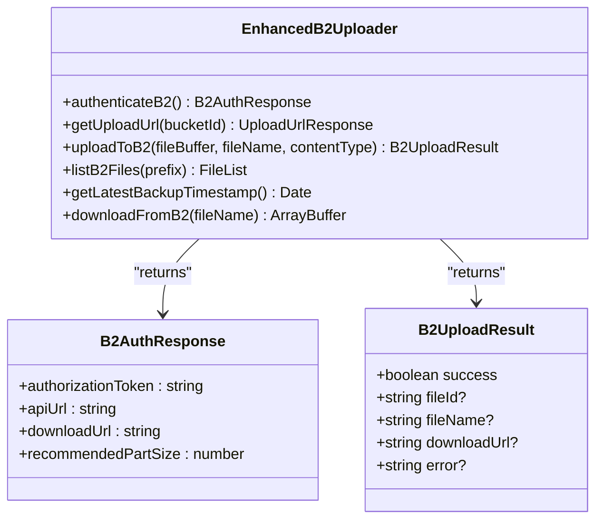

**Diagram sources**
- [backblazeB2.ts:20-169](file://lib/backblazeB2.ts#L20-L169)

### Enhanced Download API

The system includes a new download API endpoint that provides secure access to backup files stored in Backblaze B2 with comprehensive authentication and error handling.

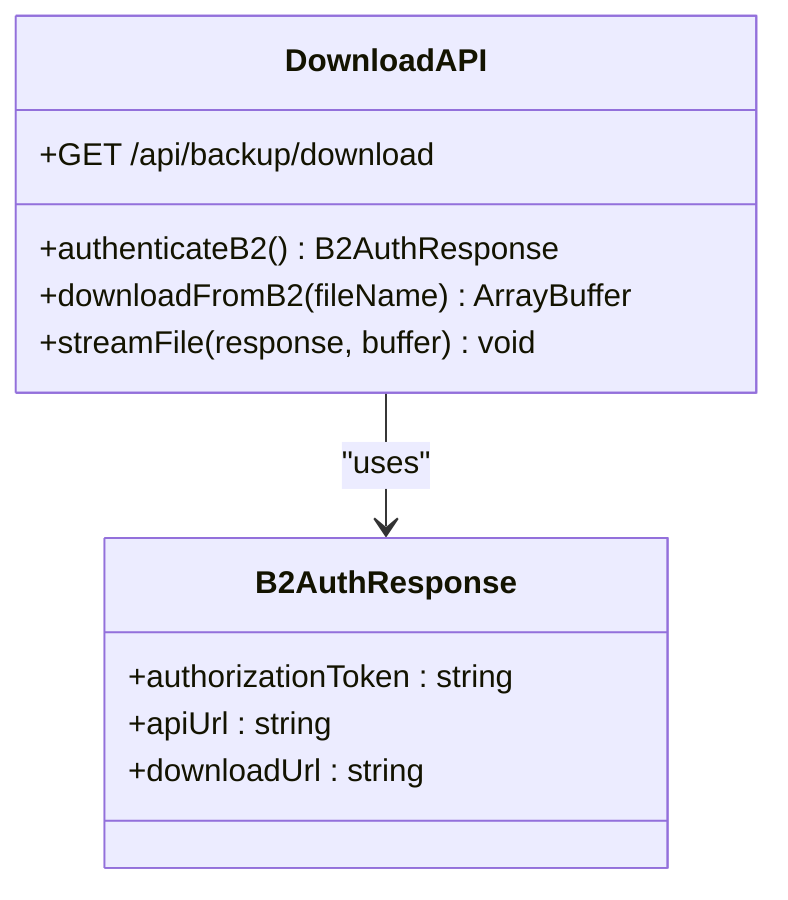

**Diagram sources**
- [download/route.ts:1-50](file://app/api/backup/download/route.ts#L1-L50)

### Backup File Structure

Each backup ZIP contains a structured file hierarchy with metadata and individual Excel files for each data collection, with enhanced metadata tracking and comprehensive error handling.

```
sampa-backup-{type}-{date}_{time}.zip
├── metadata.json          # Backup metadata (timestamp, counts, etc.)
├── Members.xlsx          # Members data
├── Loans.xlsx            # Loans data
├── LoanRequests.xlsx     # Loan requests data
├── Savings.xlsx          # Savings data
└── Users.xlsx            # Users data
```

**Section sources**
- [route.ts:180-210](file://app/api/backup/export/route.ts#L180-L210)
- [automated-backup.yml:170-178](file://.github/workflows/automated-backup.yml#L170-L178)

## Incremental Backup Logic

The system implements intelligent incremental backup logic that tracks the last backup time and only fetches records modified since then, significantly reducing backup size and processing time, with comprehensive logging and monitoring capabilities.

### Incremental Backup Algorithm

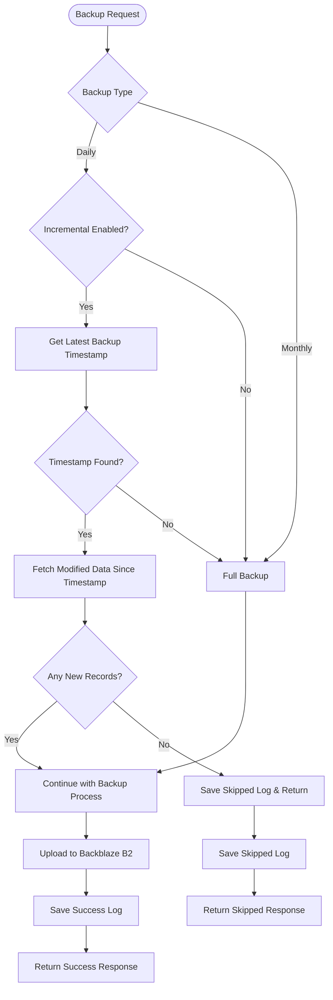

**Diagram sources**
- [route.ts:76-96](file://app/api/backup/export/route.ts#L76-L96)
- [route.ts:119-173](file://app/api/backup/export/route.ts#L119-L173)

### Enhanced Incremental Backup Implementation

The incremental backup logic relies on Firestore document timestamps to determine which records need to be included in the backup, with comprehensive logging and monitoring:

1. **First Backup**: Full backup (all data) - establishes baseline
2. **Daily Backups**: Only records with `updatedAt >= lastBackupTime`
3. **Monthly Backups**: Full backup (resets the baseline)
4. **Skipped Backups**: Automatic detection and logging of empty incremental backups
5. **Real-time Monitoring**: Live status updates through Firestore snapshots

**Section sources**
- [route.ts:76-96](file://app/api/backup/export/route.ts#L76-L96)
- [route.ts:119-173](file://app/api/backup/export/route.ts#L119-L173)
- [BACKUP_SETUP.md:208-217](file://docs/BACKUP_SETUP.md#L208-L217)

## Backup Log Management

The system provides comprehensive backup log management capabilities with real-time monitoring, filtering, pagination, and status tracking through Firebase Firestore snapshots.

### Real-time Backup Log Monitoring

The backup log management interface provides live updates on backup operations through Firebase Firestore real-time snapshots, enabling immediate visibility into backup status and progress.

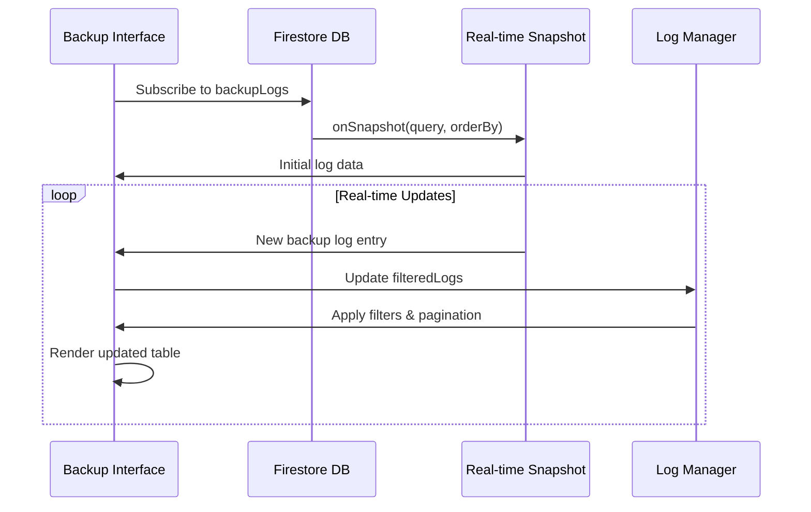

**Diagram sources**
- [page.tsx:49-59](file://app/admin/backup/page.tsx#L49-L59)

### Advanced Filtering and Pagination

The backup log management interface supports comprehensive filtering and pagination capabilities:

- **Type Filter**: Filter by backup type (daily, monthly, manual)
- **Date Filter**: Filter by specific date range
- **Time Filter**: Filter by time range
- **Pagination**: Configurable rows per page (10, 20, 50)
- **Real-time Updates**: Automatic refresh when filters change

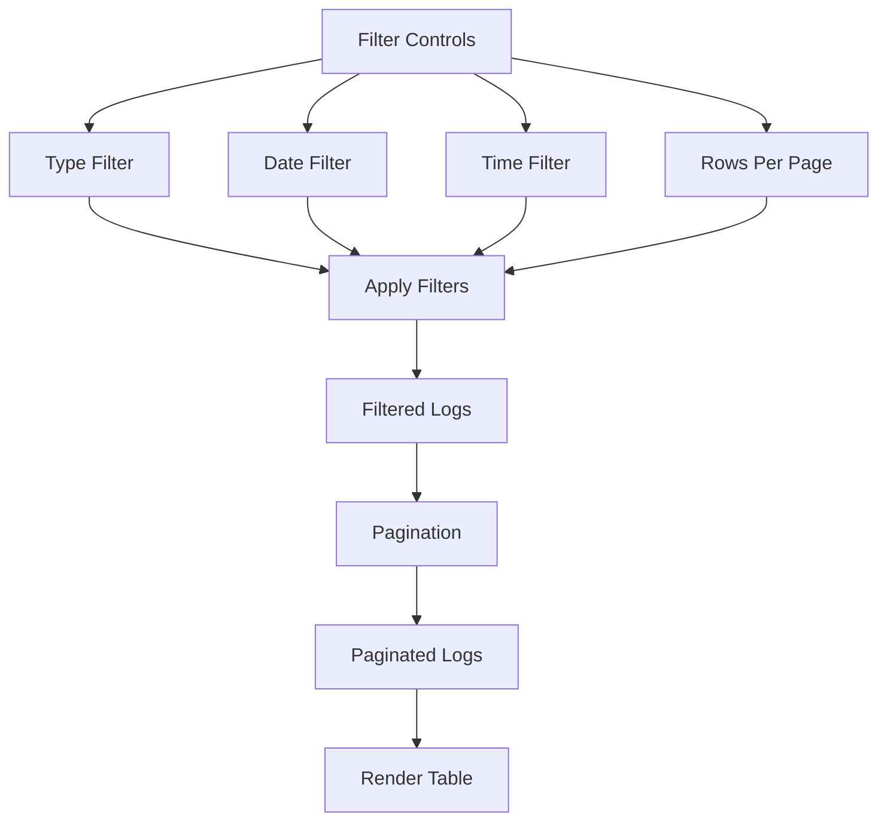

**Diagram sources**
- [page.tsx:42-78](file://app/admin/backup/page.tsx#L42-L78)

### Backup Log Data Structure

Each backup log entry contains comprehensive information about the backup operation:

| Field | Type | Description |
|-------|------|-------------|
| `id` | string | Unique log identifier |
| `type` | enum | Backup type (daily, monthly, manual) |
| `status` | enum | Operation status (success, skipped) |
| `fileName` | string | Backup file name in B2 |
| `downloadUrl` | string | Direct download URL |
| `records` | number | Total records backed up |
| `incremental` | boolean | Whether backup was incremental |
| `timestamp` | string | Backup creation timestamp |
| `createdAt` | string | Log creation timestamp |

**Section sources**
- [page.tsx:22-32](file://app/admin/backup/page.tsx#L22-L32)
- [page.tsx:64-78](file://app/admin/backup/page.tsx#L64-L78)
- [page.tsx:582-612](file://app/admin/backup/page.tsx#L582-L612)

## Real-time Monitoring

The system implements comprehensive real-time monitoring capabilities through Firebase Firestore snapshots, providing immediate visibility into backup operations and status updates.

### Real-time Snapshot Implementation

The backup interface subscribes to real-time updates from the `backupLogs` collection, enabling live monitoring of backup operations:

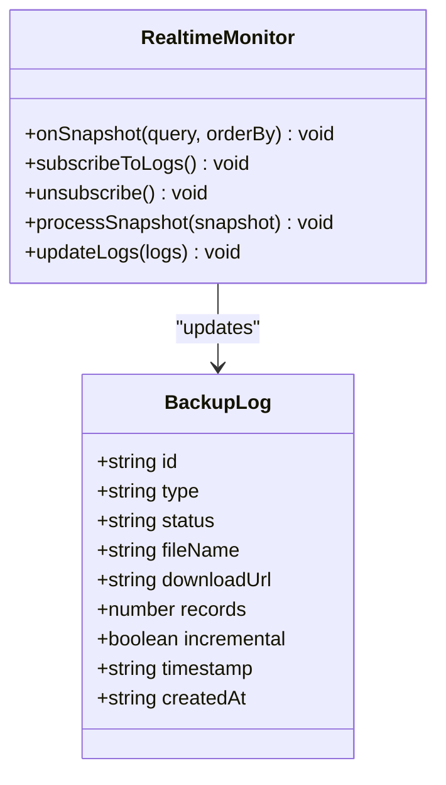

**Diagram sources**
- [page.tsx:49-59](file://app/admin/backup/page.tsx#L49-L59)

### Monitoring Features

The real-time monitoring system provides:

1. **Live Status Updates**: Instant updates on backup operations
2. **Automatic Refresh**: Real-time updates when new backup logs arrive
3. **Loading States**: Proper loading indicators during initial data fetch
4. **Error Handling**: Graceful handling of snapshot errors
5. **Performance Optimization**: Efficient snapshot subscription management

**Section sources**
- [page.tsx:49-59](file://app/admin/backup/page.tsx#L49-L59)
- [page.tsx:563-567](file://app/admin/backup/page.tsx#L563-L567)

## Data Validation and Safety

The system implements comprehensive data validation and safety measures to ensure reliable backup and restore operations across both manual and automated processes, with enhanced validation for the new backup log management features.

### Excel Cell Limit Compliance

The system includes automatic truncation of excessively long data to prevent Excel cell limit violations (32,767 character limit):

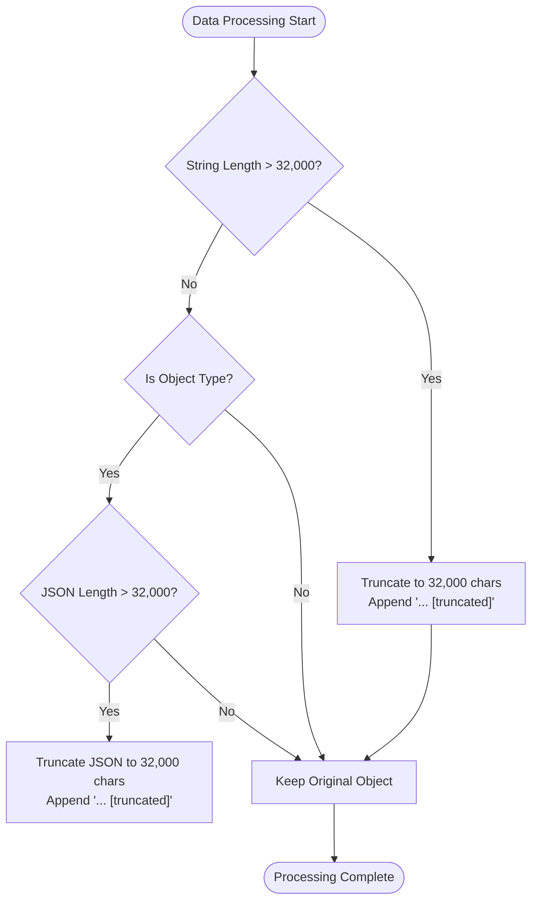

**Diagram sources**
- [page.tsx:122-141](file://app/admin/backup/page.tsx#L122-L141)
- [route.ts:28-47](file://app/api/backup/export/route.ts#L28-L47)

### Backup File Integrity

The system validates backup files before attempting restoration, checking for:

- **File Format**: Ensures ZIP archive with valid Excel files
- **Collection Coverage**: Verifies presence of all expected data collections
- **Record Count**: Confirms non-zero record counts for all collections
- **Data Structure**: Validates JSON structure consistency
- **Backup Log Integration**: Ensures backup logs are properly created and updated

**Section sources**
- [page.tsx:291-298](file://app/admin/backup/page.tsx#L291-L298)
- [route.ts:142-159](file://app/api/backup/export/route.ts#L142-L159)

## Security Implementation

The backup and restore system implements robust security measures to protect sensitive data and maintain system integrity across all operational modes, with enhanced security for the new backup log management features.

### Role-Based Access Control

Access to backup functionality is restricted through comprehensive role-based permissions with enhanced security for backup log management:

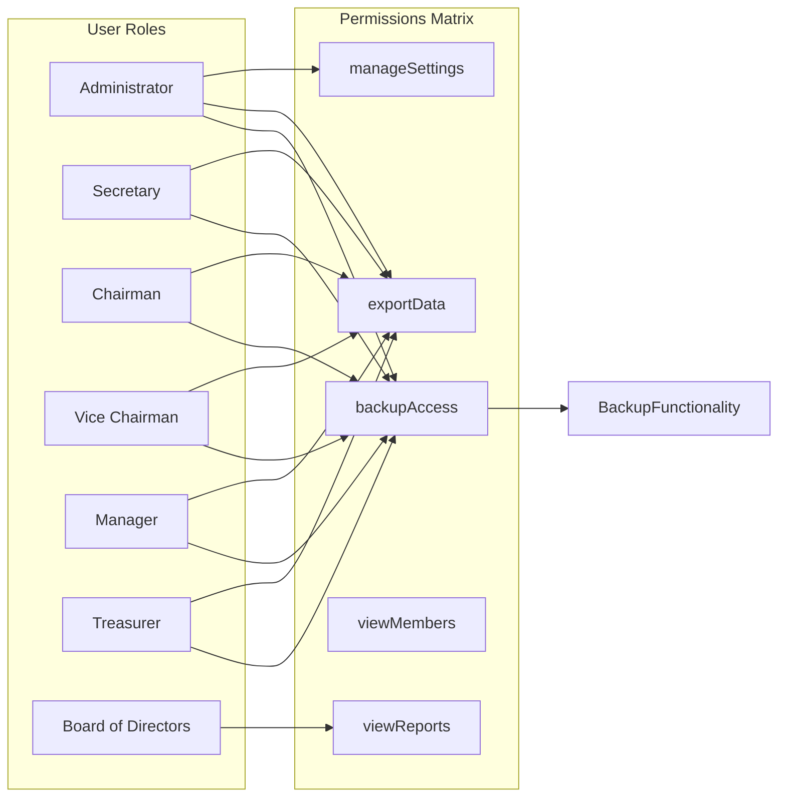

**Diagram sources**
- [rolePermissions.tsx:24-130](file://lib/rolePermissions.tsx#L24-L130)

### API Authentication

The automated backup system implements strict API authentication using bearer tokens with enhanced security for backup log management:

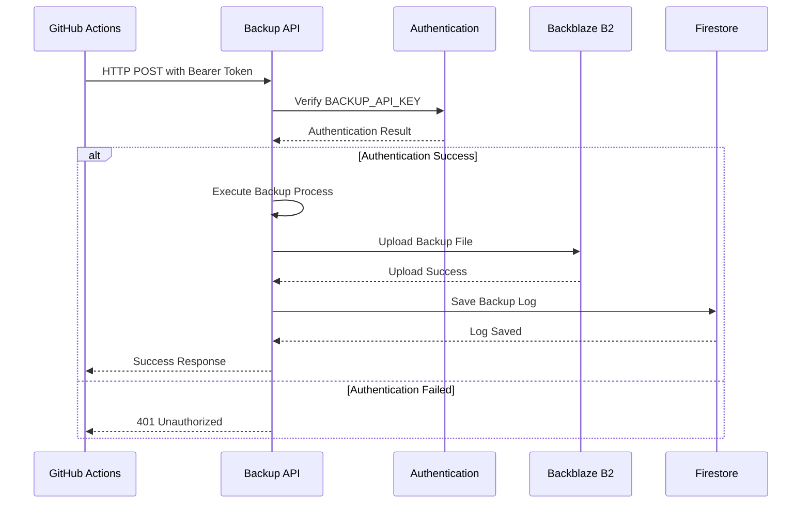

**Diagram sources**
- [route.ts:58-74](file://app/api/backup/export/route.ts#L58-L74)
- [automated-backup.yml:43-50](file://.github/workflows/automated-backup.yml#L43-L50)

### Enhanced Authentication Integration

The system integrates with the application's authentication framework to ensure only authorized users can access backup operations, with enhanced security for backup log management:

- **Session Validation**: Requires active user session
- **Role Verification**: Confirms user has appropriate permissions
- **Real-time Updates**: Dynamically updates permission status
- **API Key Protection**: Secure token-based authentication for automated backups
- **Backup Log Security**: Protected access to backup log management interface

**Section sources**
- [rolePermissions.tsx:155-206](file://lib/rolePermissions.tsx#L155-L206)
- [auth.tsx:162-199](file://lib/auth.tsx#L162-L199)
- [route.ts:58-74](file://app/api/backup/export/route.ts#L58-L74)

## Error Handling and Recovery

The system implements comprehensive error handling strategies to ensure reliable operation and graceful recovery from failures across both manual and automated backup processes, with enhanced error handling for the new backup log management features.

### Enhanced Error Classification and Handling

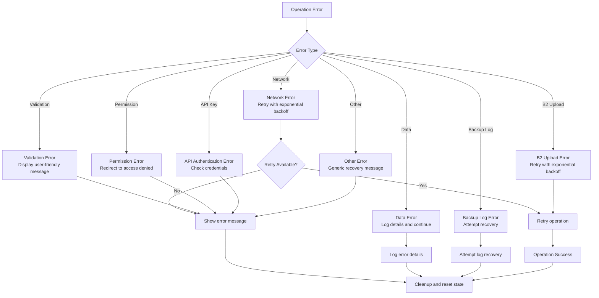

### Enhanced Recovery Strategies

The system implements multiple recovery strategies:

1. **Automatic Retry**: Network failures trigger automatic retry attempts
2. **Partial Recovery**: Individual operation failures don't halt entire processes
3. **State Restoration**: System state is restored after error conditions
4. **User Feedback**: Clear error messages guide users through recovery steps
5. **Incremental Recovery**: Automated backups skip empty incremental backups
6. **Backup Log Recovery**: Failed backup operations still create appropriate log entries
7. **Real-time Error Updates**: Error states are reflected in real-time monitoring

**Section sources**
- [page.tsx:130-135](file://app/admin/backup/page.tsx#L130-L135)
- [page.tsx:386-394](file://app/admin/backup/page.tsx#L386-L394)
- [route.ts:152-173](file://app/api/backup/export/route.ts#L152-L173)

## Performance Considerations

The backup and restore system is optimized for performance while maintaining reliability and data integrity across all operational modes, with enhanced performance considerations for the new backup log management features.

### Parallel Processing Architecture

The system utilizes parallel processing to maximize efficiency:

- **Concurrent Data Fetch**: Multiple Firestore queries execute simultaneously
- **Parallel File Processing**: Excel file conversion occurs in parallel
- **Asynchronous Operations**: Non-blocking operations improve user experience
- **Memory Management**: Efficient memory usage prevents performance degradation
- **Incremental Processing**: Reduced data volume for daily backups
- **Real-time Updates**: Efficient snapshot subscription management

### Enhanced Data Size Optimization

The system implements several optimization strategies:

- **Lazy Loading**: Data is processed incrementally to reduce memory footprint
- **Compression**: ZIP archives reduce file sizes for backup storage
- **Efficient Serialization**: Optimized JSON serialization minimizes overhead
- **Batch Operations**: Multiple documents processed in batches during restore
- **Incremental Compression**: Only new data is processed for daily backups
- **Backup Log Optimization**: Efficient log storage and retrieval mechanisms

**Section sources**
- [page.tsx:158-171](file://app/admin/backup/page.tsx#L158-L171)
- [page.tsx:320-383](file://app/admin/backup/page.tsx#L320-L383)
- [route.ts:161-265](file://app/api/backup/export/route.ts#L161-L265)

## Setup and Configuration

The system requires comprehensive setup and configuration to enable automated backup functionality with cloud storage integration and enhanced backup log management.

### Backblaze B2 Setup

The cloud storage integration requires Backblaze B2 account configuration with proper bucket permissions and API credentials, with enhanced configuration for backup log management.

**Section sources**
- [BACKUP_SETUP.md:25-49](file://docs/BACKUP_SETUP.md#L25-L49)
- [BACKUP_SETUP.md:50-82](file://docs/BACKUP_SETUP.md#L50-L82)

### GitHub Actions Configuration

The automated backup system requires GitHub Actions workflow configuration with proper environment variables, secrets, and enhanced monitoring setup.

**Section sources**
- [automated-backup.yml:1-202](file://.github/workflows/automated-backup.yml#L1-L202)
- [BACKUP_SETUP.md:50-101](file://docs/BACKUP_SETUP.md#L50-L101)

### Enhanced Environment Variables

The system requires specific environment variables for both local development and production deployment, with enhanced configuration for backup log management:

**Section sources**
- [BACKUP_SETUP.md:83-116](file://docs/BACKUP_SETUP.md#L83-L116)
- [route.ts:10-14](file://app/api/backup/export/route.ts#L10-L14)

## Monitoring and Troubleshooting

The system provides comprehensive monitoring and troubleshooting capabilities for both manual and automated backup operations, with enhanced monitoring and troubleshooting for the new backup log management features.

### Enhanced GitHub Actions Monitoring

The automated backup system provides detailed logging and notification capabilities through GitHub Actions with enhanced monitoring:

**Section sources**
- [automated-backup.yml:79-95](file://.github/workflows/automated-backup.yml#L79-L95)
- [automated-backup.yml:139-155](file://.github/workflows/automated-backup.yml#L139-L155)
- [automated-backup.yml:193-202](file://.github/workflows/automated-backup.yml#L193-L202)

### Enhanced Backup Verification

The system includes verification mechanisms to ensure backup integrity and successful cloud storage upload, with enhanced verification for backup log management:

**Section sources**
- [route.ts:240-253](file://app/api/backup/export/route.ts#L240-L253)
- [automated-backup.yml:72-77](file://.github/workflows/automated-backup.yml#L72-L77)

### Enhanced Troubleshooting Guide

Common issues and their solutions for the backup and restore system:

**Problem**: Backup fails with "Collection not found" error
**Solution**: Verify Firestore collections exist and have proper indexing

**Problem**: Large datasets cause timeout errors
**Solution**: Split data into smaller chunks or increase timeout limits

**Problem**: Excel files exceed cell limits
**Solution**: System automatically truncates data exceeding 32,767 characters

**Problem**: Automated backup fails with authentication error
**Solution**: Verify BACKUP_API_KEY is correctly configured in GitHub Actions secrets

**Problem**: B2 upload fails with credential error
**Solution**: Verify Backblaze B2 credentials and bucket permissions

**Problem**: Incremental backup returns "No new data to backup"
**Solution**: This is expected behavior - indicates no new data since last backup

**Problem**: Backup logs not appearing in interface
**Solution**: Check Firestore permissions for backupLogs collection and real-time snapshot subscription

**Problem**: Filter controls not working properly
**Solution**: Verify filter state management and ensure proper re-rendering on filter changes

**Problem**: Pagination not functioning correctly
**Solution**: Check pagination state management and ensure proper calculation of total pages

**Section sources**
- [page.tsx:291-298](file://app/admin/backup/page.tsx#L291-L298)
- [page.tsx:300-316](file://app/admin/backup/page.tsx#L300-L316)
- [route.ts:152-173](file://app/api/backup/export/route.ts#L152-L173)

## Conclusion

The Backup and Restore System provides a comprehensive, secure, and user-friendly solution for data management in the SAMPA Cooperative application. The system successfully balances functionality, security, and performance while maintaining ease of use for administrators and authorized users.

**Updated** The addition of the automated backup system with GitHub Actions integration, Backblaze B2 cloud storage, incremental backup logic, complete setup documentation, real-time monitoring capabilities, and comprehensive backup log management significantly enhances the system's capabilities and reliability.

Key strengths of the system include:

- **Comprehensive Coverage**: Backs up all core application data
- **Robust Security**: Role-based access control and validation
- **User Experience**: Intuitive interface with progress tracking and real-time monitoring
- **Reliability**: Comprehensive error handling and recovery mechanisms
- **Performance**: Optimized for speed and efficiency with enhanced monitoring
- **Automation**: Scheduled backups without manual intervention
- **Cloud Redundancy**: Off-site backup storage with Backblaze B2
- **Intelligent Incremental Logic**: Smart backup selection reduces processing time
- **Complete Documentation**: Detailed setup guide and troubleshooting resources
- **Real-time Monitoring**: Live backup status updates through Firestore snapshots
- **Advanced Log Management**: Comprehensive filtering, pagination, and status tracking
- **Enhanced Error Handling**: Robust error recovery and user feedback mechanisms

The system is well-positioned to support the cooperative's data management needs while providing a foundation for future enhancements and scalability improvements. The automated backup system ensures consistent data protection with minimal administrative overhead, while the manual backup interface maintains flexibility for ad-hoc backup operations. The real-time monitoring and backup log management features provide comprehensive visibility into backup operations, enabling proactive monitoring and quick identification of issues.