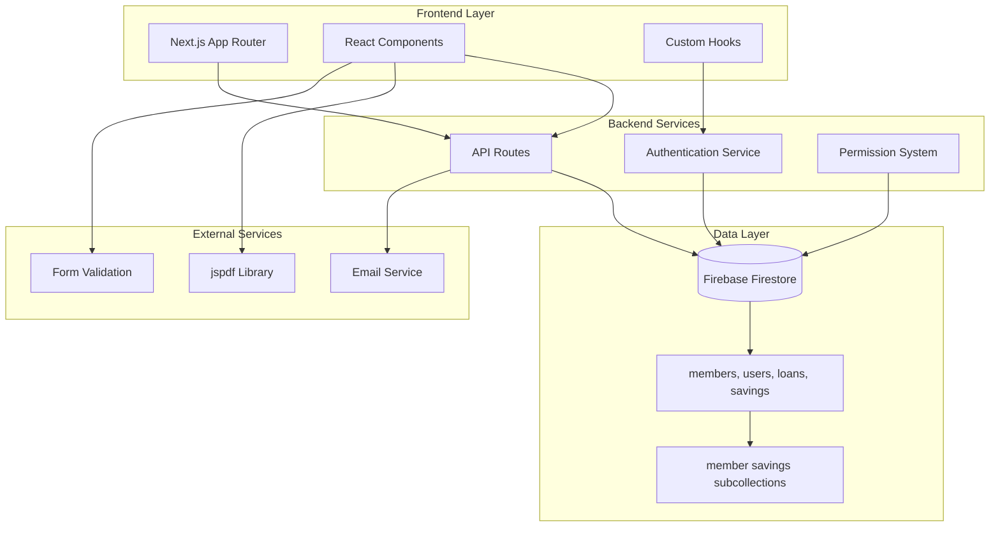
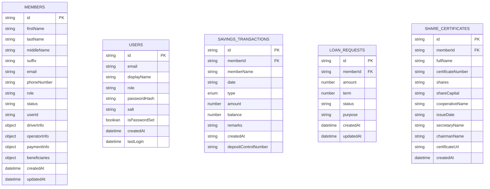
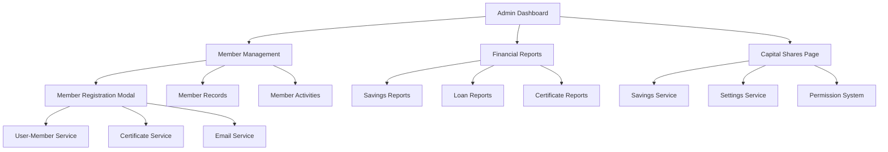
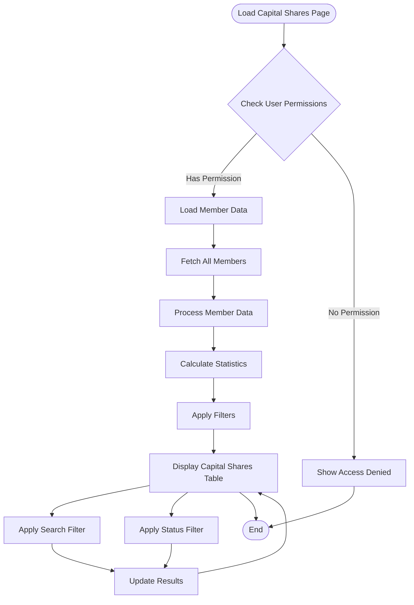
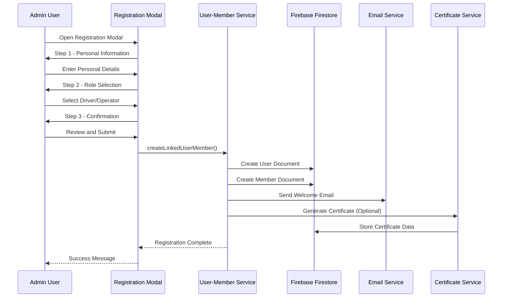
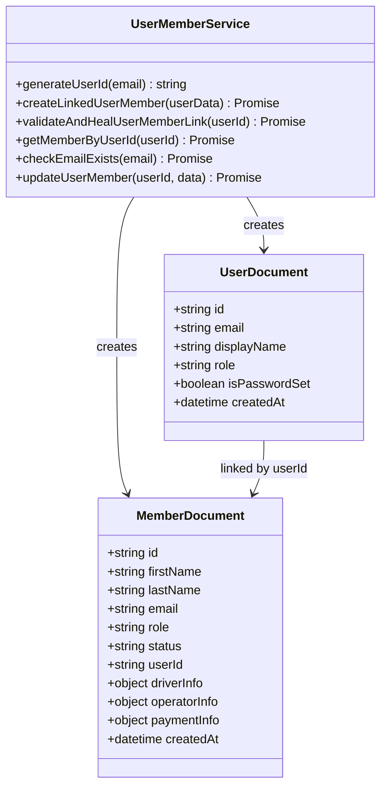
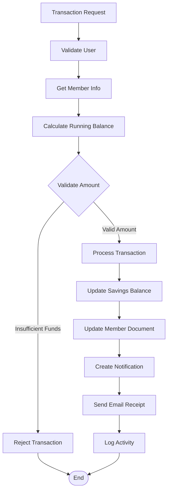
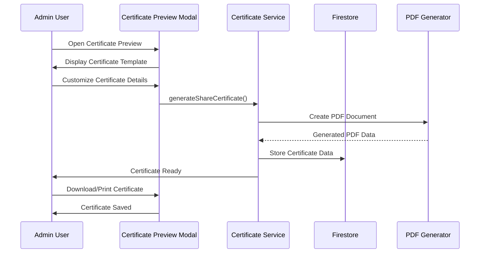
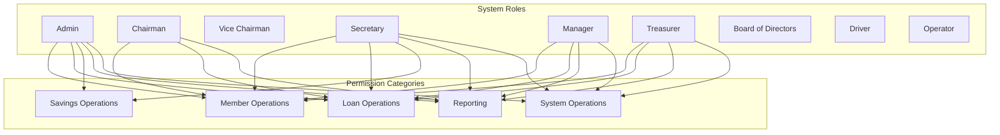
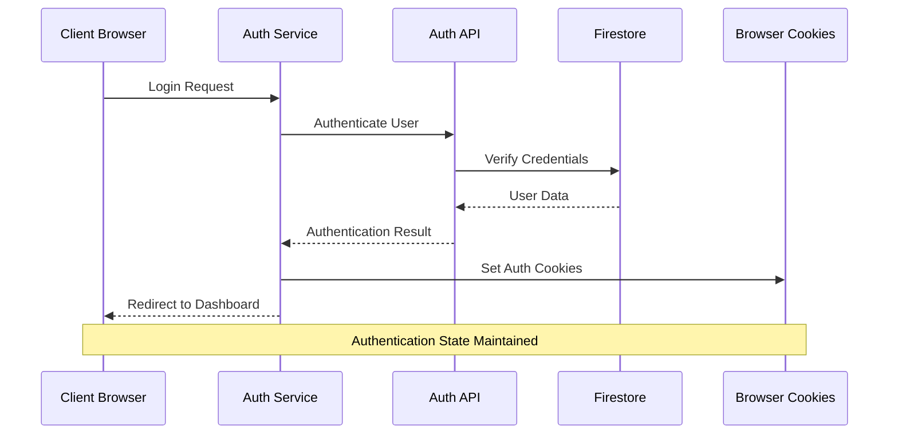

# Capital Shares Management System

<cite>
**Referenced Files in This Document**
- [README.md](file://README.md)
- [package.json](file://package.json)
- [app/admin/capital-shares/page.tsx](file://app/admin/capital-shares/page.tsx)
- [lib/savingsService.ts](file://lib/savingsService.ts)
- [lib/userMemberService.ts](file://lib/userMemberService.ts)
- [lib/firebase.ts](file://lib/firebase.ts)
- [lib/rolePermissions.tsx](file://lib/rolePermissions.tsx)
- [lib/types/savings.ts](file://lib/types/savings.ts)
- [components/admin/CertificatePreviewModal.tsx](file://components/admin/CertificatePreviewModal.tsx)
- [lib/certificateService.ts](file://lib/certificateService.ts)
- [app/api/members/route.ts](file://app/api/members/route.ts)
- [lib/auth.tsx](file://lib/auth.tsx)
- [lib/settingsService.ts](file://lib/settingsService.ts)
- [components/admin/MemberRegistrationModal.tsx](file://components/admin/MemberRegistrationModal.tsx)
- [app/admin/dashboard/page.tsx](file://app/admin/dashboard/page.tsx)
- [middleware.ts](file://middleware.ts)
</cite>

## Table of Contents
1. [Introduction](#introduction)
2. [System Architecture](#system-architecture)
3. [Core Components](#core-components)
4. [Capital Shares Management](#capital-shares-management)
5. [User Registration and Membership](#user-registration-and-membership)
6. [Financial Transactions](#financial-transactions)
7. [Certificate Generation](#certificate-generation)
8. [Permission System](#permission-system)
9. [Data Management](#data-management)
10. [Security and Authentication](#security-and-authentication)
11. [Performance Considerations](#performance-considerations)
12. [Troubleshooting Guide](#troubleshooting-guide)
13. [Conclusion](#conclusion)

## Introduction

The Capital Shares Management System is a comprehensive cooperative management platform built with Next.js and Firebase. This system manages member capital shares, financial transactions, member registration, and administrative workflows for SAMPA Transport Service Cooperative. The platform provides a centralized solution for managing cooperative member relationships, financial obligations, and operational activities.

The system is designed around a cooperative model where members are required to purchase capital shares as part of their membership requirements. The platform automates the tracking, monitoring, and reporting of capital share payments while providing administrative tools for cooperative board members to manage member activities.

## System Architecture

The Capital Shares Management System follows a modern web architecture with clear separation of concerns:



**Diagram sources**
- [lib/firebase.ts:1-345](file://lib/firebase.ts#L1-345)
- [lib/auth.tsx:1-706](file://lib/auth.tsx#L1-706)
- [lib/rolePermissions.tsx:1-226](file://lib/rolePermissions.tsx#L1-226)

The architecture consists of several key layers:

- **Presentation Layer**: Next.js application with React components and custom hooks
- **Business Logic Layer**: API routes handling business operations and data validation
- **Data Access Layer**: Firebase Firestore integration with custom utility functions
- **Security Layer**: Authentication and authorization mechanisms
- **Integration Layer**: Email services and external libraries for PDF generation

**Section sources**
- [lib/firebase.ts:1-345](file://lib/firebase.ts#L1-345)
- [lib/auth.tsx:1-706](file://lib/auth.tsx#L1-706)

## Core Components

### Data Model Architecture

The system uses a document-based data model optimized for cooperative management:



**Diagram sources**
- [lib/types/savings.ts:1-22](file://lib/types/savings.ts#L1-22)
- [lib/userMemberService.ts:23-94](file://lib/userMemberService.ts#L23-94)

### Component Hierarchy



**Diagram sources**
- [app/admin/dashboard/page.tsx:88-796](file://app/admin/dashboard/page.tsx#L88-796)
- [components/admin/MemberRegistrationModal.tsx:1-800](file://components/admin/MemberRegistrationModal.tsx#L1-800)

**Section sources**
- [lib/types/savings.ts:1-22](file://lib/types/savings.ts#L1-22)
- [app/admin/dashboard/page.tsx:88-796](file://app/admin/dashboard/page.tsx#L88-796)

## Capital Shares Management

### Capital Shares Overview Page

The Capital Shares Management system provides comprehensive oversight of member capital share payments:



**Diagram sources**
- [app/admin/capital-shares/page.tsx:18-313](file://app/admin/capital-shares/page.tsx#L18-313)

The system tracks four key metrics:
- **Total Capital Shares**: Sum of all member capital share amounts
- **Paid Capital Shares**: Sum of capital shares with full payment status
- **Pending Capital Shares**: Sum of capital shares with partial or unpaid status
- **Member Distribution**: Count of members across different payment statuses

### Payment Status Tracking

The system implements a sophisticated payment status tracking mechanism:

| Status | Description | Visual Indicator |
|--------|-------------|------------------|
| **Paid** | Full capital share payment received | 🟢 Green Badge |
| **Partial** | Partial payment received | 🟡 Yellow Badge |
| **Pending** | No payment received yet | 🟠 Orange Badge |

**Section sources**
- [app/admin/capital-shares/page.tsx:18-313](file://app/admin/capital-shares/page.tsx#L18-313)

## User Registration and Membership

### Member Registration Workflow

The member registration process is streamlined through a multi-step wizard:



**Diagram sources**
- [components/admin/MemberRegistrationModal.tsx:249-432](file://components/admin/MemberRegistrationModal.tsx#L249-432)
- [lib/userMemberService.ts:23-94](file://lib/userMemberService.ts#L23-94)

### User-Member Linkage System

The system maintains consistency between user accounts and member profiles through a dual-document approach:



**Diagram sources**
- [lib/userMemberService.ts:14-289](file://lib/userMemberService.ts#L14-289)

**Section sources**
- [components/admin/MemberRegistrationModal.tsx:1-800](file://components/admin/MemberRegistrationModal.tsx#L1-800)
- [lib/userMemberService.ts:1-289](file://lib/userMemberService.ts#L1-289)

## Financial Transactions

### Savings Transaction Management

The savings transaction system provides comprehensive financial tracking:



**Diagram sources**
- [lib/savingsService.ts:240-497](file://lib/savingsService.ts#L240-497)

### Transaction Types and Processing

The system supports two primary transaction types:

| Transaction Type | Description | Balance Impact |
|------------------|-------------|----------------|
| **Deposit** | Money added to member account | Increases balance |
| **Withdrawal** | Money removed from member account | Decreases balance |

**Section sources**
- [lib/savingsService.ts:1-615](file://lib/savingsService.ts#L1-615)
- [lib/types/savings.ts:1-22](file://lib/types/savings.ts#L1-22)

## Certificate Generation

### Share Certificate System

The certificate generation system provides professional documentation for member capital shares:



**Diagram sources**
- [components/admin/CertificatePreviewModal.tsx:160-327](file://components/admin/CertificatePreviewModal.tsx#L160-327)
- [lib/certificateService.ts:12-294](file://lib/certificateService.ts#L12-294)

### Certificate Features

The certificate system includes advanced features for professional documentation:

- **Customizable Templates**: Professional share certificate designs
- **Automated Generation**: Real-time PDF creation with member data
- **Officer Integration**: Automatic inclusion of cooperative officers
- **Multi-format Export**: Download as PDF or print directly
- **Storage Integration**: Automatic saving to member records

**Section sources**
- [components/admin/CertificatePreviewModal.tsx:1-672](file://components/admin/CertificatePreviewModal.tsx#L1-672)
- [lib/certificateService.ts:1-410](file://lib/certificateService.ts#L1-410)

## Permission System

### Role-Based Access Control

The system implements a comprehensive permission system based on user roles:



**Diagram sources**
- [lib/rolePermissions.tsx:24-130](file://lib/rolePermissions.tsx#L24-130)

### Permission Implementation

The permission system provides granular control over system functionality:

| Permission Category | Description | Admin | Chairman | Secretary | Manager | Treasurer |
|-------------------|-------------|-------|----------|-----------|---------|-----------|
| **View Members** | View member records | ✅ | ✅ | ✅ | ❌ | ❌ |
| **Add Members** | Create new member records | ✅ | ❌ | ✅ | ❌ | ❌ |
| **Edit Members** | Modify member information | ✅ | ✅ | ✅ | ❌ | ❌ |
| **Approve Loans** | Approve loan applications | ✅ | ✅ | ❌ | ❌ | ❌ |
| **Manage Savings** | Process savings transactions | ✅ | ❌ | ✅ | ✅ | ✅ |
| **View Reports** | Access system reports | ✅ | ✅ | ✅ | ✅ | ✅ |
| **Export Data** | Export system data | ✅ | ✅ | ✅ | ✅ | ❌ |

**Section sources**
- [lib/rolePermissions.tsx:1-226](file://lib/rolePermissions.tsx#L1-226)

## Data Management

### Database Schema Design

The system uses a normalized document-based schema optimized for cooperative operations:

```mermaid
erDiagram
COLLECTIONS {
string members
string users
string loans
string loanRequests
string savings
string member_certificates
string rolePermissions
string systemSettings
}
SUBCOLLECTIONS {
string members/{memberId}/savings
string members/{memberId}/loans
}
RELATIONSHIPS {
string members.userId = users.id
string members/{memberId}/savings.memberId = members.id
string member_certificates.memberId = members.id
}
```

**Diagram sources**
- [lib/firebase.ts:90-343](file://lib/firebase.ts#L90-343)

### Data Validation and Integrity

The system implements comprehensive data validation:

- **Email Uniqueness**: Ensures no duplicate member registrations
- **Role Validation**: Restricts access based on user roles
- **Permission Validation**: Controls access to sensitive operations
- **Transaction Validation**: Prevents invalid financial operations
- **Document References**: Maintains referential integrity across collections

**Section sources**
- [lib/firebase.ts:1-345](file://lib/firebase.ts#L1-345)
- [app/api/members/route.ts:1-179](file://app/api/members/route.ts#L1-179)

## Security and Authentication

### Authentication Architecture

The system implements a robust authentication mechanism:



**Diagram sources**
- [lib/auth.tsx:198-372](file://lib/auth.tsx#L198-372)

### Security Features

The authentication system includes multiple security layers:

- **Cookie-Based Session Management**: Secure user session tracking
- **Role-Based Access Control**: Granular permission enforcement
- **Password Hashing**: Secure password storage using PBKDF2
- **Input Validation**: Comprehensive form validation and sanitization
- **Middleware Protection**: Route-level access control
- **Audit Logging**: Complete activity tracking

**Section sources**
- [lib/auth.tsx:1-706](file://lib/auth.tsx#L1-706)
- [middleware.ts:1-62](file://middleware.ts#L1-62)

## Performance Considerations

### Database Optimization

The system implements several performance optimization strategies:

- **Batch Operations**: Parallel processing of multiple database queries
- **Efficient Queries**: Optimized Firestore queries with appropriate indexing
- **Caching Strategies**: Client-side caching for frequently accessed data
- **Lazy Loading**: Progressive loading of large datasets
- **Pagination**: Efficient handling of large collections

### Frontend Performance

The frontend implements performance best practices:

- **Code Splitting**: Dynamic imports for route-based code splitting
- **Component Memoization**: React.memo for expensive components
- **Optimized Rendering**: Efficient table rendering for large datasets
- **Loading States**: Proper loading indicators for async operations
- **Error Boundaries**: Graceful error handling and recovery

## Troubleshooting Guide

### Common Issues and Solutions

**Authentication Problems**
- **Issue**: Users cannot log in
- **Solution**: Check Firebase configuration, verify user credentials, review authentication cookies

**Database Connection Issues**
- **Issue**: Application cannot connect to Firestore
- **Solution**: Verify Firebase credentials, check network connectivity, review Firestore rules

**Permission Denied Errors**
- **Issue**: Users receive access denied messages
- **Solution**: Verify user roles, check permission configurations, review rolePermissions collection

**Data Synchronization Issues**
- **Issue**: User and member data inconsistencies
- **Solution**: Use validateAndHealUserMemberLink function, check user-member linkage, verify document references

**Certificate Generation Failures**
- **Issue**: Share certificates not generating properly
- **Solution**: Check certificate template data, verify PDF generation library, confirm email service configuration

**Section sources**
- [lib/auth.tsx:366-372](file://lib/auth.tsx#L366-372)
- [lib/userMemberService.ts:101-200](file://lib/userMemberService.ts#L101-200)

## Conclusion

The Capital Shares Management System provides a comprehensive solution for cooperative member management with robust features for capital share tracking, financial transactions, member registration, and administrative oversight. The system's modular architecture, comprehensive permission system, and professional certificate generation capabilities make it well-suited for managing cooperative operations efficiently.

Key strengths of the system include:

- **Comprehensive Feature Set**: Covers all aspects of cooperative member management
- **Professional Documentation**: High-quality certificate generation and reporting
- **Robust Security**: Multi-layered authentication and authorization
- **Scalable Architecture**: Optimized for growth and performance
- **User-Friendly Interface**: Intuitive administration and member experiences

The system provides a solid foundation for SAMPA Transport Service Cooperative's operational needs while maintaining flexibility for future enhancements and feature additions.