# Capital Shares Management System

<cite>
**Referenced Files in This Document**
- [hooks/useCapitalShare.ts](file://hooks/useCapitalShare.ts)
- [app/admin/capital-shares/page.tsx](file://app/admin/capital-shares/page.tsx)
- [app/admin/settings/system/page.tsx](file://app/admin/settings/system/page.tsx)
- [lib/settingsService.ts](file://lib/settingsService.ts)
- [components/admin/MemberRegistrationModal.tsx](file://components/admin/MemberRegistrationModal.tsx)
- [lib/userMemberService.ts](file://lib/userMemberService.ts)
- [lib/savingsService.ts](file://lib/savingsService.ts)
- [lib/firebase.ts](file://lib/firebase.ts)
- [lib/rolePermissions.tsx](file://lib/rolePermissions.tsx)
- [lib/types/savings.ts](file://lib/types/savings.ts)
- [components/admin/CertificatePreviewModal.tsx](file://components/admin/CertificatePreviewModal.tsx)
- [lib/certificateService.ts](file://lib/certificateService.ts)
- [app/api/members/route.ts](file://app/api/members/route.ts)
- [lib/auth.tsx](file://lib/auth.tsx)
- [lib/userMemberService.ts](file://lib/userMemberService.ts)
- [app/dashboard/page.tsx](file://app/dashboard/page.tsx)
- [app/loan/page.tsx](file://app/loan/page.tsx)
- [middleware.ts](file://middleware.ts)
</cite>

## Update Summary
**Changes Made**
- Enhanced capital share configuration system with centralized system settings management
- Implemented maximum capital share limits enforcement with real-time validation
- Improved validation logic with dynamic capital share amount configuration
- Added comprehensive capital share management interface with real-time system integration
- Enhanced member registration workflow with configurable capital share requirements
- Integrated real-time validation and currency formatting throughout the capital share workflow

## Table of Contents
1. [Introduction](#introduction)
2. [System Architecture](#system-architecture)
3. [Core Components](#core-components)
4. [Capital Shares Management](#capital-shares-management)
5. [System Settings Configuration](#system-settings-configuration)
6. [User Registration and Membership](#user-registration-and-membership)
7. [Financial Transactions](#financial-transactions)
8. [Certificate Generation](#certificate-generation)
9. [Permission System](#permission-system)
10. [Data Management](#data-management)
11. [Security and Authentication](#security-and-authentication)
12. [Real-Time Monitoring and Dynamic Tracking](#real-time-monitoring-and-dynamic-tracking)
13. [Loan Application Restrictions](#loan-application-restrictions)
14. [Performance Considerations](#performance-considerations)
15. [Troubleshooting Guide](#troubleshooting-guide)
16. [Conclusion](#conclusion)

## Introduction

The Capital Shares Management System is a comprehensive cooperative management platform built with Next.js and Firebase. This system manages member capital shares, financial transactions, member registration, and administrative workflows for SAMPA Transport Service Cooperative. The platform provides a centralized solution for managing cooperative member relationships, financial obligations, and operational activities.

**Updated** The system has been significantly enhanced with a comprehensive capital share configuration system that allows administrators to dynamically set and manage capital share requirements through centralized system settings. The new implementation features real-time validation, configurable capital share limits, and enhanced member registration workflow with dynamic validation based on system policies.

## System Architecture

The Capital Shares Management System follows a modern web architecture with clear separation of concerns and real-time monitoring capabilities:

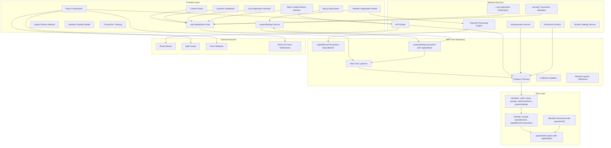

**Diagram sources**
- [lib/firebase.ts:1-384](file://lib/firebase.ts#L1-384)
- [lib/auth.tsx:1-706](file://lib/auth.tsx#L1-706)
- [lib/rolePermissions.tsx:1-226](file://lib/rolePermissions.tsx#L1-226)
- [hooks/useCapitalShare.ts:1-115](file://hooks/useCapitalShare.ts#L1-115)
- [lib/settingsService.ts:1-56](file://lib/settingsService.ts#L1-56)
- [app/admin/settings/system/page.tsx:1-873](file://app/admin/settings/system/page.tsx#L1-873)
- [components/admin/MemberRegistrationModal.tsx:1500-1699](file://components/admin/MemberRegistrationModal.tsx#L1500-1699)

The architecture consists of several key layers with enhanced real-time monitoring and centralized configuration management:

- **Presentation Layer**: Next.js application with React components, custom hooks, and real-time monitoring
- **Business Logic Layer**: API routes handling business operations, data validation, and loan restrictions
- **Configuration Management Layer**: Centralized system settings service with real-time updates
- **Real-Time Data Layer**: Firebase Firestore integration with automatic updates and live listeners
- **Monitoring Layer**: useCapitalShare hook providing continuous capital share status tracking
- **Security Layer**: Authentication and authorization mechanisms with dynamic restrictions
- **Integration Layer**: Email services, external libraries, and notification systems
- **Payment Processing Layer**: Modal-based payment management with transaction tracking and member-specific collections

**Section sources**
- [lib/firebase.ts:1-384](file://lib/firebase.ts#L1-384)
- [lib/auth.tsx:1-706](file://lib/auth.tsx#L1-706)
- [hooks/useCapitalShare.ts:1-115](file://hooks/useCapitalShare.ts#L1-115)
- [lib/settingsService.ts:1-56](file://lib/settingsService.ts#L1-56)

## Core Components

### Enhanced Data Model Architecture

The system uses a document-based data model optimized for cooperative management with real-time monitoring and centralized configuration:

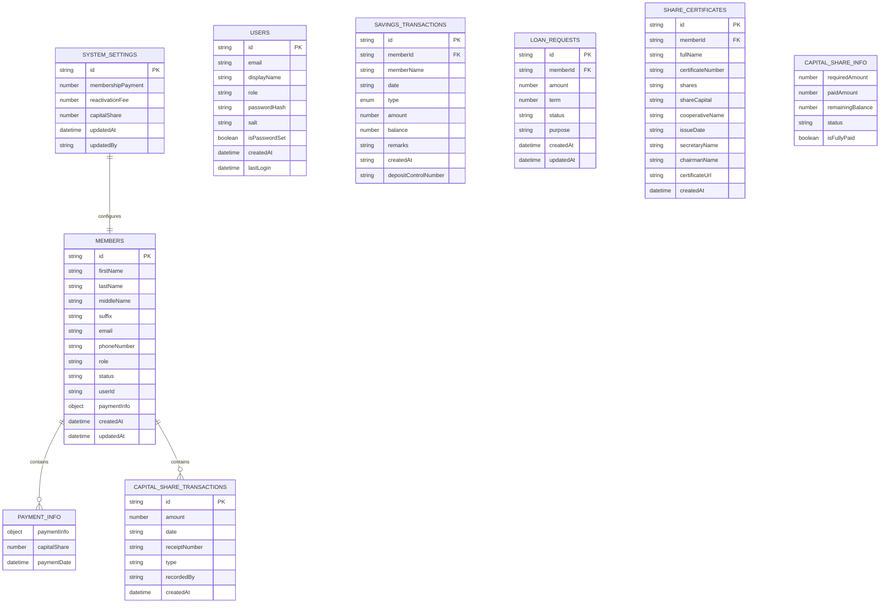

**Diagram sources**
- [lib/types/savings.ts:1-22](file://lib/types/savings.ts#L1-22)
- [lib/userMemberService.ts:23-94](file://lib/userMemberService.ts#L23-94)
- [hooks/useCapitalShare.ts:7-13](file://hooks/useCapitalShare.ts#L7-13)
- [lib/settingsService.ts:3-9](file://lib/settingsService.ts#L3-9)

### Enhanced Component Hierarchy

```mermaid
graph TD
AdminDashboard[Admin Dashboard] --> SystemSettings[System Settings Page]
AdminDashboard --> CapitalShares[Capital Shares Page]
AdminDashboard --> MemberManagement[Member Management]
AdminDashboard --> FinancialReports[Financial Reports]
SystemSettings --> SystemSettingsService[System Settings Service]
SystemSettings --> SettingsForm[Settings Form]
CapitalShares --> useCapitalShare[useCapitalShare Hook]
CapitalShares --> SavingsService[Savings Service]
CapitalShares --> SettingsService[Settings Service]
CapitalShares --> Permissions[Permission System]
useCapitalShare --> RealTimeMonitoring[Real-Time Monitoring]
useCapitalShare --> DynamicRestrictions[Dynamic Restrictions]
MemberManagement --> MemberRegistration[Member Registration Modal]
MemberRegistration --> SystemSettingsService[System Settings Service]
MemberRegistration --> UserMemberService[User-Member Service]
MemberRegistration --> CertificateService[Certificate Service]
MemberRegistration --> EmailService[Email Service]
DynamicDashboard --> RealTimeCapitalShare[Real-Time Capital Share Display]
LoanInterface --> CapitalShareRestrictions[Capital Share Restrictions]
MemberModal --> PaymentProcessing[Payment Processing Engine]
MemberModal --> TransactionTracking[Transaction Tracking]
MemberModal --> MemberCollections[Member Collections]
```

**Diagram sources**
- [app/admin/dashboard/page.tsx:88-796](file://app/admin/dashboard/page.tsx#L88-796)
- [components/admin/MemberRegistrationModal.tsx:1-800](file://components/admin/MemberRegistrationModal.tsx#L1-800)
- [hooks/useCapitalShare.ts:22-22](file://hooks/useCapitalShare.ts#L22-22)
- [app/dashboard/page.tsx:530-729](file://app/dashboard/page.tsx#L530-729)
- [app/loan/page.tsx:370-569](file://app/loan/page.tsx#L370-569)
- [app/admin/settings/system/page.tsx:1-873](file://app/admin/settings/system/page.tsx#L1-873)

**Section sources**
- [lib/types/savings.ts:1-22](file://lib/types/savings.ts#L1-22)
- [app/admin/dashboard/page.tsx:88-796](file://app/admin/dashboard/page.tsx#L88-796)
- [hooks/useCapitalShare.ts:1-115](file://hooks/useCapitalShare.ts#L1-115)
- [lib/settingsService.ts:1-56](file://lib/settingsService.ts#L1-56)

## Capital Shares Management

### Enhanced Capital Shares Overview Page

The Capital Shares Management system now provides comprehensive oversight of member capital share payments with standardized processing and real-time monitoring:

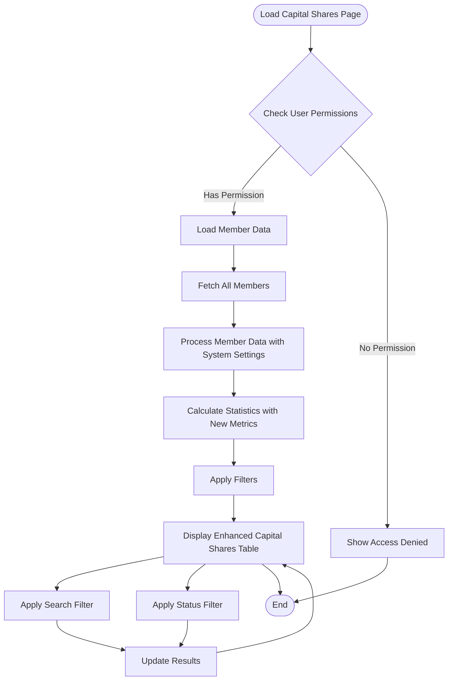

**Diagram sources**
- [app/admin/capital-shares/page.tsx:18-313](file://app/admin/capital-shares/page.tsx#L18-313)

**Updated** The system now implements standardized capital share processing with configurable requirements through system settings, providing flexible financial tracking across the cooperative with real-time updates. The new modal-based interface allows administrators to manage individual member payments with transaction tracking and member-specific collections.

The system tracks five key metrics with enhanced financial visibility:
- **Total Capital Shares**: Sum of all member capital share amounts
- **Paid Capital Shares**: Sum of capital shares with full payment status
- **Pending Capital Shares**: Sum of capital shares with partial or unpaid status
- **Required Capital Share Amount**: Configurable amount from system settings for all members
- **Member Distribution**: Count of members across different payment statuses with new pendingMembersCount metric

### Enhanced Payment Status Tracking

The system implements a sophisticated payment status tracking mechanism with configurable processing and real-time updates:

| Status | Description | Visual Indicator | Calculation Logic |
|--------|-------------|------------------|-------------------|
| **Paid** | Full capital share payment (≥ configured amount) received | 🟢 Green Badge | `capitalShare >= systemSettings.capitalShare` |
| **Partial** | Partial payment received (0 < capitalShare < configured amount) | 🟡 Yellow Badge | `capitalShare > 0 && capitalShare < systemSettings.capitalShare` |
| **Pending** | No payment received yet (capitalShare = 0) | 🟠 Orange Badge | `capitalShare = 0` |

**Updated** The status determination logic has been enhanced with configurable processing that treats all members equally with capital share requirements defined in system settings, improving fairness and consistency across the cooperative with real-time monitoring capabilities. The new modal interface provides detailed transaction history for each member.

### New Financial Tracking Features

The system now provides comprehensive financial tracking through enhanced UI components with real-time updates:

#### Summary Cards with Color-Coded Indicators

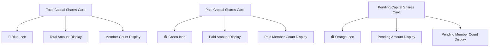

**Diagram sources**
- [app/admin/capital-shares/page.tsx:168-216](file://app/admin/capital-shares/page.tsx#L168-216)

#### Enhanced Table with New Columns

The capital shares table now displays four additional columns for comprehensive financial tracking with real-time updates:

| Column | Purpose | Display Format | Color Coding |
|--------|---------|----------------|--------------|
| **Paid Amount** | Current capital share payment | Currency format (PHP) | Default text |
| **Required Amount** | Configurable amount from system settings | Currency format (PHP) | Gray text |
| **Remaining Balance** | Outstanding amount to reach required amount | Currency format (PHP) | Red for positive balances, Green for zero |
| **Status** | Payment status classification | Color-coded badges | Green for Paid, Yellow for Partial, Orange for Pending |

**Updated** The table now includes color-coded visual indicators that provide immediate financial insight, with red text for outstanding balances and green text for fully paid amounts, all updated in real-time through the useCapitalShare hook. Each row now includes a payment button for quick transaction recording.

**Section sources**
- [app/admin/capital-shares/page.tsx:18-313](file://app/admin/capital-shares/page.tsx#L18-313)
- [hooks/useCapitalShare.ts:22-92](file://hooks/useCapitalShare.ts#L22-92)

## System Settings Configuration

### Centralized System Settings Management

The system now features a comprehensive configuration system that allows administrators to centrally manage all financial policies and requirements:

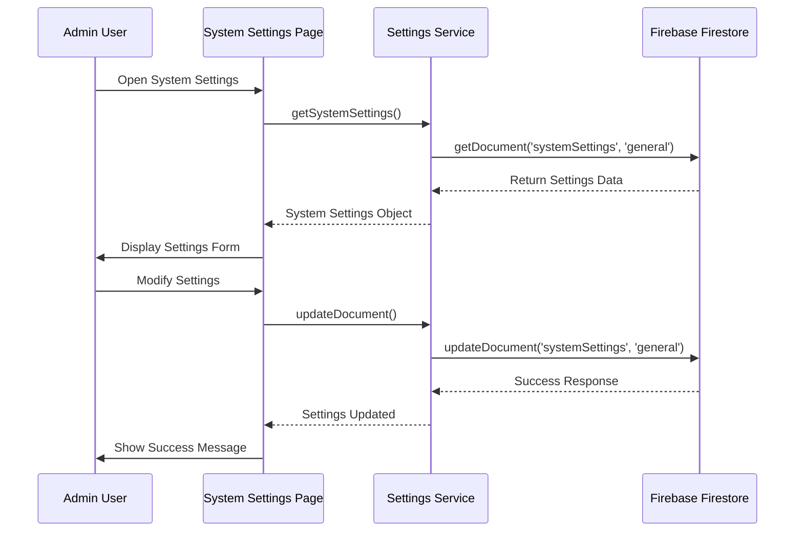

**Diagram sources**
- [app/admin/settings/system/page.tsx:42-97](file://app/admin/settings/system/page.tsx#L42-97)
- [lib/settingsService.ts:21-37](file://lib/settingsService.ts#L21-37)

### System Settings Data Model

The system settings are stored in a centralized document with the following structure:

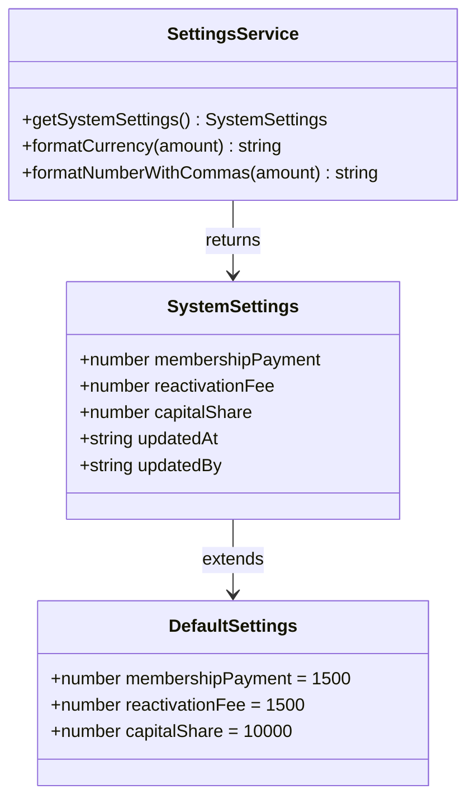

**Diagram sources**
- [lib/settingsService.ts:3-15](file://lib/settingsService.ts#L3-15)

### Settings Configuration Interface

The system settings interface provides comprehensive control over all financial policies:

| Setting | Default Value | Description | Real-Time Impact |
|---------|---------------|-------------|------------------|
| **Membership Payment** | ₱1,500.00 | Initial membership fee | Affects member registration total |
| **Reactivation Fee** | ₱1,500.00 | Fee for reactivating inactive members | Affects member restoration costs |
| **Capital Share** | ₱10,000.00 | Required capital share amount | Affects all member financial requirements |

**Updated** The system settings now include the critical capitalShare field that defines the required capital share amount for all members. This centralized configuration allows administrators to adjust financial requirements dynamically without code changes, with immediate real-time impact across all system components.

**Section sources**
- [app/admin/settings/system/page.tsx:1-873](file://app/admin/settings/system/page.tsx#L1-873)
- [lib/settingsService.ts:1-56](file://lib/settingsService.ts#L1-56)

## User Registration and Membership

### Enhanced Member Registration Workflow

The member registration process is streamlined through a multi-step wizard with enhanced capital share processing and real-time validation:

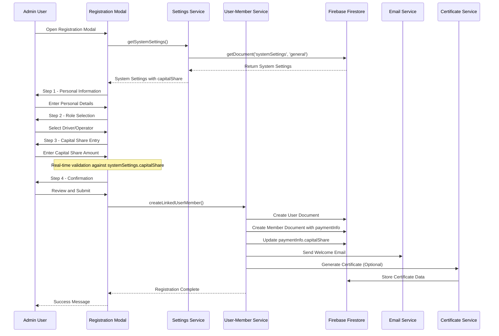

**Diagram sources**
- [components/admin/MemberRegistrationModal.tsx:249-432](file://components/admin/MemberRegistrationModal.tsx#L249-432)
- [lib/userMemberService.ts:23-94](file://lib/userMemberService.ts#L23-94)
- [lib/settingsService.ts:21-37](file://lib/settingsService.ts#L21-37)

### Real-Time Capital Share Validation

The member registration system now includes comprehensive real-time validation based on system settings:

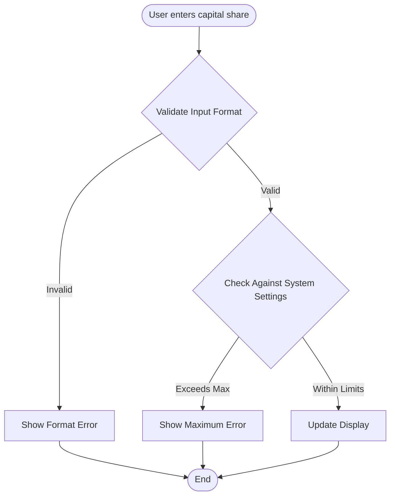

**Diagram sources**
- [components/admin/MemberRegistrationModal.tsx:1562-1610](file://components/admin/MemberRegistrationModal.tsx#L1562-1610)

### User-Member Linkage System

The system maintains consistency between user accounts and member profiles through a dual-document approach with enhanced capital share tracking and real-time monitoring:

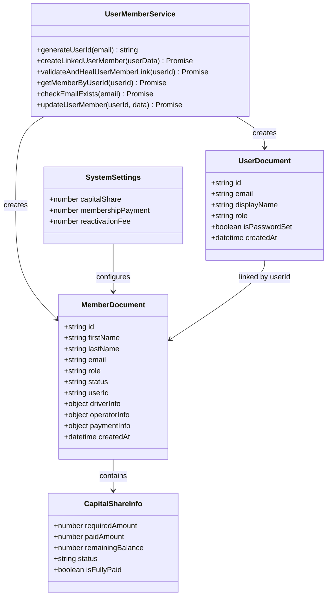

**Diagram sources**
- [lib/userMemberService.ts:14-289](file://lib/userMemberService.ts#L14-289)
- [hooks/useCapitalShare.ts:7-13](file://hooks/useCapitalShare.ts#L7-13)
- [lib/settingsService.ts:3-9](file://lib/settingsService.ts#L3-9)

**Updated** The member documents now include enhanced paymentInfo objects with configurable capital share processing, ensuring consistent financial tracking across all cooperative members with real-time updates. The new modal interface allows administrators to manage individual member payments with transaction history.

**Section sources**
- [components/admin/MemberRegistrationModal.tsx:1-800](file://components/admin/MemberRegistrationModal.tsx#L1-800)
- [lib/userMemberService.ts:1-289](file://lib/userMemberService.ts#L1-289)
- [lib/settingsService.ts:1-56](file://lib/settingsService.ts#L1-56)

## Financial Transactions

### Savings Transaction Management

The savings transaction system provides comprehensive financial tracking with enhanced capital share integration and real-time monitoring:

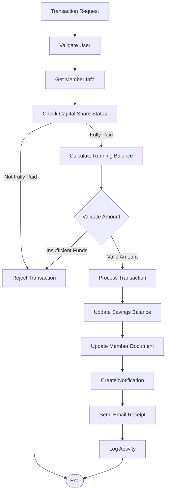

**Diagram sources**
- [lib/savingsService.ts:240-497](file://lib/savingsService.ts#L240-497)

### Transaction Types and Processing

The system supports two primary transaction types with enhanced capital share processing and real-time updates:

| Transaction Type | Description | Balance Impact | Capital Share Integration |
|------------------|-------------|----------------|---------------------------|
| **Deposit** | Money added to member account | Increases balance | Can contribute to capital share payments |
| **Withdrawal** | Money removed from member account | Decreases balance | May affect remaining capital share balance |

**Updated** The transaction system now integrates seamlessly with capital share processing, allowing savings deposits to directly contribute toward meeting the configurable capital share requirement with real-time status updates. The new modal interface provides comprehensive transaction tracking with member-specific collections.

**Section sources**
- [lib/savingsService.ts:1-669](file://lib/savingsService.ts#L1-669)
- [lib/types/savings.ts:1-22](file://lib/types/savings.ts#L1-22)

## Certificate Generation

### Share Certificate System

The certificate generation system provides professional documentation for member capital shares with enhanced financial tracking and real-time updates:

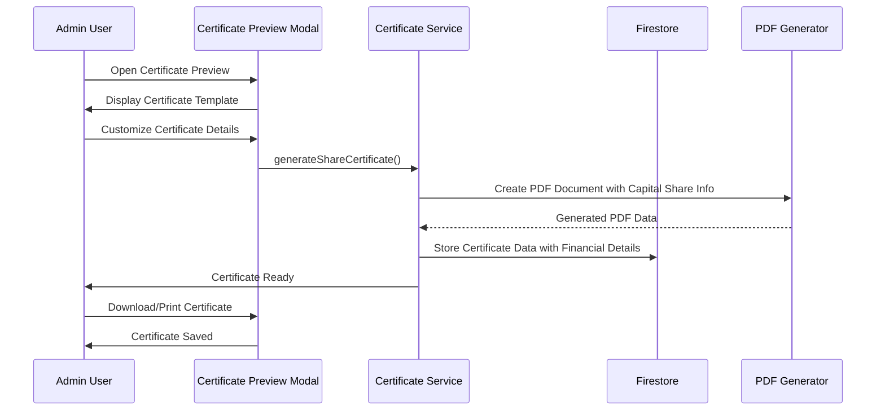

**Diagram sources**
- [components/admin/CertificatePreviewModal.tsx:160-327](file://components/admin/CertificatePreviewModal.tsx#L160-327)
- [lib/certificateService.ts:12-294](file://lib/certificateService.ts#L12-294)

### Certificate Features

The certificate system includes advanced features for professional documentation with enhanced financial transparency and real-time data:

- **Customizable Templates**: Professional share certificate designs with capital share details
- **Automated Generation**: Real-time PDF creation with member capital share information
- **Officer Integration**: Automatic inclusion of cooperative officers with financial tracking
- **Multi-format Export**: Download as PDF or print directly with financial summaries
- **Storage Integration**: Automatic saving to member records with complete capital share history
- **Real-Time Updates**: Certificates reflect current capital share status and remaining balances

**Updated** The certificate system now includes comprehensive capital share information, providing official documentation of member financial obligations and payment status with real-time accuracy.

**Section sources**
- [components/admin/CertificatePreviewModal.tsx:1-672](file://components/admin/CertificatePreviewModal.tsx#L1-672)
- [lib/certificateService.ts:1-410](file://lib/certificateService.ts#L1-410)

## Permission System

### Role-Based Access Control

The system implements a comprehensive permission system based on user roles with enhanced capital share management capabilities and real-time restrictions:

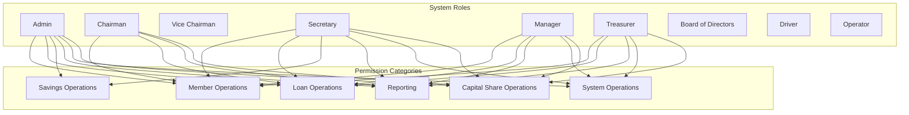

**Diagram sources**
- [lib/rolePermissions.tsx:24-130](file://lib/rolePermissions.tsx#L24-130)

### Permission Implementation

The permission system provides granular control over system functionality with enhanced capital share management and real-time restrictions:

| Permission Category | Description | Admin | Chairman | Secretary | Manager | Treasurer |
|-------------------|-------------|-------|----------|-----------|---------|-----------|
| **View Members** | View member records | ✅ | ✅ | ✅ | ❌ | ❌ |
| **Add Members** | Create new member records | ✅ | ❌ | ✅ | ❌ | ❌ |
| **Edit Members** | Modify member information | ✅ | ✅ | ✅ | ❌ | ❌ |
| **Approve Loans** | Approve loan applications | ✅ | ✅ | ❌ | ❌ | ❌ |
| **Manage Savings** | Process savings transactions | ✅ | ❌ | ✅ | ✅ | ✅ |
| **View Reports** | Access system reports | ✅ | ✅ | ✅ | ✅ | ✅ |
| **Export Data** | Export system data | ✅ | ✅ | ✅ | ✅ | ❌ |
| **Manage Capital Shares** | Monitor and manage capital share payments | ✅ | ✅ | ✅ | ❌ | ❌ |
| **Configure System Settings** | Modify system-wide settings | ✅ | ❌ | ❌ | ❌ | ❌ |

**Updated** The permission system now includes enhanced capital share management capabilities with real-time monitoring and dynamic restrictions based on capital share status. Administrators can now manage individual member payments through the modal interface and configure system-wide financial policies.

**Section sources**
- [lib/rolePermissions.tsx:1-226](file://lib/rolePermissions.tsx#L1-226)

## Data Management

### Database Schema Design

The system uses a normalized document-based schema optimized for cooperative operations with enhanced capital share tracking and real-time updates:

```mermaid
erDiagram
COLLECTIONS {
string members
string users
string loans
string loanRequests
string savings
string member_certificates
string rolePermissions
string systemSettings
}
SUBCOLLECTIONS {
string members/{memberId}/savings
string members/{memberId}/capitalShareTransactions
}
RELATIONSHIPS {
string members.userId = users.id
string members/{memberId}/savings.memberId = members.id
string member_certificates.memberId = members.id
}
PAYMENT_INFO {
object paymentInfo
number capitalShare
datetime paymentDate
}
SYSTEM_SETTINGS {
string id = "general"
number capitalShare
number membershipPayment
number reactivationFee
datetime updatedAt
string updatedBy
}
MEMBERS ||--o{ PAYMENT_INFO : contains
MEMBERS ||--o{ CAPITAL_SHARE_TRANSACTIONS : contains
SYSTEM_SETTINGS ||--|| MEMBERS : configures
```

**Diagram sources**
- [lib/firebase.ts:90-343](file://lib/firebase.ts#L90-343)

### Data Validation and Integrity

The system implements comprehensive data validation with enhanced capital share processing and real-time monitoring:

- **Email Uniqueness**: Ensures no duplicate member registrations
- **Role Validation**: Restricts access based on user roles
- **Permission Validation**: Controls access to sensitive operations
- **Transaction Validation**: Prevents invalid financial operations
- **Document References**: Maintains referential integrity across collections
- **Capital Share Validation**: Validates against system settings configuration
- **Real-Time Updates**: Automatic synchronization of capital share status across all interfaces
- **Member Collections**: Individual member-specific transaction collections for efficient querying
- **System Settings Validation**: Ensures all financial policies are properly configured

**Updated** The data validation system now includes enhanced capital share processing with real-time monitoring, ensuring all members meet the configurable capital share requirement consistently with live status updates. Member-specific collections enable efficient transaction querying and payment tracking.

**Section sources**
- [lib/firebase.ts:1-384](file://lib/firebase.ts#L1-384)
- [app/api/members/route.ts:1-179](file://app/api/members/route.ts#L1-179)

## Security and Authentication

### Authentication Architecture

The system implements a robust authentication mechanism with real-time capital share validation:

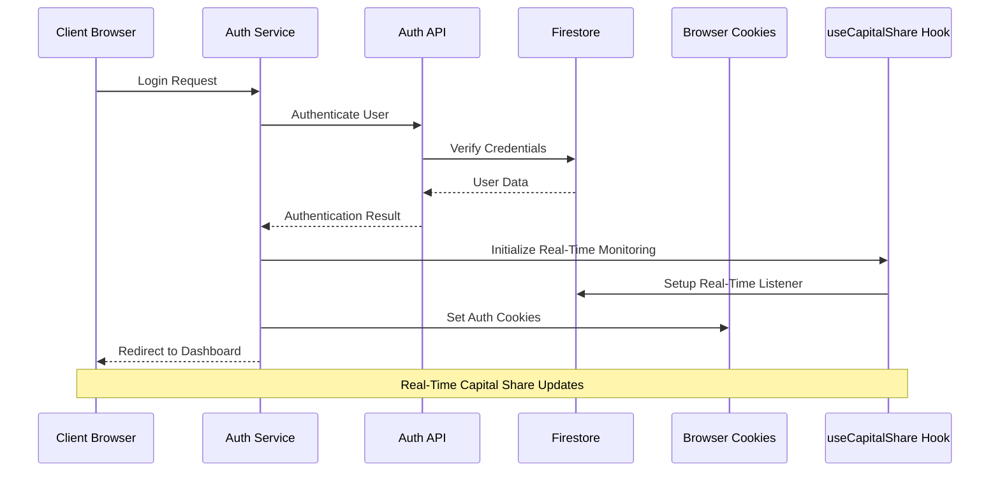

**Diagram sources**
- [lib/auth.tsx:198-372](file://lib/auth.tsx#L198-372)

### Security Features

The authentication system includes multiple security layers with enhanced capital share monitoring:

- **Cookie-Based Session Management**: Secure user session tracking
- **Role-Based Access Control**: Granular permission enforcement
- **Password Hashing**: Secure password storage using PBKDF2
- **Input Validation**: Comprehensive form validation and sanitization
- **Middleware Protection**: Route-level access control
- **Audit Logging**: Complete activity tracking
- **Real-Time Monitoring**: Continuous capital share status updates
- **Dynamic Restrictions**: Automatic application of capital share requirements
- **System Settings Security**: Protected access to financial policy configuration

**Section sources**
- [lib/auth.tsx:1-706](file://lib/auth.tsx#L1-706)
- [middleware.ts:1-62](file://middleware.ts#L1-62)

## Real-Time Monitoring and Dynamic Tracking

### useCapitalShare Hook Implementation

The new useCapitalShare hook provides comprehensive real-time monitoring of capital share status across all system interfaces:

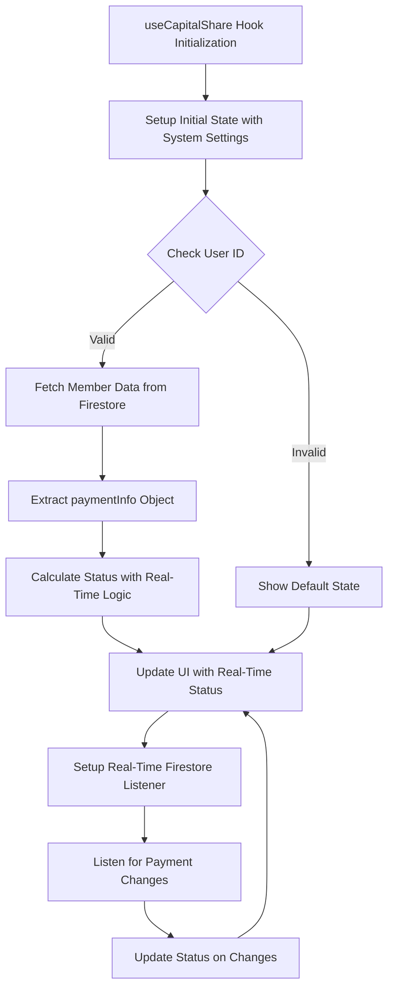

**Diagram sources**
- [hooks/useCapitalShare.ts:24-112](file://hooks/useCapitalShare.ts#L24-112)

### Real-Time Dashboard Integration

The dashboard now features real-time capital share monitoring with automatic status updates:

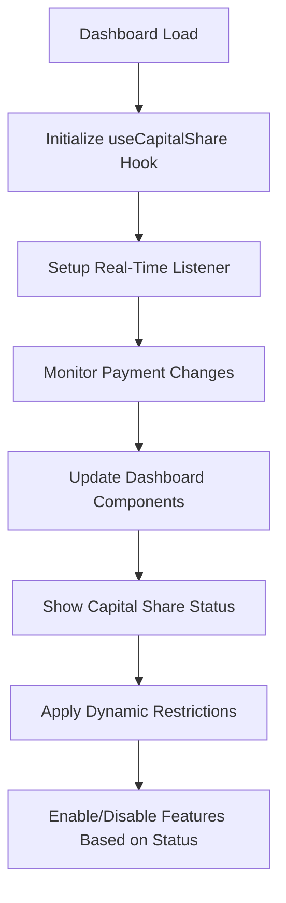

**Diagram sources**
- [app/dashboard/page.tsx:70-71](file://app/dashboard/page.tsx#L70-L71)
- [hooks/useCapitalShare.ts:102-104](file://hooks/useCapitalShare.ts#L102-L104)

### Dynamic Status Tracking Features

The real-time monitoring system provides comprehensive capital share tracking with immediate visual feedback:

- **Live Status Updates**: Automatic updates when capital share payments change
- **Visual Indicators**: Color-coded status badges that update instantly
- **Progress Tracking**: Real-time progress bars showing payment completion
- **Restriction Enforcement**: Automatic application of loan and savings restrictions
- **Notification System**: Real-time alerts for status changes and payment updates
- **Performance Optimization**: Efficient real-time listeners with automatic cleanup
- **System Settings Integration**: Real-time adaptation to configuration changes

**Updated** The real-time monitoring system ensures that all capital share status changes are immediately reflected across the entire system, providing users with accurate, up-to-date information about their financial obligations. The new modal interface provides comprehensive transaction tracking with real-time updates.

**Section sources**
- [hooks/useCapitalShare.ts:1-115](file://hooks/useCapitalShare.ts#L1-115)
- [app/dashboard/page.tsx:530-729](file://app/dashboard/page.tsx#L530-729)

## Loan Application Restrictions

### Comprehensive Financial Requirement Enforcement

The loan application system now enforces strict financial requirements based on real-time capital share status:

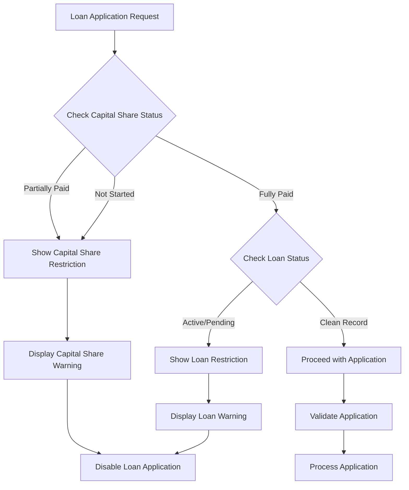

**Diagram sources**
- [app/loan/page.tsx:372-408](file://app/loan/page.tsx#L372-408)
- [components/user/actions/LoanActions.tsx:9-13](file://components/user/actions/LoanActions.tsx#L9-L13)

### Dynamic Restriction Implementation

The system implements comprehensive loan application restrictions based on capital share status:

#### Capital Share Requirements
- **Complete Payment Required**: Full capital share payment according to system settings
- **Real-Time Validation**: Automatic checking of current capital share status
- **Immediate Enforcement**: Restrictions applied as soon as status changes
- **Visual Warnings**: Clear messaging about payment requirements

#### Loan Status Restrictions
- **Active Loans**: Cannot apply for new loans while active loans exist
- **Pending Applications**: Cannot apply for new loans with pending applications
- **Combined Restrictions**: Multiple restrictions can apply simultaneously
- **Automatic Disabling**: Loan application forms automatically disabled

#### User Experience Enhancements
- **Progressive Disclosure**: Only show relevant restrictions to users
- **Clear Explanations**: Detailed messaging explaining why applications are restricted
- **Contact Information**: Direct links to cooperative office for assistance
- **Alternative Actions**: Guidance on how to resolve restriction issues

**Updated** The loan application restrictions system now operates in real-time, automatically enforcing financial requirements based on the latest capital share status and system settings configuration, ensuring compliance with cooperative policies while providing clear guidance to users. The modal interface provides comprehensive payment tracking and transaction history.

**Section sources**
- [app/loan/page.tsx:370-569](file://app/loan/page.tsx#L370-569)
- [components/user/actions/LoanActions.tsx:15-58](file://components/user/actions/LoanActions.tsx#L15-L58)

## Performance Considerations

### Database Optimization

The system implements several performance optimization strategies with enhanced capital share processing and real-time monitoring:

- **Batch Operations**: Parallel processing of multiple database queries
- **Efficient Queries**: Optimized Firestore queries with appropriate indexing
- **Caching Strategies**: Client-side caching for frequently accessed data
- **Lazy Loading**: Progressive loading of large datasets
- **Pagination**: Efficient handling of large collections
- **Configurable Processing**: Optimized calculations for flexible capital share amounts
- **Real-Time Listeners**: Efficient Firestore listeners with automatic cleanup
- **Memory Management**: Proper cleanup of real-time listeners on component unmount
- **Member Collections**: Efficient member-specific transaction querying with subcollections
- **System Settings Caching**: Cached system settings to reduce Firestore queries

### Frontend Performance

The frontend implements performance best practices with enhanced UI components and real-time updates:

- **Code Splitting**: Dynamic imports for route-based code splitting
- **Component Memoization**: React.memo for expensive components
- **Optimized Rendering**: Efficient table rendering for large datasets with new columns
- **Loading States**: Proper loading indicators for async operations
- **Error Boundaries**: Graceful error handling and recovery
- **Color-Coded Rendering**: Optimized visual indicators for financial tracking
- **Real-Time Updates**: Efficient real-time listeners with debouncing
- **State Management**: Optimized state updates to minimize re-renders
- **Modal Performance**: Optimized modal rendering with conditional loading
- **System Settings Integration**: Efficient integration with real-time settings updates

**Updated** The frontend performance has been enhanced to handle the new table columns, color-coded visual indicators, and real-time updates efficiently, ensuring smooth user experience even with increased data complexity and real-time monitoring. The modal interface is optimized for performance with lazy loading and efficient state management.

## Troubleshooting Guide

### Common Issues and Solutions

**Authentication Problems**
- **Issue**: Users cannot log in
- **Solution**: Check Firebase configuration, verify user credentials, review authentication cookies

**Database Connection Issues**
- **Issue**: Application cannot connect to Firestore
- **Solution**: Verify Firebase credentials, check network connectivity, review Firestore rules

**Permission Denied Errors**
- **Issue**: Users receive access denied messages
- **Solution**: Verify user roles, check permission configurations, review rolePermissions collection

**Data Synchronization Issues**
- **Issue**: User and member data inconsistencies
- **Solution**: Use validateAndHealUserMemberLink function, check user-member linkage, verify document references

**Certificate Generation Failures**
- **Issue**: Share certificates not generating properly
- **Solution**: Check certificate template data, verify PDF generation library, confirm email service configuration

**Capital Share Processing Issues**
- **Issue**: Capital share amounts not displaying correctly
- **Solution**: Verify systemSettings.capitalShare configuration, check paymentInfo structure, confirm status calculation logic

**System Settings Not Updating**
- **Issue**: Changes to system settings not taking effect
- **Solution**: Verify systemSettings document exists, check Firestore permissions, confirm real-time listener updates

**Real-Time Monitoring Issues**
- **Issue**: Capital share status not updating in real-time
- **Solution**: Verify useCapitalShare hook initialization, check Firestore real-time listeners, confirm user authentication state

**Enhanced Status Display Problems**
- **Issue**: Status badges not showing correct colors
- **Solution**: Verify status determination logic, check color-coding classes, confirm remainingBalance calculations

**Loan Application Restrictions Not Working**
- **Issue**: Loan applications not properly restricted despite unpaid capital shares
- **Solution**: Verify useCapitalShare hook integration, check loan application components, confirm real-time status updates

**Savings Transaction Validation Issues**
- **Issue**: Savings transactions being rejected despite having capital share payments
- **Solution**: Verify checkCapitalShareStatus function, check member paymentInfo structure, confirm real-time status updates

**Payment Modal Issues**
- **Issue**: Payment modal not opening or transactions not recording
- **Solution**: Verify member selection, check transaction submission logic, confirm Firestore write permissions

**Transaction History Loading Issues**
- **Issue**: Transaction history not loading in modal
- **Solution**: Verify member ID resolution, check subcollection access permissions, confirm Firestore query syntax

**System Settings Validation Issues**
- **Issue**: Capital share amounts exceeding system limits not being validated
- **Solution**: Verify systemSettingsService integration, check real-time validation logic, confirm error handling

**Section sources**
- [lib/auth.tsx:366-372](file://lib/auth.tsx#L366-372)
- [lib/userMemberService.ts:101-200](file://lib/userMemberService.ts#L101-200)

## Conclusion

The Capital Shares Management System provides a comprehensive solution for cooperative member management with robust features for capital share tracking, financial transactions, member registration, and administrative oversight. The system's modular architecture, comprehensive permission system, and professional certificate generation capabilities make it well-suited for managing cooperative operations efficiently.

**Updated** The system has been significantly enhanced with a comprehensive capital share configuration system that allows administrators to dynamically set and manage capital share requirements through centralized system settings. Key improvements include:

- **Centralized Configuration**: System settings service with real-time updates and validation
- **Real-Time Monitoring**: useCapitalShare hook provides live updates of capital share status across all interfaces
- **Enhanced Financial Tracking**: New state variables and metrics for better visibility with real-time updates
- **Improved Status Determination**: Clear Paid/Pending/Partial categorization logic with immediate visual feedback
- **Advanced UI Features**: Color-coded visual indicators and comprehensive table columns with real-time data
- **Integrated Payment System**: Seamless connection between savings transactions and capital share payments
- **Dynamic Restrictions**: Automatic enforcement of loan application restrictions based on real-time capital share status
- **Flexible Financial Requirements**: Configurable capital share amounts through system settings with immediate policy compliance
- **Enhanced User Experience**: Real-time feedback and progressive disclosure of restrictions improve user understanding
- **Modal-Based Payment Management**: Complete payment processing system with transaction tracking and member-specific collections
- **Real-Time Transaction Updates**: Live updates of payment history and status changes
- **Member-Specific Collections**: Efficient querying and management of individual member transactions
- **System Settings Integration**: Real-time adaptation to configuration changes across all system components

Key strengths of the system include:

- **Comprehensive Feature Set**: Covers all aspects of cooperative member management with enhanced financial tracking and real-time monitoring
- **Professional Documentation**: High-quality certificate generation with financial transparency and real-time accuracy
- **Robust Security**: Multi-layered authentication and authorization with enhanced capital share management and dynamic restrictions
- **Scalable Architecture**: Optimized for growth and performance with configurable processing and real-time capabilities
- **Real-Time User Experience**: Intuitive administration and member experiences with immediate feedback and dynamic restrictions
- **Flexible Financial Standards**: Adaptable capital share requirements across all cooperative members with real-time enforcement
- **Automatic Compliance**: Dynamic restrictions ensure policy adherence without manual intervention
- **Complete Payment Lifecycle**: From registration through payment processing to transaction tracking
- **Efficient Data Management**: Member-specific collections enable scalable transaction management
- **Seamless Integration**: Cohesive experience across all system interfaces with real-time synchronization
- **Centralized Policy Management**: Single source of truth for all financial policies and requirements

The system provides a solid foundation for SAMPA Transport Service Cooperative's operational needs while maintaining flexibility for future enhancements and feature additions. The enhanced capital share management capabilities ensure fair treatment of all members while providing administrators with comprehensive tools for financial oversight and reporting. The real-time monitoring and dynamic restriction features create a seamless user experience that promotes compliance and financial responsibility among cooperative members. The new modal-based payment management system with transaction tracking provides administrators with complete visibility into member financial activities while maintaining data integrity and security.