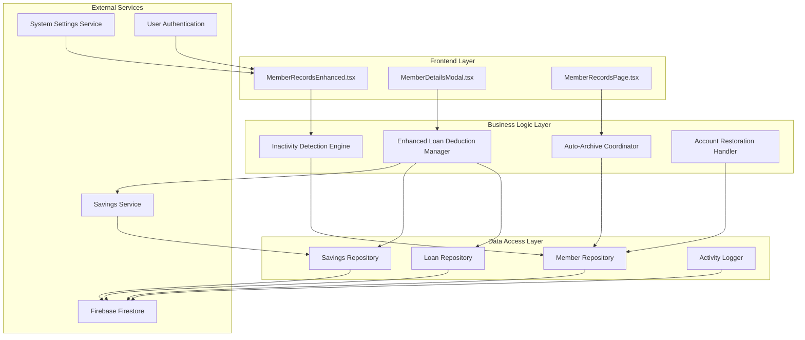
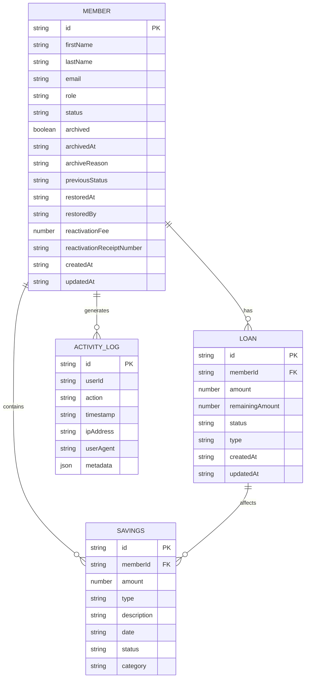
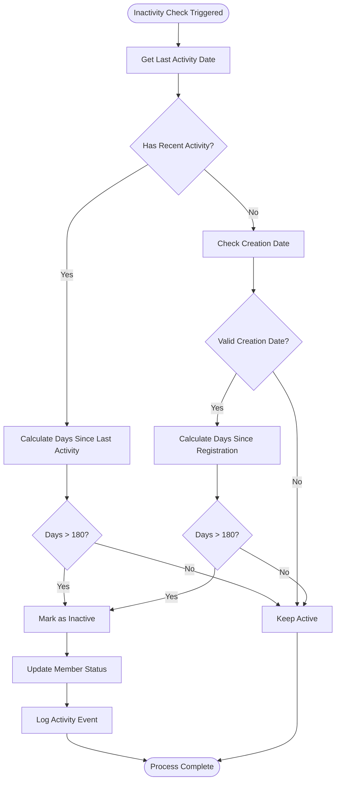
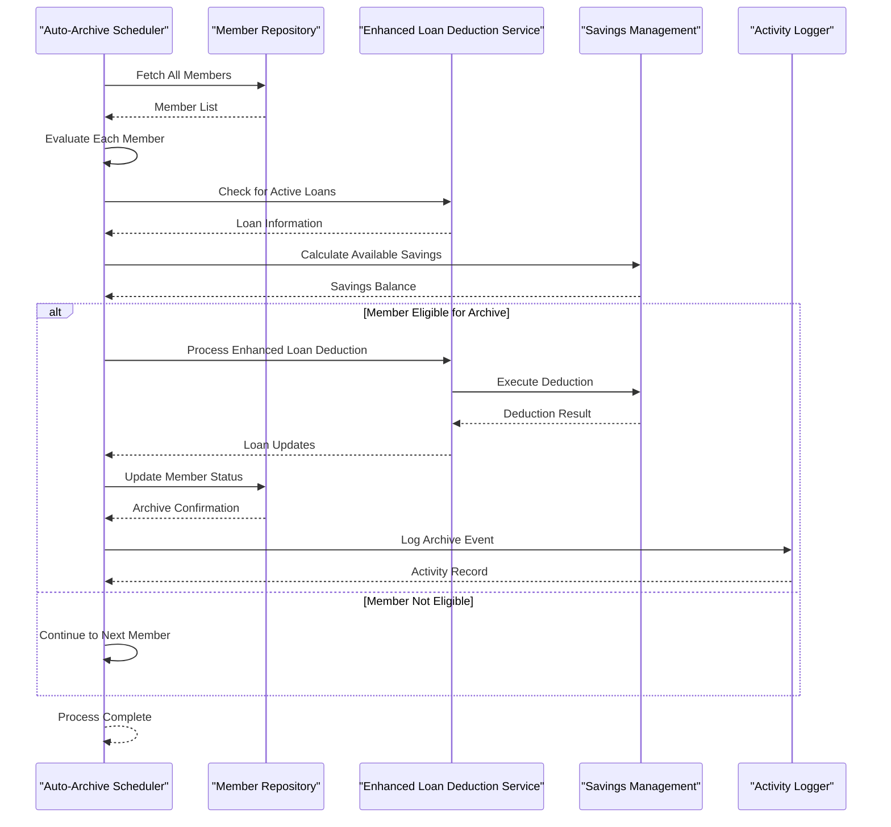
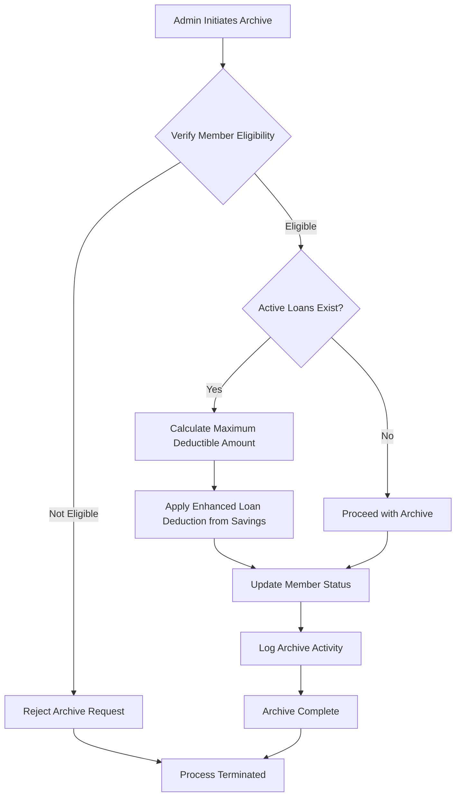
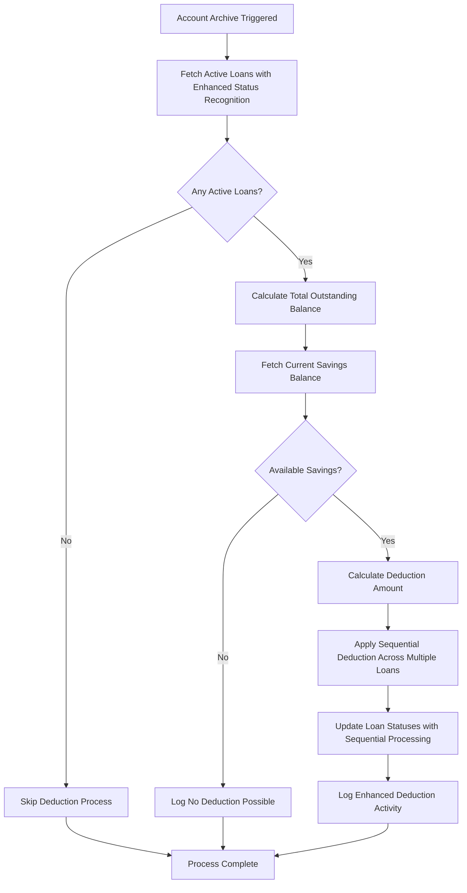
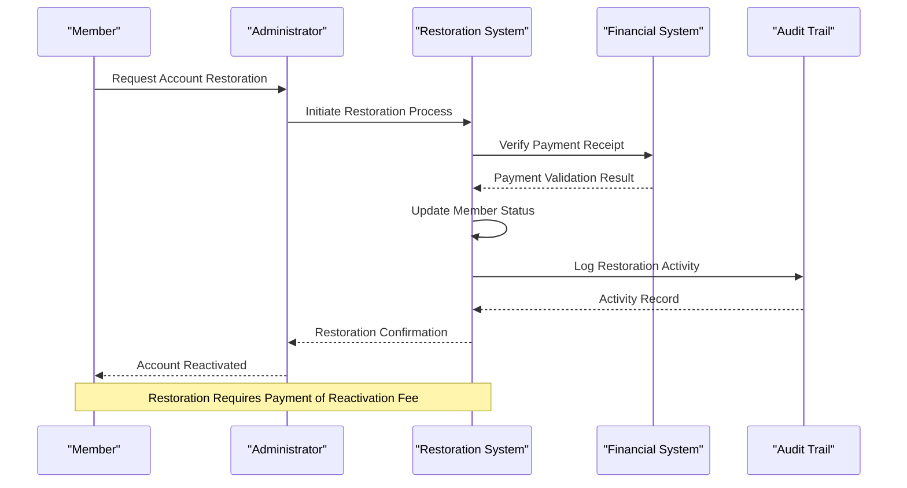
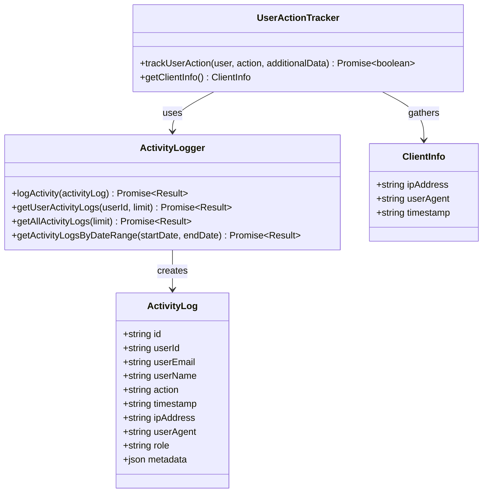

# Archived Account Management

<cite>
**Referenced Files in This Document**
- [MemberRecordsEnhanced.tsx](file://components/admin/MemberRecordsEnhanced.tsx)
- [page.tsx](file://app/admin/members/records/page.tsx)
- [MemberDetailsModal.tsx](file://components/admin/MemberDetailsModal.tsx)
- [member.ts](file://lib/types/member.ts)
- [settingsService.ts](file://lib/settingsService.ts)
- [activityLogger.ts](file://lib/activityLogger.ts)
- [userMemberService.ts](file://lib/userMemberService.ts)
- [route.ts](file://app/api/auth/route.ts)
- [savingsService.ts](file://lib/savingsService.ts)
- [loan.ts](file://lib/types/loan.ts)
- [route.ts](file://app/api/loans/route.ts)
</cite>

## Update Summary
**Changes Made**
- Enhanced loan deduction system with improved multi-loan processing capabilities
- Expanded loan status recognition beyond just 'active' status
- Added sequential deduction mechanism for multiple active loans
- Improved error handling and validation for loan deduction processes
- Enhanced audit trail logging for loan deduction activities

## Table of Contents
1. [Introduction](#introduction)
2. [System Architecture](#system-architecture)
3. [Core Components](#core-components)
4. [Inactivity Detection Algorithm](#inactivity-detection-algorithm)
5. [Auto-Archive Process](#auto-archive-process)
6. [Manual Archive Process](#manual-archive-process)
7. [Enhanced Loan Deduction System](#enhanced-loan-deduction-system)
8. [Account Restoration](#account-restoration)
9. [Audit Trail and Activity Logging](#audit-trail-and-activity-logging)
10. [Security Considerations](#security-considerations)
11. [Performance Optimizations](#performance-optimizations)
12. [Troubleshooting Guide](#troubleshooting-guide)
13. [Conclusion](#conclusion)

## Introduction

The Archived Account Management system is a comprehensive solution designed to automatically manage inactive member accounts within the SAMPA Cooperative platform. This system ensures proper account lifecycle management by identifying members who have been inactive for extended periods (6 months) and automatically archiving their accounts to maintain system efficiency and compliance.

The system operates on three core principles: automated inactivity detection, financial responsibility through enhanced loan deduction mechanisms, and complete audit trail maintenance for all account management activities. It seamlessly integrates with the existing member management infrastructure while providing robust safeguards against unauthorized access to archived accounts.

**Updated** Enhanced with improved multi-loan processing capabilities and expanded loan status recognition for better handling of complex financial scenarios.

## System Architecture

The archived account management system follows a modular architecture with clear separation of concerns across multiple layers:

**Diagram sources**
- [MemberRecordsEnhanced.tsx:36-147](file://components/admin/MemberRecordsEnhanced.tsx#L36-L147)
- [page.tsx:92-142](file://app/admin/members/records/page.tsx#L92-L142)

The architecture ensures scalability and maintainability through clear component boundaries and dependency injection patterns.

## Core Components

### Member Records Management

The system centers around two primary components that provide comprehensive member account management capabilities:

**MemberRecordsEnhanced.tsx** serves as the primary interface for managing member accounts, featuring:
- Real-time inactivity monitoring with 6-month threshold detection
- Automated archive processing with enhanced loan deduction coordination
- Interactive restoration workflows with payment validation
- Comprehensive search and filtering capabilities
- Detailed activity tracking and audit trails

**MemberDetailsModal.tsx** provides granular account inspection and management:
- Detailed member information display with status indicators
- Test scenarios for archive simulation with configurable dates
- Manual archive execution with custom deduction amounts
- Complete transaction history viewing capabilities

**Section sources**
- [MemberRecordsEnhanced.tsx:36-147](file://components/admin/MemberRecordsEnhanced.tsx#L36-L147)
- [MemberDetailsModal.tsx:8-84](file://components/admin/MemberDetailsModal.tsx#L8-L84)

### Data Model Architecture

The system utilizes a comprehensive data model that maintains consistency across member account states:

**Diagram sources**
- [member.ts:36-68](file://lib/types/member.ts#L36-L68)
- [activityLogger.ts:4-14](file://lib/activityLogger.ts#L4-L14)

**Section sources**
- [member.ts:36-68](file://lib/types/member.ts#L36-L68)

## Inactivity Detection Algorithm

The inactivity detection system employs a sophisticated algorithm that evaluates multiple temporal indicators to determine account status:

**Diagram sources**
- [MemberRecordsEnhanced.tsx:98-147](file://components/admin/MemberRecordsEnhanced.tsx#L98-L147)
- [page.tsx:92-142](file://app/admin/members/records/page.tsx#L92-L142)

The algorithm prioritizes recent transaction activity over registration date, ensuring accurate identification of truly inactive accounts while preventing premature archiving of newly registered members.

**Section sources**
- [MemberRecordsEnhanced.tsx:98-147](file://components/admin/MemberRecordsEnhanced.tsx#L98-L147)
- [page.tsx:92-142](file://app/admin/members/records/page.tsx#L92-L142)

## Auto-Archive Process

The auto-archive process represents the core automation capability of the system, designed to maintain database hygiene and operational efficiency:

**Diagram sources**
- [MemberRecordsEnhanced.tsx:242-273](file://components/admin/MemberRecordsEnhanced.tsx#L242-L273)
- [page.tsx:388-419](file://app/admin/members/records/page.tsx#L388-L419)

The process ensures financial responsibility by automatically settling outstanding loan balances against available savings before archiving accounts.

**Section sources**
- [MemberRecordsEnhanced.tsx:242-273](file://components/admin/MemberRecordsEnhanced.tsx#L242-L273)
- [page.tsx:388-419](file://app/admin/members/records/page.tsx#L388-L419)

## Manual Archive Process

Administrative manual archive functionality provides granular control over account management decisions:

**Diagram sources**
- [MemberDetailsModal.tsx:659-714](file://components/admin/MemberDetailsModal.tsx#L659-L714)
- [MemberRecordsEnhanced.tsx:149-166](file://components/admin/MemberRecordsEnhanced.tsx#L149-L166)

The manual process includes comprehensive validation and provides administrators with detailed previews of potential financial impacts before execution.

**Section sources**
- [MemberDetailsModal.tsx:659-714](file://components/admin/MemberDetailsModal.tsx#L659-L714)
- [MemberRecordsEnhanced.tsx:149-166](file://components/admin/MemberRecordsEnhanced.tsx#L149-L166)

## Enhanced Loan Deduction System

**Updated** The enhanced loan deduction system ensures financial integrity by automatically settling outstanding obligations when accounts are archived, with improved multi-loan processing capabilities and expanded loan status recognition.

**Diagram sources**
- [page.tsx:172-311](file://app/admin/members/records/page.tsx#L172-L311)
- [MemberRecordsEnhanced.tsx:150-166](file://components/admin/MemberRecordsEnhanced.tsx#L150-L166)

The system now recognizes multiple loan statuses beyond just 'active', including 'approved' and 'pending', and processes multiple active loans sequentially until either the outstanding balance is satisfied or available savings are exhausted.

### Key Enhancements

**Multi-Loan Processing**: The system now processes multiple active loans sequentially, applying deductions proportionally across all active loans based on their remaining balances.

**Expanded Status Recognition**: Loan status recognition has been expanded to include 'approved' and 'pending' statuses in addition to 'active', ensuring comprehensive coverage of all loan states.

**Enhanced Error Handling**: Improved validation and error handling mechanisms prevent partial deductions and ensure financial accuracy.

**Sequential Deduction Mechanism**: The system applies deductions sequentially across multiple loans, reducing the outstanding balance of each loan before moving to the next, maximizing loan settlement efficiency.

**Section sources**
- [page.tsx:172-311](file://app/admin/members/records/page.tsx#L172-L311)
- [MemberRecordsEnhanced.tsx:150-166](file://components/admin/MemberRecordsEnhanced.tsx#L150-L166)

## Account Restoration

The account restoration process provides a structured pathway for reactivating archived accounts while maintaining financial accountability:

**Diagram sources**
- [MemberRecordsEnhanced.tsx:169-239](file://components/admin/MemberRecordsEnhanced.tsx#L169-L239)
- [page.tsx:687-723](file://app/admin/members/records/page.tsx#L687-L723)

The restoration process includes mandatory payment verification, comprehensive audit logging, and automatic transaction recording for financial transparency.

**Section sources**
- [MemberRecordsEnhanced.tsx:169-239](file://components/admin/MemberRecordsEnhanced.tsx#L169-L239)
- [page.tsx:687-723](file://app/admin/members/records/page.tsx#L687-L723)

## Audit Trail and Activity Logging

The system maintains comprehensive audit trails for all account management activities through integrated logging mechanisms:

**Diagram sources**
- [activityLogger.ts:1-165](file://lib/activityLogger.ts#L1-L165)
- [userActionTracker.ts:1-50](file://lib/userActionTracker.ts#L1-L50)

The audit trail system captures comprehensive metadata including user actions, timestamps, IP addresses, and browser fingerprints, enabling complete traceability of all system interactions.

**Section sources**
- [activityLogger.ts:1-165](file://lib/activityLogger.ts#L1-L165)
- [userActionTracker.ts:1-50](file://lib/userActionTracker.ts#L1-L50)

## Security Considerations

The archived account management system incorporates multiple security layers to protect sensitive member data and prevent unauthorized access:

### Authentication and Authorization
- Multi-factor authentication enforcement for administrative functions
- Role-based access control limiting archive and restoration capabilities
- Session timeout management and automatic logout policies

### Data Protection
- Encrypted storage of sensitive financial information
- Secure transmission protocols for all data exchanges
- Regular security audits and vulnerability assessments

### Access Controls
- Administrative approval workflows for sensitive operations
- Real-time monitoring of suspicious activities
- Comprehensive logging of all administrative actions

**Section sources**
- [route.ts:129-141](file://app/api/auth/route.ts#L129-L141)

## Performance Optimizations

The system implements several performance optimization strategies to ensure efficient operation under various load conditions:

### Database Optimization
- Indexed queries for member status and activity tracking
- Batch processing for bulk archive operations
- Efficient pagination for large member datasets

### Caching Strategies
- Redis caching for frequently accessed member information
- Query result caching for repetitive administrative tasks
- Static asset optimization for improved frontend performance

### Asynchronous Processing
- Background job queuing for time-intensive archive operations
- Non-blocking operations for real-time user interactions
- Parallel processing for multi-member operations

## Troubleshooting Guide

### Common Issues and Solutions

**Archive Process Failures**
- Verify database connectivity and permissions
- Check for conflicting member status updates
- Review loan deduction calculation errors

**Enhanced Loan Deduction Problems**
- Confirm sufficient savings balance availability
- Validate active loan records with expanded status recognition
- Check for pending transaction conflicts
- Verify sequential deduction process completion

**Audit Trail Issues**
- Verify logging service availability
- Check database write permissions
- Review timestamp synchronization issues

**Performance Degradation**
- Monitor database query performance
- Check cache hit ratios
- Review concurrent user limits

### Diagnostic Tools

The system provides built-in diagnostic capabilities for troubleshooting and monitoring:

- Real-time system health monitoring
- Automated performance alerting
- Comprehensive error reporting mechanisms
- Detailed operational metrics and analytics

## Conclusion

The Archived Account Management system represents a comprehensive solution for maintaining operational efficiency while ensuring financial responsibility and regulatory compliance. Through its automated inactivity detection, intelligent loan deduction mechanisms, and complete audit trail capabilities, the system provides administrators with powerful tools for effective member account lifecycle management.

The enhanced loan deduction system with improved multi-loan processing capabilities and expanded loan status recognition provides better handling of complex financial scenarios, ensuring that multiple active loans are processed efficiently and accurately. The sequential deduction mechanism maximizes loan settlement while maintaining financial accuracy and transparency.

The modular architecture ensures scalability and maintainability, while the robust security measures protect sensitive member data and prevent unauthorized access. The comprehensive audit trail system enables complete traceability of all administrative actions, supporting both internal governance and external compliance requirements.

Future enhancements could include machine learning-based activity pattern analysis, enhanced notification systems for members approaching archive status, and expanded integration capabilities with external financial systems. The current implementation provides a solid foundation for these advanced features while maintaining the reliability and security essential for cooperative financial management.