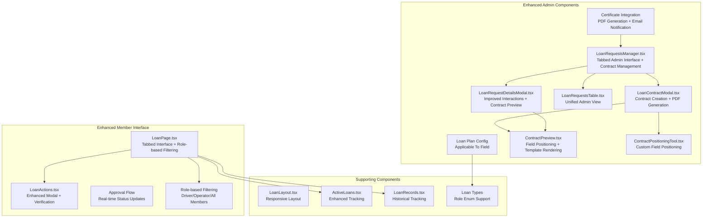
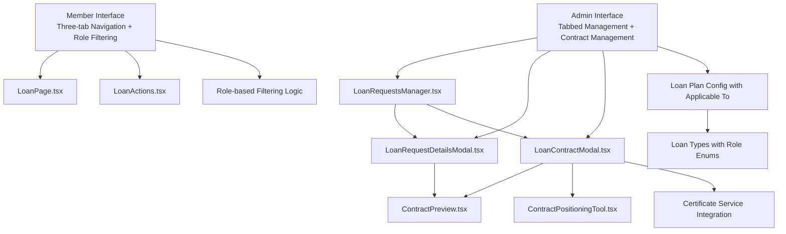
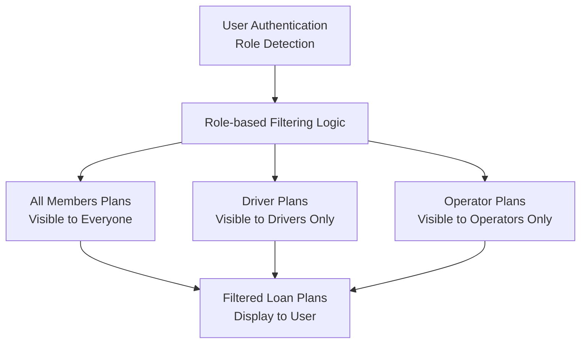

# Loan Management System

<cite>
**Referenced Files in This Document**
- [LoanPage.tsx](file://app/loan/page.tsx)
- [LoanActions.tsx](file://components/user/actions/LoanActions.tsx)
- [LoanApplicationModal.tsx](file://components/user/LoanApplicationModal.tsx)
- [LoanRequestsManager.tsx](file://components/admin/LoanRequestsManager.tsx)
- [LoanRequestDetailsModal.tsx](file://components/admin/LoanRequestDetailsModal.tsx)
- [LoanRequestsTable.tsx](file://components/admin/LoanRequestsTable.tsx)
- [LoanLayout.tsx](file://components/shared/LoanLayout.tsx)
- [ActiveLoans.tsx](file://components/user/ActiveLoans.tsx)
- [LoanRecords.tsx](file://components/user/LoanRecords.tsx)
- [PaginatedLoanRecords.tsx](file://components/admin/PaginatedLoanRecords.tsx)
- [LoanRecords.tsx](file://components/admin/LoanRecords.tsx)
- [LoanContractModal.tsx](file://components/admin/LoanContractModal.tsx)
- [ContractPreview.tsx](file://components/admin/ContractPreview.tsx)
- [ContractPositioningTool.tsx](file://components/admin/ContractPositioningTool.tsx)
- [transactionReceiptService.ts](file://lib/transactionReceiptService.ts)
- [emailService.ts](file://lib/emailService.ts)
- [certificateService.ts](file://lib/certificateService.ts)
- [useFirestoreData.ts](file://hooks/useFirestoreData.ts)
- [route.ts](file://app/api/loans/route.ts)
- [LoanTable.tsx](file://components/admin/LoanTable.tsx)
- [AddLoanPlanModal.tsx](file://components/admin/AddLoanPlanModal.tsx)
- [Pagination.tsx](file://components/admin/Pagination.tsx)
- [SecretaryLoansPage.tsx](file://app/admin/secretary/loans/page.tsx)
- [SecretaryLoanRequestsPage.tsx](file://app/admin/secretary/loans/requests/page.tsx)
- [SecretaryLoanRecordsPage.tsx](file://app/admin/secretary/loans/records/page.tsx)
- [ChairmanLoansPage.tsx](file://app/admin/chairman/loans/page.tsx)
- [ChairmanLoanRecordsPage.tsx](file://app/admin/chairman/loans/records/page.tsx)
- [ManagerLoansPage.tsx](file://app/admin/manager/loans/page.tsx)
- [TreasurerLoansPage.tsx](file://app/admin/treasurer/loans/page.tsx)
- [BODLoansPage.tsx](file://app/admin/bod/loans/page.tsx)
- [auth.tsx](file://lib/auth.tsx)
- [firebase.ts](file://lib/firebase.ts)
- [FIRESTORE_INDEXES.md](file://docs/FIRESTORE_INDEXES.md)
- [loan.ts](file://lib/types/loan.ts)
- [system.tsx](file://app/admin/settings/system/page.tsx)
- [route.ts](file://app/api/certificate/[memberId]/route.ts)
</cite>

## Update Summary
**Changes Made**
- Enhanced LoanPage with role-based loan plan filtering system
- Added comprehensive loan contract management system with new LoanContractModal, ContractPreview, and ContractPositioningTool components
- Implemented field positioning tools for contract template customization
- Added PDF generation capabilities for loan contracts using html2canvas and jsPDF
- Integrated loan approval process with certificate generation workflow
- Enhanced loan approval process with contract creation and PDF generation
- Updated loan request management with contract preview functionality

## Table of Contents
1. [Introduction](#introduction)
2. [Project Structure](#project-structure)
3. [Core Components](#core-components)
4. [Architecture Overview](#architecture-overview)
5. [Enhanced Tabbed Interface System](#enhanced-tabbed-interface-system)
6. [Advanced Loan Lifecycle Management](#advanced-loan-lifecycle-management)
7. [Improved Loan Request Management](#improved-loan-request-management)
8. [Enhanced Loan Application Process](#enhanced-loan-application-process)
9. [Role-Based Loan Plan Filtering](#role-based-loan-plan-filtering)
10. [Comprehensive Loan Contract Management](#comprehensive-loan-contract-management)
11. [Field Positioning and Customization Tools](#field-positioning-and-customization-tools)
12. [PDF Generation and Contract Creation](#pdf-generation-and-contract-creation)
13. [Certificate Integration](#certificate-integration)
14. [Real-time Status Synchronization](#real-time-status-synchronization)
15. [Loan Tracking and Monitoring](#loan-tracking-and-monitoring)
16. [Automated Payment Processing](#automated-payment-processing)
17. [Administrative Loan Management](#administrative-loan-management)
18. [Performance Considerations](#performance-considerations)
19. [Troubleshooting Guide](#troubleshooting-guide)
20. [Conclusion](#conclusion)

## Introduction
This document describes the SAMPA Cooperative Management System's enhanced loan management functionality featuring a comprehensive tabbed interface system, improved loan application processes, sophisticated real-time status monitoring, and advanced loan contract management capabilities. The system now provides a unified platform for members to manage their loan applications, track active loans, and monitor completed loan history through an intuitive three-tab interface. A significant enhancement is the role-based loan plan filtering system that ensures members only see loan plans relevant to their membership category (Driver, Operator, or All Members). Additionally, the system now includes a comprehensive loan contract management system with field positioning tools, PDF generation capabilities, and certificate integration.

## Project Structure
The loan management system is implemented as a Next.js application with role-based admin pages, shared React components, and enhanced loan contract management infrastructure. The enhanced structure supports seamless navigation between loan applications, active loans, and completed loan history, with intelligent role-based filtering of available loan plans and comprehensive contract management capabilities.

**Diagram sources**
- [LoanPage.tsx:156-182](file://app/loan/page.tsx#L156-L182)
- [LoanActions.tsx:1-663](file://components/user/actions/LoanActions.tsx#L1-L663)
- [LoanRequestsManager.tsx:68-200](file://components/admin/LoanRequestsManager.tsx#L68-L200)
- [LoanContractModal.tsx:1-404](file://components/admin/LoanContractModal.tsx#L1-L404)
- [ContractPreview.tsx:1-177](file://components/admin/ContractPreview.tsx#L1-L177)
- [ContractPositioningTool.tsx:1-327](file://components/admin/ContractPositioningTool.tsx#L1-L327)
- [loan.ts:8](file://lib/types/loan.ts#L8)

## Core Components
- **LoanPage**: Enhanced main interface featuring three-tab navigation (My Loan Applications, Active Loans, Completed Loans) with real-time status synchronization, role-based loan plan filtering, and enhanced user interaction patterns.
- **LoanActions**: Streamlined loan application component with integrated verification modal, amortization scheduling, role-aware plan selection, and enhanced user feedback mechanisms.
- **LoanRequestsManager**: Comprehensive admin interface with tabbed organization for pending, approved, and rejected loan requests, supporting real-time updates, role-based filtering, and enhanced modal interactions including contract management.
- **LoanRequestDetailsModal**: Enhanced modal component with improved user interactions, rejection reason handling, role-aware approval processes, streamlined approval procedures, and contract preview functionality.
- **LoanContractModal**: New comprehensive component for creating loan contracts with field positioning tools, PDF generation capabilities, and certificate integration workflow.
- **ContractPreview**: Component for rendering loan contract templates with field positioning, currency formatting, and responsive design.
- **ContractPositioningTool**: Interactive tool for customizing field positions on loan contracts with drag-and-drop functionality and real-time preview.
- **LoanLayout**: Responsive layout component providing collapsible sidebar navigation, role-based content filtering, and consistent styling across loan management pages.
- **LoanPlan Types**: Enhanced type definitions supporting the 'applicableTo' field with 'Driver', 'Operator', and 'All Members' enum values for role-based filtering.

**Section sources**
- [LoanPage.tsx:15-101](file://app/loan/page.tsx#L15-L101)
- [LoanActions.tsx:15-60](file://components/user/actions/LoanActions.tsx#L15-L60)
- [LoanRequestsManager.tsx:68-98](file://components/admin/LoanRequestsManager.tsx#L68-L98)
- [LoanRequestDetailsModal.tsx:42-74](file://components/admin/LoanRequestDetailsModal.tsx#L42-L74)
- [LoanContractModal.tsx:11-26](file://components/admin/LoanContractModal.tsx#L11-L26)
- [ContractPreview.tsx:29-37](file://components/admin/ContractPreview.tsx#L29-L37)
- [ContractPositioningTool.tsx:31-36](file://components/admin/ContractPositioningTool.tsx#L31-L36)
- [loan.ts:8](file://lib/types/loan.ts#L8)

## Architecture Overview
The system follows a modular architecture with enhanced real-time synchronization, role-based filtering, comprehensive contract management, and certificate integration:

- **Presentation Layer**: Three-tab interface for loan applications, active loans, and completed loans with responsive design, real-time updates, and role-based content filtering.
- **Business Logic Layer**: Enhanced loan application processing with verification workflows, amortization calculations, status management, role-aware plan selection, and contract creation workflows.
- **Data Access Layer**: Firebase Firestore integration with real-time listeners, role-based query filtering, improved data synchronization patterns, and contract template storage.
- **Administration Layer**: Comprehensive loan request management with role-based access, enhanced modal interactions, configurable loan plan filtering, and contract management capabilities.
- **Contract Management Layer**: New infrastructure for loan contract creation, field positioning, PDF generation, and certificate integration with html2canvas and jsPDF libraries.
- **User Experience Layer**: Streamlined application process with integrated verification, role-aware plan selection, enhanced contract creation workflow, and improved user feedback mechanisms.

**Diagram sources**
- [LoanPage.tsx:156-182](file://app/loan/page.tsx#L156-L182)
- [LoanActions.tsx:44-58](file://components/user/actions/LoanActions.tsx#L44-L58)
- [LoanRequestsManager.tsx:164-225](file://components/admin/LoanRequestsManager.tsx#L164-L225)
- [LoanContractModal.tsx:1-404](file://components/admin/LoanContractModal.tsx#L1-L404)
- [ContractPreview.tsx:1-177](file://components/admin/ContractPreview.tsx#L1-L177)
- [ContractPositioningTool.tsx:1-327](file://components/admin/ContractPositioningTool.tsx#L1-L327)
- [loan.ts:8](file://lib/types/loan.ts#L8)

## Enhanced Tabbed Interface System
The system now features a comprehensive three-tab interface for seamless loan management with enhanced role-based filtering:

### Tab Navigation Architecture
- **My Loan Applications Tab**: Displays all submitted loan applications with status indicators, detailed information, and role-aware plan filtering
- **Active Loans Tab**: Shows currently active and approved loans with payment tracking, loan details, and role-specific loan information
- **Completed Loans Tab**: Provides historical record of paid-off loans with summary information, completion status, and archival management

### Real-time Status Synchronization
- **Live Updates**: Firebase real-time listeners provide instant updates to loan status across all tabs with role-based filtering
- **Automatic Refresh**: Components automatically refresh when user authentication state changes, role updates, or loan status updates
- **Status Consistency**: Unified status indicators ensure consistent loan status representation across all tabs with role-aware filtering

### Enhanced User Experience
- **Responsive Design**: Mobile-friendly tab navigation with appropriate spacing and touch targets, role-aware content presentation
- **Visual Feedback**: Active tab highlighting with red accent color, hover effects, and role-based content indicators
- **Loading States**: Appropriate loading indicators during data fetching, role-based filtering, and status updates

**Section sources**
- [LoanPage.tsx:456-492](file://app/loan/page.tsx#L456-L492)
- [LoanPage.tsx:497-837](file://app/loan/page.tsx#L497-L837)

## Advanced Loan Lifecycle Management
The enhanced system provides comprehensive loan lifecycle management through integrated tracking, status monitoring, role-based filtering, and contract management:

### Loan Application Tracking
- **Application Status**: Real-time tracking of loan application status (pending, approved, rejected) with role-aware filtering
- **Application Details**: Comprehensive information display including loan plan, amount, term, application date, and role-specific plan availability
- **Application History**: Complete history of submitted applications with pagination support and role-based plan visibility

### Active Loan Management
- **Active Status Tracking**: Real-time monitoring of active loans with payment status indicators and role-specific loan information
- **Loan Details**: Complete loan information including principal amount, interest rate, loan term, current status, and role-based plan details
- **Payment Scheduling**: Detailed payment schedule with daily payment breakdown, remaining balance tracking, and role-aware payment processing
- **Contract Management**: Integrated loan contract creation and management with field positioning tools and PDF generation

### Completed Loan History
- **Completion Tracking**: Historical record of completed loans with total paid amounts, completion dates, and role-based archival management
- **Summary Information**: Compact display of loan summary with key metrics, completion status, and role-specific loan categorization
- **Archival Management**: Organized storage of completed loan information for future reference with role-based access controls

**Section sources**
- [LoanPage.tsx:510-607](file://app/loan/page.tsx#L510-L607)
- [LoanPage.tsx:625-721](file://app/loan/page.tsx#L625-L721)
- [LoanPage.tsx:738-836](file://app/loan/page.tsx#L738-L836)

## Improved Loan Request Management
The administrative loan request management system has been significantly enhanced with role-based filtering and comprehensive contract management:

### Tabbed Admin Interface
- **Pending Requests Tab**: Dedicated tab for managing pending loan requests with immediate action buttons, role-aware filtering, and contract creation workflow
- **Approved Requests Tab**: Organization of approved loan requests with approval timestamps, details, role-based categorization, and contract preview functionality
- **Rejected Requests Tab**: Comprehensive management of rejected loan requests with rejection reasons, timestamps, and role-specific analysis

### Enhanced Modal Interactions
- **Streamlined Approvals**: Direct approval process from modal without page reload requirements, with role-aware plan validation and contract creation workflow
- **Improved Rejection Handling**: Integrated rejection reason input with validation, confirmation, and role-based rejection tracking
- **Detailed Information Display**: Comprehensive loan request details with user information, role-specific loan plan details, loan specifications, and contract management options
- **Contract Preview**: Integrated contract preview functionality for approved loan requests with field positioning and template customization

### Real-time Data Synchronization
- **Live Status Updates**: Real-time updates to loan request status across all admin tabs with role-based filtering
- **Instant Notifications**: Immediate visual feedback for approval and rejection actions with role-aware notifications
- **Client-side Sorting**: Efficient client-side sorting and filtering for large datasets with role-based categorization

**Section sources**
- [LoanRequestsManager.tsx:68-98](file://components/admin/LoanRequestsManager.tsx#L68-L98)
- [LoanRequestDetailsModal.tsx:42-74](file://components/admin/LoanRequestDetailsModal.tsx#L42-L74)
- [LoanRequestsManager.tsx:164-225](file://components/admin/LoanRequestsManager.tsx#L164-L225)

## Enhanced Loan Application Process
The loan application process has been streamlined with improved user interactions, verification workflows, role-aware plan selection, and comprehensive contract management:

### Integrated Application Workflow
- **Role-aware Plan Selection**: Seamless loan plan selection with detailed information display filtered by user role (Driver, Operator, or All Members)
- **Amount Tile Selection**: Dynamic amount selection with percentage-based options and role-specific maximum limits
- **Term Selection**: Flexible term selection with validation, user feedback, and role-based term availability
- **Verification Process**: Comprehensive verification modal with amortization schedule preview and role-aware plan details

### Enhanced Verification System
- **Amortization Preview**: Detailed daily payment schedule with principal and interest breakdown and role-specific payment calculations
- **Total Cost Display**: Clear presentation of total interest and total repayment amounts with role-based plan pricing
- **Confirmation Workflow**: Secure confirmation process with user acknowledgment requirements and role-aware plan validation
- **Loading States**: Appropriate loading indicators during application submission, processing, and role-based plan filtering

### Real-time Application Status
- **Immediate Feedback**: Instant status updates after application submission with role-aware status tracking
- **Notification System**: Automated notifications for application status changes with role-specific messaging
- **Status Tracking**: Real-time tracking of application status through approval process with role-based filtering

**Section sources**
- [LoanActions.tsx:15-60](file://components/user/actions/LoanActions.tsx#L15-L60)
- [LoanActions.tsx:108-134](file://components/user/actions/LoanActions.tsx#L108-L134)
- [LoanActions.tsx:136-292](file://components/user/actions/LoanActions.tsx#L136-L292)

## Role-Based Loan Plan Filtering
The system now implements sophisticated role-based filtering for loan plan visibility:

### Role Detection and Normalization
- **User Role Detection**: Automatic detection of user roles (Driver, Operator, or Member) from authentication context
- **Role Normalization**: Case-insensitive role normalization with whitespace trimming for consistent filtering
- **Role Validation**: Boolean validation for role membership (isDriver, isOperator) for precise filtering logic

### Dynamic Filtering Logic
- **All Members Plans**: Loan plans with 'All Members' applicableTo field are displayed to all users regardless of role
- **Driver-specific Plans**: Loan plans with 'Driver' applicableTo field are only visible to users with Driver role
- **Operator-specific Plans**: Loan plans with 'Operator' applicableTo field are only visible to users with Operator role
- **Default Behavior**: Plans without applicableTo field default to 'All Members' visibility

### Implementation Architecture
- **Client-side Filtering**: Real-time filtering of loan plans based on user role during component initialization
- **Sample Plan Creation**: Automatic creation of sample loan plans when no plans exist, with 'All Members' applicability
- **Error Handling**: Graceful handling of role detection failures and empty plan sets with user-friendly messaging

**Diagram sources**
- [LoanPage.tsx:156-182](file://app/loan/page.tsx#L156-L182)
- [LoanPage.tsx:184-187](file://app/loan/page.tsx#L184-L187)

**Section sources**
- [LoanPage.tsx:156-182](file://app/loan/page.tsx#L156-L182)
- [LoanPage.tsx:184-187](file://app/loan/page.tsx#L184-L187)
- [loan.ts:8](file://lib/types/loan.ts#L8)

## Comprehensive Loan Contract Management
The system now includes a comprehensive loan contract management system with advanced field positioning tools and PDF generation capabilities:

### Contract Creation Workflow
- **LoanContractModal**: Central component for creating loan contracts with field positioning tools, PDF generation, and certificate integration
- **Contract Preview**: Real-time preview of loan contracts with field positioning and template customization
- **Field Positioning Tools**: Interactive tools for customizing field positions on loan contracts with drag-and-drop functionality
- **PDF Generation**: High-quality PDF generation using html2canvas and jsPDF libraries with letter-size formatting

### Contract Template Management
- **Template Rendering**: Dynamic rendering of loan contract templates with field overlays and positioning
- **Field Positioning Persistence**: Storage of field positions in Firestore for consistent contract formatting
- **Template Customization**: Ability to customize field positions, fonts, and sizes for different contract requirements
- **Responsive Design**: Adaptive contract rendering that maintains proportions across different screen sizes

### Integration with Loan Approval Process
- **Approval Workflow Integration**: Seamless integration between loan approval and contract creation processes
- **Contract Completion Tracking**: Automatic tracking of contract completion and loan approval status
- **Certificate Generation**: Integration with certificate generation workflow for member certificates
- **Email Notifications**: Automated email notifications for contract completion and loan approval

**Section sources**
- [LoanContractModal.tsx:1-404](file://components/admin/LoanContractModal.tsx#L1-L404)
- [ContractPreview.tsx:1-177](file://components/admin/ContractPreview.tsx#L1-L177)
- [ContractPositioningTool.tsx:1-327](file://components/admin/ContractPositioningTool.tsx#L1-L327)

## Field Positioning and Customization Tools
The system provides sophisticated field positioning and customization tools for loan contract management:

### ContractPositioningTool Component
- **Interactive Drag-and-Drop**: Intuitive drag-and-drop interface for positioning contract fields with visual feedback
- **Real-time Preview**: Live preview of field positions with real-time updates during customization
- **Property Controls**: Fine-tuning controls for field positioning, width, and font size with slider-based adjustments
- **Field Selection**: Individual field selection and editing with property panels and validation

### ContractPreview Component
- **Template Rendering**: High-fidelity rendering of loan contract templates with field overlays
- **Position Mapping**: Accurate mapping of field positions from pixel coordinates to percentage-based positioning
- **Font Scaling**: Dynamic font sizing that adapts to container dimensions and maintains readability
- **Responsive Design**: Adaptive layout that maintains proportions across different screen sizes and resolutions

### Field Position Management
- **Default Positioning**: Predefined field positions for standard contract layouts with customizable defaults
- **Position Persistence**: Storage of field positions in Firestore for consistent formatting across the system
- **Position Validation**: Validation of field positions to ensure they remain within template boundaries
- **Export Functionality**: Code export feature for easy integration of field positions into contract templates

**Section sources**
- [ContractPositioningTool.tsx:1-327](file://components/admin/ContractPositioningTool.tsx#L1-L327)
- [ContractPreview.tsx:1-177](file://components/admin/ContractPreview.tsx#L1-L177)

## PDF Generation and Contract Creation
The system includes sophisticated PDF generation capabilities for loan contracts with high-quality output and seamless integration:

### PDF Generation Process
- **html2canvas Integration**: High-quality canvas rendering of contract templates with preserved formatting and positioning
- **jsPDF Integration**: Professional PDF generation with letter-size formatting (216mm x 279mm) and full-page coverage
- **Quality Scaling**: High-resolution scaling (scale factor of 2) for crisp text and graphics in generated PDFs
- **File Naming**: Automatic file naming with borrower name and date for organized document management

### Contract Creation Workflow
- **Template Loading**: Dynamic loading of contract templates with proper aspect ratio maintenance
- **Field Overlay**: Precise overlay of contract fields with accurate positioning and formatting
- **Currency Formatting**: Automatic currency formatting with Philippine Peso symbol and proper decimal places
- **Date Formatting**: Standardized date formatting (mm/dd/yyyy) for contract fields

### Quality Assurance
- **Error Handling**: Comprehensive error handling for PDF generation failures with user-friendly error messages
- **Loading States**: Appropriate loading indicators during PDF generation process with progress feedback
- **Success Notifications**: Immediate success notifications with download prompts upon completion
- **Fallback Mechanisms**: Graceful fallback handling for edge cases and browser compatibility issues

**Section sources**
- [LoanContractModal.tsx:120-166](file://components/admin/LoanContractModal.tsx#L120-L166)
- [ContractPreview.tsx:91-102](file://components/admin/ContractPreview.tsx#L91-L102)

## Certificate Integration
The system integrates with certificate generation services for comprehensive cooperative management:

### Certificate Generation Workflow
- **Share Certificate Service**: Integration with certificateService.ts for generating share certificates with official formatting
- **PDF Generation**: Professional PDF generation with cooperative branding, official seals, and legal text
- **Email Notification**: Automated email notifications with certificate download links for member communication
- **Database Storage**: Secure storage of certificate data in Firestore with member-specific organization

### Certificate Features
- **Official Formatting**: Compliance with cooperative regulations with proper legal text and official seals
- **Member Information**: Dynamic inclusion of member details, share capital, and cooperative information
- **Date Formatting**: Proper date formatting and legal compliance for certificate validity
- **Multi-format Support**: Support for both inline viewing and download of certificate PDFs

### Integration Points
- **Loan Approval Integration**: Certificate generation triggered by loan approval processes
- **Member Onboarding**: Certificate creation during member registration and share purchase processes
- **Automated Workflows**: Integration with email services for automated certificate delivery
- **Audit Trail**: Comprehensive logging of certificate generation activities for compliance purposes

**Section sources**
- [certificateService.ts:1-410](file://lib/certificateService.ts#L1-L410)
- [route.ts:1-68](file://app/api/certificate/[memberId]/route.ts#L1-L68)

## Real-time Status Synchronization
The system implements sophisticated real-time synchronization for enhanced user experience with role-based filtering:

### Multi-Collection Real-time Listeners
- **Active Loans Listener**: Real-time monitoring of active loan status with automatic updates and role-based filtering
- **Pending Requests Listener**: Live tracking of pending loan application status with role-aware plan availability
- **Complete Loans Listener**: Real-time updates to loan history and completed loan status with role-based archival
- **Contract Management Listener**: Real-time updates to contract creation and approval status across the system

### Status Update Mechanisms
- **Automatic Detection**: Instant detection of loan status changes through Firestore listeners with role-based filtering
- **State Synchronization**: Consistent state updates across all loan-related components with role-aware data presentation
- **Error Handling**: Robust error handling with user-friendly error messages, recovery mechanisms, and role-based error reporting

### Enhanced User Feedback
- **Loading States**: Appropriate loading indicators during real-time data fetching, role-based filtering, and status updates
- **Success Notifications**: Immediate feedback for successful status updates with role-aware success messaging
- **Error Communication**: Clear error messages with actionable solutions for synchronization failures and role-based access issues

**Section sources**
- [LoanPage.tsx:55-101](file://app/loan/page.tsx#L55-L101)
- [LoanPage.tsx:103-144](file://app/loan/page.tsx#L103-L144)
- [LoanRequestsManager.tsx:164-225](file://components/admin/LoanRequestsManager.tsx#L164-L225)

## Loan Tracking and Monitoring
The system provides comprehensive loan tracking capabilities through enhanced components with role-based filtering:

### Active Loan Monitoring
- **Real-time Tracking**: Live monitoring of active loan status and payment progress with role-aware plan details
- **Payment Schedule Tracking**: Detailed tracking of daily payment schedules with balance updates and role-based payment processing
- **Status Indicators**: Color-coded status indicators for quick loan status identification with role-specific status categories
- **Contract Tracking**: Integration with contract management for tracking contract creation and approval status

### Historical Loan Tracking
- **Loan History Management**: Comprehensive tracking of completed loan history with role-based archival and categorization
- **Archival Storage**: Organized storage of loan information for future reference and reporting with role-based access controls
- **Search and Filter**: Enhanced search and filtering capabilities for loan history management with role-based categorization

### Enhanced User Interface
- **Responsive Design**: Mobile-friendly loan tracking interface with appropriate spacing, touch targets, and role-aware content presentation
- **Visual Progression**: Clear visual indicators of loan progress and completion status with role-based progress tracking
- **Detailed Information**: Comprehensive loan information display with key metrics, timeline, and role-specific loan categorization

**Section sources**
- [ActiveLoans.tsx:1-402](file://components/user/ActiveLoans.tsx#L1-L402)
- [LoanRecords.tsx:1-429](file://components/user/LoanRecords.tsx#L1-L429)
- [PaginatedLoanRecords.tsx:1-436](file://components/admin/PaginatedLoanRecords.tsx#L1-L436)

## Automated Payment Processing
The system includes sophisticated automated payment processing capabilities with role-based plan integration:

### Payment Schedule Generation
- **Daily Payment Calculation**: Accurate daily payment calculations based on loan amount, interest rate, term, and role-specific plan details
- **Amortization Scheduling**: Comprehensive amortization schedules with principal and interest breakdown and role-aware payment processing
- **Balance Tracking**: Real-time balance tracking with automatic updates for each payment and role-based payment validation

### Automated Receipt Processing
- **Email Integration**: Automated email receipt processing through EmailJS integration with role-based receipt customization
- **Receipt Generation**: Dynamic receipt generation with loan-specific information and role-aware receipt formatting
- **Duplicate Prevention**: Database logging to prevent duplicate receipt emails with role-based receipt tracking

### Enhanced Payment Tracking
- **Payment Status Monitoring**: Real-time monitoring of payment status and completion with role-based payment validation
- **Overdue Detection**: Automated detection of overdue payments with status updates and role-aware overdue notifications
- **Payment History**: Comprehensive payment history tracking with detailed transaction records and role-based payment categorization

**Section sources**
- [LoanActions.tsx:67-106](file://components/user/actions/LoanActions.tsx#L67-L106)
- [transactionReceiptService.ts:1-636](file://lib/transactionReceiptService.ts#L1-L636)
- [emailService.ts:1-143](file://lib/emailService.ts#L1-L143)

## Administrative Loan Management
The administrative loan management system provides comprehensive oversight capabilities with role-based plan configuration and contract management:

### Role-Based Access Control
- **Permission Management**: Role-based access control for loan management functions with role-specific permissions
- **Authorization Enforcement**: Strict authorization enforcement for loan approval and rejection with role-based validation
- **Audit Trails**: Comprehensive audit trails for all administrative actions with role-based access logging

### Enhanced Administrative Tools
- **Bulk Operations**: Support for bulk loan approval and rejection operations with role-based filtering
- **Advanced Filtering**: Sophisticated filtering and search capabilities for loan requests with role-based categorization
- **Reporting Features**: Comprehensive reporting features for loan management analytics with role-based data segmentation
- **Contract Management**: Integrated contract management tools with field positioning and PDF generation capabilities

### Streamlined Administrative Workflows
- **Direct Approvals**: Direct loan approval from request details without page reload with role-aware plan validation and contract creation
- **Integrated Rejection**: Integrated rejection process with reason capture, notification, and role-based rejection tracking
- **Status Management**: Comprehensive status management for all loan request types with role-based categorization
- **Contract Preview**: Integrated contract preview functionality for approved loan requests with field positioning and template customization

### Loan Plan Configuration
- **Applicable To Field**: New 'Applicable To' field supporting 'Driver', 'Operator', and 'All Members' categories
- **Role-aware Plan Management**: Administrative interface for configuring loan plan visibility by membership role
- **Plan Validation**: Automatic validation of role-based plan configurations with role-aware plan creation

### Certificate Integration
- **Certificate Generation**: Integration with certificate generation services for member certificates
- **Email Notifications**: Automated email notifications for certificate delivery and loan approval
- **Database Storage**: Secure storage of certificate data with member-specific organization

**Section sources**
- [LoanRequestsManager.tsx:1-31](file://components/admin/LoanRequestsManager.tsx#L1-L31)
- [LoanTable.tsx:183-211](file://components/admin/LoanTable.tsx#L183-L211)
- [auth.tsx:1-200](file://lib/auth.tsx#L1-L200)
- [system.tsx:300](file://app/admin/settings/system/page.tsx#L300)

## Performance Considerations
Enhanced performance optimizations and considerations for the improved system with role-based filtering and comprehensive contract management:

### Real-time Listener Optimization
- **Efficient Listeners**: Optimized Firestore real-time listeners to minimize bandwidth usage with role-based query optimization
- **Connection Management**: Proper connection cleanup and management for optimal performance with role-based filtering
- **Error Recovery**: Robust error recovery mechanisms for real-time listener failures with role-aware error handling

### Client-side Processing Enhancements
- **Memoization**: Strategic use of useMemo for expensive calculations and data transformations with role-based filtering
- **State Optimization**: Optimized state management to reduce unnecessary re-renders with role-aware state updates
- **Data Caching**: Intelligent caching strategies for frequently accessed loan data with role-based cache invalidation

### User Experience Performance
- **Loading States**: Appropriate loading states to maintain user engagement during data fetching, role-based filtering, and status updates
- **Progressive Enhancement**: Progressive enhancement techniques for improved perceived performance with role-aware content loading
- **Mobile Optimization**: Mobile-specific optimizations for touch interactions, responsive design, and role-based content presentation

### Data Management Efficiency
- **Pagination Strategies**: Efficient pagination strategies for large loan datasets with role-based filtering
- **Filtering Performance**: Optimized client-side filtering for improved responsiveness with role-based plan selection
- **Memory Management**: Proper memory management for large datasets, real-time updates, and role-based content filtering

### Contract Management Performance
- **Canvas Optimization**: Efficient html2canvas rendering with appropriate scaling factors for optimal quality and performance
- **PDF Generation**: Optimized PDF generation process with proper resource management and memory cleanup
- **Field Positioning**: Efficient field positioning calculations with debounced updates for smooth user interaction

## Troubleshooting Guide
Enhanced troubleshooting for the improved loan management system with role-based filtering and comprehensive contract management:

### Real-time Listener Issues
- **Connection Problems**: Verify Firestore connection status, authentication state, and role-based access permissions
- **Listener Cleanup**: Ensure proper cleanup of real-time listeners on component unmount with role-based listener management
- **Error Handling**: Implement comprehensive error handling for real-time listener failures with role-aware error reporting

### Tab Navigation Problems
- **State Synchronization**: Verify proper state synchronization between tabs, components, and role-based filtering logic
- **Data Consistency**: Ensure data consistency across different tab views, real-time updates, and role-based plan visibility
- **Performance Issues**: Monitor for performance degradation with large datasets, role-based filtering, and real-time updates

### Loan Application Issues
- **Application Submission**: Verify proper application submission process, error handling, and role-aware plan validation
- **Verification Failures**: Check verification modal functionality, data validation, and role-based plan filtering
- **Status Updates**: Ensure proper status update mechanisms for loan applications with role-based status tracking

### Role-based Filtering Problems
- **Role Detection**: Verify proper user role detection, normalization, and validation for role-based filtering
- **Plan Visibility**: Check role-based plan visibility logic, filtering implementation, and user role mapping
- **Access Control**: Ensure proper role-based access control enforcement and role-aware content presentation

### Contract Management Issues
- **Field Positioning**: Verify proper field positioning functionality, drag-and-drop interactions, and position persistence
- **PDF Generation**: Check PDF generation process, error handling, and file naming conventions
- **Template Rendering**: Ensure proper contract template rendering, field overlay positioning, and responsive design
- **Contract Modal**: Verify contract modal functionality, approval workflow integration, and contract completion tracking

### Administrative Interface Problems
- **Permission Issues**: Verify proper permission checking, role-based access control, and role-aware administrative functions
- **Modal Interactions**: Ensure proper modal interaction handling, state management, and role-based plan configuration
- **Data Synchronization**: Check real-time data synchronization across admin components with role-based filtering
- **Certificate Integration**: Verify proper certificate generation, email notification, and database storage functionality

**Section sources**
- [LoanPage.tsx:328-334](file://app/loan/page.tsx#L328-L334)
- [LoanActions.tsx:136-292](file://components/user/actions/LoanActions.tsx#L136-L292)
- [LoanRequestsManager.tsx:164-225](file://components/admin/LoanRequestsManager.tsx#L164-L225)
- [LoanContractModal.tsx:120-166](file://components/admin/LoanContractModal.tsx#L120-L166)
- [ContractPositioningTool.tsx:73-111](file://components/admin/ContractPositioningTool.tsx#L73-L111)

## Conclusion
The SAMPA Cooperative Management System's enhanced loan management functionality represents a significant advancement in cooperative financial management capabilities. The new tabbed interface system provides seamless navigation between loan applications, active loans, and completed loan history, while the improved LoanActions component streamlines the entire loan application process. The introduction of role-based loan plan filtering ensures that members only see loan plans relevant to their membership category, improving user experience and operational efficiency.

The most significant enhancement is the comprehensive loan contract management system featuring the new LoanContractModal, ContractPreview, and ContractPositioningTool components. These components provide sophisticated field positioning tools, PDF generation capabilities, and seamless integration with the loan approval process. The system now supports professional loan contract creation with customizable field positioning, high-quality PDF generation, and certificate integration workflows.

The integration of certificate generation services adds another layer of professional management capabilities, enabling automated certificate creation, email notifications, and secure storage of member certificates. This integration demonstrates the system's commitment to comprehensive cooperative management solutions.

The system's modular architecture supports future expansion and customization while maintaining excellent performance and user experience standards. The combination of sophisticated real-time synchronization, comprehensive loan tracking, role-based filtering, streamlined administrative workflows, and advanced contract management positions the system as a modern, scalable solution for cooperative financial management with extensive room for continued evolution and improvement.

The role-based filtering system enhances security and user experience by presenting only relevant loan options to each user type, while the enhanced administrative interface provides comprehensive oversight capabilities for cooperative management. The addition of field positioning tools and PDF generation capabilities demonstrates best practices in role-based access control, real-time data synchronization, user-centric design principles, and professional document management systems.