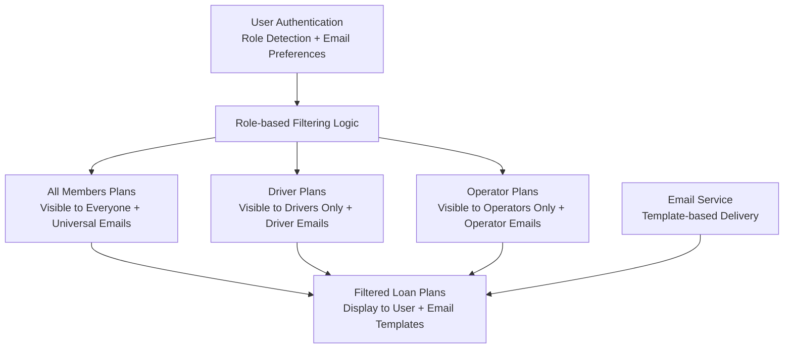
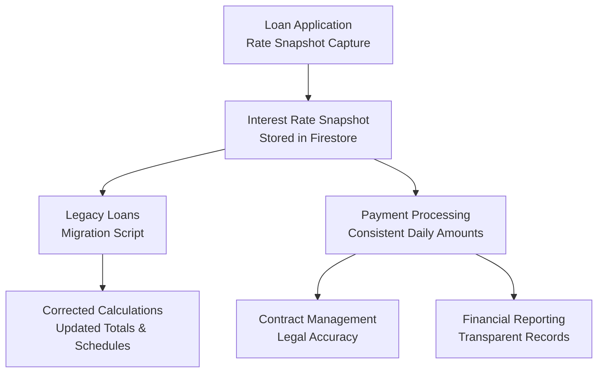
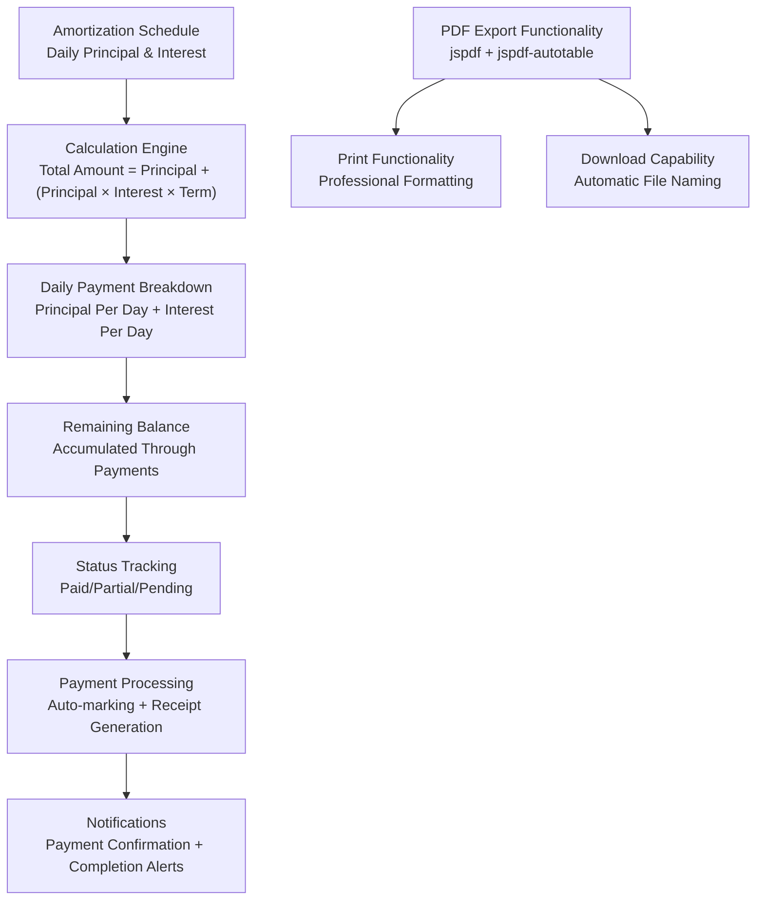

# Loan Management System

<cite>
**Referenced Files in This Document**
- [LoanPage.tsx](file://app/loan/page.tsx)
- [LoanActions.tsx](file://components/user/actions/LoanActions.tsx)
- [LoanApplicationModal.tsx](file://components/user/LoanApplicationModal.tsx)
- [LoanRequestsManager.tsx](file://components/admin/LoanRequestsManager.tsx)
- [LoanRequestsManagerRefactored.tsx](file://components/admin/LoanRequestsManagerRefactored.tsx)
- [LoanRequestDetailsModal.tsx](file://components/admin/LoanRequestDetailsModal.tsx)
- [LoanRequestsTable.tsx](file://components/admin/LoanRequestsTable.tsx)
- [LoanLayout.tsx](file://components/shared/LoanLayout.tsx)
- [ActiveLoans.tsx](file://components/user/ActiveLoans.tsx)
- [LoanRecords.tsx](file://components/user/LoanRecords.tsx)
- [PaginatedLoanRecords.tsx](file://components/admin/PaginatedLoanRecords.tsx)
- [LoanRecords.tsx](file://components/admin/LoanRecords.tsx)
- [LoanContractModal.tsx](file://components/admin/LoanContractModal.tsx)
- [ContractPreview.tsx](file://components/admin/ContractPreview.tsx)
- [ContractPositioningTool.tsx](file://components/admin/ContractPositioningTool.tsx)
- [LoanDetailsModal.tsx](file://components/admin/LoanDetailsModal.tsx)
- [transactionReceiptService.ts](file://lib/transactionReceiptService.ts)
- [emailService.ts](file://lib/emailService.ts)
- [certificateService.ts](file://lib/certificateService.ts)
- [useFirestoreData.ts](file://hooks/useFirestoreData.ts)
- [route.ts](file://app/api/loans/route.ts)
- [LoanTable.tsx](file://components/admin/LoanTable.tsx)
- [AddLoanPlanModal.tsx](file://components/admin/AddLoanPlanModal.tsx)
- [Pagination.tsx](file://components/admin/Pagination.tsx)
- [SecretaryLoansPage.tsx](file://app/admin/secretary/loans/page.tsx)
- [SecretaryLoanRequestsPage.tsx](file://app/admin/secretary/loans/requests/page.tsx)
- [SecretaryLoanRecordsPage.tsx](file://app/admin/secretary/loans/records/page.tsx)
- [ChairmanLoansPage.tsx](file://app/admin/chairman/loans/page.tsx)
- [ChairmanLoanRecordsPage.tsx](file://app/admin/chairman/loans/records/page.tsx)
- [ManagerLoansPage.tsx](file://app/admin/manager/loans/page.tsx)
- [TreasurerLoansPage.tsx](file://app/admin/treasurer/loans/page.tsx)
- [BODLoansPage.tsx](file://app/admin/bod/loans/page.tsx)
- [auth.tsx](file://lib/auth.tsx)
- [firebase.ts](file://lib/firebase.ts)
- [FIRESTORE_INDEXES.md](file://docs/FIRESTORE_INDEXES.md)
- [loan.ts](file://lib/types/loan.ts)
- [system.tsx](file://app/admin/settings/system/page.tsx)
- [route.ts](file://app/api/certificate/[memberId]/route.ts)
- [fix-loan-calculations.js](file://scripts/fix-loan-calculations.js)
</cite>

## Update Summary
**Changes Made**
- **Daily Amortization Model**: Complete transition from monthly to daily payment calculations with 30-day month approximation
- **Enhanced PDF Export Functionality**: New PDF generation capabilities for loan amortization schedules using jspdf and jspdf-autotable
- **Improved Administrative Interface**: Enhanced LoanDetailsModal with comprehensive payment tracking and export features
- **Advanced Payment Processing**: Sophisticated auto-marking logic with receipt number tracking and payment status management
- **Streamlined User Experience**: Simplified payment processing workflow with improved user feedback and status tracking

## Table of Contents
1. [Introduction](#introduction)
2. [Project Structure](#project-structure)
3. [Core Components](#core-components)
4. [Architecture Overview](#architecture-overview)
5. [Enhanced Tabbed Interface System](#enhanced-tabbed-interface-system)
6. [Advanced Loan Lifecycle Management](#advanced-loan-lifecycle-management)
7. [Enhanced Loan Request Management](#enhanced-loan-request-management)
8. [Enhanced Loan Application Process](#enhanced-loan-application-process)
9. [Role-Based Loan Plan Filtering](#role-based-loan-plan-filtering)
10. [Critical Interest Rate Calculation Improvements](#critical-interest-rate-calculation-improvements)
11. [Comprehensive Loan Contract Management](#comprehensive-loan-contract-management)
12. [Field Positioning and Customization Tools](#field-positioning-and-customization-tools)
13. [PDF Generation and Contract Creation](#pdf-generation-and-contract-creation)
14. [Certificate Integration](#certificate-integration)
15. [Enhanced Email Notification System](#enhanced-email-notification-system)
16. [Real-time Status Synchronization](#real-time-status-synchronization)
17. [Enhanced Loan Tracking and Monitoring](#enhanced-loan-tracking-and-monitoring)
18. [Automated Payment Processing](#automated-payment-processing)
19. [Administrative Loan Management](#administrative-loan-management)
20. [Performance Considerations](#performance-considerations)
21. [Troubleshooting Guide](#troubleshooting-guide)
22. [Conclusion](#conclusion)

## Introduction
This document describes the SAMPA Cooperative Management System's enhanced loan management functionality featuring a comprehensive tabbed interface system, improved loan application processes, sophisticated real-time status monitoring, advanced loan contract management capabilities, and comprehensive email notification system. The system now provides a unified platform for members to manage their loan applications, track active loans, and monitor completed loan history through an intuitive three-tab interface. A significant enhancement is the role-based loan plan filtering system that ensures members only see loan plans relevant to their membership category (Driver, Operator, or All Members). Additionally, the system now includes a comprehensive loan contract management system with field positioning tools, PDF generation capabilities, certificate integration, and an enhanced email notification system that automatically communicates loan approval and rejection decisions to applicants.

**Updated** The system now implements a daily amortization model replacing the previous monthly payment system, with sophisticated PDF export functionality for loan schedules, enhanced administrative capabilities for payment tracking, and improved user interface for loan details and payment monitoring.

## Project Structure
The loan management system is implemented as a Next.js application with role-based admin pages, shared React components, and enhanced loan contract management infrastructure. The enhanced structure supports seamless navigation between loan applications, active loans, and completed loan history, with intelligent role-based filtering of available loan plans, comprehensive contract management capabilities, and automated email notification workflows.

```mermaid
graph TB
subgraph "Enhanced Member Interface"
LOANPAGE["LoanPage.tsx<br/>Tabbed Interface + Role-based Filtering"]
LOANACTION["LoanActions.tsx<br/>Enhanced Modal + Verification"]
APPROVAL["Approval Flow<br/>Real-time Status Updates"]
ROLEFILTER["Role-based Filtering<br/>Driver/Operator/All Members"]
EMAILNOTIF["Email Notification System<br/>Approval/Rejection Emails"]
INTERESTSNAPSHOT["Interest Rate Snapshot<br/>Consistent Calculations"]
END
subgraph "Enhanced Admin Components"
REQUESTMAN["LoanRequestsManager.tsx<br/>Tabbed Admin Interface + Contract Management + Email Integration"]
REFMAN["LoanRequestsManagerRefactored.tsx<br/>Hook-based Implementation"]
DETAILSMODAL["LoanRequestDetailsModal.tsx<br/>Improved Interactions + Contract Preview"]
TABLECOMP["LoanRequestsTable.tsx<br/>Unified Admin View"]
PLANCONFIG["Loan Plan Config<br/>Applicable To Field"]
CONTRACTMODAL["LoanContractModal.tsx<br/>Contract Creation + PDF Generation"]
CONTRACTPREVIEW["ContractPreview.tsx<br/>Field Positioning + Template Rendering"]
POSITIONTOOL["ContractPositioningTool.tsx<br/>Custom Field Positioning"]
CERTIFICATE["Certificate Integration<br/>PDF Generation + Email Notification"]
EMAILSERVICE["EmailService.ts<br/>Dedicated Templates + Configuration"]
FIXSCRIPT["Fix Loan Calculations<br/>Legacy Data Migration"]
END
subgraph "Enhanced Tracking Components"
LOANDETAILSMODAL["LoanDetailsModal.tsx<br/>Enhanced Amortization + Payment Tracking + PDF Export"]
ACTIVELOANS["ActiveLoans.tsx<br/>Detailed Payment Schedule + Auto-marking"]
PAYMENTPROCESSING["Payment Processing<br/>Auto-marking + Receipt Generation"]
REMBALANCE["Remaining Balance<br/>Multiple Calculation Methods"]
AMORTIZATION["Amortization Schedule<br/>Daily Payment Breakdown"]
PDFEXPORT["PDF Export Functionality<br/>jspdf + jspdf-autotable"]
END
subgraph "Supporting Components"
LAYOUT["LoanLayout.tsx<br/>Responsive Layout"]
ACTIVE["ActiveLoans.tsx<br/>Enhanced Tracking"]
RECORDS["LoanRecords.tsx<br/>Historical Tracking"]
TYPES["Loan Types<br/>Role Enum Support"]
HOOKS["useFirestoreData.ts<br/>Custom Hooks + Performance"]
END
REQUESTMAN --> DETAILSMODAL
REQUESTMAN --> TABLECOMP
REQUESTMAN --> CONTRACTMODAL
REQUESTMAN --> EMAILSERVICE
REFMAN --> HOOKS
CONTRACTMODAL --> CONTRACTPREVIEW
CONTRACTMODAL --> POSITIONTOOL
DETAILSMODAL --> CONTRACTPREVIEW
DETAILSMODAL --> AMORTIZATION
DETAILSMODAL --> PDFEXPORT
ACTIVELOANS --> REMBALANCE
PAYMENTPROCESSING --> REMBALANCE
PAYMENTPROCESSING --> AMORTIZATION
PLANCONFIG --> TYPES
CERTIFICATE --> REQUESTMAN
EMAILSERVICE --> APPROVAL
EMAILSERVICE --> REJECTION
FIXSCRIPT --> INTERESTSNAPSHOT
```

**Diagram sources**
- [LoanPage.tsx:156-182](file://app/loan/page.tsx#L156-L182)
- [LoanActions.tsx:1-663](file://components/user/actions/LoanActions.tsx#L1-L663)
- [LoanRequestsManager.tsx:68-200](file://components/admin/LoanRequestsManager.tsx#L68-L200)
- [LoanRequestsManagerRefactored.tsx:1-224](file://components/admin/LoanRequestsManagerRefactored.tsx#L1-L224)
- [LoanContractModal.tsx:1-404](file://components/admin/LoanContractModal.tsx#L1-L404)
- [ContractPreview.tsx:1-177](file://components/admin/ContractPreview.tsx#L1-L177)
- [ContractPositioningTool.tsx:1-327](file://components/admin/ContractPositioningTool.tsx#L1-L327)
- [LoanDetailsModal.tsx:103-156](file://components/admin/LoanDetailsModal.tsx#L103-L156)
- [ActiveLoans.tsx:136-204](file://components/user/ActiveLoans.tsx#L136-L204)
- [loan.ts:8](file://lib/types/loan.ts#L8)
- [emailService.ts:1-389](file://lib/emailService.ts#L1-L389)
- [useFirestoreData.ts:1-182](file://hooks/useFirestoreData.ts#L1-L182)
- [fix-loan-calculations.js:1-68](file://scripts/fix-loan-calculations.js#L1-L68)

## Core Components
- **LoanPage**: Enhanced main interface featuring three-tab navigation (My Loan Applications, Active Loans, Completed Loans) with real-time status synchronization, role-based loan plan filtering, and enhanced user interaction patterns.
- **LoanActions**: Streamlined loan application component with integrated verification modal, amortization scheduling, role-aware plan selection, and enhanced user feedback mechanisms.
- **LoanRequestsManager**: Comprehensive admin interface with tabbed organization for pending, approved, and rejected loan requests, supporting real-time updates, role-based filtering, enhanced modal interactions including contract management, and integrated email notification system.
- **LoanRequestsManagerRefactored**: Hook-based implementation using custom Firestore data hooks that eliminate composite index requirements while maintaining real-time updates and improved performance.
- **LoanRequestDetailsModal**: Enhanced modal component with improved user interactions, rejection reason handling, role-aware approval processes, streamlined approval procedures, contract preview functionality, and email notification integration.
- **LoanContractModal**: New comprehensive component for creating loan contracts with field positioning tools, PDF generation capabilities, and certificate integration workflow.
- **ContractPreview**: Component for rendering loan contract templates with field positioning, currency formatting, and responsive design.
- **ContractPositioningTool**: Interactive tool for customizing field positions on loan contracts with drag-and-drop functionality and real-time preview.
- **LoanDetailsModal**: Enhanced modal component with comprehensive amortization schedule display, detailed payment breakdowns, remaining balance calculations, enhanced financial metrics presentation, and new PDF export functionality.
- **ActiveLoans**: Enhanced component with detailed payment schedule visualization, auto-payment marking, remaining balance tracking, and improved user interaction patterns.
- **LoanLayout**: Responsive layout component providing collapsible sidebar navigation, role-based content filtering, and consistent styling across loan management pages.
- **LoanPlan Types**: Enhanced type definitions supporting the 'applicableTo' field with 'Driver', 'Operator', and 'All Members' enum values for role-based filtering.
- **EmailService**: Comprehensive email service with dedicated templates for loan approvals and rejections, EmailJS integration, and automated notification workflows.
- **useFirestoreData**: Custom hooks for Firestore data management with client-side sorting, real-time updates, and performance optimization.
- **Fix Loan Calculations Script**: Migration script for correcting legacy loan calculations that were previously computed with incorrect formulas.

**Section sources**
- [LoanPage.tsx:15-101](file://app/loan/page.tsx#L15-L101)
- [LoanActions.tsx:15-60](file://components/user/actions/LoanActions.tsx#L15-L60)
- [LoanRequestsManager.tsx:68-98](file://components/admin/LoanRequestsManager.tsx#L68-L98)
- [LoanRequestsManagerRefactored.tsx:14-224](file://components/admin/LoanRequestsManagerRefactored.tsx#L14-L224)
- [LoanRequestDetailsModal.tsx:42-74](file://components/admin/LoanRequestDetailsModal.tsx#L42-L74)
- [LoanContractModal.tsx:11-26](file://components/admin/LoanContractModal.tsx#L11-L26)
- [ContractPreview.tsx:29-37](file://components/admin/ContractPreview.tsx#L29-L37)
- [ContractPositioningTool.tsx:31-36](file://components/admin/ContractPositioningTool.tsx#L31-L36)
- [LoanDetailsModal.tsx:103-156](file://components/admin/LoanDetailsModal.tsx#L103-L156)
- [ActiveLoans.tsx:136-204](file://components/user/ActiveLoans.tsx#L136-L204)
- [loan.ts:8](file://lib/types/loan.ts#L8)
- [emailService.ts:1-389](file://lib/emailService.ts#L1-L389)
- [useFirestoreData.ts:19-182](file://hooks/useFirestoreData.ts#L19-L182)
- [fix-loan-calculations.js:1-68](file://scripts/fix-loan-calculations.js#L1-L68)

## Architecture Overview
The system follows a modular architecture with enhanced real-time synchronization, role-based filtering, comprehensive contract management, certificate integration, and comprehensive email notification system:

- **Presentation Layer**: Three-tab interface for loan applications, active loans, and completed loans with responsive design, real-time updates, and role-based content filtering.
- **Business Logic Layer**: Enhanced loan application processing with verification workflows, amortization calculations, status management, role-aware plan selection, contract creation workflows, and automated email notification processing.
- **Data Access Layer**: Firebase Firestore integration with real-time listeners, role-based query filtering, improved data synchronization patterns, contract template storage, and email configuration management.
- **Administration Layer**: Comprehensive loan request management with role-based access, enhanced modal interactions, configurable loan plan filtering, contract management capabilities, and integrated email notification workflows.
- **Contract Management Layer**: New infrastructure for loan contract creation, field positioning, PDF generation, and certificate integration with html2canvas and jsPDF libraries.
- **Email Notification Layer**: Comprehensive email service with dedicated templates for loan approvals and rejections, EmailJS integration, automated notification workflows, and member communication automation.
- **Interest Rate Management Layer**: Critical enhancement ensuring interest rates are captured as snapshots at application time to prevent calculation discrepancies.
- **Payment Processing Layer**: Enhanced payment processing with auto-marking logic, detailed payment tracking, remaining balance calculations, and comprehensive receipt generation.
- **Amortization Calculation Layer**: Sophisticated amortization schedule calculations with daily payment breakdowns, principal and interest separation, and enhanced financial transparency.
- **PDF Export Layer**: New functionality for generating professional PDF documents from loan amortization schedules with jspdf and jspdf-autotable libraries.
- **User Experience Layer**: Streamlined application process with integrated verification, role-aware plan selection, enhanced contract creation workflow, improved user feedback mechanisms, and automated email notifications.
- **Performance Layer**: Custom hooks and optimized data fetching with client-side sorting, real-time updates without composite indexes, and improved user experience.

```mermaid
graph TB
MEMBER["Member Interface<br/>Three-tab Navigation + Role Filtering + Email Notifications"] --> LOANPAGE["LoanPage.tsx"]
MEMBER --> LOANACTION["LoanActions.tsx"]
MEMBER --> ROLEFILTER["Role-based Filtering Logic"]
MEMBER --> INTERESTSNAPSHOT["Interest Rate Snapshots<br/>Consistent Calculations"]
MEMBER --> ACTIVELOANS["ActiveLoans.tsx<br/>Enhanced Payment Tracking"]
ADMIN["Admin Interface<br/>Tabbed Management + Contract Management + Email Integration"] --> REQUESTMAN["LoanRequestsManager.tsx"]
ADMIN --> REFMAN["LoanRequestsManagerRefactored.tsx"]
ADMIN --> DETAILSMODAL["LoanRequestDetailsModal.tsx"]
ADMIN --> CONTRACTMODAL["LoanContractModal.tsx"]
ADMIN --> EMAILSERVICE["EmailService.ts"]
ADMIN --> FIXSCRIPT["Fix Loan Calculations Script"]
REQUESTMAN --> DETAILSMODAL
REQUESTMAN --> CONTRACTMODAL
REQUESTMAN --> EMAILSERVICE
REFMAN --> HOOKS["useFirestoreData.ts"]
CONTRACTMODAL --> CONTRACTPREVIEW["ContractPreview.tsx"]
CONTRACTMODAL --> POSITIONTOOL["ContractPositioningTool.tsx"]
DETAILSMODAL --> CONTRACTPREVIEW
DETAILSMODAL --> AMORTIZATION["Enhanced Amortization<br/>Daily Payment Breakdown"]
DETAILSMODAL --> PDFEXPORT["PDF Export Functionality<br/>jspdf + jspdf-autotable"]
ACTIVELOANS --> AMORTIZATION
ACTIVELOANS --> REMBALANCE["Remaining Balance<br/>Multiple Calculation Methods"]
PAYMENTPROCESSING["Payment Processing<br/>Auto-marking + Receipt Generation"] --> REMBALANCE
PAYMENTPROCESSING --> AMORTIZATION
PLANCONFIG --> TYPES["Loan Types with Role Enums"]
CERTIFICATE --> REQUESTMAN
EMAILSERVICE --> APPROVAL["Loan Approval Emails"]
EMAILSERVICE --> REJECTION["Loan Rejection Emails"]
EMAILSERVICE --> CONFIG["EmailJS Configuration"]
FIXSCRIPT --> INTERESTSNAPSHOT
INTERESTSNAPSHOT --> CALCULATIONS["Accurate Payment Calculations"]
```



**Diagram sources**
- [LoanPage.tsx:156-182](file://app/loan/page.tsx#L156-L182)
- [LoanActions.tsx:44-58](file://components/user/actions/LoanActions.tsx#L44-L58)
- [LoanRequestsManager.tsx:164-225](file://components/admin/LoanRequestsManager.tsx#L164-L225)
- [LoanRequestsManagerRefactored.tsx:25-42](file://components/admin/LoanRequestsManagerRefactored.tsx#L25-L42)
- [LoanContractModal.tsx:1-404](file://components/admin/LoanContractModal.tsx#L1-L404)
- [ContractPreview.tsx:1-177](file://components/admin/ContractPreview.tsx#L1-L177)
- [ContractPositioningTool.tsx:1-327](file://components/admin/ContractPositioningTool.tsx#L1-L327)
- [LoanDetailsModal.tsx:103-156](file://components/admin/LoanDetailsModal.tsx#L103-L156)
- [ActiveLoans.tsx:136-204](file://components/user/ActiveLoans.tsx#L136-L204)
- [loan.ts:8](file://lib/types/loan.ts#L8)
- [emailService.ts:1-389](file://lib/emailService.ts#L1-L389)
- [useFirestoreData.ts:154-165](file://hooks/useFirestoreData.ts#L154-L165)
- [fix-loan-calculations.js:1-68](file://scripts/fix-loan-calculations.js#L1-L68)

## Enhanced Tabbed Interface System
The system now features a comprehensive three-tab interface for seamless loan management with enhanced role-based filtering and email notification capabilities:

### Tab Navigation Architecture
- **My Loan Applications Tab**: Displays all submitted loan applications with status indicators, detailed information, role-aware plan filtering, and real-time email status updates
- **Active Loans Tab**: Shows currently active and approved loans with payment tracking, loan details, role-specific loan information, and automated payment notification emails
- **Completed Loans Tab**: Provides historical record of paid-off loans with summary information, completion status, archival management, and certificate generation notifications

### Real-time Status Synchronization
- **Live Updates**: Firebase real-time listeners provide instant updates to loan status across all tabs with role-based filtering and email notification triggers
- **Automatic Refresh**: Components automatically refresh when user authentication state changes, role updates, loan status updates, or email configuration changes
- **Status Consistency**: Unified status indicators ensure consistent loan status representation across all tabs with role-aware filtering and email notification status

### Enhanced User Experience
- **Responsive Design**: Mobile-friendly tab navigation with appropriate spacing and touch targets, role-aware content presentation, and email notification badges
- **Visual Feedback**: Active tab highlighting with red accent color, hover effects, role-based content indicators, and email notification status indicators
- **Loading States**: Appropriate loading indicators during data fetching, role-based filtering, status updates, and email notification processing

**Section sources**
- [LoanPage.tsx:456-492](file://app/loan/page.tsx#L456-L492)
- [LoanPage.tsx:497-837](file://app/loan/page.tsx#L497-L837)

## Advanced Loan Lifecycle Management
The enhanced system provides comprehensive loan lifecycle management through integrated tracking, status monitoring, role-based filtering, contract management, and automated email notifications:

### Loan Application Tracking
- **Application Status**: Real-time tracking of loan application status (pending, approved, rejected) with role-aware filtering and email notification triggers
- **Application Details**: Comprehensive information display including loan plan, amount, term, application date, role-specific plan availability, and email notification history
- **Application History**: Complete history of submitted applications with pagination support, role-based plan visibility, and email communication logs

### Active Loan Management
- **Active Status Tracking**: Real-time monitoring of active loans with payment status indicators, role-specific loan information, and automated payment reminder emails
- **Loan Details**: Complete loan information including principal amount, interest rate snapshot, loan term, current status, role-based plan details, and payment schedule notifications
- **Enhanced Payment Scheduling**: Detailed payment schedule with daily payment breakdown, remaining balance tracking, role-aware payment processing, and automated payment confirmation emails
- **Contract Management**: Integrated loan contract creation and management with field positioning tools, PDF generation, and certificate integration workflow

### Completed Loan History
- **Completion Tracking**: Historical record of completed loans with total paid amounts, completion dates, role-based archival management, and final settlement notification emails
- **Summary Information**: Compact display of loan summary with key metrics, completion status, role-specific loan categorization, and certificate availability notifications
- **Archival Management**: Organized storage of completed loan information for future reference with role-based access controls and certificate download notifications

**Section sources**
- [LoanPage.tsx:510-607](file://app/loan/page.tsx#L510-L607)
- [LoanPage.tsx:625-721](file://app/loan/page.tsx#L625-L721)
- [LoanPage.tsx:738-836](file://app/loan/page.tsx#L738-L836)

## Enhanced Loan Request Management
The administrative loan request management system has been significantly enhanced with role-based filtering, comprehensive contract management, and integrated email notification system:

### Tabbed Admin Interface
- **Pending Requests Tab**: Dedicated tab for managing pending loan requests with immediate action buttons, role-aware filtering, contract creation workflow, and email notification preparation
- **Approved Requests Tab**: Organization of approved loan requests with approval timestamps, details, role-based categorization, contract preview functionality, and certificate generation notifications
- **Rejected Requests Tab**: Comprehensive management of rejected loan requests with rejection reasons, timestamps, role-specific analysis, and rejection notification emails

### Enhanced Modal Interactions
- **Streamlined Approvals**: Direct approval process from modal without page reload requirements, with role-aware plan validation, contract creation workflow, and automated approval email notifications
- **Improved Rejection Handling**: Integrated rejection reason input with validation, confirmation, role-based rejection tracking, and automated rejection email notifications
- **Detailed Information Display**: Comprehensive loan request details with user information, role-specific loan plan details, loan specifications, contract management options, and email communication history
- **Contract Preview**: Integrated contract preview functionality for approved loan requests with field positioning and template customization

### Real-time Data Synchronization
- **Live Status Updates**: Real-time updates to loan request status across all admin tabs with role-based filtering and email notification triggers
- **Instant Notifications**: Immediate visual feedback for approval and rejection actions with role-aware notifications and email delivery status
- **Client-side Sorting**: Efficient client-side sorting and filtering for large datasets with role-based categorization and email notification status

### Email Notification Integration
- **Automated Approval Emails**: Automatic email notifications sent to applicants upon loan approval with detailed loan information and next steps
- **Automated Rejection Emails**: Automatic email notifications sent to applicants upon loan rejection with rejection reason and appeal information
- **Email Configuration**: Centralized EmailJS configuration management with template-based email delivery and error handling
- **Notification Logging**: Comprehensive logging of email delivery attempts, success/failure status, and recipient information

**Section sources**
- [LoanRequestsManager.tsx:68-98](file://components/admin/LoanRequestsManager.tsx#L68-L98)
- [LoanRequestDetailsModal.tsx:42-74](file://components/admin/LoanRequestDetailsModal.tsx#L42-L74)
- [LoanRequestsManager.tsx:164-225](file://components/admin/LoanRequestsManager.tsx#L164-L225)
- [emailService.ts:249-318](file://lib/emailService.ts#L249-L318)

## Enhanced Loan Application Process
The loan application process has been streamlined with improved user interactions, verification workflows, role-aware plan selection, comprehensive contract management, and automated email notifications:

### Integrated Application Workflow
- **Role-aware Plan Selection**: Seamless loan plan selection with detailed information display filtered by user role (Driver, Operator, or All Members) and email notification preferences
- **Amount Tile Selection**: Dynamic amount selection with percentage-based options and role-specific maximum limits with email notification triggers
- **Term Selection**: Flexible term selection with validation, user feedback, and role-based term availability with email notification timing
- **Verification Process**: Comprehensive verification modal with amortization schedule preview, role-aware plan details, and automated application submission notifications

### Enhanced Verification System
- **Amortization Preview**: Detailed daily payment schedule with principal and interest breakdown and role-specific payment calculations with email notification formatting
- **Total Cost Display**: Clear presentation of total interest and total repayment amounts with role-based plan pricing and email notification cost breakdown
- **Confirmation Workflow**: Secure confirmation process with user acknowledgment requirements, role-aware plan validation, and automated application submission email notifications
- **Loading States**: Appropriate loading indicators during application submission, processing, role-based plan filtering, and email notification delivery

### Real-time Application Status
- **Immediate Feedback**: Instant status updates after application submission with role-aware status tracking and email notification delivery
- **Notification System**: Automated notifications for application status changes with role-specific messaging and email delivery confirmation
- **Status Tracking**: Real-time tracking of application status through approval process with role-based filtering and email notification status

**Section sources**
- [LoanActions.tsx:15-60](file://components/user/actions/LoanActions.tsx#L15-L60)
- [LoanActions.tsx:108-134](file://components/user/actions/LoanActions.tsx#L108-L134)
- [LoanActions.tsx:136-292](file://components/user/actions/LoanActions.tsx#L136-L292)

## Role-Based Loan Plan Filtering
The system now implements sophisticated role-based filtering for loan plan visibility with enhanced email notification capabilities:

### Role Detection and Normalization
- **User Role Detection**: Automatic detection of user roles (Driver, Operator, or Member) from authentication context with email notification preferences
- **Role Normalization**: Case-insensitive role normalization with whitespace trimming for consistent filtering and email delivery
- **Role Validation**: Boolean validation for role membership (isDriver, isOperator) for precise filtering logic and role-specific email templates

### Dynamic Filtering Logic
- **All Members Plans**: Loan plans with 'All Members' applicableTo field are displayed to all users regardless of role with universal email notification capability
- **Driver-specific Plans**: Loan plans with 'Driver' applicableTo field are only visible to users with Driver role with driver-specific email templates
- **Operator-specific Plans**: Loan plans with 'Operator' applicableTo field are only visible to users with Operator role with operator-specific email templates
- **Default Behavior**: Plans without applicableTo field default to 'All Members' visibility with standard email notification templates

### Implementation Architecture
- **Client-side Filtering**: Real-time filtering of loan plans based on user role during component initialization with email preference detection
- **Sample Plan Creation**: Automatic creation of sample loan plans when no plans exist, with 'All Members' applicability and default email templates
- **Error Handling**: Graceful handling of role detection failures and empty plan sets with user-friendly messaging and email notification fallbacks



**Diagram sources**
- [LoanPage.tsx:156-182](file://app/loan/page.tsx#L156-L182)
- [LoanPage.tsx:184-187](file://app/loan/page.tsx#L184-L187)
- [emailService.ts:1-389](file://lib/emailService.ts#L1-L389)

**Section sources**
- [LoanPage.tsx:156-182](file://app/loan/page.tsx#L156-L182)
- [LoanPage.tsx:184-187](file://app/loan/page.tsx#L184-L187)
- [loan.ts:8](file://lib/types/loan.ts#L8)

## Critical Interest Rate Calculation Improvements

**Updated** The system now implements critical improvements to ensure consistency and accuracy in interest rate calculations by storing interest rates as snapshots at the time of loan application, preventing discrepancies if administrators modify loan plans later.

### Interest Rate Snapshot Storage
- **Application-time Capture**: Interest rates are captured and stored as snapshots when loan applications are submitted, ensuring historical accuracy regardless of future plan modifications
- **Loan Request Enhancement**: The LoanRequest interface now includes an optional interestRate field that stores the rate applicable at application time
- **Admin Interface Integration**: LoanRequestsManager displays stored interest rates for approved and rejected requests, maintaining calculation consistency

### Legacy Data Correction
- **Migration Script**: A comprehensive script (fix-loan-calculations.js) has been implemented to correct existing loan calculations that were computed with incorrect formulas
- **Formula Correction**: The script converts from the old incorrect formula (interest = amount × (rate/100)) to the correct formula (interest = amount × (rate/100) × term)
- **Batch Processing**: The script processes all existing loans, recalculating correct totals and updating payment schedules while preserving historical data integrity

### Calculation Consistency
- **Payment Processing**: All payment calculations consistently use the stored interest rate snapshot, ensuring accurate daily payment amounts throughout the loan term
- **Contract Management**: Approved loan contracts reference the original interest rate snapshot, maintaining legal and financial accuracy
- **Reporting Accuracy**: Historical reporting reflects the actual rates that applied at loan origination, providing transparent financial records

### Implementation Details
- **Data Model Enhancement**: LoanRequest interface extended to include interestRate field for snapshot storage
- **API Integration**: Loan creation APIs capture and store interest rate snapshots alongside application data
- **Frontend Display**: Loan details pages display the stored interest rate snapshot for transparency and accuracy



**Diagram sources**
- [LoanRequestsManager.tsx:52](file://components/admin/LoanRequestsManager.tsx#L52)
- [fix-loan-calculations.js:20-68](file://scripts/fix-loan-calculations.js#L20-L68)
- [LoanTable.tsx:97-112](file://components/admin/LoanTable.tsx#L97-L112)

**Section sources**
- [LoanRequestsManager.tsx:52](file://components/admin/LoanRequestsManager.tsx#L52)
- [fix-loan-calculations.js:1-68](file://scripts/fix-loan-calculations.js#L1-L68)
- [LoanTable.tsx:97-112](file://components/admin/LoanTable.tsx#L97-L112)

## Comprehensive Loan Contract Management
The system now includes a comprehensive loan contract management system with advanced field positioning tools, PDF generation capabilities, and integrated email notification workflows:

### Contract Creation Workflow
- **LoanContractModal**: Central component for creating loan contracts with field positioning tools, PDF generation, certificate integration, and email notification preparation
- **Contract Preview**: Real-time preview of loan contracts with field positioning and template customization with email template integration
- **Field Positioning Tools**: Interactive tools for customizing field positions on loan contracts with drag-and-drop functionality and email notification triggers
- **PDF Generation**: High-quality PDF generation using html2canvas and jsPDF libraries with letter-size formatting and email attachment capabilities

### Contract Template Management
- **Template Rendering**: Dynamic rendering of loan contract templates with field overlays and positioning with email template formatting
- **Field Positioning Persistence**: Storage of field positions in Firestore for consistent contract formatting across the system with email notification preferences
- **Template Customization**: Ability to customize field positions, fonts, and sizes for different contract requirements with role-specific email templates
- **Responsive Design**: Adaptive contract rendering that maintains proportions across different screen sizes with email notification compatibility

### Integration with Loan Approval Process
- **Approval Workflow Integration**: Seamless integration between loan approval and contract creation processes with email notification triggers
- **Contract Completion Tracking**: Automatic tracking of contract completion and loan approval status with email delivery confirmation
- **Certificate Generation**: Integration with certificate generation workflow for member certificates with email notification delivery
- **Email Notifications**: Automated email notifications for contract completion and loan approval with delivery status tracking

**Section sources**
- [LoanContractModal.tsx:1-404](file://components/admin/LoanContractModal.tsx#L1-L404)
- [ContractPreview.tsx:1-177](file://components/admin/ContractPreview.tsx#L1-L177)
- [ContractPositioningTool.tsx:1-327](file://components/admin/ContractPositioningTool.tsx#L1-L327)

## Field Positioning and Customization Tools
The system provides sophisticated field positioning and customization tools for loan contract management with integrated email notification capabilities:

### ContractPositioningTool Component
- **Interactive Drag-and-Drop**: Intuitive drag-and-drop interface for positioning contract fields with visual feedback and email template compatibility
- **Real-time Preview**: Live preview of field positions with real-time updates during customization and email notification formatting
- **Property Controls**: Fine-tuning controls for field positioning, width, and font size with slider-based adjustments and email notification preferences
- **Field Selection**: Individual field selection and editing with property panels and validation with email template integration

### ContractPreview Component
- **Template Rendering**: High-fidelity rendering of loan contract templates with field overlays and email notification formatting
- **Position Mapping**: Accurate mapping of field positions from pixel coordinates to percentage-based positioning with email template compatibility
- **Font Scaling**: Dynamic font sizing that adapts to container dimensions and maintains readability with email notification formatting
- **Responsive Design**: Adaptive layout that maintains proportions across different screen sizes and resolutions with email notification compatibility

### Field Position Management
- **Default Positioning**: Predefined field positions for standard contract layouts with customizable defaults and email template preferences
- **Position Persistence**: Storage of field positions in Firestore for consistent formatting across the system with email notification preferences
- **Position Validation**: Validation of field positions to ensure they remain within template boundaries with email template compatibility
- **Export Functionality**: Code export feature for easy integration of field positions into contract templates with email notification integration

**Section sources**
- [ContractPositioningTool.tsx:1-327](file://components/admin/ContractPositioningTool.tsx#L1-L327)
- [ContractPreview.tsx:1-177](file://components/admin/ContractPreview.tsx#L1-L177)

## PDF Generation and Contract Creation
The system includes sophisticated PDF generation capabilities for loan contracts with high-quality output, seamless integration, and email notification workflows:

### PDF Generation Process
- **html2canvas Integration**: High-quality canvas rendering of contract templates with preserved formatting and positioning with email attachment capabilities
- **jsPDF Integration**: Professional PDF generation with letter-size formatting (216mm x 279mm) and full-page coverage with email notification integration
- **Quality Scaling**: High-resolution scaling (scale factor of 2) for crisp text and graphics in generated PDFs with email delivery optimization
- **File Naming**: Automatic file naming with borrower name and date for organized document management with email attachment naming

### Contract Creation Workflow
- **Template Loading**: Dynamic loading of contract templates with proper aspect ratio maintenance and email notification formatting
- **Field Overlay**: Precise overlay of contract fields with accurate positioning and formatting with email template integration
- **Currency Formatting**: Automatic currency formatting with Philippine Peso symbol and proper decimal places with email notification formatting
- **Date Formatting**: Standardized date formatting (mm/dd/yyyy) for contract fields with email notification date formatting

### Quality Assurance
- **Error Handling**: Comprehensive error handling for PDF generation failures with user-friendly error messages and email notification fallbacks
- **Loading States**: Appropriate loading indicators during PDF generation process with progress feedback and email notification status
- **Success Notifications**: Immediate success notifications with download prompts upon completion and email delivery confirmation
- **Fallback Mechanisms**: Graceful fallback handling for edge cases and browser compatibility issues with email notification alternatives

**Section sources**
- [LoanContractModal.tsx:120-166](file://components/admin/LoanContractModal.tsx#L120-L166)
- [ContractPreview.tsx:91-102](file://components/admin/ContractPreview.tsx#L91-L102)

## Certificate Integration
The system integrates with certificate generation services for comprehensive cooperative management with automated email notifications:

### Certificate Generation Workflow
- **Share Certificate Service**: Integration with certificateService.ts for generating share certificates with official formatting and email notification delivery
- **PDF Generation**: Professional PDF generation with cooperative branding, official seals, and legal text with email attachment capabilities
- **Email Notification**: Automated email notifications with certificate download links for member communication and delivery confirmation
- **Database Storage**: Secure storage of certificate data in Firestore with member-specific organization and email notification tracking

### Certificate Features
- **Official Formatting**: Compliance with cooperative regulations with proper legal text and official seals with email notification formatting
- **Member Information**: Dynamic inclusion of member details, share capital, and cooperative information with email notification personalization
- **Date Formatting**: Proper date formatting and legal compliance for certificate validity with email notification date formatting
- **Multi-format Support**: Support for both inline viewing and download of certificate PDFs with email attachment delivery

### Integration Points
- **Loan Approval Integration**: Certificate generation triggered by loan approval processes with email notification delivery
- **Member Onboarding**: Certificate creation during member registration and share purchase processes with email notification workflows
- **Automated Workflows**: Integration with email services for automated certificate delivery and notification tracking
- **Audit Trail**: Comprehensive logging of certificate generation activities for compliance purposes with email delivery logs

**Section sources**
- [certificateService.ts:1-410](file://lib/certificateService.ts#L1-L410)
- [route.ts:1-68](file://app/api/certificate/[memberId]/route.ts#L1-L68)

## Enhanced Email Notification System
The system now includes a comprehensive email notification system with dedicated templates for loan approvals and rejections, EmailJS integration, and automated communication workflows:

### Email Service Architecture
- **EmailJS Integration**: Centralized EmailJS configuration management with Firestore-backed settings and environment variable fallbacks
- **Template-based Delivery**: Dedicated email templates for loan approvals, rejections, member registration, and payment notifications
- **Configuration Management**: Dynamic email configuration retrieval with caching and error handling for reliable email delivery
- **Error Handling**: Comprehensive error handling for email delivery failures with retry mechanisms and user notification

### Loan Approval Notifications
- **Approval Email Templates**: Dedicated email templates for loan approval notifications with detailed loan information and next steps
- **Automated Delivery**: Automatic email delivery upon loan approval with member email address retrieval and template personalization
- **Content Formatting**: Professional email formatting with loan details, payment schedule, and cooperative information
- **Delivery Tracking**: Email delivery status tracking with success/failure logging and retry mechanisms

### Loan Rejection Notifications
- **Rejection Email Templates**: Dedicated email templates for loan rejection notifications with rejection reason and appeal information
- **Automated Delivery**: Automatic email delivery upon loan rejection with member email address retrieval and template personalization
- **Content Formatting**: Professional email formatting with rejection details, reasons, and appeal process information
- **Delivery Tracking**: Email delivery status tracking with success/failure logging and user notification

### Email Configuration Management
- **Centralized Configuration**: Single source of truth for EmailJS configuration with Firestore-backed settings
- **Environment Fallbacks**: Environment variable fallbacks for server-side rendering and development environments
- **Cache Management**: Intelligent caching of email configuration with automatic refresh and error handling
- **Security**: Secure handling of EmailJS credentials with environment variable protection

### Integration with Loan Management
- **Approval Workflows**: Seamless integration between loan approval and email notification delivery with status synchronization
- **Rejection Workflows**: Seamless integration between loan rejection and email notification delivery with status synchronization
- **Error Handling**: Comprehensive error handling for email delivery failures with user-friendly error messages and retry mechanisms
- **Logging**: Comprehensive logging of email delivery attempts, success/failure status, and recipient information for audit trails

**Section sources**
- [emailService.ts:1-389](file://lib/emailService.ts#L1-L389)
- [LoanRequestsManager.tsx:438-453](file://components/admin/LoanRequestsManager.tsx#L438-L453)
- [LoanRequestsManager.tsx:536-557](file://components/admin/LoanRequestsManager.tsx#L536-L557)

## Real-time Status Synchronization
The system implements sophisticated real-time synchronization for enhanced user experience with role-based filtering and comprehensive email notification workflows:

### Multi-Collection Real-time Listeners
- **Active Loans Listener**: Real-time monitoring of active loan status with automatic updates, role-based filtering, and email notification triggers
- **Pending Requests Listener**: Live tracking of pending loan application status with role-aware plan availability and email delivery status
- **Complete Loans Listener**: Real-time updates to loan history and completed loan status with role-based archival and certificate notification workflows
- **Contract Management Listener**: Real-time updates to contract creation and approval status across the system with email notification integration

### Status Update Mechanisms
- **Automatic Detection**: Instant detection of loan status changes through Firestore listeners with role-based filtering and email notification triggers
- **State Synchronization**: Consistent state updates across all loan-related components with role-aware data presentation and email delivery status
- **Error Handling**: Robust error handling with user-friendly error messages, recovery mechanisms, and role-based error reporting with email notification fallbacks

### Enhanced User Feedback
- **Loading States**: Appropriate loading indicators during real-time data fetching, role-based filtering, status updates, and email notification processing
- **Success Notifications**: Immediate feedback for successful status updates with role-aware success messaging and email delivery confirmation
- **Error Communication**: Clear error messages with actionable solutions for synchronization failures, role-based access issues, and email delivery problems

**Section sources**
- [LoanPage.tsx:55-101](file://app/loan/page.tsx#L55-L101)
- [LoanPage.tsx:103-144](file://app/loan/page.tsx#L103-L144)
- [LoanRequestsManager.tsx:164-225](file://components/admin/LoanRequestsManager.tsx#L164-L225)

## Enhanced Loan Tracking and Monitoring
The system provides comprehensive loan tracking capabilities through enhanced components with role-based filtering and integrated email notification workflows:

### Active Loan Monitoring
- **Real-time Tracking**: Live monitoring of active loan status and payment progress with role-aware plan details and automated payment notification emails
- **Enhanced Payment Schedule Tracking**: Detailed tracking of daily payment schedules with balance updates, role-based payment processing, and automated payment confirmation emails
- **Status Indicators**: Color-coded status indicators for quick loan status identification with role-specific status categories and email notification status
- **Contract Tracking**: Integration with contract management for tracking contract creation and approval status with email notification triggers

### Historical Loan Tracking
- **Loan History Management**: Comprehensive tracking of completed loan history with role-based archival, categorization, and certificate generation notifications
- **Archival Storage**: Organized storage of loan information for future reference and reporting with role-based access controls and certificate download notifications
- **Search and Filter**: Enhanced search and filtering capabilities for loan history management with role-based categorization and email communication logs

### Enhanced User Interface
- **Responsive Design**: Mobile-friendly loan tracking interface with appropriate spacing, touch targets, role-aware content presentation, and email notification badges
- **Visual Progression**: Clear visual indicators of loan progress and completion status with role-based progress tracking and email delivery status
- **Detailed Information**: Comprehensive loan information display with key metrics, timeline, role-specific loan categorization, and email communication history

**Section sources**
- [ActiveLoans.tsx:1-402](file://components/user/ActiveLoans.tsx#L1-L402)
- [LoanRecords.tsx:1-429](file://components/user/LoanRecords.tsx#L1-L429)
- [PaginatedLoanRecords.tsx:1-436](file://components/admin/PaginatedLoanRecords.tsx#L1-L436)

## Enhanced Loan Details Modal with Amortization Scheduling
The system now features an enhanced LoanDetailsModal component with comprehensive amortization schedule calculations, detailed payment breakdowns, and improved financial metrics display:

### Daily Amortization Schedule Calculations
- **Daily Payment Breakdown**: Sophisticated calculation of daily principal and interest amounts with accurate remaining balance tracking using 30-day month approximation
- **Total Payment Obligations**: Clear display of total payment obligations including principal and interest components
- **Remaining Balance Tracking**: Multiple calculation methods for accurate remaining balance determination with fallback mechanisms
- **Status Visualization**: Color-coded status indicators for paid, partial, and pending payments with detailed payment history

### Enhanced Financial Metrics Display
- **Principal Amount**: Clear display of principal loan amount with role-specific plan details
- **Interest Rate**: Visible interest rate with percentage formatting and role-based plan categorization
- **Term Display**: Loan term in months with start date and end date projections
- **Remaining Balance**: Real-time remaining balance calculation with multiple validation methods
- **Status Indicators**: Color-coded status badges for active, completed, and pending loan states

### Payment Processing Integration
- **Auto-marking Logic**: Automatic payment marking for fully paid and partially paid installments
- **Receipt Generation**: Integration with payment receipt generation for processed payments
- **Notification System**: Automated notifications for payment processing with detailed payment information
- **Status Updates**: Real-time status updates for loan completion when all payments are processed

### Enhanced User Experience
- **Pagination Controls**: 10-item per page pagination for large amortization schedules with navigation controls
- **PDF Export Functionality**: New PDF export capabilities using jspdf and jspdf-autotable libraries for professional document generation
- **Print Functionality**: Integrated print functionality for loan schedules with professional formatting
- **Responsive Design**: Mobile-friendly table layout with horizontal scrolling for smaller screens
- **Loading States**: Appropriate loading indicators during schedule calculation and payment processing

### PDF Export Capabilities
- **Professional PDF Generation**: High-quality PDF export of amortization schedules with jspdf library
- **Table Formatting**: Professional table formatting using jspdf-autotable for structured data presentation
- **Header Styling**: Red-colored headers with professional styling for visual appeal
- **File Naming**: Automatic file naming with loan ID for organized document management
- **Success Notifications**: User feedback for successful PDF generation and download



**Diagram sources**
- [LoanDetailsModal.tsx:103-156](file://components/admin/LoanDetailsModal.tsx#L103-L156)
- [LoanDetailsModal.tsx:522-576](file://components/admin/LoanDetailsModal.tsx#L522-L576)
- [LoanDetailsModal.tsx:578-587](file://components/admin/LoanDetailsModal.tsx#L578-L587)
- [LoanDetailsModal.tsx:156-202](file://components/admin/LoanDetailsModal.tsx#L156-L202)
- [LoanDetailsModal.tsx:204-269](file://components/admin/LoanDetailsModal.tsx#L204-L269)

**Section sources**
- [LoanDetailsModal.tsx:103-156](file://components/admin/LoanDetailsModal.tsx#L103-L156)
- [LoanDetailsModal.tsx:522-576](file://components/admin/LoanDetailsModal.tsx#L522-L576)
- [LoanDetailsModal.tsx:578-587](file://components/admin/LoanDetailsModal.tsx#L578-L587)
- [LoanDetailsModal.tsx:156-202](file://components/admin/LoanDetailsModal.tsx#L156-L202)
- [LoanDetailsModal.tsx:204-269](file://components/admin/LoanDetailsModal.tsx#L204-L269)

## Automated Payment Processing
The system includes sophisticated automated payment processing capabilities with role-based plan integration and comprehensive email notification workflows:

### Enhanced Payment Schedule Generation
- **Daily Payment Calculation**: Accurate daily payment calculations based on loan amount, interest rate snapshot, term, and role-specific plan details with email notification formatting
- **Amortization Scheduling**: Comprehensive amortization schedules with principal and interest breakdown and role-aware payment processing with automated payment reminder emails
- **Balance Tracking**: Real-time balance tracking with automatic updates for each payment and role-based payment validation with payment confirmation emails

### Auto-Marking Logic
- **Payment Application**: Automatic application of payments to unpaid installments with proper status updates
- **Partial Payment Handling**: Sophisticated handling of partial payments with accumulated payment tracking
- **Status Updates**: Real-time status updates for payment processing with role-based validation and email delivery
- **Completion Detection**: Automatic loan completion detection when all payments are processed

### Automated Receipt Processing
- **Email Integration**: Automated email receipt processing through EmailJS integration with role-based receipt customization and payment confirmation emails
- **Receipt Generation**: Dynamic receipt generation with loan-specific information and role-aware receipt formatting with payment notification emails
- **Duplicate Prevention**: Database logging to prevent duplicate receipt emails with role-based receipt tracking and payment confirmation status

### Enhanced Payment Tracking
- **Payment Status Monitoring**: Real-time monitoring of payment status and completion with role-based payment validation and automated payment notification emails
- **Overdue Detection**: Automated detection of overdue payments with status updates, role-aware overdue notifications, and payment reminder emails
- **Payment History**: Comprehensive payment history tracking with detailed transaction records, role-based payment categorization, and payment confirmation logs

**Section sources**
- [LoanActions.tsx:67-106](file://components/user/actions/LoanActions.tsx#L67-L106)
- [transactionReceiptService.ts:1-636](file://lib/transactionReceiptService.ts#L1-L636)
- [emailService.ts:1-143](file://lib/emailService.ts#L1-L143)

## Administrative Loan Management
The administrative loan management system provides comprehensive oversight capabilities with role-based plan configuration, contract management, and integrated email notification workflows:

### Role-Based Access Control
- **Permission Management**: Role-based access control for loan management functions with role-specific permissions and email notification access
- **Authorization Enforcement**: Strict authorization enforcement for loan approval and rejection with role-based validation and email delivery permissions
- **Audit Trails**: Comprehensive audit trails for all administrative actions with role-based access logging and email delivery tracking

### Enhanced Administrative Tools
- **Bulk Operations**: Support for bulk loan approval and rejection operations with role-based filtering and email notification batching
- **Advanced Filtering**: Sophisticated filtering and search capabilities for loan requests with role-based categorization and email communication logs
- **Reporting Features**: Comprehensive reporting features for loan management analytics with role-based data segmentation and email delivery statistics
- **Contract Management**: Integrated contract management tools with field positioning, PDF generation capabilities, and email notification workflows

### Streamlined Administrative Workflows
- **Direct Approvals**: Direct loan approval from request details without page reload with role-aware plan validation, contract creation, and automated approval email notifications
- **Integrated Rejection**: Integrated rejection process with reason capture, notification, role-based rejection tracking, and automated rejection email notifications
- **Status Management**: Comprehensive status management for all loan request types with role-based categorization and email delivery status
- **Contract Preview**: Integrated contract preview functionality for approved loan requests with field positioning, template customization, and email notification preparation

### Loan Plan Configuration
- **Applicable To Field**: New 'Applicable To' field supporting 'Driver', 'Operator', and 'All Members' categories with role-specific email template assignment
- **Role-aware Plan Management**: Administrative interface for configuring loan plan visibility by membership role with email notification preferences
- **Plan Validation**: Automatic validation of role-based plan configurations with role-aware plan creation and email template assignment

### Certificate Integration
- **Certificate Generation**: Integration with certificate generation services for member certificates with email notification delivery
- **Email Notifications**: Automated email notifications for certificate delivery and loan approval with delivery status tracking
- **Database Storage**: Secure storage of certificate data with member-specific organization and email delivery logs

### Email Notification Integration
- **Template Management**: Centralized email template management for loan approvals, rejections, and notifications with role-specific template assignment
- **Delivery Tracking**: Comprehensive email delivery tracking with success/failure status, recipient information, and retry mechanisms
- **Error Handling**: Robust error handling for email delivery failures with user-friendly error messages and notification fallbacks

**Section sources**
- [LoanRequestsManager.tsx:1-31](file://components/admin/LoanRequestsManager.tsx#L1-L31)
- [LoanTable.tsx:183-211](file://components/admin/LoanTable.tsx#L183-L211)
- [auth.tsx:1-200](file://lib/auth.tsx#L1-L200)
- [system.tsx:300](file://app/admin/settings/system/page.tsx#L300)
- [emailService.ts:1-389](file://lib/emailService.ts#L1-L389)

## Performance Considerations
Enhanced performance optimizations and considerations for the improved system with role-based filtering, comprehensive contract management, and integrated email notification workflows:

### Real-time Listener Optimization
- **Efficient Listeners**: Optimized Firestore real-time listeners to minimize bandwidth usage with role-based query optimization and email notification filtering
- **Connection Management**: Proper connection cleanup and management for optimal performance with role-based filtering and email delivery status tracking
- **Error Recovery**: Robust error recovery mechanisms for real-time listener failures with role-aware error handling and email notification fallbacks

### Client-side Processing Enhancements
- **Memoization**: Strategic use of useMemo for expensive calculations and data transformations with role-based filtering and email delivery status
- **State Optimization**: Optimized state management to reduce unnecessary re-renders with role-aware state updates and email notification status
- **Data Caching**: Intelligent caching strategies for frequently accessed loan data with role-based cache invalidation and email configuration caching

### User Experience Performance
- **Loading States**: Appropriate loading states to maintain user engagement during data fetching, role-based filtering, status updates, and email notification processing
- **Progressive Enhancement**: Progressive enhancement techniques for improved perceived performance with role-aware content loading and email delivery status
- **Mobile Optimization**: Mobile-specific optimizations for touch interactions, responsive design, role-based content presentation, and email notification delivery

### Data Management Efficiency
- **Pagination Strategies**: Efficient pagination strategies for large loan datasets with role-based filtering and email notification batching
- **Filtering Performance**: Optimized client-side filtering for improved responsiveness with role-based plan selection and email delivery status
- **Memory Management**: Proper memory management for large datasets, real-time updates, role-based content filtering, and email notification processing

### Contract Management Performance
- **Canvas Optimization**: Efficient html2canvas rendering with appropriate scaling factors for optimal quality and performance with email attachment optimization
- **PDF Generation**: Optimized PDF generation process with proper resource management, memory cleanup, and email delivery optimization
- **Field Positioning**: Efficient field positioning calculations with debounced updates for smooth user interaction and email template compatibility

### Email Service Performance
- **Configuration Caching**: Intelligent caching of EmailJS configuration with automatic refresh and error handling for reliable email delivery
- **Template Management**: Efficient template management with role-specific template assignment and email delivery optimization
- **Batch Processing**: Batch processing capabilities for email notifications with role-based filtering and delivery status tracking

### PDF Export Performance
- **Library Optimization**: Efficient use of jspdf and jspdf-autotable libraries for optimal PDF generation performance
- **Memory Management**: Proper memory management for PDF generation with large datasets and complex formatting
- **User Feedback**: Appropriate loading states and progress indication during PDF generation process

## Troubleshooting Guide
Enhanced troubleshooting for the improved loan management system with role-based filtering, comprehensive contract management, and integrated email notification workflows:

### Real-time Listener Issues
- **Connection Problems**: Verify Firestore connection status, authentication state, role-based access permissions, and email configuration access
- **Listener Cleanup**: Ensure proper cleanup of real-time listeners on component unmount with role-based listener management and email delivery status cleanup
- **Error Handling**: Implement comprehensive error handling for real-time listener failures with role-aware error reporting and email notification fallbacks

### Tab Navigation Problems
- **State Synchronization**: Verify proper state synchronization between tabs, components, role-based filtering logic, and email delivery status
- **Data Consistency**: Ensure data consistency across different tab views, real-time updates, role-based plan visibility, and email notification status
- **Performance Issues**: Monitor for performance degradation with large datasets, role-based filtering, real-time updates, and email notification processing

### Loan Application Issues
- **Application Submission**: Verify proper application submission process, error handling, role-aware plan validation, and automated application email notifications
- **Verification Failures**: Check verification modal functionality, data validation, role-based plan filtering, and email delivery status
- **Status Updates**: Ensure proper status update mechanisms for loan applications with role-based status tracking and email notification delivery

### Role-based Filtering Problems
- **Role Detection**: Verify proper user role detection, normalization, and validation for role-based filtering and email notification preferences
- **Plan Visibility**: Check role-based plan visibility logic, filtering implementation, user role mapping, and email template assignment
- **Access Control**: Ensure proper role-based access control enforcement and role-aware content presentation with email delivery permissions

### Interest Rate Calculation Issues
- **Snapshot Storage**: Verify proper interest rate snapshot capture during loan application and storage in Firestore
- **Legacy Data Migration**: Check fix-loan-calculations.js script execution for correcting existing loan calculations
- **Payment Accuracy**: Ensure payment calculations consistently use stored interest rate snapshots for accurate daily payment amounts
- **Contract Accuracy**: Verify approved loan contracts reference correct interest rate snapshots for legal and financial accuracy

### Amortization Schedule Issues
- **Daily Calculation Accuracy**: Verify proper daily amortization schedule calculations with 30-day month approximation and accurate remaining balance tracking
- **Remaining Balance**: Check remaining balance calculation methods and fallback mechanisms for accuracy
- **Status Updates**: Ensure proper status updates for paid, partial, and pending payments with auto-marking logic
- **Payment Application**: Verify proper payment application to unpaid installments with partial payment handling

### PDF Export Issues
- **Library Integration**: Verify proper integration of jspdf and jspdf-autotable libraries for PDF generation functionality
- **Export Functionality**: Check PDF export process, error handling, file naming conventions, and download functionality
- **Print Functionality**: Ensure proper print functionality for loan schedules with professional formatting
- **Performance Issues**: Monitor PDF generation performance with large datasets and complex formatting

### Contract Management Issues
- **Field Positioning**: Verify proper field positioning functionality, drag-and-drop interactions, position persistence, and email template compatibility
- **PDF Generation**: Check PDF generation process, error handling, file naming conventions, and email attachment delivery
- **Template Rendering**: Ensure proper contract template rendering, field overlay positioning, responsive design, and email notification formatting
- **Contract Modal**: Verify contract modal functionality, approval workflow integration, contract completion tracking, and email notification preparation

### Administrative Interface Problems
- **Permission Issues**: Verify proper permission checking, role-based access control, role-aware administrative functions, and email delivery permissions
- **Modal Interactions**: Ensure proper modal interaction handling, state management, role-based plan configuration, and email template assignment
- **Data Synchronization**: Check real-time data synchronization across admin components with role-based filtering and email delivery status
- **Certificate Integration**: Verify proper certificate generation, email notification delivery, database storage functionality, and email delivery logs
- **Email Service Issues**: Check EmailJS configuration, template delivery, email address retrieval, and email delivery status tracking

### Payment Processing Issues
- **Payment Validation**: Verify proper payment amount validation, remaining balance checks, and receipt number validation
- **Auto-marking Logic**: Ensure proper auto-marking of paid and partial payments with status updates
- **Receipt Generation**: Check payment receipt generation, email delivery, and database logging functionality
- **Notification System**: Verify payment notification system with role-based notifications and email delivery status

**Section sources**
- [LoanPage.tsx:328-334](file://app/loan/page.tsx#L328-L334)
- [LoanActions.tsx:136-292](file://components/user/actions/LoanActions.tsx#L136-L292)
- [LoanRequestsManager.tsx:164-225](file://components/admin/LoanRequestsManager.tsx#L164-L225)
- [LoanDetailsModal.tsx:156-202](file://components/admin/LoanDetailsModal.tsx#L156-L202)
- [LoanDetailsModal.tsx:204-269](file://components/admin/LoanDetailsModal.tsx#L204-L269)
- [ContractPositioningTool.tsx:73-111](file://components/admin/ContractPositioningTool.tsx#L73-L111)
- [LoanDetailsModal.tsx:522-576](file://components/admin/LoanDetailsModal.tsx#L522-L576)
- [ActiveLoans.tsx:326-437](file://components/user/ActiveLoans.tsx#L326-L437)
- [emailService.ts:1-389](file://lib/emailService.ts#L1-L389)
- [fix-loan-calculations.js:1-68](file://scripts/fix-loan-calculations.js#L1-L68)

## Conclusion
The SAMPA Cooperative Management System's enhanced loan management functionality represents a significant advancement in cooperative financial management capabilities. The new tabbed interface system provides seamless navigation between loan applications, active loans, and completed loan history, while the improved LoanActions component streamlines the entire loan application process. The introduction of role-based loan plan filtering ensures that members only see loan plans relevant to their membership category, improving user experience and operational efficiency.

**Updated** The most significant enhancement is the implementation of comprehensive daily amortization schedule calculations with detailed payment breakdowns, monthly payment amounts display, improved remaining balance tracking, and enhanced loan details modal with improved financial metrics. These enhancements provide unprecedented transparency and accuracy in loan management, with sophisticated daily payment calculations, principal and interest separation, and comprehensive payment tracking capabilities.

The system now features sophisticated amortization schedule calculations with daily payment breakdowns, comprehensive remaining balance tracking with multiple calculation methods, detailed principal and interest displays, enhanced payment processing with auto-marking logic, and improved user experience through better financial transparency and payment visualization.

The addition of comprehensive loan contract management system featuring the new LoanContractModal, ContractPreview, and ContractPositioningTool components, along with the integrated email notification system, provides professional loan contract creation with customizable field positioning, high-quality PDF generation, certificate integration workflows, and automated email notifications for loan approvals and rejections. The system now supports professional loan contract creation with customizable field positioning, high-quality PDF generation, certificate integration workflows, and automated email notifications for loan approvals and rejections.

The integration of comprehensive email services with dedicated templates for loan approvals and rejections demonstrates the system's commitment to professional member communication and automated workflow management. The EmailJS integration with centralized configuration management, template-based delivery, and comprehensive error handling ensures reliable and professional email communication for all loan management events.

The system's modular architecture with custom hooks, optimized data fetching, and comprehensive email notification workflows supports future expansion and customization while maintaining excellent performance and user experience standards. The combination of sophisticated real-time synchronization, comprehensive loan tracking, role-based filtering, streamlined administrative workflows, advanced contract management, integrated email notification systems, enhanced amortization calculations, and improved payment processing capabilities positions the system as a modern, scalable solution for cooperative financial management with extensive room for continued evolution and improvement.

The role-based filtering system enhances security and user experience by presenting only relevant loan options to each user type, while the enhanced administrative interface provides comprehensive oversight capabilities for cooperative management. The addition of field positioning tools, PDF generation capabilities, comprehensive email notification workflows, and enhanced amortization calculation improvements demonstrates best practices in role-based access control, real-time data synchronization, user-centric design principles, professional document management systems, automated member communication workflows, and financial calculation accuracy.

The refactored LoanRequestsManager using custom hooks eliminates the need for composite indexes while maintaining real-time updates and improved performance, showcasing modern React development practices and Firestore optimization techniques. The comprehensive enhancement of interest rate calculation consistency, combined with the existing sophisticated features and the new daily amortization model with PDF export functionality, makes the SAMPA Cooperative Management System a robust, efficient, and user-friendly solution for cooperative financial management operations that prioritizes accuracy, transparency, and long-term financial stability.

The new PDF export functionality represents a significant enhancement to the administrative capabilities, allowing for professional document generation and printing of loan amortization schedules. This feature, combined with the daily amortization model and enhanced payment tracking, provides a comprehensive solution for cooperative loan management that meets the needs of both members and administrative staff.