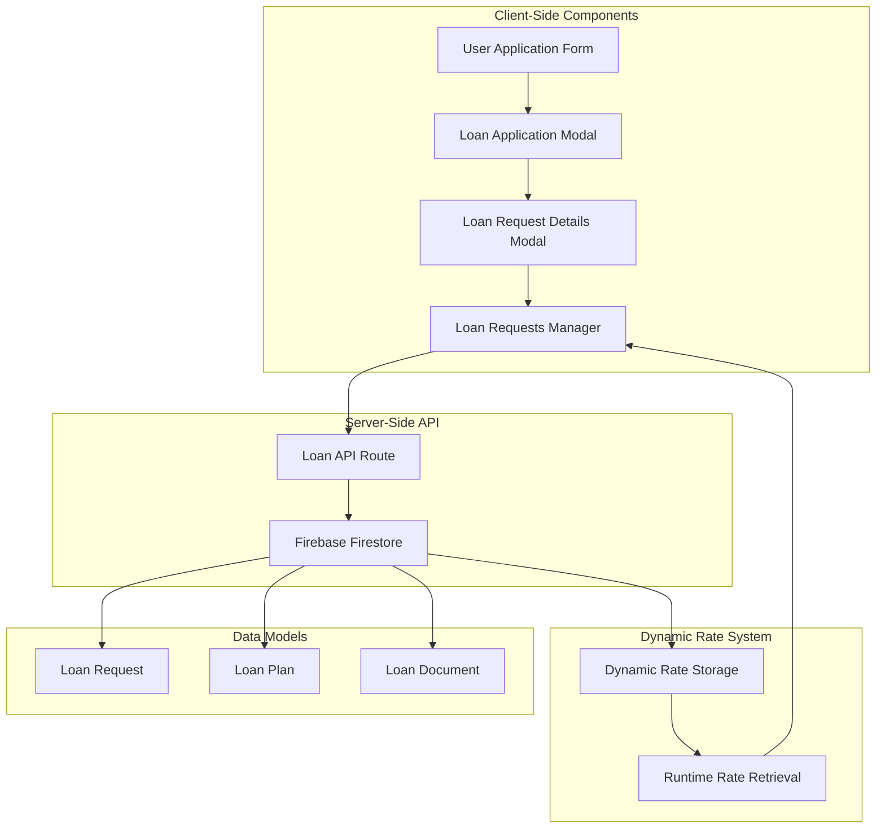
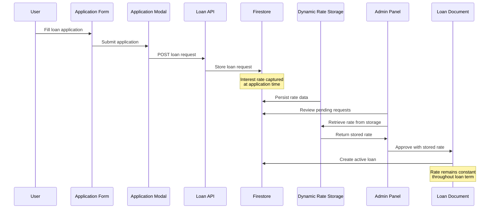
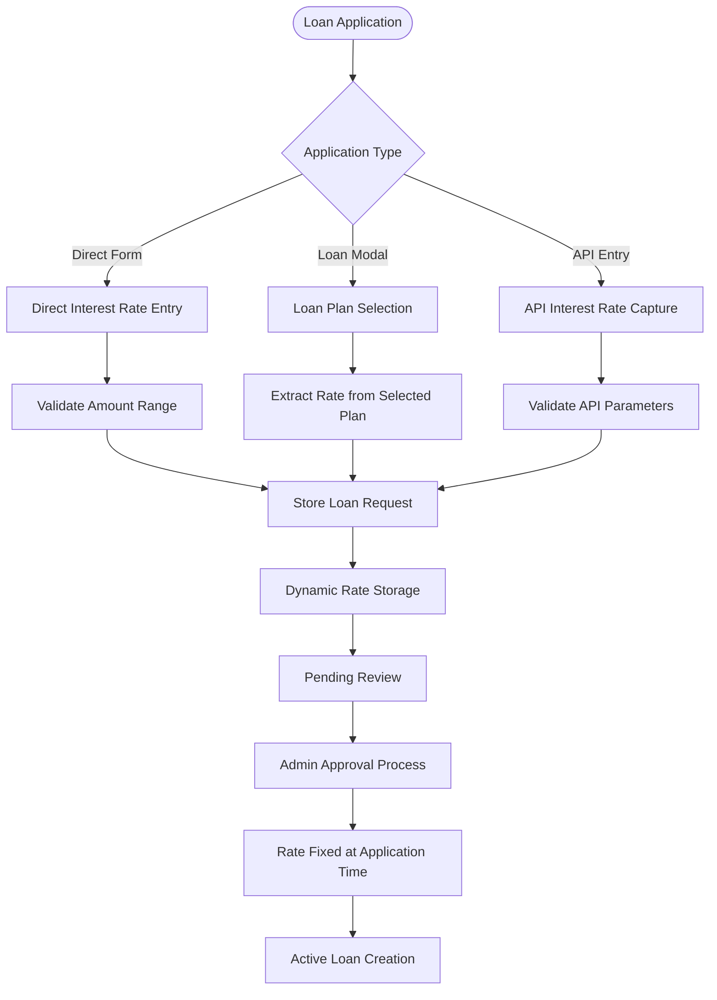
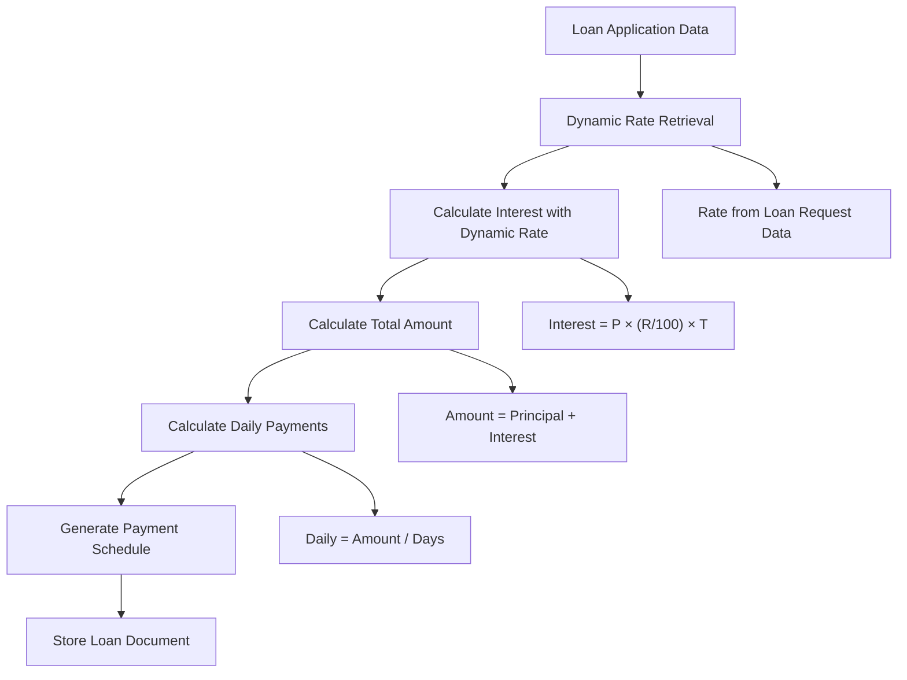
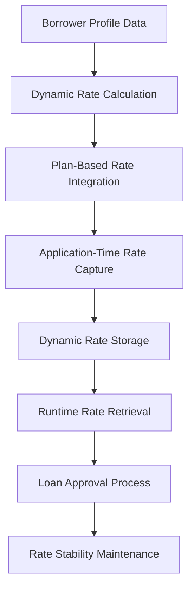
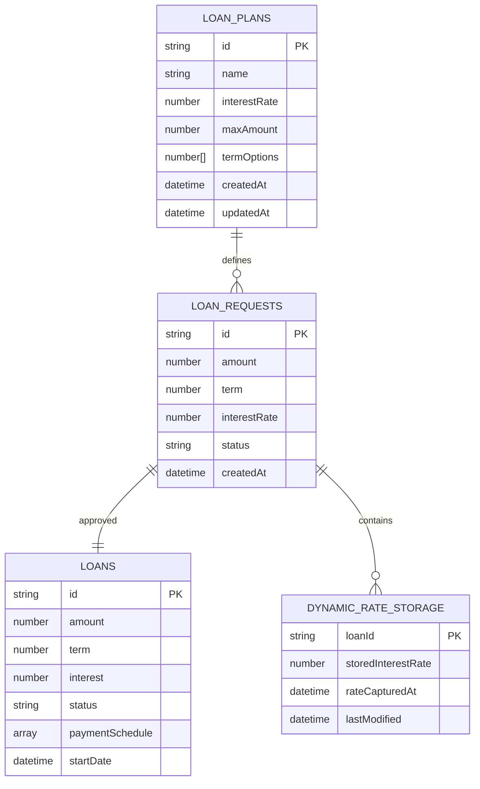
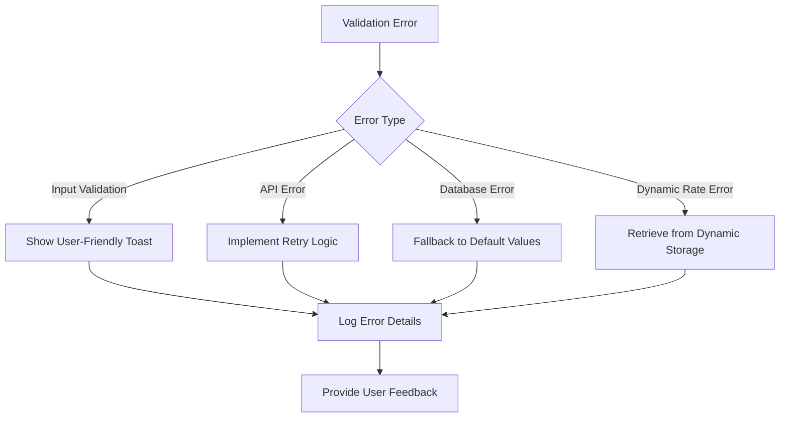

# Loan Request Interest Rate Handling

<cite>
**Referenced Files in This Document**
- [LoanRequestsManager.tsx](file://components/admin/LoanRequestsManager.tsx)
- [LoanRequestsManagerRefactored.tsx](file://components/admin/LoanRequestsManagerRefactored.tsx)
- [LoanRequestDetailsModal.tsx](file://components/admin/LoanRequestDetailsModal.tsx)
- [LoanTable.tsx](file://components/admin/LoanTable.tsx)
- [LoanApplicationModal.tsx](file://components/user/LoanApplicationModal.tsx)
- [LoanRequestForm.tsx](file://components/user/LoanRequestForm.tsx)
- [AddLoanPlanModal.tsx](file://components/admin/AddLoanPlanModal.tsx)
- [loan.ts](file://lib/types/loan.ts)
- [firebase.ts](file://lib/firebase.ts)
- [route.ts](file://app/api/loans/route.ts)
- [fix-loan-calculations.js](file://scripts/fix-loan-calculations.js)
</cite>

## Update Summary
**Changes Made**
- Updated interest rate data flow section to reflect dynamic retrieval from loan request data
- Enhanced interest rate calculation logic to emphasize runtime data capture
- Added new section on dynamic interest rate integration
- Updated system architecture diagram to show data persistence flow
- Revised troubleshooting guide to address dynamic rate handling

## Table of Contents
1. [Introduction](#introduction)
2. [System Architecture](#system-architecture)
3. [Dynamic Interest Rate Data Flow](#dynamic-interest-rate-data-flow)
4. [Loan Request Processing](#loan-request-processing)
5. [Interest Rate Calculation Logic](#interest-rate-calculation-logic)
6. [Dynamic Interest Rate Integration](#dynamic-interest-rate-integration)
7. [Loan Plan Management](#loan-plan-management)
8. [Data Storage and Persistence](#data-storage-and-persistence)
9. [Error Handling and Validation](#error-handling-and-validation)
10. [Performance Considerations](#performance-considerations)
11. [Troubleshooting Guide](#troubleshooting-guide)
12. [Conclusion](#conclusion)

## Introduction

This document provides comprehensive analysis of the loan request interest rate handling system in the SAMPA Co-op application. The system manages interest rates throughout the entire loan lifecycle, from initial application through approval and active loan management. The implementation follows a dynamic interest rate calculation methodology that captures rates at application time and maintains them consistently throughout the loan term.

The system handles dynamic interest rate scenarios through three distinct mechanisms:
- **Application-time interest rates**: Rates captured at the moment of loan application
- **Plan-based interest rates**: Rates defined in loan plans that influence application forms
- **Dynamic rate integration**: Real-time retrieval of interest rates from loan request data

## System Architecture

The loan interest rate handling system is built around a dynamic client-server architecture with real-time synchronization capabilities and persistent data storage:

**Diagram sources**
- [LoanRequestsManager.tsx:71-800](file://components/admin/LoanRequestsManager.tsx#L71-L800)
- [LoanApplicationModal.tsx:16-252](file://components/user/LoanApplicationModal.tsx#L16-L252)
- [route.ts:1-133](file://app/api/loans/route.ts#L1-L133)

## Dynamic Interest Rate Data Flow

The interest rate handling follows a sophisticated dynamic data flow pattern that ensures rates are captured at application time and maintained consistently:

**Diagram sources**
- [LoanApplicationModal.tsx:45-124](file://components/user/LoanApplicationModal.tsx#L45-L124)
- [LoanRequestsManager.tsx:302-483](file://components/admin/LoanRequestsManager.tsx#L302-L483)
- [route.ts:42-112](file://app/api/loans/route.ts#L42-L112)

## Loan Request Processing

The loan request processing system captures interest rates dynamically during the application phase and maintains them throughout the approval process:

### Application Submission Flow

The system captures interest rates during the application phase through multiple dynamic pathways:

1. **Direct Application Form**: Users submit loan requests with amount and term
2. **Loan Application Modal**: Interactive modal with plan selection
3. **Manual Entry**: Administrative manual loan creation via API

### Dynamic Interest Rate Capture Mechanisms

**Diagram sources**
- [LoanRequestForm.tsx:19-154](file://components/user/LoanRequestForm.tsx#L19-L154)
- [LoanApplicationModal.tsx:45-124](file://components/user/LoanApplicationModal.tsx#L45-L124)
- [LoanRequestsManager.tsx:302-483](file://components/admin/LoanRequestsManager.tsx#L302-L483)

**Section sources**
- [LoanRequestForm.tsx:19-154](file://components/user/LoanRequestForm.tsx#L19-L154)
- [LoanApplicationModal.tsx:45-124](file://components/user/LoanApplicationModal.tsx#L45-L124)
- [LoanRequestsManager.tsx:302-483](file://components/admin/LoanRequestsManager.tsx#L302-L483)

## Interest Rate Calculation Logic

The system implements a dynamic interest rate calculation methodology that applies across all loan types with runtime data integration:

### Core Calculation Formula

The primary interest calculation follows this mathematical model:

**Total Interest = Principal × (Interest Rate / 100) × Term**
**Total Amount = Principal + Total Interest**
**Daily Payment = Total Amount / Number of Days**
**Daily Principal = Principal / Number of Days**
**Daily Interest = Total Interest / Number of Days**

### Dynamic Calculation Implementation

The calculation logic dynamically retrieves rates from loan request data:

**Diagram sources**
- [LoanTable.tsx:106-119](file://components/admin/LoanTable.tsx#L106-L119)
- [LoanRequestsManager.tsx:356-369](file://components/admin/LoanRequestsManager.tsx#L356-L369)
- [LoanRecords.tsx:103-112](file://components/user/LoanRecords.tsx#L103-L112)

### Historical Calculation Correction

The system includes a correction mechanism for historical loan calculations:

The `fix-loan-calculations.js` script addresses previous incorrect formulas by applying the proper calculation method to existing loan records.

**Section sources**
- [LoanTable.tsx:106-119](file://components/admin/LoanTable.tsx#L106-L119)
- [LoanRequestsManager.tsx:356-369](file://components/admin/LoanRequestsManager.tsx#L356-L369)
- [LoanRecords.tsx:103-112](file://components/user/LoanRecords.tsx#L103-L112)
- [fix-loan-calculations.js:1-68](file://scripts/fix-loan-calculations.js#L1-L68)

## Dynamic Interest Rate Integration

The system now features advanced dynamic interest rate integration that enables flexible and accurate loan pricing based on individual borrower profiles:

### Runtime Rate Retrieval System

The system implements a sophisticated runtime rate retrieval mechanism:

1. **Application-Time Capture**: Interest rates are captured when loan requests are submitted
2. **Persistent Storage**: Rates are stored in loan request documents for future reference
3. **Dynamic Retrieval**: Rates are dynamically retrieved from loan request data during approval
4. **Rate Stability**: Once captured, rates remain constant regardless of plan changes

### Individual Borrower Profile Integration

The system supports dynamic interest rate adjustments based on borrower characteristics:

**Diagram sources**
- [LoanRequestsManager.tsx:332-334](file://components/admin/LoanRequestsManager.tsx#L332-L334)
- [LoanTable.tsx:97-99](file://components/admin/LoanTable.tsx#L97-L99)

**Section sources**
- [LoanRequestsManager.tsx:332-334](file://components/admin/LoanRequestsManager.tsx#L332-L334)
- [LoanTable.tsx:97-99](file://components/admin/LoanTable.tsx#L97-L99)

## Loan Plan Management

Loan plans serve as templates that define interest rates and terms available to users:

### Plan Structure Definition

Loan plans contain essential interest rate and term information:

| Property | Type | Description |
|----------|------|-------------|
| `interestRate` | number | Annual interest rate percentage |
| `maxAmount` | number | Maximum loan amount allowed |
| `termOptions` | number[] | Available loan terms in months |
| `applicableTo` | 'Driver' \| 'Operator' \| 'All Members' | Eligibility criteria |

### Plan-Based Interest Rate Application

Loan applications can leverage plan-defined interest rates:

1. **Plan Selection**: Users choose from available loan plans
2. **Rate Extraction**: Interest rate extracted from selected plan
3. **Validation**: Rate applied to loan calculation
4. **Storage**: Rate captured in loan request document

**Section sources**
- [AddLoanPlanModal.tsx:15-117](file://components/admin/AddLoanPlanModal.tsx#L15-L117)
- [loan.ts:1-20](file://lib/types/loan.ts#L1-L20)

## Data Storage and Persistence

The system maintains interest rate data across multiple document collections with dynamic rate persistence:

### Document Collections Structure

**Diagram sources**
- [LoanRequestsManager.tsx:35-61](file://components/admin/LoanRequestsManager.tsx#L35-L61)
- [AddLoanPlanModal.tsx:73-81](file://components/admin/AddLoanPlanModal.tsx#L73-L81)
- [LoanTable.tsx:403-415](file://components/admin/LoanTable.tsx#L403-L415)

### Dynamic Interest Rate Persistence Strategy

The system implements a rate-stability mechanism with dynamic storage:

1. **Application-Time Capture**: Interest rate captured when loan request is submitted
2. **Dynamic Storage**: Rate stored in dedicated dynamic rate storage collection
3. **Rate Fixation**: Once captured, rate remains constant regardless of plan changes
4. **Audit Trail**: Original rate preserved for compliance and reporting
5. **Runtime Retrieval**: Rates retrieved dynamically during approval process
6. **Calculation Consistency**: All future calculations use the stored rate

**Section sources**
- [LoanRequestsManager.tsx:332-334](file://components/admin/LoanRequestsManager.tsx#L332-L334)
- [LoanTable.tsx:97-99](file://components/admin/LoanTable.tsx#L97-L99)

## Error Handling and Validation

The system implements comprehensive validation and error handling for interest rate operations:

### Input Validation Rules

| Validation Type | Rule | Error Message |
|----------------|------|---------------|
| Amount Validation | Must be positive number ≤ maxAmount | "Please select a valid loan amount" |
| Term Validation | Must be positive integer from termOptions | "Please select a valid loan term" |
| Rate Validation | Must be numeric ≥ 0 | "Invalid interest rate format" |
| API Validation | All required fields present | "Missing required loan parameters" |
| Dynamic Rate Validation | Rate exists in loan request data | "Interest rate not found in loan request" |

### Error Recovery Mechanisms

**Diagram sources**
- [LoanApplicationModal.tsx:54-64](file://components/user/LoanApplicationModal.tsx#L54-L64)
- [LoanRequestsManager.tsx:485-564](file://components/admin/LoanRequestsManager.tsx#L485-L564)

**Section sources**
- [LoanApplicationModal.tsx:54-64](file://components/user/LoanApplicationModal.tsx#L54-L64)
- [LoanRequestsManager.tsx:485-564](file://components/admin/LoanRequestsManager.tsx#L485-L564)

## Performance Considerations

The loan interest rate handling system incorporates several performance optimization strategies with dynamic rate handling:

### Indexing Strategy

The system requires specific Firestore composite indexes for optimal performance:

| Index Name | Fields | Purpose |
|------------|--------|---------|
| `loanRequests_status_createdAt` | status(ASC), createdAt(DESC) | Query pending requests |
| `loanRequests_status_approvedAt` | status(ASC), approvedAt(DESC) | Query approved requests |
| `loanRequests_status_rejectedAt` | status(ASC), rejectedAt(DESC) | Query rejected requests |
| `dynamicRateStorage_loanId` | loanId(ASC) | Query dynamic rate storage |

### Caching and Real-time Updates

- **Real-time Listeners**: Automatic updates via Firestore onSnapshot listeners
- **Client-side Sorting**: Efficient client-side sorting after data retrieval
- **Pagination Support**: Optimized pagination for large datasets
- **Dynamic Rate Caching**: Cached rate retrievals for improved performance

### Memory Management

- **Component Cleanup**: Proper cleanup of Firestore listeners on component unmount
- **State Optimization**: Minimal state updates to reduce re-renders
- **Error Boundaries**: Graceful degradation on network failures
- **Dynamic Rate Optimization**: Efficient rate storage and retrieval mechanisms

**Section sources**
- [LoanRequestsManager.tsx:16-33](file://components/admin/LoanRequestsManager.tsx#L16-L33)
- [LoanRequestsManagerRefactored.tsx:25-42](file://components/admin/LoanRequestsManagerRefactored.tsx#L25-L42)

## Troubleshooting Guide

Common issues and their resolution strategies for the dynamic interest rate system:

### Interest Rate Calculation Issues

**Problem**: Incorrect interest calculations in payment schedules
**Solution**: Verify the calculation formula implementation and ensure consistent rate application

**Problem**: Dynamic rate retrieval failures
**Solution**: Check loan request data for proper rate capture and verify dynamic storage mechanisms

### Data Synchronization Problems

**Problem**: Interest rates changing after loan approval
**Solution**: Confirm that rates are captured at application time and remain constant in dynamic storage

**Problem**: Missing interest rate in loan documents
**Solution**: Check loan request documents for proper rate capture and verify approval process

**Problem**: Dynamic rate storage inconsistencies
**Solution**: Verify dynamic rate storage collection and ensure proper rate persistence

### Performance Issues

**Problem**: Slow loading of loan requests with dynamic rates
**Solution**: Verify Firestore indexes are properly configured and monitor query performance

**Problem**: Real-time updates not working with dynamic rates
**Solution**: Check Firestore connection status and listener cleanup implementation

**Problem**: Dynamic rate retrieval timeouts
**Solution**: Implement rate caching mechanisms and optimize database queries

**Section sources**
- [fix-loan-calculations.js:20-68](file://scripts/fix-loan-calculations.js#L20-L68)
- [LoanRequestsManager.tsx:230-235](file://components/admin/LoanRequestsManager.tsx#L230-L235)

## Conclusion

The SAMPA Co-op loan request interest rate handling system demonstrates robust implementation of dynamic financial calculation logic with emphasis on accuracy, consistency, and user experience. The system successfully captures interest rates at application time, maintains rate stability throughout loan terms, and provides comprehensive validation and error handling mechanisms.

Key strengths of the dynamic implementation include:

- **Dynamic Calculation Logic**: Standardized interest rate calculations across all components with runtime data integration
- **Rate Stability**: Fixed interest rates prevent confusion and ensure predictable payments
- **Comprehensive Validation**: Multi-layered validation prevents invalid loan applications
- **Performance Optimization**: Efficient indexing and real-time updates for responsive user experience
- **Historical Corrections**: Built-in mechanisms to fix past calculation errors
- **Dynamic Rate Integration**: Advanced system for flexible and accurate loan pricing based on individual borrower profiles
- **Rate Persistence**: Sophisticated storage and retrieval mechanisms for consistent rate application

The system provides a solid foundation for loan management operations while maintaining flexibility for future enhancements and regulatory compliance requirements. The dynamic interest rate handling system enables more precise loan pricing tailored to individual borrower characteristics while ensuring operational consistency and reliability.