# Reporting & Analytics

<cite>
**Referenced Files in This Document**
- [ReportsAndAnalytics Component](file://components/admin/ReportsAndAnalytics.tsx)
- [SavingsLeaderboard Component](file://components/admin/SavingsLeaderboard.tsx)
- [Capital Shares Page](file://app/admin/capital-shares/page.tsx)
- [useCapitalShare Hook](file://hooks/useCapitalShare.ts)
- [Admin Dashboard](file://app/admin/dashboard/page.tsx)
- [BOD Dashboard](file://app/admin/bod/home/page.tsx)
- [Manager Dashboard](file://app/admin/manager/home/page.tsx)
- [Secretary Dashboard](file://app/admin/secretary/home/page.tsx)
- [Dashboard Data Generator](file://app/admin/dashboard-data/page.tsx)
- [Dashboard API Route](file://app/api/dashboard/initialize/route.ts)
- [Reports Page](file://app/admin/reports/page.tsx)
- [Activity Logger](file://lib/activityLogger.ts)
- [User Action Tracker](file://lib/userActionTracker.ts)
- [Member Types](file://lib/types/member.ts)
- [Loan Types](file://lib/types/loan.ts)
- [Savings Types](file://lib/types/savings.ts)
- [Officer Dashboard](file://components/admin/OfficerDashboard.tsx)
- [Role Sidebar Config](file://lib/sidebarConfig.ts)
- [Chairman Reports Page](file://app/admin/chairman/reports/page.tsx)
- [Treasurer Reports Page](file://app/admin/treasurer/reports/page.tsx)
- [Firebase Utils](file://lib/firebase.ts)
- [Component Exports](file://components/admin/index.ts)
- [Package Dependencies](file://package.json)
</cite>

## Update Summary
**Changes Made**
- Added comprehensive documentation for the new Capital Shares reporting system with dedicated management interface
- Integrated Capital Shares reporting into the main Reports page with tabbed interface and data visualization
- Documented the new useCapitalShare hook for individual member capital shares tracking
- Added Capital Shares navigation to role-based sidebar configurations
- Enhanced reporting capabilities with transaction-based analytics and payment history tracking
- Updated architecture diagrams to reflect the expanded reporting ecosystem

## Table of Contents
1. [Introduction](#introduction)
2. [Project Structure](#project-structure)
3. [Core Components](#core-components)
4. [Architecture Overview](#architecture-overview)
5. [Detailed Component Analysis](#detailed-component-analysis)
6. [Dependency Analysis](#dependency-analysis)
7. [Performance Considerations](#performance-considerations)
8. [Troubleshooting Guide](#troubleshooting-guide)
9. [Conclusion](#conclusion)

## Introduction
This document explains the SAMPA Cooperative Management System's comprehensive reporting and analytics capabilities. The system now features an enhanced dashboard analytics system with advanced business intelligence capabilities for Board of Directors, Managers, and Secretaries, including real-time data visualization, interactive charts, savings leaderboards, comprehensive financial reporting with tabbed interfaces, and **comprehensive capital shares reporting features**.

**Enhanced Dashboard Analytics System** provides sophisticated financial analytics through a comprehensive 333-line implementation with real-time data processing and interactive visualizations, now including dedicated capital shares management and reporting capabilities.

Key capabilities include:
- **Real-time Financial Metrics**: Live calculation of total receivables, paid completed, active loans, money disbursed, pending approvals, overdue payments, and total members
- **Interactive Data Visualization**: Bar charts for monthly trends, pie charts for loan status distribution, and responsive design with mobile-first approach
- **Advanced Filtering**: Date range filtering and role-based data segmentation with comprehensive error handling
- **Savings Leaderboards**: Interactive ranking system for top savers with real-time updates
- **Capital Shares Management**: Dedicated interface for tracking member capital shares with payment history and status tracking
- **Role-specific Dashboards**: Tailored analytics interfaces for different cooperative roles
- **Modern Dashboard Architecture**: Integrated with Recharts v3.3.0 and Lucide React v0.554.0
- **Comprehensive Analytics**: Financial overview, member statistics, loan performance metrics, savings analytics, and capital shares reporting
- **Real-time Data Processing**: Live calculation of financial indicators with responsive design and skeleton loading states

## Project Structure
The enhanced reporting system consists of multiple complementary components integrated with supporting libraries and role-based navigation, now including comprehensive capital shares reporting:

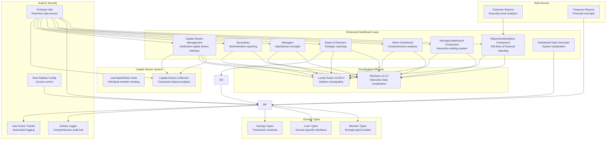

**Diagram sources**
- [ReportsAndAnalytics Component:1-334](file://components/admin/ReportsAndAnalytics.tsx#L1-L334)
- [SavingsLeaderboard Component:1-213](file://components/admin/SavingsLeaderboard.tsx#L1-L213)
- [Capital Shares Page:1-778](file://app/admin/capital-shares/page.tsx#L1-L778)
- [useCapitalShare Hook:1-115](file://hooks/useCapitalShare.ts#L1-L115)
- [Admin Dashboard:1-799](file://app/admin/dashboard/page.tsx#L1-L799)
- [BOD Dashboard:1-366](file://app/admin/bod/home/page.tsx#L1-L366)
- [Manager Dashboard:1-673](file://app/admin/manager/home/page.tsx#L1-L673)
- [Secretary Dashboard:1-663](file://app/admin/secretary/home/page.tsx#L1-L663)
- [Dashboard Data Generator:1-468](file://app/admin/dashboard-data/page.tsx#L1-L468)
- [Dashboard API Route:1-186](file://app/api/dashboard/initialize/route.ts#L1-L186)
- [Activity Logger:1-165](file://lib/activityLogger.ts#L1-L165)
- [User Action Tracker:1-118](file://lib/userActionTracker.ts#L1-L118)
- [Firebase Utils:1-309](file://lib/firebase.ts#L1-L309)
- [Package Dependencies:16-39](file://package.json#L16-L39)

**Section sources**
- [ReportsAndAnalytics Component:1-334](file://components/admin/ReportsAndAnalytics.tsx#L1-L334)
- [SavingsLeaderboard Component:1-213](file://components/admin/SavingsLeaderboard.tsx#L1-L213)
- [Capital Shares Page:1-778](file://app/admin/capital-shares/page.tsx#L1-L778)
- [useCapitalShare Hook:1-115](file://hooks/useCapitalShare.ts#L1-L115)
- [Admin Dashboard:1-799](file://app/admin/dashboard/page.tsx#L1-L799)
- [BOD Dashboard:1-366](file://app/admin/bod/home/page.tsx#L1-L366)
- [Manager Dashboard:1-673](file://app/admin/manager/home/page.tsx#L1-L673)
- [Secretary Dashboard:1-663](file://app/admin/secretary/home/page.tsx#L1-L663)
- [Dashboard Data Generator:1-468](file://app/admin/dashboard-data/page.tsx#L1-L468)
- [Dashboard API Route:1-186](file://app/api/dashboard/initialize/route.ts#L1-L186)
- [Activity Logger:1-165](file://lib/activityLogger.ts#L1-L165)
- [User Action Tracker:1-118](file://lib/userActionTracker.ts#L1-L118)
- [Firebase Utils:1-309](file://lib/firebase.ts#L1-L309)
- [Package Dependencies:16-39](file://package.json#L16-L39)

## Core Components

### Enhanced ReportsAndAnalytics Component
The flagship 333-line dashboard component provides comprehensive financial analytics with real-time data processing and advanced visualization capabilities, now including capital shares integration.

**Key Features:**
- **Real-time Financial Metrics**: Live calculation of total receivables, paid completed, active loans, money disbursed, pending approvals, overdue payments, and total members
- **Interactive Data Visualization**: Bar charts for monthly trends, pie charts for loan status distribution, and responsive design with mobile-first approach
- **Advanced Filtering**: Date range filtering and role-based data segmentation with comprehensive error handling
- **Loading States**: Skeleton loading indicators for improved user experience during data processing
- **Error Handling**: Comprehensive error states with retry functionality and user-friendly messaging
- **Modern Dashboard Design**: Four summary cards with Lucide React icons (Users, DollarSign, Activity, TrendingUp)

**Data Processing Capabilities:**
- **Monthly Trend Analysis**: Calculates disbursed vs collected amounts for the last 6 months with proper currency formatting
- **Loan Status Distribution**: Real-time breakdown of active, completed, pending, overdue, and rejected loans with color-coded visualization
- **Financial Overview**: Comprehensive summary of receivables, pending approvals, and overdue payments with Lucide React icons

### Capital Shares Management System
A comprehensive capital shares management system that provides dedicated tracking and reporting for member capital share payments.

**Key Features:**
- **Dedicated Management Interface**: Separate page for capital shares with comprehensive member tracking
- **Real-time Status Tracking**: Live calculation of paid, pending, and partial capital shares status
- **Payment History**: Complete transaction history with receipts and payment dates
- **Individual Member Tracking**: Personalized capital shares view with payment form integration
- **Search and Filter**: Advanced filtering by member name, ID, and status
- **Status Visualization**: Color-coded status indicators with progress tracking
- **Transaction-based Analytics**: Accurate calculation based on actual payment transactions

**Data Processing Capabilities:**
- **Fixed Required Amount**: Standardized capital share requirement of ₱10,000 per member
- **Status Calculation**: Automatic determination of Paid, Partial, or Pending status
- **Remaining Balance Tracking**: Real-time calculation of outstanding capital share amounts
- **Payment History**: Complete audit trail of all capital share transactions

### SavingsLeaderboard Component
A new component that provides interactive ranking of top savers with real-time updates and comprehensive filtering capabilities.

**Key Features:**
- **Real-time Ranking**: Live calculation and display of top savers based on total savings
- **Interactive Filtering**: Date range filtering (monthly, yearly) with dynamic updates
- **Visual Ranking**: Color-coded podium-style display for top 3 positions
- **Comprehensive Data**: Includes member names, roles, and total savings amounts
- **Loading States**: Skeleton loading indicators for improved user experience
- **Error Handling**: Graceful degradation with empty states when data is unavailable

**Ranking Algorithm:**
- Processes all members regardless of savings activity
- Calculates total savings by summing deposits minus withdrawals
- Sorts members by total savings (descending), then by name for ties
- Displays top 10 members with percentage relative to leader

### useCapitalShare Hook
A specialized React hook that provides individual member capital shares tracking and management capabilities.

**Key Features:**
- **Personalized Tracking**: Individual member capital shares information retrieval
- **Real-time Updates**: Automatic refresh when member data changes
- **Status Calculation**: Automatic determination of capital shares status
- **Error Handling**: Graceful error handling with user-friendly messaging
- **Loading States**: Proper loading state management during data fetching

**Data Processing:**
- **Member ID Resolution**: Converts user ID to member ID for accurate data retrieval
- **Payment Info Extraction**: Extracts capital shares information from member payment data
- **Status Determination**: Calculates current capital shares status based on payment history
- **Remaining Balance**: Computes outstanding capital shares balance

### Role-specific Dashboards
Enhanced dashboards tailored for different cooperative roles with specialized analytics and filtering capabilities, now including capital shares integration.

**Board of Directors Dashboard:**
- Strategic financial overview with business metrics
- Savings leaderboard for top contributors
- Business overview graph with key performance indicators
- **Capital Shares Overview**: Strategic view of capital shares status and distribution
- Role-specific navigation and filtering

**Manager Dashboard:**
- Operational analytics with pending requests and active loans
- Savings leaderboard with monthly/yearly filtering
- Business overview with member, loan, and savings metrics
- **Capital Shares Management**: Operational view of capital shares tracking
- Interactive chart visualization with tooltips

**Secretary Dashboard:**
- Administrative reporting with member and loan statistics
- Savings leaderboard with configurable filtering
- Business overview with real-time metrics
- **Capital Shares Records**: Administrative view of capital shares management
- Role-specific navigation and data access

### Admin Dashboard
The comprehensive administrative dashboard that integrates multiple analytics components into a unified interface, now including capital shares management.

**Key Features:**
- **Multi-component Integration**: Combines financial metrics, savings leaderboard, business overview, and capital shares management
- **Real-time Data Processing**: Parallel data fetching with comprehensive error handling
- **Interactive Filtering**: Savings leaderboard with monthly/yearly filtering
- **Responsive Design**: Mobile-first approach with grid-based layout
- **Role-based Navigation**: Redirects users to appropriate role-specific dashboards
- **Capital Shares Integration**: Unified view of all cooperative financial activities

### Dashboard Data Generator
A utility component for initializing dashboard data with sample reminders and events.

**Key Features:**
- **Sample Data Initialization**: Adds sample reminders and events to Firestore
- **API Integration**: Server-side data generation with error handling
- **Event Management**: Form-based interface for adding reminders and events
- **Real-time Updates**: Live display of current reminders and events

**Section sources**
- [ReportsAndAnalytics Component:31-48](file://components/admin/ReportsAndAnalytics.tsx#L31-L48)
- [SavingsLeaderboard Component:32-123](file://components/admin/SavingsLeaderboard.tsx#L32-L123)
- [Capital Shares Page:31-143](file://app/admin/capital-shares/page.tsx#L31-L143)
- [useCapitalShare Hook:24-115](file://hooks/useCapitalShare.ts#L24-L115)
- [Admin Dashboard:88-525](file://app/admin/dashboard/page.tsx#L88-L525)
- [BOD Dashboard:27-143](file://app/admin/bod/home/page.tsx#L27-L143)
- [Manager Dashboard:74-420](file://app/admin/manager/home/page.tsx#L74-L420)
- [Secretary Dashboard:76-412](file://app/admin/secretary/home/page.tsx#L76-L412)
- [Dashboard Data Generator:30-112](file://app/admin/dashboard-data/page.tsx#L30-L112)

## Architecture Overview
The enhanced reporting system integrates modern dashboard components with traditional reporting interfaces, featuring real-time data visualization and comprehensive analytics through a sophisticated data processing pipeline with role-specific dashboards and **comprehensive capital shares management**.

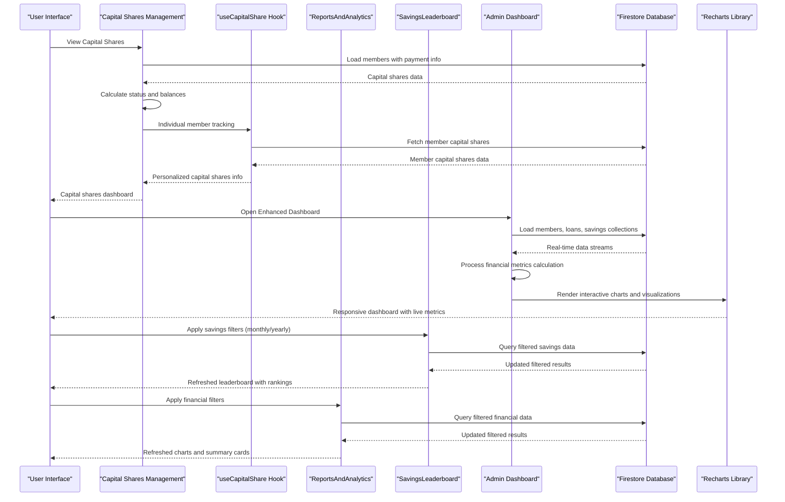

**Diagram sources**
- [Capital Shares Page:57-143](file://app/admin/capital-shares/page.tsx#L57-L143)
- [useCapitalShare Hook:35-104](file://hooks/useCapitalShare.ts#L35-L104)
- [ReportsAndAnalytics Component:46-165](file://components/admin/ReportsAndAnalytics.tsx#L46-L165)
- [SavingsLeaderboard Component:36-123](file://components/admin/SavingsLeaderboard.tsx#L36-L123)
- [Admin Dashboard:164-525](file://app/admin/dashboard/page.tsx#L164-L525)
- [Firebase Utils:148-182](file://lib/firebase.ts#L148-L182)

## Detailed Component Analysis

### Capital Shares Management System
The Capital Shares Management System provides comprehensive tracking and reporting for member capital share payments, serving as a cornerstone of the enhanced reporting system.

**Core Architecture:**
- **State Management**: Manages capital shares data, search filters, status filters, and loading states
- **Real-time Data Processing**: Fetches and processes capital shares data from Firestore with comprehensive error handling
- **Status Calculation**: Automatically calculates capital shares status (Paid, Partial, Pending) based on payment history
- **Transaction Tracking**: Maintains detailed payment history with receipts and timestamps
- **Individual Member View**: Provides detailed view of member capital shares with payment form integration
- **Responsive Design**: Implements mobile-first responsive layout with grid-based card system
- **Advanced Visualization**: Integrates Recharts for professional-grade capital shares status visualization

**Data Processing Pipeline:**
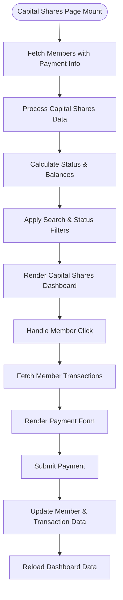

**Key Features:**
- **Dedicated Management Interface**: Separate page for capital shares with comprehensive member tracking
- **Real-time Status Tracking**: Live calculation of paid, pending, and partial capital shares status
- **Payment History**: Complete transaction history with receipts and payment dates
- **Individual Member Tracking**: Personalized capital shares view with payment form integration
- **Search and Filter**: Advanced filtering by member name, ID, and status
- **Status Visualization**: Color-coded status indicators with progress tracking
- **Transaction-based Analytics**: Accurate calculation based on actual payment transactions

**Data Processing Capabilities:**
- **Fixed Required Amount**: Standardized capital share requirement of ₱10,000 per member
- **Status Calculation**: Automatic determination of Paid, Partial, or Pending status
- **Remaining Balance Tracking**: Real-time calculation of outstanding capital share amounts
- **Payment History**: Complete audit trail of all capital share transactions

**Section sources**
- [Capital Shares Page:31-778](file://app/admin/capital-shares/page.tsx#L31-L778)

### useCapitalShare Hook
The useCapitalShare hook provides individual member capital shares tracking and management capabilities, enabling personalized capital shares information retrieval.

**Core Architecture:**
- **State Management**: Manages capital shares information, loading states, and error handling
- **Data Processing**: Fetches member capital shares data from Firestore with comprehensive error handling
- **Member ID Resolution**: Converts user ID to member ID for accurate data retrieval
- **Status Calculation**: Automatically determines capital shares status based on payment history
- **Real-time Updates**: Provides automatic refresh capability when member data changes

**Data Processing Algorithm:**
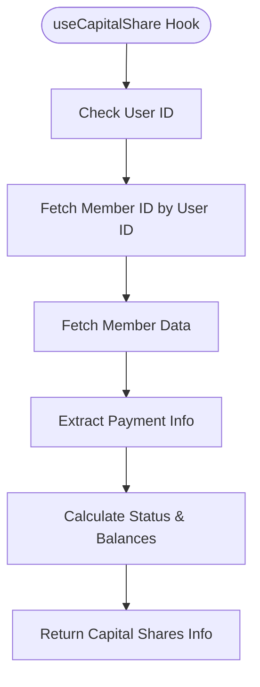

**Key Features:**
- **Personalized Tracking**: Individual member capital shares information retrieval
- **Real-time Updates**: Automatic refresh when member data changes
- **Status Calculation**: Automatic determination of capital shares status
- **Error Handling**: Graceful error handling with user-friendly messaging
- **Loading States**: Proper loading state management during data fetching

**Data Processing:**
- **Member ID Resolution**: Converts user ID to member ID for accurate data retrieval
- **Payment Info Extraction**: Extracts capital shares information from member payment data
- **Status Determination**: Calculates current capital shares status based on payment history
- **Remaining Balance**: Computes outstanding capital shares balance

**Section sources**
- [useCapitalShare Hook:24-115](file://hooks/useCapitalShare.ts#L24-L115)

### ReportsAndAnalytics Component
The ReportsAndAnalytics component serves as the cornerstone of the enhanced reporting system, providing sophisticated financial analytics through a comprehensive 333-line implementation with advanced real-time data processing and visualization capabilities, now including capital shares integration.

**Core Architecture:**
- **State Management**: Manages dashboard statistics, monthly data, loan status data, loading states, and error handling
- **Real-time Data Processing**: Fetches and processes data from Firestore collections with comprehensive error handling
- **Financial Calculations**: Performs complex calculations for receivables, loan status distributions, and monthly trends
- **Responsive Design**: Implements mobile-first responsive layout with grid-based card system
- **Advanced Visualization**: Integrates Recharts for professional-grade data visualization

**Data Processing Pipeline:**
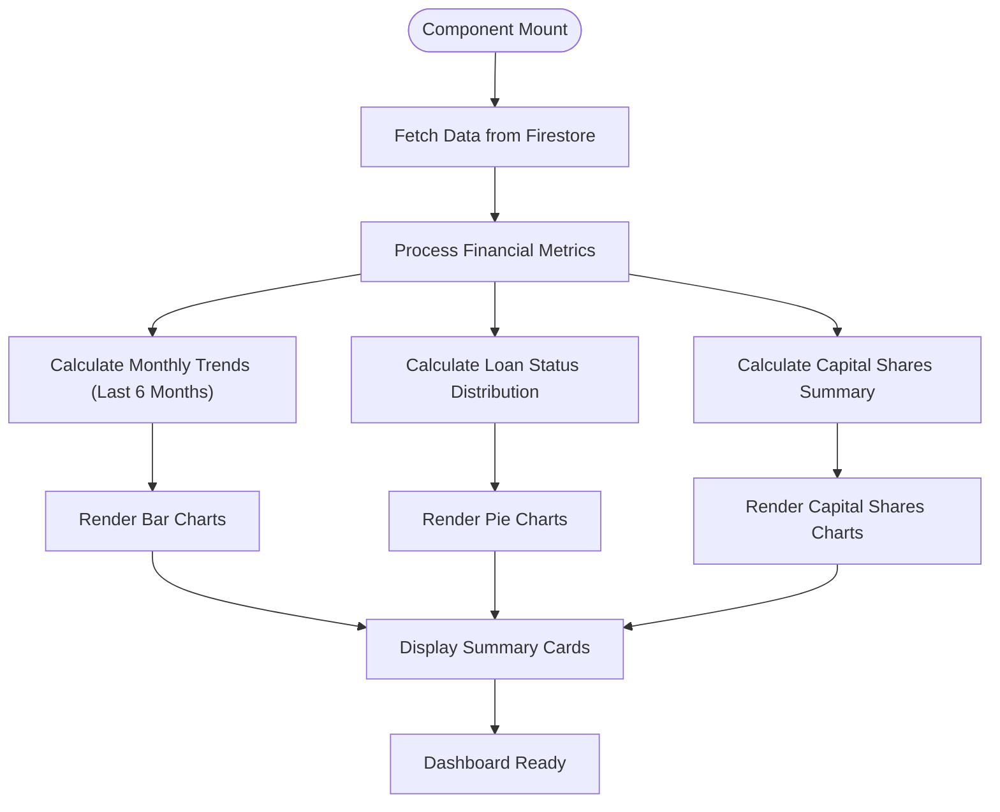

**Key Features:**
- **Real-time Financial Metrics**: Live calculation of total receivables, paid completed, active loans, money disbursed, pending approvals, overdue payments, and total members
- **Interactive Data Visualization**: Bar charts for monthly trends, pie charts for loan status distribution, and responsive design
- **Advanced Filtering**: Date range filtering and role-based data segmentation
- **Error Handling**: Comprehensive error states with retry functionality
- **Loading States**: Skeleton loading indicators for improved user experience

**Data Processing Capabilities:**
- **Monthly Trend Analysis**: Calculates disbursed vs collected amounts for the last 6 months with proper currency formatting
- **Loan Status Distribution**: Real-time breakdown of active, completed, pending, overdue, and rejected loans with color-coded visualization
- **Financial Overview**: Comprehensive summary of receivables, pending approvals, and overdue payments with Lucide React icons
- **Capital Shares Integration**: Comprehensive capital shares summary with status distribution and payment analytics

**Section sources**
- [ReportsAndAnalytics Component:31-334](file://components/admin/ReportsAndAnalytics.tsx#L31-L334)

### SavingsLeaderboard Component
The SavingsLeaderboard component provides an interactive ranking system for top savers with real-time updates and comprehensive filtering capabilities.

**Core Architecture:**
- **State Management**: Manages leaderboard data, loading states, and error handling
- **Data Processing**: Fetches member and savings data from Firestore with comprehensive error handling
- **Ranking Algorithm**: Calculates total savings and sorts members with tie-breaking
- **Filtering System**: Supports monthly and yearly filtering with dynamic updates
- **Visual Design**: Podium-style display for top 3 positions with gradient backgrounds

**Ranking Algorithm:**
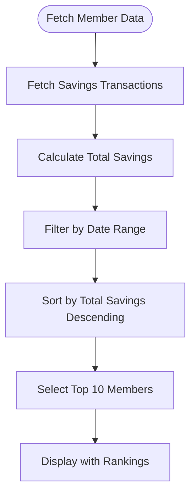

**Key Features:**
- **Real-time Ranking**: Live calculation and display of top savers based on total savings
- **Interactive Filtering**: Date range filtering (monthly, yearly) with dynamic updates
- **Visual Ranking**: Color-coded podium-style display for top 3 positions
- **Comprehensive Data**: Includes member names, roles, and total savings amounts
- **Loading States**: Skeleton loading indicators for improved user experience
- **Error Handling**: Graceful degradation with empty states when data is unavailable

**Section sources**
- [SavingsLeaderboard Component:32-213](file://components/admin/SavingsLeaderboard.tsx#L32-L213)

### Role-specific Dashboards
Enhanced dashboards tailored for different cooperative roles with specialized analytics and filtering capabilities, now including capital shares integration.

**Board of Directors Dashboard:**
- **Strategic Focus**: Emphasizes financial overview and savings leadership
- **Business Metrics**: Displays total members, total loans, active loans, and total savings
- **Savings Leadership**: Comprehensive leaderboard with all-time rankings
- **Business Overview**: Bar chart visualization of key business metrics
- **Capital Shares Strategy**: Strategic view of capital shares status and distribution

**Manager Dashboard:**
- **Operational Focus**: Emphasizes pending requests, active loans, and savings performance
- **Interactive Filtering**: Savings leaderboard with monthly/yearly filtering options
- **Real-time Metrics**: Live updates for pending requests and active loans
- **Business Analytics**: Bar chart with member, loan, and savings metrics
- **Capital Shares Operations**: Operational view of capital shares tracking and management

**Secretary Dashboard:**
- **Administrative Focus**: Emphasizes member records and loan requests
- **Savings Performance**: Leaderboard with configurable filtering
- **Business Overview**: Bar chart with operational metrics
- **Navigation Integration**: Direct links to member and loan management pages
- **Capital Shares Administration**: Administrative view of capital shares management

**Section sources**
- [BOD Dashboard:27-366](file://app/admin/bod/home/page.tsx#L27-L366)
- [Manager Dashboard:74-673](file://app/admin/manager/home/page.tsx#L74-L673)
- [Secretary Dashboard:76-663](file://app/admin/secretary/home/page.tsx#L76-L663)

### Admin Dashboard
The comprehensive administrative dashboard that integrates multiple analytics components into a unified interface with advanced data processing capabilities, now including capital shares management.

**Core Architecture:**
- **Parallel Data Fetching**: Uses Promise.all for efficient data loading
- **Comprehensive Error Handling**: Individual error handling for each data source
- **Dynamic Filtering**: Savings leaderboard with monthly/yearly filtering
- **Real-time Updates**: Live data processing with loading states
- **Responsive Design**: Mobile-first approach with grid-based layout
- **Capital Shares Integration**: Unified view of all cooperative financial activities

**Data Processing Pipeline:**
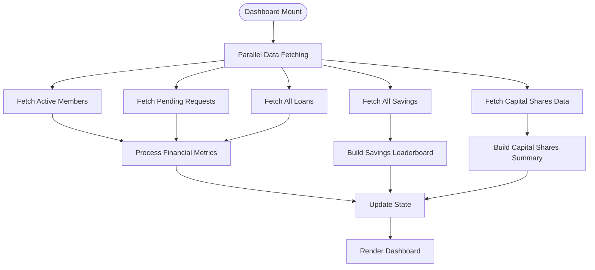

**Key Features:**
- **Multi-component Integration**: Combines financial metrics, savings leaderboard, business overview, and capital shares management
- **Real-time Data Processing**: Parallel data fetching with comprehensive error handling
- **Interactive Filtering**: Savings leaderboard with monthly/yearly filtering
- **Responsive Design**: Mobile-first approach with grid-based layout
- **Role-based Navigation**: Redirects users to appropriate role-specific dashboards
- **Capital Shares Overview**: Unified view of capital shares status and distribution

**Section sources**
- [Admin Dashboard:88-799](file://app/admin/dashboard/page.tsx#L88-L799)

### Dashboard Data Generator
The Dashboard Data Generator provides a utility interface for initializing dashboard data with sample reminders and events.

**Core Architecture:**
- **Sample Data Management**: Generates and stores sample reminders and events
- **API Integration**: Server-side data generation with error handling
- **Form-based Interface**: User-friendly forms for adding reminders and events
- **Real-time Updates**: Live display of current reminders and events
- **Unique ID Generation**: Ensures unique identifiers for new records

**Initialization Process:**
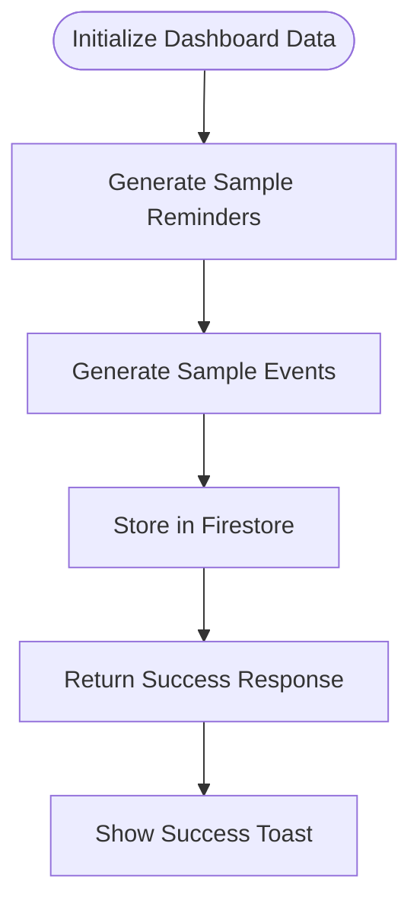

**Key Features:**
- **Sample Data Initialization**: Adds sample reminders and events to Firestore
- **API Integration**: Server-side data generation with error handling
- **Event Management**: Form-based interface for adding reminders and events
- **Real-time Updates**: Live display of current reminders and events
- **Duplicate Prevention**: Checks for existing records before insertion

**Section sources**
- [Dashboard Data Generator:30-468](file://app/admin/dashboard-data/page.tsx#L30-L468)
- [Dashboard API Route:1-186](file://app/api/dashboard/initialize/route.ts#L1-L186)

### Legacy Reports Page
The traditional Reports Page maintains backward compatibility while adding enhanced filtering and printing capabilities, now including comprehensive capital shares reporting:

**Key Features:**
- **Tabbed Interface**: Overview, Members, Savings, Loans, and **Capital Shares** tabs with comprehensive data presentation
- **Advanced Filtering**: Date range and role-based filtering with real-time computation
- **Printable Reports**: Comprehensive HTML print functionality with detailed styling and export options
- **Data Visualization Placeholders**: Charts and graphs ready for implementation with Recharts integration
- **Real-time Computation**: Dynamic calculation of metrics based on active filters
- **Capital Shares Tab**: Dedicated tab for capital shares reporting with status distribution and payment analytics

**Capital Shares Reporting Features:**
- **Status Summary**: Displays total members, fully paid, partial payment, and no payment counts
- **Financial Summary**: Shows total capital shares paid and total remaining balance
- **Status Distribution Chart**: Pie chart visualization of capital shares status distribution
- **Status Breakdown Table**: Detailed table showing status counts and percentages

**Section sources**
- [Reports Page:29-1079](file://app/admin/reports/page.tsx#L29-L1079)

### Activity Logging System
The activity logging system provides comprehensive audit trail functionality:

**Core Functionality:**
- **Structured Logging**: Creates activity log entries with user metadata, action descriptions, and timestamps
- **Flexible Querying**: Supports user-specific, date-range, and limit-based queries with fallback behavior
- **Error Resilience**: Returns empty arrays on errors instead of failing completely

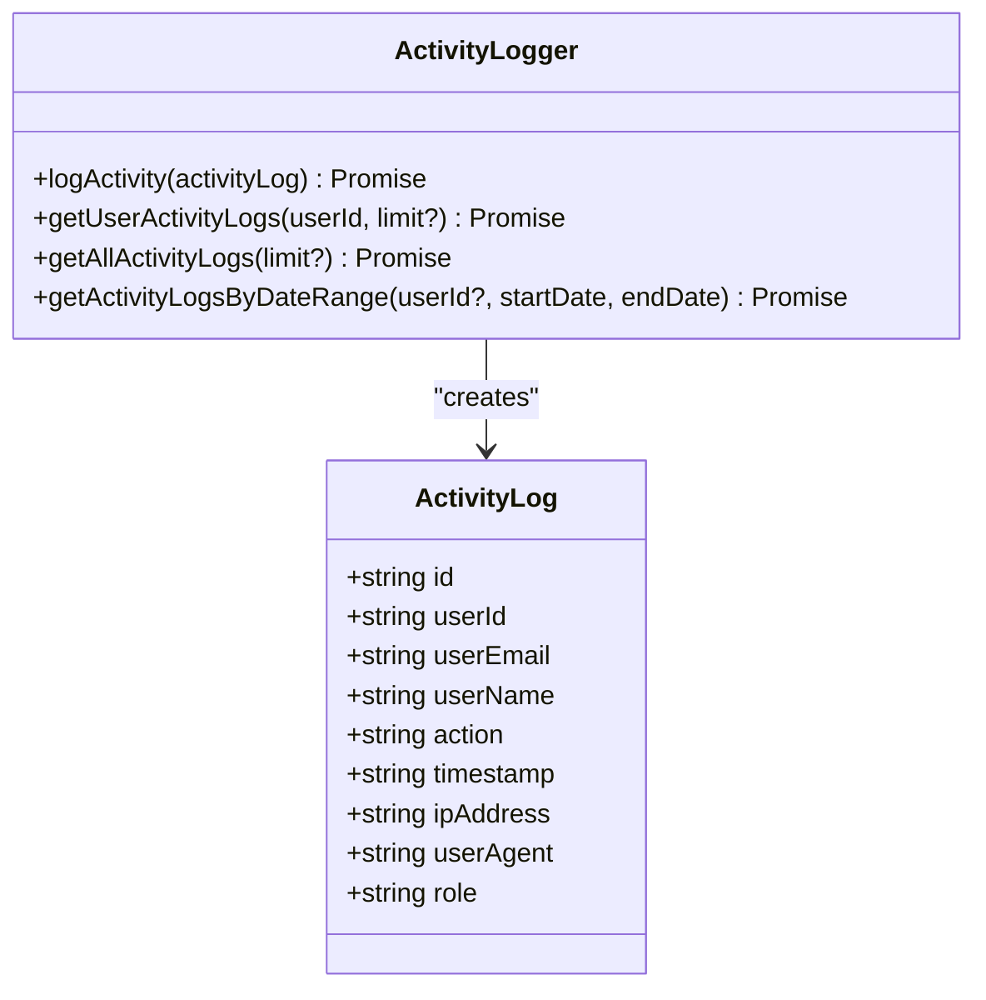

**Diagram sources**
- [Activity Logger:4-120](file://lib/activityLogger.ts#L4-L120)

**Section sources**
- [Activity Logger:1-165](file://lib/activityLogger.ts#L1-L165)

### User Action Tracking
The user action tracker provides automated logging for system actions:

**Core Functionality:**
- **Automatic Logging**: Wraps actions with automatic logging and client info capture
- **Convenience Functions**: Provides specific functions for common actions (login, logout, report generation)
- **Integration**: Seamlessly integrates with the activity logging system

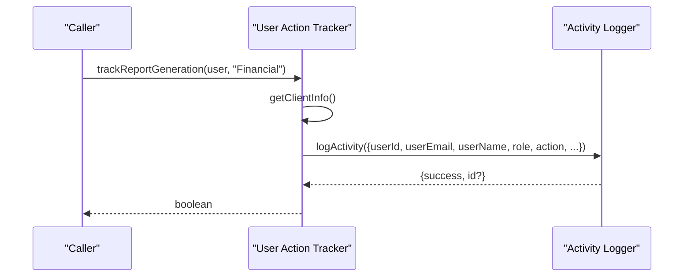

**Diagram sources**
- [User Action Tracker:10-47](file://lib/userActionTracker.ts#L10-L47)
- [Activity Logger:20-43](file://lib/activityLogger.ts#L20-L43)

**Section sources**
- [User Action Tracker:1-118](file://lib/userActionTracker.ts#L1-L118)

### Role-Based Reporting Interfaces
Role-specific dashboards and navigation enable tailored access, now including capital shares management:

**Core Functionality:**
- **Role-based Sidebar Configuration**: Defines menu items and access paths for different cooperative roles
- **Officer Dashboard**: Aggregates high-level stats with loading states and error handling
- **Role Pages**: Specialized reporting interfaces for chairman, treasurer, and board of directors
- **Capital Shares Navigation**: Dedicated navigation item for capital shares management across roles

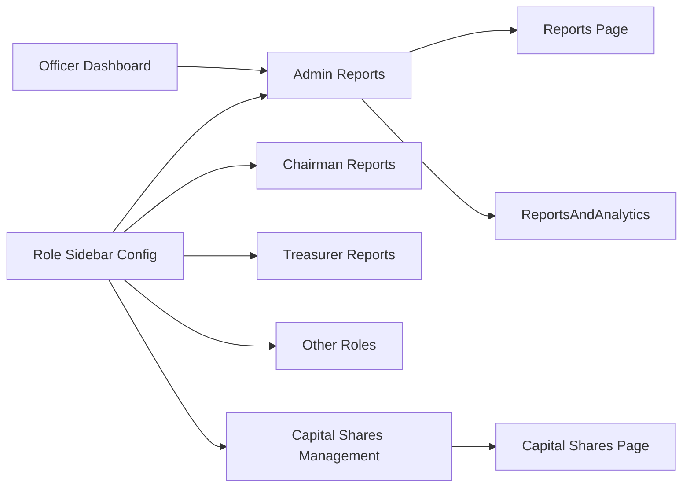

**Diagram sources**
- [Role Sidebar Config:52-56](file://lib/sidebarConfig.ts#L52-L56)
- [Officer Dashboard:14-72](file://components/admin/OfficerDashboard.tsx#L14-L72)
- [Reports Page:29-1079](file://app/admin/reports/page.tsx#L29-L1079)
- [ReportsAndAnalytics Component:31-48](file://components/admin/ReportsAndAnalytics.tsx#L31-L48)
- [Capital Shares Page:31-143](file://app/admin/capital-shares/page.tsx#L31-L143)

**Section sources**
- [Role Sidebar Config:29-262](file://lib/sidebarConfig.ts#L29-L262)
- [Officer Dashboard:1-198](file://components/admin/OfficerDashboard.tsx#L1-L198)
- [Reports Page:29-1079](file://app/admin/reports/page.tsx#L29-L1079)
- [ReportsAndAnalytics Component:31-48](file://components/admin/ReportsAndAnalytics.tsx#L31-L48)
- [Capital Shares Page:31-143](file://app/admin/capital-shares/page.tsx#L31-L143)

### Data Visualization and Summary Tables
**Enhanced Visualization Capabilities:**
- **Modern Dashboard**: Four summary cards with Lucide React icons (Users, DollarSign, Activity, TrendingUp)
- **Interactive Charts**: Recharts integration for bar charts (monthly trends) and pie charts (loan status distribution)
- **Responsive Design**: Mobile-first approach with grid layouts adapting to screen size
- **Real-time Currency Formatting**: Philippine Peso formatting with proper localization
- **Savings Leaderboards**: Interactive ranking system with podium-style display
- **Business Overview**: Bar charts with color-coded metrics for strategic insights
- **Capital Shares Visualization**: Professional-grade charts for capital shares status distribution and payment analytics

**Legacy Visualization:**
- Overview tab displays KPIs and placeholders for membership growth and financial trends
- Members tab shows role distribution with percentages
- Savings tab lists top savers and highlights totals and averages
- Loans tab presents status distribution and key portfolio metrics
- **Capital Shares tab**: Dedicated tab for capital shares reporting with status distribution and payment analytics

**Section sources**
- [ReportsAndAnalytics Component:212-330](file://components/admin/ReportsAndAnalytics.tsx#L212-L330)
- [SavingsLeaderboard Component:159-213](file://components/admin/SavingsLeaderboard.tsx#L159-L213)
- [Reports Page:550-1079](file://app/admin/reports/page.tsx#L550-L1079)
- [Capital Shares Page:916-994](file://app/admin/capital-shares/page.tsx#L916-L994)

### Automated Report Generation and Printing
**Enhanced Printing System:**
- **Modern Dashboard Printing**: Printable HTML reports from the enhanced dashboard with comprehensive styling
- **Legacy Print Functionality**: Comprehensive HTML print functionality with detailed styling and export options
- **Export Options**: PDF export capabilities through jspdf and jspdf-autotable libraries
- **Capital Shares Reports**: Dedicated printable reports for capital shares status and payment analytics

**Section sources**
- [ReportsAndAnalytics Component:233-454](file://components/admin/ReportsAndAnalytics.tsx#L233-L454)
- [Reports Page:233-454](file://app/admin/reports/page.tsx#L233-L454)
- [Capital Shares Page:233-454](file://app/admin/capital-shares/page.tsx#L233-L454)

### Export Functionality
**Current Export Capabilities:**
- **Print Mechanism**: Both dashboard and legacy report printing with comprehensive styling
- **PDF Export Pattern**: Demonstrated in loan details modal with jspdf integration
- **Future Enhancement Potential**: Ready infrastructure for CSV/Excel exports with proper formatting
- **Capital Shares Export**: Dedicated export functionality for capital shares reports and payment history

**Section sources**
- [ReportsAndAnalytics Component:233-454](file://components/admin/ReportsAndAnalytics.tsx#L233-L454)
- [Reports Page:233-454](file://app/admin/reports/page.tsx#L233-L454)
- [Capital Shares Page:233-454](file://app/admin/capital-shares/page.tsx#L233-L454)

### Examples, Customization, and Filtering
**Enhanced Filtering Options:**
- **Date Range Filtering**: Applied to loans and savings transactions in both components
- **Role-Based Filtering**: Member role filtering in the legacy reports page
- **Real-time Updates**: Dashboard updates immediately when filters change
- **Custom Report Creation**: Use filters (date range and role) to tailor datasets
- **Savings Filtering**: Monthly and yearly filtering for savings leaderboard
- **Capital Shares Filtering**: Search by member name/ID and status filtering for capital shares management
- **Individual Member Tracking**: Personalized capital shares view with payment form integration

**Section sources**
- [ReportsAndAnalytics Component:46-165](file://components/admin/ReportsAndAnalytics.tsx#L46-L165)
- [SavingsLeaderboard Component:139-237](file://components/admin/SavingsLeaderboard.tsx#L139-L237)
- [Reports Page:36-231](file://app/admin/reports/page.tsx#L36-L231)
- [Capital Shares Page:299-305](file://app/admin/capital-shares/page.tsx#L299-L305)
- [useCapitalShare Hook:35-104](file://hooks/useCapitalShare.ts#L35-L104)

### Report Scheduling, Distribution, and External Integration
- **Scheduling**: Not implemented in the current codebase; can be considered for future development
- **Distribution**: Printing and export provide internal distribution; external sharing can be achieved via saved PDFs
- **External Accounting Systems**: The system does not include direct integrations; future work could add APIs or batch exports for third-party systems
- **Capital Shares Integration**: Ready infrastructure for integrating capital shares data with external accounting systems

## Dependency Analysis
The enhanced reporting system depends on a comprehensive set of modern libraries and frameworks:

**Core Dependencies:**
- **Recharts v3.3.0**: Advanced data visualization and chart rendering with responsive container support
- **Lucide React v0.554.0**: Modern iconography with 554 available icons for dashboard components
- **React 19.2.0**: Latest React version with concurrent features and improved performance
- **Next.js 16.0.1**: Server-side rendering with enhanced performance and developer experience

**Supporting Libraries:**
- **Firebase v12.5.0**: Real-time database access with Firestore integration
- **React Hot Toast**: Notification system for user feedback
- **TypeScript 5**: Type-safe development with enhanced IDE support

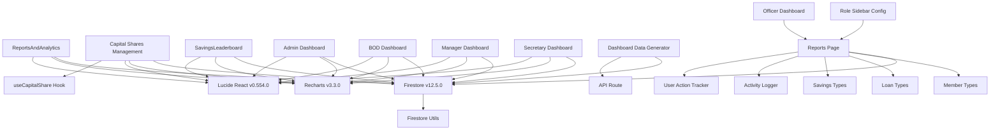

**Diagram sources**
- [ReportsAndAnalytics Component:3-6](file://components/admin/ReportsAndAnalytics.tsx#L3-L6)
- [Capital Shares Page:3-9](file://app/admin/capital-shares/page.tsx#L3-L9)
- [useCapitalShare Hook:3-5](file://hooks/useCapitalShare.ts#L3-L5)
- [SavingsLeaderboard Component:3-4](file://components/admin/SavingsLeaderboard.tsx#L3-L4)
- [Admin Dashboard:3-7](file://app/admin/dashboard/page.tsx#L3-L7)
- [BOD Dashboard:3-8](file://app/admin/bod/home/page.tsx#L3-L8)
- [Manager Dashboard:3-9](file://app/admin/manager/home/page.tsx#L3-L9)
- [Secretary Dashboard:3-9](file://app/admin/secretary/home/page.tsx#L3-L9)
- [Dashboard Data Generator:3-6](file://app/admin/dashboard-data/page.tsx#L3-L6)
- [Dashboard API Route:1-2](file://app/api/dashboard/initialize/route.ts#L1-L2)
- [Reports Page:3-7](file://app/admin/reports/page.tsx#L3-L7)
- [Firebase Utils:1-309](file://lib/firebase.ts#L1-L309)
- [Package Dependencies:16-39](file://package.json#L16-L39)

**Section sources**
- [ReportsAndAnalytics Component:3-6](file://components/admin/ReportsAndAnalytics.tsx#L3-L6)
- [Capital Shares Page:3-9](file://app/admin/capital-shares/page.tsx#L3-L9)
- [useCapitalShare Hook:3-5](file://hooks/useCapitalShare.ts#L3-L5)
- [SavingsLeaderboard Component:3-4](file://components/admin/SavingsLeaderboard.tsx#L3-L4)
- [Admin Dashboard:3-7](file://app/admin/dashboard/page.tsx#L3-L7)
- [BOD Dashboard:3-8](file://app/admin/bod/home/page.tsx#L3-L8)
- [Manager Dashboard:3-9](file://app/admin/manager/home/page.tsx#L3-L9)
- [Secretary Dashboard:3-9](file://app/admin/secretary/home/page.tsx#L3-L9)
- [Dashboard Data Generator:3-6](file://app/admin/dashboard-data/page.tsx#L3-L6)
- [Dashboard API Route:1-2](file://app/api/dashboard/initialize/route.ts#L1-L2)
- [Reports Page:3-7](file://app/admin/reports/page.tsx#L3-L7)
- [Firebase Utils:1-309](file://lib/firebase.ts#L1-L309)
- [Package Dependencies:16-39](file://package.json#L16-L39)

## Performance Considerations
The enhanced reporting system incorporates several performance optimizations:

- **Client-side Filtering and Computation**: Efficient processing of filtered datasets with memoization
- **Real-time Data Updates**: Firestore real-time listeners for immediate data synchronization
- **Responsive Design**: Mobile-first approach with adaptive grid layouts reducing layout thrashing
- **Skeleton Loading States**: Improved perceived performance during data loading
- **Chart Optimization**: Recharts components optimized for large datasets with virtualization support
- **Error Boundaries**: Comprehensive error handling preventing cascading failures
- **Memory Management**: Proper cleanup of Firestore listeners and event handlers
- **Parallel Data Fetching**: Promise.all for efficient multi-source data loading
- **Conditional Rendering**: Only renders components when data is available
- **Capital Shares Optimization**: Dedicated data processing for capital shares to prevent performance bottlenecks

## Troubleshooting Guide
Common issues and resolutions for the enhanced reporting system:

**Dashboard Component Issues:**
- **Empty or missing data**: Verify Firestore collections exist and documents are properly structured
- **Incorrect financial calculations**: Check loan status values and date field formats in Firestore
- **Chart rendering problems**: Ensure Recharts v3.3.0 and Lucide React v0.554.0 are properly installed
- **Loading state issues**: Verify Firestore connection and authentication state
- **Ranking algorithm errors**: Check member ID matching and transaction data validation

**Capital Shares Management Issues:**
- **Status calculation errors**: Verify capital shares payment data and required amount configuration
- **Payment form issues**: Check currency formatting and receipt number validation
- **Transaction history problems**: Verify transaction collection structure and date field formats
- **Individual member tracking errors**: Check member ID resolution and payment info extraction
- **Filtering problems**: Verify search term matching and status filter functionality

**SavingsLeaderboard Issues:**
- **Ranking inconsistencies**: Verify transaction data integrity and member ID matching
- **Filtering problems**: Check date range calculations and timezone handling
- **Performance issues**: Monitor Firestore query performance and consider indexing strategies

**Activity Logging Issues:**
- **Logs not appearing**: Confirm logging function is invoked and Firestore write permissions are configured
- **Query failures**: Check Firestore security rules and query syntax for date range filtering
- **Performance issues**: Implement proper indexing for timestamp fields in activityLogs collection

**Data Processing Errors:**
- **Currency formatting issues**: Verify Intl.NumberFormat support and Philippine Peso locale
- **Date range filtering problems**: Check timestamp field formats and timezone handling
- **Missing member/savings data**: Ensure proper nested collection structure in Firestore
- **Capital shares calculation errors**: Verify paymentInfo structure and required amount configuration

**Section sources**
- [ReportsAndAnalytics Component:159-165](file://components/admin/ReportsAndAnalytics.tsx#L159-L165)
- [Capital Shares Page:137-143](file://app/admin/capital-shares/page.tsx#L137-L143)
- [useCapitalShare Hook:94-100](file://hooks/useCapitalShare.ts#L94-L100)
- [SavingsLeaderboard Component:114-123](file://components/admin/SavingsLeaderboard.tsx#L114-L123)
- [Activity Logger:39-42](file://lib/activityLogger.ts#L39-L42)

## Conclusion
The SAMPA Cooperative Management System provides a robust foundation for comprehensive reporting and analytics with enhanced capabilities, now including **comprehensive capital shares management and reporting**:

**Enhanced Dashboard Analytics System:**
- **Modern Dashboard**: Sophisticated 333-line ReportsAndAnalytics component with real-time financial metrics and Recharts integration
- **Interactive Leaderboards**: Comprehensive SavingsLeaderboard component with real-time ranking and filtering
- **Capital Shares Management**: Dedicated interface for tracking member capital shares with payment history and status tracking
- **Individual Member Tracking**: Personalized capital shares view with useCapitalShare hook integration
- **Role-specific Interfaces**: Tailored dashboards for Board of Directors, Managers, and Secretaries with specialized analytics
- **Advanced Data Visualization**: Professional-grade charts with responsive containers and interactive tooltips
- **Real-time Processing**: Live calculation and display of financial indicators with skeleton loading states

**Comprehensive Analytics:**
- **Financial Metrics**: Complete coverage of receivables, loan status distribution, and savings analytics
- **Member Statistics**: Detailed role distribution and membership trends with interactive filtering
- **Loan Performance**: Comprehensive tracking of loan applications, approvals, and completions
- **Savings Analytics**: Top saver rankings with monthly and yearly filtering capabilities
- **Capital Shares Reporting**: Complete capital shares status tracking with payment history and analytics
- **Transaction-based Analytics**: Accurate calculations based on actual payment transactions

**Audit and Compliance:**
- **Activity Logging**: Comprehensive audit trail with flexible querying and compliance tracking
- **User Action Tracking**: Automated logging of system interactions with metadata capture
- **Error Handling**: Robust error states with user-friendly messaging and retry functionality
- **Capital Shares Audit Trail**: Complete payment history and status tracking for compliance

**Technical Excellence:**
- **Modern Dependencies**: Latest versions of React, Next.js, and supporting libraries
- **Performance Optimizations**: Responsive design, skeleton loading, and efficient data processing
- **Type Safety**: Comprehensive TypeScript integration with domain-specific interfaces
- **Real-time Data Processing**: Live updates with proper error handling and loading states
- **Scalable Architecture**: Modular design supporting future enhancements and feature additions

The system successfully bridges traditional reporting needs with modern dashboard capabilities, providing both familiar interfaces for existing users and innovative features for enhanced analytics. The comprehensive 333-line ReportsAndAnalytics component, the new SavingsLeaderboard component, and the **comprehensive Capital Shares Management System** serve as the cornerstones of this enhanced functionality, delivering real-time financial insights, interactive rankings, and **dedicated capital shares tracking** through sophisticated data visualization and comprehensive analytics.

The addition of capital shares reporting capabilities significantly enhances the system's ability to manage cooperative membership finances, providing both administrative oversight and member transparency. The dedicated Capital Shares Management System, individual member tracking through the useCapitalShare hook, and comprehensive reporting in the main Reports page demonstrate the system's commitment to providing complete financial management solutions for cooperative organizations.

Future enhancements can include automated report scheduling, expanded export formats, and deeper integration with external accounting systems, building upon the solid foundation established by this comprehensive reporting architecture with advanced business intelligence capabilities and **comprehensive capital shares management**.