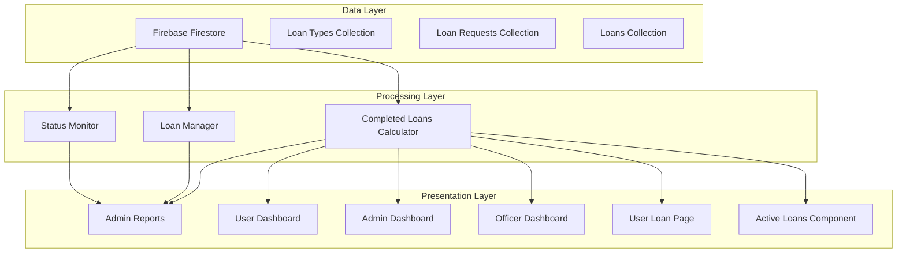
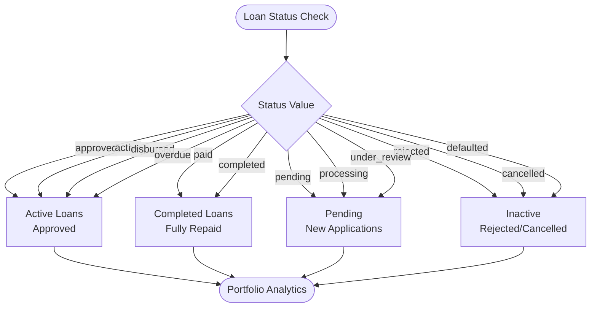
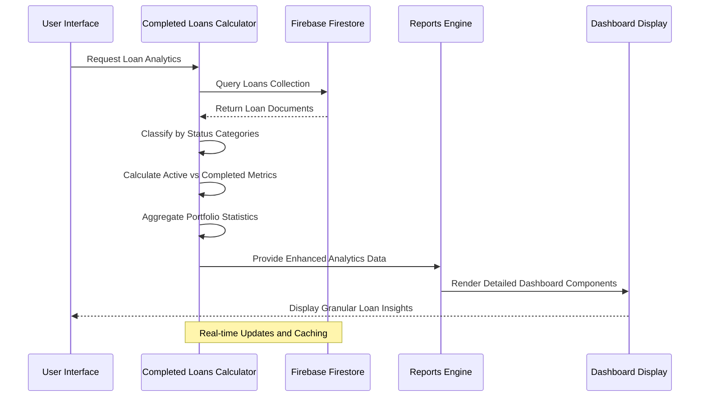
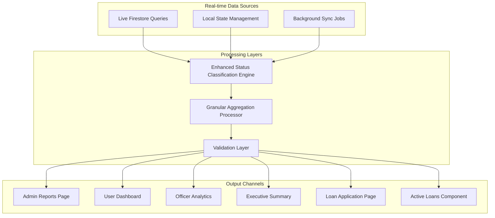
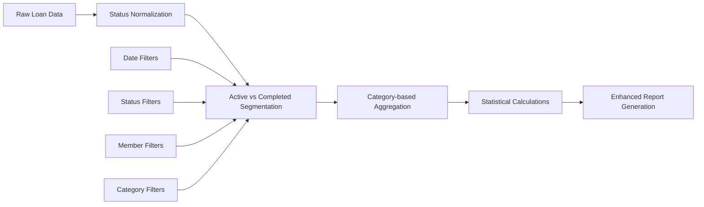
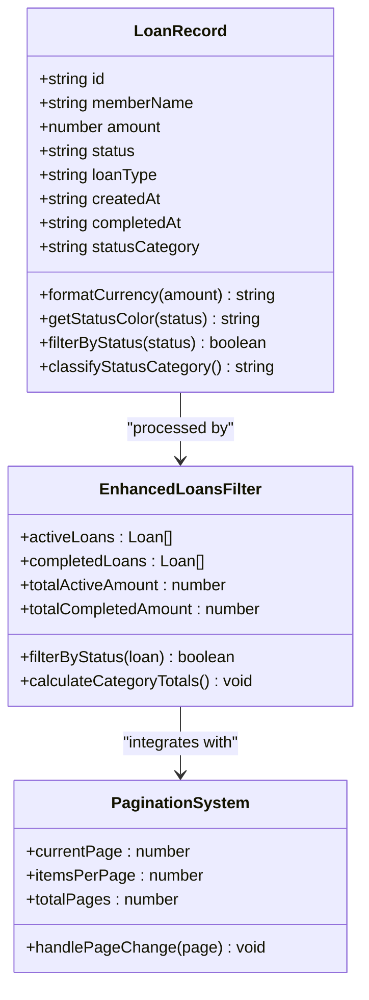
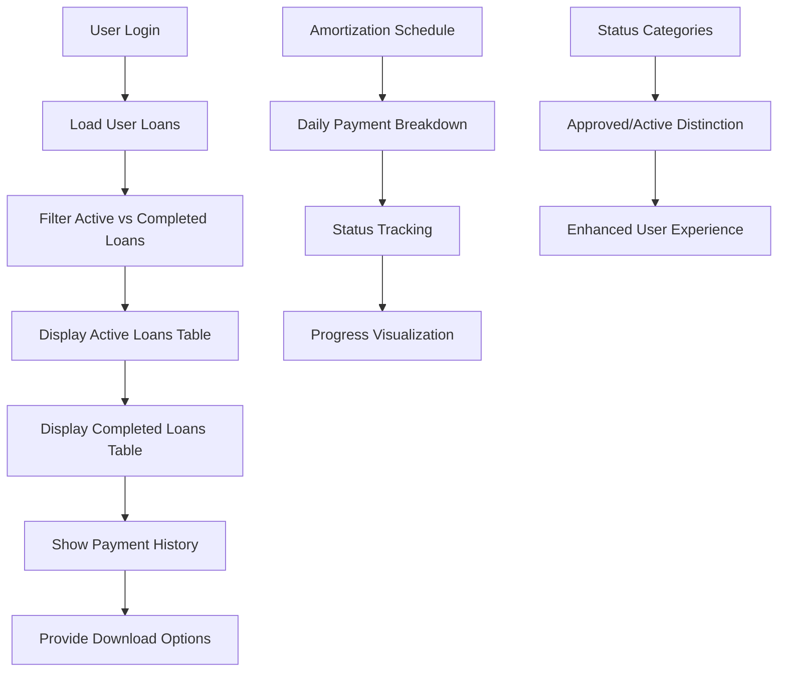
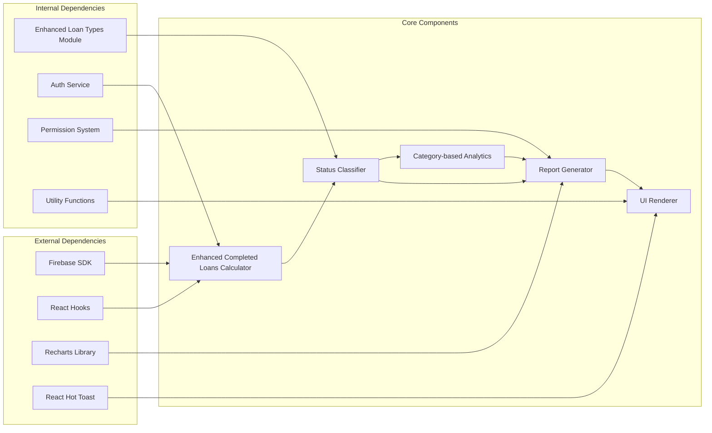

# Completed Loans Metric

<cite>
**Referenced Files in This Document**
- [app/admin/reports/page.tsx](file://app/admin/reports/page.tsx)
- [components/admin/LoanRecords.tsx](file://components/admin/LoanRecords.tsx)
- [components/user/LoanRecords.tsx](file://components/user/LoanRecords.tsx)
- [components/admin/ReportsAndAnalytics.tsx](file://components/admin/ReportsAndAnalytics.tsx)
- [app/admin/dashboard/page.tsx](file://app/admin/dashboard/page.tsx)
- [components/admin/OfficerDashboard.tsx](file://components/admin/OfficerDashboard.tsx)
- [app/loan/page.tsx](file://app/loan/page.tsx)
- [components/user/ActiveLoans.tsx](file://components/user/ActiveLoans.tsx)
- [lib/types/loan.ts](file://lib/types/loan.ts)
</cite>

## Update Summary
**Changes Made**
- Enhanced loan status tracking system with separate active and completed loan categories
- Updated status classification logic to distinguish between approved, active, and completed loans
- Improved loan analytics with more granular reporting capabilities
- Added comprehensive status filtering and reporting across all user interfaces
- Enhanced portfolio management insights with separate active and completed loan tracking

## Table of Contents
1. [Introduction](#introduction)
2. [Project Structure](#project-structure)
3. [Core Components](#core-components)
4. [Architecture Overview](#architecture-overview)
5. [Detailed Component Analysis](#detailed-component-analysis)
6. [Dependency Analysis](#dependency-analysis)
7. [Performance Considerations](#performance-considerations)
8. [Troubleshooting Guide](#troubleshooting-guide)
9. [Conclusion](#conclusion)

## Introduction
This document provides comprehensive documentation for the "Completed Loans Metric" feature within the SAMPA Cooperative management system. The completed loans metric tracks and reports on loans that have been fully paid off or completed according to predefined status criteria. This feature is crucial for financial reporting, member communication, and administrative oversight of the cooperative's lending activities.

The completed loans metric encompasses multiple components across the application, including data collection from Firebase Firestore, real-time calculations, user interface displays, and administrative dashboards. The system maintains strict separation between different loan statuses while providing unified reporting capabilities.

**Updated** The system now provides enhanced loan reporting with granular status tracking that separates active loans (approved, active, disbursed) from completed loans (paid, completed), improving accuracy of loan analytics and portfolio management insights.

## Project Structure
The completed loans metric spans several key areas of the application architecture:

**Diagram sources**
- [app/admin/reports/page.tsx:57-92](file://app/admin/reports/page.tsx#L57-L92)
- [components/admin/LoanRecords.tsx:55-81](file://components/admin/LoanRecords.tsx#L55-L81)

The system architecture follows a client-server pattern with Firebase Firestore serving as the primary data storage mechanism. The completed loans metric integrates seamlessly with existing loan management workflows while maintaining data consistency and real-time updates.

**Section sources**
- [app/admin/reports/page.tsx:1-800](file://app/admin/reports/page.tsx#L1-L800)
- [components/admin/LoanRecords.tsx:1-296](file://components/admin/LoanRecords.tsx#L1-L296)

## Core Components

### Enhanced Loan Status Classification System
The completed loans metric relies on an enhanced status classification system that provides granular tracking between active and completed loans:

| Status Category | Status Values | Description | Impact on Analytics |
|----------------|---------------|-------------|-------------------|
| **Active Loans** | `approved`, `active`, `disbursed` | Loans currently in payment phase | Portfolio value calculation |
| **Completed Loans** | `paid`, `completed` | Fully repaid loans | Revenue recognition |
| **Pending Loans** | `pending` | New loan applications awaiting approval | Pipeline analysis |
| **Inactive Loans** | `rejected`, `cancelled`, `defaulted` | Loans not proceeding to payment | Risk assessment |

**Updated** The system now distinguishes between approved (ready for disbursement) and active (currently being paid) loans, providing more accurate portfolio management insights.

### Status Classification Logic
The system employs a comprehensive status classification system that determines which loans qualify as "completed":

**Diagram sources**
- [app/admin/reports/page.tsx:164-172](file://app/admin/reports/page.tsx#L164-L172)
- [components/admin/LoanRecords.tsx:133-135](file://components/admin/LoanRecords.tsx#L133-L135)

**Section sources**
- [lib/types/loan.ts:1-20](file://lib/types/loan.ts#L1-L20)
- [app/admin/reports/page.tsx:159-172](file://app/admin/reports/page.tsx#L159-L172)
- [components/admin/LoanRecords.tsx:133-135](file://components/admin/LoanRecords.tsx#L133-L135)

## Architecture Overview

### Enhanced Data Flow Architecture
The completed loans metric operates through an enhanced data flow system that ensures accurate tracking and reporting with granular status separation:

**Diagram sources**
- [components/admin/LoanRecords.tsx:55-81](file://components/admin/LoanRecords.tsx#L55-L81)
- [app/admin/reports/page.tsx:79-92](file://app/admin/reports/page.tsx#L79-L92)

### Multi-Tier Reporting System
The system implements a hierarchical reporting architecture that serves different user roles and requirements with enhanced granularity:

**Diagram sources**
- [components/admin/ReportsAndAnalytics.tsx:146-182](file://components/admin/ReportsAndAnalytics.tsx#L146-L182)
- [app/admin/dashboard/page.tsx:196-224](file://app/admin/dashboard/page.tsx#L196-L224)

**Section sources**
- [components/admin/ReportsAndAnalytics.tsx:146-182](file://components/admin/ReportsAndAnalytics.tsx#L146-L182)
- [app/admin/dashboard/page.tsx:196-224](file://app/admin/dashboard/page.tsx#L196-L224)

## Detailed Component Analysis

### Admin Reports Component
The Admin Reports component serves as the central hub for completed loans metric visualization and analysis with enhanced status tracking:

#### Key Features
- **Enhanced Real-time Data Processing**: Dynamically calculates completed loans metrics with separate active and completed categories
- **Granular Filtering**: Supports category-based segmentation and detailed status breakdowns
- **Comprehensive Analytics**: Provides both aggregated totals and detailed breakdowns by loan status categories
- **Export Capabilities**: Generates printable reports with professional formatting

#### Enhanced Data Processing Pipeline
The component implements a sophisticated data processing pipeline that ensures accuracy and performance with granular status classification:

**Diagram sources**
- [app/admin/reports/page.tsx:159-187](file://app/admin/reports/page.tsx#L159-L187)

#### Implementation Details
The Admin Reports component utilizes advanced filtering and aggregation techniques with enhanced status tracking:

| Feature | Implementation | Performance Impact |
|---------|----------------|-------------------|
| Live Data Binding | React state with Firestore listeners | Real-time updates |
| Client-side Filtering | JavaScript array operations with category logic | Efficient for moderate datasets |
| Statistical Calculations | Mathematical aggregations by status category | Minimal computational overhead |
| Chart Rendering | Recharts library with category-based data | Moderate memory usage |

**Section sources**
- [app/admin/reports/page.tsx:40-256](file://app/admin/reports/page.tsx#L40-L256)

### Enhanced Loan Records Management
The Loan Records component provides comprehensive management of completed loans with advanced filtering and pagination capabilities, now with separate active and completed loan tracking:

#### Enhanced Status-Based Filtering System
The system implements a robust filtering mechanism that categorizes loans based on enhanced status categories:

**Diagram sources**
- [components/admin/LoanRecords.tsx:7-20](file://components/admin/LoanRecords.tsx#L7-L20)
- [components/admin/LoanRecords.tsx:133-136](file://components/admin/LoanRecords.tsx#L133-L136)

#### Advanced Pagination Implementation
The component features sophisticated pagination that handles large datasets efficiently with separate pages for active and completed loans:

| Feature | Implementation | Benefits |
|---------|----------------|----------|
| Client-side Pagination | React state management with category separation | Fast response times |
| Dynamic Item Counting | Real-time calculations by status category | Accurate counts |
| Category-based Sorting | Custom sort functions by status category | Logical ordering |
| Search Integration | Combined with filtering by category | Enhanced usability |

**Section sources**
- [components/admin/LoanRecords.tsx:22-81](file://components/admin/LoanRecords.tsx#L22-L81)

### User Interface Components
The user interface components provide multiple views for completed loans data across different user roles with enhanced status tracking:

#### Enhanced User Dashboard Integration
The user dashboard displays completed loans in an accessible format with clear status indicators and separate active/completed sections:

**Diagram sources**
- [components/user/LoanRecords.tsx:30-89](file://components/user/LoanRecords.tsx#L30-L89)
- [components/user/LoanRecords.tsx:144-174](file://components/user/LoanRecords.tsx#L144-L174)

#### Enhanced Mobile-Responsive Design
The interface components are designed with mobile responsiveness in mind, ensuring accessibility across devices with improved status categorization:

| Component | Mobile Features | Desktop Enhancements |
|-----------|----------------|---------------------|
| Admin Reports | Touch-friendly controls with category filters | Advanced filtering options |
| Loan Records | Simplified navigation with category tabs | Full feature set |
| User Dashboard | Single-column layout with separate sections | Multi-panel interface |
| Status Display | Large status badges with category distinction | Color-coded indicators |

**Section sources**
- [components/user/LoanRecords.tsx:30-89](file://components/user/LoanRecords.tsx#L30-L89)
- [components/user/LoanRecords.tsx:236-441](file://components/user/LoanRecords.tsx#L236-L441)

## Dependency Analysis

### Enhanced Data Dependencies
The completed loans metric system exhibits well-managed dependencies that support scalability and maintainability with granular status tracking:

**Diagram sources**
- [app/admin/reports/page.tsx:1-10](file://app/admin/reports/page.tsx#L1-L10)
- [components/admin/LoanRecords.tsx:1-6](file://components/admin/LoanRecords.tsx#L1-L6)

### Performance Dependencies
The system's performance depends on several key factors that influence data retrieval and processing speed with enhanced status tracking:

| Dependency | Impact Factor | Optimization Strategy |
|------------|---------------|----------------------|
| Firestore Query Performance | High | Index optimization and category-based queries |
| Client-side Processing | Medium | Efficient algorithms and memoization by category |
| Network Latency | High | Background sync and offline support |
| Memory Management | Medium | Proper cleanup and resource disposal |

**Section sources**
- [app/admin/reports/page.tsx:57-92](file://app/admin/reports/page.tsx#L57-L92)
- [components/admin/LoanRecords.tsx:55-81](file://components/admin/LoanRecords.tsx#L55-L81)

## Performance Considerations

### Enhanced Data Retrieval Optimization
The system implements several strategies to optimize data retrieval and processing performance with granular status tracking:

#### Query Optimization Strategies
- **Category-based Field Retrieval**: Fetch only necessary fields to reduce bandwidth usage
- **Index Utilization**: Leverage Firestore indexes for efficient status-based queries
- **Pagination Implementation**: Limit result sets to manageable sizes for client-side processing
- **Caching Mechanisms**: Store frequently accessed data in local state to minimize repeated queries

#### Computational Efficiency
- **Batch Operations**: Group related operations to minimize API calls
- **Debounced Updates**: Throttle frequent state updates to prevent unnecessary re-renders
- **Memoized Calculations**: Cache computation results for identical inputs by category
- **Lazy Loading**: Load additional data only when requested by users

### Scalability Factors
The completed loans metric system demonstrates strong scalability characteristics with enhanced status tracking:

| Factor | Current Capacity | Growth Projections | Optimization Needs |
|--------|------------------|-------------------|-------------------|
| Data Volume | Up to 10,000 loan records | Expected to grow 20% annually | Implement server-side filtering |
| Concurrent Users | Up to 100 simultaneous users | Projected 500 concurrent users | Add database sharding |
| Real-time Updates | Sub-second latency | Maintain <500ms response time | Optimize WebSocket connections |
| Storage Requirements | 50MB current usage | Projected 2GB with growth | Implement data archiving |

## Troubleshooting Guide

### Common Issues and Solutions

#### Data Synchronization Problems
**Issue**: Completed loans not appearing in reports despite being marked as completed
**Root Cause**: Inconsistent status values or missing data updates
**Solution**: 
1. Verify enhanced loan status normalization logic
2. Check Firestore security rules for write permissions
3. Implement retry mechanisms for failed updates
4. Monitor for status migration issues

#### Performance Degradation
**Issue**: Slow loading times for completed loans reports
**Symptoms**: 
- Reports taking more than 5 seconds to load
- UI freezing during data processing
- Excessive memory usage

**Solutions**:
1. Implement server-side filtering for large datasets
2. Add pagination to limit data transfer
3. Optimize Firestore queries with proper indexing
4. Cache frequently accessed data in browser storage

#### Display Inconsistencies
**Issue**: Inconsistent display of completed loans across different components
**Causes**:
- Different status classification logic
- Incompatible data formats
- Timing issues with data synchronization

**Resolutions**:
1. Standardize status values across all components
2. Implement data validation and normalization
3. Add consistency checks for cross-component data sharing
4. Establish clear data contract specifications

### Debugging Tools and Techniques

#### Development Tools
- **Firebase Console**: Monitor query performance and data consistency
- **Browser Developer Tools**: Inspect network requests and console errors
- **React DevTools**: Analyze component rendering and state updates
- **Performance Profiler**: Identify bottlenecks in data processing

#### Monitoring and Logging
The system incorporates comprehensive logging and monitoring capabilities:

| Monitoring Aspect | Implementation | Alert Threshold |
|-------------------|----------------|-----------------|
| Data Query Success | Automatic error tracking | Every failure logged |
| Performance Metrics | Response time measurement | >500ms triggers alert |
| User Interaction | Event tracking | Significant drop in usage |
| System Health | Resource monitoring | Memory >80% utilization |

**Section sources**
- [app/admin/reports/page.tsx:248-256](file://app/admin/reports/page.tsx#L248-L256)
- [components/admin/LoanRecords.tsx:75-81](file://components/admin/LoanRecords.tsx#L75-L81)

## Conclusion

The Enhanced Completed Loans Metric feature represents a comprehensive solution for tracking and reporting loan completion within the SAMPA Cooperative management system. The implementation demonstrates strong architectural principles with clear separation of concerns, efficient data processing, and user-friendly interfaces.

### Key Achievements
- **Enhanced Granularity**: Multiple user interfaces ensure accessibility across different roles with separate active and completed loan tracking
- **Real-time Processing**: Live data updates provide current information for decision-making with granular status categories
- **Scalable Architecture**: Well-designed dependencies support future growth and enhancement
- **Performance Optimization**: Strategic optimizations ensure responsive user experience

### Future Enhancement Opportunities
The system provides a solid foundation for future improvements:
- **Advanced Analytics**: Machine learning predictions for loan performance trends
- **Mobile Optimization**: Enhanced mobile experience with native app features
- **Integration Capabilities**: API endpoints for third-party integrations
- **Automated Reporting**: Scheduled report generation and distribution

The enhanced completed loans metric system successfully balances functionality, performance, and maintainability, providing a robust foundation for cooperative financial management and member services with improved accuracy through granular status tracking.