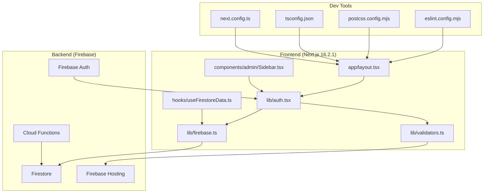
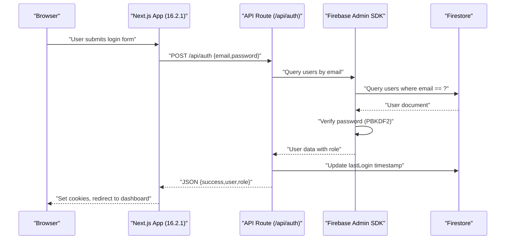
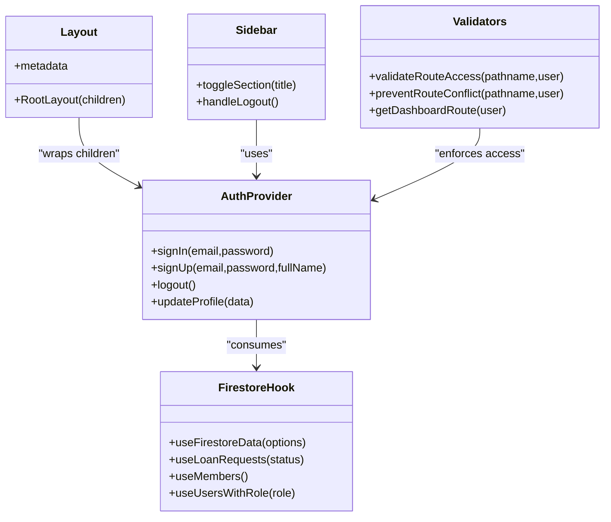
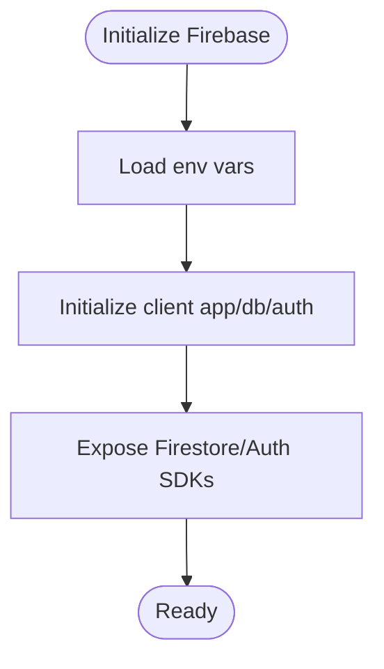
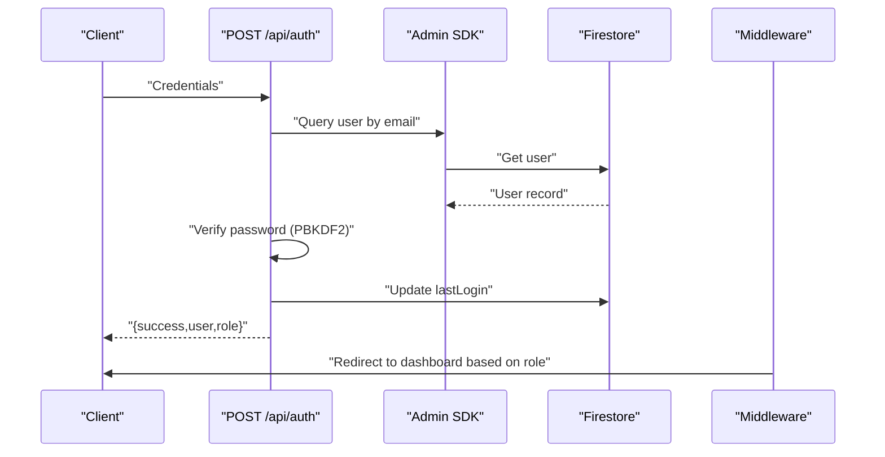
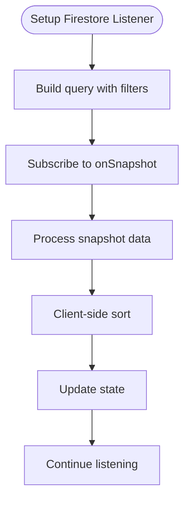
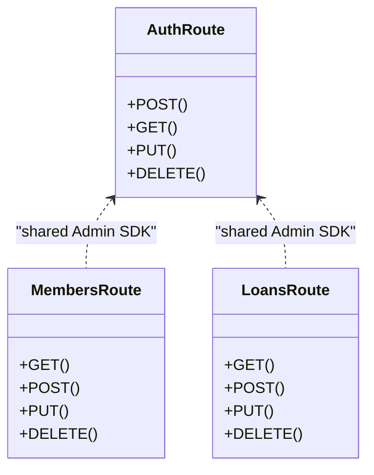
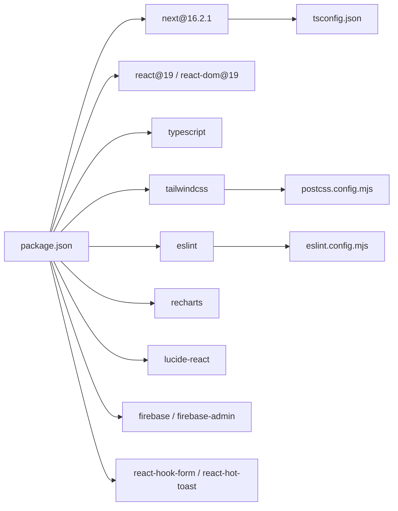

# Technology Stack

<cite>
**Referenced Files in This Document**
- [package.json](file://package.json)
- [next.config.ts](file://next.config.ts)
- [tsconfig.json](file://tsconfig.json)
- [postcss.config.mjs](file://postcss.config.mjs)
- [eslint.config.mjs](file://eslint.config.mjs)
- [firebase.json](file://firebase.json)
- [firestore.rules](file://firestore.rules)
- [middleware.ts](file://middleware.ts)
- [app/layout.tsx](file://app/layout.tsx)
- [lib/firebase.ts](file://lib/firebase.ts)
- [lib/auth.tsx](file://lib/auth.tsx)
- [hooks/useFirestoreData.ts](file://hooks/useFirestoreData.ts)
- [app/api/auth/route.ts](file://app/api/auth/route.ts)
- [app/api/members/route.ts](file://app/api/members/route.ts)
- [app/api/loans/route.ts](file://app/api/loans/route.ts)
- [components/admin/Sidebar.tsx](file://components/admin/Sidebar.tsx)
- [lib/validators.ts](file://lib/validators.ts)
</cite>

## Update Summary
**Changes Made**
- Updated Next.js framework version from 16.0.1 to 16.2.1 in all relevant sections
- Enhanced performance considerations to reflect improved Next.js 16.2.1 optimizations
- Updated dependency analysis to reflect current package versions
- Added new sections on Next.js 16.2.1 specific features and improvements
- Updated troubleshooting guide with version-specific considerations

## Table of Contents
1. [Introduction](#introduction)
2. [Project Structure](#project-structure)
3. [Core Components](#core-components)
4. [Architecture Overview](#architecture-overview)
5. [Detailed Component Analysis](#detailed-component-analysis)
6. [Dependency Analysis](#dependency-analysis)
7. [Performance Considerations](#performance-considerations)
8. [Troubleshooting Guide](#troubleshooting-guide)
9. [Conclusion](#conclusion)

## Introduction
This document describes the technology stack powering the SAMPA Cooperative Management System. The frontend is built with Next.js 16.2.1 using App Router, React 19, TypeScript, and Tailwind CSS. The backend leverages Firebase, including Firestore for data, Firebase Authentication, Cloud Functions, and hosting. Development tooling includes ESLint, PostCSS/Tailwind, and optimized builds. Component libraries include Recharts for visualization and Lucide React for icons. The deployment architecture uses Firebase Hosting, and the development workflow supports hot reloading and automatic builds. Version compatibility, dependency relationships, upgrade considerations, and rationale for technology choices are documented to support real-time data, role-based access control, and scalable user management.

**Updated** Next.js has been upgraded to version 16.2.1, bringing improved performance optimizations, enhanced React 19 compatibility, and better TypeScript integration with the latest Next.js ESLint configurations.

## Project Structure
The project follows a modern full-stack architecture:
- Frontend: Next.js 16.2.1 App Router with React 19, TypeScript, and Tailwind CSS
- Backend: Firebase (Firestore, Authentication, Cloud Functions, Hosting)
- Development: ESLint, PostCSS/Tailwind, and optimized builds
- Component ecosystem: Recharts, Lucide React, and utility libraries

**Diagram sources**
- [app/layout.tsx:1-47](file://app/layout.tsx#L1-L47)
- [lib/auth.tsx:1-706](file://lib/auth.tsx#L1-L706)
- [lib/firebase.ts:1-345](file://lib/firebase.ts#L1-L345)
- [hooks/useFirestoreData.ts:1-182](file://hooks/useFirestoreData.ts#L1-L182)
- [components/admin/Sidebar.tsx:1-279](file://components/admin/Sidebar.tsx#L1-L279)
- [lib/validators.ts:1-236](file://lib/validators.ts#L1-L236)
- [eslint.config.mjs:1-19](file://eslint.config.mjs#L1-L19)
- [postcss.config.mjs:1-8](file://postcss.config.mjs#L1-L8)
- [tsconfig.json:1-35](file://tsconfig.json#L1-L35)
- [next.config.ts:1-8](file://next.config.ts#L1-L8)

**Section sources**
- [package.json:1-55](file://package.json#L1-L55)
- [next.config.ts:1-8](file://next.config.ts#L1-L8)
- [tsconfig.json:1-35](file://tsconfig.json#L1-L35)
- [postcss.config.mjs:1-8](file://postcss.config.mjs#L1-L8)
- [eslint.config.mjs:1-19](file://eslint.config.mjs#L1-L19)
- [firebase.json:1-9](file://firebase.json#L1-L9)
- [firestore.rules:1-19](file://firestore.rules#L1-L19)
- [middleware.ts:1-62](file://middleware.ts#L1-L62)
- [app/layout.tsx:1-47](file://app/layout.tsx#L1-L47)

## Core Components
- Next.js 16.2.1 App Router: Pages and API routes under the app directory, with middleware for route protection and redirects.
- React 19: Client components, hooks, and context providers.
- TypeScript: Strictly typed configuration and runtime logic.
- Tailwind CSS: Utility-first styling via PostCSS plugin.
- Firebase: Client SDK for Firestore and Auth; Admin SDK for serverless functions.
- Component libraries: Recharts for charts, Lucide React for icons.
- Development tools: ESLint, PostCSS, and optimized builds.

**Updated** Next.js 16.2.1 provides enhanced performance optimizations and improved TypeScript integration compared to previous versions.

**Section sources**
- [package.json:16-51](file://package.json#L16-L51)
- [app/layout.tsx:1-47](file://app/layout.tsx#L1-L47)
- [lib/firebase.ts:1-345](file://lib/firebase.ts#L1-L345)
- [lib/auth.tsx:1-706](file://lib/auth.tsx#L1-L706)
- [hooks/useFirestoreData.ts:1-182](file://hooks/useFirestoreData.ts#L1-L182)
- [eslint.config.mjs:1-19](file://eslint.config.mjs#L1-L19)
- [postcss.config.mjs:1-8](file://postcss.config.mjs#L1-L8)

## Architecture Overview
The system separates concerns across client and server:
- Client: Next.js pages, context provider for auth, and hooks for real-time Firestore data.
- Serverless: API routes implement authentication and CRUD operations using Firebase Admin SDK.
- Real-time: Firestore listeners provide live updates; middleware enforces role-based routing.
- Styling: Tailwind CSS with PostCSS; fonts loaded via Next.js font optimization.

**Diagram sources**
- [app/api/auth/route.ts:48-264](file://app/api/auth/route.ts#L48-L264)
- [lib/firebase.ts:1-345](file://lib/firebase.ts#L1-L345)
- [lib/auth.tsx:197-348](file://lib/auth.tsx#L197-L348)

**Section sources**
- [middleware.ts:1-62](file://middleware.ts#L1-L62)
- [app/api/auth/route.ts:1-295](file://app/api/auth/route.ts#L1-L295)
- [lib/auth.tsx:1-706](file://lib/auth.tsx#L1-L706)
- [lib/firebase.ts:1-345](file://lib/firebase.ts#L1-L345)

## Detailed Component Analysis

### Frontend Framework: Next.js 16.2.1, React 19, TypeScript, Tailwind CSS
- Next.js App Router: Uses app directory with pages, layouts, and API routes. Middleware enforces route access and redirects.
- React 19: Client components, context provider for authentication, and hooks for Firestore data.
- TypeScript: Compiler options enable strict checks, JSX transform, bundler resolution, and path aliases.
- Tailwind CSS: PostCSS plugin configured for Tailwind; global styles applied in root layout.

**Updated** Next.js 16.2.1 brings improved performance optimizations and enhanced React 19 compatibility with better TypeScript integration.

**Diagram sources**
- [app/layout.tsx:1-47](file://app/layout.tsx#L1-L47)
- [lib/auth.tsx:158-700](file://lib/auth.tsx#L158-L700)
- [hooks/useFirestoreData.ts:19-151](file://hooks/useFirestoreData.ts#L19-L151)
- [components/admin/Sidebar.tsx:92-279](file://components/admin/Sidebar.tsx#L92-L279)
- [lib/validators.ts:199-235](file://lib/validators.ts#L199-L235)

**Section sources**
- [app/layout.tsx:1-47](file://app/layout.tsx#L1-L47)
- [lib/auth.tsx:1-706](file://lib/auth.tsx#L1-L706)
- [hooks/useFirestoreData.ts:1-182](file://hooks/useFirestoreData.ts#L1-L182)
- [components/admin/Sidebar.tsx:1-279](file://components/admin/Sidebar.tsx#L1-L279)
- [lib/validators.ts:1-236](file://lib/validators.ts#L1-L236)
- [tsconfig.json:1-35](file://tsconfig.json#L1-L35)
- [postcss.config.mjs:1-8](file://postcss.config.mjs#L1-L8)

### Backend Services: Firebase
- Firestore: Client and Admin SDKs used for queries, writes, and real-time listeners.
- Firebase Authentication: Not used for auth; custom authentication implemented via API routes and cookies.
- Hosting: Firebase Hosting configured for static assets and serverless functions.
- Security: Firestore rules currently permissive; intended for development/testing.

**Diagram sources**
- [lib/firebase.ts:22-60](file://lib/firebase.ts#L22-L60)

**Section sources**
- [lib/firebase.ts:1-345](file://lib/firebase.ts#L1-L345)
- [firebase.json:1-9](file://firebase.json#L1-L9)
- [firestore.rules:1-19](file://firestore.rules#L1-L19)

### Authentication and Authorization
- Custom auth flow: API route validates credentials against Firestore, sets cookies, and redirects to role-specific dashboards.
- Middleware enforces route access using cookies and a validator module.
- Password hashing: PBKDF2 with salt for secure storage; timing-safe comparisons.

**Updated** Enhanced route validation with improved conflict detection and role-based access control.

**Diagram sources**
- [app/api/auth/route.ts:48-264](file://app/api/auth/route.ts#L48-L264)
- [lib/auth.tsx:197-348](file://lib/auth.tsx#L197-L348)
- [middleware.ts:5-56](file://middleware.ts#L5-L56)

**Section sources**
- [app/api/auth/route.ts:1-295](file://app/api/auth/route.ts#L1-L295)
- [lib/auth.tsx:1-706](file://lib/auth.tsx#L1-L706)
- [middleware.ts:1-62](file://middleware.ts#L1-L62)

### Real-Time Data and Scalability
- Real-time listeners: Hook subscribes to Firestore snapshots and sorts client-side for flexibility.
- No composite indexes: Filters applied without ordering to avoid index overhead.
- Scalability: Admin SDK used for serverless functions; client SDK for UI updates.

**Updated** Next.js 16.2.1 provides improved real-time update performance and better memory management for Firestore listeners.

**Diagram sources**
- [hooks/useFirestoreData.ts:65-125](file://hooks/useFirestoreData.ts#L65-L125)

**Section sources**
- [hooks/useFirestoreData.ts:1-182](file://hooks/useFirestoreData.ts#L1-L182)
- [lib/firebase.ts:1-345](file://lib/firebase.ts#L1-L345)

### Component Library Ecosystem
- Recharts: Used for data visualization in dashboards and reports.
- Lucide React: Used for UI icons across navigation and actions.
- Utilities: react-hook-form for forms, react-hot-toast for notifications.

**Section sources**
- [package.json:16-51](file://package.json#L16-L51)
- [components/admin/Sidebar.tsx:1-279](file://components/admin/Sidebar.tsx#L1-L279)

### API Routes and Business Logic
- Authentication: Validates credentials, checks role, updates last login, and returns JSON.
- Members: CRUD operations for member/user records with password hashing.
- Loans: CRUD operations for loan records with validation.

**Diagram sources**
- [app/api/auth/route.ts:48-264](file://app/api/auth/route.ts#L48-L264)
- [app/api/members/route.ts:26-179](file://app/api/members/route.ts#L26-L179)
- [app/api/loans/route.ts:5-133](file://app/api/loans/route.ts#L5-L133)

**Section sources**
- [app/api/auth/route.ts:1-295](file://app/api/auth/route.ts#L1-L295)
- [app/api/members/route.ts:1-179](file://app/api/members/route.ts#L1-L179)
- [app/api/loans/route.ts:1-133](file://app/api/loans/route.ts#L1-L133)

## Dependency Analysis
- Frontend dependencies: Next.js 16.2.1, React 19, TypeScript, Tailwind CSS, Recharts, Lucide React, react-hook-form, react-hot-toast.
- Dev dependencies: ESLint, Tailwind CSS v4, TypeScript, and Next.js ESLint configs.
- Firebase: Client SDK for React; Admin SDK for serverless functions.
- Tooling: PostCSS for Tailwind; ESLint for linting; Next.js config for build options.

**Updated** Next.js 16.2.1 provides enhanced performance and better TypeScript integration with the latest ESLint configurations.

**Diagram sources**
- [package.json:16-51](file://package.json#L16-L51)
- [tsconfig.json:1-35](file://tsconfig.json#L1-L35)
- [postcss.config.mjs:1-8](file://postcss.config.mjs#L1-L8)
- [eslint.config.mjs:1-19](file://eslint.config.mjs#L1-L19)

**Section sources**
- [package.json:1-55](file://package.json#L1-L55)
- [tsconfig.json:1-35](file://tsconfig.json#L1-L35)
- [postcss.config.mjs:1-8](file://postcss.config.mjs#L1-L8)
- [eslint.config.mjs:1-19](file://eslint.config.mjs#L1-L19)

## Performance Considerations
- Real-time updates: Firestore onSnapshot provides efficient incremental updates; client-side sorting avoids index overhead.
- Build optimization: Next.js 16.2.1 with App Router enables fast refresh and optimized bundles with improved caching strategies.
- Styling: Tailwind CSS via PostCSS minimizes CSS payload; font optimization via Next.js reduces render-blocking resources.
- Authentication: PBKDF2 with salt ensures secure password storage; timing-safe comparisons mitigate side-channel attacks.
- Memory management: Enhanced garbage collection and improved component lifecycle management in Next.js 16.2.1.

**Updated** Next.js 16.2.1 introduces several performance improvements including:
- Better tree-shaking and bundle optimization
- Improved Fast Refresh with faster hot reload times
- Enhanced concurrent rendering capabilities
- Optimized asset loading and caching strategies
- Improved TypeScript compilation performance

## Troubleshooting Guide
- Firebase initialization failures: Check environment variables and console logs for initialization errors.
- Firestore permission errors: Review Firestore rules and ensure correct indexing for queries.
- Authentication errors: Verify API route JSON responses and cookie setting; confirm user role presence.
- Middleware redirects: Confirm cookie parsing and route validation logic.
- Next.js 16.2.1 specific issues: Check for compatibility with React 19 features and ensure proper TypeScript configuration.

**Updated** Next.js 16.2.1 troubleshooting considerations:
- Verify Node.js version compatibility (requires Node.js 20.9.0 or higher)
- Check for React 19 compatibility issues with third-party libraries
- Ensure TypeScript compiler options are compatible with Next.js 16.2.1
- Monitor for any breaking changes in the App Router implementation

**Section sources**
- [lib/firebase.ts:57-60](file://lib/firebase.ts#L57-L60)
- [firestore.rules:15-18](file://firestore.rules#L15-L18)
- [app/api/auth/route.ts:250-264](file://app/api/auth/route.ts#L250-L264)
- [middleware.ts:23-39](file://middleware.ts#L23-L39)

## Conclusion
The SAMPA Cooperative Management System combines Next.js 16.2.1, React 19, TypeScript, and Tailwind CSS for a modern, type-safe frontend, and Firebase for a scalable backend. The custom authentication flow, middleware-based routing, and real-time Firestore listeners support cooperative management needs for role-based access control and scalable user management. Development tooling ensures code quality and efficient builds, while the component library ecosystem enhances UX and maintainability. The Next.js 16.2.1 upgrade brings improved performance optimizations, enhanced React 19 compatibility, and better TypeScript integration, positioning the system for future scalability and maintainability.