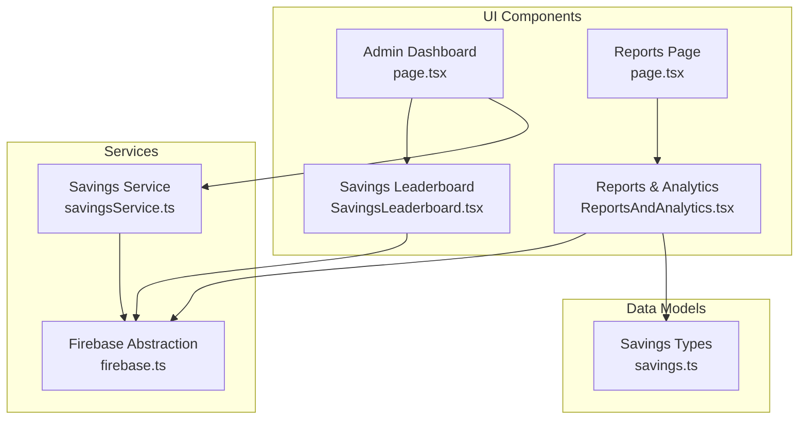
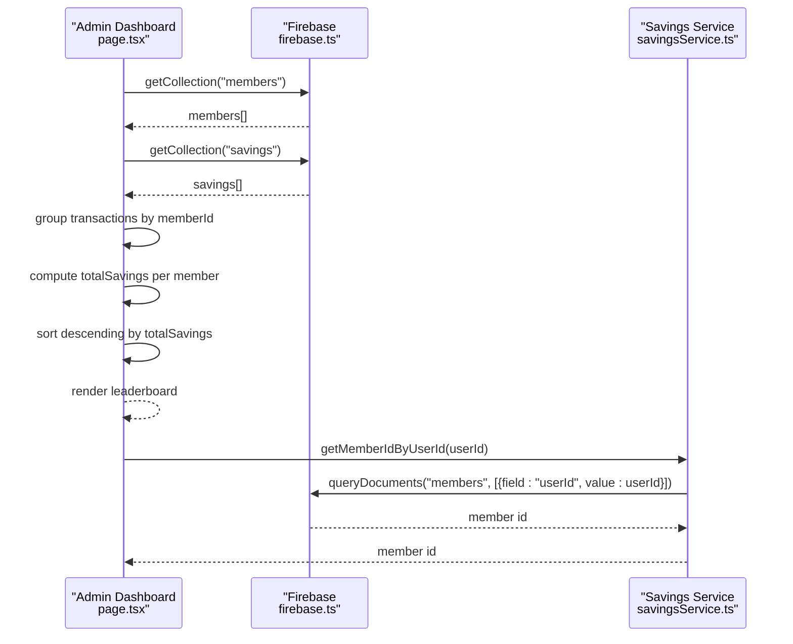
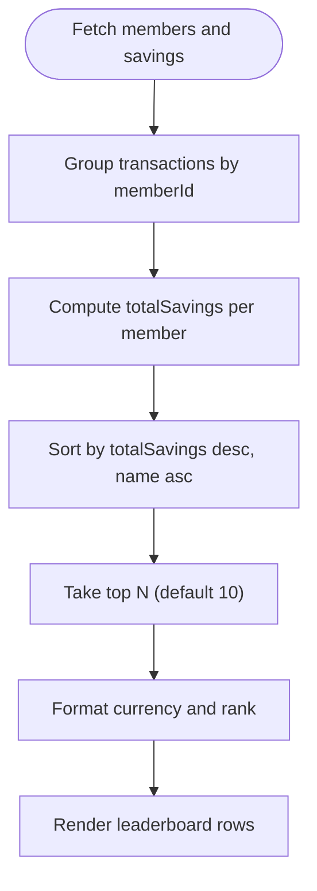
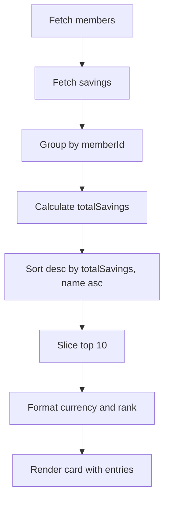
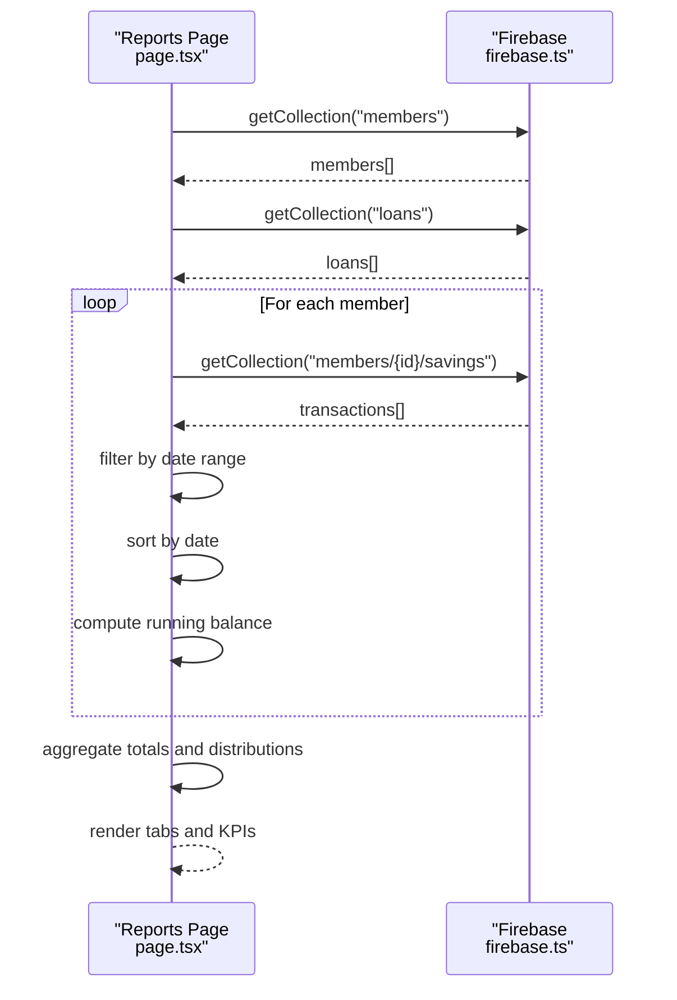
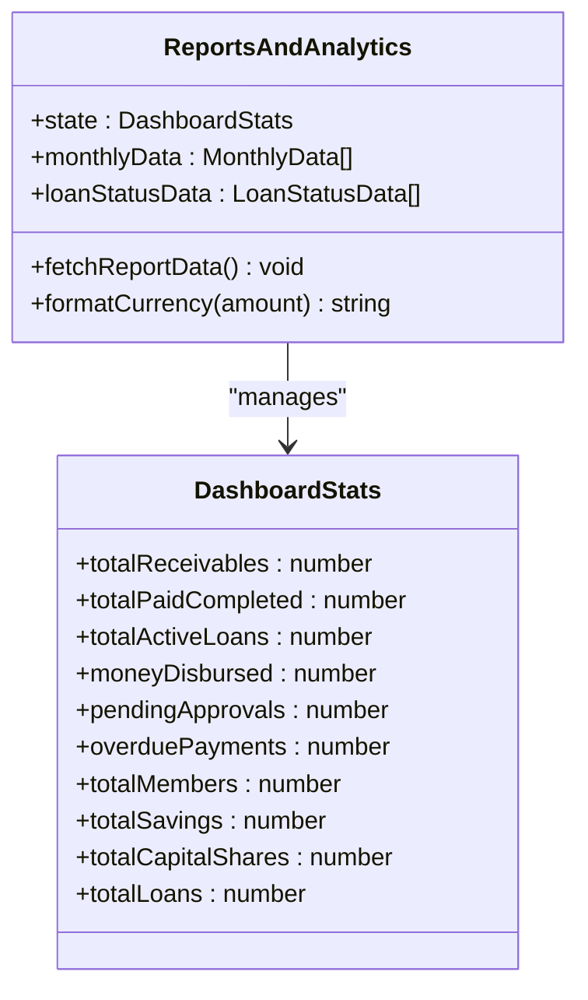
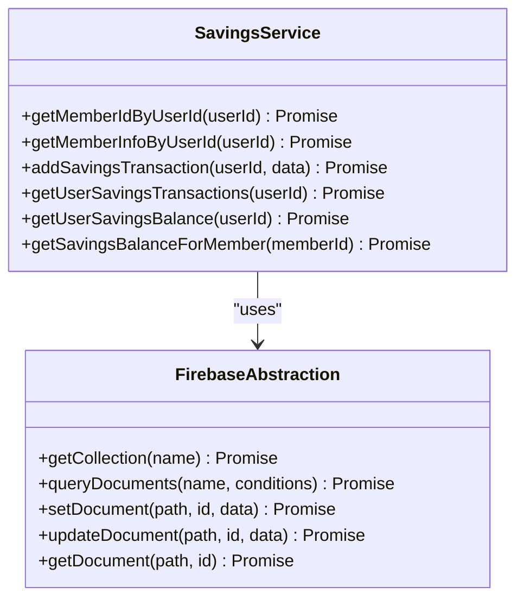
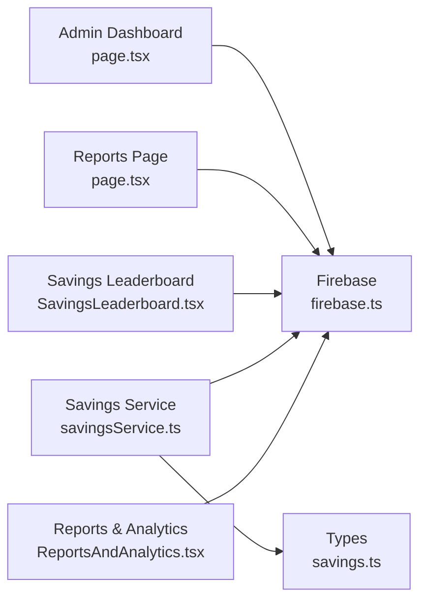

# Savings Leaderboard & Analytics

<cite>
**Referenced Files in This Document**
- [SavingsLeaderboard.tsx](file://components/admin/SavingsLeaderboard.tsx)
- [page.tsx](file://app/admin/dashboard/page.tsx)
- [page.tsx](file://app/admin/reports/page.tsx)
- [ReportsAndAnalytics.tsx](file://components/admin/ReportsAndAnalytics.tsx)
- [savingsService.ts](file://lib/savingsService.ts)
- [firebase.ts](file://lib/firebase.ts)
- [savings.ts](file://lib/types/savings.ts)
</cite>

## Update Summary
**Changes Made**
- Updated Savings Leaderboard component to reflect streamlined functionality with simplified state initialization
- Removed references to totalCapitalShares and totalLoans calculation variables from leaderboard components
- Clarified that dashboard was simplified by removing unified metrics overview and advanced data processing features
- Enhanced documentation for improved error handling and loading states
- Maintained comprehensive analytics capabilities in Reports & Analytics component

## Table of Contents
1. [Introduction](#introduction)
2. [Project Structure](#project-structure)
3. [Core Components](#core-components)
4. [Architecture Overview](#architecture-overview)
5. [Detailed Component Analysis](#detailed-component-analysis)
6. [Dependency Analysis](#dependency-analysis)
7. [Performance Considerations](#performance-considerations)
8. [Troubleshooting Guide](#troubleshooting-guide)
9. [Conclusion](#conclusion)

## Introduction
This document explains the Savings Leaderboard and Analytics system, focusing on how member savings performance is calculated, ranked, and displayed. The system has been streamlined to focus on core savings metrics while maintaining comprehensive analytics capabilities. It covers the leaderboard ranking algorithm, real-time data processing, sorting criteria, display formatting by cooperative roles, and the analytics dashboard components that summarize cooperative financial health.

**Updated** The system has undergone simplification to improve performance and maintainability while preserving essential functionality for cooperative management.

## Project Structure
The Savings Leaderboard and Analytics system spans several components with streamlined functionality:
- Admin dashboard with integrated savings leaderboard focused on core metrics
- Reports page with comprehensive analytics including capital shares and loans
- Savings service utilities for transaction processing and member lookups
- Firebase abstraction layer for Firestore operations
- Standalone Savings leaderboard component for lightweight displays

**Diagram sources**
- [page.tsx:88-796](file://app/admin/dashboard/page.tsx#L88-L796)
- [page.tsx:29-800](file://app/admin/reports/page.tsx#L29-L800)
- [SavingsLeaderboard.tsx:32-213](file://components/admin/SavingsLeaderboard.tsx#L32-L213)
- [ReportsAndAnalytics.tsx:34-356](file://components/admin/ReportsAndAnalytics.tsx#L34-L356)
- [savingsService.ts:1-669](file://lib/savingsService.ts#L1-L669)
- [firebase.ts:89-384](file://lib/firebase.ts#L89-L384)
- [savings.ts:1-22](file://lib/types/savings.ts#L1-L22)

**Section sources**
- [page.tsx:1-796](file://app/admin/dashboard/page.tsx#L1-L796)
- [page.tsx:1-800](file://app/admin/reports/page.tsx#L1-L800)
- [SavingsLeaderboard.tsx:1-213](file://components/admin/SavingsLeaderboard.tsx#L1-L213)
- [ReportsAndAnalytics.tsx:1-356](file://components/admin/ReportsAndAnalytics.tsx#L1-L356)
- [savingsService.ts:1-669](file://lib/savingsService.ts#L1-L669)
- [firebase.ts:1-384](file://lib/firebase.ts#L1-L384)
- [savings.ts:1-22](file://lib/types/savings.ts#L1-L22)

## Core Components
- **Streamlined Savings Leaderboard**: Aggregates savings transactions across collections, computes totals per member, sorts by total savings descending, and displays top performers with role-aware formatting. Simplified to focus on core savings metrics only.
- **Standalone Savings Leaderboard Component**: Lightweight leaderboard that fetches members and savings data, computes totals, sorts, and formats currency without complex state initialization.
- **Comprehensive Reports Page**: Analytics with filters for date range and role, aggregations for members, savings, capital shares, and loans, and printable export.
- **Savings Service**: Provides member lookup by user ID, atomic savings transaction processing, and balance calculation helpers.
- **Firebase Abstraction**: Centralized Firestore operations with robust error handling and validation.

**Updated** The leaderboard components now feature simplified state initialization and enhanced error handling for improved reliability.

**Section sources**
- [page.tsx:68-796](file://app/admin/dashboard/page.tsx#L68-L796)
- [SavingsLeaderboard.tsx:20-132](file://components/admin/SavingsLeaderboard.tsx#L20-L132)
- [page.tsx:29-800](file://app/admin/reports/page.tsx#L29-L800)
- [savingsService.ts:21-669](file://lib/savingsService.ts#L21-L669)
- [firebase.ts:89-384](file://lib/firebase.ts#L89-L384)

## Architecture Overview
The system retrieves data from Firestore collections, normalizes and aggregates savings transactions, and renders interactive dashboards and reports. Real-time updates occur when components re-run their data-fetching effects. The savings leaderboard functionality has been streamlined to focus on core metrics while maintaining comprehensive analytics.

**Updated** The architecture now emphasizes simplicity and performance through streamlined data processing and reduced state complexity.

**Diagram sources**
- [page.tsx:164-525](file://app/admin/dashboard/page.tsx#L164-L525)
- [firebase.ts:148-182](file://lib/firebase.ts#L148-L182)
- [savingsService.ts:21-135](file://lib/savingsService.ts#L21-L135)

## Detailed Component Analysis

### Streamlined Savings Leaderboard (Admin Dashboard)
- **Data sources**: members and savings collections
- **Aggregation**: sums deposits and subtracts withdrawals per member
- **Sorting**: total savings descending; name ascending for ties
- **Display**: top 10 with role-aware badges and currency formatting
- **State initialization**: Simplified to focus on core metrics only
- **Filtering**: time period filter (all/daily/monthly/yearly) applied to leaderboard subset
- **Error handling**: Enhanced with comprehensive error handling and loading states

**Updated** State initialization has been streamlined to maintain core metrics while simplifying data processing pipeline. The component now focuses exclusively on savings performance without complex state initialization for capital shares and loans.

**Diagram sources**
- [page.tsx:424-495](file://app/admin/dashboard/page.tsx#L424-L495)

**Section sources**
- [page.tsx:68-796](file://app/admin/dashboard/page.tsx#L68-L796)

### Standalone Savings Leaderboard Component
- **Data sources**: members and savings collections
- **Aggregation**: sums deposits and subtracts withdrawals per member
- **Sorting**: total savings descending; name ascending for ties
- **Display**: top 10 with gradient styling for podium positions and currency formatting
- **State initialization**: Streamlined with minimal state variables focused on core savings metrics
- **Error handling**: Robust fallbacks for empty or partial savings data with loading states
- **Performance**: Optimized for lightweight rendering without complex state management

**Updated** The standalone component maintains simplified state initialization while providing comprehensive savings leaderboard functionality. State management focuses on essential metrics without unnecessary complexity.

**Diagram sources**
- [SavingsLeaderboard.tsx:36-123](file://components/admin/SavingsLeaderboard.tsx#L36-L123)

**Section sources**
- [SavingsLeaderboard.tsx:1-213](file://components/admin/SavingsLeaderboard.tsx#L1-L213)

### Comprehensive Reports Page Analytics
- **Filters**: date range (start/end) and role filter (all/member/driver/operator)
- **Data processing**:
  - Members: active/inactive counts and role distribution
  - Savings: per-member running balance computed from chronologically sorted transactions within date range
  - Capital Shares: total capital shares and payment status distribution
  - Loans: counts, amounts, and status distribution
- **Rendering**: KPI cards, tables, and comprehensive charts
- **Export**: Print functionality generates a PDF-like HTML report

**Updated** Reports page maintains comprehensive analytics including capital shares and loans calculations, providing complete financial overview for cooperative management.

**Diagram sources**
- [page.tsx:40-231](file://app/admin/reports/page.tsx#L40-L231)
- [firebase.ts:148-182](file://lib/firebase.ts#L148-L182)

**Section sources**
- [page.tsx:1-800](file://app/admin/reports/page.tsx#L1-L800)

### Reports & Analytics Component
- **State initialization**: Maintains comprehensive metrics including totalCapitalShares and totalLoans
- **Data processing**: Calculates total receivables, paid completed, active loans, money disbursed, pending approvals, and overdue payments
- **Visualization**: Monthly trends chart, loan status distribution pie chart, and financial overview cards
- **Error handling**: Robust error handling with retry functionality and loading states

**Updated** This component continues to provide comprehensive financial analytics including capital shares and loans calculations, separate from the streamlined savings leaderboard functionality.

**Diagram sources**
- [ReportsAndAnalytics.tsx:34-186](file://components/admin/ReportsAndAnalytics.tsx#L34-L186)

**Section sources**
- [ReportsAndAnalytics.tsx:1-356](file://components/admin/ReportsAndAnalytics.tsx#L1-L356)

### Savings Service Utilities
- Member lookup by user ID with fallback strategies (userId field, email, decoded email, name)
- Atomic savings transaction creation with balance validation and member total update
- Balance retrieval from member document or transaction history

**Diagram sources**
- [savingsService.ts:21-669](file://lib/savingsService.ts#L21-L669)
- [firebase.ts:89-384](file://lib/firebase.ts#L89-L384)

**Section sources**
- [savingsService.ts:1-669](file://lib/savingsService.ts#L1-L669)
- [firebase.ts:1-384](file://lib/firebase.ts#L1-L384)

### Data Models
- **SavingsTransaction**: standardized transaction model with amount, type, and balance
- **MemberSavings**: aggregated savings summary for reporting

**Section sources**
- [savings.ts:1-22](file://lib/types/savings.ts#L1-L22)

## Dependency Analysis
The system exhibits clear separation of concerns with streamlined savings leaderboard functionality:
- UI components depend on Firebase abstraction for data access
- Services encapsulate business logic and Firestore interactions
- Reports and dashboards share common data sources and processing patterns
- Savings leaderboard focuses on core metrics without complex state initialization

**Updated** Dependencies now emphasize simplicity and performance through reduced coupling and streamlined data processing.

**Diagram sources**
- [page.tsx:88-796](file://app/admin/dashboard/page.tsx#L88-L796)
- [page.tsx:29-800](file://app/admin/reports/page.tsx#L29-L800)
- [SavingsLeaderboard.tsx:32-213](file://components/admin/SavingsLeaderboard.tsx#L32-L213)
- [savingsService.ts:1-669](file://lib/savingsService.ts#L1-L669)
- [firebase.ts:89-384](file://lib/firebase.ts#L89-L384)
- [savings.ts:1-22](file://lib/types/savings.ts#L1-L22)
- [ReportsAndAnalytics.tsx:34-356](file://components/admin/ReportsAndAnalytics.tsx#L34-L356)

**Section sources**
- [page.tsx:1-796](file://app/admin/dashboard/page.tsx#L1-L796)
- [page.tsx:1-800](file://app/admin/reports/page.tsx#L1-L800)
- [SavingsLeaderboard.tsx:1-213](file://components/admin/SavingsLeaderboard.tsx#L1-L213)
- [savingsService.ts:1-669](file://lib/savingsService.ts#L1-L669)
- [firebase.ts:1-384](file://lib/firebase.ts#L1-L384)
- [savings.ts:1-22](file://lib/types/savings.ts#L1-L22)
- [ReportsAndAnalytics.tsx:1-356](file://components/admin/ReportsAndAnalytics.tsx#L1-L356)

## Performance Considerations
- **Data fetching**: Components fetch all members and savings data; consider pagination or indexed queries for large datasets.
- **Sorting and aggregation**: Client-side sorting and reductions are efficient for moderate sizes; consider server-side aggregation for very large collections.
- **Currency formatting**: Uses locale-aware formatting; ensure consistent locale configuration.
- **Real-time updates**: Current implementation recomputes on mount; consider caching and incremental updates for frequent refresh scenarios.
- **State initialization**: Streamlined savings leaderboard uses minimal state, improving performance and reducing memory usage.
- **Error handling**: Enhanced error handling reduces crashes and improves user experience during data processing failures.

**Updated** Performance improvements include simplified state management and enhanced error handling for better reliability.

## Troubleshooting Guide
Common issues and resolutions:
- **Missing or invalid member ID during savings processing**: The system logs warnings and skips invalid entries; verify member document fields (id, uid, email).
- **Insufficient funds on withdrawal**: Transaction validation prevents negative balances; ensure sufficient savings before withdrawal.
- **Empty or partial savings data**: Graceful fallbacks return zero balances or empty lists; confirm Firestore collections and security rules.
- **Role-based display inconsistencies**: Formatting depends on role fields; ensure consistent role values across documents.
- **State initialization errors**: Streamlined component has simplified state management; verify state variables are properly initialized.
- **Loading state issues**: Enhanced loading states provide better user feedback during data processing delays.

**Updated** Enhanced error handling and loading states improve troubleshooting and user experience.

**Section sources**
- [page.tsx:341-502](file://app/admin/dashboard/page.tsx#L341-L502)
- [savingsService.ts:292-294](file://lib/savingsService.ts#L292-L294)
- [firebase.ts:174-181](file://lib/firebase.ts#L174-L181)

## Conclusion
The Savings Leaderboard and Analytics system provides a robust foundation for cooperative financial oversight with streamlined functionality. The savings leaderboard has been optimized to focus on core metrics while maintaining comprehensive analytics capabilities. It aggregates savings data, ranks members, and presents actionable insights through dashboards and reports. The streamlined approach improves performance and maintainability while preserving essential functionality for cooperative management.

**Updated** The system now emphasizes simplicity, performance, and reliability through reduced complexity and enhanced error handling, making it more suitable for production environments while maintaining comprehensive analytical capabilities.