# Savings Management System

<cite>
**Referenced Files in This Document**
- [savingsService.ts](file://lib/savingsService.ts)
- [transactionReceiptService.ts](file://lib/transactionReceiptService.ts)
- [emailService.ts](file://lib/emailService.ts)
- [activityLogger.ts](file://lib/activityLogger.ts)
- [userActionTracker.ts](file://lib/userActionTracker.ts)
- [auth.tsx](file://lib/auth.tsx)
- [useCapitalShare.ts](file://hooks/useCapitalShare.ts)
- [SavingsActions.tsx](file://components/user/actions/SavingsActions.tsx)
- [AddSavingsModal.tsx](file://components/admin/AddSavingsModal.tsx)
- [AddSavingsTransactionModal.tsx](file://components/user/AddSavingsTransactionModal.tsx)
- [ActiveSavings.tsx](file://components/user/ActiveSavings.tsx)
- [SavingsLeaderboard.tsx](file://components/admin/SavingsLeaderboard.tsx)
- [SavingsRecords.tsx](file://components/admin/SavingsRecords.tsx)
- [ReportsAndAnalytics.tsx](file://components/admin/ReportsAndAnalytics.tsx)
- [CapitalSharesPage.tsx](file://app/admin/capital-shares/page.tsx)
- [savings.ts](file://lib/types/savings.ts)
- [member.ts](file://lib/types/member.ts)
- [page.tsx](file://app/savings/page.tsx)
- [page.tsx](file://app/admin/savings/page.tsx)
- [page.tsx](file://app/admin/savings/member/[id]/page.tsx)
- [dashboard.tsx](file://app/dashboard/page.tsx)
- [operator-dashboard.tsx](file://app/operator/dashboard/page.tsx)
</cite>

## Update Summary
**Changes Made**
- Integrated capital shares management system requiring members to settle 10,000 PHP capital share obligations before processing savings transactions
- Added enforcement mechanisms and error messaging for outstanding capital share balances
- Implemented comprehensive capital shares tracking with real-time status monitoring
- Enhanced savings service with capital share validation before transaction processing
- Added new capital shares administration interface for cooperative management
- Integrated capital share status into member dashboards and loan eligibility calculations

## Table of Contents
1. [Introduction](#introduction)
2. [Project Structure](#project-structure)
3. [Core Components](#core-components)
4. [Architecture Overview](#architecture-overview)
5. [Detailed Component Analysis](#detailed-component-analysis)
6. [Enhanced Transaction Processing](#enhanced-transaction-processing)
7. [Capital Shares Management Integration](#capital-shares-management-integration)
8. [Automatic Email Notifications](#automatic-email-notifications)
9. [Activity Logging and Audit Trails](#activity-logging-and-audit-trails)
10. [Transaction Receipt System](#transaction-receipt-system)
11. [Savings Records Management](#savings-records-management)
12. [Dependency Analysis](#dependency-analysis)
13. [Performance Considerations](#performance-considerations)
14. [Troubleshooting Guide](#troubleshooting-guide)
15. [Conclusion](#conclusion)

## Introduction
This document describes the Savings Management System within the SAMPA Cooperative Management Platform. It covers savings account creation and management, transaction processing (deposits, withdrawals), balance calculations, reporting capabilities, the savings leaderboard, integration with loan eligibility, payment history tracking, administrative dashboards, and the newly integrated capital shares management system. The system now includes comprehensive capital share enforcement requiring members to settle 10,000 PHP capital share obligations before processing savings transactions, along with enhanced savings records management with comprehensive transaction tracking, automated savings credit calculations, sophisticated deposit control number generation for enhanced auditability, integrated transaction receipt system with automatic email notifications for member communication, comprehensive activity logging with detailed audit trails for all savings transactions, and dual email notification system supporting both EmailJS receipts and internal application messages.

## Project Structure
The savings system spans client-side pages, reusable UI components, and backend-like services that encapsulate Firestore interactions. Key areas:
- Types define the data contracts for savings transactions and member savings summaries.
- Services provide centralized logic for member resolution, transaction persistence, balance computation, email receipt generation, comprehensive activity logging, dual email notification system, and capital share validation.
- Pages orchestrate UI flows for users and administrators.
- Components encapsulate reusable UI for transactions, balances, and leaderboards.
- **New**: Capital shares management system with real-time status tracking and enforcement mechanisms.
- **New**: Enhanced email service with deposit application and withdrawal application messages for comprehensive member communication.
- **New**: Dual email notification system providing both EmailJS receipts and internal application messages.
- **New**: Comprehensive activity logging system provides detailed audit trails with user identification and role tracking.
- **New**: Enhanced savings service integrates automatic activity logging for all transaction operations and capital share validation.
- **New**: User action tracker enables detailed monitoring of administrative activities and user interactions.
- **New**: Enhanced transaction receipt service with integrated activity logging for comprehensive transaction monitoring.

```mermaid
graph TB
subgraph "Types"
T1["lib/types/savings.ts"]
T2["lib/types/member.ts"]
end
subgraph "Services"
S1["lib/savingsService.ts"]
S2["lib/transactionReceiptService.ts"]
S3["lib/emailService.ts"]
S4["lib/activityLogger.ts"]
S5["lib/userActionTracker.ts"]
end
subgraph "Capital Shares"
CS1["hooks/useCapitalShare.ts"]
CS2["app/admin/capital-shares/page.tsx"]
end
subgraph "User Components"
C1["components/user/actions/SavingsActions.tsx"]
C2["components/user/ActiveSavings.tsx"]
C3["components/user/AddSavingsTransactionModal.tsx"]
end
subgraph "Admin Components"
C4["components/admin/AddSavingsModal.tsx"]
C5["components/admin/SavingsLeaderboard.tsx"]
C6["components/admin/SavingsRecords.tsx"]
C7["components/admin/ReportsAndAnalytics.tsx"]
end
subgraph "Pages"
P1["app/savings/page.tsx"]
P2["app/admin/savings/page.tsx"]
P3["app/admin/savings/member/[id]/page.tsx"]
P4["app/dashboard/page.tsx"]
P5["app/operator/dashboard/page.tsx"]
end
T1 --> S1
T2 --> S1
S1 --> S2
S1 --> S3
S1 --> S4
S1 --> S5
S1 --> CS1
S1 --> P1
S1 --> P2
S1 --> P3
C1 --> P1
C2 --> P1
C3 --> P1
C4 --> P2
C4 --> P3
C5 --> P2
C6 --> P2
C7 --> P2
CS2 --> P4
CS2 --> P5
```

**Diagram sources**
- [savingsService.ts:1-669](file://lib/savingsService.ts#L1-L669)
- [transactionReceiptService.ts:1-636](file://lib/transactionReceiptService.ts#L1-L636)
- [emailService.ts:1-389](file://lib/emailService.ts#L1-L389)
- [activityLogger.ts:1-165](file://lib/activityLogger.ts#L1-L165)
- [userActionTracker.ts:1-118](file://lib/userActionTracker.ts#L1-L118)
- [useCapitalShare.ts:1-115](file://hooks/useCapitalShare.ts#L1-L115)
- [CapitalSharesPage.tsx:1-764](file://app/admin/capital-shares/page.tsx#L1-L764)
- [SavingsActions.tsx:1-249](file://components/user/actions/SavingsActions.tsx#L1-L249)
- [AddSavingsModal.tsx:1-293](file://components/admin/AddSavingsModal.tsx#L1-L293)
- [AddSavingsTransactionModal.tsx:1-382](file://components/user/AddSavingsTransactionModal.tsx#L1-L382)
- [ActiveSavings.tsx:1-249](file://components/user/ActiveSavings.tsx#L1-L249)
- [SavingsLeaderboard.tsx:1-213](file://components/admin/SavingsLeaderboard.tsx#L1-L213)
- [SavingsRecords.tsx:1-350](file://components/admin/SavingsRecords.tsx#L1-L350)
- [ReportsAndAnalytics.tsx:1-334](file://components/admin/ReportsAndAnalytics.tsx#L1-L334)
- [savings.ts:1-22](file://lib/types/savings.ts#L1-L22)
- [member.ts:1-56](file://lib/types/member.ts#L1-L56)
- [page.tsx:1-382](file://app/savings/page.tsx#L1-L382)
- [page.tsx:1-652](file://app/admin/savings/page.tsx#L1-L652)
- [page.tsx:1-649](file://app/admin/savings/member/[id]/page.tsx#L1-L649)
- [dashboard.tsx:555-754](file://app/dashboard/page.tsx#L555-L754)
- [operator-dashboard.tsx:680-879](file://app/operator/dashboard/page.tsx#L680-L879)

**Section sources**
- [savingsService.ts:1-669](file://lib/savingsService.ts#L1-L669)
- [transactionReceiptService.ts:1-636](file://lib/transactionReceiptService.ts#L1-L636)
- [emailService.ts:1-389](file://lib/emailService.ts#L1-L389)
- [activityLogger.ts:1-165](file://lib/activityLogger.ts#L1-L165)
- [userActionTracker.ts:1-118](file://lib/userActionTracker.ts#L1-L118)
- [useCapitalShare.ts:1-115](file://hooks/useCapitalShare.ts#L1-L115)
- [CapitalSharesPage.tsx:1-764](file://app/admin/capital-shares/page.tsx#L1-L764)
- [savings.ts:1-22](file://lib/types/savings.ts#L1-L22)
- [member.ts:1-56](file://lib/types/member.ts#L1-L56)
- [page.tsx:1-382](file://app/savings/page.tsx#L1-L382)
- [page.tsx:1-652](file://app/admin/savings/page.tsx#L1-L652)
- [page.tsx:1-649](file://app/admin/savings/member/[id]/page.tsx#L1-L649)
- [dashboard.tsx:555-754](file://app/dashboard/page.tsx#L555-L754)
- [operator-dashboard.tsx:680-879](file://app/operator/dashboard/page.tsx#L680-L879)

## Core Components
- Savings transaction model: Defines fields for transaction identification, member linkage, type, amount, running balance, remarks, and timestamps.
- Member savings summary: Aggregates member totals and metadata for reporting and leaderboards.
- Savings service: Centralizes member resolution, transaction persistence, balance calculation, automatic email receipt generation, dual email notification system, comprehensive activity logging, and capital share validation.
- Transaction receipt service: Provides comprehensive email notification system with EmailJS integration, receipt number generation, and email logging capabilities.
- Email service: Provides specialized email templates for deposit applications, withdrawal applications, and other cooperative communications.
- Activity logging system: Provides detailed audit trails with user identification, role tracking, and comprehensive transaction monitoring.
- User action tracker: Enables detailed monitoring of administrative activities and user interactions with proper user identification and role tracking.
- Capital shares management: Provides real-time capital share status tracking, enforcement mechanisms, and administrative oversight.
- User transaction actions: Handles deposit and withdrawal submissions from the member portal with capital share validation.
- Admin transaction modal: Enables administrators to add deposits/withdrawals with validation against current balance and capital share status.
- Active savings display: Renders recent transactions and current balance for members with capital share status indicators.
- Savings leaderboard: Computes and displays top savers across the cooperative.
- **New**: Enhanced email service with comprehensive email templates for deposit and withdrawal applications.
- **New**: Dual email notification system providing both EmailJS receipts and internal application messages.
- **New**: Enhanced AddSavingsTransactionModal: Advanced transaction processing with deposit control number generation, confirmation modals, comprehensive form validation, integrated activity logging, dual email notification system, and capital share validation.
- **New**: SavingsRecords component: Comprehensive savings account management with detailed transaction tracking, automated calculations, audit trail integration, and capital share status monitoring.
- **New**: ReportsAndAnalytics component: Financial analytics and reporting capabilities with comprehensive activity monitoring for administrative oversight.
- **New**: CapitalSharesPage: Comprehensive capital shares administration with payment tracking, member status monitoring, and administrative controls.

**Section sources**
- [savings.ts:1-22](file://lib/types/savings.ts#L1-L22)
- [savingsService.ts:237-497](file://lib/savingsService.ts#L237-L497)
- [transactionReceiptService.ts:100-130](file://lib/transactionReceiptService.ts#L100-L130)
- [emailService.ts:320-388](file://lib/emailService.ts#L320-L388)
- [activityLogger.ts:4-14](file://lib/activityLogger.ts#L4-L14)
- [userActionTracker.ts:10-47](file://lib/userActionTracker.ts#L10-L47)
- [useCapitalShare.ts:7-22](file://hooks/useCapitalShare.ts#L7-L22)
- [SavingsActions.tsx:20-120](file://components/user/actions/SavingsActions.tsx#L20-L120)
- [AddSavingsModal.tsx:12-92](file://components/admin/AddSavingsModal.tsx#L12-L92)
- [ActiveSavings.tsx:16-50](file://components/user/ActiveSavings.tsx#L16-L50)
- [SavingsLeaderboard.tsx:32-123](file://components/admin/SavingsLeaderboard.tsx#L32-L123)
- [AddSavingsTransactionModal.tsx:15-150](file://components/user/AddSavingsTransactionModal.tsx#L15-L150)
- [SavingsRecords.tsx:27-127](file://components/admin/SavingsRecords.tsx#L27-L127)
- [ReportsAndAnalytics.tsx:31-165](file://components/admin/ReportsAndAnalytics.tsx#L31-L165)
- [CapitalSharesPage.tsx:11-29](file://app/admin/capital-shares/page.tsx#L11-L29)

## Architecture Overview
The system follows a layered architecture with enhanced transaction receipt capabilities, comprehensive activity logging, and integrated capital shares management:
- Presentation layer: Next.js pages and React components for user and admin experiences.
- Service layer: TypeScript modules encapsulating Firestore interactions, business logic, email notification services, dual email systems, comprehensive activity logging, and capital share validation.
- Data layer: Firestore collections for members, member savings subcollections, aggregated member totals, email logs, activity logs, notification system, and capital shares management.

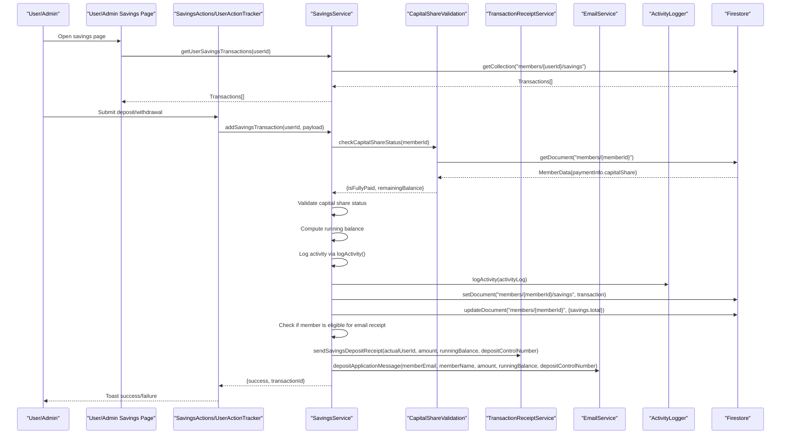

**Diagram sources**
- [page.tsx:30-110](file://app/savings/page.tsx#L30-L110)
- [SavingsActions.tsx:20-120](file://components/user/actions/SavingsActions.tsx#L20-L120)
- [savingsService.ts:237-497](file://lib/savingsService.ts#L237-L497)
- [useCapitalShare.ts:35-100](file://hooks/useCapitalShare.ts#L35-L100)
- [activityLogger.ts:20-43](file://lib/activityLogger.ts#L20-L43)
- [transactionReceiptService.ts:408-476](file://lib/transactionReceiptService.ts#L408-L476)
- [emailService.ts:320-353](file://lib/emailService.ts#L320-L353)

## Detailed Component Analysis

### Savings Transaction Model and Member Savings Summary
- SavingsTransaction: Enforces strict typing for transaction attributes including identifiers, amounts, balances, and timestamps.
- MemberSavings: Provides a summarized view for reporting and leaderboards with member identity, role, total savings, status, and last updated timestamp.

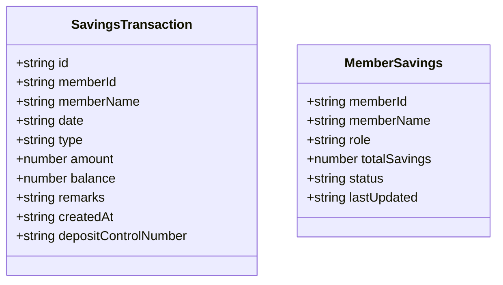

**Diagram sources**
- [savings.ts:1-22](file://lib/types/savings.ts#L1-L22)

**Section sources**
- [savings.ts:1-22](file://lib/types/savings.ts#L1-L22)

### Savings Service: Member Resolution, Transactions, Balances, Email Receipts, Dual Email Notifications, Activity Logging, and Capital Share Validation
Key responsibilities:
- Member resolution: Resolves user IDs to member IDs using multiple fallback strategies (direct lookup, email match, name match).
- Atomic transaction processing: Calculates running balance, validates withdrawals, persists transaction, and updates aggregate member savings.
- Balance retrieval: Returns cached aggregate savings when available; otherwise computes from transactions.
- **Updated**: Capital share validation: Checks member capital share status before processing any savings transactions, enforcing the 10,000 PHP requirement.
- **Updated**: Automatic email receipt generation: Sends email notifications for eligible savings deposits with comprehensive error handling and logging.
- **Updated**: Dual email notification system: Integrates both EmailJS receipts and internal application messages for comprehensive member communication.
- **Updated**: Comprehensive activity logging: Logs all savings transactions with detailed audit trails including user identification, role tracking, transaction metadata, and capital share validation results.

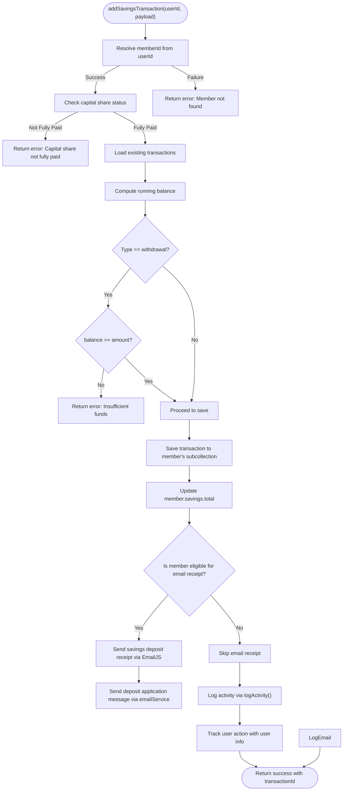

**Diagram sources**
- [savingsService.ts:285-484](file://lib/savingsService.ts#L285-L484)
- [useCapitalShare.ts:35-100](file://hooks/useCapitalShare.ts#L35-L100)
- [activityLogger.ts:20-43](file://lib/activityLogger.ts#L20-L43)
- [transactionReceiptService.ts:408-476](file://lib/transactionReceiptService.ts#L408-L476)
- [emailService.ts:320-353](file://lib/emailService.ts#L320-L353)

**Section sources**
- [savingsService.ts:21-135](file://lib/savingsService.ts#L21-L135)
- [savingsService.ts:285-484](file://lib/savingsService.ts#L285-L484)
- [savingsService.ts:499-669](file://lib/savingsService.ts#L499-L669)

### Capital Shares Management Integration
**New** - The capital shares management system provides comprehensive tracking and enforcement of the 10,000 PHP capital share requirement before savings transactions.

Key features:
- **Real-time Status Tracking**: Monitors member capital share payments with automatic status calculation (Paid, Partial, Pending).
- **Enforcement Mechanisms**: Prevents savings transactions until capital share obligations are fully settled.
- **Administrative Oversight**: Provides comprehensive dashboard for cooperative management to track member capital share status.
- **Payment Tracking**: Maintains detailed payment history with receipt numbers and transaction records.
- **Member Communication**: Notifies members of their capital share status and remaining balances.
- **Error Messaging**: Provides clear error messages when capital share requirements are not met.

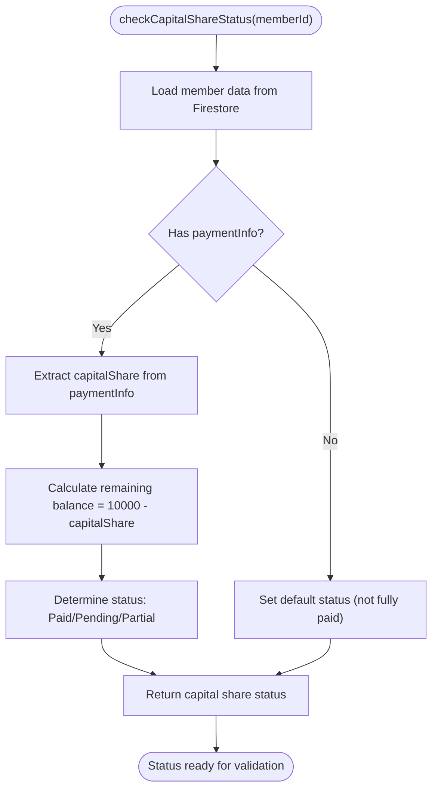

**Diagram sources**
- [useCapitalShare.ts:35-100](file://hooks/useCapitalShare.ts#L35-L100)
- [savingsService.ts:252-280](file://lib/savingsService.ts#L252-L280)

**Section sources**
- [useCapitalShare.ts:1-115](file://hooks/useCapitalShare.ts#L1-L115)
- [savingsService.ts:252-280](file://lib/savingsService.ts#L252-L280)
- [CapitalSharesPage.tsx:1-764](file://app/admin/capital-shares/page.tsx#L1-L764)

### Activity Logging System: Comprehensive Audit Trails
**New** - The activity logging system provides comprehensive audit trails with detailed user identification and role tracking for all system activities.

Key features:
- **User Identification**: Tracks user IDs, emails, display names, and roles for comprehensive transaction monitoring.
- **Activity Types**: Supports various activity types including login, logout, profile updates, member creation, loan approvals, savings updates, report generation, and settings updates.
- **Timestamp Tracking**: Automatically records timestamps for all activities with ISO format for consistency.
- **Client Information**: Captures user agent and IP address information for security monitoring.
- **Flexible Data Storage**: Allows additional data to be included in activity logs for contextual information.
- **Query Capabilities**: Provides functions to fetch user-specific activities, all activities, and activities within date ranges.
- **Index Optimization**: Uses Firestore query optimization with timestamp-based sorting for efficient activity retrieval.

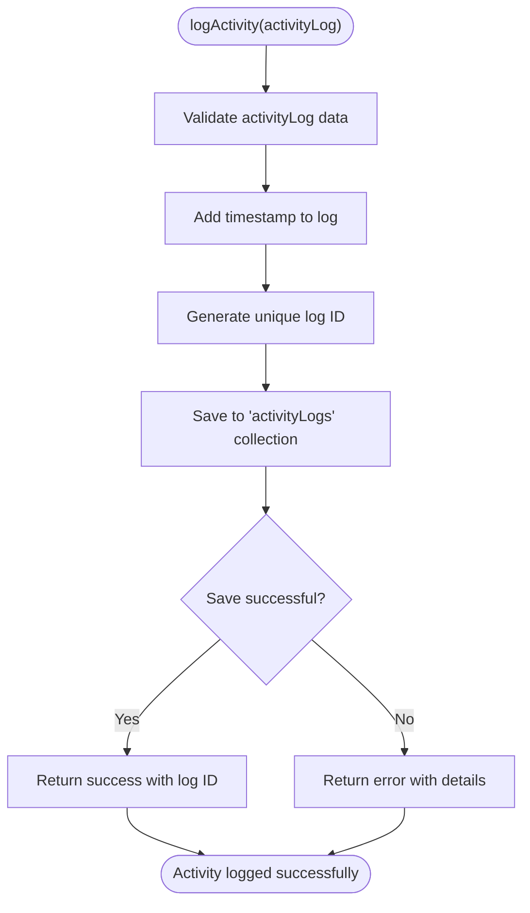

**Diagram sources**
- [activityLogger.ts:20-43](file://lib/activityLogger.ts#L20-L43)

**Section sources**
- [activityLogger.ts:1-165](file://lib/activityLogger.ts#L1-L165)

### User Action Tracker: Comprehensive Administrative Monitoring
**New** - The user action tracker enables detailed monitoring of administrative activities and user interactions with proper user identification and role tracking.

Key features:
- **User Identification**: Tracks user IDs, emails, display names, and roles for comprehensive activity monitoring.
- **Higher-Order Functions**: Provides wrapper functions for automatic logging of actions with additional data context.
- **Specific Action Tracking**: Includes dedicated functions for common administrative actions like login, logout, profile updates, member creation, loan approvals, savings updates, report generation, and settings updates.
- **Client Information**: Captures user agent and IP address information for security monitoring.
- **Error Handling**: Robust error handling with detailed logging and graceful degradation when activity logging fails.
- **Integration Ready**: Designed to integrate seamlessly with the activity logging system for comprehensive audit trails.

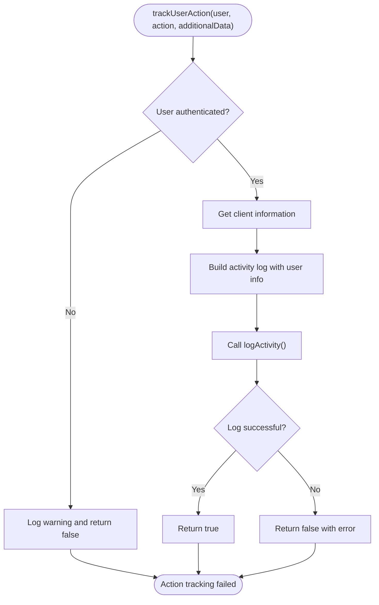

**Diagram sources**
- [userActionTracker.ts:10-47](file://lib/userActionTracker.ts#L10-L47)

**Section sources**
- [userActionTracker.ts:1-118](file://lib/userActionTracker.ts#L1-L118)

### Transaction Receipt Service: Email Notification System
**New** - The transaction receipt service provides comprehensive email notification capabilities with EmailJS integration, receipt number generation, and email logging.

Key features:
- **EmailJS Integration**: Supports both Firestore-based configuration and environment variable fallback for EmailJS settings.
- **Receipt Number Generation**: Creates unique receipt numbers in the format `SMP-YYYYMMDD-XXXX` for all transactions.
- **Email Logging**: Maintains email logs in the `emailLogs` collection to prevent duplicate email attempts.
- **User Details Resolution**: Retrieves recipient information from both users and members collections with comprehensive fallback strategies.
- **Transaction Type Support**: Handles both savings deposits and loan payments with appropriate email templates.
- **Error Handling**: Robust error handling with detailed logging and graceful degradation when email services are unavailable.

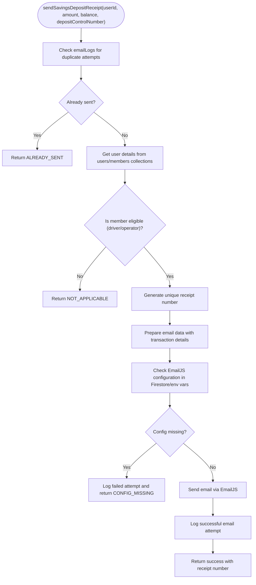

**Diagram sources**
- [transactionReceiptService.ts:408-476](file://lib/transactionReceiptService.ts#L408-L476)
- [transactionReceiptService.ts:132-153](file://lib/transactionReceiptService.ts#L132-L153)

**Section sources**
- [transactionReceiptService.ts:1-636](file://lib/transactionReceiptService.ts#L1-L636)

### Email Service: Comprehensive Email Templates
**New** - The email service provides comprehensive email template system with specialized templates for deposit applications, withdrawal applications, and other cooperative communications.

Key features:
- **Deposit Application Messages**: Sends confirmation emails for deposit applications with control numbers and running balances.
- **Withdrawal Application Messages**: Sends confirmation emails for withdrawal applications with withdrawal numbers.
- **Template System**: Provides standardized email templates with proper variable substitution.
- **Error Handling**: Robust error handling with detailed logging and graceful degradation when email services are unavailable.
- **Configuration Management**: Integrates with EmailJS configuration system for seamless email delivery.

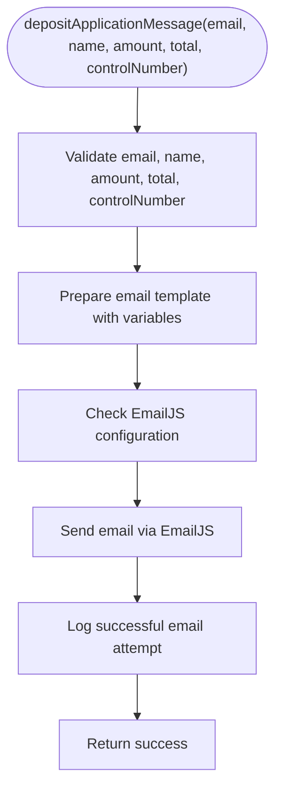

**Diagram sources**
- [emailService.ts:320-353](file://lib/emailService.ts#L320-L353)

**Section sources**
- [emailService.ts:1-389](file://lib/emailService.ts#L1-L389)

### User Transaction Actions: Deposits and Withdrawals
- Deposit flow: Validates amount, constructs transaction payload, checks capital share status, writes to Firestore under the member's subcollection, triggers automatic email receipt for eligible members, and logs activity.
- Withdrawal flow: Validates amount against current balance, checks capital share status, constructs transaction payload, writes to Firestore, and logs activity.

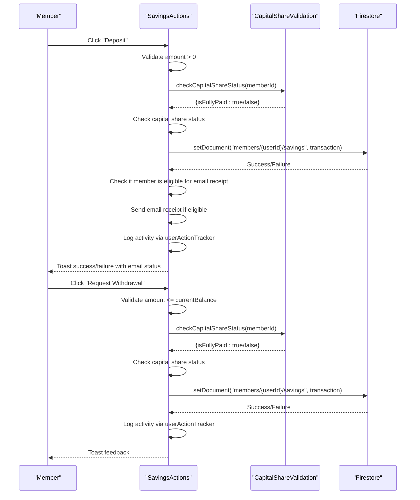

**Diagram sources**
- [SavingsActions.tsx:20-120](file://components/user/actions/SavingsActions.tsx#L20-L120)
- [savingsService.ts:370-433](file://lib/savingsService.ts#L370-L433)
- [useCapitalShare.ts:35-100](file://hooks/useCapitalShare.ts#L35-L100)
- [userActionTracker.ts:10-47](file://lib/userActionTracker.ts#L10-L47)

**Section sources**
- [SavingsActions.tsx:13-120](file://components/user/actions/SavingsActions.tsx#L13-L120)

### Admin Transaction Modal: Controlled Additions
- Validates amount positivity and withdrawal limits against current balance.
- Submits transaction via the savings service, refreshing UI upon success.
- **Updated**: Automatically sends email receipts for eligible members when administrators add transactions.
- **Updated**: Integrates with activity logging system for comprehensive audit trails.
- **Updated**: Capital share validation ensures administrators cannot bypass the 10,000 PHP requirement.

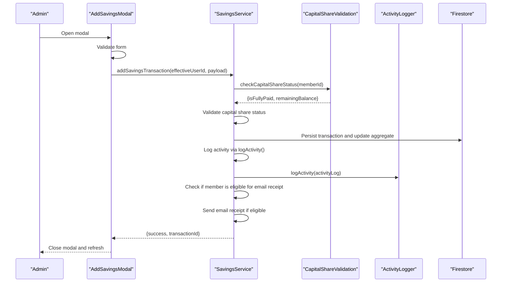

**Diagram sources**
- [AddSavingsModal.tsx:12-92](file://components/admin/AddSavingsModal.tsx#L12-L92)
- [page.tsx:123-172](file://app/admin/savings/member/[id]/page.tsx#L123-L172)
- [savingsService.ts:370-433](file://lib/savingsService.ts#L370-L433)
- [useCapitalShare.ts:35-100](file://hooks/useCapitalShare.ts#L35-L100)
- [activityLogger.ts:20-43](file://lib/activityLogger.ts#L20-L43)

**Section sources**
- [AddSavingsModal.tsx:12-92](file://components/admin/AddSavingsModal.tsx#L12-L92)
- [page.tsx:123-172](file://app/admin/savings/member/[id]/page.tsx#L123-L172)

### Active Savings Display: Recent Transactions and Balance
- Fetches transactions and sorts by date (newest first).
- Computes and displays current balance, recent transactions, and provides refresh capability.
- **Updated**: Integrates capital share status display for member awareness.

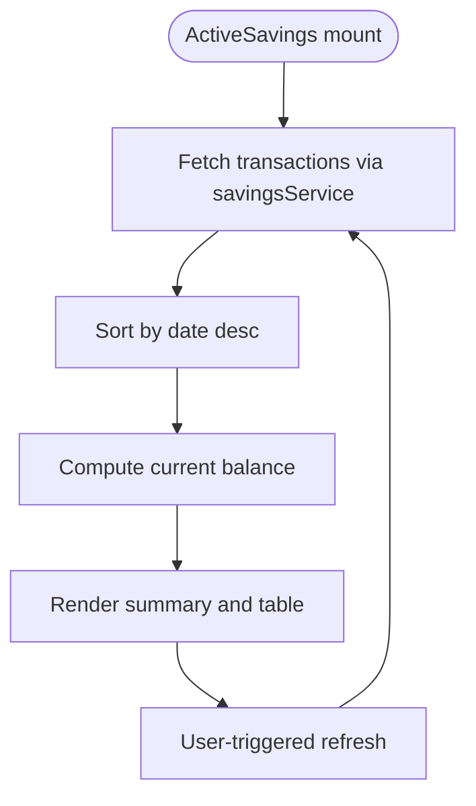

**Diagram sources**
- [ActiveSavings.tsx:22-50](file://components/user/ActiveSavings.tsx#L22-L50)

**Section sources**
- [ActiveSavings.tsx:16-95](file://components/user/ActiveSavings.tsx#L16-L95)

### Savings Leaderboard: Rankings and Motivational Insights
- Gathers all members and calculates total savings per member by aggregating transactions.
- Ranks top 10 members and renders with visual indicators for top 3 positions.

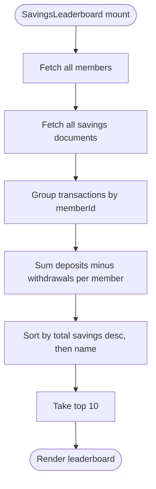

**Diagram sources**
- [SavingsLeaderboard.tsx:36-123](file://components/admin/SavingsLeaderboard.tsx#L36-L123)

**Section sources**
- [SavingsLeaderboard.tsx:32-123](file://components/admin/SavingsLeaderboard.tsx#L32-L123)

## Enhanced Transaction Processing

### AddSavingsTransactionModal: Advanced Transaction Processing
**Updated** - The AddSavingsTransactionModal now provides enhanced transaction processing with comprehensive validation, deposit control number generation, confirmation modals, automatic email receipt functionality, dual email notification system, integrated activity logging, and capital share validation.

Key enhancements:
- **Deposit Control Number Generation**: Automatically generates unique deposit control numbers in the format `DC-{timestamp}-{random_chars}` for all deposit transactions.
- **Confirmation Modals**: Implements two-step confirmation process for critical operations, especially deposits, to prevent accidental transactions.
- **Enhanced Form Validation**: Comprehensive validation including amount positivity checks, withdrawal limit validation against current balance, and date validation.
- **Real-time Balance Display**: Shows current account balance to help users make informed decisions.
- **Loading States**: Provides visual feedback during transaction processing with spinner animations.
- **Error Handling**: Displays specific error messages for validation failures and provides user guidance.
- **Email Receipt Status**: Shows email receipt status for eligible members after successful transactions.
- **Activity Logging Integration**: Automatically logs all transaction activities with user identification and role tracking.
- **Dual Email Notification**: Integrates with both EmailJS receipts and internal application messages for comprehensive member communication.
- **Capital Share Validation**: Integrates with capital share validation to prevent transactions when requirements are not met.

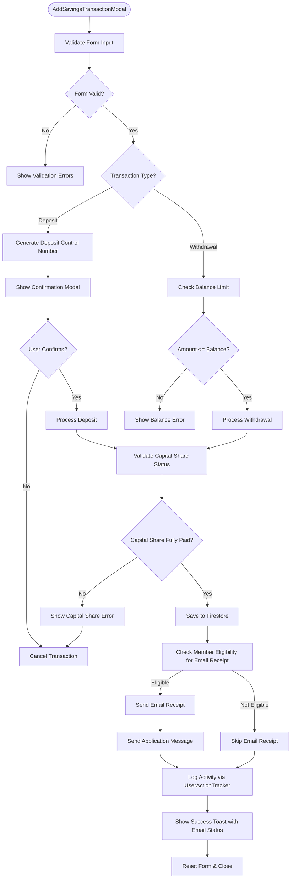

**Diagram sources**
- [AddSavingsTransactionModal.ts:29-150](file://components/user/AddSavingsTransactionModal.tsx#L29-L150)
- [savingsService.ts:370-433](file://lib/savingsService.ts#L370-L433)
- [userActionTracker.ts:10-47](file://lib/userActionTracker.ts#L10-L47)
- [emailService.ts:320-353](file://lib/emailService.ts#L320-L353)
- [useCapitalShare.ts:35-100](file://hooks/useCapitalShare.ts#L35-L100)

**Section sources**
- [AddSavingsTransactionModal.tsx:15-382](file://components/user/AddSavingsTransactionModal.tsx#L15-L382)

## Capital Shares Management Integration

### Capital Shares Administration System
**New** - The capital shares administration system provides comprehensive management of the 10,000 PHP capital share requirement with real-time tracking and enforcement.

Key features:
- **Real-time Status Tracking**: Monitors member capital share payments with automatic status calculation (Paid, Partial, Pending).
- **Administrative Dashboard**: Provides comprehensive overview of capital share status across all members with filtering and search capabilities.
- **Payment Recording**: Enables administrators to record capital share payments with receipt numbers and payment dates.
- **Member Details**: Provides detailed view of individual member capital share history with transaction records.
- **Status Indicators**: Visual indicators for capital share status with color-coded badges and progress bars.
- **Payment History**: Maintains detailed payment history with amounts, dates, and receipt numbers.
- **Enforcement Integration**: Seamlessly integrates with savings transactions to enforce capital share requirements.

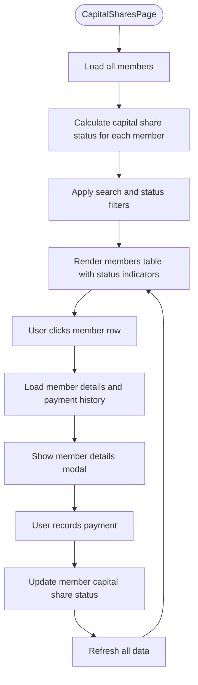

**Diagram sources**
- [CapitalSharesPage.tsx:57-143](file://app/admin/capital-shares/page.tsx#L57-L143)
- [CapitalSharesPage.tsx:175-297](file://app/admin/capital-shares/page.tsx#L175-L297)

**Section sources**
- [CapitalSharesPage.tsx:1-764](file://app/admin/capital-shares/page.tsx#L1-L764)

### Capital Share Hook Implementation
**New** - The `useCapitalShare` hook provides real-time capital share status tracking for individual members.

Key features:
- **Automatic Status Calculation**: Calculates capital share status based on payment information stored in member documents.
- **Real-time Updates**: Provides automatic updates when member data changes.
- **Status Types**: Supports Paid, Partial, and Pending status with appropriate visual indicators.
- **Remaining Balance Calculation**: Calculates remaining balance to show how much more is needed to reach 10,000 PHP.
- **Error Handling**: Robust error handling with loading states and error messages.
- **Integration Ready**: Designed to integrate seamlessly with savings transactions and member dashboards.

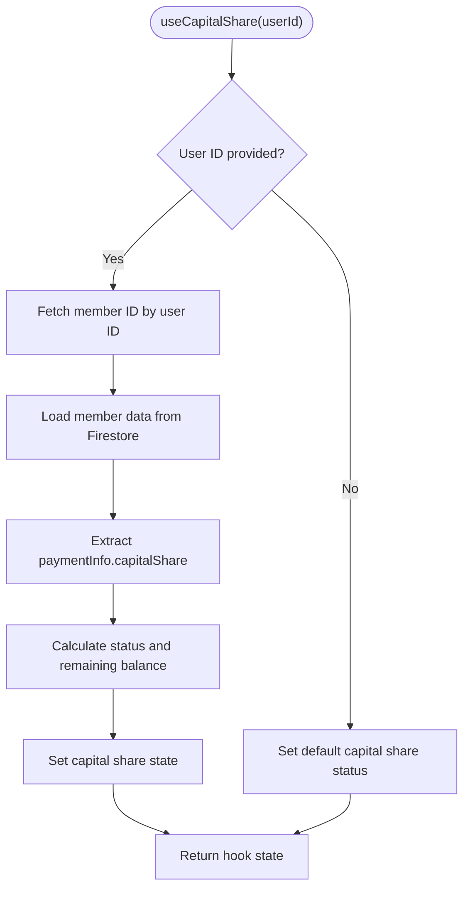

**Diagram sources**
- [useCapitalShare.ts:35-100](file://hooks/useCapitalShare.ts#L35-L100)

**Section sources**
- [useCapitalShare.ts:1-115](file://hooks/useCapitalShare.ts#L1-L115)

### Capital Share Integration in Member Dashboards
**New** - Capital share status is integrated into member dashboards to provide visibility and motivation.

Key features:
- **Dashboard Integration**: Capital share status is prominently displayed in member dashboards with visual indicators.
- **Incomplete Status Alerts**: Provides clear alerts when capital share is not fully paid, explaining the impact on loan eligibility and savings transactions.
- **Progress Visualization**: Shows progress toward 10,000 PHP capital share with amount paid and remaining balance.
- **Motivational Messaging**: Provides encouraging messages for partial payments and warnings for incomplete requirements.
- **Contact Information**: Includes contact information for cooperative office to resolve capital share issues.

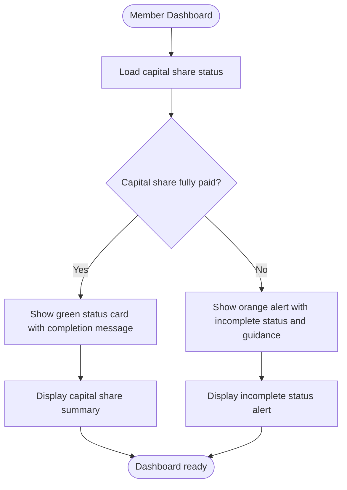

**Diagram sources**
- [dashboard.tsx:555-582](file://app/dashboard/page.tsx#L555-L582)
- [operator-dashboard.tsx:687-697](file://app/operator/dashboard/page.tsx#L687-L697)

**Section sources**
- [dashboard.tsx:555-754](file://app/dashboard/page.tsx#L555-L754)
- [operator-dashboard.tsx:680-879](file://app/operator/dashboard/page.tsx#L680-L879)

## Automatic Email Notifications

### Dual Email Notification System
**New** - The system now provides a comprehensive dual email notification system supporting both EmailJS receipts and internal application messages for enhanced member communication.

Key features:
- **EmailJS Receipts**: Automated email receipts for savings transactions using EmailJS service with proper configuration management.
- **Internal Application Messages**: Internal application messages for deposit and withdrawal applications with control numbers and running balances.
- **Member Eligibility**: Automatic eligibility checking for driver and operator roles before sending notifications.
- **Duplicate Prevention**: Email logging system prevents duplicate email attempts for the same transaction.
- **Error Handling**: Graceful error handling with detailed logging and fallback mechanisms when email services are unavailable.
- **Configuration Management**: Flexible EmailJS configuration management with Firestore and environment variable fallback.

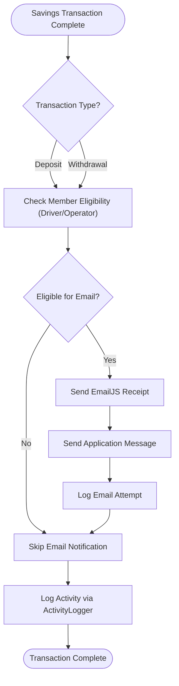

**Diagram sources**
- [savingsService.ts:369-474](file://lib/savingsService.ts#L369-L474)
- [transactionReceiptService.ts:408-476](file://lib/transactionReceiptService.ts#L408-L476)
- [emailService.ts:320-388](file://lib/emailService.ts#L320-L388)

**Section sources**
- [savingsService.ts:369-474](file://lib/savingsService.ts#L369-L474)
- [transactionReceiptService.ts:408-476](file://lib/transactionReceiptService.ts#L408-L476)
- [emailService.ts:320-388](file://lib/emailService.ts#L320-L388)

### Email Configuration Management
**New** - The system supports flexible email configuration management through Firestore and environment variables.

Key features:
- **Firestore Configuration**: Stores EmailJS credentials in `systemConfig/emailjs` document with automatic caching and fallback mechanisms.
- **Environment Variable Fallback**: Automatically falls back to environment variables when Firestore configuration is unavailable.
- **Development/Production Flexibility**: Allows different configurations for development and production environments.
- **Configuration Validation**: Provides clear error messages when EmailJS configuration is missing or incomplete.
- **Setup Script**: Includes automated setup script to configure EmailJS credentials in Firestore.

**Section sources**
- [transactionReceiptService.ts:8-56](file://lib/transactionReceiptService.ts#L8-L56)
- [transactionReceiptService.ts:58-81](file://lib/transactionReceiptService.ts#L58-L81)

## Activity Logging and Audit Trails

### Comprehensive Activity Logging System
**New** - The comprehensive activity logging system provides detailed audit trails with user identification and role tracking for all system activities.

Key features:
- **User Identification**: Tracks user IDs, emails, display names, and roles for comprehensive transaction monitoring.
- **Activity Types**: Supports various activity types including login, logout, profile updates, member creation, loan approvals, savings updates, report generation, and settings updates.
- **Timestamp Tracking**: Automatically records timestamps for all activities with ISO format for consistency.
- **Client Information**: Captures user agent and IP address information for security monitoring.
- **Flexible Data Storage**: Allows additional data to be included in activity logs for contextual information.
- **Query Capabilities**: Provides functions to fetch user-specific activities, all activities, and activities within date ranges.
- **Index Optimization**: Uses Firestore query optimization with timestamp-based sorting for efficient activity retrieval.
- **Error Handling**: Robust error handling with detailed logging and graceful degradation when activity logging fails.

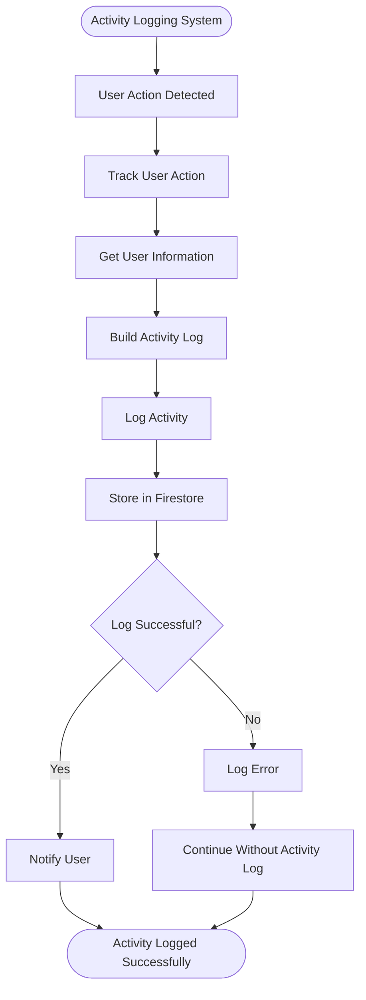

**Diagram sources**
- [activityLogger.ts:20-43](file://lib/activityLogger.ts#L20-L43)
- [userActionTracker.ts:10-47](file://lib/userActionTracker.ts#L10-L47)

**Section sources**
- [activityLogger.ts:1-165](file://lib/activityLogger.ts#L1-L165)
- [userActionTracker.ts:1-118](file://lib/userActionTracker.ts#L1-L118)

### User Action Tracking Integration
**New** - The user action tracking integration enables detailed monitoring of administrative activities and user interactions with proper user identification and role tracking.

Key features:
- **Higher-Order Functions**: Provides wrapper functions for automatic logging of actions with additional data context.
- **Specific Action Tracking**: Includes dedicated functions for common administrative actions like login, logout, profile updates, member creation, loan approvals, savings updates, report generation, and settings updates.
- **Client Information**: Captures user agent and IP address information for security monitoring.
- **Error Handling**: Robust error handling with detailed logging and graceful degradation when activity logging fails.
- **Integration Ready**: Designed to integrate seamlessly with the activity logging system for comprehensive audit trails.

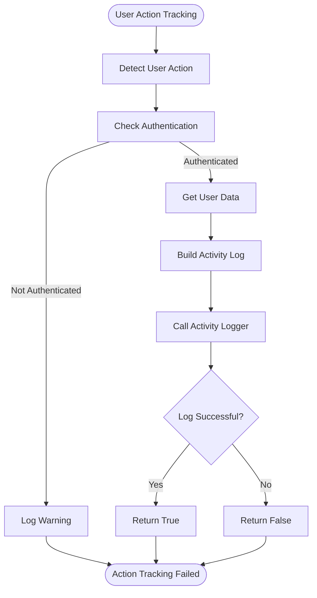

**Diagram sources**
- [userActionTracker.ts:10-47](file://lib/userActionTracker.ts#L10-L47)
- [auth.tsx:12-18](file://lib/auth.tsx#L12-L18)

**Section sources**
- [userActionTracker.ts:1-118](file://lib/userActionTracker.ts#L1-L118)
- [auth.tsx:12-18](file://lib/auth.tsx#L12-L18)

## Transaction Receipt System

### Transaction Receipt Service: Comprehensive Email Notification
**New** - The transaction receipt service provides a comprehensive email notification system with EmailJS integration, receipt number generation, and email logging capabilities.

Key features:
- **EmailJS Configuration Management**: Supports configuration from Firestore (`systemConfig/emailjs`) with fallback to environment variables for development and production environments.
- **Unique Receipt Number Generation**: Creates sequential receipt numbers in the format `SMP-YYYYMMDD-XXXX` for all transactions.
- **Duplicate Prevention**: Uses the `emailLogs` collection to prevent duplicate email attempts for the same transaction.
- **Comprehensive User Resolution**: Retrieves recipient information from both `users` and `members` collections with multiple fallback strategies.
- **Transaction Type Support**: Handles both savings deposits and loan payments with appropriate email templates and data structures.
- **Robust Error Handling**: Provides detailed error logging and graceful degradation when email services are unavailable.
- **Email Logging**: Maintains comprehensive logs in the `emailLogs` collection for auditing and troubleshooting purposes.

```mermaid
flowchart TD
Start(["sendTransactionReceipt(type, userId, data)"]) --> TypeCheck{"Transaction Type?"}
TypeCheck --> |savings_deposit| CallSavings["Call sendSavingsDepositReceipt"]
TypeCheck --> |loan_payment| CallLoan["Call sendLoanPaymentReceipt"]
CallSavings --> GenerateReceipt["Generate unique receipt number"]
GenerateReceipt --> CheckDuplicate["Check emailLogs for duplicates"]
CheckDuplicate --> GetUserDetails["Get user details from users/members"]
GetUserDetails --> CheckConfig["Check EmailJS config in Firestore/env vars"]
CheckConfig --> SendEmail["Send email via EmailJS"]
SendEmail --> LogAttempt["Log email attempt in emailLogs"]
LogAttempt --> ReturnResult["Return success/failure with receipt number"]
```

**Diagram sources**
- [transactionReceiptService.ts:605-635](file://lib/transactionReceiptService.ts#L605-L635)
- [transactionReceiptService.ts:408-476](file://lib/transactionReceiptService.ts#L408-L476)

**Section sources**
- [transactionReceiptService.ts:1-636](file://lib/transactionReceiptService.ts#L1-L636)

### Email Configuration Management
**New** - The system supports flexible email configuration management through Firestore and environment variables.

Key features:
- **Firestore Configuration**: Stores EmailJS credentials in `systemConfig/emailjs` document with automatic caching and fallback mechanisms.
- **Environment Variable Fallback**: Automatically falls back to environment variables when Firestore configuration is unavailable.
- **Development/Production Flexibility**: Allows different configurations for development and production environments.
- **Configuration Validation**: Provides clear error messages when EmailJS configuration is missing or incomplete.
- **Setup Script**: Includes automated setup script to configure EmailJS credentials in Firestore.

**Section sources**
- [transactionReceiptService.ts:8-56](file://lib/transactionReceiptService.ts#L8-L56)
- [transactionReceiptService.ts:58-81](file://lib/transactionReceiptService.ts#L58-L81)

## Savings Records Management

### SavingsRecords Component: Comprehensive Savings Management
**New** - The SavingsRecords component provides comprehensive savings account management with detailed transaction tracking and automated savings credit calculations.

Key features:
- **Real-time savings aggregation**: Fetches members and savings transactions to calculate total savings per member.
- **Advanced filtering**: Supports search by member name/email and pagination for efficient navigation.
- **Automated calculations**: Automatically computes running balances and last transaction dates.
- **Member details modal**: Provides detailed view of individual member savings with formatted currency display.
- **Responsive design**: Mobile-friendly interface with intuitive pagination controls.
- **Enhanced data visualization**: Displays savings totals with proper currency formatting and last transaction dates.
- **Audit Trail Integration**: Integrates with activity logging system for comprehensive transaction monitoring.
- **Capital Share Integration**: Displays capital share status alongside savings information for comprehensive member view.

```mermaid
flowchart TD
Start(["SavingsRecords mount"]) --> FetchMembers["Fetch all members"]
FetchMembers --> FetchSavings["Fetch all savings transactions"]
FetchSavings --> Aggregate["Aggregate savings by member"]
Aggregate --> Calculate["Calculate total savings and last transaction"]
Calculate --> Filter["Apply search filters"]
Filter --> Paginate["Apply pagination"]
Paginate --> Render["Render table with member details"]
Render --> Modal["Handle member details modal"]
```

**Diagram sources**
- [SavingsRecords.tsx:40-127](file://components/admin/SavingsRecords.tsx#L40-L127)

**Section sources**
- [SavingsRecords.tsx:27-350](file://components/admin/SavingsRecords.tsx#L27-L350)

### ReportsAndAnalytics Component: Financial Analytics
**New** - The ReportsAndAnalytics component provides comprehensive financial analytics and reporting capabilities for administrative oversight.

Key features:
- **Dashboard statistics**: Displays key financial metrics including total members, total collected, active loans, and money disbursed.
- **Visual charts**: Provides bar charts for monthly trends and pie charts for loan status distribution.
- **Financial overview**: Shows receivables, pending approvals, and overdue payments with color-coded indicators.
- **Responsive design**: Adapts to different screen sizes with mobile-friendly layouts.
- **Activity Monitoring**: Integrates with activity logging system for comprehensive administrative oversight.

```mermaid
flowchart TD
Start(["ReportsAndAnalytics mount"]) --> FetchData["Fetch loans and members data"]
FetchData --> CalculateStats["Calculate dashboard statistics"]
CalculateStats --> MonthlyData["Generate monthly trends data"]
MonthlyData --> LoanStatus["Calculate loan status distribution"]
LoanStatus --> RenderCharts["Render charts and statistics"]
RenderCharts --> FinancialOverview["Display financial overview cards"]
```

**Diagram sources**
- [ReportsAndAnalytics.tsx:50-165](file://components/admin/ReportsAndAnalytics.tsx#L50-L165)

**Section sources**
- [ReportsAndAnalytics.tsx:31-334](file://components/admin/ReportsAndAnalytics.tsx#L31-L334)

### User Savings Page: Comprehensive Transaction History
- Loads member ID, retrieves transactions, normalizes dates, sorts newest first, and computes totals.
- Provides pagination controls and summary statistics.

```mermaid
sequenceDiagram
participant U as "User"
participant P as "UserSavingsPage"
participant SS as "SavingsService"
participant FS as "Firestore"
U->>P : Navigate to /savings
P->>SS : getMemberIdByUserId(user.uid)
SS-->>P : memberId
P->>FS : getCollection("members/{memberId}/savings")
FS-->>P : Transactions[]
P->>SS : getSavingsBalanceForMember(memberId)
SS-->>P : totalSavings
P-->>U : Render summary and paginated history
```

**Diagram sources**
- [page.tsx:39-110](file://app/savings/page.tsx#L39-L110)

**Section sources**
- [page.tsx:30-110](file://app/savings/page.tsx#L30-L110)

### Admin Savings Management: Member Views and Reporting
- Admin dashboard lists members with filters and savings totals.
- Member details page shows full transaction history with running balances and printing capabilities.
- **Updated**: Integrates with activity logging system for comprehensive transaction monitoring and audit trails.
- **Updated**: Capital share status is displayed alongside savings information for comprehensive member oversight.

```mermaid
sequenceDiagram
participant A as "Admin"
participant AP as "AdminSavingsPage"
participant MP as "MemberSavingsPage"
participant SS as "SavingsService"
participant AL as "ActivityLogger"
participant FS as "Firestore"
A->>AP : View members list
AP->>SS : getSavingsBalanceForMember(memberId)
SS-->>AP : totalSavings
A->>AP : Select member
AP->>MP : Navigate to member view
MP->>FS : getCollection("members/{memberId}/savings")
FS-->>MP : Transactions with running balance
MP->>AL : Log activity for member view
AL-->>MP : Activity logged
MP-->>A : Render history and print/report
```

**Diagram sources**
- [page.tsx:128-159](file://app/admin/savings/page.tsx#L128-L159)
- [page.tsx:53-104](file://app/admin/savings/member/[id]/page.tsx#L53-L104)
- [activityLogger.ts:20-43](file://lib/activityLogger.ts#L20-L43)

**Section sources**
- [page.tsx:10-240](file://app/admin/savings/page.tsx#L10-L240)
- [page.tsx:16-104](file://app/admin/savings/member/[id]/page.tsx#L16-L104)

## Dependency Analysis
- Types drive service and component contracts ensuring consistent data shapes.
- SavingsService depends on Firestore utilities, transaction receipt service, email service, activity logger, user action tracker, and capital share validation, and is consumed by pages and components.
- **Updated**: ActivityLogger provides comprehensive audit trail functionality with user identification and role tracking.
- **Updated**: UserActionTracker enables detailed monitoring of administrative activities and user interactions.
- **Updated**: useCapitalShare provides real-time capital share status tracking with automatic updates.
- Admin and user components share common modal and service logic for transaction handling.
- **New**: SavingsRecords component integrates with Firestore to provide comprehensive savings tracking with audit trail integration and capital share status monitoring.
- **New**: ReportsAndAnalytics component provides financial insights through chart visualization with activity monitoring.
- **New**: Enhanced AddSavingsTransactionModal provides advanced transaction processing capabilities with email receipt integration, dual email notification system, activity logging, and capital share validation.
- **New**: EmailService provides comprehensive email template system for deposit and withdrawal applications.
- **New**: Dual email notification system integrates EmailJS receipts and internal application messages for comprehensive member communication.
- **New**: CapitalSharesPage provides comprehensive capital shares administration with payment tracking and member status monitoring.

```mermaid
graph LR
TS["lib/types/savings.ts"] --> SS["lib/savingsService.ts"]
TM["lib/types/member.ts"] --> SS
SS --> TRS["lib/transactionReceiptService.ts"]
SS --> ES["lib/emailService.ts"]
SS --> AL["lib/activityLogger.ts"]
SS --> UAT["lib/userActionTracker.ts"]
SS --> CS["hooks/useCapitalShare.ts"]
SS --> UP["app/savings/page.tsx"]
SS --> ADP["app/admin/savings/page.tsx"]
SS --> MD["app/admin/savings/member/[id]/page.tsx"]
SS --> UAS["components/user/actions/SavingsActions.tsx"]
SS --> AM["components/admin/AddSavingsModal.tsx"]
SS --> AT["components/user/AddSavingsTransactionModal.tsx"]
SS --> AS["components/user/ActiveSavings.tsx"]
SS --> LB["components/admin/SavingsLeaderboard.tsx"]
SS --> SR["components/admin/SavingsRecords.tsx"]
SS --> RA["components/admin/ReportsAndAnalytics.tsx"]
CS --> CSP["app/admin/capital-shares/page.tsx"]
CS --> DSH["app/dashboard/page.tsx"]
CS --> ODSH["app/operator/dashboard/page.tsx"]
```

**Diagram sources**
- [savings.ts:1-22](file://lib/types/savings.ts#L1-L22)
- [member.ts:1-56](file://lib/types/member.ts#L1-L56)
- [savingsService.ts:1-669](file://lib/savingsService.ts#L1-L669)
- [transactionReceiptService.ts:1-636](file://lib/transactionReceiptService.ts#L1-L636)
- [emailService.ts:1-389](file://lib/emailService.ts#L1-L389)
- [activityLogger.ts:1-165](file://lib/activityLogger.ts#L1-L165)
- [userActionTracker.ts:1-118](file://lib/userActionTracker.ts#L1-L118)
- [useCapitalShare.ts:1-115](file://hooks/useCapitalShare.ts#L1-L115)
- [CapitalSharesPage.tsx:1-764](file://app/admin/capital-shares/page.tsx#L1-L764)
- [dashboard.tsx:555-754](file://app/dashboard/page.tsx#L555-L754)
- [operator-dashboard.tsx:680-879](file://app/operator/dashboard/page.tsx#L680-L879)
- [page.tsx:1-382](file://app/savings/page.tsx#L1-L382)
- [page.tsx:1-652](file://app/admin/savings/page.tsx#L1-L652)
- [page.tsx:1-649](file://app/admin/savings/member/[id]/page.tsx#L1-L649)
- [SavingsActions.tsx:1-249](file://components/user/actions/SavingsActions.tsx#L1-L249)
- [AddSavingsModal.tsx:1-293](file://components/admin/AddSavingsModal.tsx#L1-L293)
- [AddSavingsTransactionModal.tsx:1-382](file://components/user/AddSavingsTransactionModal.tsx#L1-L382)
- [ActiveSavings.tsx:1-249](file://components/user/ActiveSavings.tsx#L1-L249)
- [SavingsLeaderboard.tsx:1-213](file://components/admin/SavingsLeaderboard.tsx#L1-L213)
- [SavingsRecords.tsx:1-350](file://components/admin/SavingsRecords.tsx#L1-L350)
- [ReportsAndAnalytics.tsx:1-334](file://components/admin/ReportsAndAnalytics.tsx#L1-L334)

**Section sources**
- [savingsService.ts:1-669](file://lib/savingsService.ts#L1-L669)
- [transactionReceiptService.ts:1-636](file://lib/transactionReceiptService.ts#L1-L636)
- [emailService.ts:1-389](file://lib/emailService.ts#L1-L389)
- [activityLogger.ts:1-165](file://lib/activityLogger.ts#L1-L165)
- [userActionTracker.ts:1-118](file://lib/userActionTracker.ts#L1-L118)
- [useCapitalShare.ts:1-115](file://hooks/useCapitalShare.ts#L1-L115)
- [CapitalSharesPage.tsx:1-764](file://app/admin/capital-shares/page.tsx#L1-L764)
- [dashboard.tsx:555-754](file://app/dashboard/page.tsx#L555-L754)
- [operator-dashboard.tsx:680-879](file://app/operator/dashboard/page.tsx#L680-L879)
- [page.tsx:1-382](file://app/savings/page.tsx#L1-L382)
- [page.tsx:1-652](file://app/admin/savings/page.tsx#L1-L652)
- [page.tsx:1-649](file://app/admin/savings/member/[id]/page.tsx#L1-L649)

## Performance Considerations
- Running balance computation: The service recalculates balances from existing transactions. For large transaction histories, consider precomputing and storing balances to reduce repeated computations.
- Batch operations: When updating aggregates, ensure atomicity to avoid partial updates.
- Pagination: Use server-side pagination for large datasets to minimize client memory usage.
- Caching: Prefer retrieving aggregate totals from member documents when available to avoid heavy recomputation.
- **Updated**: Email receipt service implements caching for EmailJS configuration to avoid repeated Firestore queries.
- **Updated**: Duplicate email prevention reduces unnecessary EmailJS calls and improves system performance.
- **Updated**: Activity logging system uses efficient Firestore queries with proper indexing for activity log lookups.
- **Updated**: User action tracking provides robust error handling with detailed logging and graceful degradation when activity logging fails.
- **Updated**: Capital share status tracking uses efficient Firestore queries with proper indexing for member data lookups.
- **Updated**: Capital share validation occurs before transaction processing to prevent unnecessary database operations.
- **New**: Transaction receipt service uses efficient Firestore queries with proper indexing for email log lookups.
- **New**: SavingsRecords component uses efficient filtering and pagination to handle large member datasets.
- **New**: ReportsAndAnalytics component optimizes data fetching and chart rendering for better performance.
- **New**: Enhanced AddSavingsTransactionModal implements efficient form validation and state management.
- **New**: Dual email notification system provides comprehensive member communication with efficient error handling.
- **New**: EmailService provides optimized template processing with proper caching mechanisms.
- **New**: CapitalSharesPage implements efficient data fetching and filtering for large member datasets.

## Troubleshooting Guide
Common issues and resolutions:
- Member not found during transaction: Verify user-to-member linkage and fallback mechanisms. Check logs for resolution attempts.
- Insufficient funds on withdrawal: Ensure client-side validation aligns with server-side checks; confirm current balance reflects latest transactions.
- Transaction not appearing: Confirm the correct member subcollection path and that transactions are sorted by date for accurate running balance.
- Admin filters not working: Validate filter logic and ensure member savings are computed before applying filters.
- **Updated**: Capital share validation failing: Verify member has fully paid capital share (10,000 PHP) before processing savings transactions. Check capital share status in member documents.
- **Updated**: Email receipt not sending: Check EmailJS configuration in Firestore (`systemConfig/emailjs`) or environment variables. Verify member eligibility (driver/operator) and email address availability.
- **Updated**: Duplicate email attempts: Check `emailLogs` collection for existing entries preventing duplicate emails.
- **Updated**: EmailJS configuration errors: Verify all required fields (publicKey, serviceId, receiptTemplateId) are present in Firestore configuration.
- **Updated**: Activity logging failures: Check Firestore permissions for `activityLogs` collection and ensure proper indexing for user ID queries.
- **Updated**: User action tracking errors: Verify user authentication and ensure proper user data retrieval for activity logging.
- **Updated**: Dual email notification failures: Check both EmailJS configuration and internal email service configuration for deposit and withdrawal applications.
- **Updated**: EmailService template errors: Verify template IDs and variable substitutions for deposit and withdrawal application messages.
- **Updated**: Capital share status errors: Check member paymentInfo structure and ensure capitalShare field exists and is numeric.
- **Updated**: Capital share enforcement issues: Verify capital share validation logic and ensure it runs before transaction processing.
- **New**: Transaction receipt service errors: Check Firestore permissions for `emailLogs` collection and ensure proper indexing for transactionId queries.
- **New**: SavingsRecords loading errors**: Check Firestore permissions and ensure proper data structure for members and savings collections.
- **New**: ReportsAndAnalytics chart rendering issues: Verify data formatting and ensure required dependencies (recharts) are properly installed.
- **New**: Deposit control number generation failures: Check timestamp and random generation logic; ensure unique constraints are maintained.
- **New**: AddSavingsTransactionModal confirmation issues: Verify modal state management and ensure proper cleanup after transaction completion.
- **New**: Email notification system failures: Check both EmailJS and internal email service configurations for comprehensive member communication.
- **New**: CapitalSharesPage loading errors: Verify Firestore permissions for members collection and ensure proper indexing for paymentInfo queries.

**Section sources**
- [savingsService.ts:21-135](file://lib/savingsService.ts#L21-L135)
- [useCapitalShare.ts:94-99](file://hooks/useCapitalShare.ts#L94-L99)
- [transactionReceiptService.ts:132-153](file://lib/transactionReceiptService.ts#L132-L153)
- [emailService.ts:320-388](file://lib/emailService.ts#L320-L388)
- [activityLogger.ts:50-86](file://lib/activityLogger.ts#L50-L86)
- [userActionTracker.ts:10-47](file://lib/userActionTracker.ts#L10-L47)
- [SavingsActions.tsx:68-85](file://components/user/actions/SavingsActions.tsx#L68-L85)
- [page.tsx:161-240](file://app/admin/savings/page.tsx#L161-L240)
- [SavingsRecords.tsx:119-127](file://components/admin/SavingsRecords.tsx#L119-L127)
- [ReportsAndAnalytics.tsx:159-165](file://components/admin/ReportsAndAnalytics.tsx#L159-L165)
- [AddSavingsTransactionModal.tsx:120-150](file://components/user/AddSavingsTransactionModal.tsx#L120-L150)
- [CapitalSharesPage.tsx:137-142](file://app/admin/capital-shares/page.tsx#L137-L142)

## Conclusion
The Savings Management System provides a robust, user-friendly framework for managing cooperative member savings with enhanced transaction processing capabilities, comprehensive activity logging, and integrated capital shares management. It emphasizes accurate transaction processing, transparent reporting, administrative oversight through leaderboards, detailed member views, comprehensive analytics, enhanced member communication, and comprehensive audit trails for regulatory compliance and security monitoring. The addition of the SavingsRecords component enhances savings management with detailed transaction tracking and automated calculations, while the ReportsAndAnalytics component provides valuable financial insights through interactive charts and dashboards. The enhanced AddSavingsTransactionModal introduces sophisticated deposit control number generation and confirmation processes, significantly improving transaction security and auditability.

**Updated**: The most significant enhancement is the integrated comprehensive capital shares management system requiring members to settle 10,000 PHP capital share obligations before processing savings transactions. This system provides real-time capital share status tracking, enforcement mechanisms with clear error messaging, and comprehensive administrative oversight. The capital shares system integrates seamlessly with the savings service, ensuring that no savings transactions can be processed until the 10,000 PHP requirement is fully satisfied. This enhancement significantly strengthens the cooperative's financial foundation by ensuring all members meet their initial capital requirements before accessing savings services.

**Updated**: The dual email notification system represents a major advancement in member communication capabilities. The system now provides comprehensive dual email notification system supporting both EmailJS receipts and internal application messages for enhanced member communication. This system automatically sends email receipts for eligible savings deposits and withdrawals, while also sending internal application messages with control numbers and running balances. The email notification system includes automatic eligibility checking for driver and operator roles, duplicate prevention mechanisms, and robust error handling with detailed logging.

**Updated**: The enhanced savings service now integrates seamlessly with the dual email notification system and capital share validation, ensuring that every transaction, whether initiated by members or administrators, triggers appropriate email notifications and capital share enforcement. The system automatically handles both EmailJS receipts and internal application messages, providing comprehensive member communication while maintaining transaction security and auditability. This enhancement significantly improves the system's ability to monitor and audit savings transactions, providing administrators with detailed insights into system usage patterns and transaction activities.

**Updated**: The comprehensive capital shares administration system provides cooperative management with powerful tools for tracking member capital share status, recording payments, and enforcing requirements. The system includes real-time dashboards, detailed member views, payment history tracking, and administrative controls that ensure all members meet their capital share obligations. This system serves as a foundation for future cooperative growth and financial stability.

By leveraging typed models, centralized services, modular components, comprehensive email notification capabilities, dual email systems, robust activity logging, and integrated capital share validation, the system supports scalability and maintainability while delivering essential financial insights, operational controls, enhanced member communication, comprehensive audit trails for regulatory compliance and security monitoring, and strong financial governance through mandatory capital share requirements.