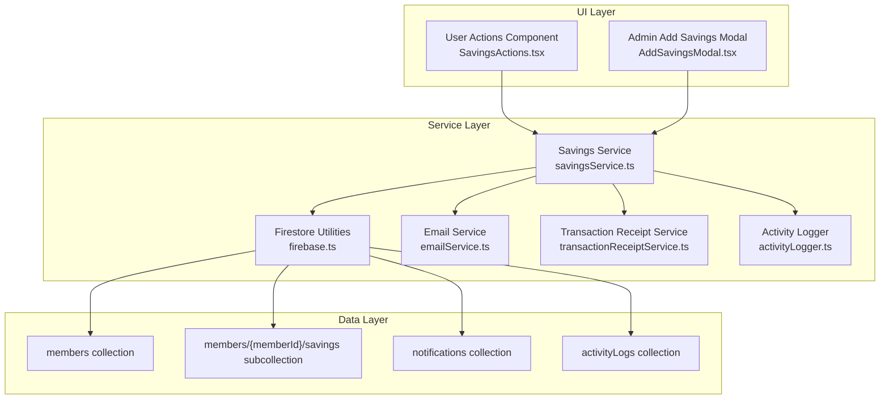
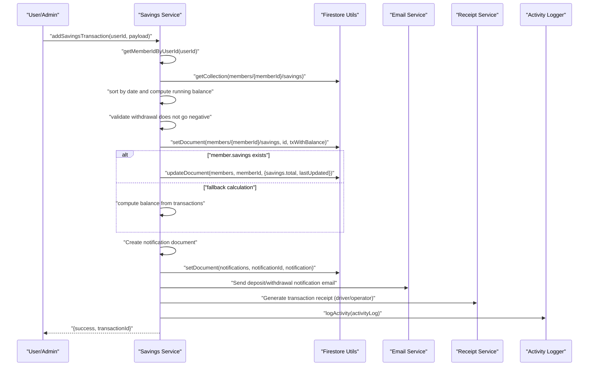
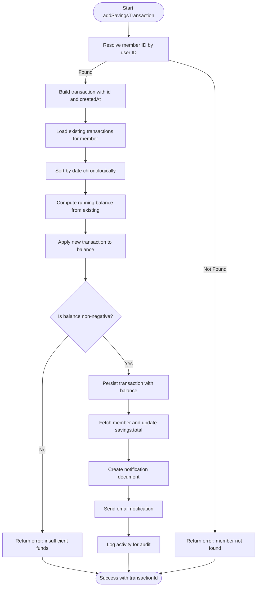
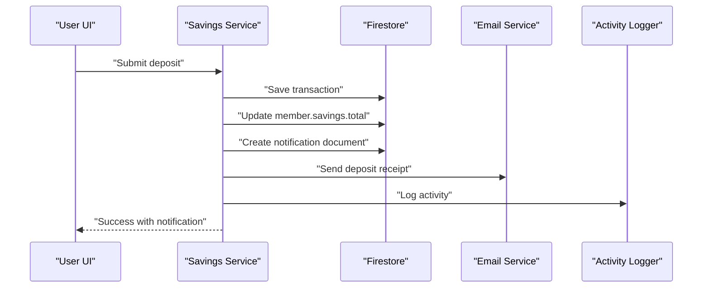
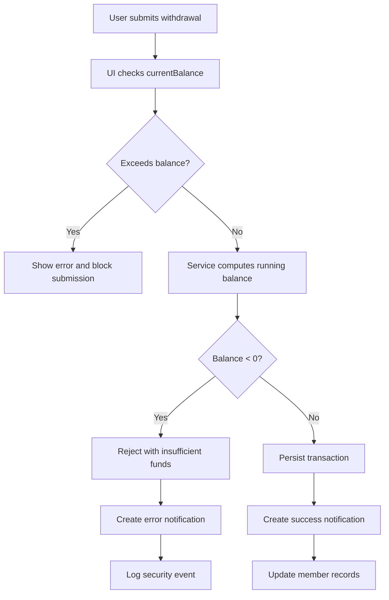
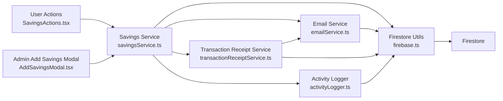

# Savings Transactions Processing

<cite>
**Referenced Files in This Document**
- [savingsService.ts](file://lib/savingsService.ts)
- [emailService.ts](file://lib/emailService.ts)
- [transactionReceiptService.ts](file://lib/transactionReceiptService.ts)
- [activityLogger.ts](file://lib/activityLogger.ts)
- [firebase.ts](file://lib/firebase.ts)
- [savings.ts](file://lib/types/savings.ts)
- [SavingsActions.tsx](file://components/user/actions/SavingsActions.tsx)
- [AddSavingsModal.tsx](file://components/admin/AddSavingsModal.tsx)
- [admin README.md](file://components/admin/README.md)
- [page.tsx (Admin Reports)](file://app/admin/reports/page.tsx)
- [page.tsx (Savings Dashboard)](file://app/savings/page.tsx)
- [test-savings-consistency.js](file://test-savings-consistency.js)
- [test-savings-functionality.js](file://test-savings-functionality.js)
</cite>

## Update Summary
**Changes Made**
- Added comprehensive automated transaction notification system with email service integration
- Enhanced error handling and logging mechanisms for improved reliability
- Integrated transaction receipt generation for deposit applications
- Expanded member information resolution with enhanced fallback strategies
- Added activity logging for audit trail and compliance tracking

## Table of Contents
1. [Introduction](#introduction)
2. [Project Structure](#project-structure)
3. [Core Components](#core-components)
4. [Architecture Overview](#architecture-overview)
5. [Enhanced Notification System](#enhanced-notification-system)
6. [Detailed Component Analysis](#detailed-component-analysis)
7. [Dependency Analysis](#dependency-analysis)
8. [Performance Considerations](#performance-considerations)
9. [Troubleshooting Guide](#troubleshooting-guide)
10. [Conclusion](#conclusion)
11. [Appendices](#appendices)

## Introduction
This document explains the Savings Transactions Processing system, focusing on atomic transaction operations, validation logic, transaction ID generation, timestamps, sequential ordering, running balance computation, Firestore patterns, metadata structure, and performance considerations. The system now includes enhanced automated transaction notifications with email service integration, comprehensive error handling, and logging for deposit and withdrawal applications.

## Project Structure
The savings system spans client-side UI components, a centralized service layer, and Firestore-backed persistence with integrated notification services:
- UI entry points for user and admin actions
- A service layer that encapsulates Firestore operations, business logic, and notification services
- Firestore collections organized per member for subcollections of transactions
- Email service integration for automated receipts and notifications
- Activity logging for audit trails and compliance
- Shared TypeScript types for transaction metadata

**Diagram sources**
- [savingsService.ts:1-615](file://lib/savingsService.ts#L1-L615)
- [emailService.ts:1-390](file://lib/emailService.ts#L1-L390)
- [transactionReceiptService.ts:1-636](file://lib/transactionReceiptService.ts#L1-L636)
- [activityLogger.ts:1-165](file://lib/activityLogger.ts#L1-L165)
- [firebase.ts:90-307](file://lib/firebase.ts#L90-L307)

**Section sources**
- [savingsService.ts:1-615](file://lib/savingsService.ts#L1-L615)
- [firebase.ts:1-309](file://lib/firebase.ts#L1-L309)
- [emailService.ts:1-390](file://lib/emailService.ts#L1-L390)
- [transactionReceiptService.ts:1-636](file://lib/transactionReceiptService.ts#L1-L636)
- [activityLogger.ts:1-165](file://lib/activityLogger.ts#L1-L165)

## Core Components
- **Savings Service**: Provides transaction creation, balance retrieval, member resolution utilities, and automated notification integration
- **Email Service**: Handles EmailJS configuration, template rendering, and automated transaction notifications
- **Transaction Receipt Service**: Generates and sends digital receipts for savings transactions with configurable templates
- **Activity Logger**: Maintains comprehensive audit trails for all financial operations
- **Firestore Utilities**: Encapsulate CRUD operations and validation helpers
- **UI Components**: User and admin interfaces to submit transactions and manage savings
- **Types**: Strongly typed transaction and member savings metadata

Key responsibilities:
- Atomic transaction creation with running balance calculation
- Overdraft prevention via preflight checks
- Automated email notifications for all transactions
- Transaction receipt generation for driver/operator accounts
- Comprehensive error handling and logging
- Member linkage with enhanced fallback strategies
- Transaction ID generation and timestamp management
- Sequential ordering via chronological sorting
- Aggregate balance maintenance and fallback calculation

**Section sources**
- [savingsService.ts:237-497](file://lib/savingsService.ts#L237-L497)
- [emailService.ts:1-390](file://lib/emailService.ts#L1-L390)
- [transactionReceiptService.ts:408-603](file://lib/transactionReceiptService.ts#L408-L603)
- [activityLogger.ts:20-43](file://lib/activityLogger.ts#L20-L43)
- [firebase.ts:90-307](file://lib/firebase.ts#L90-L307)

## Architecture Overview
The system ensures data integrity by computing balances locally against persisted transactions and persisting both the transaction and the member's aggregate total. The enhanced architecture now includes comprehensive notification services and error handling mechanisms.

**Diagram sources**
- [savingsService.ts:240-497](file://lib/savingsService.ts#L240-L497)
- [emailService.ts:321-390](file://lib/emailService.ts#L321-L390)
- [transactionReceiptService.ts:408-603](file://lib/transactionReceiptService.ts#L408-L603)
- [activityLogger.ts:20-43](file://lib/activityLogger.ts#L20-L43)

## Enhanced Notification System

### Automated Transaction Notifications
The system now automatically creates notification documents for all savings transactions, providing real-time alerts to users and administrators.

**Notification Features:**
- Automatic creation of notification documents in Firestore
- Role-based notification routing (member, driver, operator)
- Comprehensive metadata tracking (transaction type, amount, balance)
- Timestamped notification creation with unread status
- Configurable notification types for different transaction categories

### Email Service Integration
Enhanced email service provides automated receipts and notifications for all transaction types:

**Email Templates:**
- Deposit application confirmation emails
- Withdrawal application notifications
- Savings deposit receipts for driver/operator accounts
- Comprehensive error handling with graceful degradation

**Configuration Management:**
- Centralized EmailJS configuration storage in Firestore
- Environment variable fallback for production deployments
- Template-based email rendering with dynamic content
- Cached configuration for performance optimization

### Transaction Receipt Generation
Specialized receipt generation for driver and operator accounts:

**Receipt Features:**
- Unique receipt number generation with date-based patterns
- Digital receipt emails with transaction details
- Control number tracking for audit purposes
- Configurable receipt templates and styling
- Email logging for compliance and troubleshooting

**Section sources**
- [savingsService.ts:340-474](file://lib/savingsService.ts#L340-L474)
- [emailService.ts:1-390](file://lib/emailService.ts#L1-L390)
- [transactionReceiptService.ts:408-603](file://lib/transactionReceiptService.ts#L408-L603)

## Detailed Component Analysis

### Enhanced Savings Service: addSavingsTransaction
The enhanced service now includes comprehensive notification integration, error handling, and logging:

**Core Responsibilities:**
- Member ID resolution with enhanced fallback strategies
- Transaction creation with automated notification generation
- Email receipt delivery for driver/operator accounts
- Activity logging for audit compliance
- Comprehensive error handling with graceful degradation

**Diagram sources**
- [savingsService.ts:240-497](file://lib/savingsService.ts#L240-L497)

**Section sources**
- [savingsService.ts:240-497](file://lib/savingsService.ts#L240-L497)

### Enhanced Member Resolution and Fallback Strategies
The system now includes sophisticated member resolution with multiple fallback mechanisms:

**Resolution Strategy:**
- Direct member lookup by userId field
- Alternative member document validation
- Email-based member matching
- Name-based member identification
- Decoded email fallback for special cases
- Comprehensive error reporting and logging

**Section sources**
- [savingsService.ts:24-138](file://lib/savingsService.ts#L24-L138)
- [savingsService.ts:143-235](file://lib/savingsService.ts#L143-L235)

### Transaction Validation Logic
Enhanced validation with comprehensive error handling:

**Validation Features:**
- Amount validation: Positive numeric amounts enforced in UI and backend
- Overdraft prevention: Local balance computed before write; withdrawal rejected if negative
- Member linkage: Robust resolution of member ID from user ID via multiple strategies
- Transaction metadata validation: Complete field verification and sanitization
- Error handling: Comprehensive error capture and user-friendly messaging

**Section sources**
- [SavingsActions.tsx:27-120](file://components/user/actions/SavingsActions.tsx#L27-L120)
- [AddSavingsModal.tsx:22-92](file://components/admin/AddSavingsModal.tsx#L22-L92)
- [savingsService.ts:291-297](file://lib/savingsService.ts#L291-L297)

### Enhanced Transaction ID Generation and Timestamp Management
Improved ID generation with enhanced uniqueness and timestamp management:

**ID Generation:**
- Concatenation of type, timestamp, and random suffix for uniqueness
- Enhanced randomness for collision avoidance
- ISO string timestamps for consistent ordering
- Transaction-specific ID patterns for audit trails

**Timestamp Management:**
- Creation timestamps for all transactions
- Last updated timestamps for member records
- Activity logging timestamps for compliance
- Configurable timestamp formats for different use cases

**Section sources**
- [savingsService.ts:261-265](file://lib/savingsService.ts#L261-L265)
- [savingsService.ts:269-272](file://lib/savingsService.ts#L269-L272)

### Enhanced Running Balance Calculation
Improved balance computation with enhanced accuracy:

**Calculation Process:**
- Chronological processing: Existing transactions are sorted by date
- Balance accumulation: Deposits add, withdrawals subtract
- Real-time validation: Immediate overdraft prevention
- Fallback calculation: Transaction history-based balance verification
- Enhanced precision: Accurate floating-point arithmetic

**Section sources**
- [savingsService.ts:267-300](file://lib/savingsService.ts#L267-L300)

### Enhanced Firestore Patterns and Race Conditions
Improved Firestore transaction patterns with better consistency:

**Enhanced Patterns:**
- Separate operations: load → compute → save → update aggregate
- Notification creation: Non-blocking notification documents
- Email service integration: Asynchronous email processing
- Activity logging: Non-invasive audit trail creation
- Graceful degradation: Failure-safe operation continuation

**Race Condition Mitigation:**
- Non-blocking notification creation
- Asynchronous email processing
- Independent activity logging
- Fail-safe transaction completion

**Section sources**
- [savingsService.ts:303-497](file://lib/savingsService.ts#L303-L497)
- [firebase.ts:90-113](file://lib/firebase.ts#L90-L113)

### Enhanced Transaction Metadata Structure and Field Validation
Comprehensive metadata with enhanced validation:

**Metadata Fields:**
- id, memberId, memberName, date, type, amount, balance, remarks, createdAt
- Enhanced deposit control numbers for audit tracking
- Role-based metadata for notification routing
- Transaction-specific identifiers for compliance

**Validation Rules:**
- type constrained to deposit or withdrawal
- amount validated as positive numeric
- balance derived and stored after computation
- createdAt stored as ISO timestamp
- Enhanced field validation and sanitization

**Section sources**
- [savings.ts:1-12](file://lib/types/savings.ts#L1-L12)
- [admin README.md:16-29](file://components/admin/README.md#L16-L29)
- [savingsService.ts:258-300](file://lib/savingsService.ts#L258-L300)

### Enhanced Data Transformation Processes
Improved data transformation with enhanced validation:

**Transformation Pipeline:**
- UI to service: Form payloads transformed with enhanced validation
- Service to persistence: Transaction enriched with balance and timestamps
- Notification creation: Metadata aggregation for notification documents
- Email preparation: Template-based email data generation
- Activity logging: Comprehensive audit trail creation

**Section sources**
- [SavingsActions.tsx:35-49](file://components/user/actions/SavingsActions.tsx#L35-L49)
- [AddSavingsModal.tsx:73-78](file://components/admin/AddSavingsModal.tsx#L73-L78)
- [savingsService.ts:313-497](file://lib/savingsService.ts#L313-L497)

### Enhanced Examples of Workflows and Error Scenarios

#### Enhanced Deposit Workflow
**Enhanced Process:**
- User submits deposit via UI
- Service computes running balance and persists transaction
- Aggregate savings updated
- Notification document created
- Email receipt sent to driver/operator
- Activity logged for audit compliance

**Diagram sources**
- [SavingsActions.tsx:20-66](file://components/user/actions/SavingsActions.tsx#L20-L66)
- [savingsService.ts:340-432](file://lib/savingsService.ts#L340-L432)
- [emailService.ts:321-354](file://lib/emailService.ts#L321-L354)

#### Enhanced Overdraft Prevention Scenario
**Enhanced Process:**
- User attempts withdrawal exceeding current balance
- UI validates balance before submission
- Service enforces overdraft prevention during computation
- Error notification created
- Activity logged for security monitoring

**Diagram sources**
- [SavingsActions.tsx:68-120](file://components/user/actions/SavingsActions.tsx#L68-L120)
- [savingsService.ts:291-297](file://lib/savingsService.ts#L291-L297)

#### Enhanced Recovery Procedures
**Enhanced Recovery:**
- If aggregate update fails, balance can be recalculated from subcollection transactions
- Notification documents provide transaction history for reconciliation
- Email logs enable audit of communication failures
- Activity logs support forensic analysis
- Error notifications facilitate user communication

**Section sources**
- [savingsService.ts:382-422](file://lib/savingsService.ts#L382-L422)
- [page.tsx (Admin Reports):132-180](file://app/admin/reports/page.tsx#L132-L180)

## Dependency Analysis
Enhanced dependency structure with integrated notification services:

**High-level Dependencies:**
- UI components depend on authentication and service layer
- Savings Service depends on Firestore utilities, email service, and activity logger
- Email Service depends on EmailJS configuration and Firestore
- Transaction Receipt Service depends on email service and Firestore
- Activity Logger depends on Firestore for audit trails

**Diagram sources**
- [savingsService.ts:1-615](file://lib/savingsService.ts#L1-L615)
- [emailService.ts:1-390](file://lib/emailService.ts#L1-L390)
- [transactionReceiptService.ts:1-636](file://lib/transactionReceiptService.ts#L1-L636)
- [activityLogger.ts:1-165](file://lib/activityLogger.ts#L1-L165)
- [firebase.ts:90-307](file://lib/firebase.ts#L90-L307)

**Section sources**
- [savingsService.ts:1-615](file://lib/savingsService.ts#L1-L615)
- [firebase.ts:1-309](file://lib/firebase.ts#L1-L309)
- [emailService.ts:1-390](file://lib/emailService.ts#L1-L390)
- [transactionReceiptService.ts:1-636](file://lib/transactionReceiptService.ts#L1-L636)
- [activityLogger.ts:1-165](file://lib/activityLogger.ts#L1-L165)

## Performance Considerations
Enhanced performance with optimized notification handling:

**Performance Optimizations:**
- Asynchronous email processing to avoid blocking transaction completion
- Cached EmailJS configuration to reduce initialization overhead
- Non-blocking notification creation for improved user experience
- Efficient Firestore queries with proper indexing strategies
- Graceful degradation for service failures

**Recommendations:**
- Indexes: Ensure date-based indexes on savings subcollections for efficient chronological queries
- Pagination: Implement pagination for large histories in UI and server-side processing
- Batch writes: Group related updates and minimize round-trips
- Caching: Cache recent aggregates and email configurations
- Concurrency control: Use Firestore transactions to serialize conflicting updates
- Email queuing: Implement asynchronous email processing for scalability

## Troubleshooting Guide
Enhanced troubleshooting with comprehensive error handling:

**Common Issues and Resolutions:**
- Member not found by user ID: Verify user-to-member linkage and enhanced fallbacks
- Insufficient funds on withdrawal: Ensure UI and service validations align
- Inconsistent aggregate totals: Recalculate from subcollection and reconcile
- Firestore permission errors: Review rules and collection access
- Email service failures: Check EmailJS configuration and template availability
- Notification creation errors: Verify Firestore connectivity and notification schema
- Activity logging failures: Monitor audit trail and error reporting
- Receipt generation issues: Validate transaction data and email configuration

**Enhanced Error Handling:**
- Comprehensive error capture and user-friendly messaging
- Graceful degradation for service failures
- Detailed logging for debugging and monitoring
- Configurable error thresholds and alerting
- Audit trail for compliance and security

**Section sources**
- [savingsService.ts:242-255](file://lib/savingsService.ts#L242-L255)
- [savingsService.ts:291-297](file://lib/savingsService.ts#L291-L297)
- [emailService.ts:82-102](file://lib/emailService.ts#L82-L102)
- [transactionReceiptService.ts:408-603](file://lib/transactionReceiptService.ts#L408-L603)
- [activityLogger.ts:39-42](file://lib/activityLogger.ts#L39-L42)

## Conclusion
The enhanced Savings Transactions Processing system provides a comprehensive solution for financial operations with integrated notification services, automated email receipts, and comprehensive audit trails. The system maintains data integrity through local running balance computation while ensuring strong consistency under concurrency through enhanced error handling and logging mechanisms.

Key enhancements include automated transaction notifications, comprehensive email service integration, activity logging for compliance, and robust error handling with graceful degradation. The system scales effectively with proper indexing, pagination, and asynchronous processing while maintaining data integrity across user and admin views.

## Appendices

### Enhanced Transaction Metadata Reference
**Enhanced Fields:**
- Fields: id, memberId, memberName, date, type, amount, balance, remarks, createdAt, depositControlNumber
- Enhanced constraints: type is deposit or withdrawal; amount is positive; balance reflects cumulative total
- Additional fields: role-based metadata, notification identifiers, receipt numbers

**Section sources**
- [savings.ts:1-12](file://lib/types/savings.ts#L1-L12)
- [admin README.md:16-29](file://components/admin/README.md#L16-L29)

### Enhanced Testing and Validation Scripts
**Enhanced Test Coverage:**
- Savings consistency and functionality tests for enhanced workflows
- Email service integration testing for notification reliability
- Error handling and recovery procedure validation
- Performance testing for concurrent transaction processing
- Audit trail and compliance testing for activity logging

**Section sources**
- [test-savings-consistency.js:1-23](file://test-savings-consistency.js#L1-L23)
- [test-savings-functionality.js:1-54](file://test-savings-functionality.js#L1-L54)

### Enhanced Configuration Requirements
**System Configuration:**
- EmailJS configuration in Firestore or environment variables
- Notification template setup for different transaction types
- Activity logging configuration for audit compliance
- Receipt generation settings for driver/operator accounts
- Error handling and logging thresholds

**Section sources**
- [emailService.ts:13-56](file://lib/emailService.ts#L13-L56)
- [transactionReceiptService.ts:8-81](file://lib/transactionReceiptService.ts#L8-L81)
- [activityLogger.ts:20-43](file://lib/activityLogger.ts#L20-L43)