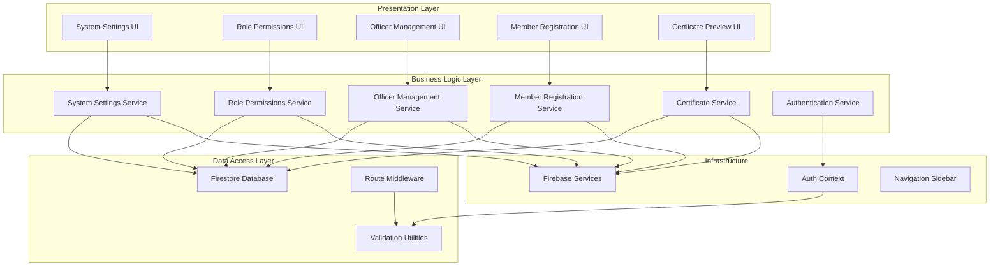
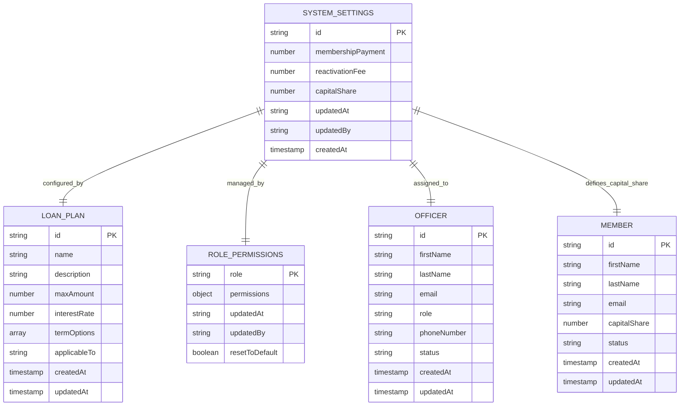
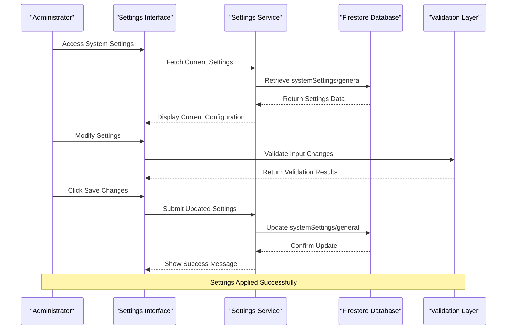
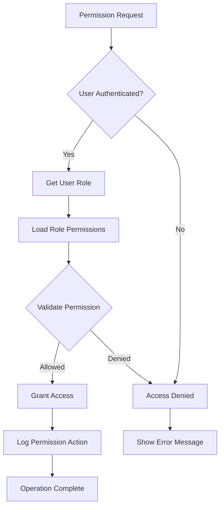
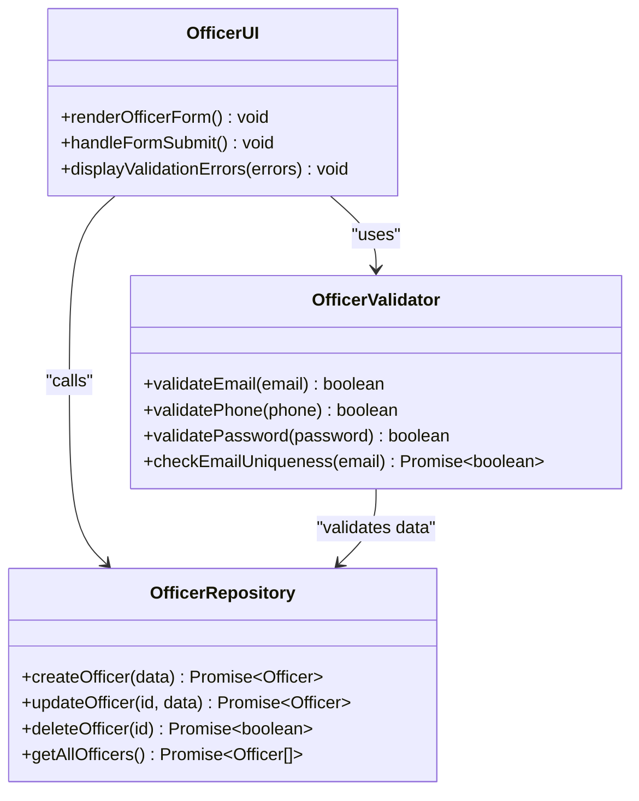
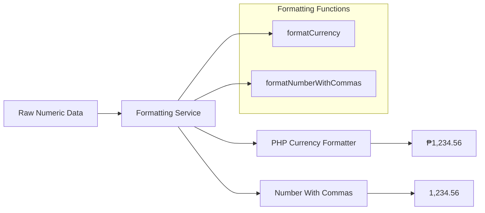
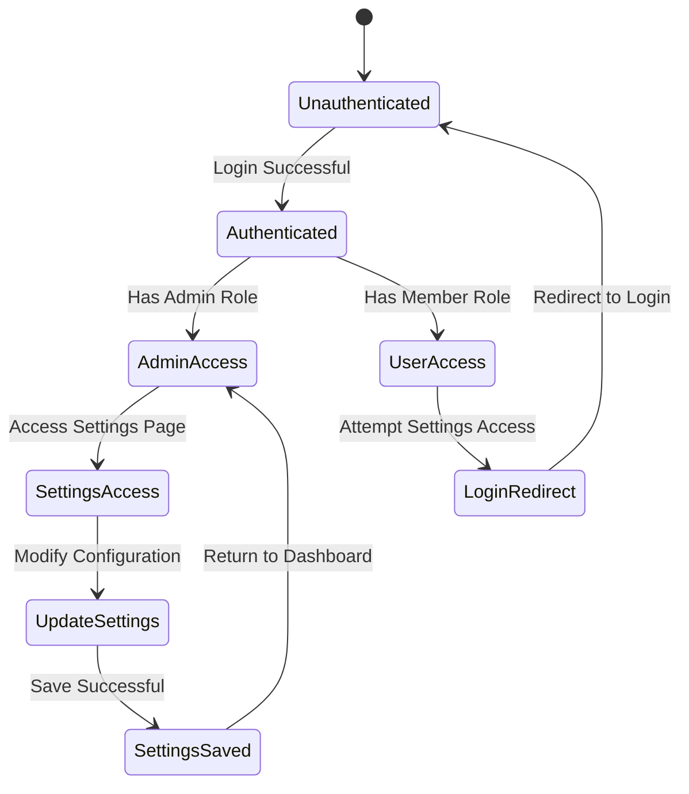
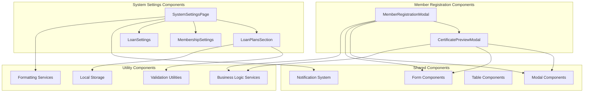
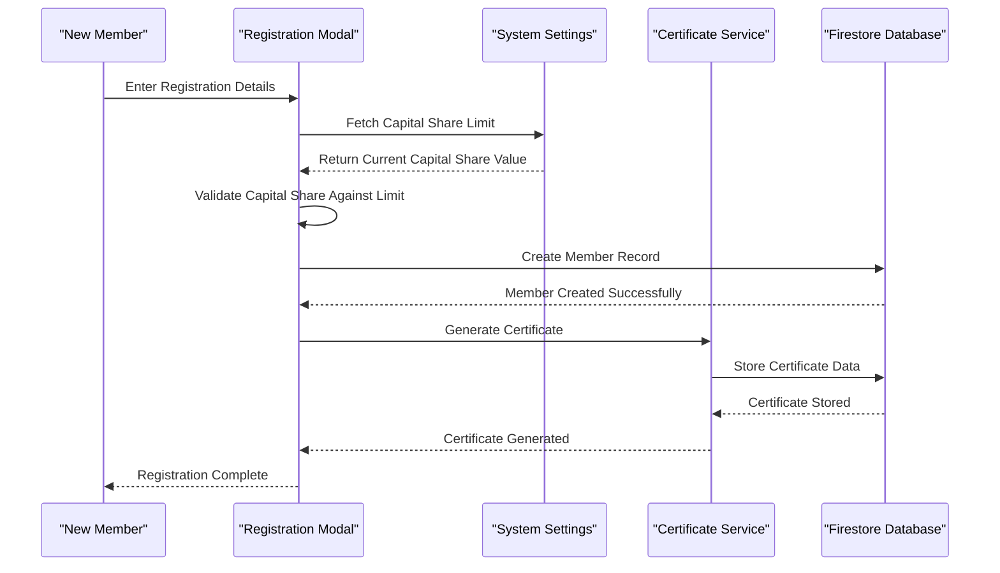
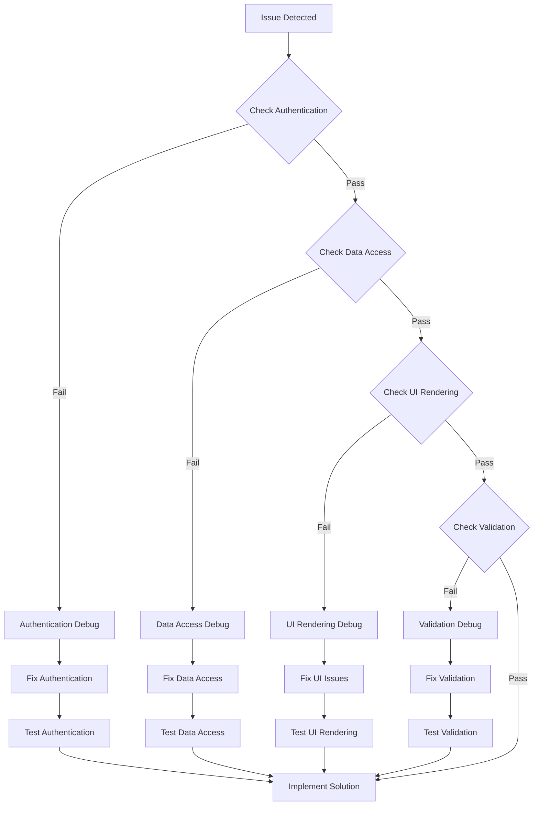

# System Settings

<cite>
**Referenced Files in This Document**
- [page.tsx](file://app/admin/settings/system/page.tsx)
- [settingsService.ts](file://lib/settingsService.ts)
- [sidebarConfig.ts](file://lib/sidebarConfig.ts)
- [permissions/page.tsx](file://app/admin/settings/permissions/page.tsx)
- [officers/page.tsx](file://app/admin/settings/officers/page.tsx)
- [rolePermissions.tsx](file://lib/rolePermissions.tsx)
- [firebase.ts](file://lib/firebase.ts)
- [auth.tsx](file://lib/auth.tsx)
- [validators.ts](file://lib/validators.ts)
- [middleware.ts](file://middleware.ts)
- [admin/layout.tsx](file://app/admin/layout.tsx)
- [MemberRegistrationModal.tsx](file://components/admin/MemberRegistrationModal.tsx)
- [certificateService.ts](file://lib/certificateService.ts)
- [SecretaryMemberRegistrationModal.tsx](file://app/admin/secretary/components/SecretaryMemberRegistrationModal.tsx)
- [CertificatePreviewModal.tsx](file://components/admin/CertificatePreviewModal.tsx)
</cite>

## Update Summary
**Changes Made**
- Updated System Settings interface to include new capital share amount field with default value of 10,000
- Enhanced member registration validation to integrate with capital share settings
- Integrated certificate workflows with capital share amount validation
- Updated system configuration to support dynamic capital share limits

## Table of Contents
1. [Introduction](#introduction)
2. [System Architecture](#system-architecture)
3. [Core Components](#core-components)
4. [System Settings Management](#system-settings-management)
5. [Role-Based Permissions](#role-based-permissions)
6. [Officer Management](#officer-management)
7. [Data Flow and Storage](#data-flow-and-storage)
8. [Security and Access Control](#security-and-access-control)
9. [User Interface Components](#user-interface-components)
10. [Integration Points](#integration-points)
11. [Troubleshooting Guide](#troubleshooting-guide)
12. [Conclusion](#conclusion)

## Introduction

The SAMPA-Coop System Settings module provides comprehensive administrative controls for managing cooperative policies, financial configurations, and operational parameters. This system enables authorized administrators to configure membership fees, capital shares, loan plans, and officer management while maintaining strict access controls and audit trails.

The system is built on a modern React/Next.js architecture with Firebase Firestore as the primary data store, implementing role-based access control (RBAC) and comprehensive validation mechanisms to ensure data integrity and security.

**Updated** Added new capital share amount field to SystemSettings interface with default value of 10,000, integrated with member registration validation and certificate workflows.

## System Architecture

The System Settings functionality follows a layered architecture pattern with clear separation of concerns:

**Diagram sources**
- [page.tsx:1-873](file://app/admin/settings/system/page.tsx#L1-L873)
- [settingsService.ts:1-56](file://lib/settingsService.ts#L1-L56)
- [firebase.ts:1-384](file://lib/firebase.ts#L1-L384)
- [MemberRegistrationModal.tsx:1570-1734](file://components/admin/MemberRegistrationModal.tsx#L1570-L1734)
- [certificateService.ts:1-410](file://lib/certificateService.ts#L1-L410)

## Core Components

### System Settings Interface

The System Settings component provides a comprehensive interface for managing cooperative financial policies and operational parameters. It consists of three primary sections:

#### Membership Configuration
- **Membership Payment Amount**: Configurable monthly membership fee
- **Member Reactivation Fee**: Fee for reinstating inactive memberships
- **Capital Share Amount**: Initial investment requirement for new members (default: ₱10,000.00)

#### Loan Plan Management
- **Maximum Loan Amount**: Upper limit for individual loan requests
- **Interest Rate**: Annual percentage rate for loan calculations
- **Term Options**: Available repayment periods (in months)
- **Applicable To**: Target member categories (Drivers, Operators, All Members)

#### Administrative Controls
- Real-time currency formatting for Philippine Pesos (PHP)
- Automatic default value population
- Change tracking with timestamps and user attribution
- Bulk reset capabilities for system-wide defaults

**Updated** The capital share amount field is now a configurable setting with a default value of 10,000, integrated with member registration validation and certificate workflows.

**Section sources**
- [page.tsx:19-31](file://app/admin/settings/system/page.tsx#L19-L31)
- [page.tsx:208-314](file://app/admin/settings/system/page.tsx#L208-L314)
- [settingsService.ts:3-9](file://lib/settingsService.ts#L3-L9)

### Role-Based Permissions System

The permissions system implements a hierarchical access control model supporting seven distinct officer roles:

| Role | Access Level | Key Permissions |
|------|--------------|-----------------|
| Administrator | Full Access | Complete system control |
| Chairman | Executive | Policy oversight |
| Vice Chairman | Executive | Policy oversight |
| Secretary | Administrative | Record management |
| Treasurer | Financial | Financial operations |
| Manager | Operational | Departmental management |
| Board of Directors | Observational | Policy review |

**Section sources**
- [permissions/page.tsx:27-148](file://app/admin/settings/permissions/page.tsx#L27-L148)
- [rolePermissions.tsx:24-130](file://lib/rolePermissions.tsx#L24-L130)

### Officer Management Interface

The officer management system provides comprehensive personnel administration with advanced validation and security features:

#### Validation Mechanisms
- **Email Verification**: RFC-compliant email format validation
- **Phone Number Validation**: Philippines mobile number format (09XXXXXXXXX)
- **Password Security**: Minimum 8-character requirement with visibility toggle
- **Duplicate Prevention**: Real-time email uniqueness checks

#### Administrative Operations
- **Hierarchical Sorting**: Role-based ranking system
- **Bulk Operations**: Add, edit, delete officer records
- **Status Management**: Active/inactive account states
- **Search Functionality**: Multi-field filtering capabilities

**Section sources**
- [officers/page.tsx:103-161](file://app/admin/settings/officers/page.tsx#L103-L161)
- [officers/page.tsx:270-289](file://app/admin/settings/officers/page.tsx#L270-L289)

## System Settings Management

### Data Model Architecture

The system settings follow a structured data model optimized for scalability and maintainability:

**Updated** Added MEMBER entity relationship to show how capital share settings define member capital share amounts.

**Diagram sources**
- [page.tsx:8-17](file://app/admin/settings/system/page.tsx#L8-L17)
- [page.tsx:19-25](file://app/admin/settings/system/page.tsx#L19-L25)
- [permissions/page.tsx:9-25](file://app/admin/settings/permissions/page.tsx#L9-L25)

### Configuration Workflow

The system implements a robust configuration workflow ensuring data consistency and user experience:

**Diagram sources**
- [page.tsx:46-97](file://app/admin/settings/system/page.tsx#L46-L97)
- [settingsService.ts:21-37](file://lib/settingsService.ts#L21-L37)

**Section sources**
- [page.tsx:42-97](file://app/admin/settings/system/page.tsx#L42-L97)
- [settingsService.ts:21-37](file://lib/settingsService.ts#L21-L37)

## Role-Based Permissions

### Permission Hierarchy

The role-based permissions system implements a sophisticated access control model with granular control over administrative functions:

#### Permission Categories
- **Member Management**: View, add, edit, archive member records
- **Loan Operations**: View, approve, reject loan applications
- **Financial Management**: View, manage savings accounts
- **Reporting**: View analytics and generate reports
- **System Administration**: Manage settings and user roles

#### Role-Specific Capabilities

| Permission Category | Administrator | Chairman | Secretary | Treasurer | Manager | Board |
|-------------------|---------------|----------|-----------|-----------|---------|-------|
| View Members | ✅ | ✅ | ✅ | ❌ | ❌ | ❌ |
| Add Members | ✅ | ❌ | ✅ | ❌ | ❌ | ❌ |
| Edit Members | ✅ | ✅ | ✅ | ❌ | ❌ | ❌ |
| Archive Members | ✅ | ❌ | ✅ | ❌ | ❌ | ❌ |
| View Loans | ✅ | ✅ | ✅ | ✅ | ✅ | ✅ |
| Approve Loans | ✅ | ✅ | ❌ | ❌ | ❌ | ❌ |
| Reject Loans | ✅ | ✅ | ❌ | ❌ | ❌ | ❌ |
| View Savings | ✅ | ✅ | ✅ | ✅ | ✅ | ❌ |
| Manage Savings | ✅ | ❌ | ✅ | ✅ | ✅ | ❌ |
| View Reports | ✅ | ✅ | ✅ | ✅ | ✅ | ✅ |
| Export Data | ✅ | ✅ | ✅ | ✅ | ✅ | ❌ |
| Manage Settings | ✅ | ❌ | ❌ | ❌ | ❌ | ❌ |

**Section sources**
- [permissions/page.tsx:27-148](file://app/admin/settings/permissions/page.tsx#L27-L148)
- [rolePermissions.tsx:24-130](file://lib/rolePermissions.tsx#L24-L130)

### Permission Enforcement

The system enforces permissions through multiple layers of validation:

**Diagram sources**
- [rolePermissions.tsx:155-206](file://lib/rolePermissions.tsx#L155-L206)
- [validators.ts:9-19](file://lib/validators.ts#L9-L19)

**Section sources**
- [rolePermissions.tsx:155-206](file://lib/rolePermissions.tsx#L155-L206)
- [validators.ts:9-19](file://lib/validators.ts#L9-L19)

## Officer Management

### Administrative Dashboard

The officer management interface provides comprehensive personnel administration with advanced features:

#### Search and Filtering
- **Multi-field Search**: Name, email, role-based filtering
- **Hierarchical Sorting**: Role precedence with alphabetical ordering
- **Real-time Updates**: Live filtering as users type

#### Validation Pipeline
- **Email Uniqueness**: Prevent duplicate officer registrations
- **Phone Number Format**: Philippines mobile number validation
- **Password Requirements**: Minimum length and complexity checks
- **Role Assignment**: Proper validation against supported roles

#### User Experience Features
- **Modal-based Forms**: Non-intrusive editing interface
- **Password Visibility**: Toggle for secure password entry
- **Auto-validation**: Real-time feedback on form completion
- **Bulk Operations**: Efficient management of multiple officers

**Section sources**
- [officers/page.tsx:270-289](file://app/admin/settings/officers/page.tsx#L270-L289)
- [officers/page.tsx:103-161](file://app/admin/settings/officers/page.tsx#L103-L161)

### Data Integrity Measures

The system implements multiple safeguards to ensure data accuracy and consistency:

**Diagram sources**
- [officers/page.tsx:103-161](file://app/admin/settings/officers/page.tsx#L103-L161)
- [officers/page.tsx:180-205](file://app/admin/settings/officers/page.tsx#L180-L205)

**Section sources**
- [officers/page.tsx:103-161](file://app/admin/settings/officers/page.tsx#L103-L161)
- [officers/page.tsx:180-205](file://app/admin/settings/officers/page.tsx#L180-L205)

## Data Flow and Storage

### Firestore Integration

The system leverages Firebase Firestore for scalable, real-time data management with comprehensive security and validation:

#### Document Structure
- **systemSettings**: Single document containing all cooperative policies
- **rolePermissions**: Separate documents for each officer role's permission set
- **users**: Comprehensive user database with role-based access
- **loanPlans**: Dynamic collection for configurable loan products
- **members**: Member records with capital share information
- **member_certificates**: Certificate records linked to member data

#### Data Synchronization
- **Real-time Updates**: Automatic UI updates when data changes
- **Offline Support**: Local caching with automatic synchronization
- **Conflict Resolution**: Intelligent handling of concurrent modifications
- **Audit Trails**: Complete history of all system changes

**Updated** Added member_certificates collection for certificate workflow integration.

**Section sources**
- [firebase.ts:91-327](file://lib/firebase.ts#L91-L327)
- [page.tsx:49-62](file://app/admin/settings/system/page.tsx#L49-L62)

### Currency and Number Formatting

The system implements standardized formatting for financial data:

**Diagram sources**
- [page.tsx:115-125](file://app/admin/settings/system/page.tsx#L115-L125)
- [settingsService.ts:42-55](file://lib/settingsService.ts#L42-L55)

**Section sources**
- [page.tsx:115-125](file://app/admin/settings/system/page.tsx#L115-L125)
- [settingsService.ts:42-55](file://lib/settingsService.ts#L42-L55)

## Security and Access Control

### Authentication Framework

The system implements a comprehensive authentication framework with multiple security layers:

#### Cookie-Based Authentication
- **Secure Cookies**: Role-based authentication tokens
- **Expiration Handling**: 7-day session lifetime
- **Cross-site Protection**: Proper cookie attributes for security
- **Automatic Cleanup**: Session termination on logout

#### Route Protection
- **Middleware Validation**: Request-level access control
- **Role Verification**: Dynamic permission checking
- **Redirect Management**: Intelligent navigation based on user roles
- **Unauthorized Access**: Proper handling of insufficient privileges

#### Security Measures
- **Input Sanitization**: Comprehensive form validation
- **SQL Injection Prevention**: Parameterized queries
- **XSS Protection**: Content security policies
- **CSRF Protection**: Request verification mechanisms

**Section sources**
- [auth.tsx:168-199](file://lib/auth.tsx#L168-L199)
- [middleware.ts:5-56](file://middleware.ts#L5-L56)
- [validators.ts:199-235](file://lib/validators.ts#L199-L235)

### Authorization Patterns

The system employs multiple authorization patterns for different security contexts:

**Diagram sources**
- [auth.tsx:201-375](file://lib/auth.tsx#L201-L375)
- [validators.ts:9-19](file://lib/validators.ts#L9-L19)

**Section sources**
- [auth.tsx:201-375](file://lib/auth.tsx#L201-L375)
- [validators.ts:9-19](file://lib/validators.ts#L9-L19)

## User Interface Components

### Responsive Design Architecture

The system implements a responsive, mobile-first design approach with adaptive layouts:

#### Layout Components
- **Collapsible Sidebar**: Adaptive navigation for desktop and mobile
- **Responsive Grid System**: Flexible content arrangement
- **Mobile Navigation**: Slide-out menu for touch interfaces
- **Progressive Enhancement**: Feature detection and graceful degradation

#### Interactive Elements
- **Form Validation**: Real-time input validation with visual feedback
- **Loading States**: Progress indicators for asynchronous operations
- **Error Handling**: User-friendly error messages and recovery options
- **Success Feedback**: Confirmation messages for completed actions

#### Accessibility Features
- **Keyboard Navigation**: Full keyboard support for all interactive elements
- **Screen Reader Compatibility**: ARIA labels and semantic markup
- **Color Contrast**: High contrast ratios for visual accessibility
- **Focus Management**: logical tab order and focus indicators

**Section sources**
- [admin/layout.tsx:60-109](file://app/admin/layout.tsx#L60-L109)
- [page.tsx:157-314](file://app/admin/settings/system/page.tsx#L157-L314)

### Component Architecture

The system follows a modular component architecture promoting reusability and maintainability:

**Updated** Added MemberRegistrationModal and CertificatePreviewModal components to the component architecture.

**Diagram sources**
- [page.tsx:316-873](file://app/admin/settings/system/page.tsx#L316-L873)
- [settingsService.ts:1-56](file://lib/settingsService.ts#L1-L56)
- [MemberRegistrationModal.tsx:1570-1734](file://components/admin/MemberRegistrationModal.tsx#L1570-L1734)
- [CertificatePreviewModal.tsx:1-200](file://components/admin/CertificatePreviewModal.tsx#L1-L200)

**Section sources**
- [page.tsx:316-873](file://app/admin/settings/system/page.tsx#L316-L873)
- [settingsService.ts:1-56](file://lib/settingsService.ts#L1-L56)

## Integration Points

### Sidebar Navigation Integration

The system settings integrate seamlessly with the broader navigation architecture:

#### Role-Based Sidebar Configuration
- **Dynamic Menu Generation**: Sidebar content adapts to user roles
- **Permission Filtering**: Menu items hidden based on user permissions
- **Icon Integration**: Consistent iconography across all settings pages
- **Active State Management**: Visual indication of current page location

#### Navigation Flow
- **Settings Access**: Dedicated navigation items for system configuration
- **Cross-page Links**: Consistent navigation between related settings
- **Breadcrumb Support**: Hierarchical navigation aids
- **Shortcuts**: Quick access to frequently used settings

**Section sources**
- [sidebarConfig.ts:35-429](file://lib/sidebarConfig.ts#L35-L429)
- [admin/layout.tsx:70-82](file://app/admin/layout.tsx#L70-L82)

### API Integration Points

The system integrates with multiple API endpoints for comprehensive functionality:

#### Authentication APIs
- **User Authentication**: Secure login and session management
- **Password Management**: Secure password handling and validation
- **Session Tracking**: Real-time session monitoring and management

#### Data Management APIs
- **Document Operations**: CRUD operations for all system data
- **Batch Operations**: Efficient bulk data processing
- **Real-time Sync**: WebSocket-based real-time data updates

#### Utility APIs
- **File Uploads**: Secure document and image management
- **Email Services**: Automated notification and communication
- **Report Generation**: Dynamic report creation and export

**Section sources**
- [firebase.ts:91-327](file://lib/firebase.ts#L91-L327)
- [auth.tsx:201-375](file://lib/auth.tsx#L201-L375)

### Member Registration and Certificate Integration

**Updated** The system now integrates capital share settings with member registration and certificate workflows:

**Diagram sources**
- [MemberRegistrationModal.tsx:1570-1734](file://components/admin/MemberRegistrationModal.tsx#L1570-L1734)
- [certificateService.ts:250-410](file://lib/certificateService.ts#L250-L410)

The integration ensures that:
- Capital share amounts are validated against system settings
- Certificate generation uses the member's capital share amount
- Member records include capital share information for audit purposes

**Section sources**
- [MemberRegistrationModal.tsx:1570-1734](file://components/admin/MemberRegistrationModal.tsx#L1570-L1734)
- [certificateService.ts:12-410](file://lib/certificateService.ts#L12-L410)
- [SecretaryMemberRegistrationModal.tsx:187-1042](file://app/admin/secretary/components/SecretaryMemberRegistrationModal.tsx#L187-L1042)

## Troubleshooting Guide

### Common Issues and Solutions

#### Authentication Problems
- **Issue**: Users unable to access settings pages
- **Cause**: Insufficient role permissions or expired sessions
- **Solution**: Verify user role assignments and refresh authentication cookies

#### Data Loading Failures
- **Issue**: Settings not displaying or loading indefinitely
- **Cause**: Firestore connectivity issues or permission denials
- **Solution**: Check network connectivity and verify Firestore rules

#### Form Validation Errors
- **Issue**: Form submissions failing validation
- **Cause**: Invalid input formats or missing required fields
- **Solution**: Review validation rules and ensure proper data formatting

#### Performance Issues
- **Issue**: Slow page loads or delayed updates
- **Cause**: Large datasets or inefficient queries
- **Solution**: Optimize Firestore queries and implement pagination

#### Capital Share Validation Issues
- **Issue**: Capital share amounts exceeding system limits
- **Cause**: Member attempting to register with amount higher than configured limit
- **Solution**: Adjust system settings or educate registrars on capital share limits

**Updated** Added troubleshooting guidance for capital share validation issues.

### Diagnostic Tools

The system provides comprehensive diagnostic capabilities:

**Diagram sources**
- [auth.tsx:168-199](file://lib/auth.tsx#L168-L199)
- [firebase.ts:63-88](file://lib/firebase.ts#L63-L88)

**Section sources**
- [auth.tsx:168-199](file://lib/auth.tsx#L168-L199)
- [firebase.ts:63-88](file://lib/firebase.ts#L63-L88)

### Monitoring and Logging

The system implements comprehensive monitoring and logging for operational insights:

#### Audit Trail Features
- **Change Tracking**: Complete history of all system modifications
- **User Activity**: Detailed logs of user actions and access patterns
- **Error Reporting**: Systematic error capture and reporting mechanisms
- **Performance Metrics**: Real-time monitoring of system performance

#### Alerting Systems
- **Critical Errors**: Immediate notification of system failures
- **Security Events**: Alerts for suspicious authentication attempts
- **Performance Degradation**: Warnings for unusual system behavior
- **Maintenance Required**: Notifications for system maintenance needs

**Section sources**
- [auth.tsx:648-662](file://lib/auth.tsx#L648-L662)
- [firebase.ts:329-345](file://lib/firebase.ts#L329-L345)

## Conclusion

The SAMPA-Coop System Settings module represents a comprehensive solution for cooperative management, providing administrators with powerful tools to configure and manage all aspects of the organization's operations. The system's architecture emphasizes security, scalability, and user experience while maintaining strict compliance with organizational governance requirements.

**Updated** Recent enhancements include the addition of a configurable capital share amount field with default value of 10,000, integrated with member registration validation and certificate workflows. This enhancement strengthens the system's financial management capabilities and ensures proper capital share tracking throughout the member lifecycle.

Key strengths of the system include its robust role-based access control, comprehensive validation mechanisms, real-time data synchronization, and intuitive user interface design. The modular architecture ensures maintainability and extensibility for future enhancements.

The implementation demonstrates best practices in modern web development, leveraging contemporary technologies and patterns to deliver a reliable, secure, and efficient administrative platform. The system's comprehensive error handling, monitoring capabilities, and troubleshooting tools ensure operational reliability and ease of maintenance.

Future enhancements could include expanded reporting capabilities, advanced analytics features, and integration with external systems for enhanced functionality and automation.