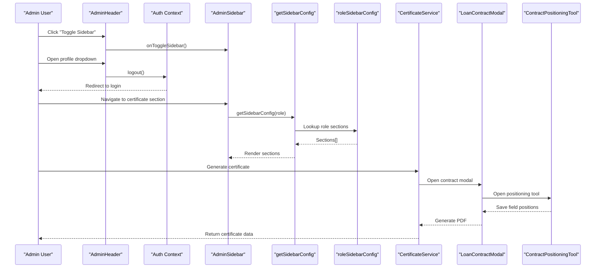
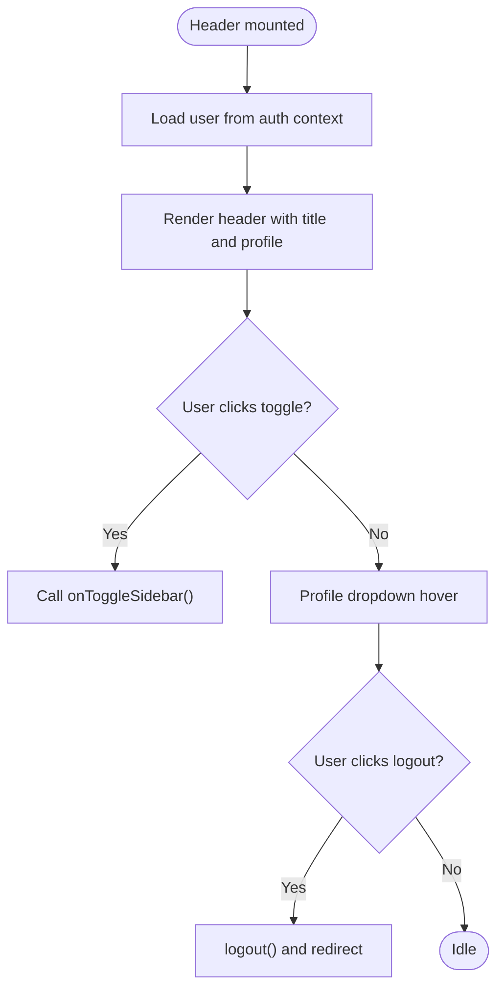
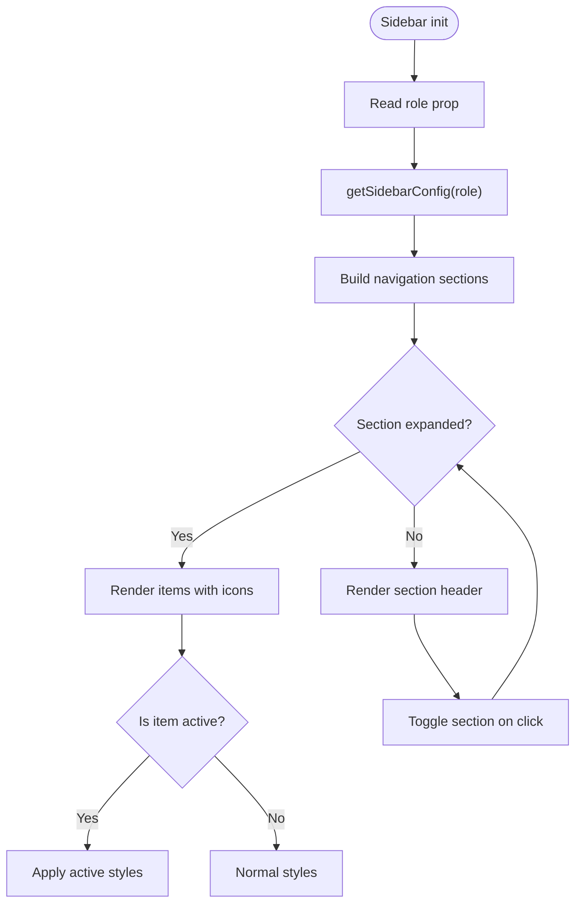
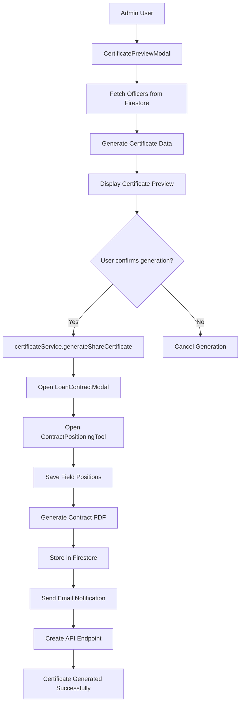
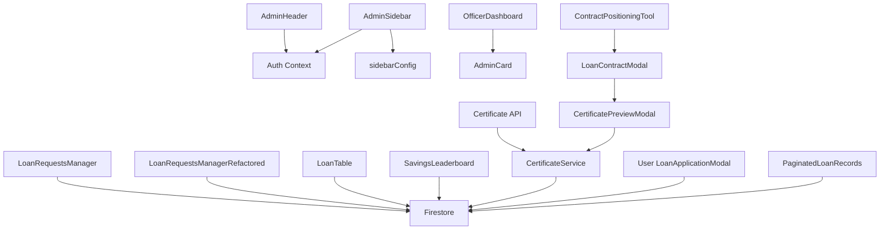

# Administrative Components

<cite>
**Referenced Files in This Document**
- [components/admin/index.ts](file://components/admin/index.ts)
- [components/admin/Header.tsx](file://components/admin/Header.tsx)
- [components/admin/Footer.tsx](file://components/admin/Footer.tsx)
- [components/admin/Card.tsx](file://components/admin/Card.tsx)
- [components/admin/Sidebar.tsx](file://components/admin/Sidebar.tsx)
- [components/admin/LoanRequestsManager.tsx](file://components/admin/LoanRequestsManager.tsx)
- [components/admin/LoanRequestsManagerRefactored.tsx](file://components/admin/LoanRequestsManagerRefactored.tsx)
- [components/admin/LoanTable.tsx](file://components/admin/LoanTable.tsx)
- [components/admin/LoanRequestsTable.tsx](file://components/admin/LoanRequestsTable.tsx)
- [components/admin/Pagination.tsx](file://components/admin/Pagination.tsx)
- [components/admin/SavingsLeaderboard.tsx](file://components/admin/SavingsLeaderboard.tsx)
- [components/admin/LoanRecords.tsx](file://components/admin/LoanRecords.tsx)
- [components/admin/SavingsRecords.tsx](file://components/admin/SavingsRecords.tsx)
- [components/admin/ReportsAndAnalytics.tsx](file://components/admin/ReportsAndAnalytics.tsx)
- [components/admin/AddSavingsModal.tsx](file://components/admin/AddSavingsModal.tsx)
- [components/admin/MemberDetailsModal.tsx](file://components/admin/MemberDetailsModal.tsx)
- [components/admin/MemberEditModal.tsx](file://components/admin/MemberEditModal.tsx)
- [components/admin/MemberRegistrationModal.tsx](file://components/admin/MemberRegistrationModal.tsx)
- [components/admin/LoanDetailsModal.tsx](file://components/admin/LoanDetailsModal.tsx)
- [components/admin/MemberRecordsReadOnly.tsx](file://components/admin/MemberRecordsReadOnly.tsx)
- [components/admin/OfficerDashboard.tsx](file://components/admin/OfficerDashboard.tsx)
- [components/admin/CertificatePreviewModal.tsx](file://components/admin/CertificatePreviewModal.tsx)
- [components/admin/LoanContractModal.tsx](file://components/admin/LoanContractModal.tsx)
- [components/admin/ContractPositioningTool.tsx](file://components/admin/ContractPositioningTool.tsx)
- [components/admin/ContractPreview.tsx](file://components/admin/ContractPreview.tsx)
- [components/admin/LoanRequestDetailsModal.tsx](file://components/admin/LoanRequestDetailsModal.tsx)
- [components/admin/PaginatedLoanRecords.tsx](file://components/admin/PaginatedLoanRecords.tsx)
- [components/shared/Header.tsx](file://components/shared/Header.tsx)
- [components/shared/Footer.tsx](file://components/shared/Footer.tsx)
- [components/shared/CollapsibleSidebar.tsx](file://components/shared/CollapsibleSidebar.tsx)
- [lib/sidebarConfig.ts](file://lib/sidebarConfig.ts)
- [lib/auth.tsx](file://lib/auth.tsx)
- [lib/certificateService.ts](file://lib/certificateService.ts)
- [app/api/certificate/[memberId]/route.ts](file://app/api/certificate/[memberId]/route.ts)
- [components/user/LoanApplicationModal.tsx](file://components/user/LoanApplicationModal.tsx)
</cite>

## Update Summary
**Changes Made**
- Updated to reflect Applied Changes: Enhanced UI components including improved certificate preview functionality, streamlined loan processing interfaces, better loan detail presentation, and enhanced user-side loan management with improved borrowing experience
- Added comprehensive documentation for the newly enhanced certificate generation system with interactive preview, positioning tool, and contract management
- Documented the improved loan contract workflow with positioning tool and enhanced loan detail presentation
- Updated loan management components to reflect modernized interfaces and better user experience
- Enhanced documentation to cover the complete loan application and management ecosystem

## Table of Contents
1. [Introduction](#introduction)
2. [Project Structure](#project-structure)
3. [Core Components](#core-components)
4. [Architecture Overview](#architecture-overview)
5. [Detailed Component Analysis](#detailed-component-analysis)
6. [Enhanced Certificate Generation System](#enhanced-certificate-generation-system)
7. [Improved Loan Processing Interfaces](#improved-loan-processing-interfaces)
8. [Enhanced User-Side Loan Management](#enhanced-user-side-loan-management)
9. [API Integration and Workflow Integration](#api-integration-and-workflow-integration)
10. [Dependency Analysis](#dependency-analysis)
11. [Performance Considerations](#performance-considerations)
12. [Troubleshooting Guide](#troubleshooting-guide)
13. [Conclusion](#conclusion)
14. [Appendices](#appendices)

## Introduction
This document describes the Administrative Components used across the SAMPA Cooperative Management Platform's officer dashboards. The platform provides comprehensive administrative functionality for managing cooperative operations including member management, loan processing, savings administration, and certificate generation. The system adapts shared UI elements for administrative contexts while offering specialized functionality for cooperative governance and member services.

**Updated** The platform now features enhanced UI components with improved certificate preview functionality, streamlined loan processing interfaces, better loan detail presentation, and enhanced user-side loan management with improved borrowing experience.

## Project Structure
The administrative UI is organized under components/admin with core components for dashboard management, loan processing, member administration, and reporting. The system includes enhanced certificate generation capabilities, improved loan request management, and comprehensive contract positioning tools.

```mermaid
graph TB
subgraph "Core Admin Components"
A_Index["components/admin/index.ts"]
A_Header["components/admin/Header.tsx"]
A_Footer["components/admin/Footer.tsx"]
A_Card["components/admin/Card.tsx"]
A_Sidebar["components/admin/Sidebar.tsx"]
A_Dashboard["components/admin/OfficerDashboard.tsx"]
A_LoanTable["components/admin/LoanTable.tsx"]
A_LoanRequestsTable["components/admin/LoanRequestsTable.tsx"]
A_Pagination["components/admin/Pagination.tsx"]
A_SavingsLeaderboard["components/admin/SavingsLeaderboard.tsx"]
A_LoanRecords["components/admin/LoanRecords.tsx"]
A_SavingsRecords["components/admin/SavingsRecords.tsx"]
A_Reports["components/admin/ReportsAndAnalytics.tsx"]
A_AddSavingsModal["components/admin/AddSavingsModal.tsx"]
A_MemberDetailsModal["components/admin/MemberDetailsModal.tsx"]
A_MemberEditModal["components/admin/MemberEditModal.tsx"]
A_MemberRegistrationModal["components/admin/MemberRegistrationModal.tsx"]
A_LoanDetailsModal["components/admin/LoanDetailsModal.tsx"]
A_MemberRecordsReadOnly["components/admin/MemberRecordsReadOnly.tsx"]
A_PaginatedLoanRecords["components/admin/PaginatedLoanRecords.tsx"]
end
subgraph "Enhanced Certificate System"
A_CertificatePreview["components/admin/CertificatePreviewModal.tsx"]
A_LoanContract["components/admin/LoanContractModal.tsx"]
A_ContractPreview["components/admin/ContractPreview.tsx"]
A_PositioningTool["components/admin/ContractPositioningTool.tsx"]
A_RequestDetails["components/admin/LoanRequestDetailsModal.tsx"]
end
subgraph "Enhanced Services"
L_SidebarCfg["lib/sidebarConfig.ts"]
L_Auth["lib/auth.tsx"]
L_CertificateService["lib/certificateService.ts"]
API_Certificate["app/api/certificate/[memberId]/route.ts"]
end
subgraph "User Experience Enhancements"
U_LoanApp["components/user/LoanApplicationModal.tsx"]
end
A_Index --> A_Header
A_Index --> A_Footer
A_Index --> A_Card
A_Index --> A_Sidebar
A_Index --> A_LoanTable
A_Index --> A_LoanRequestsTable
A_Index --> A_Pagination
A_Index --> A_SavingsLeaderboard
A_Index --> A_LoanRecords
A_Index --> A_SavingsRecords
A_Index --> A_Reports
A_Index --> A_AddSavingsModal
A_Index --> A_MemberDetailsModal
A_Index --> A_MemberEditModal
A_Index --> A_MemberRegistrationModal
A_Index --> A_LoanDetailsModal
A_Index --> A_MemberRecordsReadOnly
A_Index --> A_PaginatedLoanRecords
A_Sidebar --> L_SidebarCfg
A_Header --> L_Auth
A_Dashboard --> A_Card
A_LoanTable --> L_CertificateService
A_CertificatePreview --> A_ContractPreview
A_LoanContract --> A_PositioningTool
A_PositioningTool --> A_ContractPreview
API_Certificate --> L_CertificateService
U_LoanApp --> A_LoanRequestsTable
```

**Diagram sources**
- [components/admin/index.ts:1-16](file://components/admin/index.ts#L1-L16)
- [components/admin/CertificatePreviewModal.tsx:1-665](file://components/admin/CertificatePreviewModal.tsx#L1-L665)
- [components/admin/LoanContractModal.tsx:1-404](file://components/admin/LoanContractModal.tsx#L1-L404)
- [components/admin/ContractPositioningTool.tsx:1-327](file://components/admin/ContractPositioningTool.tsx#L1-L327)
- [components/admin/ContractPreview.tsx:1-177](file://components/admin/ContractPreview.tsx#L1-L177)
- [components/admin/LoanRequestDetailsModal.tsx:1-200](file://components/admin/LoanRequestDetailsModal.tsx#L1-L200)
- [components/user/LoanApplicationModal.tsx:1-252](file://components/user/LoanApplicationModal.tsx#L1-L252)

**Section sources**
- [components/admin/index.ts:1-16](file://components/admin/index.ts#L1-L16)
- [lib/sidebarConfig.ts:1-262](file://lib/sidebarConfig.ts#L1-L262)
- [lib/auth.tsx:111-156](file://lib/auth.tsx#L111-L156)

## Core Components
This section documents the primary admin UI building blocks and their responsibilities, focusing on the current functional components.

- Admin Header
  - Purpose: Top navigation bar for admin panels with sidebar toggle, branding, and user profile dropdown.
  - Key props: sidebarCollapsed, onToggleSidebar.
  - Behavior: Integrates with authentication to provide logout and displays user email.
  - Reference: [components/admin/Header.tsx:37-43](file://components/admin/Header.tsx#L37-L43)

- Admin Footer
  - Purpose: Fixed footer for admin panels with copyright and version info.
  - Behavior: Minimalist design with current year and panel version.
  - Reference: [components/admin/Footer.tsx:8-22](file://components/admin/Footer.tsx#L8-L22)

- Admin Card
  - Purpose: Reusable container for admin content with optional title and responsive padding.
  - Key props: title, children, className.
  - Reference: [components/admin/Card.tsx:14-22](file://components/admin/Card.tsx#L14-L22)

- Admin Sidebar
  - Purpose: Collapsible navigation for admin dashboards with role-based sections, dropdowns, and logout.
  - Key props: collapsed, onToggle, role.
  - Behavior: Uses roleSidebarConfig to render appropriate sections; supports collapsed/expanded states; highlights active route.
  - Reference: [components/admin/Sidebar.tsx:92-96](file://components/admin/Sidebar.tsx#L92-L96)

- Role-based Navigation
  - Configuration: roleSidebarConfig defines per-role sections and items.
  - Resolution: getSidebarConfig(role) returns the appropriate sections for rendering.
  - Reference: [lib/sidebarConfig.ts:258-262](file://lib/sidebarConfig.ts#L258-L262)

- Authentication and Role Routing
  - getDashboardPath(role) determines the initial admin dashboard URL per role.
  - Reference: [lib/auth.tsx:111-156](file://lib/auth.tsx#L111-L156)

**Section sources**
- [components/admin/Header.tsx:25-105](file://components/admin/Header.tsx#L25-L105)
- [components/admin/Footer.tsx:1-23](file://components/admin/Footer.tsx#L1-L23)
- [components/admin/Card.tsx:1-35](file://components/admin/Card.tsx#L1-L35)
- [components/admin/Sidebar.tsx:77-279](file://components/admin/Sidebar.tsx#L77-L279)
- [lib/sidebarConfig.ts:29-262](file://lib/sidebarConfig.ts#L29-L262)
- [lib/auth.tsx:111-156](file://lib/auth.tsx#L111-L156)

## Architecture Overview
The admin components integrate with role-based navigation and authentication to deliver a cohesive officer dashboard experience. The system includes enhanced certificate generation, improved loan request handling, comprehensive member management capabilities, and streamlined loan processing interfaces. The Sidebar dynamically renders sections based on the user's role, while the Header and Footer provide consistent branding and user controls.

**Diagram sources**
- [components/admin/Header.tsx:44-59](file://components/admin/Header.tsx#L44-L59)
- [components/admin/Sidebar.tsx:92-115](file://components/admin/Sidebar.tsx#L92-L115)
- [lib/sidebarConfig.ts:258-262](file://lib/sidebarConfig.ts#L258-L262)
- [lib/certificateService.ts:12-294](file://lib/certificateService.ts#L12-L294)
- [components/admin/LoanContractModal.tsx:377-403](file://components/admin/LoanContractModal.tsx#L377-L403)
- [components/admin/ContractPositioningTool.tsx:134-200](file://components/admin/ContractPositioningTool.tsx#L134-L200)

## Detailed Component Analysis

### Admin Header Component
- Responsibilities
  - Toggle sidebar via callback prop.
  - Display application title and user email.
  - Provide logout dropdown with icon.
- Integration
  - Uses useAuth for user state and logout.
  - Calls centralized logout utility for admin sessions.
- Accessibility and UX
  - Focusable elements and hover states for interactive elements.
  - Dropdown visibility controlled by state.

**Diagram sources**
- [components/admin/Header.tsx:44-103](file://components/admin/Header.tsx#L44-L103)
- [lib/auth.tsx:621-635](file://lib/auth.tsx#L621-L635)

**Section sources**
- [components/admin/Header.tsx:25-105](file://components/admin/Header.tsx#L25-L105)
- [lib/auth.tsx:621-635](file://lib/auth.tsx#L621-L635)

### Admin Footer Component
- Responsibilities
  - Fixed footer with copyright and version label.
  - Minimal styling to maintain contrast against admin red/blue palette.
- Usage
  - Included at the bottom of admin layouts to ensure consistent branding.

**Section sources**
- [components/admin/Footer.tsx:1-23](file://components/admin/Footer.tsx#L1-L23)

### Admin Card Component
- Responsibilities
  - Container with optional title bar and inner content area.
  - Consistent spacing and shadow for elevation.
- Extensibility
  - Accepts additional className for custom styling.
- Example usage
  - Used within OfficerDashboard to present metrics and quick actions.

**Section sources**
- [components/admin/Card.tsx:1-35](file://components/admin/Card.tsx#L1-L35)
- [components/admin/OfficerDashboard.tsx:106-139](file://components/admin/OfficerDashboard.tsx#L106-L139)

### Admin Sidebar Component
- Responsibilities
  - Collapsible navigation with role-aware sections.
  - Dropdown menus for grouped items.
  - Active route highlighting.
  - Bottom logout button.
- Behavior
  - Uses getSidebarConfig(role) to render sections.
  - Maintains expanded/collapsed state for sections.
  - Supports collapsed mode with minimal icons.
- Integration
  - Uses Lucide icons mapped by name.
  - Links navigate via Next.js Link.

**Diagram sources**
- [components/admin/Sidebar.tsx:92-123](file://components/admin/Sidebar.tsx#L92-L123)
- [lib/sidebarConfig.ts:258-262](file://lib/sidebarConfig.ts#L258-L262)

**Section sources**
- [components/admin/Sidebar.tsx:77-279](file://components/admin/Sidebar.tsx#L77-L279)
- [lib/sidebarConfig.ts:29-262](file://lib/sidebarConfig.ts#L29-L262)

### Supporting Components and Dashboards

#### Enhanced Officer Dashboard
- Purpose: Role-specific dashboard displaying cooperative metrics and quick actions.
- Data: Fetches counts for members, active loans, loan requests, and certificates.
- Layout: Uses Admin Card for metric cards and quick action grid.
- Enhanced: Now includes certificate generation statistics and contract management metrics.

**Section sources**
- [components/admin/OfficerDashboard.tsx:14-198](file://components/admin/OfficerDashboard.tsx#L14-L198)

#### Enhanced Loan Requests Management
- LoanRequestsManager (Legacy)
  - Real-time listeners for pending/approved/rejected loan requests.
  - Tabbed interface with search and pagination.
  - Approval/rejection actions with Firestore updates.
  - Modal for detailed request view.
  - **Updated**: Enhanced with improved error handling and loading states.

- LoanRequestsManagerRefactored (New)
  - **New**: Uses modern hooks (useFirestoreData) for improved performance.
  - Eliminates need for composite indexes.
  - Cleaner separation of concerns with dedicated hooks.
  - Better error handling and loading states.

**Section sources**
- [components/admin/LoanRequestsTable.tsx:1-10](file://components/admin/LoanRequestsTable.tsx#L1-L10)
- [components/admin/LoanRequestsManager.tsx:64-716](file://components/admin/LoanRequestsManager.tsx#L64-L716)
- [components/admin/LoanRequestsManagerRefactored.tsx:1-224](file://components/admin/LoanRequestsManagerRefactored.tsx#L1-L224)

#### Enhanced LoanTable
- Purpose: Displays loan requests with approve/reject actions.
- Features: Status badges, currency/date formatting, processing indicators.
- Behavior: Updates Firestore on approve/reject and generates payment schedules.
- **Updated**: Enhanced with improved error handling and loading states.

**Section sources**
- [components/admin/LoanTable.tsx:59-339](file://components/admin/LoanTable.tsx#L59-L339)

#### Enhanced Pagination
- Purpose: Pagination controls for lists with ellipsis and responsive design.
- Props: currentPage, totalPages, onPageChange.
- Behavior: Generates page buttons with current page highlighting.

**Section sources**
- [components/admin/Pagination.tsx:11-141](file://components/admin/Pagination.tsx#L11-L141)

#### Enhanced SavingsLeaderboard
- Purpose: Displays top members by total savings with ranking and currency formatting.
- Data: Aggregates savings transactions and sorts top 10.
- Behavior: Loading skeleton and gradient styling for top ranks.

**Section sources**
- [components/admin/SavingsLeaderboard.tsx:32-213](file://components/admin/SavingsLeaderboard.tsx#L32-L213)

#### Enhanced AddSavingsModal
- Purpose: Modal for adding deposit/withdrawal transactions with validation and current balance display.
- Validation: Ensures positive amounts and prevents over-withdrawals.

**Section sources**
- [components/admin/AddSavingsModal.tsx:12-217](file://components/admin/AddSavingsModal.tsx#L12-L217)

#### Enhanced Member Registration and Management
- MemberRegistrationModal
  - Purpose: Multi-step modal for registering new members with role-specific details.
  - Validation: Comprehensive form validation with dynamic fields for operators' jeepney plates.
  - Integration: Uses user-member linking service and sends confirmation emails.

- MemberDetailsModal & MemberEditModal
  - Purpose: Enhanced member detail viewing and editing capabilities.
  - Integration: Seamless integration with certificate generation workflow.

- MemberRecordsReadOnly
  - Purpose: Read-only member records display for audit and compliance purposes.

**Section sources**
- [components/admin/MemberRegistrationModal.tsx:88-800](file://components/admin/MemberRegistrationModal.tsx#L88-L800)
- [components/admin/MemberDetailsModal.tsx](file://components/admin/MemberDetailsModal.tsx)
- [components/admin/MemberEditModal.tsx](file://components/admin/MemberEditModal.tsx)
- [components/admin/MemberRecordsReadOnly.tsx](file://components/admin/MemberRecordsReadOnly.tsx)

#### Enhanced Reports and Analytics
- Purpose: Comprehensive reporting capabilities for certificates, loans, and savings.
- Features: Exportable reports, filtering options, and data visualization.

**Section sources**
- [components/admin/ReportsAndAnalytics.tsx](file://components/admin/ReportsAndAnalytics.tsx)

#### Enhanced Paginated Loan Records
- Purpose: Comprehensive loan records management with advanced filtering and pagination.
- Features: Multi-column filtering, search functionality, detailed loan information display.
- Integration: Connects with loan details modal for comprehensive loan management.

**Section sources**
- [components/admin/PaginatedLoanRecords.tsx:1-454](file://components/admin/PaginatedLoanRecords.tsx#L1-L454)

## Enhanced Certificate Generation System
The platform includes a comprehensive certificate generation system that seamlessly integrates with the loan approval workflow and features advanced contract management capabilities.

### CertificatePreviewModal Component
- Purpose: Interactive modal for previewing and customizing share certificates before generation.
- Features:
  - Real-time certificate preview with A4 landscape dimensions
  - Customizable field positioning and styling
  - PDF generation and printing capabilities
  - Automatic officer name detection from Firestore
  - Confirmation workflow with validation

### Enhanced Contract Management System
- LoanContractModal
  - Purpose: Advanced loan contract creation with positioning tool integration.
  - Features: Real-time contract preview, field positioning tool, PDF generation.
  - Integration: Seamlessly connects with certificate generation workflow.

- ContractPositioningTool
  - Purpose: Drag-and-drop field positioning system for contract templates.
  - Features: Visual field placement, real-time preview, persistent settings.
  - Integration: Saves field positions to Firestore for consistent contract formatting.

- ContractPreview
  - Purpose: High-fidelity contract template rendering with dynamic field positioning.
  - Features: Responsive scaling, field overlay system, signature area placeholders.
  - Integration: Works with positioning tool and contract modal for complete workflow.

### Certificate Service
- Purpose: Backend service for generating and managing share certificates.
- Features:
  - Professional certificate PDF generation with official styling
  - Automatic Firestore integration for certificate storage
  - Email notification system for certificate delivery
  - Member certificate tracking and history
  - Support for both individual and bulk certificate generation

### API Integration
- Purpose: Server-side endpoint for certificate retrieval and management.
- Features:
  - Secure certificate access via member ID
  - Base64 encoding for certificate data transmission
  - Error handling for missing or invalid certificates
  - Content-type headers for proper PDF delivery

**Diagram sources**
- [components/admin/CertificatePreviewModal.tsx:82-150](file://components/admin/CertificatePreviewModal.tsx#L82-L150)
- [components/admin/LoanContractModal.tsx:377-403](file://components/admin/LoanContractModal.tsx#L377-L403)
- [components/admin/ContractPositioningTool.tsx:134-200](file://components/admin/ContractPositioningTool.tsx#L134-L200)
- [lib/certificateService.ts:12-294](file://lib/certificateService.ts#L12-L294)
- [app/api/certificate/[memberId]/route.ts](file://app/api/certificate/[memberId]/route.ts#L1-L68)

**Section sources**
- [components/admin/CertificatePreviewModal.tsx:1-665](file://components/admin/CertificatePreviewModal.tsx#L1-L665)
- [components/admin/LoanContractModal.tsx:1-404](file://components/admin/LoanContractModal.tsx#L1-L404)
- [components/admin/ContractPositioningTool.tsx:1-327](file://components/admin/ContractPositioningTool.tsx#L1-L327)
- [components/admin/ContractPreview.tsx:1-177](file://components/admin/ContractPreview.tsx#L1-L177)
- [lib/certificateService.ts:12-410](file://lib/certificateService.ts#L12-L410)
- [app/api/certificate/[memberId]/route.ts](file://app/api/certificate/[memberId]/route.ts#L1-L68)

## Improved Loan Processing Interfaces
The loan processing system has been significantly enhanced with modern interfaces and streamlined workflows for better user experience.

### Enhanced Loan Request Details Modal
- Purpose: Comprehensive loan request review and approval interface.
- Features:
  - Detailed loan information display with member details
  - Contract preview integration for loan approval workflow
  - Real-time field positioning for contract customization
  - Enhanced approval/rejection process with validation

### Streamlined Loan Application Process
- LoanApplicationModal (User-side)
  - Purpose: Simplified loan application interface with intelligent defaults.
  - Features: Dynamic amount tiles, automatic maximum amount calculation, validation feedback.
  - Integration: Generates unique loan IDs and submits requests to Firestore.

### Enhanced Loan Records Management
- PaginatedLoanRecords
  - Purpose: Advanced loan records display with comprehensive filtering.
  - Features: Multi-column filtering, search functionality, detailed loan information.
  - Integration: Connects with loan details modal for comprehensive management.

### Modernized Loan Request Management
- LoanRequestsManagerRefactored
  - Purpose: Modernized loan request management using contemporary React patterns.
  - Features:
    - **New**: Uses useFirestoreData hook for improved performance
    - Eliminates need for composite Firestore indexes
    - Cleaner component structure with better separation of concerns
    - Enhanced TypeScript integration
    - Improved error boundaries and loading states

### Key Improvements
- **Performance**: Reduced Firestore query complexity and improved data fetching
- **Maintainability**: Cleaner component architecture with modern React patterns
- **Reliability**: Better error handling and fallback mechanisms
- **Scalability**: Optimized for larger datasets and increased concurrent users
- **User Experience**: Streamlined interfaces with better feedback and validation

**Section sources**
- [components/admin/LoanRequestDetailsModal.tsx:1-200](file://components/admin/LoanRequestDetailsModal.tsx#L1-L200)
- [components/user/LoanApplicationModal.tsx:1-252](file://components/user/LoanApplicationModal.tsx#L1-L252)
- [components/admin/PaginatedLoanRecords.tsx:1-454](file://components/admin/PaginatedLoanRecords.tsx#L1-L454)
- [components/admin/LoanRequestsManagerRefactored.tsx:1-224](file://components/admin/LoanRequestsManagerRefactored.tsx#L1-L224)

## Enhanced User-Side Loan Management
The user interface for loan management has been significantly improved to provide a better borrowing experience.

### Intelligent Loan Application Interface
- Dynamic Amount Selection
  - Percentage-based amount tiles (20%, 40%, 60%, 80%, 100%)
  - Smart rounding based on loan amount magnitude
  - Real-time currency formatting and selection feedback

- Enhanced Validation
  - Client-side validation with immediate feedback
  - Maximum amount enforcement based on loan plan
  - Term option validation with dropdown selection

- Seamless Integration
  - Unique loan ID generation before submission
  - Direct Firestore integration with error handling
  - Success feedback and form reset functionality

### Improved Loan Records Display
- Comprehensive Information Presentation
  - Detailed loan information cards with key metrics
  - Status indicators with color coding
  - Pagination for large loan histories

- Enhanced User Experience
  - Responsive design for mobile devices
  - Clear visual hierarchy and information grouping
  - Easy navigation between loan records

### Streamlined User Workflows
- Reduced Complexity
  - Simplified application process with fewer steps
  - Intelligent defaults and automatic calculations
  - Clear feedback at every interaction point

- Better Information Architecture
  - Logical grouping of related information
  - Consistent formatting across all loan displays
  - Easy access to important loan details

**Section sources**
- [components/user/LoanApplicationModal.tsx:1-252](file://components/user/LoanApplicationModal.tsx#L1-L252)
- [components/user/ActiveLoans.tsx:703-719](file://components/user/ActiveLoans.tsx#L703-L719)
- [components/user/LoanRecords.tsx:227-256](file://components/user/LoanRecords.tsx#L227-L256)

## API Integration and Workflow Integration
The enhanced system includes comprehensive API integration for certificate management and seamless workflow coordination.

### Certificate API Endpoint
- Purpose: Server-side endpoint for certificate retrieval and management.
- Features:
  - Secure certificate access via member ID parameter
  - Base64-encoded certificate data transmission
  - Proper HTTP headers for PDF content delivery
  - Error handling for missing or invalid certificates
  - Support for both direct access and email delivery

### Workflow Integration Points
- **Loan Approval**: Automatic certificate generation upon loan approval
- **Member Onboarding**: Certificate creation during member registration
- **Annual Renewal**: Automated certificate renewal processes
- **Compliance Reporting**: Certificate tracking for regulatory compliance
- **Contract Management**: Seamless integration between certificates and loan contracts

### Enhanced Security Measures
- **Authentication**: API endpoints require proper authentication
- **Authorization**: Role-based access control for certificate data
- **Validation**: Input validation and sanitization for all certificate data
- **Audit Logging**: Comprehensive logging of certificate generation and access

### Advanced Integration Features
- **Real-time Updates**: WebSocket connections for live certificate status updates
- **Batch Processing**: Support for bulk certificate generation and management
- **Template Management**: Flexible certificate template system with customization options
- **Export Capabilities**: Multiple format support for certificate exports and reports

**Section sources**
- [app/api/certificate/[memberId]/route.ts](file://app/api/certificate/[memberId]/route.ts#L1-L68)
- [lib/certificateService.ts:334-410](file://lib/certificateService.ts#L334-L410)

## Dependency Analysis
- Admin components depend on:
  - Authentication context for user state and logout.
  - Role-based sidebar configuration for navigation.
  - Shared UI patterns for consistent design.
  - **New Dependencies**: Certificate service for certificate generation.
  - **New Dependencies**: Modern hooks for improved performance.
  - **New Dependencies**: Contract positioning system for advanced document management.
- Data components rely on Firestore utilities and real-time listeners.
- **New**: API endpoints for certificate management and retrieval.
- **New**: User-side loan application components for enhanced borrowing experience.

**Diagram sources**
- [components/admin/Header.tsx:44-59](file://components/admin/Header.tsx#L44-L59)
- [components/admin/Sidebar.tsx:98-115](file://components/admin/Sidebar.tsx#L98-L115)
- [lib/sidebarConfig.ts:258-262](file://lib/sidebarConfig.ts#L258-L262)
- [components/admin/LoanRequestsManager.tsx:152-255](file://components/admin/LoanRequestsManager.tsx#L152-L255)
- [components/admin/LoanRequestsManagerRefactored.tsx:25-42](file://components/admin/LoanRequestsManagerRefactored.tsx#L25-L42)
- [lib/certificateService.ts:1-10](file://lib/certificateService.ts#L1-L10)
- [components/admin/CertificatePreviewModal.tsx:1-665](file://components/admin/CertificatePreviewModal.tsx#L1-L665)
- [components/admin/LoanContractModal.tsx:1-404](file://components/admin/LoanContractModal.tsx#L1-L404)
- [components/admin/ContractPositioningTool.tsx:1-327](file://components/admin/ContractPositioningTool.tsx#L1-L327)
- [components/user/LoanApplicationModal.tsx:1-252](file://components/user/LoanApplicationModal.tsx#L1-L252)
- [components/admin/PaginatedLoanRecords.tsx:1-454](file://components/admin/PaginatedLoanRecords.tsx#L1-L454)

**Section sources**
- [lib/auth.tsx:621-635](file://lib/auth.tsx#L621-L635)
- [lib/sidebarConfig.ts:258-262](file://lib/sidebarConfig.ts#L258-L262)
- [components/admin/LoanRequestsManager.tsx:152-255](file://components/admin/LoanRequestsManager.tsx#L152-L255)
- [components/admin/LoanRequestsManagerRefactored.tsx:25-42](file://components/admin/LoanRequestsManagerRefactored.tsx#L25-L42)
- [lib/certificateService.ts:1-10](file://lib/certificateService.ts#L1-L10)
- [components/admin/CertificatePreviewModal.tsx:1-665](file://components/admin/CertificatePreviewModal.tsx#L1-L665)
- [components/admin/LoanContractModal.tsx:1-404](file://components/admin/LoanContractModal.tsx#L1-L404)
- [components/admin/ContractPositioningTool.tsx:1-327](file://components/admin/ContractPositioningTool.tsx#L1-L327)
- [components/user/LoanApplicationModal.tsx:1-252](file://components/user/LoanApplicationModal.tsx#L1-L252)
- [components/admin/PaginatedLoanRecords.tsx:1-454](file://components/admin/PaginatedLoanRecords.tsx#L1-L454)

## Performance Considerations
- Real-time listeners: LoanRequestsManager sets up onSnapshot listeners for pending/approved/rejected requests. Ensure Firestore indexes exist to avoid "failed-precondition" errors.
- **New**: Certificate generation uses efficient PDF generation libraries with proper memory management.
- **New**: Modern hooks eliminate unnecessary re-renders and improve component performance.
- **New**: Contract positioning tool uses optimized drag-and-drop implementation with debounced updates.
- Pagination: Limit items per page to reduce DOM size and improve responsiveness.
- Currency/date formatting: Use locale-aware formatting sparingly; cache formatters if used frequently.
- Modals: Keep forms lightweight; defer heavy computations until submit.
- **New**: Certificate preview uses optimized canvas rendering with appropriate scaling factors.

## Troubleshooting Guide
- Sidebar navigation issues
  - Verify role prop passed to AdminSidebar matches a configured role.
  - Confirm getSidebarConfig(role) returns sections for the given role.
  - References: [components/admin/Sidebar.tsx:101-102](file://components/admin/Sidebar.tsx#L101-L102), [lib/sidebarConfig.ts:258-262](file://lib/sidebarConfig.ts#L258-L262)

- Logout behavior
  - AdminHeader calls logout and redirects; ensure centralized logout clears cookies and state.
  - References: [components/admin/Header.tsx:48-59](file://components/admin/Header.tsx#L48-L59), [lib/auth.tsx:621-635](file://lib/auth.tsx#L621-L635)

- **New**: Certificate generation issues
  - Verify certificate service has proper Firestore permissions.
  - Check PDF generation library compatibility and browser support.
  - Ensure officer names are properly stored in Firestore for certificate templates.
  - Verify html2canvas and jsPDF libraries are properly imported and initialized.
  - References: [lib/certificateService.ts:25-294](file://lib/certificateService.ts#L25-L294)

- **New**: Contract positioning tool issues
  - Verify contract template image is accessible and properly loaded.
  - Check field positioning coordinates are within letter size dimensions.
  - Ensure Firestore connection is available for saving field positions.
  - References: [components/admin/ContractPositioningTool.tsx:53-71](file://components/admin/ContractPositioningTool.tsx#L53-L71), [components/admin/LoanContractModal.tsx:75-84](file://components/admin/LoanContractModal.tsx#L75-L84)

- **New**: API certificate retrieval issues
  - Verify member ID parameter is properly encoded and decoded.
  - Check Firestore document structure for certificate data.
  - Ensure proper content-type headers for PDF delivery.
  - References: [app/api/certificate/[memberId]/route.ts](file://app/api/certificate/[memberId]/route.ts#L4-L68)

- Loan requests not updating
  - Check Firestore indexes for loanRequests queries by status and timestamps.
  - **New**: Verify useFirestoreData hook is properly configured for refactored components.
  - **New**: Check contract field positions are properly saved and retrieved from Firestore.
  - References: [components/admin/LoanRequestsManager.tsx:10-27](file://components/admin/LoanRequestsManager.tsx#L10-L27), [components/admin/LoanRequestsManagerRefactored.tsx:25-42](file://components/admin/LoanRequestsManagerRefactored.tsx#L25-L42)

- Savings leaderboard empty
  - Confirm savings collection exists and members have transactions; component filters invalid entries.
  - References: [components/admin/SavingsLeaderboard.tsx:36-123](file://components/admin/SavingsLeaderboard.tsx#L36-L123)

- **New**: User loan application issues
  - Verify loan plan data is properly loaded and validated.
  - Check Firestore permissions for loan request submissions.
  - Ensure unique loan ID generation is working correctly.
  - References: [components/user/LoanApplicationModal.tsx:45-124](file://components/user/LoanApplicationModal.tsx#L45-L124)

**Section sources**
- [components/admin/Sidebar.tsx:101-115](file://components/admin/Sidebar.tsx#L101-L115)
- [lib/sidebarConfig.ts:258-262](file://lib/sidebarConfig.ts#L258-L262)
- [components/admin/Header.tsx:48-59](file://components/admin/Header.tsx#L48-L59)
- [lib/auth.tsx:621-635](file://lib/auth.tsx#L621-L635)
- [lib/certificateService.ts:25-294](file://lib/certificateService.ts#L25-L294)
- [components/admin/ContractPositioningTool.tsx:53-71](file://components/admin/ContractPositioningTool.tsx#L53-L71)
- [components/admin/LoanContractModal.tsx:75-84](file://components/admin/LoanContractModal.tsx#L75-L84)
- [app/api/certificate/[memberId]/route.ts](file://app/api/certificate/[memberId]/route.ts#L4-L68)
- [components/admin/LoanRequestsManager.tsx:10-27](file://components/admin/LoanRequestsManager.tsx#L10-L27)
- [components/admin/LoanRequestsManagerRefactored.tsx:25-42](file://components/admin/LoanRequestsManagerRefactored.tsx#L25-L42)
- [components/admin/SavingsLeaderboard.tsx:36-123](file://components/admin/SavingsLeaderboard.tsx#L36-L123)
- [components/user/LoanApplicationModal.tsx:45-124](file://components/user/LoanApplicationModal.tsx#L45-L124)

## Conclusion
The administrative components provide a comprehensive, role-aware interface for managing cooperative operations with significant enhancements in certificate generation, loan request processing, contract management, and user-side loan management systems. The new certificate system offers professional PDF generation with customizable templates and advanced positioning tools, while the improved loan request management provides better performance and maintainability through modern React patterns. The enhanced user-side loan application interface delivers a streamlined borrowing experience with intelligent defaults and validation. These enhancements ensure smooth operation across all administrative dashboards while providing robust tools for cooperative governance and member services.

## Appendices

### Enhanced Component Index Export Structure
- Purpose: Centralized exports for easy imports across admin pages.
- **Updated**: Includes new certificate and contract management components.
- Exports include Header, Footer, Card, Sidebar, LoanTable, LoanRequestsTable, Pagination, SavingsLeaderboard, ReportsAndAnalytics, enhanced modals, and new certificate components.

**Section sources**
- [components/admin/index.ts:1-16](file://components/admin/index.ts#L1-L16)

### Enhanced Practical Usage Examples
- **New**: Certificate generation workflow
  - Use CertificatePreviewModal for interactive certificate creation with real-time preview.
  - Integrate certificateService for backend generation and storage.
  - Implement API endpoints for secure certificate retrieval and distribution.
  - Use ContractPositioningTool for advanced contract template customization.
  - Reference: [components/admin/CertificatePreviewModal.tsx:1-665](file://components/admin/CertificatePreviewModal.tsx#L1-L665), [components/admin/ContractPositioningTool.tsx:1-327](file://components/admin/ContractPositioningTool.tsx#L1-L327), [lib/certificateService.ts:12-294](file://lib/certificateService.ts#L12-L294), [app/api/certificate/[memberId]/route.ts](file://app/api/certificate/[memberId]/route.ts#L1-L68)

- **New**: Modern loan request management
  - Use LoanRequestsManagerRefactored for improved performance and maintainability.
  - Leverage modern hooks for better data fetching and state management.
  - Implement enhanced error handling and loading states.
  - Integrate with contract positioning tool for streamlined approval workflow.
  - Reference: [components/admin/LoanRequestsManagerRefactored.tsx:1-224](file://components/admin/LoanRequestsManagerRefactored.tsx#L1-L224)

- **New**: Enhanced user-side loan management
  - Use LoanApplicationModal for streamlined loan applications with intelligent defaults.
  - Implement dynamic amount selection with percentage-based tiles.
  - Utilize unique loan ID generation for reliable request tracking.
  - Reference: [components/user/LoanApplicationModal.tsx:1-252](file://components/user/LoanApplicationModal.tsx#L1-L252)

- Role-specific dashboards
  - Use OfficerDashboard with role prop to render role-appropriate metrics and quick actions.
  - Reference: [components/admin/OfficerDashboard.tsx:14-198](file://components/admin/OfficerDashboard.tsx#L14-L198)

- Loan request approvals
  - Integrate LoanTable or LoanRequestsManager in admin loan pages to review and act on requests.
  - Use enhanced LoanRequestDetailsModal for comprehensive request review and approval.
  - Reference: [components/admin/LoanTable.tsx:59-339](file://components/admin/LoanTable.tsx#L59-L339), [components/admin/LoanRequestsManager.tsx:64-716](file://components/admin/LoanRequestsManager.tsx#L64-L716), [components/admin/LoanRequestDetailsModal.tsx:1-200](file://components/admin/LoanRequestDetailsModal.tsx#L1-L200)

- Savings administration
  - Use AddSavingsModal for adding transactions and SavingsLeaderboard for reporting.
  - Reference: [components/admin/AddSavingsModal.tsx:12-217](file://components/admin/AddSavingsModal.tsx#L12-L217), [components/admin/SavingsLeaderboard.tsx:32-213](file://components/admin/SavingsLeaderboard.tsx#L32-L213)

- Member onboarding
  - Use MemberRegistrationModal for multi-step registration with role-specific fields.
  - Reference: [components/admin/MemberRegistrationModal.tsx:88-800](file://components/admin/MemberRegistrationModal.tsx#L88-L800)

- **New**: Advanced loan records management
  - Use PaginatedLoanRecords for comprehensive loan records with advanced filtering.
  - Integrate with LoanDetailsModal for detailed loan information display.
  - Reference: [components/admin/PaginatedLoanRecords.tsx:1-454](file://components/admin/PaginatedLoanRecords.tsx#L1-L454), [components/admin/LoanDetailsModal.tsx:601-627](file://components/admin/LoanDetailsModal.tsx#L601-L627)

**Section sources**
- [components/admin/CertificatePreviewModal.tsx:1-665](file://components/admin/CertificatePreviewModal.tsx#L1-L665)
- [components/admin/ContractPositioningTool.tsx:1-327](file://components/admin/ContractPositioningTool.tsx#L1-L327)
- [lib/certificateService.ts:12-294](file://lib/certificateService.ts#L12-L294)
- [app/api/certificate/[memberId]/route.ts](file://app/api/certificate/[memberId]/route.ts#L1-L68)
- [components/admin/LoanRequestsManagerRefactored.tsx:1-224](file://components/admin/LoanRequestsManagerRefactored.tsx#L1-L224)
- [components/user/LoanApplicationModal.tsx:1-252](file://components/user/LoanApplicationModal.tsx#L1-L252)
- [components/admin/OfficerDashboard.tsx:14-198](file://components/admin/OfficerDashboard.tsx#L14-L198)
- [components/admin/LoanTable.tsx:59-339](file://components/admin/LoanTable.tsx#L59-L339)
- [components/admin/LoanRequestsManager.tsx:64-716](file://components/admin/LoanRequestsManager.tsx#L64-L716)
- [components/admin/LoanRequestDetailsModal.tsx:1-200](file://components/admin/LoanRequestDetailsModal.tsx#L1-L200)
- [components/admin/AddSavingsModal.tsx:12-217](file://components/admin/AddSavingsModal.tsx#L12-L217)
- [components/admin/SavingsLeaderboard.tsx:32-213](file://components/admin/SavingsLeaderboard.tsx#L32-L213)
- [components/admin/MemberRegistrationModal.tsx:88-800](file://components/admin/MemberRegistrationModal.tsx#L88-L800)
- [components/admin/PaginatedLoanRecords.tsx:1-454](file://components/admin/PaginatedLoanRecords.tsx#L1-L454)
- [components/admin/LoanDetailsModal.tsx:601-627](file://components/admin/LoanDetailsModal.tsx#L601-L627)